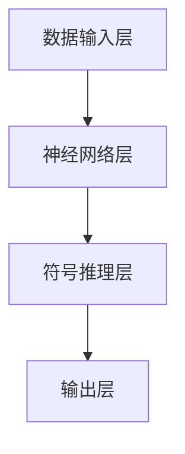

# 神经符号整合的可解释推荐系统决策推理链路

> 关键词：神经符号整合、可解释推荐系统、决策推理链路、深度学习、符号推理

> 摘要：本文聚焦于神经符号整合的可解释推荐系统决策推理链路，深入探讨该领域的核心概念、算法原理、数学模型等内容。通过结合神经网络的强大表征能力和符号推理的可解释性，详细阐述如何构建可解释的推荐系统决策推理链路。文中提供Python代码示例，展示算法的具体实现，并分析其在实际应用场景中的表现。同时，推荐相关的学习资源、开发工具和研究论文，最后总结该领域的未来发展趋势与挑战。

## 1. 背景介绍 
### 1.1 目的和范围
在当今信息爆炸的时代，推荐系统在帮助用户快速找到感兴趣的信息方面发挥着至关重要的作用。然而，大多数传统推荐系统缺乏可解释性，这使得用户难以理解推荐结果的来源和依据。神经符号整合的可解释推荐系统旨在结合神经网络的强大学习能力和符号推理的可解释性，构建一个能够清晰展示决策推理链路的推荐系统。本文的范围涵盖了神经符号整合的基本概念、核心算法原理、数学模型、实际应用案例等方面，旨在为读者全面介绍该领域的知识。

### 1.2 预期读者
本文预期读者包括对推荐系统、人工智能、机器学习等领域感兴趣的研究人员、开发者和学生。对于希望深入了解可解释推荐系统的原理和实现方法，以及如何结合神经符号技术来构建更具可解释性的推荐系统的读者来说，本文将提供有价值的参考。

### 1.3 文档结构概述
本文将按照以下结构进行组织：首先介绍核心概念与联系，包括神经符号整合和可解释推荐系统的基本原理和架构；接着详细阐述核心算法原理和具体操作步骤，并使用Python代码进行示例；然后介绍相关的数学模型和公式，并通过举例进行说明；之后给出项目实战的代码实际案例和详细解释；再探讨实际应用场景；推荐相关的工具和资源；最后总结未来发展趋势与挑战，并提供常见问题与解答和扩展阅读参考资料。

### 1.4 术语表
#### 1.4.1 核心术语定义
- **神经符号整合**：将神经网络的数值计算能力与符号推理的逻辑表达能力相结合的技术，旨在充分发挥两者的优势。
- **可解释推荐系统**：能够向用户解释推荐结果产生原因和依据的推荐系统。
- **决策推理链路**：推荐系统在做出推荐决策过程中所遵循的一系列逻辑步骤和推理过程。

#### 1.4.2 相关概念解释
- **神经网络**：一种模仿人类神经系统的计算模型，由大量的神经元组成，能够自动学习数据中的模式和特征。
- **符号推理**：基于符号逻辑进行推理和演绎的方法，具有明确的语义和规则。
- **深度学习**：神经网络的一个分支，通过构建多层神经网络来学习数据的深层次特征。

#### 1.4.3 缩略词列表
- **DNN**：Deep Neural Network，深度神经网络
- **RNN**：Recurrent Neural Network，循环神经网络
- **CNN**：Convolutional Neural Network，卷积神经网络

## 2. 核心概念与联系 
### 核心概念原理
神经符号整合的可解释推荐系统的核心思想是将神经网络的强大表征能力与符号推理的可解释性相结合。神经网络可以自动学习数据中的复杂模式和特征，而符号推理则可以基于明确的逻辑规则进行推理和演绎。在推荐系统中，神经网络可以用于对用户和物品的特征进行建模，而符号推理则可以用于解释推荐结果的产生原因。

例如，我们可以使用神经网络来学习用户的兴趣偏好和物品的特征表示，然后使用符号推理来根据这些表示生成推荐结果，并解释为什么推荐这些物品。具体来说，符号推理可以基于一些预定义的规则，如“如果用户喜欢某个类型的物品，那么推荐该类型的其他物品”，来进行推理和推荐。

### 架构的文本示意图
神经符号整合的可解释推荐系统的架构可以分为以下几个部分：
1. **数据输入层**：接收用户和物品的相关数据，如用户的历史行为数据、物品的属性数据等。
2. **神经网络层**：使用神经网络对输入数据进行特征提取和建模，得到用户和物品的特征表示。
3. **符号推理层**：基于神经网络得到的特征表示，使用符号推理规则进行推理和演绎，生成推荐结果和解释。
4. **输出层**：将推荐结果和解释输出给用户。

### Mermaid 流程图


## 3. 核心算法原理 & 具体操作步骤 
### 算法原理讲解
神经符号整合的可解释推荐系统的核心算法可以分为两个部分：神经网络建模和符号推理。

#### 神经网络建模
我们可以使用深度学习中的多层感知机（MLP）来对用户和物品的特征进行建模。MLP是一种前馈神经网络，由输入层、隐藏层和输出层组成。输入层接收用户和物品的特征向量，隐藏层对输入进行非线性变换，输出层输出用户对物品的预测评分。

以下是使用Python和PyTorch实现的MLP代码示例：
```python
import torch
import torch.nn as nn

class MLP(nn.Module):
    def __init__(self, input_dim, hidden_dim, output_dim):
        super(MLP, self).__init__()
        self.fc1 = nn.Linear(input_dim, hidden_dim)
        self.relu = nn.ReLU()
        self.fc2 = nn.Linear(hidden_dim, output_dim)

    def forward(self, x):
        out = self.fc1(x)
        out = self.relu(out)
        out = self.fc2(out)
        return out

# 示例使用
input_dim = 10
hidden_dim = 20
output_dim = 1
model = MLP(input_dim, hidden_dim, output_dim)
input_data = torch.randn(1, input_dim)
output = model(input_data)
print(output)
```

#### 符号推理
符号推理可以基于一些预定义的规则来进行。例如，我们可以定义规则“如果用户喜欢某个类型的物品，那么推荐该类型的其他物品”。在实际应用中，我们可以使用知识图谱来表示这些规则和关系，然后使用图推理算法来进行推理和推荐。

以下是一个简单的符号推理示例：
```python
# 假设我们有一个用户喜欢的物品类型列表
user_liked_types = ['type1', 'type2']

# 物品类型映射
item_type_mapping = {
    'item1': 'type1',
    'item2': 'type2',
    'item3': 'type3'
}

# 推荐该类型的其他物品
recommended_items = []
for item, item_type in item_type_mapping.items():
    if item_type in user_liked_types:
        recommended_items.append(item)

print(recommended_items)
```

### 具体操作步骤
1. **数据预处理**：对用户和物品的相关数据进行清洗、归一化等预处理操作。
2. **神经网络训练**：使用预处理后的数据训练MLP模型，得到用户和物品的特征表示。
3. **符号推理规则定义**：根据业务需求和领域知识，定义符号推理规则。
4. **符号推理**：基于神经网络得到的特征表示和定义的符号推理规则，进行推理和推荐。
5. **结果输出**：将推荐结果和解释输出给用户。

## 4. 数学模型和公式 & 详细讲解 & 举例说明 
### 神经网络建模的数学模型
在神经网络建模中，我们使用MLP来对用户和物品的特征进行建模。假设输入向量为 $\mathbf{x} \in \mathbb{R}^n$，其中 $n$ 是输入特征的维度。MLP的第一层是线性变换，其公式为：
$$\mathbf{h}_1 = \mathbf{W}_1 \mathbf{x} + \mathbf{b}_1$$
其中 $\mathbf{W}_1 \in \mathbb{R}^{m_1 \times n}$ 是权重矩阵，$\mathbf{b}_1 \in \mathbb{R}^{m_1}$ 是偏置向量，$m_1$ 是第一层隐藏层的神经元数量。

接着，我们对 $\mathbf{h}_1$ 应用非线性激活函数 $\sigma$（如ReLU）：
$$\mathbf{h}_2 = \sigma(\mathbf{h}_1)$$

最后，MLP的输出层进行另一次线性变换：
$$\hat{y} = \mathbf{W}_2 \mathbf{h}_2 + \mathbf{b}_2$$
其中 $\mathbf{W}_2 \in \mathbb{R}^{1 \times m_1}$ 是权重矩阵，$\mathbf{b}_2 \in \mathbb{R}$ 是偏置向量，$\hat{y}$ 是用户对物品的预测评分。

### 符号推理的数学模型
符号推理可以基于知识图谱进行。知识图谱是一种图结构，由实体和关系组成。假设我们有一个知识图谱 $G = (V, E)$，其中 $V$ 是实体集合，$E$ 是关系集合。符号推理可以表示为在知识图谱上的路径搜索问题。

例如，我们要推理“用户 $u$ 可能喜欢物品 $i$”，可以通过查找知识图谱中从用户 $u$ 到物品 $i$ 的路径来进行推理。如果存在一条路径 $u \xrightarrow{r_1} v_1 \xrightarrow{r_2} \cdots \xrightarrow{r_k} i$，其中 $r_1, r_2, \cdots, r_k$ 是关系，那么我们可以根据路径的语义来判断用户 $u$ 是否可能喜欢物品 $i$。

### 举例说明
假设我们有一个简单的知识图谱，包含以下实体和关系：
- 实体：用户 $u_1$，物品 $i_1$，物品 $i_2$，物品类型 $t_1$
- 关系：用户 $u_1$ 喜欢物品类型 $t_1$，物品 $i_1$ 属于物品类型 $t_1$，物品 $i_2$ 属于物品类型 $t_1$

我们要推理用户 $u_1$ 可能喜欢的物品。通过在知识图谱中查找路径，我们可以发现从用户 $u_1$ 到物品 $i_1$ 和物品 $i_2$ 都存在路径，因此可以推荐物品 $i_1$ 和物品 $i_2$ 给用户 $u_1$。

## 5. 项目实战：代码实际案例和详细解释说明 
### 5.1  开发环境搭建
为了实现神经符号整合的可解释推荐系统，我们需要搭建以下开发环境：
1. **Python**：推荐使用Python 3.7及以上版本。
2. **PyTorch**：一个开源的深度学习框架，用于构建和训练神经网络。
3. **NetworkX**：一个用于创建、操作和研究复杂网络的Python库，可用于知识图谱的表示和推理。

可以使用以下命令来安装所需的库：
```sh
pip install torch networkx
```

### 5.2  源代码详细实现和代码解读
以下是一个完整的神经符号整合的可解释推荐系统的代码示例：
```python
import torch
import torch.nn as nn
import networkx as nx

# 定义MLP模型
class MLP(nn.Module):
    def __init__(self, input_dim, hidden_dim, output_dim):
        super(MLP, self).__init__()
        self.fc1 = nn.Linear(input_dim, hidden_dim)
        self.relu = nn.ReLU()
        self.fc2 = nn.Linear(hidden_dim, output_dim)

    def forward(self, x):
        out = self.fc1(x)
        out = self.relu(out)
        out = self.fc2(out)
        return out

# 生成知识图谱
def generate_knowledge_graph():
    G = nx.Graph()
    # 添加实体
    G.add_nodes_from(['user1', 'item1', 'item2', 'type1'])
    # 添加关系
    G.add_edge('user1', 'type1', relation='likes')
    G.add_edge('item1', 'type1', relation='belongs_to')
    G.add_edge('item2', 'type1', relation='belongs_to')
    return G

# 符号推理
def symbolic_reasoning(G, user):
    recommended_items = []
    for neighbor in G.neighbors(user):
        if G[user][neighbor]['relation'] == 'likes':
            for item in G.neighbors(neighbor):
                if G[neighbor][item]['relation'] == 'belongs_to':
                    recommended_items.append(item)
    return recommended_items

# 主函数
def main():
    # 初始化MLP模型
    input_dim = 10
    hidden_dim = 20
    output_dim = 1
    model = MLP(input_dim, hidden_dim, output_dim)

    # 生成知识图谱
    G = generate_knowledge_graph()

    # 符号推理
    user = 'user1'
    recommended_items = symbolic_reasoning(G, user)

    print("MLP模型:", model)
    print("推荐物品:", recommended_items)

if __name__ == "__main__":
    main()
```

### 代码解读与分析
1. **MLP模型定义**：`MLP` 类定义了一个简单的多层感知机模型，包含一个输入层、一个隐藏层和一个输出层。
2. **知识图谱生成**：`generate_knowledge_graph` 函数生成一个简单的知识图谱，包含用户、物品和物品类型的实体，以及喜欢和属于的关系。
3. **符号推理**：`symbolic_reasoning` 函数根据知识图谱进行符号推理，找出用户可能喜欢的物品。
4. **主函数**：在 `main` 函数中，我们初始化MLP模型，生成知识图谱，进行符号推理，并输出推荐物品。

通过这个代码示例，我们可以看到如何将神经网络和符号推理相结合，实现一个简单的可解释推荐系统。

## 6. 实际应用场景 
神经符号整合的可解释推荐系统在许多实际应用场景中都有广泛的应用，以下是一些常见的应用场景：
1. **电子商务**：在电子商务平台上，可解释推荐系统可以帮助用户更好地理解推荐商品的原因，提高用户的购买意愿。例如，系统可以解释为什么推荐某件商品给用户，是因为用户之前购买过类似的商品，还是因为该商品受到了其他具有相似兴趣的用户的喜爱。
2. **新闻推荐**：在新闻推荐系统中，可解释推荐系统可以向用户解释为什么推荐某条新闻。例如，系统可以指出该新闻与用户之前阅读过的新闻主题相关，或者是因为该新闻在当前热门话题中具有较高的关注度。
3. **电影推荐**：在电影推荐领域，可解释推荐系统可以帮助用户了解推荐电影的依据。例如，系统可以说明推荐某部电影是因为用户喜欢该电影的导演、演员，或者是因为该电影的类型符合用户的兴趣偏好。
4. **医疗推荐**：在医疗领域，可解释推荐系统可以为医生提供更具可解释性的治疗方案推荐。例如，系统可以解释为什么推荐某种治疗方法，是基于患者的病情、病史以及相关的医学研究成果。

## 7. 工具和资源推荐
### 7.1 学习资源推荐
#### 7.1.1 书籍推荐
- 《深度学习》（Deep Learning）：由Ian Goodfellow、Yoshua Bengio和Aaron Courville所著，是深度学习领域的经典教材，涵盖了神经网络、深度学习模型、优化算法等方面的知识。
- 《人工智能：一种现代的方法》（Artificial Intelligence: A Modern Approach）：作者是Stuart Russell和Peter Norvig，全面介绍了人工智能的各个领域，包括知识表示、推理、机器学习等内容。
- 《推荐系统实践》：由项亮所著，详细介绍了推荐系统的原理、算法和实践经验，适合初学者入门。

#### 7.1.2 在线课程
- Coursera上的“深度学习专项课程”（Deep Learning Specialization）：由Andrew Ng教授授课，涵盖了深度学习的基础知识、卷积神经网络、循环神经网络等内容。
- edX上的“人工智能基础”（Introduction to Artificial Intelligence）：由麻省理工学院（MIT）提供，介绍了人工智能的基本概念、算法和应用。
- 中国大学MOOC上的“推荐系统原理与实践”：由清华大学的教师授课，系统地讲解了推荐系统的原理、算法和实践案例。

#### 7.1.3 技术博客和网站
- Medium：一个技术博客平台，有许多关于深度学习、推荐系统等领域的优质文章。
- arXiv：一个预印本论文库，提供了大量关于人工智能、机器学习等领域的最新研究成果。
- 机器之心：专注于人工智能领域的科技媒体，提供了丰富的技术文章、研究报告和行业动态。

### 7.2 开发工具框架推荐
#### 7.2.1 IDE和编辑器
- PyCharm：一款专门为Python开发设计的集成开发环境（IDE），具有代码编辑、调试、自动补全、版本控制等功能。
- Jupyter Notebook：一个交互式的开发环境，适合进行数据分析、模型训练和代码演示。
- Visual Studio Code：一款轻量级的代码编辑器，支持多种编程语言，并且有丰富的插件可以扩展其功能。

#### 7.2.2 调试和性能分析工具
- PyTorch Profiler：PyTorch提供的性能分析工具，可以帮助开发者分析模型的性能瓶颈，优化代码。
- TensorBoard：一个可视化工具，可用于可视化深度学习模型的训练过程、损失曲线、参数分布等信息。
- cProfile：Python标准库中的性能分析工具，可以帮助开发者找出代码中的性能瓶颈。

#### 7.2.3 相关框架和库
- PyTorch：一个开源的深度学习框架，具有动态图机制，易于使用和调试。
- TensorFlow：另一个广泛使用的深度学习框架，提供了丰富的工具和库，支持分布式训练。
- NetworkX：一个用于创建、操作和研究复杂网络的Python库，可用于知识图谱的表示和推理。

### 7.3 相关论文著作推荐
#### 7.3.1 经典论文
- 《Neural Collaborative Filtering》：提出了一种基于神经网络的协同过滤方法，用于推荐系统。
- 《Knowledge Graph Embedding: A Survey of Approaches and Applications》：对知识图谱嵌入的方法和应用进行了全面的综述。
- 《Explainable Artificial Intelligence: A Systematic Review》：对可解释人工智能的方法和技术进行了系统的综述。

#### 7.3.2 最新研究成果
- 关注顶级学术会议，如NeurIPS（神经信息处理系统大会）、ICML（国际机器学习会议）、KDD（知识发现与数据挖掘会议）等，这些会议上会发表许多关于神经符号整合、可解释推荐系统等领域的最新研究成果。
- 查阅相关的学术期刊，如Journal of Artificial Intelligence Research（JAIR）、Artificial Intelligence等。

#### 7.3.3 应用案例分析
- 可以在ACM Digital Library、IEEE Xplore等数据库中查找关于神经符号整合的可解释推荐系统在实际应用中的案例分析论文，了解这些系统在不同领域的应用效果和挑战。

## 8. 总结：未来发展趋势与挑战
### 未来发展趋势
1. **更复杂的神经符号融合方法**：未来的研究可能会探索更复杂的神经符号融合方法，以更好地结合神经网络和符号推理的优势。例如，开发新的模型架构，使得神经网络能够更好地处理符号信息，或者将符号推理的规则融入到神经网络的训练过程中。
2. **多模态信息融合**：随着多媒体数据的不断增加，未来的可解释推荐系统可能会融合多模态信息，如文本、图像、音频等。通过综合利用不同模态的数据，可以提高推荐系统的准确性和可解释性。
3. **个性化解释**：为了满足用户的个性化需求，未来的推荐系统可能会提供更加个性化的解释。例如，根据用户的知识水平和兴趣偏好，提供不同层次和形式的解释，使用户能够更好地理解推荐结果。
4. **跨领域应用**：神经符号整合的可解释推荐系统有望在更多的领域得到应用，如金融、教育、交通等。通过将该技术应用到不同的领域，可以解决这些领域中的信息推荐和决策问题。

### 挑战
1. **计算资源需求**：神经符号整合的方法通常需要大量的计算资源，特别是在处理大规模数据和复杂模型时。如何在有限的计算资源下实现高效的推理和训练是一个挑战。
2. **符号知识的获取和表示**：符号推理需要大量的符号知识，如何获取和表示这些知识是一个难题。此外，符号知识的更新和维护也需要耗费大量的人力和物力。
3. **可解释性与准确性的平衡**：在提高推荐系统可解释性的同时，如何保证推荐的准确性是一个挑战。有时候，为了提供更详细的解释，可能会牺牲一定的推荐准确性。
4. **用户对解释的接受度**：即使推荐系统能够提供解释，用户是否能够理解和接受这些解释也是一个问题。如何设计出易于用户理解和接受的解释方式是未来需要研究的方向。

## 9. 附录：常见问题与解答
### 1. 神经符号整合的可解释推荐系统与传统推荐系统有什么区别？
传统推荐系统通常缺乏可解释性，用户难以理解推荐结果的产生原因。而神经符号整合的可解释推荐系统结合了神经网络的强大学习能力和符号推理的可解释性，能够向用户解释推荐结果的依据和推理过程。

### 2. 如何衡量可解释推荐系统的性能？
可以从以下几个方面衡量可解释推荐系统的性能：
- **推荐准确性**：使用传统的推荐系统评估指标，如准确率、召回率、F1值等。
- **可解释性**：评估解释的清晰度、完整性和可信度。可以通过用户调查、专家评估等方式进行。
- **效率**：包括推理时间、训练时间等指标，衡量系统的运行效率。

### 3. 符号推理规则是如何定义的？
符号推理规则可以根据业务需求和领域知识进行定义。例如，在电子商务领域，可以定义规则“如果用户购买过某类商品，那么推荐该类商品的其他热门商品”。此外，还可以使用知识图谱来表示和管理这些规则。

### 4. 神经符号整合的可解释推荐系统在处理大规模数据时会遇到什么问题？
在处理大规模数据时，神经符号整合的可解释推荐系统可能会遇到以下问题：
- **计算资源需求大**：神经网络的训练和符号推理都需要大量的计算资源，处理大规模数据时可能会导致计算时间过长。
- **数据稀疏性**：大规模数据中可能存在数据稀疏的问题，这会影响神经网络的训练效果和符号推理的准确性。
- **知识图谱构建困难**：构建大规模的知识图谱需要耗费大量的人力和物力，并且知识图谱的更新和维护也比较困难。

## 10. 扩展阅读 & 参考资料
- 《Deep Learning for Recommender Systems》
- 《Knowledge Representation and Reasoning》
- https://paperswithcode.com/ （提供了许多关于深度学习和推荐系统的代码实现和论文）
- https://www.researchgate.net/ （一个科研社交网络平台，提供了许多学术研究成果和讨论）

作者：AI天才研究院/AI Genius Institute & 禅与计算机程序设计艺术 /Zen And The Art of Computer Programming