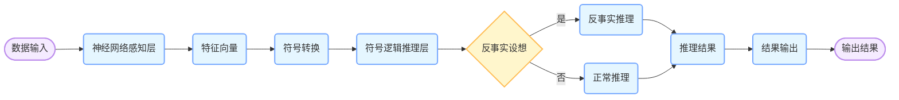

# 神经符号方法增强AI的反事实推理能力

> 关键词：神经符号方法、AI、反事实推理能力、深度学习、符号逻辑

> 摘要：本文聚焦于神经符号方法如何增强AI的反事实推理能力。首先介绍了研究背景，包括目的、预期读者、文档结构和相关术语。接着阐述了神经符号方法与反事实推理的核心概念及联系，通过文本示意图和Mermaid流程图展示其架构。详细讲解了核心算法原理，并给出Python源代码示例。深入探讨了相关数学模型和公式，结合具体例子进行说明。通过项目实战，展示了代码的实际案例及详细解释。分析了神经符号方法增强AI反事实推理能力的实际应用场景，推荐了学习资源、开发工具框架和相关论文著作。最后总结了未来发展趋势与挑战，解答了常见问题，并提供了扩展阅读和参考资料。

## 1. 背景介绍 
### 1.1 目的和范围
随着人工智能技术的飞速发展，AI在诸多领域取得了显著成就。然而，当前的AI系统在处理复杂的认知任务，尤其是反事实推理方面仍存在不足。反事实推理是指设想与事实相反的情况，并推测可能产生的结果，这对于人类的决策、因果分析等至关重要。神经符号方法结合了神经网络的强大感知能力和符号逻辑的精确推理能力，有望为增强AI的反事实推理能力提供有效的解决方案。

本文的范围涵盖了神经符号方法的基本原理、如何应用该方法增强AI的反事实推理能力，包括算法原理、数学模型、实际案例分析等方面。同时，探讨了该技术在不同领域的应用场景，以及未来的发展趋势和面临的挑战。

### 1.2 预期读者
本文预期读者包括人工智能领域的研究人员、开发者、学生，以及对AI技术发展感兴趣的专业人士。对于希望深入了解神经符号方法和反事实推理的读者，本文将提供系统的知识和技术指导；对于正在从事相关研究和开发的人员，本文的案例分析和技术探讨可能为其提供新的思路和方法。

### 1.3 文档结构概述
本文将按照以下结构进行阐述：
1. 背景介绍：介绍研究目的、预期读者、文档结构和相关术语。
2. 核心概念与联系：阐述神经符号方法和反事实推理的核心概念，展示它们之间的联系，并通过文本示意图和Mermaid流程图说明其架构。
3. 核心算法原理 & 具体操作步骤：详细讲解神经符号方法增强AI反事实推理能力的核心算法原理，并给出Python源代码示例。
4. 数学模型和公式 & 详细讲解 & 举例说明：介绍相关的数学模型和公式，结合具体例子进行详细解释。
5. 项目实战：代码实际案例和详细解释说明：通过实际项目案例，展示代码的实现过程和详细解读。
6. 实际应用场景：分析神经符号方法增强AI反事实推理能力在不同领域的应用场景。
7. 工具和资源推荐：推荐学习资源、开发工具框架和相关论文著作。
8. 总结：未来发展趋势与挑战：总结神经符号方法增强AI反事实推理能力的未来发展趋势和面临的挑战。
9. 附录：常见问题与解答：解答读者可能遇到的常见问题。
10. 扩展阅读 & 参考资料：提供扩展阅读和参考资料，方便读者进一步深入学习。

### 1.4 术语表
#### 1.4.1 核心术语定义
- **神经符号方法**：将神经网络和符号逻辑相结合的方法，利用神经网络的感知能力处理数据，利用符号逻辑的推理能力进行知识表示和推理。
- **AI（人工智能）**：使计算机系统能够执行通常需要人类智能才能完成的任务的技术。
- **反事实推理**：设想与事实相反的情况，并推测可能产生的结果的推理方式。
- **神经网络**：一种模仿人类神经系统的计算模型，由大量的神经元组成，用于处理复杂的非线性关系。
- **符号逻辑**：用符号表示命题和推理规则，进行精确的逻辑推理的方法。

#### 1.4.2 相关概念解释
- **深度学习**：神经网络的一个分支，通过多层神经网络自动学习数据的特征和模式。
- **知识图谱**：一种以图的形式表示知识的方法，节点表示实体，边表示实体之间的关系。
- **因果推理**：研究事物之间因果关系的推理方法，与反事实推理密切相关。

#### 1.4.3 缩略词列表
- **AI**：Artificial Intelligence（人工智能）
- **ML**：Machine Learning（机器学习）
- **DL**：Deep Learning（深度学习）

## 2. 核心概念与联系 

### 核心概念原理
#### 神经符号方法
神经符号方法旨在将神经网络的强大感知能力和符号逻辑的精确推理能力相结合。神经网络擅长处理复杂的感知任务，如图像识别、语音识别等，能够自动从数据中学习特征和模式。然而，神经网络缺乏明确的知识表示和推理能力，难以处理需要逻辑推理的任务。符号逻辑则通过符号和规则来表示知识和进行推理，具有精确性和可解释性。神经符号方法通过将神经网络和符号逻辑进行融合，使得AI系统既能够处理感知任务，又能够进行逻辑推理。

#### 反事实推理
反事实推理是人类认知的重要组成部分，它允许我们设想与事实相反的情况，并推测可能产生的结果。例如，我们可以思考“如果我昨天没有错过公交车，我是否能按时到达公司”。反事实推理对于决策、因果分析等任务至关重要，因为它能够帮助我们评估不同决策的后果，理解事物之间的因果关系。

### 架构的文本示意图
神经符号方法增强AI反事实推理能力的架构可以描述如下：
1. **数据输入层**：接收原始数据，如文本、图像、传感器数据等。
2. **神经网络感知层**：使用神经网络对输入数据进行特征提取和处理，将原始数据转换为特征向量。
3. **符号逻辑推理层**：将神经网络输出的特征向量转换为符号表示，利用符号逻辑进行推理。在反事实推理中，符号逻辑可以根据预设的规则和知识，设想与事实相反的情况，并进行推理。
4. **结果输出层**：将符号逻辑推理的结果转换为可理解的输出，如文本解释、决策建议等。

### Mermaid流程图


## 3. 核心算法原理 & 具体操作步骤 

### 核心算法原理
神经符号方法增强AI反事实推理能力的核心算法可以分为以下几个步骤：
1. **数据预处理**：对输入数据进行清洗、特征提取等预处理操作，将原始数据转换为适合神经网络处理的格式。
2. **神经网络训练**：使用深度学习算法训练神经网络，使其能够从输入数据中学习特征和模式。
3. **符号转换**：将神经网络输出的特征向量转换为符号表示，建立特征向量与符号之间的映射关系。
4. **符号逻辑推理**：利用符号逻辑进行推理，根据预设的规则和知识，设想与事实相反的情况，并进行推理。
5. **结果转换**：将符号逻辑推理的结果转换为可理解的输出，如文本解释、决策建议等。

### 具体操作步骤及Python源代码示例
以下是一个简单的Python代码示例，演示了神经符号方法增强AI反事实推理能力的基本过程。假设我们要解决一个简单的分类问题，并进行反事实推理。

```python
import numpy as np
from sklearn.neural_network import MLPClassifier
from sympy import symbols, Eq, solve

# 步骤1：数据预处理
# 生成一些示例数据
X = np.array([[0, 0], [0, 1], [1, 0], [1, 1]])
y = np.array([0, 1, 1, 0])

# 步骤2：神经网络训练
# 使用多层感知器（MLP）训练神经网络
clf = MLPClassifier(hidden_layer_sizes=(4,), activation='relu', max_iter=1000)
clf.fit(X, y)

# 步骤3：符号转换
# 定义符号变量
x1, x2 = symbols('x1 x2')
# 这里简单假设神经网络的输出可以用符号表达式表示
# 实际中需要更复杂的转换方法
def feature_to_symbol(feature):
    return [x1, x2]

# 步骤4：符号逻辑推理
# 进行反事实推理，假设输入特征发生变化
original_feature = np.array([0, 0])
counterfactual_feature = np.array([1, 1])

# 预测原始特征的结果
original_prediction = clf.predict([original_feature])
# 预测反事实特征的结果
counterfactual_prediction = clf.predict([counterfactual_feature])

# 进行符号推理，假设我们要找出使输出改变的条件
# 这里简单假设输出是一个二元分类问题
# 定义符号方程
output_symbol = clf.predict([feature_to_symbol(original_feature)])[0]
counterfactual_output_symbol = clf.predict([feature_to_symbol(counterfactual_feature)])[0]
equation = Eq(output_symbol, counterfactual_output_symbol)
# 解方程找出使输出改变的条件
solution = solve(equation, [x1, x2])

# 步骤5：结果转换
print(f"原始特征: {original_feature}, 预测结果: {original_prediction}")
print(f"反事实特征: {counterfactual_feature}, 预测结果: {counterfactual_prediction}")
print(f"使输出改变的条件: {solution}")
```

### 代码解释
1. **数据预处理**：生成一些示例数据，并将其分为输入特征 `X` 和标签 `y`。
2. **神经网络训练**：使用 `MLPClassifier` 训练一个多层感知器神经网络。
3. **符号转换**：定义符号变量 `x1` 和 `x2`，并将输入特征转换为符号表示。
4. **符号逻辑推理**：进行反事实推理，假设输入特征发生变化，预测原始特征和反事实特征的结果。使用符号方程找出使输出改变的条件。
5. **结果转换**：打印原始特征、反事实特征的预测结果，以及使输出改变的条件。

## 4. 数学模型和公式 & 详细讲解 & 举例说明 

### 数学模型
神经符号方法增强AI反事实推理能力的数学模型可以基于概率图模型和逻辑推理规则。假设我们有一个概率图模型 $G=(V, E)$，其中 $V$ 是节点集合，$E$ 是边集合。每个节点 $v \in V$ 表示一个随机变量，边表示变量之间的依赖关系。

我们可以使用贝叶斯网络来表示概率图模型，贝叶斯网络的联合概率分布可以表示为：
$$P(X_1, X_2, \cdots, X_n) = \prod_{i=1}^{n} P(X_i | Pa(X_i))$$
其中 $X_1, X_2, \cdots, X_n$ 是随机变量，$Pa(X_i)$ 是 $X_i$ 的父节点集合。

在反事实推理中，我们可以通过干预概率图模型来设想与事实相反的情况。假设我们要对变量 $X_j$ 进行干预，将其值设置为 $x_j'$，则干预后的概率分布可以表示为：
$$P(X_1, X_2, \cdots, X_n | do(X_j = x_j')) = \prod_{i \neq j} P(X_i | Pa(X_i)) \cdot \delta(X_j - x_j')$$
其中 $\delta$ 是狄拉克函数。

### 详细讲解
贝叶斯网络的联合概率分布公式表示了所有随机变量的联合概率可以分解为每个变量在其父节点条件下的条件概率的乘积。这使得我们可以通过局部的条件概率来计算全局的联合概率。

在反事实推理中，干预操作 `do(X_j = x_j')` 表示我们强制将变量 $X_j$ 的值设置为 $x_j'$，而不考虑其原始的因果关系。干预后的概率分布通过将 $X_j$ 的概率设置为狄拉克函数来表示这种强制赋值。

### 举例说明
假设我们有一个简单的贝叶斯网络，包含三个变量：$X_1$、$X_2$ 和 $X_3$，其中 $X_1$ 是 $X_2$ 的父节点，$X_2$ 是 $X_3$ 的父节点。它们的条件概率分布如下：
- $P(X_1 = 0) = 0.6$，$P(X_1 = 1) = 0.4$
- $P(X_2 = 0 | X_1 = 0) = 0.7$，$P(X_2 = 1 | X_1 = 0) = 0.3$
- $P(X_2 = 0 | X_1 = 1) = 0.2$，$P(X_2 = 1 | X_1 = 1) = 0.8$
- $P(X_3 = 0 | X_2 = 0) = 0.8$，$P(X_3 = 1 | X_2 = 0) = 0.2$
- $P(X_3 = 0 | X_2 = 1) = 0.3$，$P(X_3 = 1 | X_2 = 1) = 0.7$

我们可以计算联合概率分布：
$$P(X_1, X_2, X_3) = P(X_1) \cdot P(X_2 | X_1) \cdot P(X_3 | X_2)$$

假设我们观察到 $X_1 = 0$，$X_2 = 0$，$X_3 = 0$，现在我们要进行反事实推理，设想如果 $X_2$ 的值为 $1$ 会发生什么。我们可以进行干预操作 `do(X_2 = 1)`，计算干预后的概率分布：
$$P(X_1, X_3 | do(X_2 = 1)) = P(X_1) \cdot P(X_3 | X_2 = 1)$$

通过计算干预后的概率分布，我们可以预测在 $X_2$ 为 $1$ 的情况下，$X_1$ 和 $X_3$ 的可能取值。

## 5. 项目实战：代码实际案例和详细解释说明 

### 5.1  开发环境搭建
为了实现神经符号方法增强AI反事实推理能力的项目，我们需要搭建以下开发环境：
1. **Python环境**：建议使用Python 3.7及以上版本。可以通过Anaconda或Python官方网站下载安装。
2. **深度学习库**：使用 `TensorFlow` 或 `PyTorch` 作为深度学习框架。可以使用以下命令安装：
    - `TensorFlow`：`pip install tensorflow`
    - `PyTorch`：根据自己的CUDA版本和操作系统选择合适的安装命令，具体可以参考 [PyTorch官方网站](https://pytorch.org/get-started/locally/)。
3. **符号计算库**：使用 `SymPy` 进行符号计算。可以使用以下命令安装：`pip install sympy`
4. **数据处理库**：使用 `NumPy` 和 `Pandas` 进行数据处理。可以使用以下命令安装：
    - `NumPy`：`pip install numpy`
    - `Pandas`：`pip install pandas`

### 5.2  源代码详细实现和代码解读
以下是一个更完整的项目实战代码示例，使用 `PyTorch` 实现一个简单的神经符号方法增强AI反事实推理能力的模型。

```python
import torch
import torch.nn as nn
import torch.optim as optim
from sympy import symbols, Eq, solve

# 步骤1：定义数据集
# 生成一些示例数据
X = torch.tensor([[0, 0], [0, 1], [1, 0], [1, 1]], dtype=torch.float32)
y = torch.tensor([0, 1, 1, 0], dtype=torch.long)

# 步骤2：定义神经网络模型
class NeuralNetwork(nn.Module):
    def __init__(self):
        super(NeuralNetwork, self).__init__()
        self.fc1 = nn.Linear(2, 4)
        self.relu = nn.ReLU()
        self.fc2 = nn.Linear(4, 2)

    def forward(self, x):
        x = self.fc1(x)
        x = self.relu(x)
        x = self.fc2(x)
        return x

model = NeuralNetwork()

# 步骤3：定义损失函数和优化器
criterion = nn.CrossEntropyLoss()
optimizer = optim.Adam(model.parameters(), lr=0.01)

# 步骤4：训练神经网络
num_epochs = 1000
for epoch in range(num_epochs):
    outputs = model(X)
    loss = criterion(outputs, y)

    optimizer.zero_grad()
    loss.backward()
    optimizer.step()

    if (epoch + 1) % 100 == 0:
        print(f'Epoch [{epoch+1}/{num_epochs}], Loss: {loss.item():.4f}')

# 步骤5：符号转换
# 定义符号变量
x1, x2 = symbols('x1 x2')
# 这里简单假设神经网络的输入可以用符号表达式表示
# 实际中需要更复杂的转换方法
def feature_to_symbol(feature):
    return [x1, x2]

# 步骤6：符号逻辑推理
# 进行反事实推理，假设输入特征发生变化
original_feature = torch.tensor([[0, 0]], dtype=torch.float32)
counterfactual_feature = torch.tensor([[1, 1]], dtype=torch.float32)

# 预测原始特征的结果
with torch.no_grad():
    original_output = model(original_feature)
    original_prediction = torch.argmax(original_output, dim=1).item()

# 预测反事实特征的结果
with torch.no_grad():
    counterfactual_output = model(counterfactual_feature)
    counterfactual_prediction = torch.argmax(counterfactual_output, dim=1).item()

# 进行符号推理，假设我们要找出使输出改变的条件
# 这里简单假设输出是一个二元分类问题
# 定义符号方程
output_symbol = torch.argmax(model(torch.tensor([feature_to_symbol(original_feature[0])], dtype=torch.float32)), dim=1).item()
counterfactual_output_symbol = torch.argmax(model(torch.tensor([feature_to_symbol(counterfactual_feature[0])], dtype=torch.float32)), dim=1).item()
equation = Eq(output_symbol, counterfactual_output_symbol)
# 解方程找出使输出改变的条件
solution = solve(equation, [x1, x2])

# 步骤7：结果转换
print(f"原始特征: {original_feature.numpy()}, 预测结果: {original_prediction}")
print(f"反事实特征: {counterfactual_feature.numpy()}, 预测结果: {counterfactual_prediction}")
print(f"使输出改变的条件: {solution}")
```

### 代码解读与分析
1. **数据集定义**：生成一些示例数据，包括输入特征 `X` 和标签 `y`。
2. **神经网络模型定义**：定义一个简单的两层神经网络模型，包含一个全连接层、一个ReLU激活函数和一个输出层。
3. **损失函数和优化器定义**：使用交叉熵损失函数和Adam优化器进行模型训练。
4. **神经网络训练**：通过多次迭代训练神经网络，不断更新模型参数，使损失函数最小化。
5. **符号转换**：定义符号变量 `x1` 和 `x2`，并将输入特征转换为符号表示。
6. **符号逻辑推理**：进行反事实推理，假设输入特征发生变化，预测原始特征和反事实特征的结果。使用符号方程找出使输出改变的条件。
7. **结果转换**：打印原始特征、反事实特征的预测结果，以及使输出改变的条件。

## 6. 实际应用场景 
神经符号方法增强AI反事实推理能力在许多领域都有重要的应用场景，以下是一些具体的例子：
1. **医疗领域**：在医疗决策中，医生需要考虑不同治疗方案的后果。神经符号方法可以帮助医生进行反事实推理，设想如果采用不同的治疗方案，患者的病情会如何发展。例如，医生可以使用该方法分析如果对某个患者采用了另一种药物治疗，患者的康复情况是否会更好。
2. **金融领域**：在金融风险评估和投资决策中，反事实推理非常重要。神经符号方法可以帮助金融机构评估不同市场条件下的风险和收益。例如，银行可以使用该方法分析如果利率发生变化，贷款违约率会如何变化，从而制定更合理的风险管理策略。
3. **自动驾驶领域**：在自动驾驶系统中，车辆需要能够预测不同情况下的交通状况。神经符号方法可以帮助自动驾驶车辆进行反事实推理，设想如果其他车辆采取了不同的行驶策略，自己应该如何应对。例如，车辆可以分析如果前方车辆突然刹车，自己是否能够及时停下来，从而做出更安全的驾驶决策。
4. **教育领域**：在个性化教育中，教师需要根据学生的学习情况制定不同的教学方案。神经符号方法可以帮助教师进行反事实推理，设想如果采用不同的教学方法，学生的学习效果会如何。例如，教师可以使用该方法分析如果对某个学生采用了更多的实践教学，学生的成绩是否会提高。

## 7. 工具和资源推荐
### 7.1 学习资源推荐
#### 7.1.1 书籍推荐
- 《深度学习》（Deep Learning）：由Ian Goodfellow、Yoshua Bengio和Aaron Courville撰写，是深度学习领域的经典教材，涵盖了神经网络、深度学习算法等方面的知识。
- 《人工智能：一种现代的方法》（Artificial Intelligence: A Modern Approach）：由Stuart Russell和Peter Norvig撰写，是人工智能领域的权威教材，介绍了人工智能的各个方面，包括搜索算法、知识表示、推理等。
- 《因果推理入门》（Causal Inference in Statistics: A Primer）：由Judea Pearl、Madelyn Glymour和Nicholas P. Jewell撰写，详细介绍了因果推理的基本概念和方法，对于理解反事实推理非常有帮助。

#### 7.1.2 在线课程
- Coursera上的“深度学习专项课程”（Deep Learning Specialization）：由Andrew Ng教授授课，涵盖了深度学习的基础知识和应用，包括神经网络、卷积神经网络、循环神经网络等。
- edX上的“人工智能导论”（Introduction to Artificial Intelligence）：由麻省理工学院（MIT）的教师授课，介绍了人工智能的基本概念、算法和应用。
- Kaggle上的“因果推理与机器学习”（Causal Inference and Machine Learning）：提供了因果推理和机器学习的实践教程和案例分析。

#### 7.1.3 技术博客和网站
- Medium上的AI相关博客：有许多AI领域的专家和爱好者在Medium上分享他们的研究成果和经验，如Towards Data Science、AI in Plain English等。
- ArXiv.org：是一个开放获取的科学文献库，包含了大量的AI研究论文，对于了解最新的研究动态非常有帮助。
- AI开源社区：如GitHub、GitLab等，有许多开源的AI项目和代码可供学习和参考。

### 7.2 开发工具框架推荐
#### 7.2.1 IDE和编辑器
- PyCharm：是一款专业的Python集成开发环境（IDE），提供了丰富的代码编辑、调试、版本控制等功能，非常适合Python开发。
- Jupyter Notebook：是一个交互式的开发环境，支持Python、R等多种编程语言，方便进行数据探索、模型训练和结果展示。
- Visual Studio Code：是一款轻量级的代码编辑器，支持多种编程语言和插件，具有强大的代码编辑和调试功能。

#### 7.2.2 调试和性能分析工具
- TensorBoard：是TensorFlow提供的一个可视化工具，可以用于监控模型训练过程、可视化模型结构、分析训练数据等。
- PyTorch Profiler：是PyTorch提供的一个性能分析工具，可以帮助开发者找出模型中的性能瓶颈，优化代码性能。
- cProfile：是Python标准库中的一个性能分析工具，可以用于分析Python代码的运行时间和函数调用次数。

#### 7.2.3 相关框架和库
- TensorFlow：是一个开源的深度学习框架，提供了丰富的深度学习模型和工具，支持分布式训练和部署。
- PyTorch：是另一个流行的深度学习框架，具有动态图计算的特点，易于使用和调试。
- SymPy：是一个Python库，用于符号计算和代数运算，非常适合进行符号逻辑推理。

### 7.3 相关论文著作推荐
#### 7.3.1 经典论文
- “Deep Neural Networks and Symbolic Reasoning: A Survey”：对神经符号方法进行了全面的综述，介绍了神经符号方法的发展历程、主要方法和应用场景。
- “Causal Inference in Statistics: A Primer”：详细介绍了因果推理的基本概念和方法，为反事实推理提供了理论基础。
- “The Book of Why: The New Science of Cause and Effect”：由Judea Pearl撰写，从哲学和科学的角度探讨了因果关系和反事实推理的重要性。

#### 7.3.2 最新研究成果
- 可以关注每年的顶级AI会议，如NeurIPS、ICML、CVPR等，这些会议上会发表许多关于神经符号方法和反事实推理的最新研究成果。
- 关注知名的AI研究机构和实验室的网站，如OpenAI、DeepMind等，他们经常会发布自己的研究论文和成果。

#### 7.3.3 应用案例分析
- 可以在学术数据库（如IEEE Xplore、ACM Digital Library等）中搜索关于神经符号方法和反事实推理在不同领域的应用案例分析，了解这些技术在实际应用中的效果和挑战。

## 8. 总结：未来发展趋势与挑战
### 未来发展趋势
1. **更强大的融合方法**：未来，神经符号方法将不断发展，开发出更强大的融合方法，使神经网络和符号逻辑能够更好地结合，提高AI的反事实推理能力。
2. **跨领域应用拓展**：神经符号方法增强AI反事实推理能力将在更多领域得到应用，如智能交通、智能家居、工业自动化等，为这些领域带来更智能、更高效的解决方案。
3. **可解释性和透明度提升**：随着人们对AI系统可解释性和透明度的要求越来越高，神经符号方法将更加注重模型的可解释性，使得AI的反事实推理过程和结果更容易被人类理解和接受。
4. **与其他技术的融合**：神经符号方法可能会与其他技术，如强化学习、迁移学习等相结合，进一步提升AI的智能水平和适应性。

### 挑战
1. **融合难度大**：神经网络和符号逻辑的融合是一个具有挑战性的问题，需要解决数据表示、知识表示、推理机制等方面的差异，实现两者的无缝结合。
2. **数据和知识获取**：反事实推理需要大量的数据和知识支持，如何获取高质量的数据和知识，并将其有效地融入到神经符号模型中，是一个亟待解决的问题。
3. **计算资源需求高**：神经符号方法通常需要较高的计算资源，尤其是在处理大规模数据和复杂模型时，如何优化算法和模型结构，降低计算成本，是一个重要的挑战。
4. **可解释性的局限性**：虽然神经符号方法在一定程度上提高了模型的可解释性，但仍然存在一些局限性，如何进一步提升模型的可解释性，使其能够满足实际应用的需求，是未来的研究方向之一。

## 9. 附录：常见问题与解答
### 问题1：神经符号方法和传统的神经网络方法有什么区别？
神经符号方法结合了神经网络的感知能力和符号逻辑的推理能力，而传统的神经网络方法主要侧重于从数据中学习特征和模式，缺乏明确的知识表示和推理能力。神经符号方法可以更好地处理需要逻辑推理的任务，并且具有更高的可解释性。

### 问题2：反事实推理在实际应用中有什么作用？
反事实推理可以帮助我们评估不同决策的后果，理解事物之间的因果关系。在实际应用中，它可以用于医疗决策、金融风险评估、自动驾驶等领域，为决策者提供更全面的信息，从而做出更合理的决策。

### 问题3：神经符号方法增强AI反事实推理能力需要大量的数据吗？
是的，神经符号方法增强AI反事实推理能力通常需要大量的数据和知识支持。数据可以用于训练神经网络，学习数据的特征和模式；知识可以用于符号逻辑推理，提供推理的规则和依据。

### 问题4：如何评估神经符号方法增强AI反事实推理能力的效果？
可以从多个方面评估神经符号方法增强AI反事实推理能力的效果，如推理的准确性、可解释性、计算效率等。可以使用一些指标，如准确率、召回率、F1值等，来评估推理的准确性；可以通过可视化和解释推理过程，评估模型的可解释性；可以通过测量模型的训练时间和推理时间，评估计算效率。

## 10. 扩展阅读 & 参考资料
### 扩展阅读
- “Probabilistic Graphical Models: Principles and Techniques”：深入介绍了概率图模型的原理和技术，对于理解神经符号方法中的概率推理部分非常有帮助。
- “Symbolic Artificial Intelligence: A Modern Approach”：介绍了符号人工智能的基本概念和方法，为神经符号方法的符号逻辑推理提供了理论基础。
- “Counterfactuals and Causal Inference: Methods and Principles for Social Research”：详细探讨了反事实推理在社会研究中的应用和方法。

### 参考资料
1. Goodfellow, I., Bengio, Y., & Courville, A. (2016). Deep Learning. MIT Press.
2. Russell, S. J., & Norvig, P. (2016). Artificial Intelligence: A Modern Approach. Pearson.
3. Pearl, J., Glymour, M., & Jewell, N. P. (2016). Causal Inference in Statistics: A Primer. Wiley.

作者：AI天才研究院/AI Genius Institute & 禅与计算机程序设计艺术 /Zen And The Art of Computer Programming