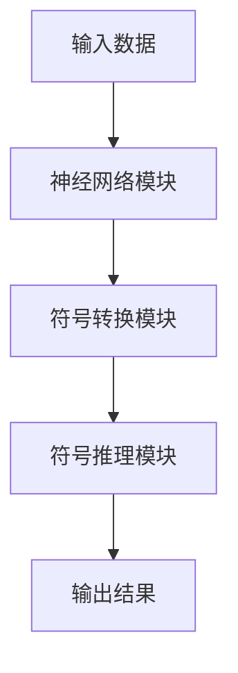

# 神经符号方法增强AI的抽象类比推理能力研究

> 关键词：神经符号方法、人工智能、抽象类比推理、知识表示、机器学习

> 摘要：本文聚焦于神经符号方法在增强AI抽象类比推理能力方面的研究。首先介绍了研究的背景和意义，明确目的和范围，界定了相关术语。接着阐述了神经符号方法与抽象类比推理的核心概念及它们之间的联系，给出了原理和架构的文本示意图与Mermaid流程图。详细讲解了核心算法原理，并使用Python代码进行说明。探讨了相关的数学模型和公式，通过举例加深理解。进行项目实战，从开发环境搭建到源代码实现和解读。分析了实际应用场景，推荐了学习资源、开发工具框架和相关论文著作。最后总结了未来发展趋势与挑战，提供了常见问题解答和扩展阅读参考资料，旨在全面深入地研究神经符号方法如何提升AI的抽象类比推理能力。

## 1. 背景介绍 
### 1.1 目的和范围
在人工智能领域，抽象类比推理是一种高级的认知能力，它能够帮助AI系统从已知的知识和经验中，通过类比的方式推导出新的知识和解决方案。然而，传统的人工智能方法在处理抽象类比推理任务时面临诸多挑战，例如难以处理复杂的语义信息、缺乏可解释性等。神经符号方法结合了神经网络的强大感知能力和符号系统的逻辑推理能力，为增强AI的抽象类比推理能力提供了新的途径。

本研究的目的在于深入探讨神经符号方法如何有效地增强AI的抽象类比推理能力，分析其原理、算法和应用。研究范围涵盖了神经符号方法的理论基础、核心算法、数学模型，以及在实际项目中的应用案例，同时还会探讨相关的工具和资源，为进一步的研究和实践提供参考。

### 1.2 预期读者
本文的预期读者包括人工智能领域的研究人员、开发者、学生，以及对AI抽象类比推理感兴趣的技术爱好者。对于研究人员，本文可以提供新的研究思路和方法；对于开发者，有助于他们将神经符号方法应用到实际项目中；对于学生，能够帮助他们深入理解人工智能的高级概念和技术；对于技术爱好者，能让他们了解到AI领域的前沿动态。

### 1.3 文档结构概述
本文将按照以下结构进行组织：首先介绍背景知识，包括研究的目的、预期读者和文档结构概述，同时给出相关术语的定义和解释。接着阐述神经符号方法与抽象类比推理的核心概念及联系，展示其原理和架构。详细讲解核心算法原理，并给出Python代码实现。分析相关的数学模型和公式，通过具体例子进行说明。进行项目实战，从环境搭建到代码实现和解读。探讨实际应用场景，推荐相关的学习资源、开发工具框架和论文著作。最后总结未来发展趋势与挑战，提供常见问题解答和扩展阅读参考资料。

### 1.4 术语表
#### 1.4.1 核心术语定义
- **神经符号方法**：将神经网络和符号系统相结合的方法，旨在利用神经网络的感知能力处理数据，同时利用符号系统的逻辑推理能力进行知识表示和推理。
- **抽象类比推理**：一种基于类比的推理方式，通过识别不同事物之间的抽象相似性，从已知的情况推导出未知的情况。
- **知识表示**：将知识以计算机能够理解和处理的形式进行表示，以便于知识的存储、检索和推理。
- **神经网络**：一种模仿人类神经系统的计算模型，由大量的神经元组成，能够自动学习数据中的模式和特征。
- **符号系统**：一种基于符号和规则的系统，用于表示知识和进行逻辑推理。

#### 1.4.2 相关概念解释
- **感知能力**：指神经网络能够从输入数据中提取特征和模式的能力，例如图像识别、语音识别等。
- **逻辑推理能力**：指符号系统能够根据已知的知识和规则进行推理和演绎的能力，例如定理证明、问题求解等。
- **可解释性**：指模型的决策过程和结果能够被人类理解和解释的程度，在人工智能中，可解释性是一个重要的研究方向。

#### 1.4.3 缩略词列表
- **AI**：Artificial Intelligence，人工智能
- **NN**：Neural Network，神经网络
- **KB**：Knowledge Base，知识库

## 2. 核心概念与联系 

### 核心概念原理
#### 神经符号方法原理
神经符号方法的核心思想是将神经网络和符号系统有机地结合起来。神经网络具有强大的感知能力，能够处理复杂的非结构化数据，如图像、文本等。它通过大量的数据进行训练，学习数据中的模式和特征。例如，在图像识别任务中，卷积神经网络（CNN）可以自动学习图像中的边缘、纹理等特征。

符号系统则具有明确的语义和逻辑推理能力。它使用符号来表示知识和概念，通过规则进行推理和演绎。例如，在专家系统中，使用产生式规则来表示知识，根据输入的事实进行推理得出结论。

神经符号方法通过将神经网络的输出转化为符号表示，或者将符号信息融入到神经网络的训练过程中，实现两者的优势互补。例如，可以使用神经网络对图像进行识别，将识别结果转化为符号表示，然后利用符号系统进行进一步的推理。

#### 抽象类比推理原理
抽象类比推理是基于类比的思想，通过识别不同事物之间的抽象相似性来进行推理。它的基本过程包括以下几个步骤：
1. **特征提取**：从不同的事物中提取相关的特征。例如，在比较两个动物时，可以提取它们的外形、生活习性等特征。
2. **相似性判断**：判断不同事物之间的特征是否相似。可以使用各种相似性度量方法，如欧氏距离、余弦相似度等。
3. **类比映射**：如果发现相似性，则建立两个事物之间的类比映射关系。例如，如果发现猫和老虎在外形和生活习性上有相似之处，可以建立它们之间的类比映射。
4. **推理和预测**：根据类比映射关系，从已知事物的属性和行为推导出未知事物的属性和行为。例如，如果知道猫喜欢吃鱼，可以推测老虎也可能喜欢吃肉。

### 架构的文本示意图
```plaintext
+----------------------+
|  输入数据（图像、文本等）  |
+----------------------+
           |
           v
+----------------------+
|    神经网络模块     |
|  （特征提取、分类等）  |
+----------------------+
           |
           v
+----------------------+
|    符号转换模块     |
|  （将神经网络输出转换为符号） |
+----------------------+
           |
           v
+----------------------+
|    符号推理模块     |
|  （基于知识库和规则推理） |
+----------------------+
           |
           v
+----------------------+
|    输出结果（推理结论）  |
+----------------------+
```

### Mermaid流程图


## 3. 核心算法原理 & 具体操作步骤 

### 核心算法原理
#### 神经网络与符号转换算法
在神经符号方法中，需要将神经网络的输出转换为符号表示。一种常见的方法是使用分类器，将神经网络的输出映射到预定义的符号类别中。例如，在图像分类任务中，神经网络输出的是各个类别的概率分布，可以选择概率最大的类别作为符号表示。

以下是一个简单的Python代码示例，展示了如何使用一个简单的全连接神经网络进行图像分类，并将输出转换为符号表示：

```python
import torch
import torch.nn as nn
import torch.optim as optim

# 定义一个简单的全连接神经网络
class SimpleNet(nn.Module):
    def __init__(self, input_size, num_classes):
        super(SimpleNet, self).__init__()
        self.fc = nn.Linear(input_size, num_classes)

    def forward(self, x):
        out = self.fc(x)
        return out

# 模拟输入数据
input_size = 10
num_classes = 3
x = torch.randn(1, input_size)

# 初始化模型
model = SimpleNet(input_size, num_classes)

# 前向传播
output = model(x)

# 转换为符号表示
_, predicted = torch.max(output.data, 1)
symbol = predicted.item()

print(f"神经网络输出: {output}")
print(f"符号表示: {symbol}")
```

#### 符号推理算法
符号推理通常基于知识库和规则进行。一种常见的推理方法是基于产生式规则的推理。产生式规则的一般形式为“IF 条件 THEN 结论”。推理过程是根据输入的事实，匹配规则的条件部分，如果匹配成功，则执行规则的结论部分。

以下是一个简单的Python代码示例，展示了如何进行基于产生式规则的推理：

```python
# 定义知识库和规则
knowledge_base = {
    "A": True,
    "B": False
}

rules = [
    {"condition": ["A"], "conclusion": "C"},
    {"condition": ["B"], "conclusion": "D"}
]

# 推理函数
def inference(knowledge_base, rules):
    new_facts = []
    for rule in rules:
        condition_met = True
        for condition in rule["condition"]:
            if condition not in knowledge_base or not knowledge_base[condition]:
                condition_met = False
                break
        if condition_met:
            conclusion = rule["conclusion"]
            if conclusion not in knowledge_base:
                new_facts.append(conclusion)
                knowledge_base[conclusion] = True
    return new_facts

# 进行推理
new_facts = inference(knowledge_base, rules)
print(f"新的事实: {new_facts}")
print(f"更新后的知识库: {knowledge_base}")
```

### 具体操作步骤
1. **数据准备**：收集和整理用于训练神经网络和进行推理的数据集。数据集应包含输入数据和对应的标签或符号信息。
2. **神经网络训练**：使用准备好的数据集对神经网络进行训练，调整网络的参数以最小化损失函数。
3. **符号转换**：在神经网络训练完成后，将其输出转换为符号表示。可以使用分类器或其他方法进行转换。
4. **知识库构建**：构建用于符号推理的知识库，包括事实和规则。知识库可以手动构建，也可以从数据中自动提取。
5. **符号推理**：根据输入的符号信息，使用知识库和规则进行推理，得出新的结论。
6. **结果评估**：评估推理结果的准确性和有效性，可以使用各种评估指标进行评估。

## 4. 数学模型和公式 & 详细讲解 & 举例说明 

### 神经网络相关数学模型和公式
#### 神经网络的前向传播
在神经网络中，前向传播是指输入数据通过网络的各个层，最终得到输出的过程。对于一个简单的全连接层，其数学模型可以表示为：

$$
y = f(Wx + b)
$$

其中，$x$ 是输入向量，$W$ 是权重矩阵，$b$ 是偏置向量，$f$ 是激活函数。激活函数的作用是引入非线性因素，使神经网络能够学习更复杂的模式。常见的激活函数有 sigmoid 函数、ReLU 函数等。

sigmoid 函数的定义为：

$$
\sigma(x) = \frac{1}{1 + e^{-x}}
$$

ReLU 函数的定义为：

$$
ReLU(x) = \max(0, x)
$$

举例说明：假设输入向量 $x = [1, 2]$，权重矩阵 $W = \begin{bmatrix} 0.1 & 0.2 \\ 0.3 & 0.4 \end{bmatrix}$，偏置向量 $b = [0.5, 0.6]$，激活函数使用 ReLU 函数。则：

$$
Wx + b = \begin{bmatrix} 0.1 & 0.2 \\ 0.3 & 0.4 \end{bmatrix} \begin{bmatrix} 1 \\ 2 \end{bmatrix} + \begin{bmatrix} 0.5 \\ 0.6 \end{bmatrix} = \begin{bmatrix} 0.1\times1 + 0.2\times2 + 0.5 \\ 0.3\times1 + 0.4\times2 + 0.6 \end{bmatrix} = \begin{bmatrix} 1 \\ 1.7 \end{bmatrix}
$$

$$
y = ReLU(Wx + b) = \begin{bmatrix} \max(0, 1) \\ \max(0, 1.7) \end{bmatrix} = \begin{bmatrix} 1 \\ 1.7 \end{bmatrix}
$$

#### 神经网络的损失函数
损失函数用于衡量神经网络的输出与真实标签之间的差异。常见的损失函数有均方误差（MSE）和交叉熵损失函数。

均方误差的定义为：

$$
MSE = \frac{1}{n} \sum_{i=1}^{n} (y_i - \hat{y}_i)^2
$$

其中，$y_i$ 是真实标签，$\hat{y}_i$ 是神经网络的输出，$n$ 是样本数量。

交叉熵损失函数的定义为：

$$
CE = -\sum_{i=1}^{n} y_i \log(\hat{y}_i)
$$

在分类问题中，交叉熵损失函数更为常用。

### 符号推理相关数学模型和公式
#### 逻辑推理规则
符号推理通常基于逻辑规则进行，常见的逻辑规则有合取（AND）、析取（OR）和否定（NOT）。

合取规则表示为：$A \land B$，只有当 $A$ 和 $B$ 都为真时，$A \land B$ 才为真。

析取规则表示为：$A \lor B$，只要 $A$ 或 $B$ 中有一个为真，$A \lor B$ 就为真。

否定规则表示为：$\neg A$，当 $A$ 为真时，$\neg A$ 为假；当 $A$ 为假时，$\neg A$ 为真。

举例说明：假设知识库中有事实 $A = True$，$B = False$，则：

$A \land B = False$

$A \lor B = True$

$\neg A = False$

#### 基于规则的推理
基于规则的推理可以使用归结原理进行。归结原理是一种基于逻辑推理的方法，用于证明一个命题是否成立。具体步骤如下：
1. 将命题和规则转换为子句形式。
2. 不断应用归结规则，直到得到空子句或无法继续归结。
3. 如果得到空子句，则证明命题成立；否则，命题不成立。

例如，假设有规则 $A \land B \to C$ 和事实 $A$、$B$，要证明 $C$ 成立。可以将规则转换为子句形式 $\neg A \lor \neg B \lor C$，然后与事实 $A$ 和 $B$ 进行归结，最终得到 $C$，证明 $C$ 成立。

## 5. 项目实战：代码实际案例和详细解释说明 

### 5.1  开发环境搭建
#### 安装Python
首先需要安装Python，建议使用Python 3.7及以上版本。可以从Python官方网站（https://www.python.org/downloads/）下载安装包，按照安装向导进行安装。

#### 安装深度学习框架
本文使用PyTorch作为深度学习框架，可以使用以下命令进行安装：

```sh
pip install torch torchvision
```

#### 安装其他依赖库
还需要安装一些其他的依赖库，如NumPy、Matplotlib等，可以使用以下命令进行安装：

```sh
pip install numpy matplotlib
```

### 5.2  源代码详细实现和代码解读
#### 项目概述
本项目的目标是使用神经符号方法实现一个简单的图像分类和推理系统。具体来说，使用一个简单的卷积神经网络对MNIST手写数字图像进行分类，将分类结果转换为符号表示，然后根据符号进行简单的推理。

#### 代码实现

```python
import torch
import torch.nn as nn
import torch.optim as optim
from torchvision import datasets, transforms
import numpy as np

# 定义卷积神经网络
class SimpleCNN(nn.Module):
    def __init__(self):
        super(SimpleCNN, self).__init__()
        self.conv1 = nn.Conv2d(1, 10, kernel_size=5)
        self.conv2 = nn.Conv2d(10, 20, kernel_size=5)
        self.fc1 = nn.Linear(320, 50)
        self.fc2 = nn.Linear(50, 10)

    def forward(self, x):
        x = nn.functional.relu(nn.functional.max_pool2d(self.conv1(x), 2))
        x = nn.functional.relu(nn.functional.max_pool2d(self.conv2(x), 2))
        x = x.view(-1, 320)
        x = nn.functional.relu(self.fc1(x))
        x = self.fc2(x)
        return nn.functional.log_softmax(x, dim=1)

# 数据加载和预处理
transform = transforms.Compose([
    transforms.ToTensor(),
    transforms.Normalize((0.1307,), (0.3081,))
])

train_dataset = datasets.MNIST('data', train=True, download=True, transform=transform)
train_loader = torch.utils.data.DataLoader(train_dataset, batch_size=64, shuffle=True)

test_dataset = datasets.MNIST('data', train=False, transform=transform)
test_loader = torch.utils.data.DataLoader(test_dataset, batch_size=1000, shuffle=False)

# 初始化模型、损失函数和优化器
model = SimpleCNN()
criterion = nn.NLLLoss()
optimizer = optim.SGD(model.parameters(), lr=0.01, momentum=0.5)

# 训练模型
def train(model, train_loader, optimizer, epoch):
    model.train()
    for batch_idx, (data, target) in enumerate(train_loader):
        optimizer.zero_grad()
        output = model(data)
        loss = criterion(output, target)
        loss.backward()
        optimizer.step()
        if batch_idx % 100 == 0:
            print('Train Epoch: {} [{}/{} ({:.0f}%)]\tLoss: {:.6f}'.format(
                epoch, batch_idx * len(data), len(train_loader.dataset),
                100. * batch_idx / len(train_loader), loss.item()))

# 测试模型
def test(model, test_loader):
    model.eval()
    test_loss = 0
    correct = 0
    with torch.no_grad():
        for data, target in test_loader:
            output = model(data)
            test_loss += criterion(output, target).item()
            pred = output.argmax(dim=1, keepdim=True)
            correct += pred.eq(target.view_as(pred)).sum().item()

    test_loss /= len(test_loader.dataset)
    print('\nTest set: Average loss: {:.4f}, Accuracy: {}/{} ({:.0f}%)\n'.format(
        test_loss, correct, len(test_loader.dataset),
        100. * correct / len(test_loader.dataset)))

# 训练模型
for epoch in range(1, 5):
    train(model, train_loader, optimizer, epoch)
    test(model, test_loader)

# 符号推理示例
# 定义规则：如果数字是偶数，则推理结果为 'Even'；如果是奇数，则推理结果为 'Odd'
def symbol_inference(number):
    if number % 2 == 0:
        return 'Even'
    else:
        return 'Odd'

# 随机选择一个测试样本进行推理
with torch.no_grad():
    data, _ = test_dataset[np.random.randint(0, len(test_dataset))]
    data = data.unsqueeze(0)
    output = model(data)
    pred = output.argmax(dim=1).item()
    result = symbol_inference(pred)
    print(f"预测数字: {pred}, 推理结果: {result}")
```

#### 代码解读
1. **定义卷积神经网络**：`SimpleCNN` 类定义了一个简单的卷积神经网络，包含两个卷积层和两个全连接层。
2. **数据加载和预处理**：使用 `torchvision` 库加载MNIST数据集，并进行归一化处理。
3. **初始化模型、损失函数和优化器**：使用负对数似然损失函数（NLLLoss）和随机梯度下降（SGD）优化器。
4. **训练模型**：定义 `train` 函数进行模型训练，在每个epoch中遍历训练数据集，计算损失并更新模型参数。
5. **测试模型**：定义 `test` 函数进行模型测试，计算测试集的平均损失和准确率。
6. **符号推理**：定义 `symbol_inference` 函数，根据数字的奇偶性进行推理。
7. **随机选择样本进行推理**：随机选择一个测试样本，使用训练好的模型进行预测，将预测结果转换为符号表示，然后进行推理。

### 5.3  代码解读与分析
#### 神经网络部分
- 卷积层的作用是提取图像的特征，通过卷积操作可以学习到图像中的边缘、纹理等特征。
- 池化层的作用是降低特征图的维度，减少计算量，同时增强模型的鲁棒性。
- 全连接层的作用是将提取的特征进行分类，将特征映射到不同的类别上。

#### 符号推理部分
- 符号推理是基于规则的推理，根据数字的奇偶性进行判断，得出推理结果。
- 这种简单的推理方式可以扩展到更复杂的规则和知识库，实现更复杂的推理任务。

## 6. 实际应用场景 
### 智能教育
在智能教育领域，神经符号方法增强的AI抽象类比推理能力可以用于智能辅导系统。例如，当学生遇到数学问题时，系统可以通过类比推理，从知识库中找到类似的问题和解决方案，为学生提供解题思路和指导。同时，系统可以根据学生的学习情况和反馈，不断调整教学策略，提高教学效果。

### 医疗诊断
在医疗诊断中，AI系统可以通过抽象类比推理，将患者的症状和病史与知识库中的病例进行类比，辅助医生进行诊断。例如，当遇到一种罕见疾病时，系统可以搜索类似的病例，提供可能的诊断和治疗方案。此外，神经符号方法的可解释性可以帮助医生理解系统的推理过程，增加诊断的可信度。

### 金融风险评估
在金融领域，神经符号方法可以用于风险评估和预测。通过对历史数据的分析和类比推理，系统可以预测市场趋势和风险。例如，当市场出现某种情况时，系统可以类比历史上类似的情况，预测可能的风险和收益，为投资者提供决策支持。

### 智能客服
在智能客服系统中，AI可以通过抽象类比推理，理解用户的问题，并提供准确的回答。例如，当用户提出一个新的问题时，系统可以从知识库中找到类似的问题和答案，进行类比推理，给出合理的回答。同时，系统可以通过不断学习和积累，提高回答的准确性和效率。

## 7. 工具和资源推荐
### 7.1 学习资源推荐
#### 7.1.1 书籍推荐
- 《深度学习》（Deep Learning）：由Ian Goodfellow、Yoshua Bengio和Aaron Courville所著，是深度学习领域的经典教材，涵盖了神经网络、深度学习模型、优化算法等方面的内容。
- 《人工智能：一种现代的方法》（Artificial Intelligence: A Modern Approach）：由Stuart Russell和Peter Norvig所著，全面介绍了人工智能的各个领域，包括知识表示、推理、机器学习等。
- 《神经网络与深度学习》：由邱锡鹏所著，是国内深度学习领域的优秀教材，详细介绍了神经网络的原理、算法和应用。

#### 7.1.2 在线课程
- Coursera上的“深度学习专项课程”（Deep Learning Specialization）：由Andrew Ng教授授课，包括深度学习基础、卷积神经网络、循环神经网络等课程。
- edX上的“人工智能导论”（Introduction to Artificial Intelligence）：由MIT的Patrick Winston教授授课，介绍了人工智能的基本概念、方法和应用。
- 中国大学MOOC上的“深度学习”课程：由李沐等教授授课，内容丰富，讲解详细。

#### 7.1.3 技术博客和网站
- Medium上的Towards Data Science：是一个专注于数据科学和机器学习的博客平台，有很多优秀的技术文章和案例分享。
- arXiv：是一个预印本服务器，提供了大量的学术论文，涵盖了人工智能、机器学习等领域的最新研究成果。
- AI研习社：是一个专注于人工智能技术的社区，提供了丰富的学习资源、案例和论坛交流。

### 7.2 开发工具框架推荐
#### 7.2.1 IDE和编辑器
- PyCharm：是一款专业的Python集成开发环境，提供了丰富的代码编辑、调试、版本控制等功能，适合Python开发。
- Jupyter Notebook：是一个交互式的开发环境，支持Python、R等多种编程语言，适合数据探索和模型实验。
- Visual Studio Code：是一款轻量级的代码编辑器，支持多种编程语言和插件扩展，具有丰富的开发工具和功能。

#### 7.2.2 调试和性能分析工具
- PyTorch Profiler：是PyTorch自带的性能分析工具，可以帮助开发者分析模型的性能瓶颈，优化代码。
- TensorBoard：是TensorFlow的可视化工具，也可以用于PyTorch模型的可视化和性能分析，支持查看模型的训练过程、损失曲线、网络结构等。
- cProfile：是Python的内置性能分析工具，可以帮助开发者分析代码的运行时间和函数调用关系。

#### 7.2.3 相关框架和库
- PyTorch：是一个开源的深度学习框架，具有动态图和静态图两种模式，支持GPU加速，易于使用和扩展。
- TensorFlow：是另一个广泛使用的深度学习框架，具有强大的分布式训练和部署能力，支持多种编程语言。
- SymPy：是一个Python的符号计算库，支持符号运算、代数化简、微积分等功能，可用于符号推理和数学建模。

### 7.3 相关论文著作推荐
#### 7.3.1 经典论文
- “Neural Turing Machines”：提出了神经图灵机的概念，将神经网络和图灵机相结合，实现了可微分的记忆和推理能力。
- “DeepMind's Neural Network Solves Abstract Reasoning Tasks”：介绍了DeepMind团队使用神经网络解决抽象推理任务的方法和成果。
- “Combining Neural Networks and Symbolic Reasoning for AI”：探讨了如何将神经网络和符号推理相结合，以增强AI的能力。

#### 7.3.2 最新研究成果
- 关注NeurIPS、ICML、CVPR等顶级学术会议的论文，了解神经符号方法和抽象类比推理领域的最新研究动态。
- 查阅顶级学术期刊如Journal of Artificial Intelligence Research（JAIR）、Artificial Intelligence等上的相关论文。

#### 7.3.3 应用案例分析
- 分析一些实际应用中的案例，如医疗诊断、金融风险评估等领域的神经符号方法应用案例，了解其具体实现和效果。
- 参考一些开源项目的文档和代码，学习如何将神经符号方法应用到实际项目中。

## 8. 总结：未来发展趋势与挑战
### 未来发展趋势
#### 融合多模态信息
未来的神经符号方法将更加注重融合多模态信息，如图像、文本、语音等。通过融合不同模态的信息，可以提高AI的抽象类比推理能力，使其能够处理更复杂的任务。例如，在智能医疗诊断中，可以结合患者的病历文本、医学影像和语音描述进行综合分析和推理。

#### 强化学习与神经符号方法的结合
强化学习可以使AI系统通过与环境的交互不断学习和优化策略。将强化学习与神经符号方法相结合，可以使AI在抽象类比推理中更好地探索和利用环境信息，提高推理的效率和准确性。例如，在机器人导航任务中，通过强化学习和神经符号推理相结合，机器人可以更好地适应不同的环境和任务要求。

#### 可解释性和透明性的提升
随着AI在各个领域的广泛应用，对其可解释性和透明性的要求越来越高。未来的神经符号方法将更加注重提高模型的可解释性，使人类能够理解模型的决策过程和推理依据。例如，通过可视化技术和符号表示，将模型的推理过程直观地展示给用户。

### 挑战
#### 知识表示和获取的难题
神经符号方法需要大量的知识来进行推理，但知识的表示和获取是一个难题。如何将人类的知识有效地表示为计算机能够处理的形式，以及如何从大量的数据中自动提取有用的知识，是需要解决的关键问题。

#### 计算资源的需求
神经网络和符号推理都需要大量的计算资源，尤其是在处理大规模数据和复杂任务时。如何优化算法和模型结构，降低计算资源的需求，提高系统的效率和性能，是一个挑战。

#### 模型的鲁棒性和泛化能力
在实际应用中，AI系统可能会遇到各种噪声和不确定性，如何提高模型的鲁棒性和泛化能力，使其能够在不同的环境和数据分布下都能准确地进行抽象类比推理，是需要解决的问题。

## 9. 附录：常见问题与解答
### 神经符号方法与传统神经网络方法有什么区别？
传统神经网络方法主要侧重于数据的感知和模式识别，缺乏明确的语义和逻辑推理能力。而神经符号方法结合了神经网络的感知能力和符号系统的逻辑推理能力，能够更好地处理复杂的语义信息和进行推理。

### 如何评估神经符号方法增强的AI抽象类比推理能力？
可以使用各种评估指标进行评估，如准确率、召回率、F1值等。同时，还可以通过人工评估和实际应用场景的测试来评估系统的性能和效果。

### 神经符号方法在实际应用中面临哪些困难？
神经符号方法在实际应用中面临知识表示和获取的难题、计算资源的需求、模型的鲁棒性和泛化能力等问题。此外，如何将神经网络和符号系统有效地结合起来，也是一个挑战。

### 学习神经符号方法需要具备哪些基础知识？
学习神经符号方法需要具备一定的数学基础，如线性代数、概率论、微积分等。同时，还需要了解神经网络、机器学习、知识表示和推理等方面的知识。

## 10. 扩展阅读 & 参考资料
### 扩展阅读
- 《认知科学》相关书籍，了解人类的认知过程和类比推理机制，为神经符号方法的研究提供理论基础。
- 《人工智能前沿技术》相关文章，关注AI领域的最新发展动态和研究成果。

### 参考资料
- Goodfellow, I., Bengio, Y., & Courville, A. (2016). Deep Learning. MIT Press.
- Russell, S. J., & Norvig, P. (2010). Artificial Intelligence: A Modern Approach. Pearson.
- LeCun, Y., Bengio, Y., & Hinton, G. (2015). Deep learning. Nature, 521(7553), 436-444.

作者：AI天才研究院/AI Genius Institute & 禅与计算机程序设计艺术 /Zen And The Art of Computer Programming