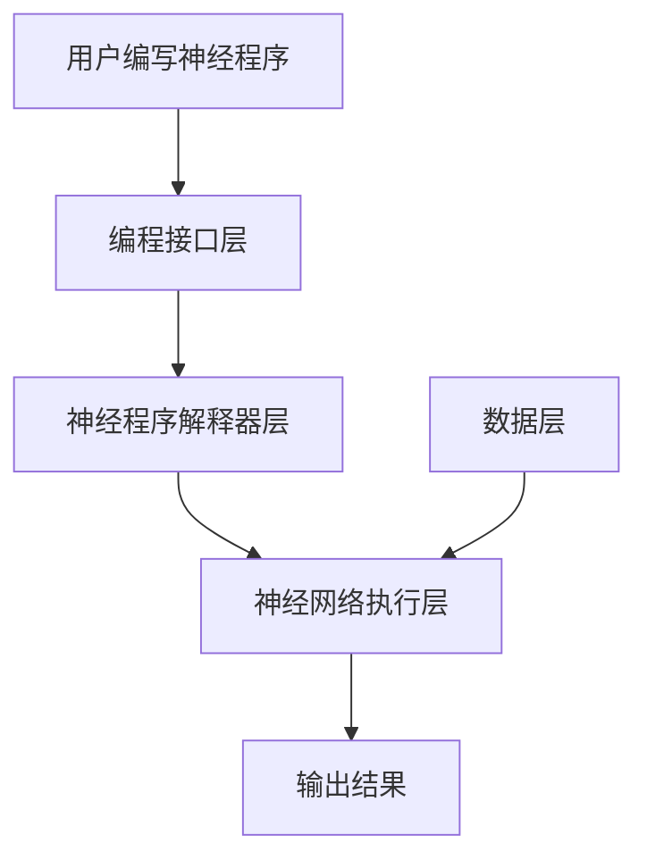

# 神经编程范式:增强AI系统的可编程性

> 关键词：神经编程范式、AI系统、可编程性、深度学习、神经网络

> 摘要：本文围绕神经编程范式展开，旨在深入探讨其如何增强AI系统的可编程性。首先介绍了神经编程范式提出的背景、目的、适用读者群体以及文档结构和相关术语。接着详细阐述了神经编程范式的核心概念、原理和架构，通过Mermaid流程图直观展示其流程。给出了核心算法原理，并使用Python源代码进行详细说明。探讨了神经编程范式背后的数学模型和公式，结合实际例子进行讲解。通过项目实战，从开发环境搭建到源代码实现和解读，全面展示了神经编程范式在实际中的应用。分析了其实际应用场景，推荐了相关的学习资源、开发工具框架和论文著作。最后总结了神经编程范式的未来发展趋势与挑战，并对常见问题进行解答，提供了扩展阅读和参考资料。

## 1. 背景介绍 
### 1.1 目的和范围
传统的AI系统，尤其是基于深度学习的模型，虽然在图像识别、自然语言处理等领域取得了巨大的成功，但它们往往缺乏可编程性。这些模型通常是通过大量的数据进行训练，然后以黑盒的方式进行预测和决策，难以对其内部的运行机制进行精确的控制和调整。神经编程范式的提出旨在解决这一问题，它试图将编程的思想和方法引入到AI系统中，使得AI系统能够像传统程序一样被编程和定制，从而增强其灵活性和可解释性。

本文的范围涵盖了神经编程范式的基本概念、核心算法、数学模型、实际应用以及相关的工具和资源。我们将深入探讨神经编程范式如何在不同的AI任务中发挥作用，以及如何利用它来构建更加可编程的AI系统。

### 1.2 预期读者
本文的预期读者包括AI领域的研究人员、工程师、程序员以及对AI技术感兴趣的爱好者。对于研究人员来说，本文可以提供神经编程范式的最新研究进展和思路，启发他们在该领域进行更深入的研究。对于工程师和程序员来说，本文将详细介绍神经编程范式的实现方法和实际应用案例，帮助他们在实际项目中应用该技术。对于AI爱好者来说，本文可以作为一个入门指南，帮助他们了解神经编程范式的基本概念和原理。

### 1.3 文档结构概述
本文将按照以下结构进行组织：
1. 背景介绍：介绍神经编程范式的目的、预期读者、文档结构和相关术语。
2. 核心概念与联系：阐述神经编程范式的核心概念、原理和架构，并通过Mermaid流程图展示其流程。
3. 核心算法原理 & 具体操作步骤：详细介绍神经编程范式的核心算法，并使用Python源代码进行说明。
4. 数学模型和公式 & 详细讲解 & 举例说明：探讨神经编程范式背后的数学模型和公式，并结合实际例子进行讲解。
5. 项目实战：代码实际案例和详细解释说明：通过一个实际项目，展示神经编程范式的应用，包括开发环境搭建、源代码实现和解读。
6. 实际应用场景：分析神经编程范式在不同领域的实际应用场景。
7. 工具和资源推荐：推荐相关的学习资源、开发工具框架和论文著作。
8. 总结：未来发展趋势与挑战：总结神经编程范式的发展趋势和面临的挑战。
9. 附录：常见问题与解答：解答读者在阅读过程中可能遇到的常见问题。
10. 扩展阅读 & 参考资料：提供相关的扩展阅读和参考资料。

### 1.4 术语表
#### 1.4.1 核心术语定义
- **神经编程范式**：一种将编程思想和方法引入到AI系统中的范式，旨在增强AI系统的可编程性和可解释性。
- **可编程性**：指系统能够像传统程序一样被编程和定制的能力。
- **深度学习**：一种基于神经网络的机器学习方法，通过多层神经网络对数据进行学习和建模。
- **神经网络**：一种模仿人类神经系统的计算模型，由大量的神经元组成，用于处理和分析数据。

#### 1.4.2 相关概念解释
- **传统编程**：指使用传统的编程语言（如C、Java等）编写程序，通过明确的指令和逻辑来实现特定的功能。
- **机器学习编程**：指使用机器学习算法（如决策树、支持向量机等）进行编程，通过数据训练模型来实现特定的任务。
- **神经编程**：指使用神经网络进行编程，通过设计和训练神经网络来实现特定的功能。

#### 1.4.3 缩略词列表
- **AI**：Artificial Intelligence，人工智能
- **DNN**：Deep Neural Network，深度神经网络
- **RNN**：Recurrent Neural Network，循环神经网络
- **CNN**：Convolutional Neural Network，卷积神经网络

## 2. 核心概念与联系 
神经编程范式的核心思想是将编程的概念引入到神经网络中，使得神经网络能够像传统程序一样被编程和定制。传统的神经网络通常是通过大量的数据进行训练，然后以固定的方式进行预测和决策。而神经编程范式则允许用户通过编程的方式来控制神经网络的行为，例如改变神经网络的结构、调整神经元的参数等。

### 核心概念原理
神经编程范式的核心原理基于以下几个方面：
1. **可编程神经元**：传统的神经元通常具有固定的激活函数和参数，而可编程神经元则允许用户通过编程的方式来改变其激活函数和参数。例如，用户可以定义一个自定义的激活函数，或者动态地调整神经元的权重。
2. **神经网络架构编程**：神经编程范式允许用户通过编程的方式来设计和修改神经网络的架构。例如，用户可以添加、删除或修改神经网络的层，或者改变层与层之间的连接方式。
3. **控制流编程**：传统的神经网络通常是按照固定的顺序进行计算，而神经编程范式则允许用户通过编程的方式来控制神经网络的计算流程。例如，用户可以根据输入数据的不同，选择不同的神经网络路径进行计算。

### 架构的文本示意图
神经编程范式的架构可以分为以下几个层次：
1. **编程接口层**：提供给用户一个编程接口，用户可以使用该接口来编写神经程序。编程接口可以是一种编程语言，也可以是一个API。
2. **神经程序解释器层**：负责解释用户编写的神经程序，并将其转换为神经网络可以执行的指令。
3. **神经网络执行层**：负责执行神经程序解释器转换后的指令，完成神经网络的计算任务。
4. **数据层**：提供神经网络所需的数据，包括训练数据和测试数据。

### Mermaid流程图


## 3. 核心算法原理 & 具体操作步骤 
### 核心算法原理
神经编程范式的核心算法主要包括以下几个方面：
1. **可编程神经元的实现**：可编程神经元的实现通常基于传统的神经元模型，例如感知机模型。用户可以通过编程的方式来改变神经元的激活函数和参数。以下是一个简单的可编程神经元的Python实现：
```python
import numpy as np

class ProgrammableNeuron:
    def __init__(self, input_size, activation_function):
        self.weights = np.random.randn(input_size)
        self.bias = np.random.randn()
        self.activation_function = activation_function

    def forward(self, inputs):
        z = np.dot(inputs, self.weights) + self.bias
        output = self.activation_function(z)
        return output

# 自定义激活函数
def custom_activation(x):
    return np.tanh(x)

# 创建可编程神经元
neuron = ProgrammableNeuron(input_size=3, activation_function=custom_activation)

# 输入数据
inputs = np.array([1, 2, 3])

# 前向传播
output = neuron.forward(inputs)
print(output)
```
2. **神经网络架构编程的实现**：神经网络架构编程的实现通常基于深度学习框架，例如PyTorch或TensorFlow。用户可以通过编程的方式来设计和修改神经网络的架构。以下是一个使用PyTorch实现的简单神经网络架构编程的例子：
```python
import torch
import torch.nn as nn

# 自定义神经网络架构
class CustomNetwork(nn.Module):
    def __init__(self):
        super(CustomNetwork, self).__init__()
        self.fc1 = nn.Linear(10, 20)
        self.relu = nn.ReLU()
        self.fc2 = nn.Linear(20, 1)

    def forward(self, x):
        x = self.fc1(x)
        x = self.relu(x)
        x = self.fc2(x)
        return x

# 创建神经网络实例
model = CustomNetwork()

# 输入数据
inputs = torch.randn(1, 10)

# 前向传播
output = model(inputs)
print(output)
```
3. **控制流编程的实现**：控制流编程的实现通常基于条件语句和循环语句。用户可以根据输入数据的不同，选择不同的神经网络路径进行计算。以下是一个简单的控制流编程的Python实现：
```python
import torch
import torch.nn as nn

# 定义两个不同的神经网络
class NetworkA(nn.Module):
    def __init__(self):
        super(NetworkA, self).__init__()
        self.fc = nn.Linear(10, 1)

    def forward(self, x):
        return self.fc(x)

class NetworkB(nn.Module):
    def __init__(self):
        super(NetworkB, self).__init__()
        self.fc = nn.Linear(10, 1)

    def forward(self, x):
        return self.fc(x)

# 创建神经网络实例
model_a = NetworkA()
model_b = NetworkB()

# 输入数据
inputs = torch.randn(1, 10)

# 控制流编程
if inputs.sum() > 0:
    output = model_a(inputs)
else:
    output = model_b(inputs)

print(output)
```

### 具体操作步骤
1. **定义可编程神经元**：根据需求定义可编程神经元的激活函数和参数。
2. **设计神经网络架构**：使用深度学习框架设计和修改神经网络的架构。
3. **实现控制流编程**：根据输入数据的不同，选择不同的神经网络路径进行计算。
4. **训练和测试神经网络**：使用训练数据对神经网络进行训练，然后使用测试数据对其进行测试。

## 4. 数学模型和公式 & 详细讲解 & 举例说明 
### 可编程神经元的数学模型
可编程神经元的数学模型可以表示为：
$$
y = f(\sum_{i=1}^{n} w_i x_i + b)
$$
其中，$x_i$ 是输入信号，$w_i$ 是权重，$b$ 是偏置，$f$ 是激活函数，$y$ 是输出信号。

### 神经网络的数学模型
神经网络可以看作是由多个可编程神经元组成的网络。假设神经网络有 $L$ 层，第 $l$ 层有 $n_l$ 个神经元，则第 $l$ 层的输出可以表示为：
$$
\mathbf{y}^{(l)} = f^{(l)}(\mathbf{W}^{(l)} \mathbf{y}^{(l-1)} + \mathbf{b}^{(l)})
$$
其中，$\mathbf{y}^{(l)}$ 是第 $l$ 层的输出向量，$\mathbf{W}^{(l)}$ 是第 $l$ 层的权重矩阵，$\mathbf{b}^{(l)}$ 是第 $l$ 层的偏置向量，$f^{(l)}$ 是第 $l$ 层的激活函数。

### 举例说明
假设我们有一个简单的两层神经网络，输入层有 2 个神经元，隐藏层有 3 个神经元，输出层有 1 个神经元。输入向量为 $\mathbf{x} = [x_1, x_2]^T$，隐藏层的权重矩阵为 $\mathbf{W}^{(1)} \in \mathbb{R}^{3 \times 2}$，偏置向量为 $\mathbf{b}^{(1)} \in \mathbb{R}^{3}$，输出层的权重矩阵为 $\mathbf{W}^{(2)} \in \mathbb{R}^{1 \times 3}$，偏置向量为 $\mathbf{b}^{(2)} \in \mathbb{R}$。

则隐藏层的输出向量为：
$$
\mathbf{y}^{(1)} = f^{(1)}(\mathbf{W}^{(1)} \mathbf{x} + \mathbf{b}^{(1)})
$$
输出层的输出为：
$$
y^{(2)} = f^{(2)}(\mathbf{W}^{(2)} \mathbf{y}^{(1)} + \mathbf{b}^{(2)})
$$

假设激活函数 $f^{(1)}$ 和 $f^{(2)}$ 都为 sigmoid 函数，即 $f(x) = \frac{1}{1 + e^{-x}}$。则具体的计算过程如下：
1. 计算隐藏层的加权和：
$$
\mathbf{z}^{(1)} = \mathbf{W}^{(1)} \mathbf{x} + \mathbf{b}^{(1)}
$$
2. 计算隐藏层的输出：
$$
\mathbf{y}^{(1)} = f^{(1)}(\mathbf{z}^{(1)}) = \frac{1}{1 + e^{-\mathbf{z}^{(1)}}}
$$
3. 计算输出层的加权和：
$$
z^{(2)} = \mathbf{W}^{(2)} \mathbf{y}^{(1)} + \mathbf{b}^{(2)}
$$
4. 计算输出层的输出：
$$
y^{(2)} = f^{(2)}(z^{(2)}) = \frac{1}{1 + e^{-z^{(2)}}}
$$

## 5. 项目实战：代码实际案例和详细解释说明 
### 5.1  开发环境搭建
在进行神经编程范式的项目实战之前，我们需要搭建一个开发环境。以下是具体的步骤：
1. **安装Python**：神经编程范式的实现通常使用Python语言，因此需要安装Python。建议安装Python 3.7或以上版本。
2. **安装深度学习框架**：我们可以选择使用PyTorch或TensorFlow等深度学习框架。以下是安装PyTorch的命令：
```bash
pip install torch torchvision
```
3. **安装其他必要的库**：根据项目的需求，可能还需要安装其他必要的库，例如NumPy、Matplotlib等。以下是安装这些库的命令：
```bash
pip install numpy matplotlib
```

### 5.2  源代码详细实现和代码解读
我们以一个简单的手写数字识别任务为例，展示神经编程范式的应用。以下是完整的源代码：
```python
import torch
import torch.nn as nn
import torch.optim as optim
from torchvision import datasets, transforms

# 定义可编程神经元的激活函数
def custom_activation(x):
    return torch.tanh(x)

# 定义神经网络架构
class CustomNetwork(nn.Module):
    def __init__(self):
        super(CustomNetwork, self).__init__()
        self.fc1 = nn.Linear(784, 128)
        self.fc2 = nn.Linear(128, 10)

    def forward(self, x):
        x = x.view(-1, 784)
        x = custom_activation(self.fc1(x))
        x = self.fc2(x)
        return x

# 数据预处理
transform = transforms.Compose([
    transforms.ToTensor(),
    transforms.Normalize((0.1307,), (0.3081,))
])

# 加载数据集
train_dataset = datasets.MNIST('data', train=True, download=True, transform=transform)
test_dataset = datasets.MNIST('data', train=False, transform=transform)

train_loader = torch.utils.data.DataLoader(train_dataset, batch_size=64, shuffle=True)
test_loader = torch.utils.data.DataLoader(test_dataset, batch_size=1000, shuffle=False)

# 创建神经网络实例
model = CustomNetwork()

# 定义损失函数和优化器
criterion = nn.CrossEntropyLoss()
optimizer = optim.SGD(model.parameters(), lr=0.01, momentum=0.5)

# 训练模型
def train(model, train_loader, criterion, optimizer, epoch):
    model.train()
    for batch_idx, (data, target) in enumerate(train_loader):
        optimizer.zero_grad()
        output = model(data)
        loss = criterion(output, target)
        loss.backward()
        optimizer.step()
        if batch_idx % 100 == 0:
            print('Train Epoch: {} [{}/{} ({:.0f}%)]\tLoss: {:.6f}'.format(
                epoch, batch_idx * len(data), len(train_loader.dataset),
                100. * batch_idx / len(train_loader), loss.item()))

# 测试模型
def test(model, test_loader):
    model.eval()
    test_loss = 0
    correct = 0
    with torch.no_grad():
        for data, target in test_loader:
            output = model(data)
            test_loss += criterion(output, target).item()
            pred = output.argmax(dim=1, keepdim=True)
            correct += pred.eq(target.view_as(pred)).sum().item()

    test_loss /= len(test_loader.dataset)

    print('\nTest set: Average loss: {:.4f}, Accuracy: {}/{} ({:.0f}%)\n'.format(
        test_loss, correct, len(test_loader.dataset),
        100. * correct / len(test_loader.dataset)))

# 训练和测试模型
for epoch in range(1, 11):
    train(model, train_loader, criterion, optimizer, epoch)
    test(model, test_loader)
```

### 代码解读与分析
1. **可编程神经元的激活函数**：我们定义了一个自定义的激活函数 `custom_activation`，使用 `tanh` 函数作为激活函数。
2. **神经网络架构**：我们定义了一个简单的两层神经网络 `CustomNetwork`，包含一个输入层、一个隐藏层和一个输出层。
3. **数据预处理**：我们使用 `transforms` 对数据进行预处理，包括将图像转换为张量和归一化处理。
4. **数据集加载**：我们使用 `torchvision` 加载 MNIST 手写数字数据集，并将其分为训练集和测试集。
5. **损失函数和优化器**：我们使用交叉熵损失函数 `nn.CrossEntropyLoss` 和随机梯度下降优化器 `optim.SGD` 来训练模型。
6. **训练和测试函数**：我们定义了 `train` 和 `test` 函数，分别用于训练和测试模型。
7. **训练和测试循环**：我们使用一个循环来训练和测试模型，共训练 10 个 epoch。

## 6. 实际应用场景 
神经编程范式在许多领域都有广泛的应用，以下是一些常见的应用场景：
1. **自然语言处理**：在自然语言处理中，神经编程范式可以用于构建更加灵活和可解释的语言模型。例如，通过编程的方式可以控制语言模型的生成过程，使得生成的文本更加符合用户的需求。
2. **计算机视觉**：在计算机视觉中，神经编程范式可以用于设计和优化卷积神经网络的架构。例如，通过编程的方式可以动态地调整卷积核的大小和数量，以适应不同的图像任务。
3. **机器人控制**：在机器人控制中，神经编程范式可以用于构建更加智能和灵活的机器人控制器。例如，通过编程的方式可以根据机器人的环境和任务，动态地调整机器人的行为。
4. **智能医疗**：在智能医疗中，神经编程范式可以用于构建更加精准和可解释的医疗诊断模型。例如，通过编程的方式可以控制医疗诊断模型的决策过程，使得诊断结果更加可靠。

## 7. 工具和资源推荐
### 7.1 学习资源推荐
#### 7.1.1 书籍推荐
- 《深度学习》（Deep Learning）：由 Ian Goodfellow、Yoshua Bengio 和 Aaron Courville 编写，是深度学习领域的经典教材。
- 《神经网络与深度学习》（Neural Networks and Deep Learning）：由 Michael Nielsen 编写，是一本免费的在线书籍，适合初学者入门。
- 《Python深度学习》（Deep Learning with Python）：由 Francois Chollet 编写，介绍了如何使用Python和Keras进行深度学习开发。

#### 7.1.2 在线课程
- Coursera上的“深度学习专项课程”（Deep Learning Specialization）：由 Andrew Ng 教授授课，是深度学习领域最受欢迎的在线课程之一。
- edX上的“人工智能基础”（Introduction to Artificial Intelligence）：介绍了人工智能的基本概念和方法，包括机器学习、深度学习等。
- 哔哩哔哩上的“深度学习入门教程”：由李沐教授授课，以通俗易懂的方式介绍了深度学习的基本原理和实践。

#### 7.1.3 技术博客和网站
- Medium：是一个技术博客平台，上面有许多关于深度学习和神经编程范式的优秀文章。
- arXiv：是一个预印本数据库，上面有许多最新的深度学习研究论文。
- 机器之心：是一个专注于人工智能领域的媒体平台，提供了丰富的技术文章和行业资讯。

### 7.2 开发工具框架推荐
#### 7.2.1 IDE和编辑器
- PyCharm：是一款专门为Python开发设计的集成开发环境，提供了丰富的功能和插件。
- Jupyter Notebook：是一个交互式的笔记本环境，适合进行数据探索和模型开发。
- Visual Studio Code：是一款轻量级的代码编辑器，支持多种编程语言和插件。

#### 7.2.2 调试和性能分析工具
- PyTorch Profiler：是PyTorch提供的性能分析工具，可以帮助用户分析模型的性能瓶颈。
- TensorBoard：是TensorFlow提供的可视化工具，可以帮助用户可视化模型的训练过程和性能指标。
- VS Code Debugger：是Visual Studio Code提供的调试工具，可以帮助用户调试Python代码。

#### 7.2.3 相关框架和库
- PyTorch：是一个开源的深度学习框架，提供了丰富的神经网络层和优化器，支持GPU加速。
- TensorFlow：是另一个开源的深度学习框架，由Google开发，提供了丰富的工具和库，支持分布式训练。
- Keras：是一个高级神经网络API，基于TensorFlow或Theano，可以快速搭建和训练神经网络。

### 7.3 相关论文著作推荐
#### 7.3.1 经典论文
- “Deep Learning”：由 Yann LeCun、Yoshua Bengio 和 Geoffrey Hinton 撰写，是深度学习领域的经典综述论文。
- “Attention Is All You Need”：提出了Transformer模型，是自然语言处理领域的重要突破。
- “Generative Adversarial Networks”：提出了生成对抗网络（GAN），是生成模型领域的重要成果。

#### 7.3.2 最新研究成果
- 关注arXiv上关于神经编程范式的最新研究论文，了解该领域的最新进展。
- 参加相关的学术会议，如NeurIPS、ICML等，了解最新的研究成果和趋势。

#### 7.3.3 应用案例分析
- 阅读相关的技术博客和文章，了解神经编程范式在不同领域的应用案例和实践经验。
- 参考开源项目和代码库，学习他人的实现思路和方法。

## 8. 总结：未来发展趋势与挑战
### 未来发展趋势
1. **更加灵活和可解释的AI系统**：神经编程范式将使得AI系统更加灵活和可解释，能够更好地满足用户的需求。
2. **与传统编程的融合**：神经编程范式将与传统编程更加紧密地融合，形成一种新的编程模式。
3. **跨领域应用**：神经编程范式将在更多的领域得到应用，如金融、交通、能源等。

### 挑战
1. **编程难度**：神经编程范式需要用户具备一定的编程和深度学习知识，编程难度较大。
2. **性能问题**：由于神经编程范式需要动态地调整神经网络的结构和参数，可能会导致性能下降。
3. **可扩展性问题**：如何设计一个可扩展的神经编程范式，以支持大规模的AI系统，是一个需要解决的问题。

## 9. 附录：常见问题与解答
### 问题1：神经编程范式与传统编程有什么区别？
传统编程是通过明确的指令和逻辑来实现特定的功能，而神经编程范式是通过设计和训练神经网络来实现特定的功能。神经编程范式更加灵活和可适应，但编程难度也相对较大。

### 问题2：神经编程范式需要哪些知识和技能？
神经编程范式需要用户具备一定的编程知识（如Python）和深度学习知识（如神经网络、优化算法等）。

### 问题3：神经编程范式在实际应用中有哪些局限性？
神经编程范式在实际应用中的局限性主要包括编程难度大、性能问题和可扩展性问题等。

## 10. 扩展阅读 & 参考资料
### 扩展阅读
- 《人工智能：一种现代的方法》（Artificial Intelligence: A Modern Approach）：介绍了人工智能的基本概念、方法和技术。
- 《强化学习：原理与Python实现》（Reinforcement Learning: An Introduction）：介绍了强化学习的基本原理和算法。

### 参考资料
- Goodfellow, I., Bengio, Y., & Courville, A. (2016). Deep Learning. MIT Press.
- Nielsen, M. A. (2015). Neural Networks and Deep Learning. Determination Press.
- Chollet, F. (2017). Deep Learning with Python. Manning Publications.

作者：AI天才研究院/AI Genius Institute & 禅与计算机程序设计艺术 /Zen And The Art of Computer Programming