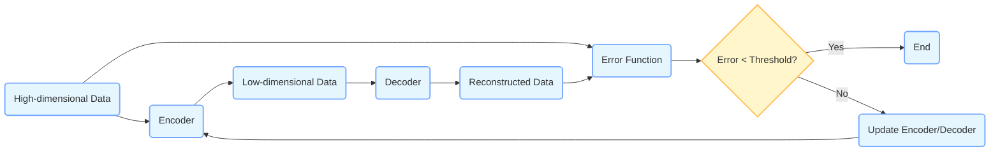

# 神经网络在处理超高维数据时的降维技术

> 关键词：神经网络、超高维数据、降维技术、主成分分析、自编码器

> 摘要：本文围绕神经网络在处理超高维数据时的降维技术展开深入探讨。首先介绍了该研究的背景、目的、预期读者和文档结构，解释了相关术语。接着阐述了核心概念，包括常见降维方法及其联系，并给出了相应的原理和架构示意图。详细讲解了主成分分析和自编码器等核心算法原理，配以 Python 源代码说明。同时给出了相关数学模型和公式，并举例说明。通过项目实战，展示了降维技术在实际中的应用，包括开发环境搭建、源代码实现和代码解读。分析了实际应用场景，推荐了学习资源、开发工具框架和相关论文著作。最后总结了未来发展趋势与挑战，解答了常见问题，并提供了扩展阅读和参考资料。

## 1. 背景介绍 
### 1.1 目的和范围
在当今的数据驱动时代，各个领域产生的数据量呈爆炸式增长，且数据维度也越来越高。例如在生物信息学中，基因表达数据可能包含数万个基因特征；在图像识别领域，一张高分辨率的图像经过特征提取后也会产生大量的特征维度。超高维数据不仅会增加数据存储和处理的成本，还会导致“维度灾难”问题，使得机器学习算法的性能下降、计算复杂度增加。

本文的目的在于探讨神经网络在处理超高维数据时的降维技术，介绍常见的降维方法及其原理，通过具体的代码示例展示如何实现这些降维技术，分析它们在不同场景下的应用效果。范围涵盖了常见的线性和非线性降维技术，如主成分分析（PCA）、自编码器（Autoencoder）等，并探讨了这些技术在实际项目中的应用。

### 1.2 预期读者
本文预期读者包括对机器学习、深度学习感兴趣的研究人员、工程师和学生。对于那些正在处理超高维数据并希望通过降维技术提高算法性能的开发者来说，本文将提供有价值的理论和实践指导。同时，对于希望深入了解神经网络和降维技术原理的初学者，本文也将以通俗易懂的方式进行讲解。

### 1.3 文档结构概述
本文将按照以下结构进行组织：
1. **核心概念与联系**：介绍常见的降维技术，如主成分分析、自编码器等，并阐述它们之间的联系。
2. **核心算法原理 & 具体操作步骤**：详细讲解主成分分析和自编码器的算法原理，并给出 Python 代码实现。
3. **数学模型和公式 & 详细讲解 & 举例说明**：用数学公式描述降维技术的原理，并通过具体例子进行说明。
4. **项目实战：代码实际案例和详细解释说明**：通过一个实际的项目案例，展示如何使用降维技术处理超高维数据。
5. **实际应用场景**：分析降维技术在不同领域的实际应用场景。
6. **工具和资源推荐**：推荐学习降维技术的相关书籍、在线课程、技术博客和网站，以及开发工具和框架。
7. **总结：未来发展趋势与挑战**：总结降维技术的未来发展趋势和面临的挑战。
8. **附录：常见问题与解答**：解答读者在学习和使用降维技术过程中常见的问题。
9. **扩展阅读 & 参考资料**：提供进一步学习降维技术的扩展阅读材料和参考资料。

### 1.4 术语表
#### 1.4.1 核心术语定义
- **超高维数据**：指数据的特征维度非常高，通常在数百甚至数千维以上。
- **降维技术**：通过某种方法将高维数据转换为低维数据，同时保留数据的主要信息。
- **主成分分析（PCA）**：一种线性降维方法，通过找到数据的主成分来实现降维。
- **自编码器（Autoencoder）**：一种神经网络模型，通过自监督学习的方式实现数据的降维和重构。

#### 1.4.2 相关概念解释
- **特征提取**：从原始数据中提取出具有代表性的特征，以减少数据的维度。
- **特征选择**：从原始特征中选择一部分最具代表性的特征，而不改变特征的原始表示。
- **维度灾难**：指在高维空间中，数据的分布变得稀疏，导致机器学习算法的性能下降。

#### 1.4.3 缩略词列表
- **PCA**：主成分分析（Principal Component Analysis）
- **AE**：自编码器（Autoencoder）
- **MLP**：多层感知机（Multi-Layer Perceptron）

## 2. 核心概念与联系 
### 2.1 常见降维技术概述
在处理超高维数据时，常见的降维技术可以分为线性降维和非线性降维两类。

线性降维方法假设数据在低维空间中具有线性结构，通过线性变换将高维数据映射到低维空间。常见的线性降维方法包括主成分分析（PCA）、线性判别分析（LDA）等。

非线性降维方法则认为数据在低维空间中具有非线性结构，需要使用非线性函数进行映射。常见的非线性降维方法包括自编码器（Autoencoder）、t-SNE（t-Distributed Stochastic Neighbor Embedding）等。

### 2.2 主成分分析（PCA）原理
主成分分析是一种最常用的线性降维方法，其基本思想是找到数据的主成分，即数据方差最大的方向。通过将数据投影到这些主成分上，可以实现数据的降维。

具体来说，给定一个 $n$ 维数据集 $X = [x_1, x_2, \cdots, x_m]^T$，其中 $x_i \in \mathbb{R}^n$ 是第 $i$ 个样本。PCA 的目标是找到一组正交的单位向量 $w_1, w_2, \cdots, w_n$，使得数据在这些向量上的投影方差最大。

第一个主成分 $w_1$ 是数据方差最大的方向，第二个主成分 $w_2$ 是与 $w_1$ 正交且数据方差次大的方向，以此类推。通过选择前 $k$ 个主成分（$k < n$），可以将数据从 $n$ 维降维到 $k$ 维。

### 2.3 自编码器（Autoencoder）原理
自编码器是一种神经网络模型，由编码器和解码器两部分组成。编码器将高维输入数据映射到低维的隐藏表示，解码器则将低维的隐藏表示重构为高维的输出数据。

自编码器的训练目标是最小化输入数据和重构数据之间的误差，通过这种方式学习到数据的低维表示。自编码器可以是线性的，也可以是非线性的，通过使用不同的激活函数可以实现非线性映射。

### 2.4 核心概念联系
主成分分析和自编码器都可以用于数据降维，但它们的原理和应用场景有所不同。主成分分析是一种线性降维方法，计算简单，适用于数据具有线性结构的情况。自编码器是一种非线性降维方法，可以处理更复杂的数据结构，但计算复杂度较高。

在实际应用中，可以根据数据的特点和需求选择合适的降维方法。例如，如果数据具有明显的线性结构，可以优先选择主成分分析；如果数据具有复杂的非线性结构，则可以考虑使用自编码器。

### 2.5 核心概念原理和架构的文本示意图
```plaintext
+---------------------+          +---------------------+
|    High-dimensional |          |    Low-dimensional  |
|       Data (X)      |          |       Data (Z)      |
+---------------------+          +---------------------+
         |                                 ^
         |                                 |
         v                                 |
+---------------------+          +---------------------+
|      Encoder (f)    |          |     Decoder (g)     |
|  X -> Z = f(X)      |          |  Z -> X' = g(Z)     |
+---------------------+          +---------------------+
         |                                 ^
         |                                 |
         v                                 |
+---------------------+          +---------------------+
|    Reconstructed    |          |    Error Function   |
|      Data (X')      |          |  L(X, X') = ||X - X'||^2 |
+---------------------+          +---------------------+
```

### 2.6 Mermaid 流程图


## 3. 核心算法原理 & 具体操作步骤 
### 3.1 主成分分析（PCA）算法原理
主成分分析的核心是求解数据的协方差矩阵的特征值和特征向量。具体步骤如下：
1. **数据标准化**：将数据进行标准化处理，使得每个特征的均值为 0，方差为 1。
2. **计算协方差矩阵**：计算标准化后数据的协方差矩阵 $S$。
3. **求解特征值和特征向量**：对协方差矩阵 $S$ 进行特征值分解，得到特征值 $\lambda_1, \lambda_2, \cdots, \lambda_n$ 和对应的特征向量 $w_1, w_2, \cdots, w_n$。
4. **选择主成分**：按照特征值从大到小的顺序排序，选择前 $k$ 个特征值对应的特征向量作为主成分。
5. **数据投影**：将标准化后的数据投影到选择的主成分上，得到降维后的数据。

### 3.2 PCA 的 Python 代码实现
```python
import numpy as np

def pca(X, k):
    # 数据标准化
    X_mean = np.mean(X, axis=0)
    X_std = np.std(X, axis=0)
    X_norm = (X - X_mean) / X_std
    
    # 计算协方差矩阵
    cov_matrix = np.cov(X_norm.T)
    
    # 求解特征值和特征向量
    eigenvalues, eigenvectors = np.linalg.eig(cov_matrix)
    
    # 选择前 k 个特征值对应的特征向量
    idx = np.argsort(eigenvalues)[::-1]
    eigenvectors = eigenvectors[:, idx]
    top_k_eigenvectors = eigenvectors[:, :k]
    
    # 数据投影
    X_reduced = np.dot(X_norm, top_k_eigenvectors)
    
    return X_reduced

# 示例数据
X = np.random.rand(100, 10)
k = 2
X_reduced = pca(X, k)
print("Original data shape:", X.shape)
print("Reduced data shape:", X_reduced.shape)
```

### 3.3 自编码器（Autoencoder）算法原理
自编码器的训练过程可以分为以下几个步骤：
1. **初始化编码器和解码器的参数**：随机初始化编码器和解码器的权重和偏置。
2. **前向传播**：将输入数据通过编码器得到低维的隐藏表示，再将隐藏表示通过解码器得到重构数据。
3. **计算损失函数**：计算输入数据和重构数据之间的误差，常用的损失函数是均方误差（MSE）。
4. **反向传播**：根据损失函数计算梯度，使用梯度下降法更新编码器和解码器的参数。
5. **重复步骤 2 - 4**：直到损失函数收敛或达到最大迭代次数。

### 3.4 自编码器的 Python 代码实现
```python
import tensorflow as tf
from tensorflow.keras.layers import Input, Dense
from tensorflow.keras.models import Model

# 定义编码器
input_layer = Input(shape=(10,))
encoded = Dense(2, activation='relu')(input_layer)

# 定义解码器
decoded = Dense(10, activation='sigmoid')(encoded)

# 定义自编码器模型
autoencoder = Model(input_layer, decoded)

# 编译模型
autoencoder.compile(optimizer='adam', loss='mse')

# 示例数据
X = np.random.rand(100, 10)

# 训练模型
autoencoder.fit(X, X, epochs=50, batch_size=32)

# 获取编码器模型
encoder = Model(input_layer, encoded)

# 进行降维
X_reduced = encoder.predict(X)
print("Original data shape:", X.shape)
print("Reduced data shape:", X_reduced.shape)
```

## 4. 数学模型和公式 & 详细讲解 & 举例说明 
### 4.1 主成分分析（PCA）的数学模型和公式
#### 4.1.1 协方差矩阵
给定一个 $n$ 维数据集 $X = [x_1, x_2, \cdots, x_m]^T$，其中 $x_i \in \mathbb{R}^n$ 是第 $i$ 个样本。数据的协方差矩阵 $S$ 定义为：
$$
S = \frac{1}{m - 1} \sum_{i = 1}^{m} (x_i - \bar{x})(x_i - \bar{x})^T
$$
其中 $\bar{x} = \frac{1}{m} \sum_{i = 1}^{m} x_i$ 是数据的均值。

#### 4.1.2 特征值分解
对协方差矩阵 $S$ 进行特征值分解，得到特征值 $\lambda_1, \lambda_2, \cdots, \lambda_n$ 和对应的特征向量 $w_1, w_2, \cdots, w_n$，满足：
$$
S w_i = \lambda_i w_i
$$
其中 $i = 1, 2, \cdots, n$。

#### 4.1.3 数据投影
选择前 $k$ 个特征值对应的特征向量 $w_1, w_2, \cdots, w_k$，将标准化后的数据 $X_{norm}$ 投影到这些特征向量上，得到降维后的数据 $X_{reduced}$：
$$
X_{reduced} = X_{norm} W_k
$$
其中 $W_k = [w_1, w_2, \cdots, w_k]$ 是由前 $k$ 个特征向量组成的矩阵。

#### 4.1.4 举例说明
假设我们有一个二维数据集 $X = \begin{bmatrix} 1 & 2 \\ 2 & 3 \\ 3 & 4 \\ 4 & 5 \end{bmatrix}$，我们希望将其降维到一维。

首先，计算数据的均值：
$$
\bar{x} = \frac{1}{4} \begin{bmatrix} 1 + 2 + 3 + 4 \\ 2 + 3 + 4 + 5 \end{bmatrix} = \begin{bmatrix} 2.5 \\ 3.5 \end{bmatrix}
$$

然后，计算标准化后的数据：
$$
X_{norm} = \begin{bmatrix} 1 - 2.5 & 2 - 3.5 \\ 2 - 2.5 & 3 - 3.5 \\ 3 - 2.5 & 4 - 3.5 \\ 4 - 2.5 & 5 - 3.5 \end{bmatrix} = \begin{bmatrix} -1.5 & -1.5 \\ -0.5 & -0.5 \\ 0.5 & 0.5 \\ 1.5 & 1.5 \end{bmatrix}
$$

接着，计算协方差矩阵：
$$
S = \frac{1}{3} \begin{bmatrix} -1.5 & -0.5 & 0.5 & 1.5 \\ -1.5 & -0.5 & 0.5 & 1.5 \end{bmatrix} \begin{bmatrix} -1.5 & -1.5 \\ -0.5 & -0.5 \\ 0.5 & 0.5 \\ 1.5 & 1.5 \end{bmatrix} = \begin{bmatrix} 1.25 & 1.25 \\ 1.25 & 1.25 \end{bmatrix}
$$

对协方差矩阵进行特征值分解，得到特征值 $\lambda_1 = 2.5$，$\lambda_2 = 0$，对应的特征向量 $w_1 = \begin{bmatrix} 0.707 \\ 0.707 \end{bmatrix}$，$w_2 = \begin{bmatrix} -0.707 \\ 0.707 \end{bmatrix}$。

选择特征值最大的特征向量 $w_1$，将标准化后的数据投影到 $w_1$ 上，得到降维后的数据：
$$
X_{reduced} = X_{norm} w_1 = \begin{bmatrix} -1.5 & -1.5 \\ -0.5 & -0.5 \\ 0.5 & 0.5 \\ 1.5 & 1.5 \end{bmatrix} \begin{bmatrix} 0.707 \\ 0.707 \end{bmatrix} = \begin{bmatrix} -2.121 \\ -0.707 \\ 0.707 \\ 2.121 \end{bmatrix}
$$

### 4.2 自编码器（Autoencoder）的数学模型和公式
#### 4.2.1 编码器和解码器
编码器将输入数据 $x$ 映射到低维的隐藏表示 $z$，可以表示为：
$$
z = f(x; \theta_{enc})
$$
其中 $f$ 是编码器的映射函数，$\theta_{enc}$ 是编码器的参数。

解码器将低维的隐藏表示 $z$ 重构为高维的输出数据 $x'$，可以表示为：
$$
x' = g(z; \theta_{dec})
$$
其中 $g$ 是解码器的映射函数，$\theta_{dec}$ 是解码器的参数。

#### 4.2.2 损失函数
自编码器的训练目标是最小化输入数据 $x$ 和重构数据 $x'$ 之间的误差，常用的损失函数是均方误差（MSE）：
$$
L(x, x') = \frac{1}{m} \sum_{i = 1}^{m} ||x_i - x_i'||^2
$$
其中 $m$ 是样本数量。

#### 4.2.3 梯度下降法
使用梯度下降法更新编码器和解码器的参数，参数更新公式为：
$$
\theta_{enc} = \theta_{enc} - \alpha \frac{\partial L}{\partial \theta_{enc}}
$$
$$
\theta_{dec} = \theta_{dec} - \alpha \frac{\partial L}{\partial \theta_{dec}}
$$
其中 $\alpha$ 是学习率。

#### 4.2.4 举例说明
假设我们有一个简单的自编码器，编码器是一个单层神经网络，解码器也是一个单层神经网络。输入数据是一个二维向量 $x = \begin{bmatrix} x_1 \\ x_2 \end{bmatrix}$，隐藏表示是一个一维向量 $z$，重构数据是一个二维向量 $x' = \begin{bmatrix} x_1' \\ x_2' \end{bmatrix}$。

编码器的映射函数为：
$$
z = \sigma(W_{enc} x + b_{enc})
$$
其中 $W_{enc}$ 是编码器的权重矩阵，$b_{enc}$ 是编码器的偏置向量，$\sigma$ 是激活函数，例如 sigmoid 函数。

解码器的映射函数为：
$$
x' = \sigma(W_{dec} z + b_{dec})
$$
其中 $W_{dec}$ 是解码器的权重矩阵，$b_{dec}$ 是解码器的偏置向量。

损失函数为：
$$
L(x, x') = \frac{1}{2} ((x_1 - x_1')^2 + (x_2 - x_2')^2)
$$

使用梯度下降法更新编码器和解码器的参数，直到损失函数收敛。

## 5. 项目实战：代码实际案例和详细解释说明 
### 5.1  开发环境搭建
本项目使用 Python 语言进行开发，需要安装以下库：
- **NumPy**：用于数值计算。
- **TensorFlow**：用于构建和训练神经网络。
- **Matplotlib**：用于数据可视化。

可以使用以下命令安装这些库：
```sh
pip install numpy tensorflow matplotlib
```

### 5.2  源代码详细实现和代码解读
```python
import numpy as np
import tensorflow as tf
from tensorflow.keras.layers import Input, Dense
from tensorflow.keras.models import Model
import matplotlib.pyplot as plt

# 生成示例数据
np.random.seed(42)
X = np.random.rand(1000, 10)

# 定义编码器
input_layer = Input(shape=(10,))
encoded = Dense(2, activation='relu')(input_layer)

# 定义解码器
decoded = Dense(10, activation='sigmoid')(encoded)

# 定义自编码器模型
autoencoder = Model(input_layer, decoded)

# 编译模型
autoencoder.compile(optimizer='adam', loss='mse')

# 训练模型
history = autoencoder.fit(X, X, epochs=50, batch_size=32, validation_split=0.2)

# 获取编码器模型
encoder = Model(input_layer, encoded)

# 进行降维
X_reduced = encoder.predict(X)

# 可视化降维后的数据
plt.scatter(X_reduced[:, 0], X_reduced[:, 1])
plt.xlabel('Dimension 1')
plt.ylabel('Dimension 2')
plt.title('Reduced Data Visualization')
plt.show()

# 绘制训练损失曲线
plt.plot(history.history['loss'], label='Training Loss')
plt.plot(history.history['val_loss'], label='Validation Loss')
plt.xlabel('Epochs')
plt.ylabel('Loss')
plt.title('Training and Validation Loss')
plt.legend()
plt.show()
```

### 5.3  代码解读与分析
1. **数据生成**：使用 `np.random.rand` 生成一个 1000x10 的随机数据集。
2. **编码器和解码器定义**：使用 `tensorflow.keras` 构建编码器和解码器，编码器将输入数据从 10 维降维到 2 维，解码器将 2 维的隐藏表示重构为 10 维的输出数据。
3. **自编码器模型定义**：将编码器和解码器组合成一个自编码器模型。
4. **模型编译**：使用 Adam 优化器和均方误差（MSE）损失函数编译模型。
5. **模型训练**：使用 `fit` 方法训练模型，设置训练轮数为 50，批次大小为 32，并使用 20% 的数据作为验证集。
6. **降维操作**：使用编码器模型对数据进行降维。
7. **可视化**：使用 `matplotlib` 绘制降维后的数据和训练损失曲线。

通过观察训练损失曲线，可以判断模型是否收敛。如果训练损失和验证损失都逐渐下降并趋于稳定，说明模型训练效果较好。

## 6. 实际应用场景 
### 6.1 生物信息学
在生物信息学中，基因表达数据通常具有很高的维度，例如一个基因芯片实验可能包含数万个基因的表达值。通过降维技术，可以将高维的基因表达数据降维到低维空间，以便进行可视化和聚类分析。例如，使用主成分分析可以找到基因表达数据的主成分，将数据投影到这些主成分上，从而减少数据的维度，同时保留数据的主要信息。

### 6.2 图像识别
在图像识别领域，一张高分辨率的图像经过特征提取后会产生大量的特征维度。降维技术可以用于减少图像特征的维度，提高图像识别算法的性能。例如，使用自编码器可以学习到图像的低维表示，将高维的图像特征降维到低维空间，从而减少计算量和存储成本。

### 6.3 金融分析
在金融分析中，股票市场数据、信用风险数据等通常具有很高的维度。通过降维技术，可以将高维的金融数据降维到低维空间，以便进行风险评估和投资决策。例如，使用主成分分析可以找到金融数据的主成分，将数据投影到这些主成分上，从而减少数据的维度，同时保留数据的主要信息。

### 6.4 自然语言处理
在自然语言处理中，文本数据通常需要转换为高维的向量表示。降维技术可以用于减少文本向量的维度，提高文本分类、情感分析等任务的性能。例如，使用自编码器可以学习到文本的低维表示，将高维的文本向量降维到低维空间，从而减少计算量和存储成本。

## 7. 工具和资源推荐
### 7.1 学习资源推荐
#### 7.1.1 书籍推荐
- 《机器学习》（周志华）：一本全面介绍机器学习算法的经典教材，其中包含了降维技术的相关内容。
- 《深度学习》（Ian Goodfellow、Yoshua Bengio 和 Aaron Courville）：一本介绍深度学习理论和实践的权威书籍，其中包含了自编码器等神经网络模型的详细介绍。
- 《数据挖掘：概念与技术》（Jiawei Han、Jian Pei 和 Micheline Kamber）：一本介绍数据挖掘算法和技术的经典教材，其中包含了降维技术的相关内容。

#### 7.1.2 在线课程
- Coursera 上的“机器学习”课程（Andrew Ng 教授）：一门经典的机器学习在线课程，涵盖了降维技术等多个机器学习算法。
- edX 上的“深度学习”课程（Geoffrey Hinton 教授）：一门介绍深度学习理论和实践的在线课程，其中包含了自编码器等神经网络模型的详细介绍。
- 中国大学 MOOC 上的“机器学习基础”课程（周志华教授）：一门介绍机器学习基础算法的在线课程，其中包含了降维技术的相关内容。

#### 7.1.3 技术博客和网站
- Medium 上的 Towards Data Science：一个专注于数据科学和机器学习的技术博客，上面有很多关于降维技术的文章。
- Kaggle：一个数据科学竞赛平台，上面有很多关于降维技术的实战案例和代码分享。
- 博客园：一个国内的技术博客平台，上面有很多关于降维技术的技术文章和代码示例。

### 7.2 开发工具框架推荐
#### 7.2.1 IDE和编辑器
- PyCharm：一个功能强大的 Python IDE，支持代码调试、自动补全、版本控制等功能。
- Jupyter Notebook：一个交互式的 Python 开发环境，适合进行数据探索和模型训练。
- Visual Studio Code：一个轻量级的代码编辑器，支持多种编程语言，并且有丰富的插件扩展。

#### 7.2.2 调试和性能分析工具
- TensorBoard：TensorFlow 提供的一个可视化工具，可以用于查看模型的训练过程、损失曲线、网络结构等信息。
- PyTorch Profiler：PyTorch 提供的一个性能分析工具，可以用于分析模型的运行时间、内存使用等情况。
- cProfile：Python 内置的性能分析工具，可以用于分析 Python 代码的运行时间和函数调用次数。

#### 7.2.3 相关框架和库
- NumPy：一个用于数值计算的 Python 库，提供了高效的数组操作和数学函数。
- TensorFlow：一个开源的深度学习框架，支持构建和训练各种神经网络模型。
- PyTorch：一个开源的深度学习框架，具有动态图机制，适合进行快速原型开发。
- Scikit-learn：一个用于机器学习的 Python 库，提供了丰富的机器学习算法和工具，包括主成分分析等降维技术。

### 7.3 相关论文著作推荐
#### 7.3.1 经典论文
- “Principal Component Analysis”（I. T. Jolliffe）：一篇介绍主成分分析的经典论文，详细阐述了主成分分析的原理和应用。
- “Autoencoders, Unsupervised Learning, and Deep Architectures”（Yoshua Bengio 等）：一篇介绍自编码器和无监督学习的经典论文，详细阐述了自编码器的原理和应用。
- “t-SNE”（Laurens van der Maaten 和 Geoffrey Hinton）：一篇介绍 t-SNE 降维算法的经典论文，详细阐述了 t-SNE 的原理和应用。

#### 7.3.2 最新研究成果
- 关注 arXiv 上的机器学习和深度学习相关论文，了解最新的降维技术研究成果。
- 参加国际机器学习会议（ICML）、神经信息处理系统大会（NeurIPS）等学术会议，了解最新的降维技术研究动态。

#### 7.3.3 应用案例分析
- Kaggle 上的一些数据科学竞赛案例，展示了降维技术在实际问题中的应用。
- 各大科技公司的技术博客，如 Google AI Blog、Facebook AI Research 等，分享了一些降维技术在实际项目中的应用案例。

## 8. 总结：未来发展趋势与挑战
### 8.1 未来发展趋势
- **深度学习与降维技术的融合**：随着深度学习的发展，将深度学习模型与降维技术相结合，有望进一步提高降维的效果和性能。例如，使用卷积神经网络（CNN）和循环神经网络（RNN）等深度学习模型进行特征提取，然后使用自编码器等降维技术进行降维。
- **自适应降维技术**：开发自适应的降维技术，能够根据数据的特点和任务的需求自动选择合适的降维方法和参数。例如，使用元学习的方法学习如何选择降维方法和参数。
- **降维技术在新兴领域的应用**：随着人工智能技术在各个领域的广泛应用，降维技术也将在新兴领域得到更多的应用。例如，在量子计算、生物医学工程等领域，降维技术可以用于处理高维的量子态数据和生物医学图像数据。

### 8.2 挑战
- **高维数据的复杂性**：随着数据维度的不断增加，数据的复杂性也越来越高，降维技术面临着更大的挑战。例如，高维数据中可能存在噪声、缺失值和非线性结构，需要开发更加鲁棒和有效的降维方法。
- **降维效果的评估**：如何准确地评估降维效果是一个挑战。目前常用的评估指标如均方误差、重构误差等不能完全反映降维后数据的质量和可用性。需要开发更加全面和有效的评估指标。
- **计算资源的限制**：一些复杂的降维方法需要大量的计算资源和时间，限制了它们在实际应用中的使用。需要开发更加高效的降维算法和并行计算技术，以提高降维的效率。

## 9. 附录：常见问题与解答
### 9.1 降维技术会丢失数据信息吗？
降维技术通常会丢失一部分数据信息，因为它将高维数据映射到低维空间。但是，好的降维方法会尽量保留数据的主要信息，使得降维后的数据仍然能够用于后续的分析和处理。例如，主成分分析通过选择数据方差最大的方向进行投影，保留了数据的主要信息。

### 9.2 如何选择合适的降维方法？
选择合适的降维方法需要考虑以下几个因素：
- **数据的特点**：如果数据具有线性结构，可以选择线性降维方法，如主成分分析；如果数据具有非线性结构，则可以选择非线性降维方法，如自编码器。
- **降维的目的**：如果降维的目的是为了数据可视化，可以选择能够将数据映射到二维或三维空间的降维方法，如 t-SNE；如果降维的目的是为了提高机器学习算法的性能，可以选择能够保留数据分类信息的降维方法，如线性判别分析。
- **计算资源和时间**：一些复杂的降维方法需要大量的计算资源和时间，需要根据实际情况选择合适的方法。

### 9.3 降维后的低维数据可以直接用于机器学习模型吗？
降维后的低维数据通常可以直接用于机器学习模型，但需要根据具体情况进行调整。例如，在使用降维后的数据进行分类任务时，可能需要重新调整模型的参数，以适应降维后的数据。同时，需要注意降维后的数据是否仍然保留了足够的信息，以保证模型的性能。

## 10. 扩展阅读 & 参考资料
### 10.1 扩展阅读
- 《神经网络与深度学习》（邱锡鹏）：进一步深入学习神经网络和深度学习的理论和实践。
- 《人工智能：一种现代的方法》（Stuart Russell 和 Peter Norvig）：全面了解人工智能的各个领域，包括机器学习、自然语言处理等。
- 《数据科学实战》（Cathy O'Neil 和 Rachel Schutt）：通过实际案例学习数据科学的方法和技术。

### 10.2 参考资料
- 《机器学习》（周志华）：书中的降维技术章节提供了详细的理论和算法介绍。
- TensorFlow 官方文档：提供了 TensorFlow 框架的详细使用说明和示例代码。
- Scikit-learn 官方文档：提供了 Scikit-learn 库的详细使用说明和示例代码。

作者：AI天才研究院/AI Genius Institute & 禅与计算机程序设计艺术 /Zen And The Art of Computer Programming