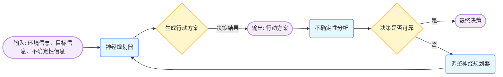

# 神经规划器在战略决策推理中的不确定性管理

> 关键词：神经规划器、战略决策推理、不确定性管理、人工智能、决策模型

> 摘要：本文聚焦于神经规划器在战略决策推理中的不确定性管理问题。首先介绍了研究的背景、目的和范围，明确预期读者和文档结构。接着阐述了神经规划器、战略决策推理以及不确定性管理的核心概念及其联系，并给出相应的文本示意图和Mermaid流程图。详细讲解了神经规划器相关的核心算法原理，结合Python源代码进行说明。深入分析了涉及的数学模型和公式，并举例说明其应用。通过项目实战，展示了开发环境搭建、源代码实现及解读。探讨了神经规划器在不同实际应用场景中的作用。推荐了相关的学习资源、开发工具框架以及论文著作。最后总结了神经规划器在战略决策推理中不确定性管理的未来发展趋势与挑战，并给出常见问题解答和扩展阅读参考资料。

## 1. 背景介绍 
### 1.1 目的和范围
在当今复杂多变的环境中，战略决策推理面临着诸多不确定性因素。传统的决策方法往往难以应对这些不确定性，而神经规划器作为一种新兴的技术，为解决这一问题提供了新的思路。本研究的目的在于深入探讨神经规划器在战略决策推理中如何有效地管理不确定性，提高决策的质量和可靠性。研究范围涵盖了神经规划器的基本原理、算法实现、数学模型，以及在不同领域的实际应用案例分析。

### 1.2 预期读者
本文预期读者包括人工智能领域的研究人员、工程师、软件开发者，以及对战略决策推理和不确定性管理感兴趣的专业人士。对于正在学习人工智能和决策科学的学生，本文也提供了丰富的知识和实践指导。

### 1.3 文档结构概述
本文将按照以下结构展开：首先介绍核心概念与联系，帮助读者建立起相关的知识体系；接着详细阐述核心算法原理和具体操作步骤，并结合Python代码进行说明；然后分析涉及的数学模型和公式，通过举例加深理解；进行项目实战，展示神经规划器在实际中的应用；探讨实际应用场景；推荐相关的学习资源、开发工具框架和论文著作；最后总结未来发展趋势与挑战，给出常见问题解答和扩展阅读参考资料。

### 1.4 术语表
#### 1.4.1 核心术语定义
- **神经规划器（Neural Planner）**：一种基于神经网络的规划系统，能够根据给定的目标和环境信息，生成一系列的行动方案。
- **战略决策推理（Strategic Decision Reasoning）**：在复杂环境中，通过对各种信息的分析和评估，制定出具有长远性和全局性的决策过程。
- **不确定性管理（Uncertainty Management）**：识别、评估和应对决策过程中不确定性因素的一系列方法和策略。

#### 1.4.2 相关概念解释
- **神经网络（Neural Network）**：一种模仿人类神经系统的计算模型，由大量的神经元组成，能够自动学习数据中的模式和规律。
- **规划（Planning）**：在给定的初始状态和目标状态下，寻找一系列行动步骤，以实现目标的过程。
- **决策（Decision Making）**：从多个可行方案中选择最优方案的过程。

#### 1.4.3 缩略词列表
- **NN**：Neural Network（神经网络）
- **NP**：Neural Planner（神经规划器）

## 2. 核心概念与联系 

### 核心概念原理
#### 神经规划器
神经规划器是基于神经网络构建的规划系统。它的核心思想是将规划问题转化为一个机器学习问题，通过神经网络学习环境的动态模型和目标函数，从而生成最优的行动方案。神经网络可以学习到复杂的非线性关系，能够处理高维的输入数据，因此在处理复杂的规划问题时具有很大的优势。

#### 战略决策推理
战略决策推理是在复杂和不确定的环境中进行决策的过程。它需要考虑多个因素，包括市场趋势、竞争对手的行动、技术发展等。战略决策推理不仅仅是选择一个最优方案，还需要考虑方案的长远影响和适应性。

#### 不确定性管理
不确定性管理是指在决策过程中，识别、评估和应对不确定性因素的过程。不确定性可能来自于环境的变化、数据的不完整性、模型的误差等。有效的不确定性管理可以提高决策的可靠性和鲁棒性。

### 架构的文本示意图
神经规划器在战略决策推理中的不确定性管理架构可以描述如下：

输入层接收环境信息、目标信息和不确定性信息。环境信息包括当前的状态、资源情况等；目标信息明确了决策的目标；不确定性信息则描述了环境和数据中的不确定性。

中间层是神经规划器，它由多个神经网络模块组成，包括环境模型网络、价值网络和策略网络。环境模型网络学习环境的动态变化，价值网络评估不同状态和行动的价值，策略网络根据价值评估生成行动方案。

输出层输出决策结果，即一系列的行动方案。同时，系统会对决策结果进行不确定性分析，评估决策的可靠性，并根据不确定性反馈对神经规划器进行调整。

### Mermaid流程图


## 3. 核心算法原理 & 具体操作步骤 

### 核心算法原理
神经规划器的核心算法通常基于强化学习和深度学习技术。以下是一种常见的基于深度Q网络（Deep Q-Network，DQN）的神经规划器算法原理。

DQN的目标是学习一个最优的行动价值函数 $Q^*(s,a)$，它表示在状态 $s$ 下采取行动 $a$ 并遵循最优策略后所能获得的最大累积奖励。通过不断地与环境进行交互，DQN可以逐步逼近这个最优价值函数。

### 具体操作步骤
1. **初始化**：初始化神经网络的参数 $\theta$，经验回放缓冲区 $D$，以及超参数，如学习率 $\alpha$、折扣因子 $\gamma$ 等。
2. **环境交互**：在每个时间步 $t$，观察当前状态 $s_t$，根据当前的策略 $\pi$ 选择行动 $a_t$，执行行动 $a_t$ 并观察下一个状态 $s_{t+1}$ 和奖励 $r_t$。
3. **经验存储**：将经验 $(s_t, a_t, r_t, s_{t+1})$ 存储到经验回放缓冲区 $D$ 中。
4. **经验回放**：从经验回放缓冲区 $D$ 中随机采样一批经验 $(s_i, a_i, r_i, s_{i+1})$。
5. **计算目标值**：对于每个采样的经验，计算目标值 $y_i = r_i + \gamma \max_{a'} Q(s_{i+1}, a'; \theta^-)$，其中 $\theta^-$ 是目标网络的参数。
6. **损失计算**：计算损失函数 $L(\theta) = \frac{1}{N} \sum_{i=1}^{N} (y_i - Q(s_i, a_i; \theta))^2$，其中 $N$ 是采样的经验数量。
7. **参数更新**：使用梯度下降法更新神经网络的参数 $\theta$，使得损失函数 $L(\theta)$ 最小化。
8. **目标网络更新**：定期更新目标网络的参数 $\theta^-$ 为当前网络的参数 $\theta$。
9. **重复步骤2-8**：直到满足终止条件，如达到最大训练步数或收敛。

### Python源代码实现
```python
import torch
import torch.nn as nn
import torch.optim as optim
import numpy as np
import random

# 定义深度Q网络
class DQN(nn.Module):
    def __init__(self, input_dim, output_dim):
        super(DQN, self).__init__()
        self.fc1 = nn.Linear(input_dim, 64)
        self.fc2 = nn.Linear(64, 64)
        self.fc3 = nn.Linear(64, output_dim)

    def forward(self, x):
        x = torch.relu(self.fc1(x))
        x = torch.relu(self.fc2(x))
        return self.fc3(x)

# 定义神经规划器类
class NeuralPlanner:
    def __init__(self, input_dim, output_dim, learning_rate=0.001, gamma=0.99, epsilon=0.1):
        self.input_dim = input_dim
        self.output_dim = output_dim
        self.learning_rate = learning_rate
        self.gamma = gamma
        self.epsilon = epsilon

        # 初始化主网络和目标网络
        self.policy_network = DQN(input_dim, output_dim)
        self.target_network = DQN(input_dim, output_dim)
        self.target_network.load_state_dict(self.policy_network.state_dict())
        self.target_network.eval()

        # 定义优化器和损失函数
        self.optimizer = optim.Adam(self.policy_network.parameters(), lr=learning_rate)
        self.criterion = nn.MSELoss()

        # 经验回放缓冲区
        self.replay_buffer = []
        self.buffer_size = 10000
        self.batch_size = 32

    def select_action(self, state):
        if random.random() < self.epsilon:
            # 随机选择行动
            action = random.randint(0, self.output_dim - 1)
        else:
            # 根据Q值选择最优行动
            state = torch.FloatTensor(state).unsqueeze(0)
            q_values = self.policy_network(state)
            action = torch.argmax(q_values).item()
        return action

    def store_experience(self, state, action, reward, next_state):
        experience = (state, action, reward, next_state)
        if len(self.replay_buffer) >= self.buffer_size:
            self.replay_buffer.pop(0)
        self.replay_buffer.append(experience)

    def train(self):
        if len(self.replay_buffer) < self.batch_size:
            return

        # 从经验回放缓冲区中随机采样一批经验
        batch = random.sample(self.replay_buffer, self.batch_size)
        states, actions, rewards, next_states = zip(*batch)

        states = torch.FloatTensor(states)
        actions = torch.LongTensor(actions).unsqueeze(1)
        rewards = torch.FloatTensor(rewards).unsqueeze(1)
        next_states = torch.FloatTensor(next_states)

        # 计算当前Q值
        current_q_values = self.policy_network(states).gather(1, actions)

        # 计算目标Q值
        next_q_values = self.target_network(next_states).max(1)[0].unsqueeze(1)
        target_q_values = rewards + self.gamma * next_q_values

        # 计算损失
        loss = self.criterion(current_q_values, target_q_values)

        # 更新参数
        self.optimizer.zero_grad()
        loss.backward()
        self.optimizer.step()

    def update_target_network(self):
        self.target_network.load_state_dict(self.policy_network.state_dict())
```

## 4. 数学模型和公式 & 详细讲解 & 举例说明 

### 数学模型和公式
#### 行动价值函数
行动价值函数 $Q(s,a)$ 表示在状态 $s$ 下采取行动 $a$ 并遵循策略 $\pi$ 后所能获得的期望累积奖励。其定义如下：
$$Q^{\pi}(s,a) = \mathbb{E}_{\pi} \left[ \sum_{t=0}^{\infty} \gamma^t r_{t+1} \mid s_0 = s, a_0 = a \right]$$
其中，$\gamma$ 是折扣因子，$0 \leq \gamma \leq 1$，用于权衡当前奖励和未来奖励的重要性；$r_{t+1}$ 是在时间步 $t+1$ 获得的奖励。

#### 最优行动价值函数
最优行动价值函数 $Q^*(s,a)$ 是所有策略下行动价值函数的最大值，即：
$$Q^*(s,a) = \max_{\pi} Q^{\pi}(s,a)$$

#### 贝尔曼方程
贝尔曼方程描述了行动价值函数的递归关系。对于最优行动价值函数，贝尔曼方程为：
$$Q^*(s,a) = \mathbb{E} \left[ r + \gamma \max_{a'} Q^*(s', a') \mid s, a \right]$$
其中，$s'$ 是采取行动 $a$ 后转移到的下一个状态。

### 详细讲解
行动价值函数 $Q(s,a)$ 是神经规划器的核心概念之一。它衡量了在某个状态下采取某个行动的好坏程度。通过不断地学习和更新 $Q(s,a)$，神经规划器可以找到最优的行动策略。

最优行动价值函数 $Q^*(s,a)$ 是我们的目标，它表示在最优策略下的行动价值。贝尔曼方程提供了一种迭代求解 $Q^*(s,a)$ 的方法，通过不断地更新 $Q(s,a)$ 来逼近 $Q^*(s,a)$。

### 举例说明
假设我们有一个简单的迷宫环境，机器人需要从起点走到终点。状态 $s$ 可以表示机器人在迷宫中的位置，行动 $a$ 可以表示机器人的移动方向（上、下、左、右）。奖励 $r$ 可以设置为：当机器人到达终点时获得奖励 1，否则获得奖励 0。

初始时，$Q(s,a)$ 的值都是随机初始化的。机器人在迷宫中不断地探索，根据当前的 $Q(s,a)$ 值选择行动。每次行动后，观察到下一个状态 $s'$ 和奖励 $r$，并使用贝尔曼方程更新 $Q(s,a)$ 的值。

例如，机器人在状态 $s_1$ 采取行动 $a_1$ 后转移到状态 $s_2$，获得奖励 $r = 0$。根据贝尔曼方程，$Q(s_1,a_1)$ 的更新公式为：
$$Q(s_1,a_1) \leftarrow Q(s_1,a_1) + \alpha \left[ r + \gamma \max_{a'} Q(s_2, a') - Q(s_1,a_1) \right]$$
其中，$\alpha$ 是学习率。

通过不断地重复这个过程，机器人可以逐渐学习到最优的行动策略，从而快速地找到走出迷宫的路径。

## 5. 项目实战：代码实际案例和详细解释说明 

### 5.1  开发环境搭建
#### 安装Python
首先，确保你已经安装了Python 3.x版本。可以从Python官方网站（https://www.python.org/downloads/） 下载并安装。

#### 安装必要的库
本项目需要使用到PyTorch和NumPy库。可以使用以下命令进行安装：
```sh
pip install torch numpy
```

### 5.2  源代码详细实现和代码解读
以下是一个完整的项目实战代码示例，使用上述定义的神经规划器类来解决一个简单的迷宫问题。

```python
import numpy as np
import random
import matplotlib.pyplot as plt

# 定义迷宫环境类
class MazeEnv:
    def __init__(self):
        # 迷宫地图
        self.maze = np.array([
            [0, 0, 0, 0],
            [0, 1, 1, 0],
            [0, 1, 0, 0],
            [0, 0, 0, 2]
        ])
        self.start_state = (0, 0)
        self.current_state = self.start_state
        self.goal_state = np.argwhere(self.maze == 2)[0]

    def reset(self):
        self.current_state = self.start_state
        return self.current_state

    def step(self, action):
        x, y = self.current_state
        if action == 0:  # 上
            new_x = max(x - 1, 0)
            new_y = y
        elif action == 1:  # 下
            new_x = min(x + 1, self.maze.shape[0] - 1)
            new_y = y
        elif action == 2:  # 左
            new_x = x
            new_y = max(y - 1, 0)
        elif action == 3:  # 右
            new_x = x
            new_y = min(y + 1, self.maze.shape[1] - 1)

        if self.maze[new_x, new_y] == 1:  # 障碍物
            new_x, new_y = x, y

        self.current_state = (new_x, new_y)
        reward = 1 if np.array_equal(self.current_state, self.goal_state) else 0
        done = np.array_equal(self.current_state, self.goal_state)
        return self.current_state, reward, done

# 主函数
def main():
    env = MazeEnv()
    input_dim = 2  # 状态维度
    output_dim = 4  # 行动维度
    planner = NeuralPlanner(input_dim, output_dim)

    num_episodes = 1000
    rewards = []

    for episode in range(num_episodes):
        state = env.reset()
        state = np.array(state)
        total_reward = 0
        done = False

        while not done:
            action = planner.select_action(state)
            next_state, reward, done = env.step(action)
            next_state = np.array(next_state)
            planner.store_experience(state, action, reward, next_state)
            planner.train()
            state = next_state
            total_reward += reward

        if episode % 10 == 0:
            planner.update_target_network()

        rewards.append(total_reward)
        print(f"Episode {episode}: Total Reward = {total_reward}")

    # 绘制奖励曲线
    plt.plot(rewards)
    plt.xlabel('Episode')
    plt.ylabel('Total Reward')
    plt.title('Training Rewards')
    plt.show()

if __name__ == "__main__":
    main()
```

### 代码解读与分析
#### 迷宫环境类 `MazeEnv`
- `__init__` 方法：初始化迷宫地图、起始状态和目标状态。
- `reset` 方法：将当前状态重置为起始状态，并返回起始状态。
- `step` 方法：根据输入的行动更新当前状态，计算奖励和判断是否到达目标状态。

#### 主函数 `main`
- 初始化迷宫环境和神经规划器。
- 进行多轮训练，每一轮训练中，机器人在迷宫中不断地探索，根据神经规划器选择行动，更新经验回放缓冲区和神经网络参数。
- 定期更新目标网络的参数。
- 记录每一轮训练的总奖励，并绘制奖励曲线。

通过观察奖励曲线，可以判断神经规划器的训练效果。如果奖励曲线逐渐上升，说明神经规划器在不断地学习和优化，能够更好地解决迷宫问题。

## 6. 实际应用场景 
### 金融投资决策
在金融投资领域，市场环境复杂多变，充满了不确定性。神经规划器可以根据市场数据、宏观经济指标、公司财务报表等信息，进行战略决策推理。例如，在股票投资中，神经规划器可以分析股票的历史价格走势、行业前景、公司竞争力等因素，预测股票的未来价格走势，并制定投资策略。同时，通过不确定性管理，神经规划器可以评估投资策略的风险，根据市场的变化及时调整投资组合。

### 供应链管理
供应链管理涉及到多个环节，如采购、生产、物流等，每个环节都存在着不确定性。神经规划器可以用于优化供应链的决策，例如确定最佳的采购量、生产计划和物流配送方案。通过考虑供应商的交货时间、原材料价格波动、市场需求变化等不确定性因素，神经规划器可以生成更加灵活和可靠的供应链策略，提高供应链的效率和抗风险能力。

### 医疗决策
在医疗领域，医生需要根据患者的症状、检查结果、病史等信息进行诊断和治疗决策。然而，医学知识复杂，疾病的表现和发展具有不确定性。神经规划器可以辅助医生进行决策，通过学习大量的医疗数据和病例，为医生提供治疗建议。例如，在癌症治疗中，神经规划器可以考虑患者的身体状况、肿瘤类型、治疗方案的副作用等因素，制定个性化的治疗方案，并评估治疗方案的风险和效果。

### 智能交通系统
智能交通系统需要应对交通流量的变化、交通事故、道路施工等不确定性因素。神经规划器可以用于交通信号控制、路径规划和车辆调度等决策。例如，在城市交通中，神经规划器可以根据实时的交通流量数据，调整交通信号灯的时长，优化车辆的行驶路径，减少交通拥堵。同时，通过不确定性管理，神经规划器可以应对突发的交通事件，及时调整交通策略。

## 7. 工具和资源推荐
### 7.1 学习资源推荐
#### 7.1.1 书籍推荐
- 《深度学习》（Deep Learning）：由Ian Goodfellow、Yoshua Bengio和Aaron Courville撰写，是深度学习领域的经典教材，涵盖了神经网络的基本原理、算法和应用。
- 《强化学习：原理与Python实现》（Reinforcement Learning: An Introduction）：由Richard S. Sutton和Andrew G. Barto撰写，是强化学习领域的权威著作，详细介绍了强化学习的基本概念、算法和应用。
- 《人工智能：一种现代的方法》（Artificial Intelligence: A Modern Approach）：由Stuart Russell和Peter Norvig撰写，是人工智能领域的经典教材，全面介绍了人工智能的各个方面，包括搜索、知识表示、推理、学习等。

#### 7.1.2 在线课程
- Coursera上的“深度学习专项课程”（Deep Learning Specialization）：由Andrew Ng教授授课，包括五门课程，从神经网络的基础到高级应用，全面介绍了深度学习的知识和技能。
- edX上的“强化学习基础”（Foundations of Reinforcement Learning）：由DeepMind的研究人员授课，系统地介绍了强化学习的基本原理和算法。
- Udemy上的“Python人工智能实战”（Artificial Intelligence A-Z™: Learn How To Build An AI）：通过实际项目，介绍了如何使用Python实现人工智能算法，包括神经网络、强化学习等。

#### 7.1.3 技术博客和网站
- Medium上的Towards Data Science：提供了大量关于数据科学、机器学习和人工智能的技术文章和案例分析。
- arXiv：一个预印本平台，收录了大量的学术论文，包括人工智能、机器学习等领域的最新研究成果。
- OpenAI Blog：OpenAI发布的博客文章，介绍了该组织在人工智能领域的研究进展和应用案例。

### 7.2 开发工具框架推荐
#### 7.2.1 IDE和编辑器
- PyCharm：一款专业的Python集成开发环境，提供了丰富的代码编辑、调试、版本控制等功能，适合开发大型的Python项目。
- Jupyter Notebook：一种交互式的开发环境，支持Python、R等多种编程语言，适合进行数据分析、模型训练和实验。
- Visual Studio Code：一款轻量级的代码编辑器，支持多种编程语言和插件扩展，具有丰富的代码编辑和调试功能。

#### 7.2.2 调试和性能分析工具
- TensorBoard：TensorFlow提供的可视化工具，可以用于可视化神经网络的训练过程、模型结构和性能指标。
- PyTorch Profiler：PyTorch提供的性能分析工具，可以帮助开发者分析代码的性能瓶颈，优化代码的运行效率。
- cProfile：Python标准库中的性能分析工具，可以用于分析Python代码的执行时间和函数调用关系。

#### 7.2.3 相关框架和库
- PyTorch：一个开源的深度学习框架，提供了丰富的神经网络模块和优化算法，支持GPU加速，易于使用和扩展。
- TensorFlow：一个广泛使用的深度学习框架，具有强大的分布式训练和部署能力，支持多种编程语言和平台。
- Stable Baselines3：一个基于PyTorch的强化学习库，提供了多种经典的强化学习算法的实现，易于使用和调试。

### 7.3 相关论文著作推荐
#### 7.3.1 经典论文
- “Playing Atari with Deep Reinforcement Learning”：由DeepMind团队发表，介绍了使用深度Q网络（DQN）解决Atari游戏的方法，开创了深度强化学习的先河。
- “Human-level control through deep reinforcement learning”：同样由DeepMind团队发表，展示了深度强化学习在Atari游戏上达到人类水平的控制能力。
- “Mastering the Game of Go without Human Knowledge”：由DeepMind团队发表，介绍了AlphaGo Zero的算法原理，通过自我对弈学习，在围棋游戏中取得了卓越的成绩。

#### 7.3.2 最新研究成果
- 关注NeurIPS、ICML、CVPR等顶级人工智能会议的论文，了解神经规划器和不确定性管理领域的最新研究进展。
- 阅读相关的学术期刊，如Journal of Artificial Intelligence Research（JAIR）、Artificial Intelligence等，获取最新的研究成果。

#### 7.3.3 应用案例分析
- 分析一些实际应用案例的论文，如金融投资、供应链管理、医疗决策等领域的应用案例，了解神经规划器在不同领域的实际应用方法和效果。

## 8. 总结：未来发展趋势与挑战
### 未来发展趋势
#### 与其他技术的融合
神经规划器将与其他技术，如计算机视觉、自然语言处理、物联网等进行更深入的融合。例如，在智能机器人领域，神经规划器可以结合计算机视觉技术，实现对环境的感知和理解，从而更好地进行决策和规划。

#### 多智能体协同
随着多智能体系统的发展，神经规划器将在多智能体协同决策中发挥重要作用。多个智能体可以通过协作和通信，共同解决复杂的任务，提高决策的效率和质量。

#### 可解释性增强
为了提高神经规划器的可信度和实用性，未来的研究将更加关注其可解释性。通过开发可解释的神经网络模型和算法，使得神经规划器的决策过程和结果能够被人类理解和接受。

### 挑战
#### 数据质量和数量
神经规划器需要大量高质量的数据进行训练，然而在实际应用中，数据往往存在不完整、不准确、有噪声等问题。如何获取和处理高质量的数据，是神经规划器面临的一个重要挑战。

#### 计算资源需求
神经规划器通常需要大量的计算资源进行训练和推理，尤其是在处理复杂的问题时。如何降低计算资源的需求，提高算法的效率，是一个亟待解决的问题。

#### 不确定性建模和处理
虽然神经规划器可以在一定程度上处理不确定性，但目前的方法仍然存在局限性。如何更准确地建模和处理不确定性，提高决策的可靠性和鲁棒性，是未来研究的重点。

## 9. 附录：常见问题与解答
### 问题1：神经规划器与传统规划方法有什么区别？
答：传统规划方法通常基于规则和逻辑推理，需要人工定义规则和约束条件。而神经规划器基于神经网络，能够自动学习数据中的模式和规律，不需要人工定义复杂的规则。神经规划器在处理复杂和不确定的环境时具有更大的优势，但训练过程相对复杂，需要大量的数据和计算资源。

### 问题2：如何评估神经规划器的性能？
答：可以使用多种指标来评估神经规划器的性能，如决策的准确性、效率、鲁棒性等。在具体应用中，可以根据任务的特点选择合适的评估指标。例如，在迷宫问题中，可以使用到达目标的成功率、平均步数等指标来评估神经规划器的性能。

### 问题3：神经规划器在处理高维数据时会遇到什么问题？
答：神经规划器在处理高维数据时可能会遇到维度灾难的问题，即随着数据维度的增加，计算复杂度和训练难度会急剧增加。为了解决这个问题，可以采用降维技术、特征选择方法等，减少数据的维度，提高算法的效率。

### 问题4：如何处理神经规划器中的不确定性？
答：可以采用多种方法来处理神经规划器中的不确定性，如贝叶斯神经网络、蒙特卡罗树搜索、鲁棒优化等。这些方法可以帮助神经规划器更好地建模和处理不确定性，提高决策的可靠性和鲁棒性。

## 10. 扩展阅读 & 参考资料
### 扩展阅读
- 《人工智能哲学》：深入探讨了人工智能的哲学基础和伦理问题，对于理解神经规划器的本质和应用具有重要的意义。
- 《复杂系统》：介绍了复杂系统的基本概念、理论和方法，有助于理解神经规划器在复杂环境中的应用。

### 参考资料
- Goodfellow, I., Bengio, Y., & Courville, A. (2016). Deep Learning. MIT Press.
- Sutton, R. S., & Barto, A. G. (2018). Reinforcement Learning: An Introduction. MIT Press.
- Russell, S. J., & Norvig, P. (2020). Artificial Intelligence: A Modern Approach. Pearson.

作者：AI天才研究院/AI Genius Institute & 禅与计算机程序设计艺术 /Zen And The Art of Computer Programming