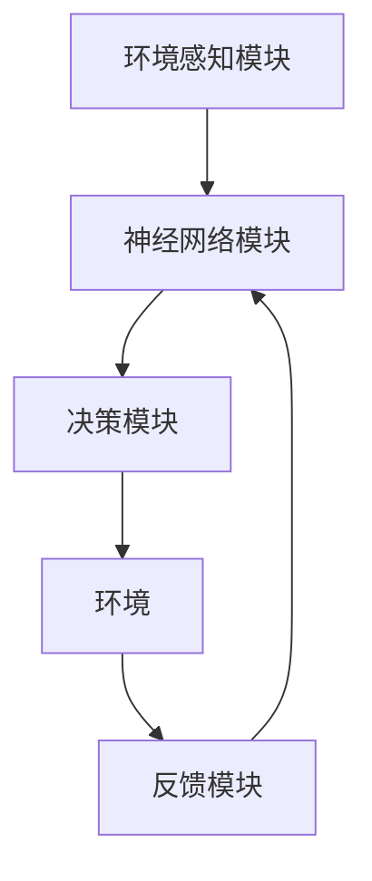

# 神经规划器在长期推理策略优化中的作用

> 关键词：神经规划器、长期推理、策略优化、强化学习、深度神经网络

> 摘要：本文深入探讨了神经规划器在长期推理策略优化中的重要作用。首先介绍了相关背景知识，包括研究目的、预期读者和文档结构等。接着详细阐述了神经规划器的核心概念、算法原理、数学模型。通过项目实战案例，展示了神经规划器在实际应用中的具体实现和代码解读。同时分析了神经规划器的实际应用场景，推荐了相关的学习资源、开发工具和论文著作。最后总结了神经规划器的未来发展趋势与挑战，并对常见问题进行了解答。旨在帮助读者全面理解神经规划器在长期推理策略优化中的关键价值和应用方法。

## 1. 背景介绍 
### 1.1 目的和范围
在当今复杂的现实世界问题中，长期推理和策略优化是至关重要的。例如在自动驾驶、机器人控制、金融投资等领域，系统需要在多个时间步长上做出决策，以实现长期的最优目标。神经规划器作为一种结合了神经网络强大的学习能力和规划算法的智能工具，为解决长期推理策略优化问题提供了新的思路和方法。

本文的目的是深入研究神经规划器在长期推理策略优化中的作用，探讨其核心概念、算法原理、数学模型，并通过实际案例展示其应用效果。范围涵盖了神经规划器的基本原理、实现方法、应用场景以及未来发展趋势等方面。

### 1.2 预期读者
本文预期读者包括人工智能领域的研究人员、工程师、程序员，以及对长期推理和策略优化问题感兴趣的相关专业人士。对于初学者，本文可以作为入门指南，帮助他们了解神经规划器的基本概念和应用方法；对于有一定经验的专业人士，本文提供了深入的技术分析和实际案例，可供他们参考和借鉴。

### 1.3 文档结构概述
本文共分为十个部分。第一部分为背景介绍，包括目的和范围、预期读者、文档结构概述和术语表。第二部分阐述核心概念与联系，介绍神经规划器的基本原理和架构，并通过文本示意图和 Mermaid 流程图进行直观展示。第三部分详细讲解核心算法原理和具体操作步骤，使用 Python 源代码进行说明。第四部分介绍数学模型和公式，并结合具体例子进行详细讲解。第五部分通过项目实战，展示神经规划器在实际应用中的代码实现和详细解释。第六部分分析神经规划器的实际应用场景。第七部分推荐相关的学习资源、开发工具和论文著作。第八部分总结神经规划器的未来发展趋势与挑战。第九部分为附录，解答常见问题。第十部分提供扩展阅读和参考资料。

### 1.4 术语表
#### 1.4.1 核心术语定义
- **神经规划器（Neural Planner）**：一种结合了神经网络和规划算法的智能系统，用于在复杂环境中进行决策和规划。
- **长期推理（Long-term Reasoning）**：在多个时间步长上进行思考和决策，以实现长期的目标。
- **策略优化（Policy Optimization）**：通过调整策略参数，使得智能体在环境中获得最优的累积奖励。
- **强化学习（Reinforcement Learning）**：一种通过智能体与环境进行交互，根据环境反馈的奖励信号来学习最优策略的机器学习方法。
- **深度神经网络（Deep Neural Network）**：一种具有多个隐藏层的神经网络，能够自动学习数据的复杂特征。

#### 1.4.2 相关概念解释
- **状态（State）**：环境在某一时刻的描述，通常用向量表示。
- **动作（Action）**：智能体在某一状态下可以采取的操作。
- **奖励（Reward）**：环境对智能体采取的动作的反馈，用于指导智能体的学习。
- **策略（Policy）**：智能体根据当前状态选择动作的规则。
- **价值函数（Value Function）**：用于评估某一状态或状态 - 动作对的价值，即从该状态或状态 - 动作对开始，按照某一策略执行所能获得的累积奖励。

#### 1.4.3 缩略词列表
- **RL**：Reinforcement Learning（强化学习）
- **DNN**：Deep Neural Network（深度神经网络）
- **MDP**：Markov Decision Process（马尔可夫决策过程）
- **Q - learning**：一种无模型的强化学习算法

## 2. 核心概念与联系 

### 核心概念原理
神经规划器的核心思想是将神经网络的强大学习能力与传统规划算法相结合。传统的规划算法，如 A* 算法、Dijkstra 算法等，在处理复杂环境时往往面临计算复杂度高、难以适应环境变化等问题。而神经网络可以通过学习大量的数据，自动提取环境的特征和模式，从而为规划提供更有效的信息。

神经规划器通常基于强化学习框架，智能体在环境中不断地进行交互，根据环境反馈的奖励信号来学习最优策略。神经网络可以用于近似价值函数或策略函数，从而实现对长期推理和策略优化的支持。

### 架构的文本示意图
神经规划器的基本架构主要包括以下几个部分：
- **环境感知模块**：负责感知环境的状态信息，将其转换为神经网络可以处理的输入格式。
- **神经网络模块**：根据输入的状态信息，输出动作建议或价值评估。
- **决策模块**：根据神经网络的输出，选择最优的动作。
- **反馈模块**：将智能体采取的动作和环境的反馈（奖励）传递给神经网络，用于更新网络参数。

```plaintext
+----------------+         +----------------+         +----------------+         +----------------+
| 环境感知模块   | ------> | 神经网络模块   | ------> | 决策模块       | ------> | 环境           |
+----------------+         +----------------+         +----------------+         +----------------+
                           ^                                       |
                           |                                       |
                           +----------------- 反馈模块 --------------+
```

### Mermaid 流程图


## 3. 核心算法原理 & 具体操作步骤 

### 核心算法原理
神经规划器的核心算法通常基于强化学习算法，如 Q - learning 算法。Q - learning 算法的目标是学习一个最优的动作价值函数 $Q(s, a)$，表示在状态 $s$ 下采取动作 $a$ 所能获得的最大累积奖励。

Q - learning 算法的更新公式为：
$$Q(s_t, a_t) \leftarrow Q(s_t, a_t) + \alpha [r_{t+1} + \gamma \max_{a} Q(s_{t+1}, a) - Q(s_t, a_t)]$$
其中，$s_t$ 表示当前状态，$a_t$ 表示当前动作，$r_{t+1}$ 表示采取动作 $a_t$ 后获得的奖励，$s_{t+1}$ 表示下一个状态，$\alpha$ 是学习率，$\gamma$ 是折扣因子。

在神经规划器中，我们可以使用深度神经网络来近似动作价值函数 $Q(s, a)$。具体来说，我们将状态 $s$ 作为神经网络的输入，输出每个动作的 $Q$ 值。

### 具体操作步骤
以下是使用 Python 和 PyTorch 实现一个简单的神经规划器的具体步骤：

```python
import torch
import torch.nn as nn
import torch.optim as optim
import numpy as np

# 定义神经网络模型
class QNetwork(nn.Module):
    def __init__(self, state_size, action_size):
        super(QNetwork, self).__init__()
        self.fc1 = nn.Linear(state_size, 64)
        self.fc2 = nn.Linear(64, 64)
        self.fc3 = nn.Linear(64, action_size)

    def forward(self, x):
        x = torch.relu(self.fc1(x))
        x = torch.relu(self.fc2(x))
        return self.fc3(x)

# 定义 Q - learning 算法
class QLearningAgent:
    def __init__(self, state_size, action_size, learning_rate=0.001, gamma=0.99, epsilon=0.1):
        self.state_size = state_size
        self.action_size = action_size
        self.learning_rate = learning_rate
        self.gamma = gamma
        self.epsilon = epsilon
        self.q_network = QNetwork(state_size, action_size)
        self.optimizer = optim.Adam(self.q_network.parameters(), lr=learning_rate)
        self.criterion = nn.MSELoss()

    def choose_action(self, state):
        if np.random.rand() <= self.epsilon:
            return np.random.choice(self.action_size)
        else:
            state = torch.FloatTensor(state).unsqueeze(0)
            q_values = self.q_network(state)
            action = torch.argmax(q_values).item()
            return action

    def learn(self, state, action, reward, next_state, done):
        state = torch.FloatTensor(state).unsqueeze(0)
        next_state = torch.FloatTensor(next_state).unsqueeze(0)
        q_values = self.q_network(state)
        next_q_values = self.q_network(next_state)
        target_q_values = q_values.clone()
        if done:
            target_q_values[0][action] = reward
        else:
            target_q_values[0][action] = reward + self.gamma * torch.max(next_q_values).item()
        self.optimizer.zero_grad()
        loss = self.criterion(q_values, target_q_values)
        loss.backward()
        self.optimizer.step()


# 示例使用
state_size = 4
action_size = 2
agent = QLearningAgent(state_size, action_size)
state = np.random.rand(state_size)
action = agent.choose_action(state)
next_state = np.random.rand(state_size)
reward = 1
done = False
agent.learn(state, action, reward, next_state, done)
```

### 代码解释
1. **QNetwork 类**：定义了一个简单的三层全连接神经网络，用于近似动作价值函数 $Q(s, a)$。
2. **QLearningAgent 类**：实现了 Q - learning 算法。`choose_action` 方法用于根据当前状态选择动作，采用 $\epsilon$-贪心策略。`learn` 方法用于更新神经网络的参数，根据 Q - learning 的更新公式计算损失并进行反向传播。
3. **示例使用**：创建一个 QLearningAgent 对象，随机生成一个状态，选择一个动作，模拟环境的反馈，然后调用 `learn` 方法进行学习。

## 4. 数学模型和公式 & 详细讲解 & 举例说明 

### 马尔可夫决策过程（MDP）
马尔可夫决策过程是描述智能体与环境交互的数学模型，由一个四元组 $(S, A, P, R)$ 表示，其中：
- $S$ 是状态空间，表示环境所有可能的状态。
- $A$ 是动作空间，表示智能体在每个状态下可以采取的动作。
- $P(s_{t+1} | s_t, a_t)$ 是状态转移概率，表示在状态 $s_t$ 下采取动作 $a_t$ 后转移到状态 $s_{t+1}$ 的概率。
- $R(s_t, a_t, s_{t+1})$ 是奖励函数，表示在状态 $s_t$ 下采取动作 $a_t$ 转移到状态 $s_{t+1}$ 时获得的奖励。

### 价值函数
价值函数用于评估某一状态或状态 - 动作对的价值。主要有两种价值函数：
- **状态价值函数 $V^{\pi}(s)$**：表示在策略 $\pi$ 下，从状态 $s$ 开始所能获得的期望累积奖励，定义为：
$$V^{\pi}(s) = \mathbb{E}_{\pi} \left[ \sum_{t=0}^{\infty} \gamma^t r_{t+1} | s_0 = s \right]$$
其中，$\gamma \in [0, 1]$ 是折扣因子，用于权衡即时奖励和未来奖励。

- **动作价值函数 $Q^{\pi}(s, a)$**：表示在策略 $\pi$ 下，从状态 $s$ 采取动作 $a$ 后所能获得的期望累积奖励，定义为：
$$Q^{\pi}(s, a) = \mathbb{E}_{\pi} \left[ \sum_{t=0}^{\infty} \gamma^t r_{t+1} | s_0 = s, a_0 = a \right]$$

### 最优价值函数和最优策略
最优状态价值函数 $V^*(s)$ 和最优动作价值函数 $Q^*(s, a)$ 分别定义为：
$$V^*(s) = \max_{\pi} V^{\pi}(s)$$
$$Q^*(s, a) = \max_{\pi} Q^{\pi}(s, a)$$

最优策略 $\pi^*$ 可以通过最优动作价值函数得到：
$$\pi^*(s) = \arg \max_{a} Q^*(s, a)$$

### 举例说明
考虑一个简单的网格世界问题，智能体在一个 $3 \times 3$ 的网格中移动，目标是从起点 $(0, 0)$ 到达终点 $(2, 2)$。状态空间 $S$ 是网格中所有可能的位置，动作空间 $A = \{ \text{上}, \text{下}, \text{左}, \text{右} \}$。

假设每次移动获得的奖励为 $-1$，到达终点获得的奖励为 $100$。折扣因子 $\gamma = 0.9$。

我们可以使用 Q - learning 算法来学习最优策略。初始时，所有的 $Q$ 值都设为 0。随着智能体不断地与环境交互，根据 Q - learning 的更新公式更新 $Q$ 值，最终收敛到最优动作价值函数 $Q^*(s, a)$。

例如，在状态 $(0, 0)$ 下，智能体选择动作 $\text{右}$，到达状态 $(0, 1)$，获得奖励 $-1$。根据 Q - learning 的更新公式：
$$Q((0, 0), \text{右}) \leftarrow Q((0, 0), \text{右}) + \alpha [-1 + 0.9 \max_{a} Q((0, 1), a) - Q((0, 0), \text{右})]$$

## 5. 项目实战：代码实际案例和详细解释说明 

### 5.1  开发环境搭建
为了实现神经规划器，我们需要搭建以下开发环境：
- **操作系统**：推荐使用 Linux 或 macOS，也可以使用 Windows。
- **Python 版本**：建议使用 Python 3.7 及以上版本。
- **深度学习框架**：使用 PyTorch 作为深度学习框架，可以通过以下命令安装：
```sh
pip install torch torchvision
```
- **其他依赖库**：还需要安装 numpy、matplotlib 等常用库，可以使用以下命令安装：
```sh
pip install numpy matplotlib
```

### 5.2  源代码详细实现和代码解读
我们以一个简单的迷宫问题为例，实现一个基于神经规划器的智能体来解决迷宫问题。

```python
import torch
import torch.nn as nn
import torch.optim as optim
import numpy as np
import matplotlib.pyplot as plt

# 定义迷宫环境
class MazeEnv:
    def __init__(self, maze_size):
        self.maze_size = maze_size
        self.maze = np.zeros((maze_size, maze_size))
        self.start = (0, 0)
        self.goal = (maze_size - 1, maze_size - 1)
        self.current_state = self.start

    def reset(self):
        self.current_state = self.start
        return self._state_to_array(self.current_state)

    def step(self, action):
        x, y = self.current_state
        if action == 0:  # 上
            x = max(x - 1, 0)
        elif action == 1:  # 下
            x = min(x + 1, self.maze_size - 1)
        elif action == 2:  # 左
            y = max(y - 1, 0)
        elif action == 3:  # 右
            y = min(y + 1, self.maze_size - 1)
        self.current_state = (x, y)
        done = self.current_state == self.goal
        reward = 100 if done else -1
        next_state = self._state_to_array(self.current_state)
        return next_state, reward, done

    def _state_to_array(self, state):
        x, y = state
        state_array = np.zeros((self.maze_size, self.maze_size))
        state_array[x, y] = 1
        return state_array.flatten()

# 定义神经网络模型
class QNetwork(nn.Module):
    def __init__(self, state_size, action_size):
        super(QNetwork, self).__init__()
        self.fc1 = nn.Linear(state_size, 64)
        self.fc2 = nn.Linear(64, 64)
        self.fc3 = nn.Linear(64, action_size)

    def forward(self, x):
        x = torch.relu(self.fc1(x))
        x = torch.relu(self.fc2(x))
        return self.fc3(x)

# 定义 Q - learning 算法
class QLearningAgent:
    def __init__(self, state_size, action_size, learning_rate=0.001, gamma=0.99, epsilon=0.1):
        self.state_size = state_size
        self.action_size = action_size
        self.learning_rate = learning_rate
        self.gamma = gamma
        self.epsilon = epsilon
        self.q_network = QNetwork(state_size, action_size)
        self.optimizer = optim.Adam(self.q_network.parameters(), lr=learning_rate)
        self.criterion = nn.MSELoss()

    def choose_action(self, state):
        if np.random.rand() <= self.epsilon:
            return np.random.choice(self.action_size)
        else:
            state = torch.FloatTensor(state).unsqueeze(0)
            q_values = self.q_network(state)
            action = torch.argmax(q_values).item()
            return action

    def learn(self, state, action, reward, next_state, done):
        state = torch.FloatTensor(state).unsqueeze(0)
        next_state = torch.FloatTensor(next_state).unsqueeze(0)
        q_values = self.q_network(state)
        next_q_values = self.q_network(next_state)
        target_q_values = q_values.clone()
        if done:
            target_q_values[0][action] = reward
        else:
            target_q_values[0][action] = reward + self.gamma * torch.max(next_q_values).item()
        self.optimizer.zero_grad()
        loss = self.criterion(q_values, target_q_values)
        loss.backward()
        self.optimizer.step()

# 训练智能体
def train_agent(env, agent, num_episodes=1000):
    rewards = []
    for episode in range(num_episodes):
        state = env.reset()
        total_reward = 0
        done = False
        while not done:
            action = agent.choose_action(state)
            next_state, reward, done = env.step(action)
            agent.learn(state, action, reward, next_state, done)
            state = next_state
            total_reward += reward
        rewards.append(total_reward)
        if episode % 100 == 0:
            print(f"Episode {episode}: Total Reward = {total_reward}")
    return rewards

# 主函数
if __name__ == "__main__":
    maze_size = 5
    env = MazeEnv(maze_size)
    state_size = maze_size * maze_size
    action_size = 4
    agent = QLearningAgent(state_size, action_size)
    rewards = train_agent(env, agent)

    # 绘制奖励曲线
    plt.plot(rewards)
    plt.xlabel('Episode')
    plt.ylabel('Total Reward')
    plt.title('Training Rewards')
    plt.show()
```

### 5.3  代码解读与分析
1. **MazeEnv 类**：定义了迷宫环境，包括迷宫的大小、起点、终点等信息。`reset` 方法用于重置环境，返回初始状态。`step` 方法根据智能体采取的动作更新环境状态，并返回下一个状态、奖励和是否完成的标志。
2. **QNetwork 类**：定义了一个简单的三层全连接神经网络，用于近似动作价值函数 $Q(s, a)$。
3. **QLearningAgent 类**：实现了 Q - learning 算法，包括选择动作和学习更新的方法。
4. **train_agent 函数**：用于训练智能体，在多个回合中与环境进行交互，记录每个回合的总奖励。
5. **主函数**：创建迷宫环境和智能体，调用 `train_agent` 函数进行训练，并绘制奖励曲线。

通过观察奖励曲线，我们可以评估智能体的学习效果。如果奖励曲线逐渐上升，说明智能体在不断学习和优化策略，能够更好地完成任务。

## 6. 实际应用场景 
神经规划器在许多实际应用场景中都有重要的作用，以下是一些常见的应用场景：

### 自动驾驶
在自动驾驶领域，车辆需要在复杂的交通环境中进行长期推理和决策，以确保安全、高效地到达目的地。神经规划器可以结合传感器数据，如摄像头、雷达等，对环境进行感知和建模，然后根据目标和约束条件，规划出最优的行驶路径和驾驶策略。例如，在遇到交通拥堵、路口转弯等情况时，神经规划器可以实时调整策略，选择最佳的行驶方案。

### 机器人控制
机器人在执行各种任务时，如物流搬运、家庭服务等，需要进行路径规划和动作决策。神经规划器可以帮助机器人在未知或动态环境中学习最优的策略，以适应不同的任务需求。例如，在仓库中，机器人需要在货架之间找到最短的路径，同时避免与其他物体发生碰撞。神经规划器可以根据环境信息和任务目标，生成最优的行动方案。

### 金融投资
在金融投资领域，投资者需要在不确定的市场环境中进行长期的资产配置和交易决策。神经规划器可以分析历史市场数据、宏观经济指标等信息，预测市场趋势，然后根据投资者的风险偏好和投资目标，制定最优的投资策略。例如，在股票市场中，神经规划器可以根据股票的价格走势、公司基本面等因素，选择最优的买入和卖出时机。

### 游戏开发
在游戏开发中，智能对手的行为规划是提高游戏趣味性和挑战性的关键。神经规划器可以用于实现智能 NPC（非玩家角色）的行为决策，使其能够根据游戏环境和玩家的行为做出合理的反应。例如，在策略游戏中，NPC 可以根据资源分布、敌方兵力等信息，制定最优的战略和战术。

## 7. 工具和资源推荐
### 7.1 学习资源推荐
#### 7.1.1 书籍推荐
- 《Reinforcement Learning: An Introduction》（Richard S. Sutton 和 Andrew G. Barto 著）：这是强化学习领域的经典教材，全面介绍了强化学习的基本概念、算法和应用。
- 《Deep Learning》（Ian Goodfellow、Yoshua Bengio 和 Aaron Courville 著）：深度学习领域的权威书籍，涵盖了深度神经网络的原理、训练方法和应用。
- 《Artificial Intelligence: A Modern Approach》（Stuart Russell 和 Peter Norvig 著）：人工智能领域的经典教材，介绍了人工智能的各个方面，包括搜索算法、知识表示、机器学习等。

#### 7.1.2 在线课程
- Coursera 上的 “Reinforcement Learning Specialization”：由 University of Alberta 提供，系统地介绍了强化学习的理论和实践。
- edX 上的 “Deep Learning MicroMasters Program”：包含多个深度学习相关的课程，适合深入学习深度学习技术。
- 哔哩哔哩上有许多关于人工智能和强化学习的教学视频，如李宏毅老师的机器学习课程，讲解生动易懂。

#### 7.1.3 技术博客和网站
- OpenAI Blog：OpenAI 发布的最新研究成果和技术文章，涵盖了人工智能的多个领域。
- Medium 上的 Towards Data Science：汇集了大量的数据科学和人工智能相关的文章，包括技术教程、案例分析等。
- arXiv.org：一个预印本平台，提供了最新的学术研究论文，对于了解前沿技术非常有帮助。

### 7.2 开发工具框架推荐
#### 7.2.1 IDE和编辑器
- PyCharm：一款专业的 Python 集成开发环境，提供了丰富的代码编辑、调试和项目管理功能。
- Jupyter Notebook：一个交互式的开发环境，适合进行数据分析、模型实验和代码演示。
- Visual Studio Code：一款轻量级的代码编辑器，支持多种编程语言和插件扩展，非常适合快速开发。

#### 7.2.2 调试和性能分析工具
- PyTorch Profiler：PyTorch 提供的性能分析工具，可以帮助开发者分析模型的运行时间、内存使用等情况。
- TensorBoard：TensorFlow 提供的可视化工具，也可以用于 PyTorch 模型的训练过程可视化和性能分析。
- cProfile：Python 内置的性能分析模块，可以帮助开发者找出代码中的性能瓶颈。

#### 7.2.3 相关框架和库
- PyTorch：一个开源的深度学习框架，具有动态图和易于使用的特点，广泛应用于研究和工业界。
- TensorFlow：另一个流行的深度学习框架，提供了丰富的工具和库，适合大规模的深度学习应用。
- Gym：OpenAI 开发的强化学习环境库，提供了多种不同类型的环境，方便开发者进行强化学习算法的实验和测试。

### 7.3 相关论文著作推荐
#### 7.3.1 经典论文
- “Human - Level Control through Deep Reinforcement Learning”（Volodymyr Mnih 等著）：提出了深度 Q 网络（DQN）算法，开创了深度强化学习的先河。
- “Mastering the Game of Go with Deep Neural Networks and Tree Search”（David Silver 等著）：介绍了 AlphaGo 系统，将深度神经网络和蒙特卡罗树搜索相结合，在围棋领域取得了重大突破。
- “Policy Gradient Methods for Reinforcement Learning with Function Approximation”（Richard S. Sutton 等著）：提出了策略梯度算法，为强化学习中的策略优化提供了重要的理论基础。

#### 7.3.2 最新研究成果
- 关注 arXiv.org 上的最新论文，特别是关于神经规划器、强化学习和深度学习的研究。
- 参加国际人工智能会议，如 NeurIPS、ICML、AAAI 等，了解最新的研究动态和成果。

#### 7.3.3 应用案例分析
- 可以参考一些实际应用案例的论文，如自动驾驶、机器人控制等领域的应用，了解神经规划器在实际场景中的应用方法和效果。

## 8. 总结：未来发展趋势与挑战
### 未来发展趋势
- **结合更多的知识和先验信息**：未来的神经规划器将不仅仅依赖于环境的反馈信息，还会结合更多的领域知识和先验信息，以提高规划的效率和准确性。例如，在自动驾驶中，可以结合地图信息、交通规则等先验知识，更好地规划行驶路径。
- **多智能体协作**：在复杂的现实世界中，往往需要多个智能体进行协作来完成任务。未来的神经规划器将支持多智能体协作，通过智能体之间的通信和协调，实现更高效的任务执行。例如，在物流配送中，多个机器人可以通过协作完成货物的搬运和分发。
- **可解释性和安全性**：随着人工智能技术的广泛应用，神经规划器的可解释性和安全性变得越来越重要。未来的研究将致力于提高神经规划器的可解释性，使人类能够理解其决策过程和依据，同时加强安全性保障，避免出现不可预测的行为。

### 挑战
- **计算复杂度**：神经规划器通常需要处理大量的数据和复杂的模型，计算复杂度较高。在实际应用中，如何提高计算效率，降低计算成本，是一个亟待解决的问题。
- **环境不确定性**：现实世界的环境往往是不确定的，存在噪声、动态变化等因素。神经规划器需要具备较强的鲁棒性，能够在不确定的环境中做出合理的决策。
- **数据质量和数量**：神经规划器的性能很大程度上依赖于训练数据的质量和数量。如何获取高质量、大规模的训练数据，以及如何有效地利用这些数据进行训练，是一个挑战。

## 9. 附录：常见问题与解答
### 问题 1：神经规划器和传统规划算法有什么区别？
神经规划器结合了神经网络的学习能力和传统规划算法的思想。传统规划算法通常基于规则和模型，在处理复杂环境时可能会遇到计算复杂度高、难以适应环境变化等问题。而神经规划器可以通过学习大量的数据，自动提取环境的特征和模式，从而更好地适应复杂和动态的环境。

### 问题 2：如何选择合适的神经网络架构？
选择合适的神经网络架构需要考虑多个因素，如问题的复杂度、数据的特点、计算资源等。对于简单的问题，可以选择简单的全连接神经网络；对于处理图像、序列等数据，可以选择卷积神经网络（CNN）、循环神经网络（RNN）等特定的架构。此外，还可以通过实验和调优来选择最优的架构。

### 问题 3：神经规划器的训练时间通常需要多长？
神经规划器的训练时间取决于多个因素，如问题的复杂度、神经网络的规模、训练数据的数量和质量等。对于简单的问题，训练时间可能只需要几分钟到几小时；对于复杂的问题，训练时间可能需要几天甚至几周。可以通过优化算法、使用并行计算等方法来缩短训练时间。

### 问题 4：如何评估神经规划器的性能？
可以使用多种指标来评估神经规划器的性能，如累积奖励、成功率、规划时间等。累积奖励反映了智能体在整个任务过程中获得的总奖励，成功率表示智能体完成任务的比例，规划时间表示智能体完成一次规划所需的时间。可以根据具体的应用场景选择合适的评估指标。

## 10. 扩展阅读 & 参考资料
- 《Advanced Reinforcement Learning and Stochastic Control》（Vijay R. Konda 著）：深入介绍了强化学习和随机控制的理论和方法。
- 《Deep Reinforcement Learning Hands - On》（Max Lapan 著）：提供了丰富的强化学习实践案例和代码实现。
- OpenAI Gym 官方文档：详细介绍了 Gym 环境库的使用方法和相关文档。
- PyTorch 官方文档：提供了 PyTorch 框架的详细文档和教程。

作者：AI天才研究院/AI Genius Institute & 禅与计算机程序设计艺术 /Zen And The Art of Computer Programming