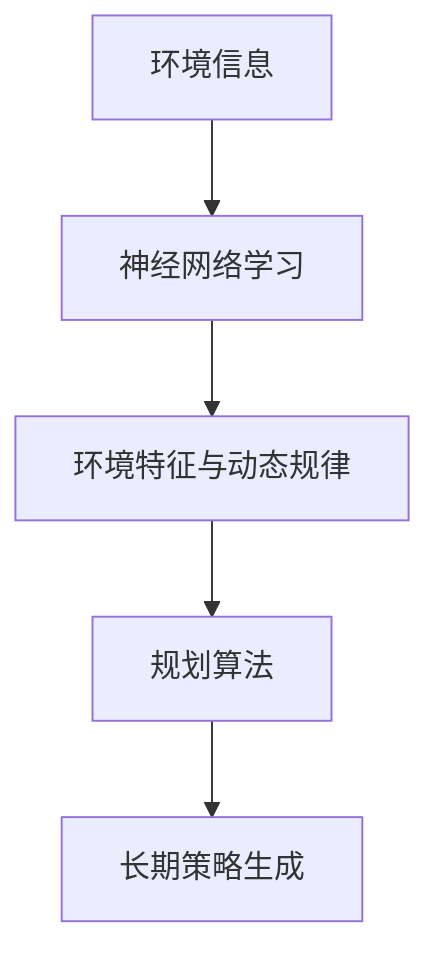

# 神经规划器在长期策略推理优化中的作用

> 关键词：神经规划器、长期策略推理、优化、人工智能、决策制定

> 摘要：本文深入探讨了神经规划器在长期策略推理优化中的作用。首先介绍了相关背景知识，包括目的、预期读者、文档结构和术语表。接着阐述了神经规划器的核心概念与联系，通过文本示意图和 Mermaid 流程图进行清晰展示。详细讲解了核心算法原理，并给出 Python 源代码示例。分析了相关数学模型和公式，并举例说明。通过项目实战，展示了代码实际案例并进行详细解释。探讨了神经规划器的实际应用场景，推荐了相关的学习资源、开发工具框架和论文著作。最后总结了未来发展趋势与挑战，提供了常见问题与解答以及扩展阅读和参考资料。旨在帮助读者全面了解神经规划器在长期策略推理优化中的重要价值和应用方法。

## 1. 背景介绍 
### 1.1 目的和范围
在当今复杂多变的环境中，许多领域都面临着制定长期策略的挑战。长期策略推理优化需要考虑众多因素、动态变化的环境以及各种不确定性。神经规划器作为一种结合了神经网络强大的学习能力和规划算法的智能工具，为解决长期策略推理优化问题提供了新的思路和方法。本文的目的是深入探讨神经规划器在长期策略推理优化中的作用，详细介绍其原理、算法、应用场景等方面的内容，使读者全面了解神经规划器在该领域的应用价值和潜力。范围涵盖了神经规划器的基本概念、核心算法、数学模型、实际应用案例以及相关的学习资源和未来发展趋势等。

### 1.2 预期读者
本文预期读者包括人工智能领域的研究人员、开发者、学生，以及对长期策略推理优化问题感兴趣的专业人士。对于研究人员，本文可以提供神经规划器在长期策略推理优化方面的最新研究进展和思路；对于开发者，可帮助他们掌握神经规划器的实现方法和应用技巧；对于学生，有助于他们了解该领域的前沿知识和研究方向；对于其他专业人士，能让他们了解神经规划器在实际问题中的应用价值。

### 1.3 文档结构概述
本文将按照以下结构进行组织：首先介绍背景知识，包括目的、预期读者、文档结构和术语表；接着阐述神经规划器的核心概念与联系，通过文本示意图和 Mermaid 流程图进行清晰展示；详细讲解核心算法原理，并给出 Python 源代码示例；分析相关数学模型和公式，并举例说明；通过项目实战，展示代码实际案例并进行详细解释；探讨神经规划器的实际应用场景；推荐相关的学习资源、开发工具框架和论文著作；最后总结未来发展趋势与挑战，提供常见问题与解答以及扩展阅读和参考资料。

### 1.4 术语表
#### 1.4.1 核心术语定义
- **神经规划器（Neural Planner）**：一种结合了神经网络和规划算法的智能系统，利用神经网络的学习能力来处理复杂的环境信息和优化规划过程。
- **长期策略推理（Long-term Strategy Reasoning）**：对未来较长时间内的决策和行动进行思考和规划，考虑多种因素和不确定性，以实现最优的长期目标。
- **优化（Optimization）**：在一定的约束条件下，寻找使目标函数达到最优值的解决方案。
- **神经网络（Neural Network）**：一种模仿人类神经系统的计算模型，由大量的神经元组成，能够自动学习数据中的模式和规律。
- **规划算法（Planning Algorithm）**：用于生成行动序列以实现特定目标的算法，考虑环境的状态和约束条件。

#### 1.4.2 相关概念解释
- **策略（Strategy）**：在特定环境下，为实现目标而采取的一系列决策和行动的规则。
- **推理（Reasoning）**：从已知信息中推导出新信息的过程，在长期策略推理中，是根据当前状态和历史数据预测未来并制定策略的过程。
- **环境模型（Environment Model）**：对实际环境的抽象表示，用于模拟环境的动态变化和状态转移。

#### 1.4.3 缩略词列表
- **NN**：Neural Network（神经网络）
- **RL**：Reinforcement Learning（强化学习）

## 2. 核心概念与联系 
神经规划器的核心在于将神经网络的强大学习能力与传统规划算法相结合，以实现更高效、更智能的长期策略推理优化。其基本原理是通过神经网络学习环境的特征和动态规律，然后利用这些知识进行规划，生成最优的长期策略。

### 文本示意图
```plaintext
            环境信息
               |
               v
        神经网络学习
               |
               v
  环境特征与动态规律
               |
               v
        规划算法
               |
               v
     长期策略生成
```

### Mermaid 流程图


在这个过程中，神经网络负责从环境信息中提取有用的特征，学习环境的动态变化规律。这些学习到的知识被传递给规划算法，规划算法根据这些信息生成最优的长期策略。这种结合使得神经规划器能够处理复杂的环境和不确定性，提高长期策略推理的准确性和效率。

## 3. 核心算法原理 & 具体操作步骤 
### 核心算法原理
神经规划器的核心算法通常基于强化学习和深度学习的思想。以基于策略梯度的方法为例，其目标是最大化长期累积奖励。设策略函数 $\pi_{\theta}(a|s)$ 表示在状态 $s$ 下采取动作 $a$ 的概率，其中 $\theta$ 是神经网络的参数。通过与环境进行交互，收集一系列的状态 - 动作 - 奖励序列 $(s_t, a_t, r_t)$，其中 $t$ 表示时间步。

策略梯度算法的核心思想是通过梯度上升的方法更新策略函数的参数 $\theta$，使得长期累积奖励 $R = \sum_{t=0}^{T} \gamma^t r_t$ 最大化，其中 $\gamma$ 是折扣因子，用于平衡近期奖励和远期奖励的重要性。策略梯度的计算公式为：

$$
\nabla_{\theta} J(\theta) = \mathbb{E}_{\tau \sim \pi_{\theta}} \left[ \sum_{t=0}^{T} \nabla_{\theta} \log \pi_{\theta}(a_t|s_t) R_t \right]
$$

其中，$\tau$ 表示一个轨迹，$R_t$ 表示从时间步 $t$ 开始的累积奖励。

### 具体操作步骤
#### 步骤 1：初始化
- 初始化神经网络的参数 $\theta$。
- 初始化环境。

#### 步骤 2：与环境交互
- 在每个时间步 $t$：
    - 根据当前状态 $s_t$，通过策略函数 $\pi_{\theta}(a|s_t)$ 选择一个动作 $a_t$。
    - 执行动作 $a_t$，得到下一个状态 $s_{t+1}$ 和奖励 $r_t$。
    - 记录状态 - 动作 - 奖励序列 $(s_t, a_t, r_t)$。

#### 步骤 3：计算累积奖励
- 对于每个时间步 $t$，计算从该时间步开始的累积奖励 $R_t$。

#### 步骤 4：更新策略参数
- 根据策略梯度公式计算梯度 $\nabla_{\theta} J(\theta)$。
- 使用梯度上升的方法更新策略函数的参数 $\theta$：

$$
\theta \leftarrow \theta + \alpha \nabla_{\theta} J(\theta)
$$

其中，$\alpha$ 是学习率。

#### 步骤 5：重复步骤 2 - 4
- 重复上述步骤，直到达到终止条件（如达到最大时间步数或收敛）。

### Python 源代码示例
```python
import torch
import torch.nn as nn
import torch.optim as optim
import numpy as np

# 定义策略网络
class PolicyNetwork(nn.Module):
    def __init__(self, input_dim, output_dim):
        super(PolicyNetwork, self).__init__()
        self.fc1 = nn.Linear(input_dim, 64)
        self.fc2 = nn.Linear(64, output_dim)
        self.softmax = nn.Softmax(dim=-1)

    def forward(self, x):
        x = torch.relu(self.fc1(x))
        x = self.fc2(x)
        action_probs = self.softmax(x)
        return action_probs

# 定义训练函数
def train(env, policy_network, num_episodes, gamma=0.99, lr=0.001):
    optimizer = optim.Adam(policy_network.parameters(), lr=lr)

    for episode in range(num_episodes):
        states, actions, rewards = [], [], []
        state = env.reset()
        done = False

        while not done:
            state = torch.FloatTensor(state).unsqueeze(0)
            action_probs = policy_network(state)
            action = torch.multinomial(action_probs, 1).item()

            next_state, reward, done, _ = env.step(action)

            states.append(state)
            actions.append(action)
            rewards.append(reward)

            state = next_state

        # 计算累积奖励
        R = 0
        discounted_rewards = []
        for r in rewards[::-1]:
            R = r + gamma * R
            discounted_rewards.insert(0, R)

        discounted_rewards = torch.FloatTensor(discounted_rewards)
        discounted_rewards = (discounted_rewards - discounted_rewards.mean()) / (discounted_rewards.std() + 1e-9)

        # 计算损失
        loss = 0
        for i in range(len(states)):
            state = states[i]
            action = actions[i]
            action_probs = policy_network(state)
            log_prob = torch.log(action_probs.squeeze(0)[action])
            loss += -log_prob * discounted_rewards[i]

        # 更新参数
        optimizer.zero_grad()
        loss.backward()
        optimizer.step()

        if episode % 10 == 0:
            print(f"Episode {episode}: Total Reward = {sum(rewards)}")

# 示例环境（这里使用一个简单的虚拟环境）
class SimpleEnv:
    def __init__(self):
        self.state = np.random.randn(4)
        self.max_steps = 100
        self.step_count = 0

    def reset(self):
        self.state = np.random.randn(4)
        self.step_count = 0
        return self.state

    def step(self, action):
        self.state += np.random.randn(4) * 0.1
        reward = np.sum(self.state)
        self.step_count += 1
        done = self.step_count >= self.max_steps
        return self.state, reward, done, {}

# 主程序
if __name__ == "__main__":
    env = SimpleEnv()
    input_dim = 4
    output_dim = 2
    policy_network = PolicyNetwork(input_dim, output_dim)
    train(env, policy_network, num_episodes=100)
```

## 4. 数学模型和公式 & 详细讲解 & 举例说明 
### 数学模型
神经规划器的数学模型主要基于马尔可夫决策过程（MDP）。一个马尔可夫决策过程可以用一个五元组 $\langle S, A, P, R, \gamma \rangle$ 表示，其中：
- $S$ 是状态空间，表示环境的所有可能状态。
- $A$ 是动作空间，表示智能体可以采取的所有可能动作。
- $P(s'|s, a)$ 是状态转移概率，表示在状态 $s$ 下采取动作 $a$ 后转移到状态 $s'$ 的概率。
- $R(s, a, s')$ 是奖励函数，表示在状态 $s$ 下采取动作 $a$ 并转移到状态 $s'$ 时获得的奖励。
- $\gamma \in [0, 1]$ 是折扣因子，用于平衡近期奖励和远期奖励的重要性。

### 价值函数和策略函数
在 MDP 中，有两个重要的函数：价值函数和策略函数。

#### 价值函数
价值函数分为状态价值函数 $V^{\pi}(s)$ 和动作价值函数 $Q^{\pi}(s, a)$。

- 状态价值函数 $V^{\pi}(s)$ 表示在策略 $\pi$ 下，从状态 $s$ 开始的长期累积奖励的期望：

$$
V^{\pi}(s) = \mathbb{E}_{\tau \sim \pi} \left[ \sum_{t=0}^{\infty} \gamma^t r_t \big| s_0 = s \right]
$$

- 动作价值函数 $Q^{\pi}(s, a)$ 表示在策略 $\pi$ 下，从状态 $s$ 采取动作 $a$ 开始的长期累积奖励的期望：

$$
Q^{\pi}(s, a) = \mathbb{E}_{\tau \sim \pi} \left[ \sum_{t=0}^{\infty} \gamma^t r_t \big| s_0 = s, a_0 = a \right]
$$

#### 策略函数
策略函数 $\pi(a|s)$ 表示在状态 $s$ 下采取动作 $a$ 的概率。最优策略 $\pi^*$ 是使得价值函数最大的策略。

### 贝尔曼方程
价值函数满足贝尔曼方程。对于状态价值函数，贝尔曼方程为：

$$
V^{\pi}(s) = \sum_{a \in A} \pi(a|s) \left[ R(s, a) + \gamma \sum_{s' \in S} P(s'|s, a) V^{\pi}(s') \right]
$$

对于动作价值函数，贝尔曼方程为：

$$
Q^{\pi}(s, a) = R(s, a) + \gamma \sum_{s' \in S} P(s'|s, a) \sum_{a' \in A} \pi(a'|s') Q^{\pi}(s', a')
$$

### 举例说明
考虑一个简单的网格世界环境，智能体在一个 $3 \times 3$ 的网格中移动，目标是从起点到达终点。状态 $s$ 表示智能体在网格中的位置，动作 $a$ 包括上、下、左、右移动。奖励函数 $R(s, a)$ 定义为：如果到达终点，奖励为 10；如果撞到墙壁，奖励为 -1；其他情况奖励为 0。

假设折扣因子 $\gamma = 0.9$，策略 $\pi$ 是随机选择动作。我们可以使用贝尔曼方程计算状态价值函数和动作价值函数。

例如，对于状态 $s$，我们可以根据贝尔曼方程计算其状态价值函数：

$$
V^{\pi}(s) = \frac{1}{4} \sum_{a \in \{上, 下, 左, 右\}} \left[ R(s, a) + 0.9 \sum_{s' \in S} P(s'|s, a) V^{\pi}(s') \right]
$$

通过迭代求解贝尔曼方程，我们可以得到最优的价值函数和策略。

## 5. 项目实战：代码实际案例和详细解释说明 
### 5.1  开发环境搭建
#### 安装 Python
首先，确保你已经安装了 Python 3.x 版本。可以从 Python 官方网站（https://www.python.org/downloads/） 下载并安装。

#### 安装必要的库
我们需要安装一些必要的 Python 库，如 `torch`、`numpy` 等。可以使用以下命令进行安装：

```bash
pip install torch numpy
```

### 5.2  源代码详细实现和代码解读
```python
import torch
import torch.nn as nn
import torch.optim as optim
import numpy as np

# 定义策略网络
class PolicyNetwork(nn.Module):
    def __init__(self, input_dim, output_dim):
        super(PolicyNetwork, self).__init__()
        self.fc1 = nn.Linear(input_dim, 64)
        self.fc2 = nn.Linear(64, output_dim)
        self.softmax = nn.Softmax(dim=-1)

    def forward(self, x):
        x = torch.relu(self.fc1(x))
        x = self.fc2(x)
        action_probs = self.softmax(x)
        return action_probs

# 定义训练函数
def train(env, policy_network, num_episodes, gamma=0.99, lr=0.001):
    optimizer = optim.Adam(policy_network.parameters(), lr=lr)

    for episode in range(num_episodes):
        states, actions, rewards = [], [], []
        state = env.reset()
        done = False

        while not done:
            state = torch.FloatTensor(state).unsqueeze(0)
            action_probs = policy_network(state)
            action = torch.multinomial(action_probs, 1).item()

            next_state, reward, done, _ = env.step(action)

            states.append(state)
            actions.append(action)
            rewards.append(reward)

            state = next_state

        # 计算累积奖励
        R = 0
        discounted_rewards = []
        for r in rewards[::-1]:
            R = r + gamma * R
            discounted_rewards.insert(0, R)

        discounted_rewards = torch.FloatTensor(discounted_rewards)
        discounted_rewards = (discounted_rewards - discounted_rewards.mean()) / (discounted_rewards.std() + 1e-9)

        # 计算损失
        loss = 0
        for i in range(len(states)):
            state = states[i]
            action = actions[i]
            action_probs = policy_network(state)
            log_prob = torch.log(action_probs.squeeze(0)[action])
            loss += -log_prob * discounted_rewards[i]

        # 更新参数
        optimizer.zero_grad()
        loss.backward()
        optimizer.step()

        if episode % 10 == 0:
            print(f"Episode {episode}: Total Reward = {sum(rewards)}")

# 示例环境（这里使用一个简单的虚拟环境）
class SimpleEnv:
    def __init__(self):
        self.state = np.random.randn(4)
        self.max_steps = 100
        self.step_count = 0

    def reset(self):
        self.state = np.random.randn(4)
        self.step_count = 0
        return self.state

    def step(self, action):
        self.state += np.random.randn(4) * 0.1
        reward = np.sum(self.state)
        self.step_count += 1
        done = self.step_count >= self.max_steps
        return self.state, reward, done, {}

# 主程序
if __name__ == "__main__":
    env = SimpleEnv()
    input_dim = 4
    output_dim = 2
    policy_network = PolicyNetwork(input_dim, output_dim)
    train(env, policy_network, num_episodes=100)
```

### 代码解读与分析
#### 策略网络定义
`PolicyNetwork` 类定义了一个简单的神经网络，用于学习策略函数。它包含两个全连接层和一个 Softmax 层，输出每个动作的概率。

#### 训练函数
`train` 函数实现了策略梯度算法的训练过程。在每个 episode 中，智能体与环境进行交互，收集状态 - 动作 - 奖励序列。然后计算累积奖励，并根据策略梯度公式计算损失。最后使用梯度上升的方法更新策略网络的参数。

#### 示例环境
`SimpleEnv` 类定义了一个简单的虚拟环境，智能体的状态是一个四维向量，动作空间有两个动作。每次执行动作后，状态会随机变化，奖励是状态向量的和。

#### 主程序
在主程序中，我们创建了一个环境实例和一个策略网络实例，然后调用 `train` 函数进行训练。

## 6. 实际应用场景 
### 机器人导航
在机器人导航中，神经规划器可以用于生成长期的导航策略。机器人需要在复杂的环境中找到从起点到终点的最优路径，同时考虑障碍物、动态变化的环境等因素。神经规划器可以学习环境的特征和动态规律，根据当前状态生成最优的导航策略，使机器人能够高效、安全地到达目标位置。

### 金融投资
在金融投资领域，神经规划器可以用于制定长期的投资策略。投资者需要考虑市场的波动、不同资产的风险和收益等因素，以实现资产的最大化增值。神经规划器可以学习市场的历史数据和规律，根据当前的市场状态和投资者的目标，生成最优的投资组合和交易策略。

### 智能交通管理
在智能交通管理中，神经规划器可以用于优化交通流量和调度。例如，在城市交通中，神经规划器可以根据实时的交通信息，如车辆密度、道路拥堵情况等，生成最优的交通信号控制策略和车辆调度方案，以减少交通拥堵，提高交通效率。

### 游戏开发
在游戏开发中，神经规划器可以用于实现智能的游戏 AI。游戏角色需要根据游戏环境和对手的行为，制定长期的策略以取得胜利。神经规划器可以学习游戏的规则和策略，根据当前的游戏状态生成最优的行动方案，使游戏角色具有更高的智能水平。

## 7. 工具和资源推荐
### 7.1 学习资源推荐
#### 7.1.1 书籍推荐
- 《强化学习：原理与Python实现》：这本书详细介绍了强化学习的基本原理和算法，并给出了大量的 Python 代码示例，适合初学者入门。
- 《深度学习》：由 Ian Goodfellow、Yoshua Bengio 和 Aaron Courville 编写，是深度学习领域的经典教材，涵盖了神经网络、卷积神经网络、循环神经网络等内容。
- 《人工智能：一种现代的方法》：全面介绍了人工智能的各个领域，包括搜索算法、知识表示、机器学习等，是人工智能领域的权威书籍。

#### 7.1.2 在线课程
- Coursera 上的“强化学习专项课程”：由 DeepMind 的研究人员授课，系统地介绍了强化学习的理论和实践。
- edX 上的“深度学习微硕士项目”：包含多个深度学习相关的课程，适合深入学习深度学习知识。
- 哔哩哔哩上有许多关于人工智能和机器学习的教学视频，如李宏毅的机器学习课程，讲解生动易懂。

#### 7.1.3 技术博客和网站
- Medium 上有许多关于人工智能和机器学习的优秀博客文章，如 Towards Data Science 等。
- arXiv 是一个预印本平台，提供了大量的最新研究论文，涵盖了人工智能的各个领域。
- GitHub 上有许多开源的人工智能项目和代码库，可以学习和参考。

### 7.2 开发工具框架推荐
#### 7.2.1 IDE和编辑器
- PyCharm：是一款专业的 Python 集成开发环境，具有强大的代码编辑、调试和项目管理功能。
- Jupyter Notebook：是一个交互式的开发环境，适合进行数据分析、模型训练和实验。
- Visual Studio Code：是一款轻量级的代码编辑器，支持多种编程语言和插件扩展，具有良好的开发体验。

#### 7.2.2 调试和性能分析工具
- TensorBoard：是 TensorFlow 提供的可视化工具，可以用于可视化模型的训练过程、损失函数、梯度等信息。
- PyTorch Profiler：是 PyTorch 提供的性能分析工具，可以帮助开发者分析模型的性能瓶颈，优化代码。
- cProfile：是 Python 内置的性能分析工具，可以用于分析 Python 代码的运行时间和函数调用情况。

#### 7.2.3 相关框架和库
- PyTorch：是一个开源的深度学习框架，具有动态图机制，易于使用和调试。
- TensorFlow：是另一个广泛使用的深度学习框架，提供了丰富的工具和库，支持分布式训练。
- Gym：是 OpenAI 开发的一个开源的强化学习环境库，提供了多种不同类型的环境，方便开发者进行强化学习实验。

### 7.3 相关论文著作推荐
#### 7.3.1 经典论文
- “Policy Gradient Methods for Reinforcement Learning with Function Approximation”：这篇论文介绍了策略梯度算法的基本原理和方法，是强化学习领域的经典论文。
- “Human-level control through deep reinforcement learning”：这篇论文提出了深度 Q 网络（DQN）算法，首次将深度学习与强化学习相结合，在 Atari 游戏中取得了人类水平的表现。
- “Attention Is All You Need”：这篇论文提出了 Transformer 模型，是自然语言处理领域的重要突破，对后续的研究产生了深远影响。

#### 7.3.2 最新研究成果
- 可以关注 NeurIPS、ICML、CVPR 等顶级人工智能会议的最新论文，了解神经规划器和长期策略推理优化领域的最新研究进展。
- 一些知名的研究机构，如 DeepMind、OpenAI 等，也会发布相关的研究成果和论文。

#### 7.3.3 应用案例分析
- 可以参考一些实际应用案例的论文和报告，了解神经规划器在不同领域的应用方法和效果。例如，一些关于机器人导航、金融投资等领域的应用案例分析。

## 8. 总结：未来发展趋势与挑战
### 未来发展趋势
#### 多模态融合
未来的神经规划器可能会融合多种模态的信息，如图像、语音、文本等，以更好地理解复杂的环境和任务。例如，在机器人导航中，结合视觉信息和语音指令，使机器人能够更准确地完成任务。

#### 与知识图谱结合
将神经规划器与知识图谱相结合，可以引入先验知识，提高规划的准确性和可解释性。知识图谱可以提供丰富的领域知识和语义信息，帮助神经规划器更好地进行推理和决策。

#### 强化学习与模仿学习结合
强化学习需要大量的交互和试错，而模仿学习可以从人类专家的示范中学习。将两者结合起来，可以加快学习速度，提高学习效率。例如，在自动驾驶中，先通过模仿学习学习人类驾驶员的行为，然后再通过强化学习进行优化。

### 挑战
#### 可解释性问题
神经规划器通常是基于神经网络的黑盒模型，其决策过程难以解释。在一些对安全性和可靠性要求较高的领域，如医疗、金融等，可解释性是一个重要的问题。未来需要研究如何提高神经规划器的可解释性，使其决策过程更加透明。

#### 数据效率问题
神经规划器通常需要大量的数据进行训练，数据收集和标注的成本较高。如何提高数据效率，减少对数据的依赖，是一个亟待解决的问题。例如，研究少样本学习、元学习等方法，以提高神经规划器在数据有限的情况下的性能。

#### 环境适应性问题
实际环境往往是复杂多变的，神经规划器需要具备良好的环境适应性。如何使神经规划器能够快速适应新的环境和任务，是一个挑战。例如，研究迁移学习、领域自适应等方法，以提高神经规划器的泛化能力。

## 9. 附录：常见问题与解答
### 问题 1：神经规划器与传统规划算法有什么区别？
神经规划器结合了神经网络的学习能力和传统规划算法的思想。传统规划算法通常基于精确的模型和规则，在处理复杂环境和不确定性时存在一定的局限性。而神经规划器可以通过神经网络学习环境的特征和动态规律，更好地处理复杂环境和不确定性。

### 问题 2：神经规划器需要大量的数据进行训练吗？
一般来说，神经规划器需要一定量的数据进行训练，以学习环境的特征和规律。但是，通过一些技术手段，如强化学习中的探索策略、少样本学习等，可以减少对数据的依赖。

### 问题 3：神经规划器的可解释性如何？
神经规划器通常是基于神经网络的黑盒模型，其决策过程难以解释。目前，一些研究致力于提高神经规划器的可解释性，如使用可视化技术、引入可解释的模型结构等。

### 问题 4：神经规划器在实际应用中有哪些限制？
神经规划器在实际应用中可能受到计算资源、数据质量、环境适应性等方面的限制。例如，在一些资源受限的设备上，运行复杂的神经规划器可能会面临计算能力不足的问题。

## 10. 扩展阅读 & 参考资料
### 扩展阅读
- 《人工智能前沿技术》：介绍了人工智能领域的最新前沿技术和研究方向，包括神经规划器、量子计算等。
- 《智能机器人技术》：详细介绍了智能机器人的相关技术，包括机器人导航、感知、决策等，与神经规划器在机器人领域的应用密切相关。

### 参考资料
- Sutton, R. S., & Barto, A. G. (2018). Reinforcement learning: An introduction. MIT press.
- Goodfellow, I., Bengio, Y., & Courville, A. (2016). Deep learning. MIT press.
- Russell, S. J., & Norvig, P. (2009). Artificial intelligence: A modern approach. Pearson Education.

作者：AI天才研究院/AI Genius Institute & 禅与计算机程序设计艺术 /Zen And The Art of Computer Programming