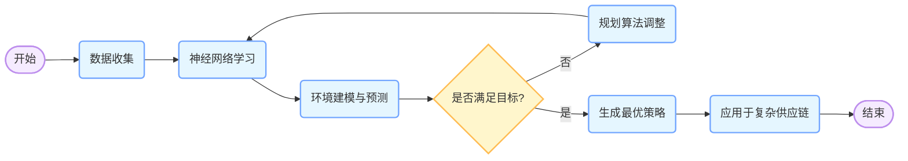

# 神经规划在复杂供应链优化推理中的创新应用

> 关键词：神经规划、复杂供应链、优化推理、创新应用、供应链管理

> 摘要：本文聚焦于神经规划在复杂供应链优化推理中的创新应用。首先介绍了研究的背景、目的、预期读者、文档结构和相关术语。接着阐述了神经规划和复杂供应链的核心概念及其联系，给出了原理和架构的示意图与流程图。详细讲解了神经规划的核心算法原理，并用 Python 代码进行了具体操作步骤的展示。通过数学模型和公式对相关理论进行了深入分析，并举例说明。以项目实战的方式给出代码实际案例并详细解释。探讨了神经规划在复杂供应链中的实际应用场景，推荐了学习资源、开发工具框架和相关论文著作。最后总结了未来发展趋势与挑战，提供了常见问题解答和扩展阅读参考资料，旨在为该领域的研究和实践提供全面且深入的指导。

## 1. 背景介绍 
### 1.1 目的和范围
在当今全球化的商业环境中，供应链变得越来越复杂。复杂供应链涉及众多环节，如原材料采购、生产制造、物流配送、销售等，每个环节都受到多种因素的影响，如市场需求波动、供应商可靠性、运输成本变化等。优化复杂供应链的推理过程，能够提高供应链的效率、降低成本、增强企业的竞争力。

本文章的目的在于探讨神经规划这一新兴技术在复杂供应链优化推理中的创新应用。通过深入研究神经规划的原理、算法和实际应用，为供应链管理者和相关研究人员提供新的思路和方法，帮助他们更好地应对复杂供应链中的挑战。

文章的范围涵盖了神经规划的基本概念、核心算法原理、数学模型，以及在复杂供应链优化推理中的具体应用案例。同时，还将介绍相关的学习资源、开发工具和研究论文，为读者提供全面的知识体系。

### 1.2 预期读者
本文的预期读者主要包括以下几类人群：
- **供应链管理人员**：负责供应链的规划、运营和管理，希望通过新技术提升供应链的效率和竞争力。
- **人工智能研究人员**：对神经规划等新兴技术感兴趣，关注其在供应链领域的应用前景。
- **高校学生**：学习供应链管理、人工智能、运筹学等相关专业，希望了解前沿技术和实际应用案例。
- **企业决策者**：需要对供应链战略进行决策，了解神经规划在复杂供应链优化中的潜力和价值。

### 1.3 文档结构概述
本文的文档结构如下：
- **核心概念与联系**：介绍神经规划和复杂供应链的核心概念，以及它们之间的联系，并给出原理和架构的示意图与流程图。
- **核心算法原理 & 具体操作步骤**：详细讲解神经规划的核心算法原理，并用 Python 代码展示具体操作步骤。
- **数学模型和公式 & 详细讲解 & 举例说明**：通过数学模型和公式对神经规划进行深入分析，并举例说明其在复杂供应链优化推理中的应用。
- **项目实战：代码实际案例和详细解释说明**：以一个实际项目为例，给出代码实现和详细的解释说明。
- **实际应用场景**：探讨神经规划在复杂供应链中的实际应用场景。
- **工具和资源推荐**：推荐学习资源、开发工具框架和相关论文著作。
- **总结：未来发展趋势与挑战**：总结神经规划在复杂供应链优化推理中的未来发展趋势和面临的挑战。
- **附录：常见问题与解答**：提供常见问题的解答，帮助读者更好地理解文章内容。
- **扩展阅读 & 参考资料**：提供扩展阅读的建议和参考资料，方便读者进一步深入研究。

### 1.4 术语表
#### 1.4.1 核心术语定义
- **神经规划**：结合神经网络和规划算法的一种技术，通过神经网络学习和表示复杂的环境和目标，然后利用规划算法进行决策和优化。
- **复杂供应链**：涉及多个环节、多个参与方、多种不确定性因素的供应链系统，如全球供应链、多级供应链等。
- **优化推理**：在复杂的环境中，通过一定的算法和策略，寻找最优或近似最优的解决方案的过程。
- **供应链优化**：通过合理配置资源、调整流程和策略，提高供应链的效率、降低成本、增强服务质量的过程。

#### 1.4.2 相关概念解释
- **神经网络**：一种模仿人类神经系统的计算模型，由大量的神经元组成，能够自动学习数据中的模式和规律。
- **规划算法**：用于解决决策和优化问题的算法，如动态规划、遗传算法、蚁群算法等。
- **机器学习**：一门多领域交叉学科，涉及概率论、统计学、逼近论、凸分析、算法复杂度理论等多门学科。它专门研究计算机怎样模拟或实现人类的学习行为，以获取新的知识或技能，重新组织已有的知识结构使之不断改善自身的性能。

#### 1.4.3 缩略词列表
- **AI**：Artificial Intelligence，人工智能
- **ML**：Machine Learning，机器学习
- **DP**：Dynamic Programming，动态规划
- **GA**：Genetic Algorithm，遗传算法

## 2. 核心概念与联系 

### 2.1 神经规划的核心概念
神经规划是一种结合了神经网络和规划算法的技术。神经网络具有强大的学习能力，能够处理复杂的非线性关系和高维数据。通过对大量数据的学习，神经网络可以自动提取数据中的特征和模式，从而对环境进行建模和预测。

规划算法则用于在给定的环境和目标下，寻找最优或近似最优的决策序列。常见的规划算法包括动态规划、搜索算法、启发式算法等。神经规划将神经网络的学习能力和规划算法的决策能力相结合，使得系统能够在复杂的环境中进行高效的决策和优化。

### 2.2 复杂供应链的核心概念
复杂供应链是指涉及多个环节、多个参与方、多种不确定性因素的供应链系统。在复杂供应链中，各个环节之间相互关联、相互影响，任何一个环节的变化都可能对整个供应链产生连锁反应。

复杂供应链的特点包括：
- **多环节性**：包括原材料采购、生产制造、物流配送、销售等多个环节。
- **多参与方**：涉及供应商、制造商、分销商、零售商等多个参与方。
- **不确定性**：受到市场需求波动、供应商可靠性、运输成本变化等多种不确定性因素的影响。

### 2.3 神经规划与复杂供应链的联系
神经规划在复杂供应链优化推理中具有重要的应用价值。通过神经规划，可以对复杂供应链中的各种因素进行建模和分析，预测市场需求、优化库存管理、安排生产计划、选择最优的物流配送方案等。

具体来说，神经规划可以帮助解决复杂供应链中的以下问题：
- **需求预测**：利用神经网络学习历史销售数据和市场趋势，预测未来的市场需求，为生产和采购计划提供依据。
- **库存管理**：根据需求预测和供应链的实时状态，优化库存水平，降低库存成本，提高库存周转率。
- **生产计划安排**：考虑原材料供应、生产能力、订单优先级等因素，制定最优的生产计划，提高生产效率。
- **物流配送优化**：选择最优的运输路线、运输方式和配送方案，降低物流成本，提高配送效率。

### 2.4 核心概念原理和架构的文本示意图
```plaintext
            神经规划
           /         \
  神经网络           规划算法
    |                 |
学习环境模式        决策优化
    |                 |
预测市场需求        制定最优策略
    |                 |
    +-----------------+
           |
   复杂供应链优化推理
```

### 2.5 Mermaid 流程图


## 3. 核心算法原理 & 具体操作步骤 

### 3.1 核心算法原理
神经规划的核心算法主要包括两个部分：神经网络学习和规划算法优化。

#### 3.1.1 神经网络学习
神经网络学习的目标是通过对大量数据的学习，建立环境和目标之间的映射关系。常见的神经网络模型包括多层感知机（MLP）、卷积神经网络（CNN）、循环神经网络（RNN）等。

以多层感知机为例，其基本原理是通过多个神经元的组合，将输入数据映射到输出空间。每个神经元接收输入信号，经过加权求和和激活函数处理后，输出一个新的信号。多层感知机通过多个隐藏层的组合，能够处理复杂的非线性关系。

#### 3.1.2 规划算法优化
规划算法的目标是在给定的环境和目标下，寻找最优或近似最优的决策序列。常见的规划算法包括动态规划、搜索算法、启发式算法等。

以动态规划为例，其基本原理是将一个复杂的问题分解为多个子问题，通过求解子问题的最优解，逐步得到原问题的最优解。动态规划通常需要定义状态、状态转移方程和目标函数，然后通过迭代计算的方式求解最优解。

### 3.2 具体操作步骤
下面以一个简单的供应链库存管理问题为例，介绍神经规划的具体操作步骤。

#### 3.2.1 数据收集
收集历史销售数据、库存数据、采购数据等相关信息，作为神经网络的输入。

#### 3.2.2 数据预处理
对收集到的数据进行清洗、归一化等预处理操作，以提高神经网络的学习效果。

#### 3.2.3 神经网络训练
使用预处理后的数据训练神经网络，建立销售需求和库存水平之间的映射关系。

#### 3.2.4 规划算法求解
根据神经网络的预测结果，使用规划算法求解最优的库存管理策略，如采购量、补货时间等。

#### 3.2.5 策略实施与评估
将求解得到的策略应用到实际的供应链中，并对策略的效果进行评估和反馈，根据反馈结果调整神经网络和规划算法。

### 3.3 Python 源代码详细阐述
```python
import numpy as np
import tensorflow as tf
from tensorflow.keras.models import Sequential
from tensorflow.keras.layers import Dense

# 数据收集与预处理
# 假设我们有历史销售数据和对应的库存数据
sales_data = np.array([10, 12, 15, 13, 16, 18, 20, 17, 19, 21])
inventory_data = np.array([20, 22, 25, 23, 26, 28, 30, 27, 29, 31])

# 数据归一化
sales_mean = np.mean(sales_data)
sales_std = np.std(sales_data)
inventory_mean = np.mean(inventory_data)
inventory_std = np.std(inventory_data)

normalized_sales = (sales_data - sales_mean) / sales_std
normalized_inventory = (inventory_data - inventory_mean) / inventory_std

# 神经网络训练
model = Sequential([
    Dense(10, activation='relu', input_shape=(1,)),
    Dense(1)
])

model.compile(optimizer='adam', loss='mse')
model.fit(normalized_sales, normalized_inventory, epochs=100, batch_size=1)

# 预测未来销售需求
future_sales = np.array([22])
normalized_future_sales = (future_sales - sales_mean) / sales_std
predicted_normalized_inventory = model.predict(normalized_future_sales)
predicted_inventory = predicted_normalized_inventory * inventory_std + inventory_mean

print("预测的库存水平:", predicted_inventory[0][0])

# 规划算法求解（简单示例：固定补货点策略）
reorder_point = 25
if predicted_inventory[0][0] < reorder_point:
    order_quantity = reorder_point - predicted_inventory[0][0]
    print("需要补货，补货量:", order_quantity)
else:
    print("不需要补货")
```

在上述代码中，我们首先收集了历史销售数据和库存数据，并进行了归一化处理。然后使用 TensorFlow 构建了一个简单的多层感知机模型，对销售需求和库存水平之间的关系进行学习。接着，我们预测了未来的销售需求，并根据预测结果计算了预测的库存水平。最后，使用一个简单的固定补货点策略进行规划，判断是否需要补货以及补货量。

## 4. 数学模型和公式 & 详细讲解 & 举例说明 

### 4.1 神经网络的数学模型
#### 4.1.1 神经元模型
神经网络的基本单元是神经元，其数学模型可以表示为：
$$
y = f\left(\sum_{i=1}^{n} w_{i}x_{i} + b\right)
$$
其中，$x_{i}$ 是输入信号，$w_{i}$ 是对应的权重，$b$ 是偏置，$f$ 是激活函数，$y$ 是输出信号。

#### 4.1.2 多层感知机模型
多层感知机由多个神经元组成的层堆叠而成，其数学模型可以表示为：
$$
\mathbf{y}^{(l)} = f^{(l)}\left(\mathbf{W}^{(l)}\mathbf{y}^{(l - 1)} + \mathbf{b}^{(l)}\right)
$$
其中，$\mathbf{y}^{(l)}$ 是第 $l$ 层的输出向量，$\mathbf{W}^{(l)}$ 是第 $l$ 层的权重矩阵，$\mathbf{b}^{(l)}$ 是第 $l$ 层的偏置向量，$f^{(l)}$ 是第 $l$ 层的激活函数。

### 4.2 规划算法的数学模型
#### 4.2.1 动态规划的数学模型
动态规划通常需要定义状态、状态转移方程和目标函数。以库存管理问题为例，假设状态 $s_{t}$ 表示第 $t$ 期的库存水平，决策 $a_{t}$ 表示第 $t$ 期的采购量，状态转移方程可以表示为：
$$
s_{t + 1} = s_{t} + a_{t} - d_{t}
$$
其中，$d_{t}$ 是第 $t$ 期的需求。

目标函数可以表示为最小化总成本，包括采购成本、库存持有成本和缺货成本：
$$
\min \sum_{t = 0}^{T} \left(c_{p}a_{t} + c_{h}\max(s_{t}, 0) + c_{s}\max(-s_{t}, 0)\right)
$$
其中，$c_{p}$ 是采购成本，$c_{h}$ 是库存持有成本，$c_{s}$ 是缺货成本，$T$ 是规划期数。

### 4.3 详细讲解
#### 4.3.1 神经网络的学习过程
神经网络的学习过程通常采用反向传播算法，通过最小化损失函数来调整权重和偏置。损失函数通常使用均方误差（MSE）：
$$
L = \frac{1}{N}\sum_{i = 1}^{N} \left(y_{i} - \hat{y}_{i}\right)^{2}
$$
其中，$y_{i}$ 是真实值，$\hat{y}_{i}$ 是预测值，$N$ 是样本数量。

反向传播算法通过链式法则计算损失函数对权重和偏置的梯度，然后使用梯度下降法更新权重和偏置：
$$
\mathbf{W}^{(l)} \leftarrow \mathbf{W}^{(l)} - \eta \frac{\partial L}{\partial \mathbf{W}^{(l)}}
$$
$$
\mathbf{b}^{(l)} \leftarrow \mathbf{b}^{(l)} - \eta \frac{\partial L}{\partial \mathbf{b}^{(l)}}
$$
其中，$\eta$ 是学习率。

#### 4.3.2 动态规划的求解过程
动态规划的求解过程通常采用自底向上的方法，从最后一期开始，逐步向前求解每个状态的最优决策。具体步骤如下：
1. 初始化最后一期的状态值。
2. 对于每个状态，计算所有可能的决策下的目标函数值。
3. 选择目标函数值最小的决策作为最优决策。
4. 重复步骤 2 和 3，直到求解出第一期的最优决策。

### 4.4 举例说明
假设我们有一个简单的库存管理问题，规划期数 $T = 3$，初始库存 $s_{0} = 10$，每期的需求 $d_{t}$ 分别为 $[5, 8, 6]$，采购成本 $c_{p} = 2$，库存持有成本 $c_{h} = 1$，缺货成本 $c_{s} = 3$。

我们可以使用动态规划来求解最优的采购策略。具体步骤如下：
1. 初始化最后一期的状态值：
   - 当 $t = 3$ 时，$s_{3}$ 可能的取值为 $[0, 1, 2, \cdots]$。
   - 对于每个 $s_{3}$，计算目标函数值：
     - $V_{3}(s_{3}) = c_{h}\max(s_{3}, 0) + c_{s}\max(-s_{3}, 0)$
2. 对于 $t = 2$，计算每个状态 $s_{2}$ 下的最优决策：
   - 状态转移方程：$s_{3} = s_{2} + a_{2} - d_{2}$
   - 对于每个 $s_{2}$ 和 $a_{2}$，计算目标函数值：
     - $V_{2}(s_{2}, a_{2}) = c_{p}a_{2} + c_{h}\max(s_{2}, 0) + c_{s}\max(-s_{2}, 0) + V_{3}(s_{2} + a_{2} - d_{2})$
   - 选择 $V_{2}(s_{2}, a_{2})$ 最小的 $a_{2}$ 作为最优决策。
3. 重复步骤 2，直到求解出 $t = 0$ 时的最优决策。

通过上述步骤，我们可以得到每个时期的最优采购量，从而实现库存管理的优化。

## 5. 项目实战：代码实际案例和详细解释说明 

### 5.1  开发环境搭建
#### 5.1.1 安装 Python
首先，需要安装 Python 环境。可以从 Python 官方网站（https://www.python.org/downloads/）下载适合自己操作系统的 Python 版本，并按照安装向导进行安装。

#### 5.1.2 安装必要的库
在本项目中，我们需要使用 TensorFlow、NumPy 等库。可以使用以下命令进行安装：
```sh
pip install tensorflow numpy
```

### 5.2  源代码详细实现和代码解读
```python
import numpy as np
import tensorflow as tf
from tensorflow.keras.models import Sequential
from tensorflow.keras.layers import Dense

# 数据收集与预处理
# 模拟历史销售数据和库存数据
np.random.seed(42)
sales_data = np.random.randint(10, 30, size=100)
inventory_data = sales_data + np.random.randint(-5, 5, size=100)

# 数据归一化
sales_mean = np.mean(sales_data)
sales_std = np.std(sales_data)
inventory_mean = np.mean(inventory_data)
inventory_std = np.std(inventory_data)

normalized_sales = (sales_data - sales_mean) / sales_std
normalized_inventory = (inventory_data - inventory_mean) / inventory_std

# 划分训练集和测试集
train_size = int(len(normalized_sales) * 0.8)
train_sales = normalized_sales[:train_size]
train_inventory = normalized_inventory[:train_size]
test_sales = normalized_sales[train_size:]
test_inventory = normalized_inventory[train_size:]

# 构建神经网络模型
model = Sequential([
    Dense(20, activation='relu', input_shape=(1,)),
    Dense(20, activation='relu'),
    Dense(1)
])

# 编译模型
model.compile(optimizer='adam', loss='mse')

# 训练模型
model.fit(train_sales, train_inventory, epochs=100, batch_size=10, validation_data=(test_sales, test_inventory))

# 预测未来销售需求
future_sales = np.array([25])
normalized_future_sales = (future_sales - sales_mean) / sales_std
predicted_normalized_inventory = model.predict(normalized_future_sales)
predicted_inventory = predicted_normalized_inventory * inventory_std + inventory_mean

print("预测的库存水平:", predicted_inventory[0][0])

# 规划算法求解（动态规划示例）
def dynamic_programming(inventory, demand, cp, ch, cs):
    T = len(demand)
    V = np.zeros((T + 1, max(inventory + 10, 100)))
    policy = np.zeros((T, max(inventory + 10, 100)))

    for t in range(T - 1, -1, -1):
        for s in range(V.shape[1]):
            min_cost = float('inf')
            best_action = 0
            for a in range(V.shape[1] - s):
                next_s = s + a - demand[t]
                if next_s < 0:
                    cost = cp * a + ch * s + cs * (-next_s) + V[t + 1, 0]
                else:
                    cost = cp * a + ch * next_s + V[t + 1, next_s]
                if cost < min_cost:
                    min_cost = cost
                    best_action = a
            V[t, s] = min_cost
            policy[t, s] = best_action

    action = int(policy[0, inventory])
    return action

# 假设当前库存和未来需求
current_inventory = int(predicted_inventory[0][0])
future_demand = [22, 25, 28]
cp = 2  # 采购成本
ch = 1  # 库存持有成本
cs = 3  # 缺货成本

order_quantity = dynamic_programming(current_inventory, future_demand, cp, ch, cs)
print("最优采购量:", order_quantity)
```

### 5.3  代码解读与分析
#### 5.3.1 数据收集与预处理
- 我们使用 `np.random.randint` 函数模拟了历史销售数据和库存数据。
- 对数据进行归一化处理，使用均值和标准差将数据缩放到 $[-1, 1]$ 范围内，以提高神经网络的学习效果。
- 将数据划分为训练集和测试集，比例为 8:2。

#### 5.3.2 神经网络模型构建与训练
- 使用 `Sequential` 模型构建了一个简单的多层感知机，包含两个隐藏层，每个隐藏层有 20 个神经元，激活函数为 ReLU。
- 使用 `adam` 优化器和均方误差损失函数编译模型。
- 使用 `fit` 方法对模型进行训练，同时使用测试集进行验证。

#### 5.3.3 预测未来库存水平
- 输入未来的销售需求，经过归一化处理后，使用训练好的模型进行预测。
- 将预测结果反归一化，得到实际的库存水平。

#### 5.3.4 规划算法求解
- 实现了一个简单的动态规划算法，用于求解最优的采购策略。
- 定义了状态转移方程和目标函数，通过自底向上的方法求解每个状态的最优决策。
- 根据预测的库存水平和未来需求，调用动态规划算法计算最优采购量。

## 6. 实际应用场景 
### 6.1 需求预测
神经规划可以利用历史销售数据、市场趋势、季节因素等信息，通过神经网络学习数据中的模式和规律，预测未来的市场需求。准确的需求预测可以帮助企业合理安排生产计划、控制库存水平，避免缺货和积压现象的发生。

例如，一家电子产品制造商可以使用神经规划预测不同型号产品的市场需求，根据预测结果调整生产计划和原材料采购量，提高供应链的效率和响应能力。

### 6.2 库存管理
在复杂供应链中，库存管理是一个关键问题。神经规划可以根据需求预测和供应链的实时状态，优化库存水平。通过动态调整采购量、补货时间和安全库存，降低库存成本，提高库存周转率。

例如，一家连锁超市可以使用神经规划根据不同门店的销售情况和库存水平，实时调整补货策略，确保每个门店的商品供应充足，同时避免库存积压。

### 6.3 生产计划安排
神经规划可以考虑原材料供应、生产能力、订单优先级等因素，制定最优的生产计划。通过合理安排生产任务和生产顺序，提高生产效率，降低生产成本。

例如，一家汽车制造企业可以使用神经规划根据订单需求、原材料库存和生产线的状态，优化生产计划，提高汽车的生产速度和质量。

### 6.4 物流配送优化
在物流配送环节，神经规划可以选择最优的运输路线、运输方式和配送方案。考虑运输成本、运输时间、货物重量和体积等因素，降低物流成本，提高配送效率。

例如，一家快递公司可以使用神经规划根据包裹的目的地、重量和体积，选择最优的运输路线和配送车辆，提高快递的送达速度和服务质量。

## 7. 工具和资源推荐
### 7.1 学习资源推荐
#### 7.1.1 书籍推荐
- 《神经网络与深度学习》：全面介绍了神经网络和深度学习的基本原理、算法和应用，是学习神经网络的经典教材。
- 《人工智能：一种现代的方法》：涵盖了人工智能的各个领域，包括机器学习、规划算法等，是人工智能领域的权威著作。
- 《供应链管理：战略、规划与运营》：系统介绍了供应链管理的理论和实践，对复杂供应链的优化和管理有深入的讲解。

#### 7.1.2 在线课程
- Coursera 上的“深度学习专项课程”：由深度学习领域的知名学者授课，涵盖了神经网络、卷积神经网络、循环神经网络等内容。
- edX 上的“供应链分析与管理”：介绍了供应链分析的方法和工具，以及如何应用数据分析优化供应链。
- Udemy 上的“人工智能实战：使用 Python 进行机器学习和深度学习”：通过实际项目案例，介绍了如何使用 Python 实现机器学习和深度学习算法。

#### 7.1.3 技术博客和网站
- Medium：有许多人工智能和供应链管理领域的技术博客，分享了最新的研究成果和实践经验。
- Towards Data Science：专注于数据科学和机器学习领域的技术文章，提供了丰富的学习资源和案例分析。
- Supply Chain Dive：专门关注供应链管理领域的新闻和趋势，提供了供应链优化的最新动态。

### 7.2 开发工具框架推荐
#### 7.2.1 IDE和编辑器
- PyCharm：一款专业的 Python 集成开发环境，提供了代码编辑、调试、版本控制等功能，方便开发神经网络和规划算法。
- Jupyter Notebook：一种交互式的开发环境，适合进行数据分析和模型训练，支持 Python、R 等多种编程语言。
- Visual Studio Code：一款轻量级的代码编辑器，支持多种编程语言和插件扩展，可用于开发和调试供应链优化程序。

#### 7.2.2 调试和性能分析工具
- TensorBoard：TensorFlow 提供的可视化工具，可用于监控模型训练过程、分析模型性能和可视化数据。
- Py-Spy：一个用于分析 Python 程序性能的工具，可以找出程序中的性能瓶颈。
- cProfile：Python 内置的性能分析模块，可用于分析函数调用时间和内存使用情况。

#### 7.2.3 相关框架和库
- TensorFlow：一个开源的机器学习框架，提供了丰富的神经网络模型和工具，可用于构建和训练神经规划模型。
- PyTorch：另一个流行的深度学习框架，具有动态图和易于使用的特点，适合进行快速原型开发。
- NumPy：Python 中用于科学计算的基础库，提供了高效的数组操作和数学函数，可用于数据处理和算法实现。

### 7.3 相关论文著作推荐
#### 7.3.1 经典论文
- “Neural Combinatorial Optimization with Reinforcement Learning”：介绍了如何使用强化学习解决组合优化问题，为神经规划在供应链优化中的应用提供了理论基础。
- “Deep Reinforcement Learning for Supply Chain Management”：探讨了深度强化学习在供应链管理中的应用，提出了一些有效的算法和模型。
- “Dynamic Programming and Markov Processes”：动态规划领域的经典论文，详细介绍了动态规划的理论和应用。

#### 7.3.2 最新研究成果
- 每年在顶级学术会议如 NeurIPS、ICML、AAAI 等上发表的关于神经规划和供应链优化的研究论文，展示了该领域的最新研究成果和发展趋势。
- 一些知名学术期刊如《Management Science》、《Operations Research》等上发表的关于供应链管理和人工智能交叉领域的研究论文。

#### 7.3.3 应用案例分析
- 一些企业和研究机构发布的关于神经规划在复杂供应链优化中的应用案例报告，如亚马逊、谷歌等公司的供应链优化实践。
- 一些咨询公司和行业协会发布的供应链优化案例研究，提供了实际应用中的经验和教训。

## 8. 总结：未来发展趋势与挑战
### 8.1 未来发展趋势
#### 8.1.1 融合更多技术
神经规划将与其他技术如物联网、大数据、区块链等深度融合。物联网可以提供供应链中各个环节的实时数据，大数据可以为神经规划提供更丰富的训练数据，区块链可以保证数据的安全性和可信度。通过融合这些技术，神经规划可以实现更精准的预测和更高效的决策。

#### 8.1.2 拓展应用领域
除了传统的供应链管理领域，神经规划还将拓展到更多的应用领域，如医疗供应链、能源供应链等。在医疗供应链中，神经规划可以优化药品和医疗器械的采购、库存管理和配送，提高医疗服务的质量和效率。在能源供应链中，神经规划可以优化能源的生产、运输和分配，提高能源利用效率和降低碳排放。

#### 8.1.3 智能化和自动化
随着人工智能技术的不断发展，神经规划将变得更加智能化和自动化。系统可以自动学习和适应供应链中的变化，实时调整决策策略，实现供应链的自主优化和管理。例如，智能仓库可以根据实时库存和订单信息，自动调整货物的存储位置和补货策略。

### 8.2 挑战
#### 8.2.1 数据质量和安全
神经规划依赖于大量的高质量数据进行学习和决策。然而，在实际供应链中，数据可能存在不完整、不准确、不一致等问题，影响神经规划的性能。此外，供应链数据涉及企业的商业机密和客户隐私，数据安全也是一个重要的挑战。

#### 8.2.2 模型可解释性
神经网络通常被视为“黑盒”模型，其决策过程难以解释。在复杂供应链优化中，决策者需要了解模型的决策依据，以便做出合理的决策。因此，提高神经规划模型的可解释性是一个亟待解决的问题。

#### 8.2.3 计算资源和时间成本
神经规划模型通常需要大量的计算资源和时间进行训练和求解。在实际应用中，如何在有限的计算资源和时间内实现高效的神经规划是一个挑战。此外，随着供应链的复杂性不断增加，模型的复杂度也会相应增加，进一步加剧了计算资源和时间成本的问题。

## 9. 附录：常见问题与解答
### 9.1 神经规划和传统规划算法有什么区别？
神经规划结合了神经网络的学习能力和规划算法的决策能力，能够处理复杂的非线性关系和高维数据。传统规划算法通常基于规则和模型，对于复杂问题的处理能力有限。神经规划可以通过学习大量的数据自动提取特征和模式，从而更好地适应供应链中的变化。

### 9.2 神经规划在复杂供应链优化中一定能取得更好的效果吗？
不一定。神经规划的效果取决于多个因素，如数据质量、模型选择、参数设置等。在某些情况下，传统规划算法可能更适合解决特定的问题。因此，在实际应用中，需要根据具体情况选择合适的方法。

### 9.3 如何评估神经规划模型的性能？
可以使用多种指标来评估神经规划模型的性能，如均方误差（MSE）、平均绝对误差（MAE）、准确率等。对于供应链优化问题，还可以考虑一些业务指标，如库存周转率、缺货率、总成本等。通过对比模型的预测结果和实际情况，评估模型的性能。

### 9.4 神经规划模型的训练需要多长时间？
训练时间取决于多个因素，如数据量、模型复杂度、计算资源等。一般来说，数据量越大、模型越复杂，训练时间就越长。可以通过优化模型结构、使用更高效的算法和硬件加速等方法来缩短训练时间。

## 10. 扩展阅读 & 参考资料
### 10.1 扩展阅读
- 《强化学习：原理与Python实现》：深入介绍了强化学习的原理和算法，对于理解神经规划中的强化学习部分有很大帮助。
- 《数据挖掘：概念与技术》：介绍了数据挖掘的基本概念和方法，有助于更好地处理和分析供应链数据。
- 《供应链创新与数字化转型》：探讨了供应链领域的创新趋势和数字化转型的实践经验。

### 10.2 参考资料
- [TensorFlow官方文档](https://www.tensorflow.org/)
- [PyTorch官方文档](https://pytorch.org/)
- [NumPy官方文档](https://numpy.org/)

作者：AI天才研究院/AI Genius Institute & 禅与计算机程序设计艺术 /Zen And The Art of Computer Programming