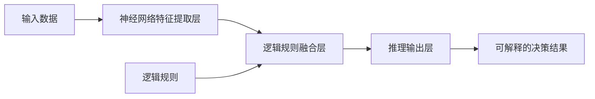

# 神经逻辑推理在可解释AI系统中的实现策略

> 关键词：神经逻辑推理、可解释AI系统、实现策略、深度学习、符号逻辑

> 摘要：本文聚焦于神经逻辑推理在可解释AI系统中的实现策略。首先介绍了相关背景，包括研究目的、预期读者等。接着阐述了神经逻辑推理与可解释AI的核心概念及联系，通过示意图和流程图进行直观展示。详细讲解了核心算法原理，并用Python代码进行了说明。同时给出了相关数学模型和公式，并举例分析。通过项目实战，展示了代码实现和解读。探讨了实际应用场景，推荐了学习资源、开发工具框架以及相关论文著作。最后总结了未来发展趋势与挑战，解答了常见问题，并提供了扩展阅读和参考资料，旨在为研究和应用神经逻辑推理于可解释AI系统提供全面的指导。

## 1. 背景介绍 
### 1.1 目的和范围
随着人工智能技术的飞速发展，深度学习模型在图像识别、自然语言处理等诸多领域取得了巨大成功。然而，这些模型往往被视为“黑盒”，其决策过程难以理解和解释，这在一些对安全性和可靠性要求较高的领域，如医疗诊断、自动驾驶等，成为了应用的瓶颈。可解释AI系统旨在解决这一问题，让模型的决策过程更加透明和可理解。神经逻辑推理作为一种融合了神经网络的学习能力和符号逻辑的推理能力的方法，为实现可解释AI系统提供了新的途径。本文的目的是深入探讨神经逻辑推理在可解释AI系统中的实现策略，涵盖从核心概念、算法原理到实际应用等多个方面，为相关研究和开发人员提供全面的参考。

### 1.2 预期读者
本文预期读者包括人工智能领域的研究人员、开发者、研究生等。对于那些对可解释AI系统感兴趣，希望了解神经逻辑推理技术及其应用的人士，本文将提供有价值的信息和指导。同时，对于在医疗、金融、交通等领域从事与AI相关工作，需要理解和应用可解释AI系统的专业人员，也具有一定的参考意义。

### 1.3 文档结构概述
本文将按照以下结构进行组织：首先介绍神经逻辑推理和可解释AI系统的核心概念及它们之间的联系，并通过示意图和流程图进行直观展示；接着详细讲解核心算法原理，并用Python代码进行具体阐述；给出相关数学模型和公式，并结合实例进行分析；通过项目实战，展示神经逻辑推理在可解释AI系统中的代码实现和详细解读；探讨神经逻辑推理在可解释AI系统中的实际应用场景；推荐相关的学习资源、开发工具框架和论文著作；最后总结未来发展趋势与挑战，解答常见问题，并提供扩展阅读和参考资料。

### 1.4 术语表
#### 1.4.1 核心术语定义
- **神经逻辑推理（Neural Logic Reasoning）**：一种将神经网络的学习能力与符号逻辑的推理能力相结合的方法，旨在利用神经网络处理数据和学习模式，同时引入逻辑规则进行推理，以实现更具可解释性的决策。
- **可解释AI系统（Interpretable AI System）**：能够以人类可理解的方式解释其决策过程和输出结果的人工智能系统，有助于提高模型的可信度和可靠性。
- **深度学习（Deep Learning）**：一种基于人工神经网络的机器学习方法，通过多层神经网络自动学习数据中的复杂模式和特征。
- **符号逻辑（Symbolic Logic）**：用符号和规则来表示和处理逻辑关系的方法，如命题逻辑、谓词逻辑等。

#### 1.4.2 相关概念解释
- **神经网络（Neural Network）**：由大量神经元组成的计算模型，通过调整神经元之间的连接权重来学习数据中的模式和规律。
- **逻辑规则（Logic Rule）**：用逻辑表达式表示的规则，用于描述事物之间的关系和推理过程。
- **知识图谱（Knowledge Graph）**：一种以图的形式表示知识的方法，节点表示实体，边表示实体之间的关系，可用于存储和推理知识。

#### 1.4.3 缩略词列表
- **AI**：Artificial Intelligence，人工智能
- **DL**：Deep Learning，深度学习
- **NN**：Neural Network，神经网络
- **KG**：Knowledge Graph，知识图谱

## 2. 核心概念与联系 

### 核心概念原理
神经逻辑推理结合了神经网络和符号逻辑的优势。神经网络具有强大的学习能力，能够自动从大量数据中提取特征和模式。例如，在图像识别任务中，卷积神经网络（CNN）可以通过多层卷积和池化操作，学习到图像的局部和全局特征，从而实现对图像的分类。然而，神经网络的决策过程往往难以解释，其输出结果只是一个概率值，无法明确说明模型是如何做出决策的。

符号逻辑则具有严格的推理规则和语义表达能力，能够用逻辑表达式清晰地表示知识和推理过程。例如，在命题逻辑中，我们可以用“如果A且B，则C”这样的规则来表示一种逻辑关系。符号逻辑的推理过程是可解释的，每一步推理都可以根据逻辑规则进行解释。

神经逻辑推理的核心思想是将符号逻辑的规则融入到神经网络中，让神经网络在学习数据的同时，能够遵循一定的逻辑规则进行推理。这样，既可以利用神经网络的学习能力处理复杂的数据，又可以通过逻辑规则提高模型的可解释性。

### 架构的文本示意图
```plaintext
输入数据 --> 神经网络特征提取层 --> 逻辑规则融合层 --> 推理输出层 --> 可解释的决策结果
```
在这个架构中，输入数据首先经过神经网络特征提取层，提取出数据的特征表示。然后，这些特征表示被输入到逻辑规则融合层，在这一层中，逻辑规则被融入到神经网络的计算中，对特征进行进一步的处理和推理。最后，经过推理输出层得到可解释的决策结果。

### Mermaid流程图


## 3. 核心算法原理 & 具体操作步骤 

### 核心算法原理
神经逻辑推理的核心算法可以分为两个主要部分：神经网络特征提取和逻辑规则融合。

#### 神经网络特征提取
我们可以使用常见的神经网络结构，如多层感知机（MLP）、卷积神经网络（CNN）或循环神经网络（RNN）来提取输入数据的特征。以多层感知机为例，假设输入数据为 $x$，其维度为 $n$，隐藏层的神经元数量为 $m$，则隐藏层的输出 $h$ 可以通过以下公式计算：

$$h = \sigma(W_1x + b_1)$$

其中，$W_1$ 是输入层到隐藏层的权重矩阵，维度为 $m \times n$，$b_1$ 是隐藏层的偏置向量，维度为 $m$，$\sigma$ 是激活函数，如ReLU函数。

输出层的输出 $y$ 可以通过以下公式计算：

$$y = \sigma(W_2h + b_2)$$

其中，$W_2$ 是隐藏层到输出层的权重矩阵，维度为 $k \times m$，$b_2$ 是输出层的偏置向量，维度为 $k$，$k$ 是输出层的神经元数量。

#### 逻辑规则融合
逻辑规则可以用逻辑表达式来表示，例如“如果A且B，则C”。在神经逻辑推理中，我们需要将这些逻辑规则融入到神经网络的计算中。一种常见的方法是使用逻辑损失函数，通过最小化逻辑损失来让神经网络遵循逻辑规则。

假设我们有一个逻辑规则“如果 $x_1$ 且 $x_2$，则 $y$”，其中 $x_1$ 和 $x_2$ 是输入特征，$y$ 是输出结果。我们可以定义一个逻辑损失函数 $L_{logic}$ 来衡量神经网络的输出是否符合这个逻辑规则：

$$L_{logic} = \max(0, \text{logic}(x_1, x_2) - y)$$

其中，$\text{logic}(x_1, x_2)$ 是根据逻辑规则计算的结果，例如在“与”逻辑中，$\text{logic}(x_1, x_2) = \min(x_1, x_2)$。

### 具体操作步骤
1. **数据预处理**：对输入数据进行清洗、归一化等预处理操作，以提高神经网络的训练效果。
2. **构建神经网络模型**：选择合适的神经网络结构，如MLP、CNN或RNN，并初始化模型的参数。
3. **定义逻辑规则**：根据具体的任务和需求，定义相应的逻辑规则。
4. **定义损失函数**：将逻辑损失函数与传统的损失函数（如交叉熵损失）相结合，得到总损失函数。
5. **训练模型**：使用训练数据对模型进行训练，通过反向传播算法更新模型的参数，最小化总损失函数。
6. **模型评估**：使用测试数据对训练好的模型进行评估，计算模型的准确率、召回率等指标。
7. **解释决策结果**：根据逻辑规则和神经网络的输出，对模型的决策结果进行解释。

### Python源代码实现
```python
import torch
import torch.nn as nn
import torch.optim as optim

# 定义神经网络模型
class NeuralLogicNetwork(nn.Module):
    def __init__(self, input_size, hidden_size, output_size):
        super(NeuralLogicNetwork, self).__init__()
        self.fc1 = nn.Linear(input_size, hidden_size)
        self.relu = nn.ReLU()
        self.fc2 = nn.Linear(hidden_size, output_size)

    def forward(self, x):
        out = self.fc1(x)
        out = self.relu(out)
        out = self.fc2(out)
        return out

# 定义逻辑损失函数
def logic_loss(x1, x2, y):
    logic_result = torch.min(x1, x2)
    return torch.max(torch.tensor(0.0), logic_result - y)

# 训练模型
def train_model(model, train_loader, criterion, optimizer, num_epochs):
    for epoch in range(num_epochs):
        running_loss = 0.0
        for inputs, labels in train_loader:
            optimizer.zero_grad()
            outputs = model(inputs)
            # 计算传统损失
            loss1 = criterion(outputs, labels)
            # 假设这里有两个输入特征用于逻辑规则
            x1 = inputs[:, 0]
            x2 = inputs[:, 1]
            # 计算逻辑损失
            loss2 = logic_loss(x1, x2, outputs.squeeze())
            # 总损失
            total_loss = loss1 + loss2
            total_loss.backward()
            optimizer.step()
            running_loss += total_loss.item()
        print(f'Epoch {epoch + 1}, Loss: {running_loss / len(train_loader)}')

# 测试模型
def test_model(model, test_loader):
    correct = 0
    total = 0
    with torch.no_grad():
        for inputs, labels in test_loader:
            outputs = model(inputs)
            _, predicted = torch.max(outputs.data, 1)
            total += labels.size(0)
            correct += (predicted == labels).sum().item()
    print(f'Accuracy: {100 * correct / total}%')

# 主函数
if __name__ == '__main__':
    # 定义超参数
    input_size = 10
    hidden_size = 20
    output_size = 2
    num_epochs = 10
    learning_rate = 0.001

    # 生成一些随机数据
    train_data = torch.randn(100, input_size)
    train_labels = torch.randint(0, output_size, (100,))
    test_data = torch.randn(20, input_size)
    test_labels = torch.randint(0, output_size, (20,))

    # 创建数据加载器
    train_dataset = torch.utils.data.TensorDataset(train_data, train_labels)
    train_loader = torch.utils.data.DataLoader(train_dataset, batch_size=10, shuffle=True)
    test_dataset = torch.utils.data.TensorDataset(test_data, test_labels)
    test_loader = torch.utils.data.DataLoader(test_dataset, batch_size=10, shuffle=False)

    # 创建模型
    model = NeuralLogicNetwork(input_size, hidden_size, output_size)

    # 定义损失函数和优化器
    criterion = nn.CrossEntropyLoss()
    optimizer = optim.Adam(model.parameters(), lr=learning_rate)

    # 训练模型
    train_model(model, train_loader, criterion, optimizer, num_epochs)

    # 测试模型
    test_model(model, test_loader)
```

## 4. 数学模型和公式 & 详细讲解 & 举例说明 

### 神经网络部分的数学模型和公式
#### 前向传播
如前面所述，多层感知机的前向传播过程可以用以下公式表示：

隐藏层输出：
$$h = \sigma(W_1x + b_1)$$

输出层输出：
$$y = \sigma(W_2h + b_2)$$

其中，$\sigma$ 是激活函数，常见的激活函数有ReLU函数：

$$\text{ReLU}(x) = \max(0, x)$$

#### 损失函数
传统的交叉熵损失函数用于衡量神经网络的输出与真实标签之间的差异。对于多分类问题，交叉熵损失函数的公式为：

$$L_{ce} = -\sum_{i=1}^{N}\sum_{j=1}^{K}y_{ij}\log(p_{ij})$$

其中，$N$ 是样本数量，$K$ 是类别数量，$y_{ij}$ 是第 $i$ 个样本的真实标签的第 $j$ 个分量（如果样本 $i$ 属于类别 $j$，则 $y_{ij}=1$，否则 $y_{ij}=0$），$p_{ij}$ 是神经网络对第 $i$ 个样本属于类别 $j$ 的预测概率。

### 逻辑规则部分的数学模型和公式
#### 逻辑规则表示
逻辑规则可以用逻辑表达式来表示，例如“与”逻辑、“或”逻辑和“非”逻辑。

- “与”逻辑：$\text{AND}(x_1, x_2) = \min(x_1, x_2)$
- “或”逻辑：$\text{OR}(x_1, x_2) = \max(x_1, x_2)$
- “非”逻辑：$\text{NOT}(x) = 1 - x$

#### 逻辑损失函数
逻辑损失函数用于衡量神经网络的输出是否符合逻辑规则。例如，对于“如果 $x_1$ 且 $x_2$，则 $y$”的逻辑规则，逻辑损失函数可以定义为：

$$L_{logic} = \max(0, \text{AND}(x_1, x_2) - y)$$

### 详细讲解
神经网络部分的前向传播过程是将输入数据通过一系列的线性变换和非线性激活函数，得到输出结果。损失函数用于衡量模型的输出与真实标签之间的差异，通过最小化损失函数，可以调整模型的参数，使模型的输出尽可能接近真实标签。

逻辑规则部分的逻辑表达式用于表示逻辑关系，逻辑损失函数则用于约束神经网络的输出，使其符合逻辑规则。在训练过程中，将逻辑损失函数与传统的损失函数相结合，通过反向传播算法同时优化模型的参数和逻辑规则的遵守程度。

### 举例说明
假设我们有一个二分类问题，输入数据有两个特征 $x_1$ 和 $x_2$，逻辑规则为“如果 $x_1$ 且 $x_2$，则输出为类别1”。

- 输入数据：$x = [x_1, x_2] = [0.8, 0.9]$
- 神经网络输出：$y = 0.3$

根据逻辑规则，$\text{AND}(x_1, x_2) = \min(0.8, 0.9) = 0.8$

逻辑损失：$L_{logic} = \max(0, 0.8 - 0.3) = 0.5$

传统的交叉熵损失可以根据真实标签和神经网络的输出计算得到，假设真实标签为1，则交叉熵损失为：

$$L_{ce} = -\log(0.3) \approx 1.2$$

总损失：$L = L_{ce} + L_{logic} = 1.2 + 0.5 = 1.7$

在训练过程中，通过反向传播算法，根据总损失更新模型的参数，使模型的输出既符合数据的分布，又符合逻辑规则。

## 5. 项目实战：代码实际案例和详细解释说明 

### 5.1  开发环境搭建
#### 安装Python
首先，确保你已经安装了Python，建议使用Python 3.7及以上版本。可以从Python官方网站（https://www.python.org/downloads/）下载并安装Python。

#### 安装深度学习框架
本文使用PyTorch作为深度学习框架，你可以根据自己的操作系统和CUDA版本，从PyTorch官方网站（https://pytorch.org/get-started/locally/）选择合适的安装命令进行安装。例如，如果你使用的是CPU版本的PyTorch，可以使用以下命令进行安装：

```bash
pip install torch torchvision
```

#### 安装其他依赖库
还需要安装一些其他的依赖库，如`numpy`、`matplotlib`等，可以使用以下命令进行安装：

```bash
pip install numpy matplotlib
```

### 5.2  源代码详细实现和代码解读
以下是一个完整的神经逻辑推理在可解释AI系统中的代码实现：

```python
import torch
import torch.nn as nn
import torch.optim as optim
import numpy as np
import matplotlib.pyplot as plt

# 定义神经网络模型
class NeuralLogicNetwork(nn.Module):
    def __init__(self, input_size, hidden_size, output_size):
        super(NeuralLogicNetwork, self).__init__()
        self.fc1 = nn.Linear(input_size, hidden_size)
        self.relu = nn.ReLU()
        self.fc2 = nn.Linear(hidden_size, output_size)

    def forward(self, x):
        out = self.fc1(x)
        out = self.relu(out)
        out = self.fc2(out)
        return out

# 定义逻辑损失函数
def logic_loss(x1, x2, y):
    logic_result = torch.min(x1, x2)
    return torch.max(torch.tensor(0.0), logic_result - y)

# 训练模型
def train_model(model, train_loader, criterion, optimizer, num_epochs):
    losses = []
    for epoch in range(num_epochs):
        running_loss = 0.0
        for inputs, labels in train_loader:
            optimizer.zero_grad()
            outputs = model(inputs)
            # 计算传统损失
            loss1 = criterion(outputs, labels)
            # 假设这里有两个输入特征用于逻辑规则
            x1 = inputs[:, 0]
            x2 = inputs[:, 1]
            # 计算逻辑损失
            loss2 = logic_loss(x1, x2, outputs.squeeze())
            # 总损失
            total_loss = loss1 + loss2
            total_loss.backward()
            optimizer.step()
            running_loss += total_loss.item()
        epoch_loss = running_loss / len(train_loader)
        losses.append(epoch_loss)
        print(f'Epoch {epoch + 1}, Loss: {epoch_loss}')
    return losses

# 测试模型
def test_model(model, test_loader):
    correct = 0
    total = 0
    with torch.no_grad():
        for inputs, labels in test_loader:
            outputs = model(inputs)
            _, predicted = torch.max(outputs.data, 1)
            total += labels.size(0)
            correct += (predicted == labels).sum().item()
    print(f'Accuracy: {100 * correct / total}%')

# 主函数
if __name__ == '__main__':
    # 定义超参数
    input_size = 10
    hidden_size = 20
    output_size = 2
    num_epochs = 10
    learning_rate = 0.001

    # 生成一些随机数据
    train_data = torch.randn(100, input_size)
    train_labels = torch.randint(0, output_size, (100,))
    test_data = torch.randn(20, input_size)
    test_labels = torch.randint(0, output_size, (20,))

    # 创建数据加载器
    train_dataset = torch.utils.data.TensorDataset(train_data, train_labels)
    train_loader = torch.utils.data.DataLoader(train_dataset, batch_size=10, shuffle=True)
    test_dataset = torch.utils.data.TensorDataset(test_data, test_labels)
    test_loader = torch.utils.data.DataLoader(test_dataset, batch_size=10, shuffle=False)

    # 创建模型
    model = NeuralLogicNetwork(input_size, hidden_size, output_size)

    # 定义损失函数和优化器
    criterion = nn.CrossEntropyLoss()
    optimizer = optim.Adam(model.parameters(), lr=learning_rate)

    # 训练模型
    losses = train_model(model, train_loader, criterion, optimizer, num_epochs)

    # 绘制损失曲线
    plt.plot(losses)
    plt.xlabel('Epoch')
    plt.ylabel('Loss')
    plt.title('Training Loss')
    plt.show()

    # 测试模型
    test_model(model, test_loader)
```

### 代码解读与分析
#### 模型定义
`NeuralLogicNetwork` 类定义了一个简单的多层感知机模型，包含一个输入层、一个隐藏层和一个输出层。在`__init__`方法中，初始化了模型的各个层，在`forward`方法中定义了模型的前向传播过程。

#### 逻辑损失函数
`logic_loss` 函数定义了逻辑损失函数，用于衡量神经网络的输出是否符合逻辑规则。这里使用的逻辑规则是“如果 $x_1$ 且 $x_2$，则 $y$”。

#### 训练函数
`train_model` 函数用于训练模型。在每个epoch中，遍历训练数据，计算传统损失和逻辑损失，将两者相加得到总损失，然后通过反向传播算法更新模型的参数。同时，记录每个epoch的损失值，用于绘制损失曲线。

#### 测试函数
`test_model` 函数用于测试模型的准确率。在测试过程中，使用测试数据对模型进行评估，计算模型的预测准确率。

#### 主函数
在主函数中，定义了超参数，生成了随机数据，创建了数据加载器、模型、损失函数和优化器。调用`train_model`函数训练模型，绘制损失曲线，最后调用`test_model`函数测试模型的准确率。

## 6. 实际应用场景 
### 医疗诊断
在医疗诊断领域，可解释AI系统可以帮助医生更好地理解模型的诊断结果。例如，在疾病预测任务中，神经逻辑推理可以结合患者的症状、检查结果等数据，同时引入医学知识和逻辑规则进行推理。医生可以根据模型的推理过程和逻辑规则，判断模型的诊断结果是否合理，从而提高诊断的准确性和可靠性。

### 金融风险评估
在金融领域，风险评估是一个重要的任务。神经逻辑推理可以用于构建可解释的风险评估模型，结合客户的信用记录、财务状况等数据，以及金融市场的规则和逻辑，对客户的风险进行评估。银行和金融机构可以根据模型的推理过程和逻辑规则，了解风险评估的依据，从而做出更合理的决策。

### 自动驾驶
在自动驾驶领域，可解释AI系统可以提高自动驾驶车辆的安全性和可靠性。神经逻辑推理可以结合传感器数据、地图信息等，同时引入交通规则和逻辑进行推理。当自动驾驶车辆做出决策时，系统可以解释决策的依据，例如为什么要减速、为什么要变道等，从而让人类驾驶员更好地理解和监督自动驾驶车辆的行为。

### 智能教育
在智能教育领域，可解释AI系统可以帮助教师更好地了解学生的学习情况。神经逻辑推理可以结合学生的学习记录、作业成绩等数据，以及教育教学的规则和逻辑，对学生的学习能力和学习状态进行评估。教师可以根据模型的推理过程和逻辑规则，制定更个性化的教学计划，提高教学效果。

## 7. 工具和资源推荐
### 7.1 学习资源推荐
#### 7.1.1 书籍推荐
- 《深度学习》（Deep Learning）：由Ian Goodfellow、Yoshua Bengio和Aaron Courville所著，是深度学习领域的经典教材，涵盖了深度学习的基本概念、算法和应用。
- 《人工智能：一种现代的方法》（Artificial Intelligence: A Modern Approach）：由Stuart Russell和Peter Norvig所著，是人工智能领域的权威教材，介绍了人工智能的各个方面，包括知识表示、推理、机器学习等。
- 《神经网络与深度学习》：由邱锡鹏所著，详细介绍了神经网络和深度学习的基本原理、算法和应用，适合初学者和有一定基础的读者。

#### 7.1.2 在线课程
- Coursera上的“深度学习专项课程”（Deep Learning Specialization）：由Andrew Ng教授讲授，包括五门课程，全面介绍了深度学习的各个方面，是学习深度学习的经典在线课程。
- edX上的“人工智能导论”（Introduction to Artificial Intelligence）：由麻省理工学院（MIT）的Patrick H. Winston教授讲授，介绍了人工智能的基本概念、算法和应用。
- 哔哩哔哩（B站）上有许多关于深度学习和人工智能的教程视频，例如李沐的“动手学深度学习”系列视频，内容丰富，讲解详细。

#### 7.1.3 技术博客和网站
- Medium：是一个技术博客平台，有许多关于深度学习、人工智能和可解释AI的文章，作者来自世界各地的技术专家和研究人员。
- arXiv：是一个预印本平台，提供了大量的学术论文，包括神经逻辑推理、可解释AI等领域的最新研究成果。
- 机器之心：是一个专注于人工智能领域的科技媒体，提供了人工智能领域的最新技术、研究成果和应用案例。

### 7.2 开发工具框架推荐
#### 7.2.1 IDE和编辑器
- PyCharm：是一款专门为Python开发设计的集成开发环境（IDE），具有代码编辑、调试、自动补全、版本控制等功能，是Python开发者的首选工具之一。
- Jupyter Notebook：是一个基于网页的交互式开发环境，支持Python、R等多种编程语言，适合进行数据探索、模型开发和实验。
- Visual Studio Code：是一款轻量级的代码编辑器，支持多种编程语言和插件扩展，具有丰富的代码编辑和调试功能。

#### 7.2.2 调试和性能分析工具
- PyTorch Profiler：是PyTorch自带的性能分析工具，可以帮助开发者分析模型的性能瓶颈，优化模型的训练和推理速度。
- TensorBoard：是TensorFlow的可视化工具，也可以与PyTorch结合使用，用于可视化模型的训练过程、损失曲线、准确率等指标。
- cProfile：是Python的内置性能分析工具，可以帮助开发者分析Python代码的性能瓶颈，找出耗时较长的函数和代码段。

#### 7.2.3 相关框架和库
- PyTorch：是一个开源的深度学习框架，具有动态图、易于使用等特点，广泛应用于深度学习的研究和开发。
- TensorFlow：是另一个开源的深度学习框架，具有强大的分布式训练和部署能力，被许多公司和研究机构广泛使用。
- Scikit-learn：是一个开源的机器学习库，提供了丰富的机器学习算法和工具，适合进行数据预处理、模型选择和评估等任务。

### 7.3 相关论文著作推荐
#### 7.3.1 经典论文
- “Neural Logic Machines”：提出了神经逻辑机的概念，将神经网络和逻辑推理相结合，实现了可解释的推理和学习。
- “Towards Explainable Artificial Intelligence: A Review”：对可解释AI的研究现状进行了全面的综述，介绍了可解释AI的定义、方法和应用。
- “Explaining and Harnessing Adversarial Examples”：探讨了对抗样本的原理和应用，对理解深度学习模型的脆弱性和可解释性具有重要意义。

#### 7.3.2 最新研究成果
- 关注arXiv上关于神经逻辑推理和可解释AI的最新论文，了解该领域的最新研究动态和技术进展。
- 参加国际人工智能会议，如NeurIPS、ICML、AAAI等，听取相关领域的学术报告和研究成果分享。

#### 7.3.3 应用案例分析
- 阅读相关领域的应用案例，如医疗、金融、自动驾驶等领域的可解释AI应用案例，了解神经逻辑推理在实际应用中的效果和挑战。
- 参考一些开源项目和代码库，学习他人在神经逻辑推理和可解释AI方面的实践经验。

## 8. 总结：未来发展趋势与挑战
### 未来发展趋势
#### 融合更多的知识表示和推理方法
未来的神经逻辑推理将融合更多的知识表示和推理方法，如知识图谱、本体论等，以提高模型的知识表达能力和推理能力。通过将不同来源的知识进行整合和推理，可以实现更复杂的决策和解释。

#### 跨领域应用的拓展
神经逻辑推理在可解释AI系统中的应用将从医疗、金融等领域拓展到更多的领域，如工业制造、农业、环境保护等。在不同领域中，结合领域知识和逻辑规则，实现更精准、可解释的决策和预测。

#### 与人类交互的增强
未来的可解释AI系统将更加注重与人类的交互，能够以更加自然和易懂的方式向人类解释其决策过程和结果。例如，通过可视化、自然语言生成等技术，让人类更好地理解和信任AI系统。

### 挑战
#### 逻辑规则的获取和表示
如何获取和表示有效的逻辑规则是神经逻辑推理面临的一个挑战。逻辑规则往往需要领域专家的知识和经验，而且不同领域的逻辑规则可能存在差异。如何将这些规则有效地融入到神经网络中，是一个需要解决的问题。

#### 模型的复杂性和效率
随着模型的复杂性增加，神经逻辑推理的计算效率可能会受到影响。如何在保证模型可解释性的同时，提高模型的训练和推理效率，是一个需要研究的问题。

#### 可解释性的评估标准
目前，可解释性的评估标准还不够完善。如何准确地评估神经逻辑推理模型的可解释性，是一个需要解决的问题。不同的应用场景可能对可解释性有不同的要求，需要制定相应的评估标准。

## 9. 附录：常见问题与解答
### 问题1：神经逻辑推理和传统的神经网络有什么区别？
神经逻辑推理在传统神经网络的基础上，引入了逻辑规则进行推理。传统的神经网络主要通过学习数据中的模式和规律来进行预测和分类，其决策过程往往难以解释。而神经逻辑推理通过将逻辑规则融入到神经网络的计算中，使模型的决策过程更加透明和可解释。

### 问题2：如何选择合适的逻辑规则？
选择合适的逻辑规则需要考虑具体的任务和领域知识。可以邀请领域专家参与，根据领域的实际情况和需求，制定相应的逻辑规则。同时，也可以通过数据挖掘和知识发现的方法，从数据中自动提取逻辑规则。

### 问题3：逻辑损失函数的权重如何确定？
逻辑损失函数的权重可以通过实验来确定。可以尝试不同的权重值，观察模型的性能和可解释性的变化，选择一个既能保证模型的准确性，又能提高模型可解释性的权重值。

### 问题4：神经逻辑推理在实际应用中可能会遇到哪些问题？
在实际应用中，神经逻辑推理可能会遇到逻辑规则的不完整性、数据的噪声和不确定性等问题。逻辑规则可能无法涵盖所有的情况，导致模型的推理结果不准确。数据中的噪声和不确定性也可能影响模型的性能和可解释性。需要通过数据预处理、规则优化等方法来解决这些问题。

## 10. 扩展阅读 & 参考资料
### 扩展阅读
- 《知识图谱：方法、实践与应用》：介绍了知识图谱的基本概念、构建方法和应用场景，与神经逻辑推理中的知识表示和推理有密切的关系。
- 《可解释人工智能：原理、算法与应用》：深入探讨了可解释AI的原理、算法和应用，为神经逻辑推理在可解释AI系统中的应用提供了更多的思路和方法。

### 参考资料
- Goodfellow, I., Bengio, Y., & Courville, A. (2016). Deep Learning. MIT Press.
- Russell, S. J., & Norvig, P. (2009). Artificial Intelligence: A Modern Approach. Pearson Education.
- 邱锡鹏. (2019). 神经网络与深度学习. 机械工业出版社.

作者：AI天才研究院/AI Genius Institute & 禅与计算机程序设计艺术 /Zen And The Art of Computer Programming