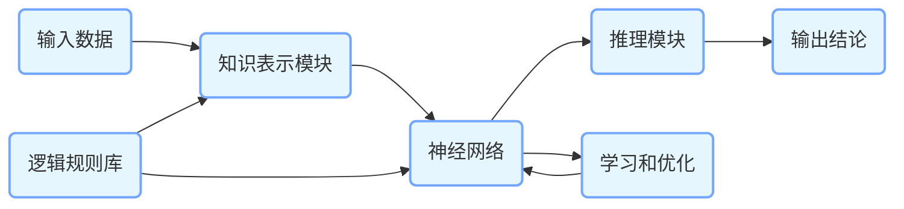

# 神经逻辑编程在自动化推理中的前沿探索

> 关键词：神经逻辑编程、自动化推理、深度学习、逻辑推理、知识表示、机器学习

> 摘要：本文聚焦于神经逻辑编程在自动化推理领域的前沿探索。首先介绍了神经逻辑编程和自动化推理的背景知识，包括目的、预期读者、文档结构等。详细阐述了神经逻辑编程的核心概念，如逻辑规则与神经网络的结合原理和架构，并给出文本示意图和Mermaid流程图。深入分析了核心算法原理，通过Python源代码进行讲解，同时给出相关数学模型和公式，并举例说明。结合项目实战，从开发环境搭建到源代码实现及解读进行了详细说明。探讨了神经逻辑编程在自动化推理中的实际应用场景，推荐了学习资源、开发工具框架以及相关论文著作。最后总结了神经逻辑编程在自动化推理中的未来发展趋势与挑战，并提供常见问题解答和扩展阅读参考资料。

## 1. 背景介绍 
### 1.1 目的和范围
自动化推理作为人工智能领域的关键任务，旨在让计算机自动从已知信息推导出新的结论。传统的自动化推理方法主要基于符号逻辑，虽然具有精确性和可解释性，但在处理复杂的、不确定的和大规模的数据时面临挑战。神经逻辑编程（Neural Logic Programming，NLP）作为一种新兴的技术，结合了神经网络的强大学习能力和逻辑编程的可解释性，为自动化推理提供了新的思路和方法。本文的目的是深入探讨神经逻辑编程在自动化推理中的应用，包括其核心概念、算法原理、实际应用场景等，为相关研究人员和开发者提供全面的参考。
本文的范围涵盖了神经逻辑编程的基本原理、与自动化推理的结合方式、核心算法的实现、实际应用案例分析以及未来发展趋势等方面。

### 1.2 预期读者
本文预期读者包括人工智能、机器学习、自动化推理等领域的研究人员、开发者和学生。对于希望了解神经逻辑编程在自动化推理中应用的专业人士，本文将提供深入的技术分析和实际案例；对于初学者，本文将从基础概念入手，逐步引导读者理解神经逻辑编程的核心思想和应用方法。

### 1.3 文档结构概述
本文共分为十个部分：
1. 背景介绍：介绍本文的目的、范围、预期读者和文档结构。
2. 核心概念与联系：阐述神经逻辑编程和自动化推理的核心概念，以及它们之间的联系。
3. 核心算法原理 & 具体操作步骤：详细介绍神经逻辑编程的核心算法原理，并给出具体的操作步骤和Python源代码实现。
4. 数学模型和公式 & 详细讲解 & 举例说明：给出神经逻辑编程的数学模型和公式，并通过具体例子进行详细讲解。
5. 项目实战：代码实际案例和详细解释说明：通过一个实际项目案例，展示神经逻辑编程在自动化推理中的应用，包括开发环境搭建、源代码实现和代码解读。
6. 实际应用场景：探讨神经逻辑编程在自动化推理中的实际应用场景。
7. 工具和资源推荐：推荐相关的学习资源、开发工具框架和论文著作。
8. 总结：未来发展趋势与挑战：总结神经逻辑编程在自动化推理中的未来发展趋势和面临的挑战。
9. 附录：常见问题与解答：解答读者在阅读本文过程中可能遇到的常见问题。
10. 扩展阅读 & 参考资料：提供相关的扩展阅读材料和参考资料。

### 1.4 术语表
#### 1.4.1 核心术语定义
- **神经逻辑编程（Neural Logic Programming，NLP）**：一种将神经网络和逻辑编程相结合的技术，旨在利用神经网络的学习能力和逻辑编程的可解释性来解决复杂的问题。
- **自动化推理（Automated Reasoning）**：让计算机自动从已知信息推导出新的结论的过程。
- **逻辑规则（Logical Rules）**：用逻辑语言表示的陈述，用于描述事物之间的关系和推理过程。
- **神经网络（Neural Network）**：一种模仿人类神经系统的计算模型，由大量的神经元组成，用于学习数据中的模式和规律。
- **知识表示（Knowledge Representation）**：将知识以某种形式表示出来，以便计算机能够处理和利用。

#### 1.4.2 相关概念解释
- **符号逻辑（Symbolic Logic）**：一种基于符号和规则的逻辑系统，用于表示和推理知识。传统的自动化推理方法主要基于符号逻辑。
- **深度学习（Deep Learning）**：一种基于神经网络的机器学习方法，通过多层神经网络学习数据中的复杂模式和规律。
- **可解释性（Interpretability）**：指模型的决策过程和结果能够被人类理解和解释的程度。逻辑编程具有较高的可解释性，而神经网络的可解释性相对较低。

#### 1.4.3 缩略词列表
- **NLP**：Neural Logic Programming（神经逻辑编程）
- **MLP**：Multi-Layer Perceptron（多层感知机）
- **SVM**：Support Vector Machine（支持向量机）

## 2. 核心概念与联系 
### 2.1 神经逻辑编程的核心概念
神经逻辑编程的核心思想是将逻辑规则融入到神经网络中，使得神经网络能够处理和推理逻辑知识。传统的神经网络主要用于处理数值数据，而逻辑规则则用于表示和推理符号知识。神经逻辑编程通过将逻辑规则转化为神经网络的结构和参数，实现了数值计算和符号推理的统一。

神经逻辑编程的主要组成部分包括：
- **逻辑规则库**：存储一系列的逻辑规则，用于描述事物之间的关系和推理过程。
- **神经网络**：用于学习数据中的模式和规律，并根据逻辑规则进行推理。
- **知识表示模块**：将逻辑规则和数据转化为神经网络能够处理的形式。
- **推理模块**：根据神经网络的输出和逻辑规则进行推理，得出新的结论。

### 2.2 自动化推理的核心概念
自动化推理是让计算机自动从已知信息推导出新的结论的过程。自动化推理的主要任务包括定理证明、逻辑推理、知识图谱推理等。传统的自动化推理方法主要基于符号逻辑，通过逻辑规则和推理算法进行推理。

自动化推理的主要步骤包括：
- **知识表示**：将已知信息以某种形式表示出来，如逻辑公式、知识图谱等。
- **推理规则定义**：定义一系列的推理规则，用于从已知信息推导出新的结论。
- **推理算法选择**：选择合适的推理算法，如归结法、自然演绎法等。
- **推理过程执行**：根据推理规则和推理算法，执行推理过程，得出新的结论。

### 2.3 神经逻辑编程与自动化推理的联系
神经逻辑编程为自动化推理提供了一种新的方法和思路。传统的自动化推理方法在处理复杂的、不确定的和大规模的数据时面临挑战，而神经逻辑编程结合了神经网络的强大学习能力和逻辑编程的可解释性，能够更好地处理这些问题。

神经逻辑编程在自动化推理中的应用主要包括：
- **知识表示学习**：通过神经网络学习知识的表示，将逻辑规则和数据转化为神经网络能够处理的形式。
- **推理规则学习**：通过神经网络学习推理规则，自动发现数据中的逻辑关系和推理模式。
- **推理过程优化**：利用神经网络的优化能力，优化推理过程，提高推理效率和准确性。

### 2.4 核心概念原理和架构的文本示意图
神经逻辑编程在自动化推理中的核心概念原理和架构可以用以下文本示意图表示：

```plaintext
输入数据 --> 知识表示模块 --> 神经网络 --> 推理模块 --> 输出结论
            |                   |
            |                   |
            v                   v
        逻辑规则库         学习和优化
```

解释如下：
- 输入数据：包括已知的事实、规则和问题等。
- 知识表示模块：将输入数据和逻辑规则转化为神经网络能够处理的形式。
- 神经网络：学习数据中的模式和规律，并根据逻辑规则进行推理。
- 推理模块：根据神经网络的输出和逻辑规则进行推理，得出新的结论。
- 逻辑规则库：存储一系列的逻辑规则，用于指导神经网络的学习和推理过程。
- 学习和优化：通过优化算法对神经网络的参数进行学习和优化，提高推理的准确性和效率。

### 2.5 Mermaid流程图


该流程图展示了神经逻辑编程在自动化推理中的主要流程：输入数据经过知识表示模块处理后进入神经网络，神经网络根据逻辑规则进行学习和推理，推理模块根据神经网络的输出得出结论。同时，逻辑规则库为知识表示模块和神经网络提供规则指导，学习和优化模块对神经网络的参数进行优化。

## 3. 核心算法原理 & 具体操作步骤 
### 3.1 核心算法原理
神经逻辑编程的核心算法主要包括逻辑规则的嵌入和神经网络的学习。下面我们将详细介绍这两个方面的原理。

#### 3.1.1 逻辑规则的嵌入
逻辑规则的嵌入是将逻辑规则转化为神经网络能够处理的数值表示的过程。常见的逻辑规则嵌入方法包括基于向量空间的嵌入和基于图神经网络的嵌入。

基于向量空间的嵌入方法将逻辑规则中的实体和关系映射到一个低维向量空间中，通过向量的运算来表示逻辑关系。例如，对于一个逻辑规则 $A \land B \rightarrow C$，可以将实体 $A$、$B$ 和 $C$ 分别映射到向量 $\mathbf{a}$、$\mathbf{b}$ 和 $\mathbf{c}$ 中，然后通过向量的运算来判断规则是否成立。

基于图神经网络的嵌入方法将逻辑规则表示为一个图结构，其中节点表示实体，边表示关系。通过图神经网络对图结构进行学习，得到节点和边的向量表示。例如，对于一个逻辑规则 $A \land B \rightarrow C$，可以构建一个图，其中节点 $A$、$B$ 和 $C$ 之间通过边连接，然后通过图神经网络学习节点和边的向量表示。

#### 3.1.2 神经网络的学习
神经网络的学习是指通过优化算法对神经网络的参数进行调整，使得神经网络能够学习到数据中的模式和规律，并根据逻辑规则进行推理。常见的神经网络学习算法包括梯度下降法、随机梯度下降法等。

在神经逻辑编程中，神经网络的学习通常采用监督学习的方式，即给定一组输入数据和对应的输出标签，通过优化算法调整神经网络的参数，使得神经网络的输出尽可能接近标签。同时，在学习过程中，需要考虑逻辑规则的约束，确保神经网络的输出符合逻辑规则。

### 3.2 具体操作步骤
下面我们将详细介绍神经逻辑编程在自动化推理中的具体操作步骤。

#### 3.2.1 数据准备
首先，需要准备输入数据和逻辑规则库。输入数据可以是结构化的数据，如数据库中的记录，也可以是非结构化的数据，如文本、图像等。逻辑规则库可以是手动定义的，也可以是自动学习得到的。

#### 3.2.2 知识表示
将输入数据和逻辑规则转化为神经网络能够处理的形式。这一步骤通常包括实体和关系的嵌入、逻辑规则的编码等。

#### 3.2.3 神经网络构建
根据任务的需求，构建合适的神经网络结构。常见的神经网络结构包括多层感知机（MLP）、循环神经网络（RNN）、卷积神经网络（CNN）等。

#### 3.2.4 模型训练
使用准备好的数据对神经网络进行训练。在训练过程中，需要定义损失函数，用于衡量神经网络的输出与标签之间的差异。同时，需要考虑逻辑规则的约束，将逻辑规则的损失加入到总损失中。

#### 3.2.5 推理过程
在模型训练完成后，使用训练好的模型进行推理。给定一个输入问题，将其转化为神经网络能够处理的形式，输入到神经网络中，得到神经网络的输出。然后，根据逻辑规则对输出进行进一步的推理，得出最终的结论。

### 3.3 Python源代码实现
下面是一个简单的神经逻辑编程在自动化推理中的Python代码示例，使用PyTorch框架实现。

```python
import torch
import torch.nn as nn
import torch.optim as optim

# 定义一个简单的多层感知机神经网络
class NeuralLogicNetwork(nn.Module):
    def __init__(self, input_size, hidden_size, output_size):
        super(NeuralLogicNetwork, self).__init__()
        self.fc1 = nn.Linear(input_size, hidden_size)
        self.relu = nn.ReLU()
        self.fc2 = nn.Linear(hidden_size, output_size)

    def forward(self, x):
        out = self.fc1(x)
        out = self.relu(out)
        out = self.fc2(out)
        return out

# 数据准备
input_data = torch.tensor([[0.1, 0.2, 0.3], [0.4, 0.5, 0.6]], dtype=torch.float32)
output_labels = torch.tensor([[0.7], [0.8]], dtype=torch.float32)

# 模型构建
input_size = 3
hidden_size = 4
output_size = 1
model = NeuralLogicNetwork(input_size, hidden_size, output_size)

# 定义损失函数和优化器
criterion = nn.MSELoss()
optimizer = optim.SGD(model.parameters(), lr=0.01)

# 模型训练
num_epochs = 100
for epoch in range(num_epochs):
    # 前向传播
    outputs = model(input_data)
    loss = criterion(outputs, output_labels)

    # 反向传播和优化
    optimizer.zero_grad()
    loss.backward()
    optimizer.step()

    if (epoch+1) % 10 == 0:
        print(f'Epoch [{epoch+1}/{num_epochs}], Loss: {loss.item():.4f}')

# 推理过程
test_input = torch.tensor([[0.2, 0.3, 0.4]], dtype=torch.float32)
with torch.no_grad():
    test_output = model(test_input)
    print(f'Test Output: {test_output.item():.4f}')
```

### 3.4 代码解释
- **数据准备**：定义了输入数据 `input_data` 和对应的输出标签 `output_labels`。
- **模型构建**：定义了一个简单的多层感知机神经网络 `NeuralLogicNetwork`，包含一个输入层、一个隐藏层和一个输出层。
- **损失函数和优化器**：使用均方误差损失函数 `nn.MSELoss()` 和随机梯度下降优化器 `optim.SGD()`。
- **模型训练**：通过循环进行多次迭代训练，每次迭代中进行前向传播、计算损失、反向传播和参数更新。
- **推理过程**：使用训练好的模型对测试输入数据进行推理，得到测试输出。

## 4. 数学模型和公式 & 详细讲解 & 举例说明 
### 4.1 逻辑规则的数学表示
逻辑规则通常可以用一阶逻辑或命题逻辑来表示。下面我们以命题逻辑为例，介绍逻辑规则的数学表示。

命题逻辑中的命题是一个可以判断真假的陈述句。逻辑规则可以用逻辑连接词（如 $\land$ （与）、$\lor$ （或）、$\neg$ （非）、$\rightarrow$ （蕴含）等）将命题组合而成。

例如，一个简单的逻辑规则可以表示为：
$$
A \land B \rightarrow C
$$
其中，$A$、$B$ 和 $C$ 是命题。这个规则表示如果 $A$ 和 $B$ 都为真，则 $C$ 为真。

### 4.2 逻辑规则的嵌入公式
在神经逻辑编程中，需要将逻辑规则嵌入到神经网络中。常见的逻辑规则嵌入方法是将命题和逻辑连接词映射到向量空间中。

假设命题 $A$、$B$ 和 $C$ 分别映射到向量 $\mathbf{a}$、$\mathbf{b}$ 和 $\mathbf{c}$ 中，逻辑连接词 $\land$ 和 $\rightarrow$ 分别映射到函数 $f_{\land}$ 和 $f_{\rightarrow}$ 中。则逻辑规则 $A \land B \rightarrow C$ 可以表示为：
$$
f_{\rightarrow}(f_{\land}(\mathbf{a}, \mathbf{b}), \mathbf{c})
$$

其中，$f_{\land}$ 和 $f_{\rightarrow}$ 可以是神经网络中的层或函数。例如，$f_{\land}$ 可以是一个逐元素相乘的操作，$f_{\rightarrow}$ 可以是一个线性变换。

### 4.3 神经网络的损失函数
在神经逻辑编程中，需要定义损失函数来衡量神经网络的输出与标签之间的差异，同时考虑逻辑规则的约束。

假设神经网络的输出为 $\hat{y}$，标签为 $y$，逻辑规则的损失为 $L_{logic}$，则总损失函数可以表示为：
$$
L = L_{mse}(\hat{y}, y) + \lambda L_{logic}
$$
其中，$L_{mse}$ 是均方误差损失函数，$\lambda$ 是一个超参数，用于控制逻辑规则损失的权重。

### 4.4 举例说明
假设我们有一个简单的逻辑规则：$A \land B \rightarrow C$，以及一组输入数据和标签。

输入数据：
- $A = [0.1, 0.2]$
- $B = [0.3, 0.4]$
- $C = [0.5, 0.6]$

标签：
- $y = [0.7, 0.8]$

首先，将命题 $A$、$B$ 和 $C$ 嵌入到向量空间中，得到向量 $\mathbf{a}$、$\mathbf{b}$ 和 $\mathbf{c}$。

然后，计算逻辑规则的损失 $L_{logic}$。假设 $f_{\land}$ 是逐元素相乘的操作，$f_{\rightarrow}$ 是一个线性变换，则：
$$
\mathbf{d} = f_{\land}(\mathbf{a}, \mathbf{b})
$$
$$
\hat{\mathbf{c}} = f_{\rightarrow}(\mathbf{d})
$$
$$
L_{logic} = \frac{1}{n} \sum_{i=1}^{n} (\hat{c}_i - c_i)^2
$$
其中，$n$ 是向量的维度。

最后，计算总损失 $L$：
$$
L = L_{mse}(\hat{y}, y) + \lambda L_{logic}
$$

通过优化算法（如梯度下降法）对总损失 $L$ 进行最小化，更新神经网络的参数。

## 5. 项目实战：代码实际案例和详细解释说明 
### 5.1  开发环境搭建
#### 5.1.1 安装Python
首先，需要安装Python环境。建议使用Python 3.7及以上版本。可以从Python官方网站（https://www.python.org/downloads/）下载并安装Python。

#### 5.1.2 安装必要的库
在本项目中，我们将使用PyTorch框架进行神经网络的开发。可以使用以下命令安装PyTorch：
```bash
pip install torch torchvision
```
此外，还可以安装一些其他的辅助库，如NumPy、Matplotlib等：
```bash
pip install numpy matplotlib
```

### 5.2  源代码详细实现和代码解读
下面是一个更完整的神经逻辑编程在自动化推理中的Python代码示例，使用PyTorch框架实现。

```python
import torch
import torch.nn as nn
import torch.optim as optim
import numpy as np

# 定义一个简单的多层感知机神经网络
class NeuralLogicNetwork(nn.Module):
    def __init__(self, input_size, hidden_size, output_size):
        super(NeuralLogicNetwork, self).__init__()
        self.fc1 = nn.Linear(input_size, hidden_size)
        self.relu = nn.ReLU()
        self.fc2 = nn.Linear(hidden_size, output_size)

    def forward(self, x):
        out = self.fc1(x)
        out = self.relu(out)
        out = self.fc2(out)
        return out

# 数据准备
# 假设我们有一个简单的逻辑规则：A and B -> C
# 生成一些随机数据
num_samples = 100
input_size = 2
output_size = 1
A = np.random.rand(num_samples, 1)
B = np.random.rand(num_samples, 1)
C = (A * B).astype(np.float32)  # 模拟逻辑规则 A and B -> C
input_data = np.hstack((A, B))
input_data = torch.tensor(input_data, dtype=torch.float32)
output_labels = torch.tensor(C, dtype=torch.float32)

# 模型构建
hidden_size = 4
model = NeuralLogicNetwork(input_size, hidden_size, output_size)

# 定义损失函数和优化器
criterion = nn.MSELoss()
optimizer = optim.SGD(model.parameters(), lr=0.01)

# 模型训练
num_epochs = 1000
for epoch in range(num_epochs):
    # 前向传播
    outputs = model(input_data)
    loss = criterion(outputs, output_labels)

    # 反向传播和优化
    optimizer.zero_grad()
    loss.backward()
    optimizer.step()

    if (epoch+1) % 100 == 0:
        print(f'Epoch [{epoch+1}/{num_epochs}], Loss: {loss.item():.4f}')

# 推理过程
test_A = np.array([[0.2]])
test_B = np.array([[0.3]])
test_input = np.hstack((test_A, test_B))
test_input = torch.tensor(test_input, dtype=torch.float32)
with torch.no_grad():
    test_output = model(test_input)
    print(f'Test Output: {test_output.item():.4f}')
```

### 5.3  代码解读与分析
#### 5.3.1 数据准备
- 我们模拟了一个简单的逻辑规则 $A \land B \rightarrow C$，生成了一些随机数据。
- `A` 和 `B` 是随机生成的输入数据，`C` 是根据逻辑规则计算得到的输出标签。
- 将 `A` 和 `B` 合并成输入数据 `input_data`，并将其转换为PyTorch张量。

#### 5.3.2 模型构建
- 定义了一个简单的多层感知机神经网络 `NeuralLogicNetwork`，包含一个输入层、一个隐藏层和一个输出层。
- 输入层的大小为 `input_size`，隐藏层的大小为 `hidden_size`，输出层的大小为 `output_size`。

#### 5.3.3 损失函数和优化器
- 使用均方误差损失函数 `nn.MSELoss()` 来衡量神经网络的输出与标签之间的差异。
- 使用随机梯度下降优化器 `optim.SGD()` 来更新神经网络的参数。

#### 5.3.4 模型训练
- 通过循环进行多次迭代训练，每次迭代中进行前向传播、计算损失、反向传播和参数更新。
- 每100个epoch打印一次损失值，以便观察训练过程。

#### 5.3.5 推理过程
- 生成一个测试输入数据 `test_input`，并将其转换为PyTorch张量。
- 使用训练好的模型对测试输入数据进行推理，得到测试输出。

通过这个项目实战，我们可以看到神经逻辑编程在自动化推理中的应用，以及如何使用PyTorch框架实现一个简单的神经逻辑编程模型。

## 6. 实际应用场景 
### 6.1 知识图谱推理
知识图谱是一种用于表示和存储知识的图结构，其中节点表示实体，边表示实体之间的关系。神经逻辑编程可以用于知识图谱推理，自动发现知识图谱中隐藏的关系和事实。

例如，在一个人物关系知识图谱中，已知“张三是李四的父亲”和“李四是王五的父亲”，通过神经逻辑编程可以推理出“张三是王五的祖父”。

### 6.2 自然语言处理中的推理
在自然语言处理中，神经逻辑编程可以用于文本推理、问答系统等任务。例如，在问答系统中，用户提出一个问题，系统需要根据已知的知识和逻辑规则进行推理，给出准确的答案。

例如，用户问“苹果公司的创始人是谁？”系统可以根据已知的知识和逻辑规则，推理出“苹果公司的创始人是史蒂夫·乔布斯、史蒂夫·沃兹尼亚克和罗恩·韦恩”。

### 6.3 智能决策系统
在智能决策系统中，神经逻辑编程可以用于处理复杂的决策问题。例如，在医疗决策系统中，医生需要根据患者的症状、检查结果和医学知识进行决策。神经逻辑编程可以将医学知识表示为逻辑规则，结合患者的数据进行推理，为医生提供决策支持。

### 6.4 自动驾驶中的推理
在自动驾驶中，神经逻辑编程可以用于处理复杂的交通场景和决策问题。例如，在遇到交通信号灯时，自动驾驶汽车需要根据交通规则和当前的交通状况进行决策，判断是停车还是继续行驶。神经逻辑编程可以将交通规则表示为逻辑规则，结合传感器数据进行推理，为自动驾驶汽车提供决策支持。

## 7. 工具和资源推荐
### 7.1 学习资源推荐
#### 7.1.1 书籍推荐
- 《人工智能：一种现代的方法》（Artificial Intelligence: A Modern Approach）：这是一本经典的人工智能教材，涵盖了人工智能的各个方面，包括自动化推理、机器学习、自然语言处理等。
- 《深度学习》（Deep Learning）：由Ian Goodfellow、Yoshua Bengio和Aaron Courville合著，是深度学习领域的权威教材，介绍了深度学习的基本原理和方法。
- 《逻辑与计算机设计基础》（Logic and Computer Design Fundamentals）：这本书介绍了逻辑设计的基本原理和方法，对于理解逻辑编程和自动化推理非常有帮助。

#### 7.1.2 在线课程
- Coursera上的“人工智能基础”（Fundamentals of Artificial Intelligence）课程：由宾夕法尼亚大学开设，介绍了人工智能的基本概念和方法，包括自动化推理、机器学习等。
- edX上的“深度学习”（Deep Learning Specialization）课程：由Andrew Ng等人开设，是深度学习领域的经典课程，涵盖了深度学习的各个方面。
- Udemy上的“神经逻辑编程实战”（Neural Logic Programming in Practice）课程：专门介绍了神经逻辑编程的原理和应用，通过实际案例进行讲解。

#### 7.1.3 技术博客和网站
- Medium上的人工智能相关博客：Medium上有很多人工智能领域的博主，他们会分享最新的研究成果和技术文章。
- arXiv.org：这是一个预印本平台，很多人工智能领域的最新研究成果都会在上面发布。
- AI开源社区：如GitHub上的人工智能相关项目，可以学习到很多开源的代码和实现。

### 7.2 开发工具框架推荐
#### 7.2.1 IDE和编辑器
- PyCharm：一款专业的Python集成开发环境，提供了丰富的功能和工具，适合Python开发。
- Jupyter Notebook：一种交互式的开发环境，适合进行数据分析和模型开发，支持Python、R等多种编程语言。
- Visual Studio Code：一款轻量级的代码编辑器，支持多种编程语言和插件，具有良好的扩展性。

#### 7.2.2 调试和性能分析工具
- PyTorch的调试工具：PyTorch提供了一些调试工具，如`torch.utils.bottleneck`可以帮助定位代码中的性能瓶颈。
- TensorBoard：一款可视化工具，可以用于可视化神经网络的训练过程和性能指标。
- cProfile：Python的内置性能分析工具，可以分析代码的执行时间和函数调用情况。

#### 7.2.3 相关框架和库
- PyTorch：一个开源的深度学习框架，提供了丰富的神经网络层和优化算法，易于使用和扩展。
- TensorFlow：另一个流行的深度学习框架，具有强大的分布式训练和部署能力。
- PyKE：一个Python实现的知识引擎，用于处理和推理逻辑知识。

### 7.3 相关论文著作推荐
#### 7.3.1 经典论文
- “Neural Logic Machines”：这篇论文提出了一种神经逻辑机的模型，将逻辑推理和神经网络相结合。
- “Differentiable Logic Programming”：介绍了一种可微分的逻辑编程方法，使得逻辑规则可以在神经网络中进行学习和推理。
- “Neural Theorem Provers”：提出了一种神经定理证明器的模型，用于自动证明数学定理。

#### 7.3.2 最新研究成果
- 每年的人工智能顶级会议（如NeurIPS、ICML、AAAI等）上都会有很多关于神经逻辑编程和自动化推理的最新研究成果。
- 相关的学术期刊（如Journal of Artificial Intelligence Research、Artificial Intelligence等）也会发表一些高质量的研究论文。

#### 7.3.3 应用案例分析
- 一些实际应用案例的论文和报告，如知识图谱推理、自然语言处理中的推理等方面的应用案例，可以帮助我们更好地理解神经逻辑编程在实际中的应用。

## 8. 总结：未来发展趋势与挑战
### 8.1 未来发展趋势
#### 8.1.1 与其他技术的融合
神经逻辑编程将与其他技术（如强化学习、图神经网络等）进行更深入的融合，以解决更复杂的问题。例如，将神经逻辑编程与强化学习相结合，可以实现更智能的决策和规划。

#### 8.1.2 可解释性的提升
随着人工智能技术的广泛应用，模型的可解释性变得越来越重要。未来，神经逻辑编程将更加注重可解释性的提升，使得模型的决策过程和结果能够被人类更好地理解和解释。

#### 8.1.3 大规模应用
随着计算能力的提升和数据的增加，神经逻辑编程将在更多的领域得到大规模应用，如医疗、金融、交通等。

### 8.2 面临的挑战
#### 8.2.1 逻辑规则的自动学习
目前，逻辑规则的获取主要依赖于人工定义，这限制了神经逻辑编程的应用范围。未来，需要研究如何自动学习逻辑规则，提高逻辑规则的获取效率和准确性。

#### 8.2.2 计算复杂度
神经逻辑编程在处理大规模数据和复杂逻辑规则时，计算复杂度会显著增加。需要研究如何优化算法和模型结构，降低计算复杂度。

#### 8.2.3 数据质量和标注
神经逻辑编程需要大量高质量的数据进行训练，同时数据的标注也非常重要。目前，数据质量和标注的问题仍然是一个挑战，需要研究如何提高数据质量和标注效率。

## 9. 附录：常见问题与解答
### 9.1 神经逻辑编程与传统逻辑编程有什么区别？
传统逻辑编程主要基于符号逻辑，通过逻辑规则和推理算法进行推理，具有较高的可解释性，但在处理复杂的、不确定的和大规模的数据时面临挑战。神经逻辑编程结合了神经网络的强大学习能力和逻辑编程的可解释性，能够更好地处理这些问题。

### 9.2 神经逻辑编程在实际应用中存在哪些局限性？
神经逻辑编程在实际应用中存在一些局限性，如逻辑规则的自动学习困难、计算复杂度高、数据质量和标注问题等。此外，神经逻辑编程的可解释性虽然比传统神经网络有所提升，但仍然需要进一步提高。

### 9.3 如何选择合适的神经网络结构？
选择合适的神经网络结构需要考虑任务的需求、数据的特点和计算资源等因素。常见的神经网络结构包括多层感知机（MLP）、循环神经网络（RNN）、卷积神经网络（CNN）等。对于简单的任务，可以选择多层感知机；对于序列数据，可以选择循环神经网络；对于图像数据，可以选择卷积神经网络。

### 9.4 如何评估神经逻辑编程模型的性能？
评估神经逻辑编程模型的性能可以使用传统的机器学习评估指标，如准确率、召回率、F1值等。同时，还需要考虑模型的可解释性和逻辑规则的遵守情况。可以通过可视化和逻辑推理验证等方法来评估模型的可解释性和逻辑规则的遵守情况。

## 10. 扩展阅读 & 参考资料
### 10.1 扩展阅读
- 《人工智能中的不确定性推理》：介绍了人工智能中不确定性推理的方法和技术，对于理解神经逻辑编程中的不确定性处理有帮助。
- 《知识图谱：方法、实践与应用》：详细介绍了知识图谱的构建、推理和应用，与神经逻辑编程在知识图谱推理中的应用相关。
- 《深度学习中的数学》：深入讲解了深度学习中的数学原理，对于理解神经逻辑编程中的数学模型和公式有帮助。

### 10.2 参考资料
- [Neural Logic Programming: A Survey](https://arxiv.org/abs/1906.08525)
- [Differentiable Logic Programming](https://arxiv.org/abs/1709.05481)
- [Neural Theorem Provers](https://arxiv.org/abs/1906.06442)

作者：AI天才研究院/AI Genius Institute & 禅与计算机程序设计艺术 /Zen And The Art of Computer Programming