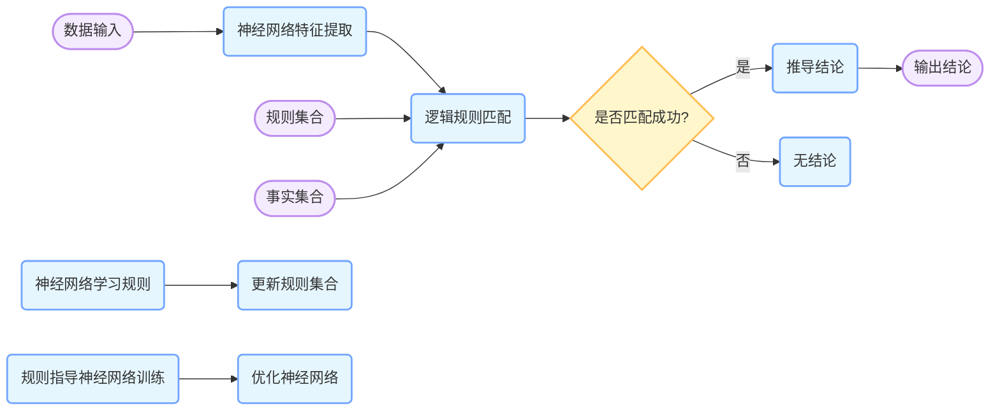

# 神经逻辑编程在规则基推理中的创新应用

> 关键词：神经逻辑编程、规则基推理、知识表示、机器学习、逻辑推理

> 摘要：本文聚焦于神经逻辑编程在规则基推理中的创新应用。首先介绍了神经逻辑编程和规则基推理的背景知识，阐述了其目的、适用读者和文档结构。接着深入剖析了核心概念，包括神经逻辑编程和规则基推理的原理及联系，并给出文本示意图和 Mermaid 流程图。详细讲解了核心算法原理，用 Python 代码进行具体阐述，同时给出相关数学模型和公式，并举例说明。通过项目实战，展示了代码的实际案例和详细解释。探讨了神经逻辑编程在规则基推理中的实际应用场景，推荐了相关的学习资源、开发工具框架和论文著作。最后总结了未来发展趋势与挑战，并提供了常见问题解答和扩展阅读参考资料。

## 1. 背景介绍 
### 1.1 目的和范围
规则基推理是一种基于预先定义的规则来进行逻辑推导和决策的方法，在专家系统、知识图谱等领域有着广泛的应用。然而，传统的规则基推理方法在处理复杂、不确定和模糊的信息时存在一定的局限性。神经逻辑编程结合了神经网络的强大学习能力和逻辑编程的符号推理能力，为规则基推理带来了新的思路和方法。本文的目的在于深入探讨神经逻辑编程在规则基推理中的创新应用，详细分析其原理、算法和实际案例，为相关领域的研究和实践提供有价值的参考。范围涵盖了神经逻辑编程和规则基推理的基本概念、核心算法、数学模型、项目实战以及实际应用场景等方面。

### 1.2 预期读者
本文预期读者包括计算机科学、人工智能、机器学习等领域的研究人员、工程师和学生。对于对规则基推理和神经逻辑编程感兴趣，希望深入了解其原理和应用的专业人士，以及正在从事相关项目开发的技术人员都具有一定的参考价值。

### 1.3 文档结构概述
本文首先介绍背景知识，包括目的、预期读者和文档结构。然后阐述核心概念，分析神经逻辑编程和规则基推理的原理及联系。接着讲解核心算法原理，用 Python 代码详细说明。给出相关数学模型和公式，并举例。通过项目实战展示代码案例和解释。探讨实际应用场景，推荐学习资源、开发工具框架和论文著作。最后总结未来发展趋势与挑战，提供常见问题解答和扩展阅读参考资料。

### 1.4 术语表
#### 1.4.1 核心术语定义
- **神经逻辑编程（Neural Logic Programming）**：是一种将神经网络的学习能力与逻辑编程的符号推理能力相结合的技术，旨在利用神经网络学习数据中的模式和特征，同时通过逻辑编程进行精确的符号推理。
- **规则基推理（Rule-based Reasoning）**：基于预先定义的规则集合，通过匹配事实和规则的前提条件来推导出结论的推理方法。
- **知识表示（Knowledge Representation）**：将知识以某种形式进行编码和存储，以便计算机能够处理和利用的过程。
- **逻辑规则（Logical Rules）**：用逻辑语言表达的规则，通常由前提条件和结论组成。
- **神经网络（Neural Network）**：一种模仿人类神经系统的计算模型，由大量的神经元组成，能够自动学习数据中的模式和特征。

#### 1.4.2 相关概念解释
- **符号推理**：基于符号和逻辑规则进行推理的过程，能够进行精确的逻辑推导和决策。
- **数值计算**：通过数值运算来处理和分析数据的过程，神经网络主要进行数值计算。
- **可解释性**：模型的决策过程和结果能够被人类理解和解释的程度。神经逻辑编程旨在提高模型的可解释性。

#### 1.4.3 缩略词列表
- **NLP**：Natural Language Processing（自然语言处理）
- **ML**：Machine Learning（机器学习）
- **DL**：Deep Learning（深度学习）
- **KB**：Knowledge Base（知识库）

## 2. 核心概念与联系 

### 神经逻辑编程原理
神经逻辑编程的核心思想是将逻辑规则嵌入到神经网络中，使得神经网络能够进行逻辑推理。传统的神经网络主要基于数值计算，难以处理符号和逻辑信息。而神经逻辑编程通过引入逻辑运算符和规则，将逻辑推理转化为神经网络的计算过程。例如，通过定义逻辑规则的真值函数，将规则的前提条件和结论映射到神经网络的输入和输出，从而实现逻辑推理。

### 规则基推理原理
规则基推理基于预先定义的规则集合，当给定一组事实时，系统会检查这些事实是否满足规则的前提条件。如果满足，则触发规则，推导出相应的结论。规则基推理具有明确的逻辑结构和可解释性，但在处理复杂和不确定的信息时存在局限性。

### 两者联系
神经逻辑编程为规则基推理提供了更强的学习能力和处理不确定性的能力。神经网络可以从大量的数据中学习到隐含的模式和特征，从而自动发现新的规则或对现有规则进行修正。同时，规则基推理的逻辑结构可以为神经网络提供先验知识，提高神经网络的可解释性和推理能力。例如，在知识图谱推理中，神经逻辑编程可以利用规则基推理的知识表示和推理方法，结合神经网络的学习能力，实现更准确和高效的推理。

### 文本示意图
```plaintext
神经逻辑编程
|-- 神经网络部分
|   |-- 数据输入
|   |-- 神经元计算
|   |-- 特征提取
|-- 逻辑编程部分
|   |-- 逻辑规则定义
|   |-- 规则匹配
|   |-- 推理过程

规则基推理
|-- 规则集合
|   |-- 前提条件
|   |-- 结论
|-- 事实集合
|   |-- 输入事实
|-- 推理引擎
|   |-- 规则匹配
|   |-- 结论推导

神经逻辑编程与规则基推理的联系
|-- 神经网络学习规则
|-- 规则指导神经网络训练
|-- 共同实现推理任务
```

### Mermaid 流程图


## 3. 核心算法原理 & 具体操作步骤 

### 核心算法原理
神经逻辑编程的核心算法通常基于神经网络和逻辑编程的结合。一种常见的方法是使用神经网络来学习逻辑规则的真值函数。例如，对于一个逻辑规则 $R: P \land Q \to R$，可以使用神经网络来学习 $P$、$Q$ 和 $R$ 之间的关系。具体来说，将 $P$ 和 $Q$ 的特征向量作为神经网络的输入，输出为 $R$ 的预测值。通过训练神经网络，使得预测值尽可能接近真实值。

### Python 代码实现
```python
import torch
import torch.nn as nn

# 定义一个简单的神经网络模型
class NeuralLogicNetwork(nn.Module):
    def __init__(self, input_size, hidden_size, output_size):
        super(NeuralLogicNetwork, self).__init__()
        self.fc1 = nn.Linear(input_size, hidden_size)
        self.relu = nn.ReLU()
        self.fc2 = nn.Linear(hidden_size, output_size)
        self.sigmoid = nn.Sigmoid()

    def forward(self, x):
        out = self.fc1(x)
        out = self.relu(out)
        out = self.fc2(out)
        out = self.sigmoid(out)
        return out

# 初始化模型
input_size = 2
hidden_size = 10
output_size = 1
model = NeuralLogicNetwork(input_size, hidden_size, output_size)

# 定义损失函数和优化器
criterion = nn.BCELoss()
optimizer = torch.optim.Adam(model.parameters(), lr=0.001)

# 训练数据
# 假设 P 和 Q 是两个布尔变量，R 是它们的逻辑与结果
train_data = [
    (torch.tensor([0, 0], dtype=torch.float32), torch.tensor([0], dtype=torch.float32)),
    (torch.tensor([0, 1], dtype=torch.float32), torch.tensor([0], dtype=torch.float32)),
    (torch.tensor([1, 0], dtype=torch.float32), torch.tensor([0], dtype=torch.float32)),
    (torch.tensor([1, 1], dtype=torch.float32), torch.tensor([1], dtype=torch.float32))
]

# 训练模型
num_epochs = 1000
for epoch in range(num_epochs):
    for inputs, labels in train_data:
        optimizer.zero_grad()
        outputs = model(inputs)
        loss = criterion(outputs, labels)
        loss.backward()
        optimizer.step()
    if (epoch + 1) % 100 == 0:
        print(f'Epoch [{epoch+1}/{num_epochs}], Loss: {loss.item():.4f}')

# 测试模型
test_input = torch.tensor([1, 1], dtype=torch.float32)
test_output = model(test_input)
print(f'Test input: {test_input}, Test output: {test_output.item():.4f}')
```

### 具体操作步骤
1. **数据准备**：收集和整理用于训练和测试的数据，将其转换为适合神经网络输入的格式。
2. **模型定义**：定义一个神经网络模型，确定输入层、隐藏层和输出层的大小。
3. **损失函数和优化器选择**：选择合适的损失函数和优化器，用于衡量模型的预测误差并更新模型参数。
4. **训练模型**：使用训练数据对模型进行训练，通过多次迭代更新模型参数，使得损失函数的值逐渐减小。
5. **测试模型**：使用测试数据对训练好的模型进行测试，评估模型的性能。

## 4. 数学模型和公式 & 详细讲解 & 举例说明 

### 逻辑规则的真值函数
对于一个逻辑规则 $R: P_1 \land P_2 \land \cdots \land P_n \to Q$，其真值函数可以表示为：
$$
\mathcal{T}(R) = \begin{cases}
1, & \text{if } \mathcal{T}(P_1) = 1 \text{ and } \mathcal{T}(P_2) = 1 \text{ and } \cdots \text{ and } \mathcal{T}(P_n) = 1 \text{ and } \mathcal{T}(Q) = 1 \\
0, & \text{otherwise}
\end{cases}
$$
其中，$\mathcal{T}(P_i)$ 表示命题 $P_i$ 的真值，取值为 0 或 1。

### 神经网络的输出
假设神经网络的输入为 $x = [x_1, x_2, \cdots, x_m]$，隐藏层的神经元个数为 $h$，输出层的神经元个数为 $k$。则隐藏层的输出可以表示为：
$$
h_j = \sigma\left(\sum_{i=1}^{m} w_{ij}x_i + b_j\right), \quad j = 1, 2, \cdots, h
$$
其中，$w_{ij}$ 是输入层第 $i$ 个神经元到隐藏层第 $j$ 个神经元的权重，$b_j$ 是隐藏层第 $j$ 个神经元的偏置，$\sigma$ 是激活函数，如 ReLU 函数。

输出层的输出可以表示为：
$$
y_l = \sigma\left(\sum_{j=1}^{h} v_{jl}h_j + c_l\right), \quad l = 1, 2, \cdots, k
$$
其中，$v_{jl}$ 是隐藏层第 $j$ 个神经元到输出层第 $l$ 个神经元的权重，$c_l$ 是输出层第 $l$ 个神经元的偏置。

### 损失函数
常用的损失函数是二元交叉熵损失函数（Binary Cross Entropy Loss），用于二分类问题。对于一个样本 $(x, y)$，其损失函数可以表示为：
$$
L(y, \hat{y}) = -y\log(\hat{y}) - (1 - y)\log(1 - \hat{y})
$$
其中，$y$ 是真实标签，$\hat{y}$ 是模型的预测值。

### 举例说明
假设我们有一个逻辑规则 $R: P \land Q \to R$，并且有以下训练数据：
| $P$ | $Q$ | $R$ |
| --- | --- | --- |
| 0   | 0   | 0   |
| 0   | 1   | 0   |
| 1   | 0   | 0   |
| 1   | 1   | 1   |

我们使用上述的神经网络模型来学习这个逻辑规则。输入层的大小为 2（对应 $P$ 和 $Q$），输出层的大小为 1（对应 $R$）。通过训练模型，使得模型的输出尽可能接近真实的 $R$ 值。

## 5. 项目实战：代码实际案例和详细解释说明 

### 5.1  开发环境搭建
#### 安装 Python
首先，确保你已经安装了 Python 3.x 版本。可以从 Python 官方网站（https://www.python.org/downloads/） 下载并安装。

#### 安装 PyTorch
使用以下命令安装 PyTorch：
```sh
pip install torch torchvision
```

#### 安装其他依赖库
根据项目的需求，可能还需要安装其他依赖库，如 NumPy、Matplotlib 等。可以使用以下命令安装：
```sh
pip install numpy matplotlib
```

### 5.2  源代码详细实现和代码解读
```python
import torch
import torch.nn as nn

# 定义一个简单的神经网络模型
class NeuralLogicNetwork(nn.Module):
    def __init__(self, input_size, hidden_size, output_size):
        super(NeuralLogicNetwork, self).__init__()
        # 定义第一个全连接层，输入大小为 input_size，输出大小为 hidden_size
        self.fc1 = nn.Linear(input_size, hidden_size)
        # 定义 ReLU 激活函数
        self.relu = nn.ReLU()
        # 定义第二个全连接层，输入大小为 hidden_size，输出大小为 output_size
        self.fc2 = nn.Linear(hidden_size, output_size)
        # 定义 Sigmoid 激活函数，用于将输出映射到 [0, 1] 区间
        self.sigmoid = nn.Sigmoid()

    def forward(self, x):
        # 前向传播过程
        out = self.fc1(x)
        out = self.relu(out)
        out = self.fc2(out)
        out = self.sigmoid(out)
        return out

# 初始化模型
input_size = 2
hidden_size = 10
output_size = 1
model = NeuralLogicNetwork(input_size, hidden_size, output_size)

# 定义损失函数和优化器
criterion = nn.BCELoss()
optimizer = torch.optim.Adam(model.parameters(), lr=0.001)

# 训练数据
# 假设 P 和 Q 是两个布尔变量，R 是它们的逻辑与结果
train_data = [
    (torch.tensor([0, 0], dtype=torch.float32), torch.tensor([0], dtype=torch.float32)),
    (torch.tensor([0, 1], dtype=torch.float32), torch.tensor([0], dtype=torch.float32)),
    (torch.tensor([1, 0], dtype=torch.float32), torch.tensor([0], dtype=torch.float32)),
    (torch.tensor([1, 1], dtype=torch.float32), torch.tensor([1], dtype=torch.float32))
]

# 训练模型
num_epochs = 1000
for epoch in range(num_epochs):
    for inputs, labels in train_data:
        # 清零梯度
        optimizer.zero_grad()
        # 前向传播
        outputs = model(inputs)
        # 计算损失
        loss = criterion(outputs, labels)
        # 反向传播
        loss.backward()
        # 更新参数
        optimizer.step()
    if (epoch + 1) % 100 == 0:
        print(f'Epoch [{epoch+1}/{num_epochs}], Loss: {loss.item():.4f}')

# 测试模型
test_input = torch.tensor([1, 1], dtype=torch.float32)
test_output = model(test_input)
print(f'Test input: {test_input}, Test output: {test_output.item():.4f}')
```

### 5.3  代码解读与分析
- **模型定义**：`NeuralLogicNetwork` 类继承自 `nn.Module`，定义了一个简单的两层神经网络。包含一个输入层、一个隐藏层和一个输出层，使用 ReLU 激活函数和 Sigmoid 激活函数。
- **损失函数和优化器**：使用二元交叉熵损失函数 `nn.BCELoss()` 来衡量模型的预测误差，使用 Adam 优化器来更新模型参数。
- **训练过程**：通过多次迭代训练数据，每次迭代中进行前向传播、计算损失、反向传播和参数更新。
- **测试过程**：使用一个测试输入来测试训练好的模型，输出预测结果。

## 6. 实际应用场景 
### 知识图谱推理
在知识图谱中，神经逻辑编程可以用于推理实体之间的关系。例如，在一个人物关系知识图谱中，通过神经逻辑编程可以学习到“父亲的父亲是祖父”这样的逻辑规则，并根据已知的人物关系信息推导出新的关系。通过结合神经网络的学习能力和规则基推理的逻辑结构，可以提高知识图谱推理的准确性和效率。

### 专家系统
专家系统是基于规则的决策系统，神经逻辑编程可以为专家系统带来更强的学习能力和处理不确定性的能力。例如，在医疗专家系统中，传统的规则基推理可能无法处理复杂的医学数据和不确定的诊断结果。而神经逻辑编程可以学习到更多的医学知识和规则，根据患者的症状和检查结果进行更准确的诊断和治疗建议。

### 自然语言处理
在自然语言处理中，神经逻辑编程可以用于语义理解和推理。例如，在问答系统中，通过将问题和文本信息转换为逻辑表示，使用神经逻辑编程进行推理，从而得到准确的答案。神经逻辑编程可以处理自然语言中的模糊性和歧义性，提高语义理解和推理的能力。

### 智能机器人
在智能机器人领域，神经逻辑编程可以用于机器人的决策和规划。例如，机器人在执行任务时，需要根据环境信息和任务要求进行决策。通过神经逻辑编程，机器人可以学习到环境中的规则和模式，根据逻辑推理进行任务规划和行动决策。

## 7. 工具和资源推荐
### 7.1 学习资源推荐
#### 7.1.1 书籍推荐
- 《人工智能：一种现代的方法》（Artificial Intelligence: A Modern Approach）：这本书是人工智能领域的经典教材，涵盖了人工智能的各个方面，包括逻辑推理、机器学习、知识表示等。
- 《深度学习》（Deep Learning）：由 Ian Goodfellow、Yoshua Bengio 和 Aaron Courville 撰写，是深度学习领域的权威书籍，介绍了深度学习的基本原理和方法。
- 《神经逻辑编程：理论与应用》（Neural Logic Programming: Theory and Applications）：专门介绍神经逻辑编程的书籍，深入探讨了其原理、算法和应用。

#### 7.1.2 在线课程
- Coursera 上的“人工智能基础”（Foundations of Artificial Intelligence）课程：由斯坦福大学教授授课，介绍了人工智能的基本概念和方法。
- edX 上的“深度学习”（Deep Learning Specialization）课程：由 Andrew Ng 教授授课，是深度学习领域的经典课程，涵盖了深度学习的各个方面。
- Udemy 上的“神经逻辑编程实战”（Neural Logic Programming in Practice）课程：专门介绍神经逻辑编程的实战课程，通过实际案例讲解其应用。

#### 7.1.3 技术博客和网站
- Medium 上的人工智能相关博客：有很多人工智能领域的专家和爱好者在 Medium 上分享他们的研究成果和经验。
- arXiv.org：是一个预印本数据库，包含了大量的人工智能相关的研究论文。
- Towards Data Science：是一个专注于数据科学和人工智能的技术博客，提供了很多实用的教程和案例。

### 7.2 开发工具框架推荐
#### 7.2.1 IDE和编辑器
- PyCharm：是一个专门为 Python 开发设计的集成开发环境，提供了丰富的功能和插件，方便开发和调试 Python 代码。
- Jupyter Notebook：是一个交互式的开发环境，适合进行数据分析和模型实验。可以在浏览器中运行代码，并实时查看结果。
- Visual Studio Code：是一个轻量级的代码编辑器，支持多种编程语言，有丰富的插件和扩展，可以用于开发各种类型的项目。

#### 7.2.2 调试和性能分析工具
- PyTorch Profiler：是 PyTorch 提供的性能分析工具，可以帮助开发者分析模型的性能瓶颈，优化代码。
- TensorBoard：是 TensorFlow 提供的可视化工具，也可以用于 PyTorch 模型的可视化和调试。可以查看模型的训练过程、损失曲线、参数分布等信息。
- cProfile：是 Python 内置的性能分析工具，可以分析 Python 代码的运行时间和函数调用次数，帮助开发者找出性能瓶颈。

#### 7.2.3 相关框架和库
- PyTorch：是一个开源的深度学习框架，提供了丰富的神经网络层和优化器，支持 GPU 加速，广泛应用于深度学习领域。
- TensorFlow：是另一个流行的深度学习框架，具有强大的分布式训练能力和可视化工具，适合大规模的深度学习项目。
- PyDatalog：是一个用于逻辑编程的 Python 库，可以方便地实现规则基推理和逻辑查询。

### 7.3 相关论文著作推荐
#### 7.3.1 经典论文
- “Neural Logic Machines”：提出了神经逻辑机的概念，将神经网络和逻辑编程相结合，用于处理结构化数据和逻辑推理。
- “Differentiable Inductive Logic Programming”：介绍了可微归纳逻辑编程的方法，通过将逻辑规则嵌入到神经网络中，实现可微的逻辑推理。
- “Neural-Symbolic Learning and Reasoning: Contributions and Challenges”：对神经符号学习和推理进行了综述，分析了其发展历程、贡献和挑战。

#### 7.3.2 最新研究成果
- 可以通过 arXiv.org、ACM Digital Library、IEEE Xplore 等学术数据库查找神经逻辑编程领域的最新研究成果。关注顶级人工智能会议，如 NeurIPS、ICML、AAAI 等，这些会议上会有很多关于神经逻辑编程的最新研究论文。

#### 7.3.3 应用案例分析
- 在学术论文和技术博客中可以找到很多神经逻辑编程在不同领域的应用案例分析。例如，在知识图谱推理、专家系统、自然语言处理等领域的应用案例。通过分析这些案例，可以了解神经逻辑编程的实际应用效果和方法。

## 8. 总结：未来发展趋势与挑战
### 未来发展趋势
- **融合多模态信息**：未来的神经逻辑编程将更加注重融合多模态信息，如文本、图像、音频等。通过结合不同模态的信息，可以提高模型的推理能力和泛化能力。
- **可解释性增强**：随着人工智能的广泛应用，模型的可解释性变得越来越重要。神经逻辑编程将进一步发展，提高模型的可解释性，使得模型的决策过程和结果能够被人类理解和信任。
- **与强化学习结合**：将神经逻辑编程与强化学习相结合，可以实现更加智能的决策和规划。通过逻辑推理和学习，智能体可以在复杂的环境中做出更优的决策。
- **应用领域拓展**：神经逻辑编程将在更多的领域得到应用，如医疗、金融、交通等。通过解决这些领域中的复杂问题，为社会带来更大的价值。

### 挑战
- **计算资源需求**：神经逻辑编程通常需要大量的计算资源，特别是在处理大规模数据和复杂模型时。如何降低计算资源需求，提高模型的训练和推理效率是一个挑战。
- **规则学习的复杂性**：从数据中自动学习逻辑规则是一个复杂的问题，需要解决规则的表示、搜索和评估等问题。如何提高规则学习的效率和准确性是一个关键挑战。
- **可扩展性**：在实际应用中，需要处理大规模的知识和数据。如何设计可扩展的神经逻辑编程模型和算法，以适应不同规模的应用场景是一个挑战。
- **不确定性处理**：现实世界中的信息往往是不确定和模糊的。如何在神经逻辑编程中有效地处理不确定性，提高模型的鲁棒性和可靠性是一个重要挑战。

## 9. 附录：常见问题与解答
### 1. 神经逻辑编程和传统神经网络有什么区别？
传统神经网络主要基于数值计算，难以处理符号和逻辑信息。而神经逻辑编程将逻辑规则嵌入到神经网络中，使得神经网络能够进行逻辑推理，同时具有神经网络的学习能力。

### 2. 神经逻辑编程在规则基推理中的优势是什么？
神经逻辑编程为规则基推理带来了更强的学习能力和处理不确定性的能力。可以从大量的数据中学习到隐含的模式和特征，自动发现新的规则或对现有规则进行修正。同时，规则基推理的逻辑结构可以为神经网络提供先验知识，提高神经网络的可解释性和推理能力。

### 3. 如何选择合适的神经网络模型和逻辑规则？
选择合适的神经网络模型和逻辑规则需要考虑具体的应用场景和数据特点。一般来说，可以先尝试一些简单的模型和规则，然后根据实验结果进行调整和优化。同时，可以参考相关的研究论文和实践经验，选择适合的模型和规则。

### 4. 神经逻辑编程的训练过程需要注意什么？
在神经逻辑编程的训练过程中，需要注意以下几点：
- 数据的质量和数量：确保训练数据的质量和数量足够，以保证模型的学习效果。
- 超参数的调整：选择合适的超参数，如学习率、批量大小等，对模型的性能有重要影响。
- 模型的评估：使用合适的评估指标对模型进行评估，及时发现模型的问题并进行调整。

### 5. 神经逻辑编程可以应用于哪些领域？
神经逻辑编程可以应用于知识图谱推理、专家系统、自然语言处理、智能机器人等领域。通过结合神经网络的学习能力和逻辑编程的推理能力，可以解决这些领域中的复杂问题。

## 10. 扩展阅读 & 参考资料
- [Neural Logic Programming: A Survey](https://arxiv.org/abs/2003.06078)
- [Differentiable Logic Programming](https://arxiv.org/abs/1909.05049)
- [Knowledge Graph Reasoning with Neural Logic Programming](https://www.ijcai.org/Proceedings/2019/0374.pdf)
- [Artificial Intelligence: A Modern Approach, 4th Edition](https://www.pearson.com/us/higher-education/program/Russell-Artificial-Intelligence-A-Modern-Approach-4th-Edition/PGM2410603.html)
- [Deep Learning](https://www.deeplearningbook.org/)

作者：AI天才研究院/AI Genius Institute & 禅与计算机程序设计艺术 /Zen And The Art of Computer Programming