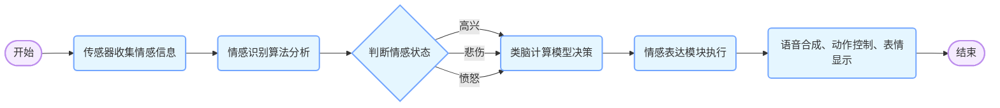

# 类脑计算在情感智能机器人中的创新应用

> 关键词：类脑计算、情感智能机器人、神经形态工程、情感计算、创新应用

> 摘要：本文深入探讨了类脑计算在情感智能机器人中的创新应用。首先介绍了类脑计算和情感智能机器人的背景知识，明确了研究目的和范围。接着阐述了类脑计算与情感智能的核心概念及联系，详细讲解了相关核心算法原理和具体操作步骤，同时给出了数学模型和公式。通过项目实战案例，展示了如何在实际中运用这些技术。分析了类脑计算在情感智能机器人中的实际应用场景，推荐了相关的学习资源、开发工具框架和论文著作。最后总结了未来发展趋势与挑战，并对常见问题进行了解答，为类脑计算在情感智能机器人领域的进一步发展提供了全面的参考。

## 1. 背景介绍 
### 1.1 目的和范围
本研究旨在探索类脑计算如何为情感智能机器人带来创新性的发展。通过深入研究类脑计算的原理和技术，结合情感智能机器人的需求，挖掘类脑计算在情感感知、情感表达和情感交互等方面的应用潜力。研究范围涵盖了类脑计算的基本概念、相关算法、数学模型，以及在情感智能机器人开发中的具体实践和应用场景。

### 1.2 预期读者
本文适合对人工智能、类脑计算、机器人技术等领域感兴趣的科研人员、工程师、学生以及对科技发展有好奇心的爱好者阅读。科研人员可以从文中获取关于类脑计算在情感智能机器人领域的最新研究思路和方向；工程师可以借鉴具体的算法实现和项目实战经验，应用于实际的开发工作中；学生可以通过本文了解前沿技术，拓宽知识面；爱好者则可以对类脑计算和情感智能机器人有更深入的认识。

### 1.3 文档结构概述
本文首先介绍了类脑计算和情感智能机器人的相关背景知识，包括术语定义和概念解释。接着阐述了类脑计算与情感智能的核心概念及联系，通过文本示意图和 Mermaid 流程图进行直观展示。然后详细讲解了核心算法原理和具体操作步骤，给出了 Python 源代码示例。同时，介绍了相关的数学模型和公式，并通过举例进行说明。在项目实战部分，提供了开发环境搭建的步骤、源代码实现和详细的代码解读。之后分析了类脑计算在情感智能机器人中的实际应用场景。推荐了学习资源、开发工具框架和相关论文著作。最后总结了未来发展趋势与挑战，解答了常见问题，并提供了扩展阅读和参考资料。

### 1.4 术语表
#### 1.4.1 核心术语定义
- **类脑计算**：借鉴人脑神经系统的结构和功能，设计和开发新型计算系统和算法的技术。它试图模拟大脑的信息处理方式，以实现更高效、智能的计算。
- **情感智能机器人**：具备情感感知、情感表达和情感交互能力的机器人。能够识别和理解人类的情感状态，并做出相应的情感反应。
- **神经形态工程**：结合神经科学和工程学的原理，设计和构建模仿生物神经系统结构和功能的硬件和软件系统。
- **情感计算**：研究如何让计算机识别、表达和理解人类情感的技术。通过对情感信息的处理和分析，实现人与计算机之间的情感交互。

#### 1.4.2 相关概念解释
- **人工神经网络**：一种模仿人类神经系统的计算模型，由大量的神经元组成，通过神经元之间的连接和权重调整来实现信息的处理和学习。
- **深度学习**：一种基于人工神经网络的机器学习方法，通过多层神经网络的训练，自动提取数据中的特征和模式，实现对复杂任务的学习和预测。
- **情感识别**：通过分析人类的面部表情、语音、生理信号等信息，识别出人类的情感状态，如高兴、悲伤、愤怒等。
- **情感表达**：机器人通过语音、动作、表情等方式表达自己的情感状态，与人类进行情感交互。

#### 1.4.3 缩略词列表
- **ANN**：Artificial Neural Network，人工神经网络
- **DNN**：Deep Neural Network，深度神经网络
- **RNN**：Recurrent Neural Network，循环神经网络
- **LSTM**：Long Short-Term Memory，长短期记忆网络
- **CNN**：Convolutional Neural Network，卷积神经网络

## 2. 核心概念与联系 
### 核心概念原理
#### 类脑计算原理
类脑计算的核心思想是模仿人脑的神经系统结构和功能。人脑由大量的神经元组成，神经元之间通过突触进行连接和信息传递。类脑计算系统通过构建人工神经元和突触，模拟神经元的放电和信息传递过程。例如，脉冲神经网络（SNN）是一种典型的类脑计算模型，它使用脉冲信号来表示信息，更接近生物神经元的工作方式。

#### 情感智能原理
情感智能机器人的情感智能基于情感计算技术。情感计算主要包括情感识别和情感表达两个方面。情感识别通过传感器收集人类的情感信息，如面部表情、语音语调、生理信号等，然后使用机器学习和深度学习算法对这些信息进行分析和分类，识别出人类的情感状态。情感表达则是机器人根据识别到的情感状态，通过语音、动作、表情等方式做出相应的情感反应。

### 架构的文本示意图
```plaintext
类脑计算系统
|-- 人工神经元
|   |-- 输入信号处理
|   |-- 神经元放电规则
|   |-- 输出脉冲信号
|-- 突触连接
|   |-- 突触权重调整
|   |-- 信息传递
|
情感智能机器人
|-- 情感感知模块
|   |-- 传感器（摄像头、麦克风、生理传感器等）
|   |-- 情感识别算法（机器学习、深度学习）
|-- 情感处理模块
|   |-- 类脑计算模型（脉冲神经网络等）
|   |-- 情感决策机制
|-- 情感表达模块
|   |-- 语音合成
|   |-- 动作控制
|   |-- 表情显示
```

### Mermaid 流程图


## 3. 核心算法原理 & 具体操作步骤 
### 核心算法原理
#### 脉冲神经网络（SNN）原理
脉冲神经网络是类脑计算中常用的模型，它的基本单元是脉冲神经元。脉冲神经元在接收到输入信号后，会根据一定的规则产生脉冲信号。常见的脉冲神经元模型有 Hodgkin-Huxley 模型和 Leaky Integrate-and-Fire（LIF）模型。

以 LIF 模型为例，其基本原理如下：
- 神经元的膜电位 $V(t)$ 会随着时间的推移而发生变化，其变化率由输入电流 $I(t)$ 和膜电位的衰减决定。
- 当膜电位 $V(t)$ 达到阈值 $\theta$ 时，神经元会产生一个脉冲信号，并将膜电位重置为初始值 $V_{reset}$。

### Python 源代码实现
```python
import numpy as np
import matplotlib.pyplot as plt

# 定义 LIF 神经元参数
tau = 10.0  # 膜时间常数
R = 10.0  # 膜电阻
theta = 1.0  # 阈值
V_reset = 0.0  # 重置电位
dt = 0.1  # 时间步长
T = 100.0  # 模拟时间

# 生成输入电流
t = np.arange(0, T, dt)
I = np.zeros_like(t)
I[200:800] = 0.2  # 在 20ms 到 80ms 之间施加电流

# 初始化膜电位
V = np.zeros_like(t)
V[0] = V_reset

# 模拟 LIF 神经元
spikes = []
for i in range(1, len(t)):
    # 计算膜电位的变化率
    dV = (-V[i-1] + R * I[i-1]) / tau * dt
    V[i] = V[i-1] + dV
    
    # 判断是否产生脉冲
    if V[i] >= theta:
        spikes.append(t[i])
        V[i] = V_reset

# 绘制结果
plt.figure(figsize=(10, 6))
plt.subplot(2, 1, 1)
plt.plot(t, I)
plt.xlabel('Time (ms)')
plt.ylabel('Input Current (A)')
plt.title('Input Current')

plt.subplot(2, 1, 2)
plt.plot(t, V)
plt.xlabel('Time (ms)')
plt.ylabel('Membrane Potential (V)')
plt.title('Membrane Potential')

plt.tight_layout()
plt.show()

print('Spike times:', spikes)
```

### 具体操作步骤
1. **定义神经元参数**：包括膜时间常数、膜电阻、阈值、重置电位等。
2. **生成输入电流**：根据实际需求生成不同的输入电流信号。
3. **初始化膜电位**：将膜电位初始化为重置电位。
4. **模拟神经元行为**：在每个时间步长内，计算膜电位的变化率，并更新膜电位。如果膜电位达到阈值，则产生一个脉冲信号，并将膜电位重置为初始值。
5. **记录脉冲时间**：记录每个脉冲产生的时间。
6. **绘制结果**：绘制输入电流和膜电位随时间的变化曲线，直观展示神经元的行为。

## 4. 数学模型和公式 & 详细讲解 & 举例说明 
### 脉冲神经网络数学模型
#### Leaky Integrate-and-Fire（LIF）模型
LIF 模型的数学表达式如下：

$$\tau \frac{dV(t)}{dt} = -V(t) + R I(t)$$

其中，$V(t)$ 是神经元的膜电位，$\tau$ 是膜时间常数，$R$ 是膜电阻，$I(t)$ 是输入电流。

当膜电位 $V(t)$ 达到阈值 $\theta$ 时，神经元会产生一个脉冲信号，并将膜电位重置为初始值 $V_{reset}$：

$$V(t) = \begin{cases}
V_{reset}, & \text{if } V(t) \geq \theta \\
V(t), & \text{otherwise}
\end{cases}$$

### 详细讲解
- **膜电位变化率**：$\frac{dV(t)}{dt}$ 表示膜电位随时间的变化率。膜电位的变化由输入电流 $I(t)$ 和膜电位的衰减共同决定。膜时间常数 $\tau$ 控制着膜电位的衰减速度，$\tau$ 越大，膜电位的衰减越慢。
- **阈值和重置**：当膜电位达到阈值 $\theta$ 时，神经元会产生一个脉冲信号，然后将膜电位重置为 $V_{reset}$。这模拟了生物神经元的放电过程。

### 举例说明
假设一个 LIF 神经元的参数如下：
- $\tau = 10$ ms
- $R = 10$ $\Omega$
- $\theta = 1$ V
- $V_{reset} = 0$ V

输入电流 $I(t)$ 在 $20$ ms 到 $80$ ms 之间为 $0.2$ A，其他时间为 $0$ A。

根据 LIF 模型的数学公式，我们可以计算出膜电位 $V(t)$ 随时间的变化。在输入电流为 $0$ 时，膜电位会逐渐衰减到 $0$。当输入电流为 $0.2$ A 时，膜电位会逐渐上升。如果膜电位达到阈值 $1$ V，神经元会产生一个脉冲信号，并将膜电位重置为 $0$ V。

通过 Python 代码的模拟，我们可以得到膜电位随时间的变化曲线，直观地观察到神经元的放电行为。

## 5. 项目实战：代码实际案例和详细解释说明 
### 5.1  开发环境搭建
#### 安装 Python
首先需要安装 Python 环境，建议使用 Python 3.7 及以上版本。可以从 Python 官方网站（https://www.python.org/downloads/）下载适合自己操作系统的安装包，并按照安装向导进行安装。

#### 安装必要的库
在项目中，我们需要使用一些 Python 库，如 NumPy、Matplotlib 等。可以使用以下命令来安装这些库：
```sh
pip install numpy matplotlib
```

### 5.2  源代码详细实现和代码解读
```python
import numpy as np
import matplotlib.pyplot as plt

# 定义 LIF 神经元参数
tau = 10.0  # 膜时间常数
R = 10.0  # 膜电阻
theta = 1.0  # 阈值
V_reset = 0.0  # 重置电位
dt = 0.1  # 时间步长
T = 100.0  # 模拟时间

# 生成输入电流
t = np.arange(0, T, dt)
I = np.zeros_like(t)
I[200:800] = 0.2  # 在 20ms 到 80ms 之间施加电流

# 初始化膜电位
V = np.zeros_like(t)
V[0] = V_reset

# 模拟 LIF 神经元
spikes = []
for i in range(1, len(t)):
    # 计算膜电位的变化率
    dV = (-V[i-1] + R * I[i-1]) / tau * dt
    V[i] = V[i-1] + dV
    
    # 判断是否产生脉冲
    if V[i] >= theta:
        spikes.append(t[i])
        V[i] = V_reset

# 绘制结果
plt.figure(figsize=(10, 6))
plt.subplot(2, 1, 1)
plt.plot(t, I)
plt.xlabel('Time (ms)')
plt.ylabel('Input Current (A)')
plt.title('Input Current')

plt.subplot(2, 1, 2)
plt.plot(t, V)
plt.xlabel('Time (ms)')
plt.ylabel('Membrane Potential (V)')
plt.title('Membrane Potential')

plt.tight_layout()
plt.show()

print('Spike times:', spikes)
```

### 代码解读与分析
1. **导入必要的库**：导入 NumPy 和 Matplotlib 库，用于数值计算和绘图。
2. **定义 LIF 神经元参数**：设置膜时间常数、膜电阻、阈值、重置电位、时间步长和模拟时间。
3. **生成输入电流**：使用 NumPy 的 `arange` 函数生成时间序列 $t$，并初始化输入电流 $I$。在 $20$ ms 到 $80$ ms 之间施加电流 $0.2$ A。
4. **初始化膜电位**：将膜电位 $V$ 初始化为重置电位 $V_{reset}$。
5. **模拟 LIF 神经元**：使用循环遍历每个时间步长，计算膜电位的变化率，并更新膜电位。如果膜电位达到阈值，则记录脉冲时间，并将膜电位重置为初始值。
6. **绘制结果**：使用 Matplotlib 绘制输入电流和膜电位随时间的变化曲线。
7. **输出脉冲时间**：打印出所有脉冲产生的时间。

通过这个项目实战，我们可以直观地观察到 LIF 神经元在不同输入电流下的放电行为，加深对类脑计算中脉冲神经网络的理解。

## 6. 实际应用场景 
### 医疗护理领域
在医疗护理中，情感智能机器人可以陪伴患者，提供情感支持。类脑计算技术可以让机器人更好地理解患者的情感状态，例如通过分析患者的语音和表情，识别出患者的焦虑、抑郁等情绪。机器人可以根据患者的情感状态，提供相应的安慰和鼓励，帮助患者缓解心理压力。同时，机器人还可以协助医护人员进行护理工作，如提醒患者按时服药、进行康复训练等。

### 教育领域
在教育领域，情感智能机器人可以作为智能学习伙伴，与学生进行互动。类脑计算可以使机器人理解学生的学习情绪，如困惑、厌烦等。当机器人识别到学生的负面情绪时，可以调整教学方式和内容，提高学生的学习兴趣和积极性。例如，机器人可以通过讲故事、做游戏等方式，帮助学生更好地理解知识。

### 家庭服务领域
情感智能机器人可以成为家庭的好帮手，提供家庭陪伴和服务。类脑计算让机器人能够感知家庭成员的情感需求，如在家人疲惫时提供放松的音乐和按摩建议，在家人开心时一起分享快乐。机器人还可以负责家庭的日常管理，如打扫卫生、购物提醒等，提高家庭生活的便利性和舒适度。

### 娱乐领域
在娱乐领域，情感智能机器人可以作为互动娱乐伙伴，为用户带来更加丰富的娱乐体验。类脑计算使机器人能够根据用户的情感反应，调整游戏的难度和情节。例如，在玩冒险游戏时，机器人可以根据用户的紧张情绪，增加游戏的刺激感；在用户感到无聊时，改变游戏的玩法。

## 7. 工具和资源推荐
### 7.1 学习资源推荐
#### 7.1.1 书籍推荐
- 《类脑计算：从原理到应用》：全面介绍了类脑计算的基本原理、算法和应用，适合初学者和专业人士阅读。
- 《情感计算》：深入探讨了情感计算的理论和技术，包括情感识别、情感表达等方面的内容。
- 《神经网络与深度学习》：详细讲解了人工神经网络和深度学习的原理和应用，是学习类脑计算的重要参考书籍。

#### 7.1.2 在线课程
- Coursera 上的“Neural Networks and Deep Learning”：由深度学习领域的知名专家 Andrew Ng 授课，系统地介绍了神经网络和深度学习的基础知识。
- edX 上的“Introduction to Artificial Intelligence”：涵盖了人工智能的各个方面，包括类脑计算和情感智能的相关内容。
- 中国大学 MOOC 上的“类脑智能技术及应用”：由国内高校的专家授课，结合实际案例，介绍了类脑智能技术的应用和发展。

#### 7.1.3 技术博客和网站
- Medium 上的“Towards Data Science”：有许多关于人工智能、类脑计算和情感智能的技术文章和案例分享。
- arXiv 网站：可以获取最新的类脑计算和情感智能领域的研究论文。
- 机器之心：关注人工智能领域的前沿动态，提供了丰富的技术文章和行业资讯。

### 7.2 开发工具框架推荐
#### 7.2.1 IDE和编辑器
- PyCharm：是一款功能强大的 Python 集成开发环境，提供了代码编辑、调试、版本控制等功能，适合开发类脑计算和情感智能相关的 Python 项目。
- Jupyter Notebook：可以将代码、文本、图像等内容整合在一个文档中，方便进行代码的编写、调试和展示，常用于数据分析和机器学习项目。
- Visual Studio Code：轻量级的代码编辑器，支持多种编程语言和插件扩展，可用于类脑计算和情感智能项目的开发。

#### 7.2.2 调试和性能分析工具
- Py-Spy：可以对 Python 程序进行性能分析，找出程序中的性能瓶颈。
- TensorBoard：是 TensorFlow 提供的可视化工具，可用于可视化神经网络的训练过程和性能指标。
- cProfile：Python 自带的性能分析工具，可以分析程序中各个函数的执行时间和调用次数。

#### 7.2.3 相关框架和库
- PyTorch：是一个开源的深度学习框架，提供了丰富的神经网络层和优化算法，支持类脑计算中脉冲神经网络的开发。
- Nengo：是一个用于构建和模拟神经模型的 Python 库，可用于类脑计算的研究和开发。
- OpenCV：是一个计算机视觉库，可用于情感智能机器人中的面部表情识别和图像分析。

### 7.3 相关论文著作推荐
#### 7.3.1 经典论文
- “A Logical Calculus of the Ideas Immanent in Nervous Activity” by Warren S. McCulloch and Walter Pitts：提出了最早的人工神经元模型，为神经网络的发展奠定了基础。
- “Learning Representations by Back-propagating Errors” by David E. Rumelhart, Geoffrey E. Hinton, and Ronald J. Williams：介绍了反向传播算法，推动了神经网络的广泛应用。
- “Emotion Recognition from Facial Expressions: A Machine Learning Perspective” by Peter C. Eckman and Wallace V. Friesen：探讨了基于机器学习的面部表情识别方法。

#### 7.3.2 最新研究成果
- “Neuromorphic Computing for Artificial Intelligence” in Nature Electronics：介绍了类脑计算在人工智能领域的最新研究进展和应用前景。
- “Affective Computing: Challenges and Opportunities” in Proceedings of the IEEE：讨论了情感计算领域面临的挑战和机遇。
- “Emotionally Intelligent Robots: A Survey” in Journal of Artificial Intelligence Research：对情感智能机器人的研究现状进行了全面的综述。

#### 7.3.3 应用案例分析
- “A Case Study of an Emotionally Intelligent Robot in a Healthcare Setting”：分析了情感智能机器人在医疗护理场景中的应用案例，包括机器人的设计、功能和效果评估。
- “Using an Emotionally Intelligent Robot to Enhance Learning in a Classroom”：介绍了情感智能机器人在教育领域的应用案例，探讨了机器人如何提高学生的学习效果。
- “An Emotionally Intelligent Home Robot for Elderly Care”：展示了情感智能机器人在家庭服务领域为老年人提供护理和陪伴的应用案例。

## 8. 总结：未来发展趋势与挑战
### 未来发展趋势
#### 更强大的情感感知能力
未来的情感智能机器人将具备更强大的情感感知能力，能够通过多种传感器更准确地识别人类的情感状态。除了面部表情和语音，还可以通过分析人类的生理信号、行为习惯等信息，实现更全面的情感感知。

#### 更自然的情感交互
类脑计算技术将使机器人能够更好地理解人类的情感意图，实现更自然、流畅的情感交互。机器人可以根据人类的情感状态和语境，做出更加合适的情感反应，与人类建立更深入的情感连接。

#### 多模态融合
未来的情感智能机器人将融合多种模态的信息，如视觉、听觉、触觉等，以提供更加丰富和真实的情感体验。例如，机器人可以通过触摸人类的手来传达安慰和关怀。

#### 广泛的应用领域拓展
情感智能机器人将在更多的领域得到应用，如金融、交通、工业等。在金融领域，机器人可以根据客户的情感状态提供个性化的理财建议；在交通领域，机器人可以监测驾驶员的情绪，提高驾驶安全性。

### 挑战
#### 数据隐私和安全
情感智能机器人需要收集和处理大量的人类情感数据，这涉及到数据隐私和安全问题。如何保护用户的情感数据不被泄露和滥用，是一个亟待解决的问题。

#### 伦理和道德问题
随着情感智能机器人的发展，伦理和道德问题也日益凸显。例如，机器人的情感表达是否应该受到限制，机器人与人类的情感关系是否会对人类社会产生负面影响等。

#### 技术瓶颈
类脑计算技术目前还存在一些技术瓶颈，如计算资源的限制、模型的可解释性等。如何突破这些技术瓶颈，提高类脑计算的性能和效率，是未来研究的重点。

#### 社会接受度
情感智能机器人的广泛应用还面临着社会接受度的问题。一些人可能对与机器人建立情感关系存在疑虑，担心机器人会取代人类的工作和社交角色。如何提高社会对情感智能机器人的接受度，是推动其发展的关键。

## 9. 附录：常见问题与解答
### 类脑计算与传统计算有什么区别？
类脑计算借鉴了人脑神经系统的结构和功能，试图模拟大脑的信息处理方式。与传统计算相比，类脑计算具有更高的能效、更强的容错能力和更智能的学习能力。传统计算通常基于冯·诺依曼架构，采用串行处理方式，而类脑计算更强调并行处理和分布式计算。

### 情感智能机器人是如何识别人类情感的？
情感智能机器人通过多种传感器收集人类的情感信息，如面部表情、语音语调、生理信号等。然后使用机器学习和深度学习算法对这些信息进行分析和分类，识别出人类的情感状态。例如，通过训练一个卷积神经网络模型，可以对人脸图像进行分析，识别出不同的面部表情，从而判断出人类的情感。

### 类脑计算在情感智能机器人中的应用有哪些优势？
类脑计算可以使情感智能机器人更好地理解人类的情感和思维方式，实现更自然、智能的情感交互。类脑计算模型具有更强的学习能力和适应性，能够根据不同的情境和用户需求，做出更加合适的情感反应。此外，类脑计算还可以提高机器人的能效和处理速度，降低计算成本。

### 开发情感智能机器人需要具备哪些技术？
开发情感智能机器人需要具备多种技术，包括人工智能、机器学习、深度学习、计算机视觉、自然语言处理、传感器技术等。同时，还需要了解类脑计算和情感计算的相关知识，掌握机器人的硬件设计和软件开发技能。

### 情感智能机器人会取代人类的工作吗？
情感智能机器人可以在一些领域辅助人类工作，提高工作效率和质量，但不会完全取代人类的工作。人类具有独特的情感、创造力和判断力，这些是机器人无法替代的。情感智能机器人更适合用于一些重复性、规律性的工作，以及需要提供情感支持和陪伴的场景。

## 10. 扩展阅读 & 参考资料
### 扩展阅读
- 《人工智能时代的类脑智能》
- 《情感智能：如何与机器人建立情感连接》
- 《未来机器人：从类脑计算到情感智能》

### 参考资料
- [Neuromorphic Computing - IEEE Spectrum](https://spectrum.ieee.org/tech-talk/computing/hardware/neuromorphic-computing)
- [Affective Computing - MIT Media Lab](https://www.media.mit.edu/research/groups/affective-computing)
- [OpenAI - Artificial Intelligence Research](https://openai.com/)

作者：AI天才研究院/AI Genius Institute & 禅与计算机程序设计艺术 /Zen And The Art of Computer Programming