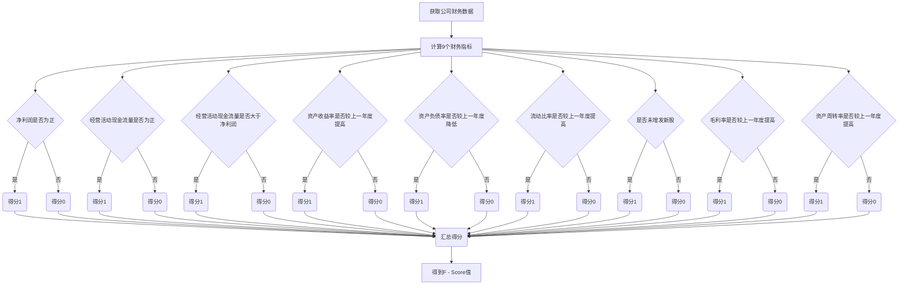

# 约瑟夫·皮奥特罗斯基的F-Score选股模型

> 关键词：F-Score选股模型、约瑟夫·皮奥特罗斯基、财务指标、选股策略、财务分析、股票投资、量化投资

> 摘要：本文深入探讨了约瑟夫·皮奥特罗斯基的F-Score选股模型。该模型通过9个财务指标对公司进行综合评估，旨在筛选出具有投资价值的股票。文章从模型的背景介绍出发，详细阐述了核心概念与联系、核心算法原理及具体操作步骤，运用数学模型和公式进行了深入讲解并举例说明。同时，通过项目实战展示了模型的代码实现与解读，分析了其实际应用场景。此外，还推荐了相关的学习资源、开发工具框架以及论文著作。最后，对F-Score选股模型的未来发展趋势与挑战进行了总结，并提供了常见问题解答和扩展阅读参考资料，帮助读者全面深入地了解和运用这一模型。

## 1. 背景介绍 
### 1.1 目的和范围
在股票投资领域，投资者面临着众多的股票选择，如何筛选出具有潜力和投资价值的股票是一个关键问题。约瑟夫·皮奥特罗斯基的F-Score选股模型旨在为投资者提供一种基于公司财务基本面的选股方法。该模型的范围主要聚焦于利用公司的财务报表数据，通过一系列财务指标的评估来判断公司的财务健康状况和盈利能力，从而筛选出可能在未来表现良好的股票。其目的在于帮助投资者在众多股票中找到被低估且具有成长潜力的优质股票，提高投资决策的准确性和成功率。

### 1.2 预期读者
本文的预期读者主要包括以下几类人群：
- **股票投资者**：无论是个人投资者还是专业的投资机构，都可以通过了解F-Score选股模型，更好地进行股票筛选和投资决策，提高投资收益。
- **金融分析师**：对于从事金融分析工作的人员来说，F-Score选股模型可以作为一种有效的分析工具，辅助他们对公司进行财务评估和投资评级。
- **量化投资从业者**：该模型的量化特性使其适合量化投资从业者进行进一步的研究和优化，应用于量化投资策略的开发中。
- **对金融和投资领域感兴趣的学习者**：对于想要深入了解股票投资和财务分析的学习者来说，F-Score选股模型是一个很好的学习案例，可以帮助他们掌握财务分析的基本方法和思路。

### 1.3 文档结构概述
本文将按照以下结构进行详细阐述：
- **核心概念与联系**：介绍F-Score选股模型的核心概念、原理和架构，通过文本示意图和Mermaid流程图进行直观展示。
- **核心算法原理 & 具体操作步骤**：详细讲解F-Score选股模型的核心算法原理，并使用Python源代码阐述具体的操作步骤。
- **数学模型和公式 & 详细讲解 & 举例说明**：给出F-Score选股模型的数学模型和公式，进行详细讲解，并通过实际例子进行说明。
- **项目实战：代码实际案例和详细解释说明**：展示F-Score选股模型的项目实战，包括开发环境搭建、源代码详细实现和代码解读。
- **实际应用场景**：分析F-Score选股模型在实际股票投资中的应用场景。
- **工具和资源推荐**：推荐与F-Score选股模型相关的学习资源、开发工具框架和论文著作。
- **总结：未来发展趋势与挑战**：总结F-Score选股模型的未来发展趋势和面临的挑战。
- **附录：常见问题与解答**：提供关于F-Score选股模型的常见问题解答。
- **扩展阅读 & 参考资料**：列出相关的扩展阅读资料和参考文献。

### 1.4 术语表
#### 1.4.1 核心术语定义
- **F-Score选股模型**：由约瑟夫·皮奥特罗斯基提出的一种基于公司财务基本面的选股模型，通过9个财务指标对公司进行评分，得分越高表明公司的财务状况越好，越具有投资价值。
- **财务指标**：用于衡量公司财务状况和经营业绩的各种数据，如净利润、净资产收益率、资产负债率等。
- **选股策略**：投资者根据一定的原则和方法，从众多股票中筛选出具有投资价值的股票的策略。
- **财务报表**：公司定期公布的反映其财务状况和经营成果的文件，主要包括资产负债表、利润表和现金流量表。

#### 1.4.2 相关概念解释
- **财务分析**：通过对公司财务报表数据的分析，评估公司的财务状况、经营业绩和发展前景的过程。
- **价值投资**：一种投资理念，强调通过分析公司的基本面，寻找被低估的股票进行投资，以获取长期的投资回报。
- **量化投资**：利用数学模型和计算机技术，对大量的金融数据进行分析和处理，制定投资策略的投资方法。

#### 1.4.3 缩略词列表
- **ROA**：Return on Assets，资产收益率，反映公司利用资产获取利润的能力。
- **ROE**：Return on Equity，净资产收益率，反映股东权益的收益水平。
- **CFO**：Cash Flow from Operations，经营活动现金流量，反映公司经营活动产生现金的能力。

## 2. 核心概念与联系 

### 核心概念原理
F-Score选股模型的核心原理是基于公司的财务基本面，通过9个财务指标对公司进行综合评估。这9个财务指标分别从公司的盈利能力、财务杠杆和流动性、运营效率等方面进行考量。每个指标根据其表现赋予0或1的分数，最后将9个指标的分数相加得到F-Score值。F-Score值越高，说明公司的财务状况越好，越具有投资价值。

### 架构的文本示意图
F-Score选股模型的架构可以用以下文本示意图表示：

| 指标类别 | 具体指标 | 评分标准 |
| ---- | ---- | ---- |
| 盈利能力 | 净利润为正 | 是：1；否：0 |
|  | 经营活动现金流量为正 | 是：1；否：0 |
|  | 经营活动现金流量大于净利润 | 是：1；否：0 |
|  | 资产收益率较上一年度提高 | 是：1；否：0 |
| 财务杠杆和流动性 | 资产负债率较上一年度降低 | 是：1；否：0 |
|  | 流动比率较上一年度提高 | 是：1；否：0 |
|  | 未增发新股 | 是：1；否：0 |
| 运营效率 | 毛利率较上一年度提高 | 是：1；否：0 |
|  | 资产周转率较上一年度提高 | 是：1；否：0 |

### Mermaid流程图


## 3. 核心算法原理 & 具体操作步骤 

### 核心算法原理
F-Score选股模型的核心算法就是根据9个财务指标的表现对公司进行评分，然后将9个指标的分数相加得到F-Score值。具体的评分标准如下：

| 指标 | 得分条件 | 得分 |
| ---- | ---- | ---- |
| 净利润为正 | 净利润 > 0 | 1 |
|  | 净利润 <= 0 | 0 |
| 经营活动现金流量为正 | 经营活动现金流量 > 0 | 1 |
|  | 经营活动现金流量 <= 0 | 0 |
| 经营活动现金流量大于净利润 | 经营活动现金流量 > 净利润 | 1 |
|  | 经营活动现金流量 <= 净利润 | 0 |
| 资产收益率较上一年度提高 | 本年度资产收益率 > 上一年度资产收益率 | 1 |
|  | 本年度资产收益率 <= 上一年度资产收益率 | 0 |
| 资产负债率较上一年度降低 | 本年度资产负债率 < 上一年度资产负债率 | 1 |
|  | 本年度资产负债率 >= 上一年度资产负债率 | 0 |
| 流动比率较上一年度提高 | 本年度流动比率 > 上一年度流动比率 | 1 |
|  | 本年度流动比率 <= 上一年度流动比率 | 0 |
| 未增发新股 | 无增发新股情况 | 1 |
|  | 有增发新股情况 | 0 |
| 毛利率较上一年度提高 | 本年度毛利率 > 上一年度毛利率 | 1 |
|  | 本年度毛利率 <= 上一年度毛利率 | 0 |
| 资产周转率较上一年度提高 | 本年度资产周转率 > 上一年度资产周转率 | 1 |
|  | 本年度资产周转率 <= 上一年度资产周转率 | 0 |

### 具体操作步骤及Python源代码
以下是使用Python实现F-Score选股模型的具体操作步骤和代码：

```python
import pandas as pd

def calculate_f_score(financial_data):
    """
    计算F-Score值
    :param financial_data: 包含公司财务数据的DataFrame，需要包含以下列：
        'net_income', 'operating_cash_flow', 'total_assets', 'total_liabilities', 
        'current_assets', 'current_liabilities', 'shares_outstanding', 'gross_profit', 
        'revenue', 以及上一年度对应的列（列名加上'_last_year'）
    :return: F-Score值
    """
    # 初始化F-Score值
    f_score = 0

    # 1. 净利润为正
    if financial_data['net_income'] > 0:
        f_score += 1

    # 2. 经营活动现金流量为正
    if financial_data['operating_cash_flow'] > 0:
        f_score += 1

    # 3. 经营活动现金流量大于净利润
    if financial_data['operating_cash_flow'] > financial_data['net_income']:
        f_score += 1

    # 4. 资产收益率较上一年度提高
    roa = financial_data['net_income'] / financial_data['total_assets']
    roa_last_year = financial_data['net_income_last_year'] / financial_data['total_assets_last_year']
    if roa > roa_last_year:
        f_score += 1

    # 5. 资产负债率较上一年度降低
    debt_ratio = financial_data['total_liabilities'] / financial_data['total_assets']
    debt_ratio_last_year = financial_data['total_liabilities_last_year'] / financial_data['total_assets_last_year']
    if debt_ratio < debt_ratio_last_year:
        f_score += 1

    # 6. 流动比率较上一年度提高
    current_ratio = financial_data['current_assets'] / financial_data['current_liabilities']
    current_ratio_last_year = financial_data['current_assets_last_year'] / financial_data['current_liabilities_last_year']
    if current_ratio > current_ratio_last_year:
        f_score += 1

    # 7. 未增发新股
    if financial_data['shares_outstanding'] == financial_data['shares_outstanding_last_year']:
        f_score += 1

    # 8. 毛利率较上一年度提高
    gross_margin = financial_data['gross_profit'] / financial_data['revenue']
    gross_margin_last_year = financial_data['gross_profit_last_year'] / financial_data['revenue_last_year']
    if gross_margin > gross_margin_last_year:
        f_score += 1

    # 9. 资产周转率较上一年度提高
    asset_turnover = financial_data['revenue'] / financial_data['total_assets']
    asset_turnover_last_year = financial_data['revenue_last_year'] / financial_data['total_assets_last_year']
    if asset_turnover > asset_turnover_last_year:
        f_score += 1

    return f_score

# 示例数据
financial_data = pd.DataFrame({
    'net_income': [1000],
    'operating_cash_flow': [1200],
    'total_assets': [5000],
    'total_liabilities': [2000],
    'current_assets': [3000],
    'current_liabilities': [1500],
    'shares_outstanding': [1000],
    'gross_profit': [1500],
    'revenue': [3000],
    'net_income_last_year': [800],
    'total_assets_last_year': [4500],
    'total_liabilities_last_year': [2200],
    'current_assets_last_year': [2800],
    'current_liabilities_last_year': [1600],
    'shares_outstanding_last_year': [1000],
    'gross_profit_last_year': [1300],
    'revenue_last_year': [2800]
})

# 计算F-Score值
f_score = calculate_f_score(financial_data.iloc[0])
print(f"F-Score值: {f_score}")
```

### 代码解释
1. **函数定义**：`calculate_f_score` 函数接受一个包含公司财务数据的DataFrame作为输入，返回该公司的F-Score值。
2. **初始化F-Score值**：将F-Score值初始化为0。
3. **依次计算9个指标的得分**：根据每个指标的评分标准，判断该指标是否满足得分条件，如果满足则F-Score值加1。
4. **返回F-Score值**：最后返回计算得到的F-Score值。

## 4. 数学模型和公式 & 详细讲解 & 举例说明 

### 数学模型和公式
F-Score选股模型的数学模型可以表示为：

$$F - Score=\sum_{i = 1}^{9}S_i$$

其中，$S_i$ 表示第 $i$ 个财务指标的得分，取值为0或1。

### 详细讲解
- **净利润为正**：净利润是公司经营活动的最终成果，净利润为正表示公司在该年度实现了盈利，具有一定的盈利能力。计算公式为：

$$S_1=\begin{cases}1, & \text{净利润}>0 \\ 0, & \text{净利润}\leq0\end{cases}$$

- **经营活动现金流量为正**：经营活动现金流量反映了公司经营活动产生现金的能力，经营活动现金流量为正表示公司的经营活动能够产生现金流入，具有良好的现金流动性。计算公式为：

$$S_2=\begin{cases}1, & \text{经营活动现金流量}>0 \\ 0, & \text{经营活动现金流量}\leq0\end{cases}$$

- **经营活动现金流量大于净利润**：当经营活动现金流量大于净利润时，说明公司的盈利质量较高，净利润有相应的现金流入作为支撑。计算公式为：

$$S_3=\begin{cases}1, & \text{经营活动现金流量}>\text{净利润} \\ 0, & \text{经营活动现金流量}\leq\text{净利润}\end{cases}$$

- **资产收益率较上一年度提高**：资产收益率（ROA）反映了公司利用资产获取利润的能力，资产收益率较上一年度提高说明公司的盈利能力在增强。计算公式为：

$$ROA=\frac{\text{净利润}}{\text{总资产}}$$

$$S_4=\begin{cases}1, & ROA_{\text{本年度}}>ROA_{\text{上一年度}} \\ 0, & ROA_{\text{本年度}}\leq ROA_{\text{上一年度}}\end{cases}$$

- **资产负债率较上一年度降低**：资产负债率反映了公司的负债水平和财务风险，资产负债率较上一年度降低说明公司的财务风险在降低。计算公式为：

$$\text{资产负债率}=\frac{\text{总负债}}{\text{总资产}}$$

$$S_5=\begin{cases}1, & \text{资产负债率}_{\text{本年度}}<\text{资产负债率}_{\text{上一年度}} \\ 0, & \text{资产负债率