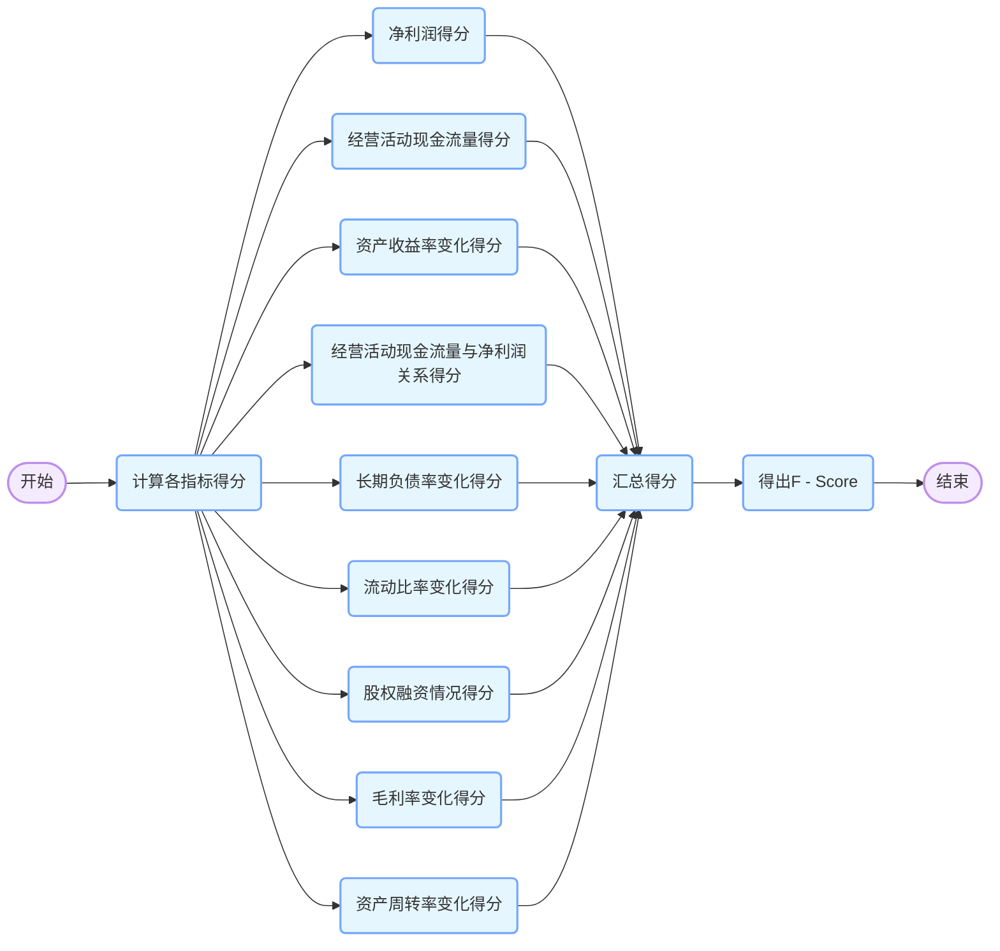

# 约瑟夫·皮奥特罗斯基的基本面量化价值投资：F-Score应用

> 关键词：约瑟夫·皮奥特罗斯基、基本面量化价值投资、F-Score、财务分析、投资策略

> 摘要：本文深入探讨了约瑟夫·皮奥特罗斯基提出的F-Score在基本面量化价值投资中的应用。首先介绍了相关背景知识，包括目的范围、预期读者等。接着阐述了F-Score的核心概念、算法原理及具体操作步骤，通过Python代码进行详细说明。同时给出了其数学模型和公式，并举例解释。在项目实战部分，进行了开发环境搭建、源代码实现与解读。还分析了F-Score在实际投资中的应用场景，推荐了相关学习资源、开发工具和论文著作。最后总结了其未来发展趋势与挑战，并对常见问题进行了解答。

## 1. 背景介绍 
### 1.1 目的和范围
本文章的主要目的是全面介绍约瑟夫·皮奥特罗斯基的F-Score在基本面量化价值投资领域的应用。我们将深入探讨F-Score的理论基础、计算方法、实际应用场景以及在实际投资中可能面临的挑战。范围涵盖了从F-Score的基本概念到具体的Python代码实现，以及如何在实际投资项目中运用F-Score进行股票筛选和投资决策。通过详细的讲解和案例分析，帮助读者理解F-Score的原理和实践价值，为投资者和量化研究人员提供有价值的参考。

### 1.2 预期读者
本文的预期读者包括对量化投资、基本面分析感兴趣的投资者，金融行业的从业者如分析师、基金经理等，以及从事金融科技、量化研究的专业人士和相关专业的学生。无论你是初涉投资领域，想要了解基本面量化投资的基本方法，还是已经有一定的投资经验，希望进一步优化投资策略，本文都将为你提供有深度的见解和实用的知识。

### 1.3 文档结构概述
本文将按照以下结构进行组织：首先介绍F-Score的背景知识，包括相关术语和概念。然后详细阐述F-Score的核心概念、算法原理和具体操作步骤，并通过Python代码进行实现。接着给出F-Score的数学模型和公式，并举例说明其应用。在项目实战部分，将介绍开发环境的搭建、源代码的详细实现和解读。之后分析F-Score在实际投资中的应用场景，推荐相关的学习资源、开发工具和论文著作。最后总结F-Score的未来发展趋势与挑战，解答常见问题，并提供扩展阅读和参考资料。

### 1.4 术语表
#### 1.4.1 核心术语定义
- **基本面量化价值投资**：结合公司基本面信息（如财务报表数据）和量化分析方法，寻找被市场低估的股票，以获取长期投资收益的投资策略。
- **F-Score**：由约瑟夫·皮奥特罗斯基提出的一种用于评估公司财务健康状况和盈利能力的综合评分系统，通过对多个财务指标进行打分，得分越高表示公司的基本面越好。
- **财务指标**：反映公司财务状况和经营成果的各种数据，如净利润、净资产收益率、资产负债率等。

#### 1.4.2 相关概念解释
- **价值投资**：一种投资理念，认为股票价格会围绕其内在价值波动，投资者应寻找价格低于内在价值的股票进行投资。
- **量化分析**：运用数学和统计学方法对金融数据进行分析和建模，以辅助投资决策。
- **股票筛选**：根据一定的标准和条件，从众多股票中筛选出符合要求的股票，作为投资组合的候选对象。

#### 1.4.3 缩略词列表
- **ROA**：Return on Assets，资产收益率，衡量公司运用全部资产获取利润的能力。
- **ROE**：Return on Equity，净资产收益率，反映股东权益的收益水平。
- **CFO**：Cash Flow from Operations，经营活动现金流量，指公司经营活动产生的现金流入和流出的净额。

## 2. 核心概念与联系 

### 核心概念原理
F-Score是一种基于公司财务报表数据的综合评分系统，旨在评估公司的财务健康状况和盈利能力。皮奥特罗斯基通过研究发现，一些简单的财务指标可以反映公司的基本面情况，通过对这些指标进行打分并汇总，可以得到一个综合评分，即F-Score。F-Score的取值范围为0 - 9分，得分越高表示公司的基本面越好，投资价值越高。

具体来说，F-Score由以下9个指标组成，每个指标根据一定的条件进行打分，满足条件得1分，不满足条件得0分：
1. **盈利能力指标**
    - **净利润（Net Income）**：公司当年的净利润为正，得1分；否则得0分。净利润是公司经营成果的重要体现，正的净利润表示公司在该年度实现了盈利。
    - **经营活动现金流量（CFO）**：公司当年的经营活动现金流量为正，得1分；否则得0分。经营活动现金流量反映了公司经营活动产生现金的能力，正的现金流表示公司的经营活动具有较好的现金生成能力。
    - **资产收益率（ROA）变化**：公司当年的资产收益率较上一年度有所提高，得1分；否则得0分。资产收益率衡量了公司运用全部资产获取利润的能力，ROA的提高表示公司的资产利用效率在提升。
    - **经营活动现金流量与净利润的关系**：公司当年的经营活动现金流量大于净利润，得1分；否则得0分。这一指标反映了公司净利润的质量，经营活动现金流量大于净利润表示公司的净利润具有较好的现金支撑。
2. **杠杆、流动性和资金来源指标**
    - **长期负债率变化**：公司当年的长期负债率较上一年度有所下降，得1分；否则得0分。长期负债率反映了公司的长期偿债能力，负债率的下降表示公司的财务风险在降低。
    - **流动比率变化**：公司当年的流动比率较上一年度有所提高，得1分；否则得0分。流动比率衡量了公司的短期偿债能力，流动比率的提高表示公司的短期偿债能力在增强。
    - **股权融资情况**：公司在当年没有进行股权融资，得1分；否则得0分。股权融资可能会稀释股东权益，没有进行股权融资表示公司不需要通过股权融资来满足资金需求，可能意味着公司的财务状况较好。
3. **运营效率指标**
    - **毛利率变化**：公司当年的毛利率较上一年度有所提高，得1分；否则得0分。毛利率反映了公司产品或服务的盈利能力，毛利率的提高表示公司的产品或服务在市场上具有更强的竞争力。
    - **资产周转率变化**：公司当年的资产周转率较上一年度有所提高，得1分；否则得0分。资产周转率衡量了公司资产的运营效率，资产周转率的提高表示公司的资产运营效率在提升。

### 架构的文本示意图
```plaintext
F-Score
|-- 盈利能力指标
|   |-- 净利润（Net Income）
|   |-- 经营活动现金流量（CFO）
|   |-- 资产收益率（ROA）变化
|   |-- 经营活动现金流量与净利润的关系
|-- 杠杆、流动性和资金来源指标
|   |-- 长期负债率变化
|   |-- 流动比率变化
|   |-- 股权融资情况
|-- 运营效率指标
|   |-- 毛利率变化
|   |-- 资产周转率变化
```

### Mermaid流程图


## 3. 核心算法原理 & 具体操作步骤 

### 算法原理
F-Score的核心算法原理是对上述9个财务指标进行逐一评估和打分，然后将各指标的得分相加，得到最终的F-Score。具体步骤如下：
1. **数据收集**：收集公司的财务报表数据，包括利润表、资产负债表和现金流量表，获取所需的财务指标数据，如净利润、经营活动现金流量、资产总额、负债总额等。
2. **指标计算**：根据收集到的数据，计算各财务指标的值，如资产收益率（ROA）、毛利率、资产周转率等，并与上一年度的数据进行比较，确定指标的变化情况。
3. **指标打分**：根据每个指标的条件，对各指标进行打分，满足条件得1分，不满足条件得0分。
4. **得分汇总**：将各指标的得分相加，得到最终的F-Score。

### 具体操作步骤及Python源代码实现
以下是使用Python实现F-Score计算的详细代码：

```python
import pandas as pd

def calculate_f_score(financial_data):
    """
    计算F-Score
    :param financial_data: 包含财务数据的DataFrame，索引为年份，列包含所需的财务指标
    :return: F-Score
    """
    # 初始化得分
    f_score = 0

    # 盈利能力指标
    # 净利润为正
    if financial_data['Net Income'].iloc[-1] > 0:
        f_score += 1
    # 经营活动现金流量为正
    if financial_data['CFO'].iloc[-1] > 0:
        f_score += 1
    # 资产收益率变化
    roa_current = financial_data['Net Income'].iloc[-1] / financial_data['Total Assets'].iloc[-1]
    roa_previous = financial_data['Net Income'].iloc[-2] / financial_data['Total Assets'].iloc[-2]
    if roa_current > roa_previous:
        f_score += 1
    # 经营活动现金流量大于净利润
    if financial_data['CFO'].iloc[-1] > financial_data['Net Income'].iloc[-1]:
        f_score += 1

    # 杠杆、流动性和资金来源指标
    # 长期负债率变化
    long_term_debt_ratio_current = financial_data['Long - Term Debt'].iloc[-1] / financial_data['Total Assets'].iloc[-1]
    long_term_debt_ratio_previous = financial_data['Long - Term Debt'].iloc[-2] / financial_data['Total Assets'].iloc[-2]
    if long_term_debt_ratio_current < long_term_debt_ratio_previous:
        f_score += 1
    # 流动比率变化
    current_ratio_current = financial_data['Current Assets'].iloc[-1] / financial_data['Current Liabilities'].iloc[-1]
    current_ratio_previous = financial_data['Current Assets'].iloc[-2] / financial_data['Current Liabilities'].iloc[-2]
    if current_ratio_current > current_ratio_previous:
        f_score += 1
    # 股权融资情况
    if financial_data['Equity Issuance'].iloc[-1] == 0:
        f_score += 1

    # 运营效率指标
    # 毛利率变化
    gross_margin_current = (financial_data['Revenue'].iloc[-1] - financial_data['Cost of Goods Sold'].iloc[-1]) / financial_data['Revenue'].iloc[-1]
    gross_margin_previous = (financial_data['Revenue'].iloc[-2] - financial_data['Cost of Goods Sold'].iloc[-2]) / financial_data['Revenue'].iloc[-2]
    if gross_margin_current > gross_margin_previous:
        f_score += 1
    # 资产周转率变化
    asset_turnover_current = financial_data['Revenue'].iloc[-1] / financial_data['Total Assets'].iloc[-1]
    asset_turnover_previous = financial_data['Revenue'].iloc[-2] / financial_data['Total Assets'].iloc[-2]
    if asset_turnover_current > asset_turnover_previous:
        f_score += 1

    return f_score

# 示例财务数据
data = {
    'Net Income': [100, 120],
    'CFO': [110, 130],
    'Total Assets': [1000, 1100],
    'Long - Term Debt': [200, 180],
    'Current Assets': [300, 320],
    'Current Liabilities': [200, 190],
    'Equity Issuance': [0, 0],
    'Revenue': [500, 550],
    'Cost of Goods Sold': [300, 320]
}
financial_data = pd.DataFrame(data, index=[2022, 2023])

# 计算F-Score
f_score = calculate_f_score(financial_data)
print(f"F-Score: {f_score}")
```

### 代码解释
1. **数据结构**：使用`pandas`的`DataFrame`来存储财务数据，索引为年份，列包含所需的财务指标。
2. **盈利能力指标计算**：
    - 净利润为正：直接判断当前年份的净利润是否大于0。
    - 经营活动现金流量为正：判断当前年份的经营活动现金流量是否大于0。
    - 资产收益率变化：计算当前年份和上一年份的资产收益率，并比较大小。
    - 经营活动现金流量大于净利润：比较当前年份的经营活动现金流量和净利润的大小。
3. **杠杆、流动性和资金来源指标计算**：
    - 长期负债率变化：计算当前年份和上一年份的长期负债率，并比较大小。
    - 流动比率变化：计算当前年份和上一年份的流动比率，并比较大小。
    - 股权融资情况：判断当前年份的股权融资是否为0。
4. **运营效率指标计算**：
    - 毛利率变化：计算当前年份和上一年份的毛利率，并比较大小。
    - 资产周转率变化：计算当前年份和上一年份的资产周转率，并比较大小。
5. **得分汇总**：将各指标的得分相加，得到最终的F-Score。

## 4. 数学模型和公式 & 详细讲解 & 举例说明 

### 数学模型和公式
#### 1. 资产收益率（ROA）
$$ROA = \frac{Net\ Income}{Total\ Assets}$$
其中，$Net\ Income$ 表示净利润，$Total\ Assets$ 表示资产总额。

#### 2. 长期负债率
$$Long - Term\ Debt\ Ratio = \frac{Long - Term\ Debt}{Total\ Assets}$$
其中，$Long - Term\ Debt$ 表示长期负债，$Total\ Assets$ 表示资产总额。

#### 3. 流动比率
$$Current\ Ratio = \frac{Current\ Assets}{Current\ Liabilities}$$
其中，$Current\ Assets$ 表示流动资产，$Current\ Liabilities$ 表示流动负债。

#### 4. 毛利率
$$Gross\ Margin = \frac{Revenue - Cost\ of\ Goods\ Sold}{Revenue}$$
其中，$Revenue$ 表示营业收入，$Cost\ of\ Goods\ Sold$ 表示营业成本。

#### 5. 资产周转率
$$Asset\ Turnover = \frac{Revenue}{Total\ Assets}$$
其中，$Revenue$ 表示营业收入，$Total\ Assets$ 表示资产总额。

### 详细讲解
- **资产收益率（ROA）**：ROA反映了公司运用全部资产获取利润的能力。ROA越高，说明公司资产的利用效率越高，盈利能力越强。在F-Score中，比较当前年份和上一年份的ROA，如果ROA提高，则表示公司的盈利能力在增强，得1分。
- **长期负债率**：长期负债率衡量了公司的长期偿债能力。负债率越低，说明公司的财务风险越小。在F-Score中，比较当前年份和上一年份的长期负债率，如果负债率下降，则表示公司的财务风险在降低，得1分。
- **流动比率**：流动比率反映了公司的短期偿债能力。流动比率越高，说明公司的短期偿债能力越强。在F-Score中，比较当前年份和上一年份的流动比率，如果流动比率提高，则表示公司的短期偿债能力在增强，得1分。
- **毛利率**：毛利率体现了公司产品或服务的盈利能力。毛利率越高，说明公司在产品或服务定价、成本控制等方面具有优势。在F-Score中，比较当前年份和上一年份的毛利率，如果毛利率提高，则表示公司的产品或服务竞争力在提升，得1分。
- **资产周转率**：资产周转率衡量了公司资产的运营效率。资产周转率越高，说明公司资产的运营效率越高。在F-Score中，比较当前年份和上一年份的资产周转率，如果资产周转率提高，则表示公司的资产运营效率在提升，得1分。

### 举例说明
假设某公司的财务数据如下：

| 年份 | 净利润（万元） | 经营活动现金流量（万元） | 资产总额（万元） | 长期负债（万元） | 流动资产（万元） | 流动负债（万元） | 营业收入（万元） | 营业成本（万元） | 股权融资（万元） |
| ---- | ---- | ---- | ---- | ---- | ---- | ---- | ---- | ---- | ---- |
| 2022 | 100 | 110 | 1000 | 200 | 300 | 200 | 500 | 300 | 0 |
| 2023 | 120 | 130 | 1100 | 180 | 320 | 190 | 550 | 320 | 0 |

#### 1. 盈利能力指标
- **净利润**：2023年净利润为120万元，大于0，得1分。
- **经营活动现金流量**：2023年经营活动现金流量为130万元，大于0，得1分。
- **资产收益率（ROA）变化**：
    - 2022年ROA = $\frac{100}{1000} = 0.1$
    - 2023年ROA = $\frac{120}{1100} \approx 0.109$
    - 2023年ROA大于2022年ROA，得1分。
- **经营活动现金流量与净利润的关系**：2023年经营活动现金流量130万元大于净利润120万元，得1分。

#### 2. 杠杆、流动性和资金来源指标
- **长期负债率变化**：
    - 2022年长负债率 = $\frac{200}{1000} = 0.2$
    - 2023年长负债率 = $\frac{180}{1100} \approx 0.164$
    - 2023年长负债率小于2022年长负债率，得1分。
- **流动比率变化**：
    - 2022年流动比率 = $\frac{300}{200} = 1.5$
    - 2023年流动比率 = $\frac{320}{190} \approx 1.684$
    - 2023年流动比率大于2022年流动比率，得1分。
- **股权融资情况**：2023年股权融资为0万元，得1分。

#### 3. 运营效率指标
- **毛利率变化**：
    - 2022年毛利率 = $\frac{500 - 300}{500} = 0.4$
    - 2023年毛利率 = $\frac{550 - 320}{550} \approx 0.418$
    - 2023年毛利率大于2022年毛利率，得1分。
- **资产周转率变化**：
    - 2022年资产周转率 = $\frac{500}{1000} = 0.5$
    - 2023年资产周转率 = $\frac{550}{1100} = 0.5$
    - 2023年资产周转率等于2022年资产周转率，得0分。

#### 4. F-Score计算
将各指标得分相加，$F - Score = 1 + 1 + 1 + 1 + 1 + 1 + 1 + 1 + 0 = 8$分。

## 5. 项目实战：代码实际案例和详细解释说明 

### 5.1  开发环境搭建
#### 1. Python环境安装
首先需要安装Python环境，建议使用Python 3.7及以上版本。可以从Python官方网站（https://www.python.org/downloads/）下载适合你操作系统的安装包，按照安装向导进行安装。

#### 2. 依赖库安装
使用`pip`工具安装所需的依赖库，主要包括`pandas`和`numpy`。打开命令行终端，执行以下命令：
```sh
pip install pandas numpy
```

#### 3. 开发工具选择
可以选择使用集成开发环境（IDE）如PyCharm，或者轻量级编辑器如VS Code。这些工具都提供了良好的代码编辑、调试和运行环境。

### 5.2  源代码详细实现和代码解读
以下是一个完整的项目实战代码示例，用于批量计算多只股票的F-Score：

```python
import pandas as pd

def calculate_f_score(financial_data):
    """
    计算F-Score
    :param financial_data: 包含财务数据的DataFrame，索引为年份，列包含所需的财务指标
    :return: F-Score
    """
    # 初始化得分
    f_score = 0

    # 盈利能力指标
    # 净利润为正
    if financial_data['Net Income'].iloc[-1] > 0:
        f_score += 1
    # 经营活动现金流量为正
    if financial_data['CFO'].iloc[-1] > 0:
        f_score += 1
    # 资产收益率变化
    roa_current = financial_data['Net Income'].iloc[-1] / financial_data['Total Assets'].iloc[-1]
    roa_previous = financial_data['Net Income'].iloc[-2] / financial_data['Total Assets'].iloc[-2]
    if roa_current > roa_previous:
        f_score += 1
    # 经营活动现金流量大于净利润
    if financial_data['CFO'].iloc[-1] > financial_data['Net Income'].iloc[-1]:
        f_score += 1

    # 杠杆、流动性和资金来源指标
    # 长期负债率变化
    long_term_debt_ratio_current = financial_data['Long - Term Debt'].iloc[-1] / financial_data['Total Assets'].iloc[-1]
    long_term_debt_ratio_previous = financial_data['Long - Term Debt'].iloc[-2] / financial_data['Total Assets'].iloc[-2]
    if long_term_debt_ratio_current < long_term_debt_ratio_previous:
        f_score += 1
    # 流动比率变化
    current_ratio_current = financial_data['Current Assets'].iloc[-1] / financial_data['Current Liabilities'].iloc[-1]
    current_ratio_previous = financial_data['Current Assets'].iloc[-2] / financial_data['Current Liabilities'].iloc[-2]
    if current_ratio_current > current_ratio_previous:
        f_score += 1
    # 股权融资情况
    if financial_data['Equity Issuance'].iloc[-1] == 0:
        f_score += 1

    # 运营效率指标
    # 毛利率变化
    gross_margin_current = (financial_data['Revenue'].iloc[-1] - financial_data['Cost of Goods Sold'].iloc[-1]) / financial_data['Revenue'].iloc[-1]
    gross_margin_previous = (financial_data['Revenue'].iloc[-2] - financial_data['Cost of Goods Sold'].iloc[-2]) / financial_data['Revenue'].iloc[-2]
    if gross_margin_current > gross_margin_previous:
        f_score += 1
    # 资产周转率变化
    asset_turnover_current = financial_data['Revenue'].iloc[-1] / financial_data['Total Assets'].iloc[-1]
    asset_turnover_previous = financial_data['Revenue'].iloc[-2] / financial_data['Total Assets'].iloc[-2]
    if asset_turnover_current > asset_turnover_previous:
        f_score += 1

    return f_score

def calculate_f_scores_for_multiple_stocks(stocks_data):
    """
    计算多只股票的F-Score
    :param stocks_data: 包含多只股票财务数据的字典，键为股票代码，值为财务数据DataFrame
    :return: 包含每只股票F-Score的字典
    """
    f_scores = {}
    for stock_code, financial_data in stocks_data.items():
        f_score = calculate_f_score(financial_data)
        f_scores[stock_code] = f_score
    return f_scores

# 示例多只股票财务数据
stock_1_data = {
    'Net Income': [100, 120],
    'CFO': [110, 130],
    'Total Assets': [1000, 1100],
    'Long - Term Debt': [200, 180],
    'Current Assets': [300, 320],
    'Current Liabilities': [200, 190],
    'Equity Issuance': [0, 0],
    'Revenue': [500, 550],
    'Cost of Goods Sold': [300, 320]
}
stock_2_data = {
    'Net Income': [80, 90],
    'CFO': [90, 100],
    'Total Assets': [900, 950],
    'Long - Term Debt': [180, 170],
    'Current Assets': [280, 300],
    'Current Liabilities': [190, 180],
    'Equity Issuance': [0, 0],
    'Revenue': [450, 480],
    'Cost of Goods Sold': [280, 300]
}

stocks_data = {
    '000001': pd.DataFrame(stock_1_data, index=[2022, 2023]),
    '000002': pd.DataFrame(stock_2_data, index=[2022, 2023])
}

# 计算多只股票的F-Score
f_scores = calculate_f_scores_for_multiple_stocks(stocks_data)
print("各股票的F-Score:")
for stock_code, f_score in f_scores.items():
    print(f"股票代码: {stock_code}, F-Score: {f_score}")
```

### 代码解读
1. **`calculate_f_score`函数**：该函数用于计算单只股票的F-Score，接受一个包含财务数据的`DataFrame`作为输入，按照F-Score的计算规则对各指标进行打分并汇总，返回最终的F-Score。
2. **`calculate_f_scores_for_multiple_stocks`函数**：该函数用于计算多只股票的F-Score，接受一个包含多只股票财务数据的字典作为输入，字典的键为股票代码，值为财务数据`DataFrame`。遍历字典，调用`calculate_f_score`函数计算每只股票的F-Score，并将结果存储在一个新的字典中返回。
3. **示例数据**：定义了两只股票的财务数据，分别存储在`stock_1_data`和`stock_2_data`字典中，然后将其转换为`DataFrame`并存储在`stocks_data`字典中。
4. **计算F-Score**：调用`calculate_f_scores_for_multiple_stocks`函数计算多只股票的F-Score，并打印结果。

### 5.3  代码解读与分析
#### 优点
- **模块化设计**：代码采用了模块化设计，将F-Score的计算逻辑封装在`calculate_f_score`函数中，便于复用和维护。
- **易于扩展**：可以方便地扩展代码，例如添加更多的财务指标或修改打分规则，只需在`calculate_f_score`函数中进行相应的修改即可。
- **支持多只股票计算**：通过`calculate_f_scores_for_multiple_stocks`函数，可以批量计算多只股票的F-Score，提高了计算效率。

#### 局限性
- **数据质量依赖**：代码的计算结果高度依赖于输入的财务数据的质量，如果数据存在错误或缺失，可能会导致计算结果不准确。
- **缺乏异常处理**：代码中没有对可能出现的异常情况进行处理，例如数据格式错误、除数为零等，在实际应用中需要添加相应的异常处理代码。
- **简单假设**：F-Score的计算基于一些简单的假设，可能无法完全反映公司的真实财务状况和投资价值，需要结合其他分析方法进行综合判断。

## 6. 实际应用场景 
### 股票筛选
F-Score可以作为一种有效的股票筛选工具，帮助投资者从众多股票中筛选出基本面较好的股票。投资者可以设定一个F-Score阈值，例如F-Score大于等于7分，将满足条件的股票纳入投资组合的候选池。通过这种方式，可以提高投资组合的质量，降低投资风险。

### 投资组合优化
在构建投资组合时，F-Score可以作为一个重要的参考指标。投资者可以根据F-Score对股票进行排序，优先选择F-Score较高的股票，并根据其得分情况分配不同的权重。这样可以使投资组合更加偏向于基本面较好的股票，提高投资组合的收益潜力。

### 价值投资策略
F-Score与价值投资理念相契合，适合用于价值投资策略。价值投资者通常寻找被市场低估的股票，而F-Score较高的股票往往具有较好的财务状况和盈利能力，可能是被市场低估的优质股票。投资者可以结合F-Score和其他估值指标，如市盈率、市净率等，选择具有投资价值的股票进行长期投资。

### 风险控制
F-Score可以帮助投资者识别财务状况较差的股票，从而避免投资这些高风险股票。对于F-Score较低的股票，投资者应谨慎对待，进一步分析其财务报表和经营状况，评估其投资风险。通过排除高风险股票，可以降低投资组合的整体风险。

## 7. 工具和资源推荐
### 7.1 学习资源推荐
#### 7.1.1 书籍推荐
- 《聪明的投资者》（The Intelligent Investor）：本杰明·格雷厄姆著，价值投资领域的经典著作，介绍了价值投资的基本理念和方法，对理解F-Score的应用有很大帮助。
- 《财务报表分析与证券定价》（Financial Statement Analysis and Security Valuation）：斯蒂芬·佩因曼著，详细介绍了财务报表分析的方法和技术，以及如何运用财务数据进行证券定价，是学习基本面分析的重要参考书籍。
- 《量化投资：策略与技术》：丁鹏著，全面介绍了量化投资的基本概念、策略和技术，包括基本面量化投资的方法和应用，对学习F-Score在量化投资中的应用有很大的启发。

#### 7.1.2 在线课程
- Coursera上的“Financial Markets”：耶鲁大学教授罗伯特·席勒讲授的金融市场课程，介绍了金融市场的基本原理和投资策略，对理解价值投资和基本面分析有很大帮助。
- edX上的“Introduction to Financial Accounting”：麻省理工学院开设的财务会计入门课程，系统介绍了财务会计的基本概念和方法，是学习财务报表分析的基础课程。
- 中国大学MOOC上的“量化投资与金融科技”：上海财经大学教授讲授的量化投资课程，介绍了量化投资的基本理论和实践方法，包括基本面量化投资的应用案例。

#### 7.1.3 技术博客和网站
- Seeking Alpha：提供全球金融市场的分析和评论，包括股票分析、投资策略等内容，有很多关于基本面分析和价值投资的文章。
- Alpha Architect：专注于量化投资和因子投资的博客，分享了很多关于基本面量化投资的研究成果和实践经验。
- 雪球网：国内知名的投资社区，有很多投资者分享自己的投资经验和研究成果，包括对F-Score的应用和讨论。

### 7.2 开发工具框架推荐
#### 7.2.1 IDE和编辑器
- PyCharm：专业的Python集成开发环境，提供了丰富的代码编辑、调试和运行功能，适合开发Python量化投资项目。
- VS Code：轻量级的代码编辑器，支持多种编程语言和插件扩展，具有良好的代码编辑体验和开发效率。
- Jupyter Notebook：交互式的编程环境，适合进行数据探索和分析，以及编写和运行Python代码。

#### 7.2.2 调试和性能分析工具
- PDB：Python自带的调试器，可以帮助开发者定位和解决代码中的问题。
- cProfile：Python的性能分析工具，可以分析代码的运行时间和函数调用情况，帮助开发者优化代码性能。
- Py-Spy：一个轻量级的Python性能分析工具，可以实时监控Python程序的运行状态和性能指标。

#### 7.2.3 相关框架和库
- Pandas：强大的数据处理和分析库，提供了高效的数据结构和数据操作方法，适合处理和分析财务数据。
- Numpy：Python的数值计算库，提供了高效的数组和矩阵运算功能，是很多科学计算和数据分析库的基础。
- Scikit-learn：机器学习库，提供了丰富的机器学习算法和工具，可用于构建和评估量化投资模型。

### 7.3 相关论文著作推荐
#### 7.3.1 经典论文
- Piotroski, J. D. (2000). Value investing: The use of historical financial statement information to separate winners from losers. The Journal of Finance, 55(3), 1319-1361. 约瑟夫·皮奥特罗斯基的经典论文，详细介绍了F-Score的理论和实证研究结果。
- Fama, E. F., & French, K. R. (1992). The cross-section of expected stock returns. The Journal of Finance, 47(2), 427-465. 法玛和弗兰奇的经典论文，提出了著名的Fama-French三因子模型，对理解股票收益率的影响因素有重要意义。

#### 7.3.2 最新研究成果
- Novy-Marx, R. (2013). The other side of value: The gross profitability premium. The Journal of Financial Economics, 108(1), 1-28. 该论文提出了基于毛利率的盈利能力因子，对F-Score中的毛利率指标有进一步的研究和应用。
- Asness, C. S., Frazzini, A., & Pedersen, L. H. (2019). Quality minus junk. The Journal of Financial Economics, 131(2), 349-378. 该论文提出了“质量减垃圾”（Quality Minus Junk）因子，综合考虑了公司的盈利能力、增长能力、安全性等多个方面，与F-Score的理念有一定的相似性。

#### 7.3.3 应用案例分析
- Green, J., Hand, J. R. M., & Zhang, X. (2017). The informational efficiency of the accruals anomaly: Evidence from short interest. The Accounting Review, 92(2), 141-167. 该论文分析了应计项目异常现象的信息效率，并通过案例研究探讨了如何运用财务指标进行投资决策，对F-Score的应用有一定的参考价值。
- Bartov, E., & Kim, M. (2004). Accruals, cash flows, and equity values. The Accounting Review, 79(1), 163-184. 该论文研究了应计项目、现金流量与股权价值之间的关系，通过案例分析展示了如何运用财务数据进行股权估值，对F-Score在价值投资中的应用有一定的启示。

## 8. 总结：未来发展趋势与挑战
### 未来发展趋势
#### 与其他量化因子的融合
F-Score作为一种基本面量化因子，未来可能会与其他量化因子（如动量因子、市值因子等）进行融合，构建更加复杂和有效的量化投资策略。通过综合考虑多个因子的信息，可以提高投资策略的收益和稳定性。

#### 机器学习和深度学习的应用
随着机器学习和深度学习技术的发展，F-Score的计算和应用可能会引入这些先进技术。例如，可以使用机器学习算法对财务数据进行特征提取和建模，优化F-Score的计算方法，提高其预测能力。

#### 国际化应用
F-Score的应用目前主要集中在欧美市场，未来有望在全球范围内得到更广泛的应用。随着全球金融市场的一体化和信息的流通，投资者可以利用F-Score对不同国家和地区的股票进行评估和筛选，拓展投资机会。

### 挑战
#### 数据质量和时效性
F-Score的计算高度依赖于财务数据的质量和时效性。财务数据可能存在错误、遗漏或延迟披露的情况，这会影响F-Score的计算结果和投资决策的准确性。因此，如何获取高质量、及时的财务数据是一个重要的挑战。

#### 市场环境变化
市场环境是不断变化的，F-Score所基于的财务指标和假设可能在不同的市场环境下不再适用。例如，在经济衰退时期，一些传统的财务指标可能无法准确反映公司的真实财务状况和盈利能力。因此，需要不断调整和优化F-Score的计算方法和应用策略，以适应市场环境的变化。

#### 竞争加剧
随着量化投资的普及和发展，越来越多的投资者和机构开始运用F-Score等量化因子进行投资决策，市场竞争日益激烈。这可能导致F-Score的有效性下降，投资者需要不断创新和改进投资策略，以获取超额收益。

## 9. 附录：常见问题与解答
### 1. F-Score越高，股票的投资价值就一定越高吗？
F-Score越高，说明公司的基本面越好，但并不意味着股票的投资价值就一定越高。F-Score只是一个参考指标，不能作为投资决策的唯一依据。在实际投资中，还需要考虑其他因素，如市场估值、行业前景、宏观经济环境等。

### 2. F-Score的计算需要哪些财务数据？
F-Score的计算需要以下财务数据：净利润、经营活动现金流量、资产总额、长期负债、流动资产、流动负债、营业收入、营业成本和股权融资。这些数据可以从公司的财务报表（利润表、资产负债表和现金流量表）中获取。

### 3. F-Score可以用于所有行业的股票吗？
F-Score可以用于大多数行业的股票，但不同行业的财务特征和经营模式可能存在差异，因此在应用F-Score时需要进行适当的调整和分析。例如，对于一些新兴行业或高科技行业，传统的财务指标可能无法完全反映公司的真实价值，需要结合其他指标进行综合评估。

### 4. F-Score的计算频率是多少？
F-Score的计算频率可以根据投资者的需求和数据的可得性来确定。一般来说，可以按年度或季度计算F-Score，以反映公司财务状况的变化。

### 5. F-Score与其他量化因子有什么关系？
F-Score是一种基本面量化因子，与其他量化因子（如动量因子、市值因子等）可以相互补充。投资者可以将F-Score与其他量化因子结合使用，构建更加复杂和有效的量化投资策略。

## 10. 扩展阅读 & 参考资料
### 扩展阅读
- 《投资中最简单的事》：邱国鹭著，介绍了价值投资的基本理念和方法，以及如何在投资中避免常见的错误。
- 《金融炼金术》：乔治·索罗斯著，阐述了索罗斯的投资哲学和反射理论，对理解金融市场的运行机制和投资决策有很大的启发。
- 《漫步华尔街》：伯顿·马尔基尔著，介绍了各种投资理论和策略，包括基本面分析、技术分析和量化投资等，是一本适合投资者的入门读物。

### 参考资料
- Piotroski, J. D. (2000). Value investing: The use of historical financial statement information to separate winners from losers. The Journal of Finance, 55(3), 1319-1361.
- Fama, E. F., & French, K. R. (1992). The cross-section of expected stock returns. The Journal of Finance, 47(2), 427-465.
- Novy-Marx, R. (2013). The other side of value: The gross profitability premium. The Journal of Financial Economics, 108(1), 1-28.
- Asness, C. S., Frazzini, A., & Pedersen, L. H. (2019). Quality minus junk. The Journal of Financial Economics, 131(2), 349-378.

作者：AI天才研究院/AI Genius Institute & 禅与计算机程序设计艺术 /Zen And The Art of Computer Programming