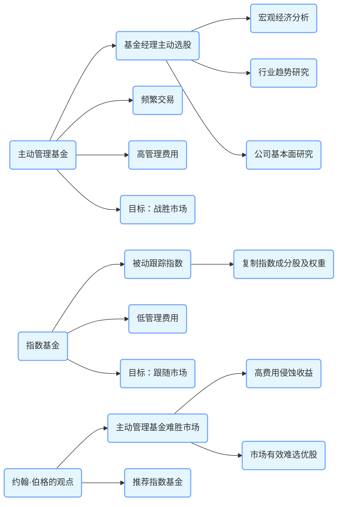

# 约翰·伯格对主动管理基金的批评

> 关键词：约翰·伯格、主动管理基金、批评、指数基金、投资理念

> 摘要：本文围绕约翰·伯格对主动管理基金的批评展开，深入探讨了主动管理基金的相关概念及运作机制，详细剖析了约翰·伯格提出批评的核心观点、背后的原理以及涉及的数学模型。通过实际案例展示了主动管理基金面临的问题，阐述了这些批评在现实投资场景中的体现。同时提供了学习主动管理基金和指数基金的工具和资源，最后总结了主动管理基金未来的发展趋势与挑战，并对常见问题进行了解答。

## 1. 背景介绍 
### 1.1 目的和范围
本部分旨在全面深入地介绍约翰·伯格对主动管理基金的批评。通过对相关概念、批评观点、原理、实际案例等多方面的探讨，让读者清晰了解主动管理基金的特点、存在的问题以及约翰·伯格批评的重要意义。不仅会详细阐述批评的具体内容，还会分析其背后的原因和影响，范围涵盖理论层面的分析以及实际应用场景的解读。

### 1.2 预期读者
本文预期读者包括对投资领域感兴趣的普通投资者，他们希望通过了解专业人士对主动管理基金的看法，优化自己的投资决策；金融专业的学生和研究人员，有助于他们深入研究投资理论和市场现象；以及金融行业的从业者，为他们在实际业务中提供参考和思考。

### 1.3 文档结构概述
本文首先介绍背景信息，让读者对主题有初步了解。接着阐述核心概念，包括主动管理基金和约翰·伯格倡导的指数基金的原理和联系。然后详细讲解约翰·伯格批评主动管理基金的核心算法原理和具体操作步骤，通过数学模型和公式进行深入分析。之后通过项目实战案例，展示批评观点在实际中的体现。再介绍主动管理基金的实际应用场景，为读者提供更直观的认识。随后推荐学习和研究相关内容的工具和资源。最后总结主动管理基金的未来发展趋势与挑战，解答常见问题并提供扩展阅读和参考资料。

### 1.4 术语表
#### 1.4.1 核心术语定义
- **主动管理基金**：是一种由基金经理通过积极的研究、分析和决策，试图挑选出表现优于市场平均水平的证券组合的基金。基金经理会根据自己的判断进行股票、债券等资产的买卖操作，以实现超越市场基准的回报。
- **指数基金**：是一种按照特定指数的成分股组成及其权重进行投资的基金，旨在复制该指数的表现。它不依赖基金经理的主动选股，而是被动地跟踪市场指数，通常具有较低的管理费用。
- **市场有效性**：指市场价格能够充分反映所有可用信息的程度。在有效市场中，证券价格已经包含了所有公开和非公开的信息，因此很难通过主动管理来持续获得超额收益。

#### 1.4.2 相关概念解释
- **基金管理费**：是基金管理人为管理和运作基金资产而向基金收取的费用。主动管理基金通常由于需要更多的研究和决策工作，其管理费相对较高；而指数基金由于是被动跟踪指数，管理费较低。
- **跟踪误差**：指指数基金的收益率与所跟踪指数收益率之间的偏差。跟踪误差越小，说明指数基金对指数的复制效果越好。

#### 1.4.3 缩略词列表
- **ETF**：交易型开放式指数基金（Exchange Traded Fund），是一种在交易所上市交易的、基金份额可变的开放式指数基金。
- **CAPM**：资本资产定价模型（Capital Asset Pricing Model），用于描述资产预期收益率与风险之间的关系。

## 2. 核心概念与联系 

### 主动管理基金原理
主动管理基金的核心在于基金经理的专业能力和决策。基金经理通过对宏观经济、行业趋势、公司基本面等多方面的研究和分析，挑选出他们认为具有投资价值的证券，并根据市场变化及时调整投资组合。其目标是战胜市场基准，为投资者带来超额收益。

### 指数基金原理
指数基金则是基于市场有效性的假设。它不试图超越市场，而是通过购买指数所包含的全部或部分证券，以达到与指数相同的表现。由于不需要进行大量的研究和主动决策，指数基金的管理成本相对较低。

### 约翰·伯格的核心观点
约翰·伯格认为，主动管理基金在长期内很难战胜市场。主要原因包括高昂的管理费用、频繁的交易成本以及市场的有效性使得很难持续挑选出表现优异的证券。他大力倡导投资者选择低成本的指数基金，认为这是一种更可靠的长期投资方式。

### 文本示意图
```plaintext
主动管理基金
|-- 基金经理主动选股
|   |-- 宏观经济分析
|   |-- 行业趋势研究
|   |-- 公司基本面研究
|-- 频繁交易
|-- 高管理费用
|-- 目标：战胜市场

指数基金
|-- 被动跟踪指数
|   |-- 复制指数成分股及权重
|-- 低管理费用
|-- 目标：跟随市场

约翰·伯格的观点
|-- 主动管理基金难胜市场
|   |-- 高费用侵蚀收益
|   |-- 市场有效难选优股
|-- 推荐指数基金
```

### Mermaid 流程图


## 3. 核心算法原理 & 具体操作步骤 

### 主动管理基金的收益计算原理
主动管理基金的收益主要由两部分组成：证券价格变动带来的资本利得和股息、利息等收入。假设基金在期初投资了 $n$ 种证券，第 $i$ 种证券的投资金额为 $w_i$，初始价格为 $P_{i0}$，期末价格为 $P_{i1}$，期间获得的股息或利息为 $D_i$。则基金的总收益 $R$ 可以通过以下公式计算：

```python
def active_fund_return(w, P0, P1, D):
    """
    计算主动管理基金的总收益
    :param w: 每种证券的投资金额列表
    :param P0: 每种证券的初始价格列表
    :param P1: 每种证券的期末价格列表
    :param D: 每种证券的股息或利息列表
    :return: 基金的总收益
    """
    total_investment = sum(w)
    returns = []
    for i in range(len(w)):
        # 计算每种证券的收益
        security_return = w[i] * ((P1[i] - P0[i] + D[i]) / P0[i])
        returns.append(security_return)
    total_return = sum(returns)
    return total_return / total_investment

# 示例数据
w = [1000, 2000, 3000]  # 投资金额
P0 = [10, 20, 30]  # 初始价格
P1 = [12, 22, 33]  # 期末价格
D = [0.5, 1, 1.5]  # 股息或利息

fund_return = active_fund_return(w, P0, P1, D)
print(f"主动管理基金的总收益: {fund_return * 100:.2f}%")
```

### 指数基金的收益计算原理
指数基金的收益主要取决于所跟踪指数的表现。假设指数基金完全复制指数，指数在期初的点位为 $I_0$，期末的点位为 $I_1$，则指数基金的收益率 $R_{index}$ 可以通过以下公式计算：

```python
def index_fund_return(I0, I1):
    """
    计算指数基金的收益率
    :param I0: 指数期初点位
    :param I1: 指数期末点位
    :return: 指数基金的收益率
    """
    return (I1 - I0) / I0

# 示例数据
I0 = 1000
I1 = 1050

index_return = index_fund_return(I0, I1)
print(f"指数基金的收益率: {index_return * 100:.2f}%")
```

### 考虑费用后的收益比较
主动管理基金通常有较高的管理费用，假设管理费用率为 $f_{active}$，则考虑费用后的主动管理基金实际收益率 $R_{active\_actual}$ 为：

```python
def active_fund_return_after_fee(R, f_active):
    """
    计算考虑费用后的主动管理基金实际收益率
    :param R: 未考虑费用的主动管理基金收益率
    :param f_active: 主动管理基金的管理费用率
    :return: 考虑费用后的实际收益率
    """
    return R - f_active

# 假设主动管理基金管理费用率为 1%
f_active = 0.01
active_return_after_fee = active_fund_return_after_fee(fund_return, f_active)
print(f"考虑费用后主动管理基金的实际收益率: {active_return_after_fee * 100:.2f}%")

# 指数基金管理费用率通常较低，假设为 0.1%
f_index = 0.001
index_return_after_fee = index_fund_return(I0, I1) - f_index
print(f"考虑费用后指数基金的实际收益率: {index_return_after_fee * 100:.2f}%")
```

通过以上计算可以看出，即使主动管理基金在未考虑费用时可能有较高的收益率，但扣除高额的管理费用后，实际收益率可能会低于指数基金。

## 4. 数学模型和公式 & 详细讲解 & 举例说明 

### 资本资产定价模型（CAPM）
资本资产定价模型用于描述资产预期收益率与风险之间的关系。其公式为：

$$E(R_i) = R_f + \beta_i [E(R_m) - R_f]$$

其中：
- $E(R_i)$ 是资产 $i$ 的预期收益率
- $R_f$ 是无风险利率，通常可以用国债收益率来近似表示
- $\beta_i$ 是资产 $i$ 的系统性风险系数，衡量资产 $i$ 的收益率对市场收益率变动的敏感性
- $E(R_m)$ 是市场组合的预期收益率

#### 详细讲解
CAPM 模型的核心思想是，资产的预期收益率由两部分组成：无风险收益和风险溢价。无风险收益是投资者在没有任何风险的情况下可以获得的收益，而风险溢价则是投资者承担系统性风险所获得的额外补偿。$\beta$ 值越大，说明资产的系统性风险越高，投资者要求的风险溢价也就越高。

#### 举例说明
假设无风险利率 $R_f = 3\%$，市场组合的预期收益率 $E(R_m) = 10\%$，某只股票的 $\beta$ 值为 1.2。则该股票的预期收益率为：

$$E(R_i) = 0.03 + 1.2\times(0.1 - 0.03) = 0.114 = 11.4\%$$

### 主动管理基金的夏普比率
夏普比率用于衡量基金在承担单位风险时所能获得的超过无风险收益的额外收益。其公式为：

$$SharpeRatio = \frac{R_p - R_f}{\sigma_p}$$

其中：
- $R_p$ 是基金的平均收益率
- $R_f$ 是无风险利率
- $\sigma_p$ 是基金收益率的标准差，衡量基金的风险

#### 详细讲解
夏普比率越高，说明基金在承担相同风险的情况下能够获得更高的收益，或者在获得相同收益的情况下承担的风险更低。它是评估基金绩效的一个重要指标。

#### 举例说明
假设某主动管理基金的平均收益率 $R_p = 15\%$，无风险利率 $R_f = 3\%$，基金收益率的标准差 $\sigma_p = 20\%$。则该基金的夏普比率为：

$$SharpeRatio = \frac{0.15 - 0.03}{0.2} = 0.6$$

### 指数基金的跟踪误差
跟踪误差用于衡量指数基金的收益率与所跟踪指数收益率之间的偏差。其计算公式为：

$$TrackingError = \sqrt{\frac{1}{n}\sum_{i = 1}^{n}(R_{index\_fund,i} - R_{index,i})^2}$$

其中：
- $R_{index\_fund,i}$ 是指数基金在第 $i$ 期的收益率
- $R_{index,i}$ 是所跟踪指数在第 $i$ 期的收益率
- $n$ 是观察期数

#### 详细讲解
跟踪误差反映了指数基金对指数的复制效果。跟踪误差越小，说明指数基金的表现越接近所跟踪的指数。

#### 举例说明
假设观察期为 5 期，指数基金和所跟踪指数的收益率如下表所示：

| 期数 | 指数基金收益率 | 指数收益率 |
|------|----------------|------------|
| 1    | 0.05           | 0.06       |
| 2    | 0.03           | 0.04       |
| 3    | 0.02           | 0.03       |
| 4    | 0.04           | 0.05       |
| 5    | 0.06           | 0.07       |

则跟踪误差为：

```python
import numpy as np

R_index_fund = [0.05, 0.03, 0.02, 0.04, 0.06]
R_index = [0.06, 0.04, 0.03, 0.05, 0.07]

tracking_error = np.sqrt(np.mean((np.array(R_index_fund) - np.array(R_index))**2))
print(f"指数基金的跟踪误差: {tracking_error * 100:.2f}%")
```

## 5. 项目实战：代码实际案例和详细解释说明 

### 5.1  开发环境搭建
为了实现本项目，我们可以使用 Python 进行开发。以下是搭建开发环境的步骤：

1. **安装 Python**：从 Python 官方网站（https://www.python.org/downloads/）下载并安装适合你操作系统的 Python 版本。建议安装 Python 3.7 及以上版本。
2. **安装必要的库**：本项目需要使用 `pandas`、`numpy` 等库。可以使用以下命令进行安装：
```sh
pip install pandas numpy
```

### 5.2  源代码详细实现和代码解读
以下是一个模拟主动管理基金和指数基金收益比较的代码示例：

```python
import pandas as pd
import numpy as np

# 模拟主动管理基金和指数基金的收益率数据
np.random.seed(0)
n_periods = 10  # 模拟的期数
active_returns = np.random.normal(loc=0.08, scale=0.15, size=n_periods)  # 主动管理基金的收益率
index_returns = np.random.normal(loc=0.06, scale=0.1, size=n_periods)  # 指数基金的收益率

# 假设主动管理基金的管理费用率为 1%，指数基金的管理费用率为 0.1%
active_fee = 0.01
index_fee = 0.001

# 计算考虑费用后的收益率
active_returns_after_fee = active_returns - active_fee
index_returns_after_fee = index_returns - index_fee

# 计算累计收益率
active_cumulative_returns = (1 + active_returns_after_fee).cumprod() - 1
index_cumulative_returns = (1 + index_returns_after_fee).cumprod() - 1

# 输出结果
print("主动管理基金的累计收益率:")
print(active_cumulative_returns)
print("指数基金的累计收益率:")
print(index_cumulative_returns)

# 比较两种基金的最终收益
active_final_return = active_cumulative_returns[-1]
index_final_return = index_cumulative_returns[-1]

if active_final_return > index_final_return:
    print("主动管理基金的最终收益更高。")
else:
    print("指数基金的最终收益更高。")
```

### 代码解读与分析
1. **数据模拟**：使用 `numpy` 的 `random.normal` 函数模拟主动管理基金和指数基金的收益率数据。主动管理基金的平均收益率假设为 8%，标准差为 15%；指数基金的平均收益率假设为 6%，标准差为 10%。
2. **费用计算**：分别定义主动管理基金和指数基金的管理费用率，并从模拟的收益率中扣除相应的费用，得到考虑费用后的收益率。
3. **累计收益率计算**：使用 `cumprod` 函数计算两种基金的累计收益率，即每个时期的收益率累乘。
4. **结果比较**：比较两种基金的最终累计收益率，输出收益更高的基金类型。

通过这个模拟案例可以看出，即使主动管理基金的平均收益率较高，但由于其较高的管理费用，最终的实际收益可能并不如指数基金。

## 6. 实际应用场景 
### 个人投资者
对于个人投资者来说，主动管理基金和指数基金各有优劣。主动管理基金适合那些相信基金经理的专业能力，愿意承担较高风险以追求超额收益的投资者。例如，一些有一定投资经验且对市场有自己判断的投资者，可能会选择投资一些知名基金经理管理的主动管理基金。而指数基金则更适合那些追求稳健收益、希望跟随市场走势的投资者。特别是对于那些没有太多时间和精力进行投资研究的普通投资者，指数基金是一种简单有效的投资方式。

### 机构投资者
机构投资者如养老金、保险公司等，通常会根据自身的投资目标和风险承受能力来选择投资组合。一些大型机构可能会同时配置主动管理基金和指数基金。主动管理基金可以用于追求超额收益，以满足机构的长期资金增值需求；而指数基金则可以作为一种低成本的资产配置工具，用于分散风险和保持与市场的基本同步。

### 市场环境影响
在不同的市场环境下，主动管理基金和指数基金的表现也会有所不同。在市场波动较大、行业轮动频繁的时期，主动管理基金的基金经理有更多机会通过灵活的资产配置和选股来获得超额收益。例如，在科技股快速上涨的时期，一些擅长科技行业研究的主动管理基金可能会表现出色。而在市场整体上涨、行业表现较为均衡的时期，指数基金由于能够全面跟踪市场，往往能够获得与市场相近的收益，且由于其低成本的优势，实际收益可能会更高。

## 7. 工具和资源推荐
### 7.1 学习资源推荐
#### 7.1.1 书籍推荐
- 《聪明的投资者》（The Intelligent Investor）：本杰明·格雷厄姆（Benjamin Graham）的经典著作，介绍了价值投资的理念和方法，对理解投资的本质有很大帮助。
- 《漫步华尔街》（A Random Walk Down Wall Street）：伯顿·马尔基尔（Burton Malkiel）所著，阐述了市场有效性和指数基金投资的优势。
- 《约翰·伯格的投资50堂课》（John Bogle on Investing: The First 50 Years）：深入介绍了约翰·伯格的投资理念和对主动管理基金的批评观点。

#### 7.1.2 在线课程
- Coursera 上的“投资学原理”（Principles of Investing）课程，由知名教授授课，系统介绍了投资的基本原理和方法。
- edX 上的“金融市场”（Financial Markets）课程，提供了对金融市场的全面理解，包括基金投资等内容。

#### 7.1.3 技术博客和网站
- 晨星网（Morningstar）：提供基金评级、分析和研究报告，帮助投资者了解基金的业绩和风险。
- 雪球网：是一个投资交流社区，投资者可以在上面分享经验、讨论投资策略。
- 且慢（Egg Money）：专注于基金投资，提供投资组合建议和策略分析。

### 7.2 开发工具框架推荐
#### 7.2.1 IDE和编辑器
- PyCharm：是一款专业的 Python 集成开发环境，具有强大的代码编辑、调试和项目管理功能。
- Jupyter Notebook：适合进行数据分析和代码演示，支持 Markdown 文本和代码的混合编写。

#### 7.2.2 调试和性能分析工具
- `pdb`：Python 自带的调试工具，可以帮助开发者逐行调试代码，查找问题。
- `cProfile`：用于分析 Python 代码的性能，找出性能瓶颈。

#### 7.2.3 相关框架和库
- `pandas`：是一个强大的数据分析库，提供了高效的数据结构和数据处理工具，适合处理基金收益率等数据。
- `numpy`：用于进行数值计算和数组操作，在金融数据处理中经常使用。
- `matplotlib`：用于绘制各种图表，如收益率曲线等，方便可视化分析。

### 7.3 相关论文著作推荐
#### 7.3.1 经典论文
- 《有效资本市场：理论与实证研究回顾》（Efficient Capital Markets: A Review of Theory and Empirical Work）：尤金·法玛（Eugene F. Fama）的经典论文，阐述了市场有效性的概念和理论，为指数基金的发展提供了理论基础。
- 《资产组合选择》（Portfolio Selection）：哈里·马科维茨（Harry Markowitz）的论文，提出了现代投资组合理论，对理解基金投资的风险分散有重要意义。

#### 7.3.2 最新研究成果
- 《主动管理基金的绩效持续性研究》（Research on the Performance Persistence of Actively Managed Funds）：探讨了主动管理基金的绩效是否具有持续性，以及影响绩效的因素。
- 《指数基金对市场效率的影响》（The Impact of Index Funds on Market Efficiency）：研究了指数基金的发展对市场效率的影响。

#### 7.3.3 应用案例分析
- 《某大型养老金基金的资产配置策略与实践》：分析了某大型养老金基金如何通过合理配置主动管理基金和指数基金来实现投资目标。
- 《指数基金在个人养老投资中的应用案例》：介绍了个人投资者如何利用指数基金进行养老投资规划。

## 8. 总结：未来发展趋势与挑战
### 未来发展趋势
- **指数基金持续增长**：随着投资者对成本和市场有效性的认识不断提高，指数基金有望继续保持增长态势。越来越多的投资者会选择低成本的指数基金作为长期投资工具，特别是在养老投资等领域。
- **主动管理基金的差异化发展**：主动管理基金将更加注重差异化竞争，一些具有独特投资策略和专业能力的基金经理可能会脱颖而出。例如，专注于特定行业、主题或采用量化投资策略的主动管理基金可能会受到投资者的关注。
- **科技与金融的融合**：科技的发展将为基金投资带来更多的创新。例如，利用人工智能和大数据技术进行投资分析和决策，提高主动管理基金的选股能力和风险管理水平；同时，也可以进一步优化指数基金的跟踪效果。

### 挑战
- **市场竞争加剧**：指数基金的快速发展将给主动管理基金带来更大的竞争压力。主动管理基金需要不断提高自身的业绩和服务水平，以吸引投资者。
- **投资者教育不足**：虽然指数基金的优势逐渐被更多人认识，但仍有很多投资者对基金投资的基本概念和风险缺乏了解。加强投资者教育，提高投资者的投资素养是当前面临的重要挑战。
- **监管要求提高**：随着基金行业的发展，监管部门对基金的合规性和风险管理要求将不断提高。基金公司需要加强内部管理，确保符合监管要求。

## 9. 附录：常见问题与解答
### 主动管理基金一定不能战胜市场吗？
不是的。虽然约翰·伯格认为主动管理基金在长期内很难战胜市场，但在某些特定时期和市场环境下，一些优秀的主动管理基金经理可能会通过准确的选股和资产配置获得超越市场的收益。然而，要持续战胜市场是非常困难的，因为市场是复杂多变的，而且主动管理基金的高费用也会侵蚀一部分收益。

### 指数基金有哪些风险？
指数基金主要面临市场风险，即所跟踪指数的下跌会导致基金净值下降。此外，还有跟踪误差风险，即指数基金的收益率可能与所跟踪指数的收益率存在一定偏差。另外，如果指数成分股发生重大变化，也可能会对指数基金的表现产生影响。

### 如何选择主动管理基金和指数基金？
选择主动管理基金还是指数基金需要考虑多个因素。如果投资者相信基金经理的专业能力，愿意承担较高风险以追求超额收益，且有足够的时间和精力进行基金研究和筛选，那么可以选择主动管理基金。如果投资者追求稳健收益、希望跟随市场走势，且希望降低投资成本，那么指数基金是更好的选择。同时，投资者也可以根据自己的投资目标、风险承受能力和投资期限等因素进行综合考虑，合理配置主动管理基金和指数基金。

## 10. 扩展阅读 & 参考资料
- [1] John C. Bogle. "Common Sense on Mutual Funds: New Imperatives for the Intelligent Investor". Wiley, 2009.
- [2] Eugene F. Fama. "Efficient Capital Markets: A Review of Theory and Empirical Work". The Journal of Finance, 1970.
- [3] Harry Markowitz. "Portfolio Selection". The Journal of Finance, 1952.
- [4] Morningstar. "Morningstar Investment Research Center". https://www.morningstar.com/
- [5] 雪球网. "雪球 - 聪明的投资者都在这里". https://xueqiu.com/
- [6] 且慢. "且慢 - 让投资更简单". https://qieman.com/

作者：AI天才研究院/AI Genius Institute & 禅与计算机程序设计艺术 /Zen And The Art of Computer Programming