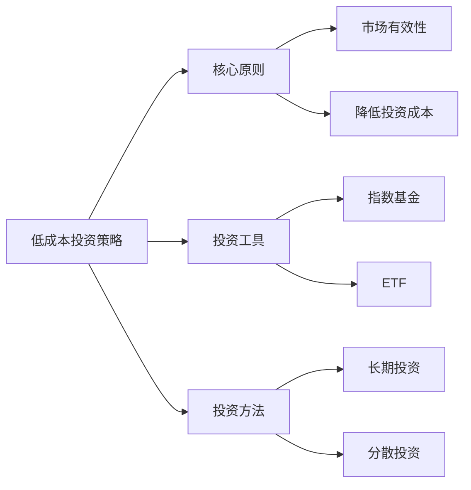

# 约翰·伯格的低成本投资策略

> 关键词：约翰·伯格、低成本投资策略、指数基金、投资成本、长期投资

> 摘要：本文深入探讨了约翰·伯格所倡导的低成本投资策略。从背景介绍出发，阐述该策略的目的、适用读者等内容。详细剖析核心概念，包括低成本投资的原理和架构。以Python代码示例讲解核心算法原理及操作步骤，结合数学模型和公式进行深入分析。通过项目实战展示实际应用，介绍开发环境搭建、代码实现与解读。探讨该策略在不同场景的实际应用，推荐相关学习资源、开发工具框架和论文著作。最后总结未来发展趋势与挑战，解答常见问题并提供扩展阅读与参考资料，旨在为投资者全面理解和运用低成本投资策略提供指导。

## 1. 背景介绍 
### 1.1 目的和范围
约翰·伯格是投资界的传奇人物，他所提出的低成本投资策略具有深远的影响。本文的目的在于全面深入地剖析这一策略，不仅阐述其基本概念和原理，还会通过代码示例、数学模型和实际案例进行详细说明。范围涵盖了该策略的理论基础、具体操作方法、实际应用场景以及相关的学习资源等方面，帮助投资者更好地理解和运用这一策略进行投资。

### 1.2 预期读者
本文预期读者主要包括对投资领域感兴趣的初学者，他们希望通过学习专业的投资策略来开启自己的投资之旅；也包括有一定投资经验但希望优化投资组合、降低成本的投资者；同时对于金融专业的学生和研究人员，本文也能为他们提供关于投资策略的深入研究资料。

### 1.3 文档结构概述
本文将按照以下结构展开：首先介绍核心概念与联系，明确低成本投资策略的核心要素和相互关系；接着讲解核心算法原理和具体操作步骤，通过Python代码进行详细说明；然后给出数学模型和公式，并举例进行详细讲解；之后通过项目实战展示该策略的实际应用，包括开发环境搭建、代码实现和解读；再探讨该策略的实际应用场景；推荐相关的工具和资源，如学习资源、开发工具框架和论文著作；最后总结未来发展趋势与挑战，解答常见问题并提供扩展阅读与参考资料。

### 1.4 术语表
#### 1.4.1 核心术语定义
- **低成本投资策略**：指通过降低投资过程中的各种成本，如交易成本、管理费用等，以提高投资回报的一种投资策略。该策略强调长期投资和分散投资，通常采用指数基金等低成本投资工具。
- **指数基金**：一种按照特定指数构成比例进行投资的基金，其目的是跟踪指数的表现，通常具有较低的管理费用和交易成本。
- **投资成本**：包括交易佣金、基金管理费用、印花税等在投资过程中产生的各种费用。

#### 1.4.2 相关概念解释
- **主动投资**：投资者通过自己的分析和判断，选择具体的投资标的，试图超越市场平均表现的投资方式。与低成本投资策略所倡导的被动投资相对。
- **被动投资**：主要通过跟踪市场指数进行投资，不进行主动的个股选择，以获取市场平均回报。低成本投资策略通常采用被动投资方式，因为其成本较低。

#### 1.4.3 缩略词列表
- **ETF**：交易型开放式指数基金（Exchange Traded Fund），是一种在交易所上市交易的、基金份额可变的开放式基金，通常用于跟踪特定指数，是低成本投资中常用的工具。

## 2. 核心概念与联系 

### 核心概念原理
约翰·伯格的低成本投资策略的核心原理基于两个重要观点。一是市场的有效性，即市场价格已经反映了所有可用的信息，很难通过主动投资持续战胜市场。因此，与其花费大量精力和成本进行主动选股和择时，不如采用被动投资的方式，跟踪市场指数，获取市场平均回报。二是投资成本对投资回报的影响巨大。即使是微小的成本差异，在长期投资中也会对最终的回报产生显著的影响。通过降低投资成本，可以提高实际获得的投资回报。

### 架构的文本示意图
```plaintext
低成本投资策略
|-- 核心原则
|   |-- 市场有效性
|   |-- 降低投资成本
|-- 投资工具
|   |-- 指数基金
|   |-- ETF
|-- 投资方法
|   |-- 长期投资
|   |-- 分散投资
```

### Mermaid 流程图


## 3. 核心算法原理 & 具体操作步骤 

### 核心算法原理
在低成本投资策略中，一个重要的算法原理是资产配置的优化。假设我们有多种资产可供选择，如不同类型的指数基金，我们的目标是在一定的风险水平下，通过合理分配资金到不同资产上，实现投资回报的最大化。这里可以使用现代投资组合理论中的均值 - 方差模型。

该模型的基本思想是，通过计算每种资产的预期收益率和风险（用方差或标准差表示），以及资产之间的相关性，来确定最优的资产配置比例。具体来说，我们要找到一组资产配置比例，使得投资组合的预期收益率最大化，同时风险最小化。

### 具体操作步骤
1. **确定投资目标和风险承受能力**：投资者需要明确自己的投资目标，如长期财富增值、养老储备等，并评估自己的风险承受能力。
2. **选择投资标的**：根据投资目标和风险承受能力，选择合适的指数基金或ETF作为投资标的。
3. **计算资产的预期收益率和风险**：通过历史数据或其他方法，计算每种投资标的的预期收益率和风险。
4. **计算资产之间的相关性**：分析不同投资标的之间的相关性，了解它们的波动情况是否相互关联。
5. **确定最优资产配置比例**：使用均值 - 方差模型，结合预期收益率、风险和相关性，计算出最优的资产配置比例。
6. **定期调整投资组合**：随着市场情况的变化和投资标的的表现，定期调整投资组合，保持资产配置的合理性。

### Python源代码详细阐述
```python
import numpy as np
import pandas as pd
from scipy.optimize import minimize

# 假设有三种指数基金，历史收益率数据
returns = pd.DataFrame({
    'Fund1': [0.05, 0.03, 0.06, 0.04, 0.07],
    'Fund2': [0.03, 0.02, 0.05, 0.03, 0.06],
    'Fund3': [0.04, 0.03, 0.06, 0.04, 0.07]
})

# 计算每种基金的预期收益率
expected_returns = returns.mean()

# 计算协方差矩阵
cov_matrix = returns.cov()

# 定义目标函数：最小化投资组合的风险
def portfolio_risk(weights, cov_matrix):
    return np.sqrt(np.dot(weights.T, np.dot(cov_matrix, weights)))

# 定义约束条件：权重之和为1
constraints = ({'type': 'eq', 'fun': lambda x: np.sum(x) - 1})

# 定义权重范围：每种资产的权重在0到1之间
bounds = [(0, 1) for _ in range(len(expected_returns))]

# 初始权重猜测
initial_weights = np.ones(len(expected_returns)) / len(expected_returns)

# 最小化风险，找到最优权重
result = minimize(portfolio_risk, initial_weights, args=(cov_matrix,), method='SLSQP', bounds=bounds, constraints=constraints)

# 最优权重
optimal_weights = result.x

print("最优资产配置比例：", optimal_weights)
```
在上述代码中，我们首先定义了三种指数基金的历史收益率数据，然后计算了每种基金的预期收益率和协方差矩阵。接着，我们定义了目标函数 `portfolio_risk` 用于计算投资组合的风险，以及约束条件和权重范围。最后，使用 `scipy.optimize.minimize` 函数来最小化风险，找到最优的资产配置比例。

## 4. 数学模型和公式 & 详细讲解 & 举例说明 

### 数学模型
均值 - 方差模型的数学表达式如下：

设投资组合中有 $n$ 种资产，第 $i$ 种资产的权重为 $w_i$，预期收益率为 $\mu_i$，投资组合的预期收益率为 $\mu_p$，则：

$$\mu_p = \sum_{i=1}^{n} w_i \mu_i$$

投资组合的风险（用方差表示）为 $\sigma_p^2$，协方差矩阵为 $\Sigma$，则：

$$\sigma_p^2 = \sum_{i=1}^{n} \sum_{j=1}^{n} w_i w_j \sigma_{ij} = w^T \Sigma w$$

其中，$\sigma_{ij}$ 是资产 $i$ 和资产 $j$ 之间的协方差，$w$ 是权重向量。

### 详细讲解
均值 - 方差模型的目标是在一定的预期收益率约束下，最小化投资组合的风险；或者在一定的风险约束下，最大化投资组合的预期收益率。在实际应用中，我们通常采用最小化风险的方法，即求解以下优化问题：

$$\min_{w} w^T \Sigma w$$

约束条件为：

$$\sum_{i=1}^{n} w_i = 1$$

$$w_i \geq 0, \quad i = 1, 2, \cdots, n$$

第一个约束条件保证了投资组合的权重之和为1，即所有资金都被分配到不同的资产上；第二个约束条件保证了每种资产的权重是非负的，即不允许卖空。

### 举例说明
假设我们有两种资产，资产A的预期收益率为 $\mu_A = 0.1$，风险（标准差）为 $\sigma_A = 0.2$；资产B的预期收益率为 $\mu_B = 0.08$，风险（标准差）为 $\sigma_B = 0.15$，两种资产之间的相关系数为 $\rho_{AB} = 0.5$。

首先，计算协方差矩阵：

$$\sigma_{AB} = \rho_{AB} \sigma_A \sigma_B = 0.5 \times 0.2 \times 0.15 = 0.015$$

协方差矩阵为：

$$\Sigma = \begin{bmatrix}
\sigma_A^2 & \sigma_{AB} \\
\sigma_{AB} & \sigma_B^2
\end{bmatrix} = \begin{bmatrix}
0.04 & 0.015 \\
0.015 & 0.0225
\end{bmatrix}$$

设资产A的权重为 $w_A$，资产B的权重为 $w_B = 1 - w_A$，则投资组合的预期收益率为：

$$\mu_p = w_A \mu_A + w_B \mu_B = w_A \times 0.1 + (1 - w_A) \times 0.08 = 0.08 + 0.02 w_A$$

投资组合的风险为：

$$\sigma_p^2 = w_A^2 \sigma_A^2 + w_B^2 \sigma_B^2 + 2 w_A w_B \sigma_{AB}$$

将 $w_B = 1 - w_A$ 代入上式，得到：

$$\sigma_p^2 = w_A^2 \times 0.04 + (1 - w_A)^2 \times 0.0225 + 2 w_A (1 - w_A) \times 0.015$$

通过求导或使用优化算法，可以找到在一定预期收益率下最小化风险的 $w_A$ 值，从而确定最优的资产配置比例。

## 5. 项目实战：代码实际案例和详细解释说明 

### 5.1  开发环境搭建
要实现低成本投资策略的项目实战，我们可以使用Python进行开发。以下是开发环境搭建的步骤：

1. **安装Python**：从Python官方网站（https://www.python.org/downloads/）下载并安装Python 3.x版本。
2. **安装必要的库**：使用 `pip` 命令安装所需的库，包括 `numpy`、`pandas`、`scipy` 等。
```bash
pip install numpy pandas scipy
```
3. **选择开发工具**：可以使用Jupyter Notebook、PyCharm等开发工具进行代码编写和调试。

### 5.2  源代码详细实现和代码解读
```python
import numpy as np
import pandas as pd
from scipy.optimize import minimize

# 读取历史收益率数据
data = pd.read_csv('historical_returns.csv')

# 提取收益率数据
returns = data.drop('Date', axis=1)

# 计算每种资产的预期收益率
expected_returns = returns.mean()

# 计算协方差矩阵
cov_matrix = returns.cov()

# 定义目标函数：最小化投资组合的风险
def portfolio_risk(weights, cov_matrix):
    return np.sqrt(np.dot(weights.T, np.dot(cov_matrix, weights)))

# 定义约束条件：权重之和为1
constraints = ({'type': 'eq', 'fun': lambda x: np.sum(x) - 1})

# 定义权重范围：每种资产的权重在0到1之间
bounds = [(0, 1) for _ in range(len(expected_returns))]

# 初始权重猜测
initial_weights = np.ones(len(expected_returns)) / len(expected_returns)

# 最小化风险，找到最优权重
result = minimize(portfolio_risk, initial_weights, args=(cov_matrix,), method='SLSQP', bounds=bounds, constraints=constraints)

# 最优权重
optimal_weights = result.x

# 输出最优资产配置比例
print("最优资产配置比例：", optimal_weights)

# 计算投资组合的预期收益率
portfolio_return = np.dot(expected_returns, optimal_weights)
print("投资组合的预期收益率：", portfolio_return)

# 计算投资组合的风险
portfolio_risk_value = portfolio_risk(optimal_weights, cov_matrix)
print("投资组合的风险：", portfolio_risk_value)
```
### 代码解读与分析
1. **数据读取**：使用 `pandas` 库的 `read_csv` 函数读取历史收益率数据，假设数据文件名为 `historical_returns.csv`，其中第一列是日期，其余列是不同资产的收益率。
2. **计算预期收益率和协方差矩阵**：通过 `mean` 函数计算每种资产的预期收益率，使用 `cov` 函数计算协方差矩阵。
3. **定义目标函数**：`portfolio_risk` 函数用于计算投资组合的风险，通过矩阵运算实现。
4. **定义约束条件和权重范围**：约束条件要求权重之和为1，权重范围限制每种资产的权重在0到1之间。
5. **初始权重猜测**：将初始权重设置为每种资产平均分配。
6. **最小化风险**：使用 `scipy.optimize.minimize` 函数，采用 `SLSQP` 方法来最小化投资组合的风险，找到最优的资产配置比例。
7. **计算投资组合的预期收益率和风险**：根据最优权重计算投资组合的预期收益率和风险，并输出结果。

## 6. 实际应用场景 
### 个人投资者的长期投资
对于个人投资者来说，约翰·伯格的低成本投资策略非常适合长期投资。例如，一个年轻人为了养老储备资金，可以选择投资一系列低成本的指数基金。通过长期持有，不仅可以降低投资成本，还能享受市场长期上涨带来的收益。而且，由于指数基金具有分散投资的特点，可以有效降低个别股票的风险。

### 机构投资者的资产配置
机构投资者，如养老金基金、保险公司等，通常管理着大量的资金。他们可以采用低成本投资策略进行资产配置，将一部分资金投资于指数基金，以获取市场平均回报，同时降低管理成本。这种策略可以帮助机构投资者在保证一定收益的前提下，提高资金的使用效率。

### 投资组合的优化
对于已经有一定投资组合的投资者来说，可以使用低成本投资策略来优化投资组合。通过分析现有投资组合的成本和风险，引入低成本的指数基金或ETF，调整资产配置比例，降低投资成本，提高投资组合的整体表现。

## 7. 工具和资源推荐
### 7.1 学习资源推荐
#### 7.1.1 书籍推荐
- 《共同基金常识》（*Common Sense on Mutual Funds*）：约翰·伯格的经典著作，详细阐述了低成本投资策略的理念和方法，对投资者具有很高的指导价值。
- 《漫步华尔街》（*A Random Walk Down Wall Street*）：该书介绍了有效市场假说和指数投资的优势，是投资领域的经典读物。

#### 7.1.2 在线课程
- Coursera上的“投资学原理”课程：由知名大学教授授课，系统介绍投资学的基本原理和方法，包括资产配置、风险管理等内容。
- edX上的“金融市场”课程：提供了金融市场的全面知识，对理解投资策略有很大帮助。

#### 7.1.3 技术博客和网站
- 雪球网：一个投资交流社区，投资者可以在这里分享投资经验、讨论投资策略。
- 晨星网：提供基金评级、分析和研究报告等信息，有助于投资者选择合适的基金。

### 7.2 开发工具框架推荐
#### 7.2.1 IDE和编辑器
- Jupyter Notebook：一个交互式的开发环境，适合数据分析和代码演示，方便投资者进行投资策略的研究和实践。
- PyCharm：一款专业的Python集成开发环境，具有强大的代码编辑、调试和分析功能。

#### 7.2.2 调试和性能分析工具
- `pdb`：Python自带的调试工具，可以帮助投资者调试代码，找出问题所在。
- `cProfile`：用于分析Python代码的性能，找出代码中的瓶颈，优化投资策略的实现。

#### 7.2.3 相关框架和库
- `numpy`：用于数值计算和矩阵运算，在投资组合优化中非常有用。
- `pandas`：用于数据处理和分析，方便投资者处理历史收益率数据。
- `scipy`：提供了优化算法和统计工具，可用于求解最优资产配置比例。

### 7.3 相关论文著作推荐
#### 7.3.1 经典论文
- Markowitz, H. M. (1952). *Portfolio Selection*. The Journal of Finance, 7(1), 77 - 91. 这篇论文提出了现代投资组合理论，是均值 - 方差模型的基础。
- Fama, E. F., & French, K. R. (1992). *The Cross - Section of Expected Stock Returns*. The Journal of Finance, 47(2), 427 - 465. 该论文提出了Fama - French三因子模型，对投资组合的风险和收益分析有重要影响。

#### 7.3.2 最新研究成果
- 关注《金融研究》《经济研究》等国内顶级金融学术期刊，以及《Journal of Financial Economics》《Review of Financial Studies》等国际知名金融学术期刊，了解低成本投资策略的最新研究动态。

#### 7.3.3 应用案例分析
- 可以查阅一些金融机构的研究报告，了解他们在实际投资中应用低成本投资策略的案例和经验。例如，一些大型基金公司会发布关于指数基金投资的研究报告和案例分析。

## 8. 总结：未来发展趋势与挑战
### 未来发展趋势
- **智能化投资**：随着人工智能和机器学习技术的发展，低成本投资策略可能会与智能化投资相结合。通过算法和模型，可以更精准地进行资产配置和风险控制，提高投资效率和回报。
- **全球化投资**：投资者越来越倾向于进行全球化投资，以分散风险和获取更多的投资机会。低成本的全球指数基金和ETF将有更广阔的发展空间。
- **社会责任投资**：投资者对社会责任的关注度不断提高，未来低成本投资策略可能会更多地考虑环境、社会和治理（ESG）因素，推出符合社会责任标准的指数基金。

### 挑战
- **市场波动**：尽管低成本投资策略强调长期投资，但市场的短期波动仍然可能对投资者的心理和投资组合产生影响。投资者需要具备足够的耐心和风险承受能力。
- **技术风险**：智能化投资依赖于先进的技术和算法，如果技术出现故障或算法存在缺陷，可能会导致投资决策失误。
- **监管政策变化**：金融市场的监管政策可能会发生变化，这可能会影响低成本投资策略的实施和相关投资工具的发展。

## 9. 附录：常见问题与解答
### 问题1：低成本投资策略一定能获得高回报吗？
解答：低成本投资策略不能保证一定能获得高回报。它的核心是通过降低成本来提高实际获得的回报，但投资回报仍然受到市场整体表现的影响。不过，从长期来看，由于成本的降低，该策略有可能获得更接近市场平均水平的回报。

### 问题2：如何选择合适的指数基金？
解答：选择指数基金时，可以考虑以下因素：基金的跟踪误差，跟踪误差越小，说明基金越能准确跟踪指数；管理费用，选择管理费用较低的基金；基金的规模，较大规模的基金通常具有更好的流动性和稳定性。

### 问题3：低成本投资策略适合短期投资吗？
解答：低成本投资策略更适合长期投资。因为该策略的优势在于通过长期持有来降低成本和分散风险，短期投资可能无法充分体现其优势，而且市场的短期波动可能会对投资结果产生较大影响。

## 10. 扩展阅读 & 参考资料
### 扩展阅读
- 《聪明的投资者》（*The Intelligent Investor*）：本杰明·格雷厄姆的经典著作，强调了价值投资和风险控制的重要性，对投资者有很大的启发。
- 《财务自由之路》（*Rich Dad Poor Dad*）：介绍了一些基本的财务知识和投资理念，帮助读者树立正确的投资观念。

### 参考资料
- 约翰·伯格的相关演讲和访谈资料，可以在网络上搜索获取。
- 金融机构发布的关于低成本投资策略的研究报告和市场分析。

作者：AI天才研究院/AI Genius Institute & 禅与计算机程序设计艺术 /Zen And The Art of Computer Programming