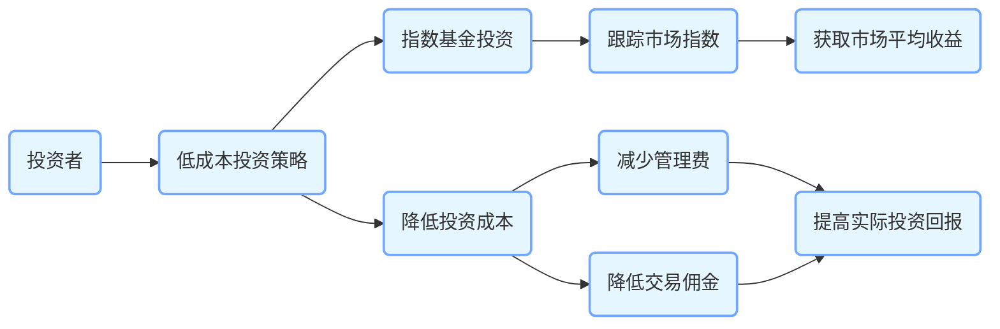

# 约翰·伯格的低成本投资策略

> 关键词：约翰·伯格、低成本投资策略、指数基金、投资成本、长期投资

> 摘要：本文深入探讨了约翰·伯格所倡导的低成本投资策略。从背景介绍入手，阐述该策略的目的、适用读者、文档结构及相关术语。详细讲解了低成本投资策略的核心概念、联系，包括其原理和架构，并通过Mermaid流程图呈现。对核心算法原理进行剖析，结合Python代码说明。介绍了相关数学模型和公式，辅以举例加深理解。通过项目实战，展示代码案例并解读。探讨了该策略的实际应用场景，推荐了学习资源、开发工具框架和相关论文著作。最后总结未来发展趋势与挑战，提供常见问题解答和扩展阅读参考资料，旨在帮助读者全面了解和运用约翰·伯格的低成本投资策略。

## 1. 背景介绍 
### 1.1 目的和范围
约翰·伯格（John C. Bogle）是美国投资界的传奇人物，他所提出的低成本投资策略对整个投资领域产生了深远的影响。本文的目的在于全面、深入地解析这一策略，让投资者能够理解其核心思想、原理和操作方法，从而在实际投资中合理运用。

范围涵盖了低成本投资策略的基本概念、核心原理、数学模型、实际应用案例等多个方面。不仅会从理论层面进行分析，还会结合实际的代码示例和应用场景，帮助读者更好地掌握该策略。

### 1.2 预期读者
本文预期读者主要包括以下几类人群：
- 普通投资者：希望通过了解低成本投资策略，优化自己的投资组合，降低投资成本，实现长期稳健的投资回报。
- 金融从业者：如投资顾问、基金经理等，通过深入研究该策略，为客户提供更专业的投资建议，提升自身的业务水平。
- 金融专业学生：作为学习投资理论和实践的参考资料，加深对投资策略的理解和认识。

### 1.3 文档结构概述
本文将按照以下结构进行阐述：
- 核心概念与联系：介绍低成本投资策略的核心概念，包括指数基金、投资成本等，并通过文本示意图和Mermaid流程图展示其原理和架构。
- 核心算法原理 & 具体操作步骤：详细讲解低成本投资策略的核心算法原理，并用Python代码进行实现和说明。
- 数学模型和公式 & 详细讲解 & 举例说明：运用数学模型和公式对该策略进行量化分析，并通过具体例子加深理解。
- 项目实战：代码实际案例和详细解释说明，包括开发环境搭建、源代码实现和代码解读。
- 实际应用场景：探讨低成本投资策略在不同市场环境和投资目标下的实际应用。
- 工具和资源推荐：推荐学习资源、开发工具框架和相关论文著作，帮助读者进一步深入学习。
- 总结：未来发展趋势与挑战，对低成本投资策略的未来发展进行展望，并分析可能面临的挑战。
- 附录：常见问题与解答，解答读者在学习和应用该策略过程中可能遇到的常见问题。
- 扩展阅读 & 参考资料：提供相关的扩展阅读资料和参考文献，方便读者进一步研究。

### 1.4 术语表
#### 1.4.1 核心术语定义
- **低成本投资策略**：一种强调通过降低投资成本来提高投资回报的投资方法，主要通过投资低成本的指数基金等工具来实现。
- **指数基金**：一种按照特定指数的成分股构成及其权重进行投资的基金，旨在复制指数的表现。
- **投资成本**：包括基金管理费、交易佣金、买卖价差等在投资过程中产生的各种费用。
- **长期投资**：指投资者将资金投入市场并持有较长时间，通常为数年甚至数十年，以获取市场长期增长带来的收益。

#### 1.4.2 相关概念解释
- **市场有效性**：指市场价格能够充分反映所有可用信息的程度。在有效市场中，很难通过主动投资策略获得超额收益。
- **被动投资**：与主动投资相对，被动投资不试图通过选股和择时来超越市场，而是通过跟踪指数来获取市场平均收益。

#### 1.4.3 缩略词列表
- **ETF**：交易型开放式指数基金（Exchange Traded Fund），是一种在交易所上市交易的、基金份额可变的开放式基金。
- **ER**：费用比率（Expense Ratio），指基金每年用于支付管理费用、运营费用等的比例。

## 2. 核心概念与联系 

### 核心概念原理
约翰·伯格的低成本投资策略的核心思想基于两个重要的原理：市场有效性和成本对投资回报的影响。

#### 市场有效性原理
根据有效市场假说，在一个有效的市场中，资产价格已经反映了所有可用的信息。这意味着很难通过主动选股和择时来持续获得超过市场平均水平的收益。因此，与其花费大量时间和精力去寻找所谓的“优质股票”，不如通过投资整个市场或特定市场板块来获取市场平均收益。

#### 成本对投资回报的影响原理
投资成本是影响投资回报的重要因素之一。过高的投资成本会显著降低投资者的实际收益。例如，基金管理费、交易佣金等费用会直接从投资收益中扣除。长期来看，这些费用的累积效应会非常可观。因此，降低投资成本是提高投资回报的关键。

### 架构示意图
以下是低成本投资策略的架构示意图：



该流程图展示了低成本投资策略的核心架构。投资者采用低成本投资策略，主要通过投资指数基金来跟踪市场指数，同时降低投资成本，包括减少管理费和交易佣金。最终目的是获取市场平均收益并提高实际投资回报。

## 3. 核心算法原理 & 具体操作步骤 

### 核心算法原理
低成本投资策略的核心算法原理在于如何选择合适的指数基金以及如何进行资产配置以实现成本最小化和收益最大化。

#### 指数基金选择算法
选择指数基金时，主要考虑以下几个因素：
- **跟踪误差**：指指数基金的表现与所跟踪指数表现之间的差异。跟踪误差越小，说明基金越能准确地复制指数的表现。
- **费用比率**：费用比率越低，投资者实际获得的收益就越高。因此，应优先选择费用比率较低的指数基金。

以下是一个简单的指数基金选择算法的Python代码示例：

```python
import pandas as pd

# 模拟指数基金数据
funds = pd.DataFrame({
    '基金名称': ['基金A', '基金B', '基金C'],
    '跟踪误差': [0.01, 0.02, 0.005],
    '费用比率': [0.1, 0.2, 0.05]
})

# 定义评分函数，跟踪误差和费用比率权重分别为0.5
def score(fund):
    return 0.5 * (1 - fund['跟踪误差']) + 0.5 * (1 - fund['费用比率'])

# 计算每个基金的得分
funds['得分'] = funds.apply(score, axis=1)

# 按得分排序
sorted_funds = funds.sort_values(by='得分', ascending=False)

# 选择得分最高的基金
best_fund = sorted_funds.iloc[0]['基金名称']

print(f"最佳指数基金为: {best_fund}")
```

#### 资产配置算法
资产配置是指将资金分配到不同的资产类别中，以实现风险和收益的平衡。在低成本投资策略中，常见的资产配置方法是根据投资者的风险承受能力和投资目标，将资金分配到不同的指数基金中。

以下是一个简单的资产配置算法的Python代码示例：

```python
# 假设投资者的风险承受能力为中等，投资目标为长期增长
risk_level = '中等'
investment_goal = '长期增长'

# 定义不同风险水平和投资目标下的资产配置比例
asset_allocation = {
    ('低', '短期稳健'): {'股票指数基金': 0.2, '债券指数基金': 0.8},
    ('中等', '长期增长'): {'股票指数基金': 0.6, '债券指数基金': 0.4},
    ('高', '激进增长'): {'股票指数基金': 0.8, '债券指数基金': 0.2}
}

# 根据风险水平和投资目标获取资产配置比例
allocation = asset_allocation[(risk_level, investment_goal)]

print(f"资产配置比例为: {allocation}")
```

### 具体操作步骤
1. **确定投资目标和风险承受能力**：投资者需要明确自己的投资目标，如短期稳健、长期增长等，并评估自己的风险承受能力。
2. **选择指数基金**：根据指数基金选择算法，选择跟踪误差小、费用比率低的指数基金。
3. **进行资产配置**：根据投资者的风险承受能力和投资目标，按照资产配置算法将资金分配到不同的指数基金中。
4. **定期调整**：随着市场情况和投资者自身情况的变化，定期对资产配置进行调整，以保持投资组合的合理性。

## 4. 数学模型和公式 & 详细讲解 & 举例说明 

### 数学模型
低成本投资策略的数学模型主要涉及到投资回报的计算和成本对投资回报的影响。

#### 投资回报计算模型
假设投资者投资于一只指数基金，初始投资金额为 $P_0$，基金的年化收益率为 $r$，投资期限为 $n$ 年，则投资期末的资产价值 $P_n$ 可以通过以下公式计算：

$$P_n = P_0(1 + r)^n$$

#### 考虑成本的投资回报模型
如果考虑投资成本，假设基金的费用比率为 $c$，则实际的年化收益率为 $r - c$，投资期末的资产价值 $P_n'$ 可以通过以下公式计算：

$$P_n' = P_0(1 + r - c)^n$$

### 详细讲解
从上述公式可以看出，投资成本 $c$ 会直接影响投资者的实际收益。费用比率越高，实际年化收益率就越低，投资期末的资产价值也就越低。

例如，假设投资者初始投资金额为 $10000$ 元，基金的年化收益率为 $10\%$，投资期限为 $20$ 年。

- **不考虑成本的情况**：
根据公式 $P_n = P_0(1 + r)^n$，可得：

$$P_{20} = 10000\times(1 + 0.1)^{20} \approx 67275$$

- **考虑成本的情况**：
假设基金的费用比率为 $1\%$，则实际年化收益率为 $10\% - 1\% = 9\%$。根据公式 $P_n' = P_0(1 + r - c)^n$，可得：

$$P_{20}' = 10000\times(1 + 0.09)^{20} \approx 56044$$

可以看出，由于投资成本的存在，投资者的实际收益减少了约 $67275 - 56044 = 11231$ 元。

### 举例说明
为了更直观地说明成本对投资回报的影响，我们可以通过一个表格来比较不同费用比率下的投资回报：

| 初始投资金额（元） | 年化收益率 | 投资期限（年） | 费用比率 | 不考虑成本的期末资产价值（元） | 考虑成本的期末资产价值（元） | 收益差异（元） |
| --- | --- | --- | --- | --- | --- | --- |
| 10000 | 10% | 20 | 0% | 67275 | 67275 | 0 |
| 10000 | 10% | 20 | 1% | 67275 | 56044 | 11231 |
| 10000 | 10% | 20 | 2% | 67275 | 46610 | 20665 |

从表格中可以看出，随着费用比率的增加，投资者的实际收益显著减少。因此，降低投资成本对于提高投资回报至关重要。

## 5. 项目实战：代码实际案例和详细解释说明 

### 5.1  开发环境搭建
在进行项目实战之前，需要搭建相应的开发环境。以下是具体步骤：

#### 安装Python
首先，需要安装Python编程语言。可以从Python官方网站（https://www.python.org/downloads/）下载适合自己操作系统的Python安装包，并按照安装向导进行安装。

#### 安装必要的库
在Python中，我们需要使用一些库来进行数据处理和分析。可以使用以下命令来安装这些库：

```bash
pip install pandas numpy matplotlib
```

### 5.2  源代码详细实现和代码解读
以下是一个完整的项目实战代码示例，用于模拟低成本投资策略的应用：

```python
import pandas as pd
import numpy as np
import matplotlib.pyplot as plt

# 模拟市场指数数据
np.random.seed(0)
num_years = 20
market_returns = np.random.normal(0.1, 0.2, num_years)

# 定义指数基金
class IndexFund:
    def __init__(self, name, expense_ratio):
        self.name = name
        self.expense_ratio = expense_ratio
    
    def calculate_returns(self, market_returns):
        return [r - self.expense_ratio for r in market_returns]

# 创建两只指数基金，费用比率分别为0.1%和1%
fund1 = IndexFund('基金A', 0.001)
fund2 = IndexFund('基金B', 0.01)

# 计算两只基金的年收益率
fund1_returns = fund1.calculate_returns(market_returns)
fund2_returns = fund2.calculate_returns(market_returns)

# 初始投资金额
initial_investment = 10000

# 计算两只基金的资产价值变化
fund1_values = [initial_investment]
fund2_values = [initial_investment]

for i in range(num_years):
    fund1_values.append(fund1_values[-1] * (1 + fund1_returns[i]))
    fund2_values.append(fund2_values[-1] * (1 + fund2_returns[i]))

# 绘制资产价值变化曲线
years = list(range(num_years + 1))
plt.plot(years, fund1_values, label='基金A (费用比率: 0.1%)')
plt.plot(years, fund2_values, label='基金B (费用比率: 1%)')
plt.xlabel('年份')
plt.ylabel('资产价值（元）')
plt.title('低成本投资策略模拟')
plt.legend()
plt.show()
```

### 代码解读与分析
#### 代码功能概述
该代码模拟了两只不同费用比率的指数基金在20年时间内的资产价值变化情况，并通过绘制图表直观地展示了成本对投资回报的影响。

#### 代码详细解读
1. **模拟市场指数数据**：使用 `numpy` 库生成20年的市场年收益率数据，假设市场年收益率服从正态分布。
2. **定义指数基金类**：创建一个 `IndexFund` 类，用于表示指数基金。该类包含基金名称和费用比率两个属性，并提供一个方法用于计算基金的年收益率。
3. **创建指数基金实例**：创建两只指数基金实例，费用比率分别为 $0.1\%$ 和 $1\%$。
4. **计算基金的年收益率**：调用 `IndexFund` 类的 `calculate_returns` 方法，计算两只基金的年收益率。
5. **计算资产价值变化**：根据初始投资金额和基金的年收益率，计算两只基金在20年时间内的资产价值变化。
6. **绘制图表**：使用 `matplotlib` 库绘制两只基金的资产价值变化曲线，直观地展示成本对投资回报的影响。

#### 分析结果
从绘制的图表中可以看出，费用比率较低的基金A在20年后的资产价值明显高于费用比率较高的基金B。这进一步证明了降低投资成本对于提高投资回报的重要性。

## 6. 实际应用场景 
### 个人投资者
对于个人投资者来说，约翰·伯格的低成本投资策略具有很强的实用性。以下是一些常见的应用场景：

#### 养老规划
个人投资者可以通过投资低成本的指数基金来为自己的养老生活进行规划。由于指数基金能够跟踪市场指数，长期来看可以获得市场平均收益。而且，低成本的特点可以减少投资成本的侵蚀，提高实际投资回报。例如，投资者可以每月定期定额投资指数基金，通过长期积累实现养老资产的增值。

#### 教育储蓄
如果投资者有子女教育的资金需求，可以采用低成本投资策略进行教育储蓄。通过投资指数基金，在子女成长的过程中积累资金，为子女的教育费用提供保障。同样，低成本的优势可以让投资者在长期投资中获得更好的收益。

### 机构投资者
机构投资者也可以运用低成本投资策略来优化自己的投资组合。

#### 养老金管理机构
养老金管理机构通常管理着大量的资金，需要在保证资金安全的前提下实现长期稳定的增值。低成本投资策略可以帮助养老金管理机构降低投资成本，提高投资效率。例如，养老金管理机构可以将一部分资金投资于低成本的指数基金，以获取市场平均收益，同时降低管理成本。

#### 捐赠基金
捐赠基金的目的是为了支持特定的慈善事业或学术研究。为了保证捐赠基金的长期可持续性，需要实现资产的保值增值。低成本投资策略可以帮助捐赠基金在不增加过多风险的情况下，提高投资回报。捐赠基金可以将部分资金配置到指数基金中，实现资产的多元化和低成本投资。

## 7. 工具和资源推荐
### 7.1 学习资源推荐
#### 7.1.1 书籍推荐
- 《共同基金常识》（*Common Sense on Mutual Funds*）：约翰·伯格的经典著作，深入阐述了低成本投资策略的核心思想和实践方法。
- 《漫步华尔街》（*A Random Walk Down Wall Street*）：该书介绍了有效市场假说和被动投资的理念，对理解低成本投资策略有很大帮助。
- 《聪明的投资者》（*The Intelligent Investor*）：本杰明·格雷厄姆的经典投资著作，虽然主要强调价值投资，但其中关于投资成本和长期投资的观点与低成本投资策略有相通之处。

#### 7.1.2 在线课程
- Coursera上的“投资学原理”（*Principles of Investing*）：该课程由知名高校教授授课，涵盖了投资的基本原理和策略，包括低成本投资策略的相关内容。
- edX上的“金融市场”（*Financial Markets*）：耶鲁大学教授罗伯特·席勒（Robert Shiller）主讲的课程，对金融市场和投资策略进行了深入讲解。

#### 7.1.3 技术博客和网站
- 晨星网（Morningstar）：提供基金评级、分析和研究报告，帮助投资者了解不同基金的费用比率和业绩表现。
- 雪球网：国内知名的投资交流社区，投资者可以在上面分享投资经验和交流低成本投资策略的应用。

### 7.2 开发工具框架推荐
#### 7.2.1 IDE和编辑器
- PyCharm：一款专业的Python集成开发环境，提供丰富的代码编辑、调试和分析功能，适合用于开发与低成本投资策略相关的Python代码。
- Jupyter Notebook：一种交互式的开发环境，方便进行数据处理、分析和可视化，非常适合用于探索和验证低成本投资策略的算法。

#### 7.2.2 调试和性能分析工具
- pdb：Python自带的调试工具，可以帮助开发者定位和解决代码中的问题。
- cProfile：Python标准库中的性能分析工具，用于分析代码的运行时间和性能瓶颈。

#### 7.2.3 相关框架和库
- Pandas：用于数据处理和分析的Python库，提供了强大的数据结构和数据分析功能，适合处理和分析基金数据。
- Numpy：Python的数值计算库，提供了高效的数组操作和数学函数，用于实现低成本投资策略的算法。
- Matplotlib：用于数据可视化的Python库，可以绘制各种图表，直观展示投资策略的效果。

### 7.3 相关论文著作推荐
#### 7.3.1 经典论文
- Eugene F. Fama的《有效资本市场：理论与实证研究回顾》（*Efficient Capital Markets: A Review of Theory and Empirical Work*）：该论文提出了有效市场假说，为低成本投资策略提供了理论基础。
- Burton G. Malkiel的《随机漫步的傻瓜》（*A Random Walk Down Wall Street*）：论文阐述了股票价格的随机游走特性，支持了被动投资的观点。

#### 7.3.2 最新研究成果
- 近年来，关于低成本投资策略的研究不断涌现。可以通过学术数据库如IEEE Xplore、ACM Digital Library等查找最新的研究论文，了解该领域的前沿动态。

#### 7.3.3 应用案例分析
- 一些金融机构和研究机构会发布关于低成本投资策略的应用案例分析报告。可以关注这些报告，了解该策略在实际应用中的效果和经验教训。

## 8. 总结：未来发展趋势与挑战
### 未来发展趋势
#### 指数基金市场的持续增长
随着投资者对低成本投资策略的认识不断提高，指数基金市场有望继续保持增长态势。越来越多的投资者会选择投资指数基金，以获取市场平均收益并降低投资成本。同时，指数基金的种类也会不断丰富，涵盖更多的市场板块和投资主题。

#### 技术创新推动策略优化
随着金融科技的发展，新技术如人工智能、大数据等将被应用于低成本投资策略的优化。例如，通过大数据分析可以更精准地选择指数基金，通过人工智能算法可以实现更智能的资产配置。

#### 全球市场的融合
随着全球经济的一体化，投资者的投资范围将不再局限于本国市场。低成本投资策略将在全球范围内得到更广泛的应用，投资者可以通过投资全球指数基金实现资产的全球化配置。

### 挑战
#### 市场波动风险
虽然低成本投资策略强调长期投资，但市场波动仍然会对投资组合产生影响。在市场大幅下跌时，投资者可能会面临资产价值缩水的风险。因此，投资者需要具备一定的风险承受能力和应对市场波动的策略。

#### 基金选择难度
随着指数基金市场的不断发展，市场上的指数基金数量越来越多。投资者在选择指数基金时可能会面临一定的难度，需要综合考虑基金的跟踪误差、费用比率、流动性等多个因素。

#### 监管政策变化
金融市场的监管政策可能会发生变化，这可能会对低成本投资策略的实施产生影响。例如，监管部门可能会对基金的费用比率进行限制，或者对指数基金的投资范围进行调整。投资者需要密切关注监管政策的变化，及时调整自己的投资策略。

## 9. 附录：常见问题与解答
### 问题1：低成本投资策略是否适合所有投资者？
解答：低成本投资策略并不适合所有投资者。该策略更适合那些追求市场平均收益、风险承受能力适中、希望长期投资的投资者。对于那些追求超额收益、愿意承担较高风险并具备较强投资能力的投资者来说，可能更适合采用主动投资策略。

### 问题2：如何选择适合自己的指数基金？
解答：选择适合自己的指数基金需要考虑以下几个因素：
- 跟踪误差：跟踪误差越小，基金越能准确地复制指数的表现。
- 费用比率：费用比率越低，投资者实际获得的收益就越高。
- 基金规模：一般来说，基金规模较大的指数基金流动性较好，交易成本较低。
- 投资标的：根据自己的投资目标和风险承受能力，选择合适的投资标的，如宽基指数基金、行业指数基金等。

### 问题3：低成本投资策略需要频繁调整资产配置吗？
解答：低成本投资策略强调长期投资，不需要频繁调整资产配置。一般来说，投资者可以根据自己的投资目标和风险承受能力，制定合理的资产配置方案，并定期（如每年或每两年）进行一次调整。过于频繁的调整可能会增加交易成本，降低投资回报。

### 问题4：指数基金和主动管理基金有什么区别？
解答：指数基金和主动管理基金的主要区别在于投资策略和管理方式。指数基金旨在复制特定指数的表现，采用被动投资策略，不需要基金经理进行选股和择时。因此，指数基金的管理费用较低。而主动管理基金则由基金经理通过选股和择时来试图超越市场表现，采用主动投资策略。主动管理基金的管理费用通常较高，但如果基金经理能够成功选股和择时，可能会获得超过市场平均水平的收益。

## 10. 扩展阅读 & 参考资料
### 扩展阅读
- 《金融炼金术》（*The Alchemy of Finance*）：乔治·索罗斯（George Soros）的著作，探讨了金融市场的运行规律和投资哲学。
- 《非理性繁荣》（*Irrational Exuberance*）：罗伯特·席勒（Robert Shiller）的著作，分析了金融市场中的非理性行为和泡沫现象。

### 参考资料
- John C. Bogle. *Common Sense on Mutual Funds*. Wiley, 2007.
- Burton G. Malkiel. *A Random Walk Down Wall Street*. W. W. Norton & Company, 2019.
- Eugene F. Fama. "Efficient Capital Markets: A Review of Theory and Empirical Work." *The Journal of Finance*, 1970.

作者：AI天才研究院/AI Genius Institute & 禅与计算机程序设计艺术 /Zen And The Art of Computer Programming