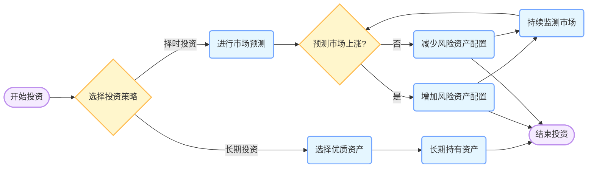

# 约翰·伯格的市场预测警告：为什么不要试图择时

> 关键词：约翰·伯格、市场预测、择时投资、投资策略、长期投资

> 摘要：本文围绕约翰·伯格提出的不要试图择时这一市场预测警告展开深入探讨。首先介绍了相关背景，包括目的范围、预期读者等内容。接着阐述核心概念与联系，解释择时投资等关键概念。通过核心算法原理和具体操作步骤的分析，结合数学模型和公式进行说明。以项目实战案例详细展示相关策略的实际应用，分析其代码实现与解读。探讨实际应用场景，推荐学习资源、开发工具框架以及相关论文著作。最后总结未来发展趋势与挑战，解答常见问题并提供扩展阅读和参考资料，旨在帮助投资者深入理解不要试图择时的原因和意义，树立正确的投资理念。

## 1. 背景介绍 
### 1.1 目的和范围
本文章的目的在于深入剖析约翰·伯格所提出的不要试图择时这一市场预测警告背后的原理和逻辑。通过详细的分析和探讨，帮助投资者理解择时投资的困难和风险，以及长期投资策略的优势。文章的范围涵盖了从理论层面的核心概念解释、算法原理分析、数学模型构建，到实际层面的项目实战案例、应用场景探讨，以及相关学习资源和工具的推荐等多个方面，力求为投资者提供全面、系统的知识体系和决策参考。

### 1.2 预期读者
本文预期读者主要包括各类投资者，无论是个人投资者还是机构投资者，只要对股票、基金等金融市场投资感兴趣，希望提升投资知识和技能、优化投资策略的人群都适合阅读。同时，金融专业的学生、研究人员以及从事金融行业相关工作的从业者也可以从本文中获取有价值的信息和见解。

### 1.3 文档结构概述
本文将按照以下结构展开：首先介绍相关背景知识，包括目的范围、预期读者等；接着阐述核心概念与联系，通过示意图和流程图帮助读者理解关键概念；然后详细讲解核心算法原理和具体操作步骤，并用 Python 代码进行演示；再介绍数学模型和公式，通过举例说明加深理解；随后通过项目实战案例展示代码实现和解读；接着探讨实际应用场景；之后推荐相关的学习资源、开发工具框架和论文著作；最后总结未来发展趋势与挑战，解答常见问题并提供扩展阅读和参考资料。

### 1.4 术语表
#### 1.4.1 核心术语定义
- **择时投资**：指投资者试图通过预测市场的走势，在市场上涨之前买入，在市场下跌之前卖出，以获取更高的投资收益的投资策略。
- **长期投资**：是一种基于长期视角的投资策略，投资者在较长的时间周期内持有资产，不被短期市场波动所影响，通过资产的长期增值来实现投资目标。
- **市场预测**：是指运用各种分析方法和工具，对金融市场未来的走势、价格波动等情况进行预测和判断。

#### 1.4.2 相关概念解释
- **有效市场假说**：该假说认为在有效市场中，资产价格已经反映了所有可用的信息，因此投资者无法通过分析历史价格、财务报表等公开信息来获得超额收益。这意味着市场是难以预测的，择时投资变得更加困难。
- **随机漫步理论**：该理论认为股票价格的变动是随机的，就像一个人随机漫步一样，其下一步的走向是无法预测的。这也从侧面说明了市场的不可预测性，对择时投资提出了挑战。

#### 1.4.3 缩略词列表
- **CAPM**：资本资产定价模型（Capital Asset Pricing Model），用于描述资产预期收益率与市场风险之间的关系。
- **ETF**：交易型开放式指数基金（Exchange Traded Fund），是一种在交易所上市交易的、基金份额可变的开放式基金。

## 2. 核心概念与联系 
### 核心概念原理
#### 择时投资的原理
择时投资的核心原理是基于对市场走势的预测。投资者通过分析各种因素，如宏观经济数据、政策变化、公司财务报表等，试图判断市场的未来走势。如果预测市场将上涨，投资者会增加股票等风险资产的配置；如果预测市场将下跌，投资者会减少风险资产的配置，甚至选择持有现金或其他避险资产。

#### 长期投资的原理
长期投资的原理基于资产的长期增值潜力。从历史数据来看，股票市场在长期内呈现出上涨的趋势，尽管短期内会有波动。长期投资者相信，通过长期持有优质资产，能够分享经济增长和企业发展带来的红利，从而实现资产的增值。同时，长期投资还可以减少交易成本和税收影响，提高投资的实际收益。

### 架构的文本示意图
```plaintext
            投资策略
            /         \
      择时投资       长期投资
      /       \
市场预测  资产配置调整
```

### Mermaid 流程图


## 3. 核心算法原理 & 具体操作步骤 
### 核心算法原理
#### 市场预测算法
在市场预测中，常用的算法有移动平均线法、线性回归法等。以移动平均线法为例，其原理是通过计算一定时间周期内的平均价格来平滑价格波动，从而判断市场的趋势。如果短期移动平均线向上穿过长期移动平均线，通常被视为市场上涨的信号；反之，如果短期移动平均线向下穿过长期移动平均线，则被视为市场下跌的信号。

#### 资产配置调整算法
根据市场预测的结果，投资者需要调整资产配置。一种简单的资产配置调整算法是根据市场预测的涨跌幅度，按比例增加或减少风险资产的配置。例如，如果预测市场将上涨 10%，则将风险资产的配置比例提高 10%；如果预测市场将下跌 10%，则将风险资产的配置比例降低 10%。

### 具体操作步骤
#### 市场预测步骤
1. 收集市场数据，包括股票价格、成交量、宏观经济数据等。
2. 选择合适的市场预测算法，如移动平均线法、线性回归法等。
3. 根据所选算法计算相关指标，如移动平均线、回归系数等。
4. 根据计算结果判断市场的趋势，如上涨、下跌或盘整。

#### 资产配置调整步骤
1. 根据市场预测的结果，确定风险资产和无风险资产的目标配置比例。
2. 计算当前资产组合中风险资产和无风险资产的实际配置比例。
3. 根据目标配置比例和实际配置比例的差异，进行资产买卖操作，调整资产配置。

### Python 源代码示例
```python
import pandas as pd
import numpy as np

# 模拟市场数据
np.random.seed(0)
dates = pd.date_range(start='2020-01-01', periods=365, freq='D')
prices = np.random.randn(365).cumsum() + 100
data = pd.DataFrame({'Close': prices}, index=dates)

# 计算短期和长期移动平均线
short_window = 20
long_window = 50
data['Short_MA'] = data['Close'].rolling(window=short_window).mean()
data['Long_MA'] = data['Close'].rolling(window=long_window).mean()

# 生成交易信号
data['Signal'] = 0
data.loc[data['Short_MA'] > data['Long_MA'], 'Signal'] = 1
data.loc[data['Short_MA'] < data['Long_MA'], 'Signal'] = -1

# 计算持仓比例
data['Position'] = data['Signal'].diff()

# 输出交易信号和持仓比例
print(data[['Close', 'Short_MA', 'Long_MA', 'Signal', 'Position']].tail())
```
### 代码解释
1. 首先，使用 `pandas` 和 `numpy` 库模拟市场数据，生成 365 天的股票价格数据。
2. 然后，计算短期（20 天）和长期（50 天）移动平均线。
3. 根据短期和长期移动平均线的交叉情况生成交易信号，当短期移动平均线大于长期移动平均线时，信号为 1，表示买入；当短期移动平均线小于长期移动平均线时，信号为 -1，表示卖出。
4. 最后，计算持仓比例，即交易信号的差值。

## 4. 数学模型和公式 & 详细讲解 & 举例说明 
### 移动平均线公式
移动平均线（MA）是一种常用的技术分析工具，用于平滑价格波动，判断市场趋势。简单移动平均线（SMA）的计算公式为：

$$SMA_n = \frac{\sum_{i=0}^{n-1} P_{t-i}}{n}$$

其中，$SMA_n$ 表示 $n$ 期的简单移动平均线，$P_t$ 表示第 $t$ 期的价格，$n$ 表示移动平均线的周期。

### 详细讲解
移动平均线的作用是通过计算一定时间周期内的平均价格，来消除短期价格波动的影响，从而更清晰地显示市场的长期趋势。当短期移动平均线向上穿过长期移动平均线时，表明市场短期走势强劲，可能是上涨的信号；反之，当短期移动平均线向下穿过长期移动平均线时，表明市场短期走势疲软，可能是下跌的信号。

### 举例说明
假设某股票的价格序列为 $[10, 12, 11, 13, 14, 15, 16, 17, 18, 19]$，我们计算 3 期和 5 期的简单移动平均线。

#### 3 期简单移动平均线计算
- 第 3 期：$SMA_3(3) = \frac{10 + 12 + 11}{3} = 11$
- 第 4 期：$SMA_3(4) = \frac{12 + 11 + 13}{3} = 12$
- 第 5 期：$SMA_3(5) = \frac{11 + 13 + 14}{3} = 12.67$
- 以此类推

#### 5 期简单移动平均线计算
- 第 5 期：$SMA_5(5) = \frac{10 + 12 + 11 + 13 + 14}{5} = 12$
- 第 6 期：$SMA_5(6) = \frac{12 + 11 + 13 + 14 + 15}{5} = 13$
- 第 7 期：$SMA_5(7) = \frac{11 + 13 + 14 + 15 + 16}{5} = 13.8$
- 以此类推

通过比较 3 期和 5 期的简单移动平均线的走势，可以判断市场的趋势。如果 3 期移动平均线向上穿过 5 期移动平均线，说明市场短期走势较强，可能是买入信号；反之，如果 3 期移动平均线向下穿过 5 期移动平均线，说明市场短期走势较弱，可能是卖出信号。

## 5. 项目实战：代码实际案例和详细解释说明 
### 5.1  开发环境搭建
#### 安装 Python
首先，需要安装 Python 环境。可以从 Python 官方网站（https://www.python.org/downloads/）下载适合自己操作系统的 Python 版本进行安装。安装过程中，建议勾选“Add Python to PATH”选项，以便在命令行中可以直接使用 Python 命令。

#### 安装必要的库
在项目中，我们需要使用 `pandas`、`numpy` 等库。可以使用 `pip` 命令进行安装：
```sh
pip install pandas numpy
```

### 5.2  源代码详细实现和代码解读
```python
import pandas as pd
import numpy as np
import matplotlib.pyplot as plt

# 读取市场数据
data = pd.read_csv('stock_prices.csv')
data['Date'] = pd.to_datetime(data['Date'])
data.set_index('Date', inplace=True)

# 计算短期和长期移动平均线
short_window = 20
long_window = 50
data['Short_MA'] = data['Close'].rolling(window=short_window).mean()
data['Long_MA'] = data['Close'].rolling(window=long_window).mean()

# 生成交易信号
data['Signal'] = 0
data.loc[data['Short_MA'] > data['Long_MA'], 'Signal'] = 1
data.loc[data['Short_MA'] < data['Long_MA'], 'Signal'] = -1

# 计算持仓比例
data['Position'] = data['Signal'].diff()

# 计算累计收益
data['Returns'] = data['Close'].pct_change()
data['Strategy_Returns'] = data['Returns'] * data['Signal'].shift(1)
data['Cumulative_Returns'] = (1 + data['Strategy_Returns']).cumprod()

# 绘制收益曲线
plt.figure(figsize=(12, 6))
plt.plot(data['Cumulative_Returns'], label='Strategy Returns')
plt.plot((1 + data['Returns']).cumprod(), label='Buy and Hold Returns')
plt.title('Cumulative Returns of Moving Average Crossover Strategy')
plt.xlabel('Date')
plt.ylabel('Cumulative Returns')
plt.legend()
plt.show()
```

### 代码解读与分析
1. **数据读取和处理**：使用 `pandas` 库读取存储在 `stock_prices.csv` 文件中的市场数据，并将日期列转换为日期时间类型，设置为索引。
2. **移动平均线计算**：计算短期（20 天）和长期（50 天）移动平均线，用于判断市场趋势。
3. **交易信号生成**：根据短期和长期移动平均线的交叉情况生成交易信号，1 表示买入，-1 表示卖出。
4. **持仓比例计算**：计算持仓比例，即交易信号的差值。
5. **收益计算**：计算股票的每日收益率和策略的每日收益率，并计算累计收益率。
6. **可视化**：使用 `matplotlib` 库绘制策略的累计收益曲线和买入持有策略的累计收益曲线，以便直观比较两种策略的表现。

通过对代码的分析，我们可以看到，移动平均线交叉策略试图通过判断市场趋势来进行买卖操作，从而获得更高的收益。然而，实际情况中，市场是复杂多变的，这种策略并不一定能够总是获得优于买入持有策略的收益。这也从侧面说明了择时投资的困难和不确定性。

## 6. 实际应用场景 
### 个人投资者
对于个人投资者来说，不要试图择时的理念可以帮助他们避免因频繁买卖而产生的高额交易成本和税收。个人投资者往往缺乏专业的市场分析能力和信息优势，难以准确预测市场的走势。采用长期投资策略，选择优质的股票或基金进行长期持有，可以减少情绪波动对投资决策的影响，实现资产的稳健增值。例如，一些个人投资者通过定期定额投资指数基金，长期坚持下来获得了不错的收益。

### 机构投资者
机构投资者虽然拥有更专业的研究团队和更丰富的信息资源，但同样面临着市场预测的困难。在实际投资中，机构投资者也越来越重视长期投资策略。例如，一些养老基金、保险资金等长期资金，通常会将大部分资产配置到优质的股票和债券上，进行长期投资，以实现资产的保值增值。同时，机构投资者也会采用多元化的投资策略，分散风险，而不是试图通过择时来获取超额收益。

### 基金管理公司
基金管理公司在管理基金时，也应该遵循不要试图择时的原则。基金经理应该专注于挑选优质的投资标的，构建合理的投资组合，而不是频繁地进行市场预测和资产配置调整。例如，一些指数基金通过跟踪市场指数，进行被动投资，避免了择时的风险，同时也为投资者提供了较为稳定的收益。

## 7. 工具和资源推荐
### 7.1 学习资源推荐
#### 7.1.1 书籍推荐
- 《聪明的投资者》（The Intelligent Investor）：作者是本杰明·格雷厄姆（Benjamin Graham），这本书被誉为投资界的圣经，介绍了价值投资的理念和方法，强调了长期投资的重要性。
- 《漫步华尔街》（A Random Walk Down Wall Street）：作者是伯顿·马尔基尔（Burton G. Malkiel），书中阐述了随机漫步理论和有效市场假说，对择时投资提出了质疑，推荐长期投资和指数基金投资。
- 《约翰·伯格的投资50堂课》（John Bogle's Little Book of Common Sense Investing）：作者是约翰·伯格（John Bogle），本书集中体现了约翰·伯格的投资理念，强调了低成本指数基金投资和长期投资的优势。

#### 7.1.2 在线课程
- Coursera 上的“投资学原理”（Principles of Investing）课程：该课程由知名大学的教授授课，系统地介绍了投资学的基本原理和方法，包括资产定价、投资组合理论等内容。
- edX 上的“金融市场”（Financial Markets）课程：由耶鲁大学的罗伯特·席勒（Robert Shiller）教授授课，课程涵盖了金融市场的各个方面，包括股票市场、债券市场、衍生品市场等，对投资者理解市场运行机制有很大帮助。

#### 7.1.3 技术博客和网站
- 雪球（https://xueqiu.com/）：是一个投资者交流社区，提供了丰富的股票、基金等金融产品的信息和分析，投资者可以在上面分享自己的投资经验和观点。
- 且慢（https://qieman.com/）：专注于基金投资，提供了基金组合策略、投资课程等服务，帮助投资者实现长期稳健的投资。

### 7.2 开发工具框架推荐
#### 7.2.1 IDE和编辑器
- PyCharm：是一款专门为 Python 开发设计的集成开发环境（IDE），具有代码编辑、调试、代码分析等功能，适合开发复杂的 Python 投资分析程序。
- Jupyter Notebook：是一个开源的 Web 应用程序，允许用户创建和共享包含代码、方程、可视化和叙述文本的文档。在投资分析中，Jupyter Notebook 可以方便地进行数据探索、模型构建和结果展示。

#### 7.2.2 调试和性能分析工具
- PDB：是 Python 自带的调试器，可以帮助开发者在代码执行过程中进行调试，查看变量的值、执行流程等。
- cProfile：是 Python 的性能分析工具，可以分析代码的执行时间和函数调用次数，帮助开发者找出代码中的性能瓶颈。

#### 7.2.3 相关框架和库
- Pandas：是一个强大的数据分析库，提供了高效的数据结构和数据处理工具，在投资分析中可以用于数据读取、清洗、分析等操作。
- Numpy：是 Python 的数值计算库，提供了高效的多维数组对象和各种数学函数，在投资分析中可以用于数值计算和模型构建。
- Matplotlib：是 Python 的绘图库，用于数据可视化，可以绘制各种类型的图表，如折线图、柱状图、散点图等，帮助投资者直观地展示分析结果。

### 7.3 相关论文著作推荐
#### 7.3.1 经典论文
- Eugene F. Fama 的“Efficient Capital Markets: A Review of Theory and Empirical Work”：该论文提出了有效市场假说，对金融市场的有效性进行了深入探讨，对投资理论和实践产生了深远影响。
- Harry Markowitz 的“Portfolio Selection”：这篇论文提出了现代投资组合理论，为投资者如何构建最优投资组合提供了理论基础。

#### 7.3.2 最新研究成果
- 关注顶级金融学术期刊，如《Journal of Finance》、《Review of Financial Studies》等，这些期刊会发表最新的金融研究成果，包括市场预测、投资策略等方面的研究。

#### 7.3.3 应用案例分析
- 一些金融研究机构和咨询公司会发布投资策略的应用案例分析报告，投资者可以通过阅读这些报告，了解不同投资策略在实际应用中的效果和优缺点。

## 8. 总结：未来发展趋势与挑战
### 未来发展趋势
#### 长期投资理念的普及
随着投资者教育的不断加强和市场的逐渐成熟，越来越多的投资者将认识到择时投资的困难和风险，从而接受长期投资的理念。长期投资将成为主流的投资策略，投资者会更加注重资产的长期增值和稳定性。

#### 智能化投资的发展
随着人工智能和大数据技术的不断发展，智能化投资将成为未来的发展趋势。智能投顾平台可以根据投资者的风险偏好、投资目标等因素，为投资者提供个性化的投资建议和资产配置方案。同时，智能化投资还可以通过机器学习算法对市场数据进行分析和预测，提高投资决策的准确性和效率。

#### 指数基金的持续增长
指数基金以其低成本、分散风险等优势，受到越来越多投资者的青睐。未来，指数基金的规模有望继续增长，成为投资者进行长期投资的重要选择。同时，随着市场的发展，指数基金的种类也将不断丰富，满足不同投资者的需求。

### 挑战
#### 市场不确定性增加
全球经济和政治环境的不确定性增加，如贸易摩擦、地缘政治冲突、宏观经济政策调整等，都会对金融市场产生影响，增加市场的不确定性。这使得市场预测变得更加困难，投资者难以准确判断市场的走势，给长期投资带来了一定的挑战。

#### 技术风险
智能化投资虽然具有很多优势，但也面临着技术风险。例如，机器学习算法的准确性和稳定性可能受到数据质量、模型过拟合等因素的影响。同时，网络安全问题也可能导致投资者的信息泄露和资产损失。

#### 投资者情绪波动
尽管长期投资理念逐渐普及，但投资者的情绪波动仍然是一个难以克服的问题。在市场出现大幅波动时，投资者往往会受到恐惧和贪婪情绪的影响，做出不理性的投资决策。这可能导致投资者在市场低点卖出资产，在市场高点买入资产，从而影响投资收益。

## 9. 附录：常见问题与解答
### 问题 1：为什么择时投资很难成功？
答：择时投资很难成功的原因主要有以下几点：一是市场具有不确定性，受到众多因素的影响，如宏观经济数据、政策变化、突发事件等，这些因素难以准确预测；二是有效市场假说认为市场价格已经反映了所有可用的信息，投资者很难通过分析公开信息获得超额收益；三是投资者往往受到情绪的影响，在市场波动时容易做出错误的决策。

### 问题 2：长期投资是不是意味着一直持有不卖出？
答：长期投资并不意味着一直持有不卖出。长期投资是一种基于长期视角的投资策略，投资者应该关注资产的基本面和长期价值。如果资产的基本面发生了重大变化，或者达到了投资者的投资目标，投资者可以考虑卖出资产。同时，投资者也可以根据市场情况进行适当的资产配置调整，但这种调整应该是基于长期投资的原则，而不是短期的市场波动。

### 问题 3：智能化投资是否可以完全替代人工投资？
答：智能化投资虽然具有很多优势，如高效、客观、个性化等，但目前还不能完全替代人工投资。智能化投资主要基于历史数据和算法模型进行分析和预测，对于一些复杂的市场情况和突发事件可能无法做出准确的判断。而人工投资可以结合投资者的经验、直觉和对市场的深入理解，做出更加灵活和全面的投资决策。因此，未来智能化投资和人工投资将相互补充，共同为投资者提供更好的投资服务。

## 10. 扩展阅读 & 参考资料
### 扩展阅读
- 《金融炼金术》（The Alchemy of Finance）：作者是乔治·索罗斯（George Soros），书中介绍了索罗斯的投资哲学和操作方法，对投资者理解市场的运行机制和投资决策有很大的启发。
- 《投资最重要的事》（The Most Important Thing Illuminated）：作者是霍华德·马克斯（Howard Marks），本书总结了马克斯多年的投资经验，强调了投资中的风险控制和逆向思维的重要性。

### 参考资料
- Fama, Eugene F. “Efficient Capital Markets: A Review of Theory and Empirical Work.” The Journal of Finance, vol. 25, no. 2, 1970, pp. 383–417.
- Markowitz, Harry. “Portfolio Selection.” The Journal of Finance, vol. 7, no. 1, 1952, pp. 77–91.
- Bogle, John C. John Bogle's Little Book of Common Sense Investing. Wiley, 2007.

作者：AI天才研究院/AI Genius Institute & 禅与计算机程序设计艺术 /Zen And The Art of Computer Programming