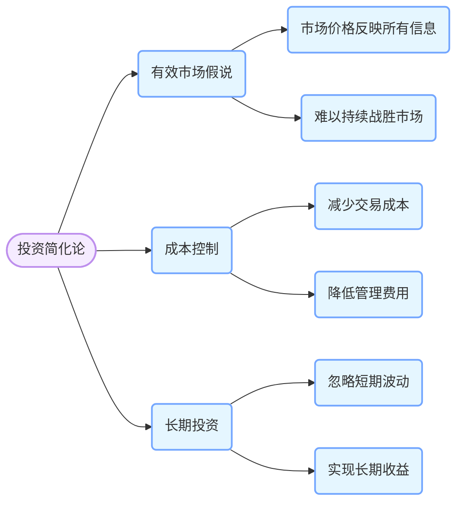

# 约翰·伯格的投资简化论：为什么少即是多

> 关键词：约翰·伯格、投资简化论、少即是多、投资策略、指数基金

> 摘要：本文深入探讨了约翰·伯格提出的投资简化论，阐述了“少即是多”这一理念在投资领域的重要意义。从背景介绍入手，分析该理论提出的目的、适用读者群体等。详细讲解核心概念、算法原理、数学模型等内容，并通过项目实战展示实际应用。同时介绍了该理论的实际应用场景、相关工具和资源，最后对其未来发展趋势与挑战进行总结，还设置了常见问题解答及扩展阅读参考资料，帮助读者全面理解投资简化论。

## 1. 背景介绍 
### 1.1 目的和范围
约翰·伯格的投资简化论旨在为投资者提供一种简单、有效且长期稳定的投资方法。其目的是让投资者避免陷入复杂的投资策略和频繁的交易中，通过减少不必要的操作和选择，降低投资成本，实现资产的稳健增长。本文的范围将围绕这一理论展开，详细分析其核心概念、原理、应用场景等方面，帮助投资者深入理解并应用这一理论。

### 1.2 预期读者
本文预期读者包括各类投资者，无论是初涉投资领域的新手，还是有一定投资经验的专业人士。对于新手来说，该理论可以帮助他们建立正确的投资理念，避免在投资初期就陷入复杂的投资陷阱；对于专业人士，也可以从简化的角度重新审视自己的投资策略，优化投资组合。

### 1.3 文档结构概述
本文将按照以下结构进行阐述：首先介绍核心概念与联系，让读者对投资简化论有初步的认识；接着讲解核心算法原理和具体操作步骤，通过Python代码详细说明；然后介绍数学模型和公式，并举例说明；之后进行项目实战，包括开发环境搭建、源代码实现和解读；再介绍实际应用场景；随后推荐相关的工具和资源；最后对该理论的未来发展趋势与挑战进行总结，并设置常见问题解答和扩展阅读参考资料。

### 1.4 术语表
#### 1.4.1 核心术语定义
- **投资简化论**：约翰·伯格提出的一种投资理念，强调通过简化投资策略，减少交易次数和投资选择，实现长期稳定的投资回报。
- **指数基金**：一种按照特定指数构成比例投资的基金，其目的是跟踪指数的表现，具有成本低、分散风险等特点。
- **有效市场假说**：认为市场价格已经反映了所有可用的信息，投资者无法通过分析历史数据或其他信息来获得超额收益。

#### 1.4.2 相关概念解释
- **分散投资**：将资金分散投资于不同的资产类别、行业或地区，以降低单一资产波动对整体投资组合的影响。
- **主动投资**：投资者通过积极分析和研究，试图选择表现优于市场平均水平的资产进行投资。
- **被动投资**：投资者不进行主动的资产选择，而是通过投资指数基金等方式，跟踪市场指数的表现。

#### 1.4.3 缩略词列表
- **ETF**：交易型开放式指数基金（Exchange Traded Fund）
- **CAPM**：资本资产定价模型（Capital Asset Pricing Model）

## 2. 核心概念与联系 
### 核心概念原理
约翰·伯格的投资简化论核心在于“少即是多”，其基于以下几个重要原理：
- **有效市场假说**：市场是有效的，大多数投资者很难持续战胜市场。因此，与其花费大量时间和精力进行主动投资，不如选择被动投资，通过投资指数基金来跟踪市场表现。
- **成本控制**：频繁的交易和复杂的投资策略会带来较高的交易成本和管理费用，这些成本会侵蚀投资收益。简化投资可以减少不必要的成本，提高实际收益。
- **长期投资**：投资是一个长期的过程，短期的市场波动对长期投资收益的影响较小。通过长期持有指数基金，投资者可以避免因短期市场波动而做出错误的决策。

### 架构的文本示意图
```plaintext
投资简化论
|-- 有效市场假说
|   |-- 市场价格反映所有信息
|   |-- 难以持续战胜市场
|-- 成本控制
|   |-- 减少交易成本
|   |-- 降低管理费用
|-- 长期投资
|   |-- 忽略短期波动
|   |-- 实现长期收益
```

### Mermaid 流程图


## 3. 核心算法原理 & 具体操作步骤 
### 核心算法原理
投资简化论的核心算法原理主要基于指数基金的选择和资产配置。假设投资者的目标是构建一个长期稳定的投资组合，以下是一个简单的算法思路：
- **选择合适的指数基金**：根据投资者的风险偏好和投资目标，选择不同类型的指数基金，如大盘指数基金、中小盘指数基金、债券指数基金等。
- **确定资产配置比例**：根据投资者的风险承受能力，确定不同类型指数基金的投资比例。例如，风险承受能力较高的投资者可以增加股票指数基金的比例，风险承受能力较低的投资者可以增加债券指数基金的比例。
- **定期调整资产配置**：随着市场的变化和投资者自身情况的改变，定期调整资产配置比例，以保持投资组合的平衡。

### 具体操作步骤
以下是使用Python代码实现上述算法的具体操作步骤：

```python
import numpy as np
import pandas as pd
import yfinance as yf

# 步骤1：选择合适的指数基金
# 假设选择三只指数基金：沪深300指数基金、中证500指数基金、国债指数基金
funds = ['000300.SS', '000905.SS', '000012.SS']

# 步骤2：获取历史数据
start_date = '2010-01-01'
end_date = '2023-01-01'
data = yf.download(funds, start=start_date, end=end_date)['Close']

# 步骤3：计算收益率
returns = data.pct_change().dropna()

# 步骤4：确定资产配置比例
# 假设风险承受能力较高，股票指数基金占比80%，债券指数基金占比20%
weights = np.array([0.4, 0.4, 0.2])

# 步骤5：计算投资组合收益率
portfolio_returns = np.sum(returns * weights, axis=1)

# 步骤6：计算累计收益率
cumulative_returns = (1 + portfolio_returns).cumprod()

# 步骤7：可视化结果
import matplotlib.pyplot as plt

plt.figure(figsize=(12, 6))
plt.plot(cumulative_returns)
plt.title('Portfolio Cumulative Returns')
plt.xlabel('Date')
plt.ylabel('Cumulative Returns')
plt.show()
```

### 代码解释
- **选择合适的指数基金**：使用`yfinance`库下载沪深300指数（`000300.SS`）、中证500指数（`000905.SS`）和国债指数（`000012.SS`）的历史数据。
- **获取历史数据**：指定数据的起始日期和结束日期，使用`yf.download`函数下载数据。
- **计算收益率**：使用`pct_change`函数计算每日收益率，并去除缺失值。
- **确定资产配置比例**：根据风险承受能力，确定三只指数基金的投资比例。
- **计算投资组合收益率**：将每只基金的收益率乘以其投资比例，然后求和得到投资组合的收益率。
- **计算累计收益率**：使用`cumprod`函数计算投资组合的累计收益率。
- **可视化结果**：使用`matplotlib`库绘制投资组合的累计收益率曲线。

## 4. 数学模型和公式 & 详细讲解 & 举例说明 
### 数学模型和公式
#### 投资组合收益率
投资组合的收益率可以通过以下公式计算：

$$R_p = \sum_{i=1}^{n} w_i R_i$$

其中，$R_p$ 表示投资组合的收益率，$w_i$ 表示第 $i$ 只资产的投资比例，$R_i$ 表示第 $i$ 只资产的收益率，$n$ 表示资产的数量。

#### 投资组合风险（标准差）
投资组合的风险可以用标准差来衡量，其计算公式为：

$$\sigma_p = \sqrt{\sum_{i=1}^{n} \sum_{j=1}^{n} w_i w_j \sigma_{ij}}$$

其中，$\sigma_p$ 表示投资组合的标准差，$\sigma_{ij}$ 表示第 $i$ 只资产和第 $j$ 只资产的协方差。

### 详细讲解
- **投资组合收益率公式**：该公式表示投资组合的收益率是各资产收益率的加权平均值，权重为各资产的投资比例。通过合理调整资产配置比例，可以优化投资组合的收益率。
- **投资组合风险公式**：该公式考虑了各资产之间的相关性，协方差 $\sigma_{ij}$ 反映了资产 $i$ 和资产 $j$ 的收益率之间的相互关系。当 $\sigma_{ij}$ 为正时，说明两只资产的收益率呈正相关；当 $\sigma_{ij}$ 为负时，说明两只资产的收益率呈负相关。通过选择相关性较低的资产进行组合，可以降低投资组合的风险。

### 举例说明
假设投资者有三只资产，分别为股票 A、股票 B 和债券 C，其投资比例分别为 $w_A = 0.4$，$w_B = 0.4$，$w_C = 0.2$，收益率分别为 $R_A = 0.1$，$R_B = 0.15$，$R_C = 0.05$。则投资组合的收益率为：

$$R_p = 0.4 \times 0.1 + 0.4 \times 0.15 + 0.2 \times 0.05 = 0.11$$

假设三只资产的协方差矩阵为：

$$\begin{bmatrix}
\sigma_{AA} & \sigma_{AB} & \sigma_{AC} \\
\sigma_{BA} & \sigma_{BB} & \sigma_{BC} \\
\sigma_{CA} & \sigma_{CB} & \sigma_{CC}
\end{bmatrix} = 
\begin{bmatrix}
0.04 & 0.02 & 0.01 \\
0.02 & 0.06 & 0.01 \\
0.01 & 0.01 & 0.02
\end{bmatrix}$$

则投资组合的风险为：

$$\begin{align*}
\sigma_p &= \sqrt{0.4^2 \times 0.04 + 0.4^2 \times 0.06 + 0.2^2 \times 0.02 + 2 \times 0.4 \times 0.4 \times 0.02 + 2 \times 0.4 \times 0.2 \times 0.01 + 2 \times 0.4 \times 0.2 \times 0.01} \\
&= \sqrt{0.0064 + 0.0096 + 0.0008 + 0.0064 + 0.0016 + 0.0016} \\
&= \sqrt{0.0264} \\
&\approx 0.1625
\end{align*}$$

## 5. 项目实战：代码实际案例和详细解释说明 
### 5.1  开发环境搭建
- **安装Python**：从Python官方网站（https://www.python.org/downloads/）下载并安装Python 3.x版本。
- **安装必要的库**：使用以下命令安装所需的库：
```sh
pip install numpy pandas yfinance matplotlib
```

### 5.2  源代码详细实现和代码解读
以下是完整的项目实战代码：

```python
import numpy as np
import pandas as pd
import yfinance as yf
import matplotlib.pyplot as plt

# 步骤1：选择合适的指数基金
funds = ['000300.SS', '000905.SS', '000012.SS']

# 步骤2：获取历史数据
start_date = '2010-01-01'
end_date = '2023-01-01'
data = yf.download(funds, start=start_date, end=end_date)['Close']

# 步骤3：计算收益率
returns = data.pct_change().dropna()

# 步骤4：确定资产配置比例
weights = np.array([0.4, 0.4, 0.2])

# 步骤5：计算投资组合收益率
portfolio_returns = np.sum(returns * weights, axis=1)

# 步骤6：计算累计收益率
cumulative_returns = (1 + portfolio_returns).cumprod()

# 步骤7：可视化结果
plt.figure(figsize=(12, 6))
plt.plot(cumulative_returns)
plt.title('Portfolio Cumulative Returns')
plt.xlabel('Date')
plt.ylabel('Cumulative Returns')
plt.show()
```

### 代码解读与分析
- **选择合适的指数基金**：选择沪深300指数基金、中证500指数基金和国债指数基金作为投资标的。
- **获取历史数据**：使用`yfinance`库下载指定日期范围内的指数基金收盘价数据。
- **计算收益率**：使用`pct_change`函数计算每日收益率，并去除缺失值。
- **确定资产配置比例**：根据风险承受能力，确定各指数基金的投资比例。
- **计算投资组合收益率**：将每只基金的收益率乘以其投资比例，然后求和得到投资组合的收益率。
- **计算累计收益率**：使用`cumprod`函数计算投资组合的累计收益率。
- **可视化结果**：使用`matplotlib`库绘制投资组合的累计收益率曲线，直观展示投资组合的表现。

通过分析累计收益率曲线，投资者可以评估投资组合的长期表现，判断是否达到了预期的投资目标。

## 6. 实际应用场景 
### 个人投资者
对于个人投资者来说，投资简化论提供了一种简单易行的投资方法。个人投资者通常没有专业的投资知识和时间进行深入的研究和分析，通过投资指数基金，他们可以避免选择个股的风险，同时降低投资成本。例如，一位上班族可以将每月的一部分收入定期投资于指数基金，长期坚持下来，有望实现资产的稳健增长。

### 养老基金
养老基金的投资目标是实现资产的长期保值增值，以满足退休人员的生活需求。投资简化论的长期投资和成本控制理念非常适合养老基金的投资策略。养老基金可以通过投资指数基金，构建一个多元化的投资组合，降低投资风险，同时减少管理费用，提高投资收益。

### 机构投资者
机构投资者如保险公司、基金公司等，也可以借鉴投资简化论的思想。在管理大规模资金时，机构投资者往往面临着较高的交易成本和管理难度。通过投资指数基金，机构投资者可以实现资产的分散投资，降低投资组合的波动性，同时提高投资效率。

## 7. 工具和资源推荐
### 7.1 学习资源推荐
#### 7.1.1 书籍推荐
- 《共同基金常识》（John C. Bogle著）：约翰·伯格的经典著作，详细阐述了投资简化论的核心思想和投资策略。
- 《聪明的投资者》（Benjamin Graham著）：价值投资的经典之作，对投资者树立正确的投资理念具有重要指导意义。
- 《漫步华尔街》（Burton G. Malkiel著）：介绍了有效市场假说和指数基金投资的优势，是一本适合投资者入门的书籍。

#### 7.1.2 在线课程
- Coursera上的“投资学原理”课程：由知名大学教授授课，系统介绍了投资学的基本原理和方法。
- 网易云课堂上的“指数基金投资入门”课程：专门讲解指数基金的投资技巧和策略。

#### 7.1.3 技术博客和网站
- 雪球网：提供丰富的投资资讯和投资者交流平台，投资者可以在这里学习到各种投资经验和策略。
- 且慢网：专注于基金投资，提供基金筛选、资产配置等服务，同时也有很多关于投资简化论的文章和分析。

### 7.2 开发工具框架推荐
#### 7.2.1 IDE和编辑器
- PyCharm：一款专业的Python集成开发环境，具有强大的代码编辑、调试和分析功能。
- Jupyter Notebook：一个交互式的开发环境，适合进行数据探索和分析，方便投资者进行投资策略的回测和验证。

#### 7.2.2 调试和性能分析工具
- IPython：一个增强的Python交互式解释器，提供了丰富的调试和分析功能，方便投资者调试代码。
- Profiler：Python自带的性能分析工具，可以帮助投资者找出代码中的性能瓶颈。

#### 7.2.3 相关框架和库
- Pandas：一个强大的数据处理和分析库，提供了丰富的数据结构和函数，方便投资者处理和分析投资数据。
- NumPy：一个用于科学计算的Python库，提供了高效的数组操作和数学函数，是投资分析中常用的库之一。
- Matplotlib：一个用于数据可视化的Python库，可以帮助投资者直观地展示投资组合的表现。

### 7.3 相关论文著作推荐
#### 7.3.1 经典论文
- “The Efficient Market Hypothesis and Its Critics”（Eugene F. Fama著）：对有效市场假说进行了深入的探讨和分析。
- “Capital Asset Prices: A Theory of Market Equilibrium under Conditions of Risk”（William F. Sharpe著）：提出了资本资产定价模型（CAPM），为投资组合理论奠定了基础。

#### 7.3.2 最新研究成果
- 近年来，关于指数基金和投资简化论的研究不断涌现，投资者可以关注学术期刊如《Journal of Finance》、《Review of Financial Studies》等，了解最新的研究动态。

#### 7.3.3 应用案例分析
- 一些金融机构和研究机构会发布关于投资简化论的应用案例分析报告，投资者可以通过这些报告了解该理论在实际投资中的应用效果和经验教训。

## 8. 总结：未来发展趋势与挑战
### 未来发展趋势
- **指数基金市场的持续增长**：随着投资者对投资简化论的认识不断提高，指数基金市场有望继续保持增长态势。越来越多的投资者将选择指数基金作为主要的投资工具。
- **智能投顾的兴起**：智能投顾利用人工智能和大数据技术，为投资者提供个性化的投资建议和资产配置方案。投资简化论的理念与智能投顾的发展相契合，未来智能投顾有望在投资简化领域发挥更大的作用。
- **全球化投资**：随着全球经济的一体化，投资者将越来越倾向于进行全球化投资。指数基金可以提供广泛的全球市场覆盖，满足投资者的全球化投资需求。

### 挑战
- **市场波动风险**：尽管投资简化论强调长期投资，但市场波动仍然会对投资组合产生影响。投资者需要具备一定的风险承受能力，避免在市场波动时做出错误的决策。
- **指数基金的同质化竞争**：随着指数基金市场的不断发展，市场上的指数基金产品越来越多，同质化竞争日益激烈。投资者需要更加谨慎地选择指数基金，避免投资到质量不佳的产品。
- **监管政策的变化**：监管政策的变化可能会对指数基金市场产生影响。投资者需要关注监管政策的动态，及时调整投资策略。

## 9. 附录：常见问题与解答
### 问题1：投资简化论是否适合所有投资者？
解答：投资简化论适合大多数投资者，尤其是那些没有专业投资知识和时间进行深入研究的投资者。但对于一些具有丰富投资经验和专业知识的投资者来说，他们可能会根据自己的判断选择更复杂的投资策略。

### 问题2：指数基金的收益一定能跑赢主动管理基金吗？
解答：不一定。虽然从长期来看，大多数主动管理基金难以跑赢指数基金，但在某些特定时期，主动管理基金可能会因为基金经理的出色选股能力而获得较高的收益。不过，考虑到主动管理基金的高成本，指数基金仍然是一种较为稳健的投资选择。

### 问题3：如何选择合适的指数基金？
解答：选择合适的指数基金需要考虑以下几个因素：基金的跟踪误差、管理费用、基金规模、指数的代表性等。投资者可以通过比较不同指数基金的这些指标，选择最适合自己的基金。

### 问题4：投资简化论是否意味着不需要进行资产配置？
解答：不是的。投资简化论强调简化投资策略，但资产配置仍然是投资中非常重要的一环。通过合理的资产配置，投资者可以降低投资组合的风险，提高投资收益。投资简化论下的资产配置可以选择不同类型的指数基金进行组合。

## 10. 扩展阅读 & 参考资料
### 扩展阅读
- 《投资最重要的事》（Howard Marks著）：深入探讨了投资中的各种重要理念和策略，对投资者的思维方式有很大的启发。
- 《金融炼金术》（George Soros著）：乔治·索罗斯的投资哲学和实践经验，帮助投资者从不同的角度看待金融市场。

### 参考资料
- John C. Bogle, “Common Sense on Mutual Funds: New Imperatives for the Intelligent Investor”.
- Eugene F. Fama, “The Efficient Market Hypothesis and Its Critics”.
- William F. Sharpe, “Capital Asset Prices: A Theory of Market Equilibrium under Conditions of Risk”.

作者：AI天才研究院/AI Genius Institute & 禅与计算机程序设计艺术 /Zen And The Art of Computer Programming