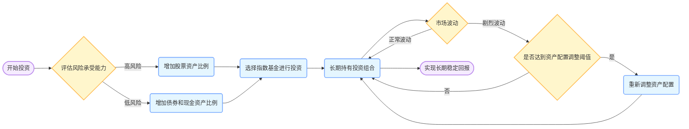

# 约翰·伯格的投资简化论：应对金融产品复杂化的挑战

> 关键词：约翰·伯格、投资简化论、金融产品复杂化、投资策略、长期投资

> 摘要：本文深入探讨了约翰·伯格的投资简化论及其在应对金融产品日益复杂化挑战中的重要意义。首先介绍了文章的背景信息，包括目的、预期读者等内容。接着阐述了投资简化论的核心概念与联系，通过清晰的示意图和流程图展示其原理。详细讲解了投资简化论背后的核心算法原理及具体操作步骤，并结合数学模型和公式进行说明。通过项目实战案例，展示了如何运用投资简化论进行实际投资操作。分析了投资简化论在不同实际应用场景中的作用，还推荐了相关的学习资源、开发工具框架以及论文著作。最后总结了投资简化论的未来发展趋势与挑战，并提供了常见问题的解答和扩展阅读参考资料，旨在帮助投资者更好地理解和应用投资简化论来应对复杂的金融市场。

## 1. 背景介绍 
### 1.1 目的和范围
随着金融市场的不断发展，金融产品变得越来越复杂。各种新型的金融衍生品、结构化产品层出不穷，这对于普通投资者来说，理解和选择合适的投资产品变得愈发困难。约翰·伯格的投资简化论为投资者提供了一种应对这种复杂局面的有效方法。本文的目的在于深入剖析约翰·伯格的投资简化论，探讨其原理、实际应用以及在应对金融产品复杂化挑战中的作用。文章的范围涵盖了投资简化论的核心概念、算法原理、数学模型、实际案例分析以及相关的学习资源和工具推荐等方面。

### 1.2 预期读者
本文预期读者主要包括普通投资者，他们希望在复杂的金融市场中找到一种简单有效的投资方法；金融从业者，如投资顾问、理财经理等，需要深入了解不同的投资理念以更好地服务客户；以及对金融投资理论感兴趣的研究人员，他们希望通过本文对约翰·伯格的投资简化论有更深入的研究和探讨。

### 1.3 文档结构概述
本文将按照以下结构进行阐述：首先介绍背景信息，让读者了解文章的写作目的和适用范围；接着详细讲解投资简化论的核心概念与联系，通过示意图和流程图直观展示其原理；然后分析核心算法原理和具体操作步骤，并用Python代码进行详细阐述；之后介绍相关的数学模型和公式，并举例说明；通过项目实战案例展示投资简化论的实际应用；分析其在不同场景下的实际应用；推荐相关的学习资源、开发工具框架和论文著作；总结投资简化论的未来发展趋势与挑战；提供常见问题的解答和扩展阅读参考资料。

### 1.4 术语表
#### 1.4.1 核心术语定义
- **投资简化论**：约翰·伯格提出的一种投资理念，强调通过简单、低成本的投资策略来实现长期稳定的投资回报，避免过度参与复杂的金融产品和频繁的交易操作。
- **指数基金**：一种按照特定指数构成比例进行投资的基金产品，其目的是跟踪指数的表现，具有低成本、广泛分散风险等特点。
- **资产配置**：投资者根据自身的风险承受能力、投资目标等因素，将资金分配到不同类型的资产（如股票、债券、现金等）中，以实现投资组合的多元化和风险控制。

#### 1.4.2 相关概念解释
- **被动投资**：与主动投资相对，被动投资不试图通过预测市场走势或挑选个别股票来获取超额收益，而是通过跟踪市场指数来获得市场平均回报。指数基金是被动投资的典型代表。
- **长期投资**：指投资者持有投资产品的时间较长，通常以年为单位。长期投资可以平滑市场波动的影响，利用复利的力量实现资产的增值。

#### 1.4.3 缩略词列表
- **ETF**：交易型开放式指数基金（Exchange Traded Fund），是一种在证券交易所上市交易的、基金份额可变的开放式基金，通常跟踪特定的指数。

## 2. 核心概念与联系 

### 核心概念原理
约翰·伯格的投资简化论核心思想是，在复杂的金融市场中，投资者往往会被各种复杂的金融产品和投资策略所迷惑，而这些复杂的方法并不一定能带来更好的投资回报。相反，通过采用简单、低成本的投资策略，如投资指数基金和进行合理的资产配置，投资者可以获得与市场表现相近的回报，同时降低投资风险和成本。

指数基金是投资简化论的重要工具之一。它通过跟踪特定的市场指数，如标普500指数，将资金分散投资于指数所包含的所有股票或债券。由于指数基金不需要基金经理进行大量的研究和分析来挑选个别股票，因此其管理费用较低。同时，由于指数包含了市场上众多的股票或债券，投资指数基金可以实现广泛的分散投资，降低个别股票或债券波动对投资组合的影响。

资产配置也是投资简化论的关键环节。投资者根据自己的风险承受能力和投资目标，将资金分配到不同类型的资产中，如股票、债券和现金。不同类型的资产在不同的市场环境下表现不同，通过合理的资产配置，投资者可以在一定程度上平衡投资组合的风险和收益。

### 架构的文本示意图
```plaintext
投资简化论
|-- 核心策略
|   |-- 投资指数基金
|   |   |-- 跟踪市场指数
|   |   |-- 广泛分散投资
|   |   |-- 低成本管理
|   |-- 合理资产配置
|       |-- 根据风险承受能力分配资产
|       |-- 平衡风险和收益
|-- 目标
|   |-- 实现长期稳定回报
|   |-- 降低投资风险
|   |-- 减少投资成本
```

### Mermaid 流程图


## 3. 核心算法原理 & 具体操作步骤 

### 核心算法原理
投资简化论的核心算法原理主要基于资产配置和指数基金投资的策略。资产配置的算法可以通过风险评估和目标收益来确定不同资产的分配比例。一种常见的方法是使用均值 - 方差模型，该模型通过计算不同资产的预期收益率、方差和协方差，来找到最优的资产配置组合，使得在给定风险水平下实现最大的预期收益，或者在给定预期收益下实现最小的风险。

指数基金投资的算法则是根据市场指数的构成，按照相同的比例投资于指数所包含的所有股票或债券。例如，如果要投资标普500指数基金，就需要按照标普500指数中各成分股的权重，将资金分配到这500只股票中。

### 具体操作步骤
#### 步骤1：评估风险承受能力
投资者可以通过填写风险评估问卷等方式，了解自己的风险承受能力。风险评估问卷通常会考虑投资者的年龄、收入、投资经验、投资目标等因素。例如，年轻的投资者通常具有较高的风险承受能力，因为他们有较长的投资期限，可以承受市场波动的影响；而接近退休年龄的投资者则通常具有较低的风险承受能力，更倾向于保守的投资策略。

#### 步骤2：确定投资目标
投资者需要明确自己的投资目标，如短期的资金增值、长期的养老储备、子女教育等。不同的投资目标会影响资产配置的比例。例如，如果是短期的资金增值目标，可能会更倾向于投资流动性较好的资产；如果是长期的养老储备目标，则可以适当增加股票资产的比例，以获取更高的长期回报。

#### 步骤3：进行资产配置
根据风险承受能力和投资目标，确定股票、债券和现金等不同资产的分配比例。例如，对于风险承受能力较高、投资期限较长的投资者，可以将70%的资金分配到股票资产，20%分配到债券资产，10%保留为现金；对于风险承受能力较低、投资期限较短的投资者，可以将30%的资金分配到股票资产，60%分配到债券资产，10%保留为现金。

#### 步骤4：选择指数基金
根据资产配置的比例，选择合适的指数基金进行投资。例如，如果要投资股票资产，可以选择跟踪标普500指数、沪深300指数等的指数基金；如果要投资债券资产，可以选择跟踪国债指数、企业债指数等的债券指数基金。

#### 步骤5：定期调整资产配置
由于市场波动，不同资产的价值会发生变化，导致资产配置比例偏离最初的设定。因此，投资者需要定期（如每年或每半年）检查资产配置比例，并进行调整，以保持资产配置的合理性。

### Python源代码详细阐述
```python
import numpy as np
import pandas as pd
from scipy.optimize import minimize

# 假设有三种资产：股票、债券和现金
# 历史收益率数据（示例）
returns = pd.DataFrame({
    '股票': [0.1, 0.15, 0.05, 0.2, 0.12],
    '债券': [0.05, 0.06, 0.04, 0.07, 0.055],
    '现金': [0.02, 0.02, 0.02, 0.02, 0.02]
})

# 计算每种资产的预期收益率和协方差矩阵
expected_returns = returns.mean()
cov_matrix = returns.cov()

# 定义目标函数：最小化风险（方差）
def portfolio_variance(weights, cov_matrix):
    return np.dot(weights.T, np.dot(cov_matrix, weights))

# 定义约束条件：权重之和为1
constraints = ({'type': 'eq', 'fun': lambda x: np.sum(x) - 1})

# 定义权重范围：每种资产的权重在0到1之间
bounds = [(0, 1) for _ in range(len(expected_returns))]

# 初始权重猜测
initial_weights = np.ones(len(expected_returns)) / len(expected_returns)

# 最小化风险，找到最优资产配置
result = minimize(portfolio_variance, initial_weights, args=(cov_matrix,),
                  method='SLSQP', bounds=bounds, constraints=constraints)

optimal_weights = result.x

print("最优资产配置权重：")
for asset, weight in zip(expected_returns.index, optimal_weights):
    print(f"{asset}: {weight:.2%}")
```
在上述代码中，首先定义了三种资产（股票、债券和现金）的历史收益率数据。然后计算了每种资产的预期收益率和协方差矩阵。接着定义了目标函数，即最小化投资组合的方差（风险）。通过`scipy.optimize.minimize`函数，在权重之和为1且每种资产权重在0到1之间的约束条件下，找到最优的资产配置权重。最后输出了最优资产配置权重。

## 4. 数学模型和公式 & 详细讲解 & 举例说明 

### 均值 - 方差模型
均值 - 方差模型是资产配置中常用的数学模型，由哈里·马科维茨（Harry Markowitz）提出。该模型的核心思想是在给定预期收益率的情况下，找到风险最小的资产配置组合；或者在给定风险水平的情况下，找到预期收益率最大的资产配置组合。

#### 数学公式
设投资组合中有 $n$ 种资产，第 $i$ 种资产的权重为 $w_i$，预期收益率为 $\mu_i$，投资组合的预期收益率为 $\mu_p$，则：
$$\mu_p = \sum_{i=1}^{n} w_i \mu_i$$

投资组合的方差 $\sigma_p^2$ 可以表示为：
$$\sigma_p^2 = \sum_{i=1}^{n} \sum_{j=1}^{n} w_i w_j \sigma_{ij}$$
其中，$\sigma_{ij}$ 是第 $i$ 种资产和第 $j$ 种资产的协方差。

#### 详细讲解
预期收益率 $\mu_p$ 表示投资组合在未来一段时间内的平均收益水平，它是每种资产预期收益率的加权平均值，权重为每种资产在投资组合中的占比。方差 $\sigma_p^2$ 表示投资组合收益率的波动程度，反映了投资组合的风险大小。协方差 $\sigma_{ij}$ 衡量了两种资产收益率之间的相关性，如果 $\sigma_{ij} > 0$，表示两种资产的收益率呈正相关；如果 $\sigma_{ij} < 0$，表示两种资产的收益率呈负相关；如果 $\sigma_{ij} = 0$，表示两种资产的收益率不相关。

#### 举例说明
假设有两种资产：股票和债券。股票的预期收益率 $\mu_1 = 0.1$，方差 $\sigma_1^2 = 0.04$；债券的预期收益率 $\mu_2 = 0.05$，方差 $\sigma_2^2 = 0.01$；两种资产的协方差 $\sigma_{12} = 0.005$。投资者将资金的 $60\%$ 投资于股票（$w_1 = 0.6$），$40\%$ 投资于债券（$w_2 = 0.4$）。

首先计算投资组合的预期收益率：
$$\mu_p = w_1 \mu_1 + w_2 \mu_2 = 0.6 \times 0.1 + 0.4 \times 0.05 = 0.08$$

然后计算投资组合的方差：
$$
\begin{align*}
\sigma_p^2 &= w_1^2 \sigma_1^2 + w_2^2 \sigma_2^2 + 2 w_1 w_2 \sigma_{12}\\
&= 0.6^2 \times 0.04 + 0.4^2 \times 0.01 + 2 \times 0.6 \times 0.4 \times 0.005\\
&= 0.0144 + 0.0016 + 0.0024\\
&= 0.0184
\end{align*}
$$

投资组合的标准差 $\sigma_p = \sqrt{0.0184} \approx 0.1356$，表示投资组合的风险水平。

### 资本资产定价模型（CAPM）
资本资产定价模型是另一个重要的投资理论模型，它描述了资产的预期收益率与市场风险之间的关系。

#### 数学公式
$$\mu_i = r_f + \beta_i (\mu_m - r_f)$$
其中，$\mu_i$ 是第 $i$ 种资产的预期收益率，$r_f$ 是无风险收益率，$\beta_i$ 是第 $i$ 种资产的贝塔系数，$\mu_m$ 是市场组合的预期收益率。

#### 详细讲解
无风险收益率 $r_f$ 通常可以用国债收益率来近似表示，它代表了投资者在没有风险的情况下所能获得的收益率。贝塔系数 $\beta_i$ 衡量了第 $i$ 种资产的收益率相对于市场组合收益率的波动程度。如果 $\beta_i > 1$，表示该资产的收益率波动比市场组合更大，风险也更高；如果 $\beta_i < 1$，表示该资产的收益率波动比市场组合更小，风险也更低；如果 $\beta_i = 1$，表示该资产的收益率波动与市场组合相同。

#### 举例说明
假设无风险收益率 $r_f = 0.02$，市场组合的预期收益率 $\mu_m = 0.1$，某只股票的贝塔系数 $\beta = 1.2$。则该股票的预期收益率为：
$$\mu = r_f + \beta (\mu_m - r_f) = 0.02 + 1.2 \times (0.1 - 0.02) = 0.02 + 0.096 = 0.116$$

这意味着投资者预期该股票在未来的收益率为 $11.6\%$。

## 5. 项目实战：代码实际案例和详细解释说明 

### 5.1  开发环境搭建
为了实现投资简化论的项目实战，我们需要搭建一个Python开发环境。以下是具体的搭建步骤：

#### 步骤1：安装Python
可以从Python官方网站（https://www.python.org/downloads/）下载适合你操作系统的Python安装包，并按照安装向导进行安装。建议安装Python 3.7及以上版本。

#### 步骤2：安装必要的库
我们需要安装一些Python库来进行数据处理、数学计算和可视化等操作。可以使用`pip`命令来安装这些库：
```bash
pip install numpy pandas scipy matplotlib
```
- `numpy`：用于进行数值计算和数组操作。
- `pandas`：用于数据处理和分析。
- `scipy`：提供了许多科学计算和优化算法。
- `matplotlib`：用于数据可视化。

### 5.2  源代码详细实现和代码解读
以下是一个完整的项目实战代码示例，用于根据投资简化论进行资产配置和投资组合分析：

```python
import numpy as np
import pandas as pd
import matplotlib.pyplot as plt
from scipy.optimize import minimize

# 假设有三种资产：股票、债券和现金
# 历史收益率数据（示例）
returns = pd.DataFrame({
    '股票': [0.1, 0.15, 0.05, 0.2, 0.12],
    '债券': [0.05, 0.06, 0.04, 0.07, 0.055],
    '现金': [0.02, 0.02, 0.02, 0.02, 0.02]
})

# 计算每种资产的预期收益率和协方差矩阵
expected_returns = returns.mean()
cov_matrix = returns.cov()

# 定义目标函数：最小化风险（方差）
def portfolio_variance(weights, cov_matrix):
    return np.dot(weights.T, np.dot(cov_matrix, weights))

# 定义约束条件：权重之和为1
constraints = ({'type': 'eq', 'fun': lambda x: np.sum(x) - 1})

# 定义权重范围：每种资产的权重在0到1之间
bounds = [(0, 1) for _ in range(len(expected_returns))]

# 初始权重猜测
initial_weights = np.ones(len(expected_returns)) / len(expected_returns)

# 最小化风险，找到最优资产配置
result = minimize(portfolio_variance, initial_weights, args=(cov_matrix,),
                  method='SLSQP', bounds=bounds, constraints=constraints)

optimal_weights = result.x

# 计算最优投资组合的预期收益率和风险
optimal_portfolio_return = np.dot(optimal_weights, expected_returns)
optimal_portfolio_risk = np.sqrt(portfolio_variance(optimal_weights, cov_matrix))

print("最优资产配置权重：")
for asset, weight in zip(expected_returns.index, optimal_weights):
    print(f"{asset}: {weight:.2%}")

print(f"最优投资组合预期收益率: {optimal_portfolio_return:.2%}")
print(f"最优投资组合风险（标准差）: {optimal_portfolio_risk:.2%}")

# 生成随机投资组合进行比较
num_portfolios = 1000
portfolio_returns = []
portfolio_risks = []
for _ in range(num_portfolios):
    weights = np.random.random(len(expected_returns))
    weights /= np.sum(weights)
    portfolio_return = np.dot(weights, expected_returns)
    portfolio_risk = np.sqrt(portfolio_variance(weights, cov_matrix))
    portfolio_returns.append(portfolio_return)
    portfolio_risks.append(portfolio_risk)

# 绘制投资组合的风险 - 收益图
plt.figure(figsize=(10, 6))
plt.scatter(portfolio_risks, portfolio_returns, c='blue', alpha=0.5)
plt.scatter(optimal_portfolio_risk, optimal_portfolio_return, c='red', marker='*', s=200, label='最优投资组合')
plt.xlabel('风险（标准差）')
plt.ylabel('预期收益率')
plt.title('投资组合的风险 - 收益图')
plt.legend()
plt.grid(True)
plt.show()
```

### 5.3  代码解读与分析
#### 数据准备
```python
returns = pd.DataFrame({
    '股票': [0.1, 0.15, 0.05, 0.2, 0.12],
    '债券': [0.05, 0.06, 0.04, 0.07, 0.055],
    '现金': [0.02, 0.02, 0.02, 0.02, 0.02]
})
expected_returns = returns.mean()
cov_matrix = returns.cov()
```
这部分代码定义了三种资产（股票、债券和现金）的历史收益率数据，并计算了每种资产的预期收益率和协方差矩阵。预期收益率是历史收益率的平均值，协方差矩阵反映了不同资产收益率之间的相关性。

#### 目标函数和约束条件
```python
def portfolio_variance(weights, cov_matrix):
    return np.dot(weights.T, np.dot(cov_matrix, weights))

constraints = ({'type': 'eq', 'fun': lambda x: np.sum(x) - 1})
bounds = [(0, 1) for _ in range(len(expected_returns))]
```
目标函数`portfolio_variance`用于计算投资组合的方差，即风险。约束条件要求投资组合中所有资产的权重之和为1，确保资金全部被使用。权重范围限制每种资产的权重在0到1之间，即不允许卖空。

#### 优化求解
```python
initial_weights = np.ones(len(expected_returns)) / len(expected_returns)
result = minimize(portfolio_variance, initial_weights, args=(cov_matrix,),
                  method='SLSQP', bounds=bounds, constraints=constraints)
optimal_weights = result.x
```
使用`scipy.optimize.minimize`函数来最小化投资组合的风险，找到最优的资产配置权重。初始权重猜测为每种资产的权重相等。

#### 计算最优投资组合的指标
```python
optimal_portfolio_return = np.dot(optimal_weights, expected_returns)
optimal_portfolio_risk = np.sqrt(portfolio_variance(optimal_weights, cov_matrix))
```
计算最优投资组合的预期收益率和风险（标准差）。预期收益率是每种资产预期收益率的加权平均值，风险是投资组合方差的平方根。

#### 生成随机投资组合并绘制风险 - 收益图
```python
num_portfolios = 1000
portfolio_returns = []
portfolio_risks = []
for _ in range(num_portfolios):
    weights = np.random.random(len(expected_returns))
    weights /= np.sum(weights)
    portfolio_return = np.dot(weights, expected_returns)
    portfolio_risk = np.sqrt(portfolio_variance(weights, cov_matrix))
    portfolio_returns.append(portfolio_return)
    portfolio_risks.append(portfolio_risk)

plt.figure(figsize=(10, 6))
plt.scatter(portfolio_risks, portfolio_returns, c='blue', alpha=0.5)
plt.scatter(optimal_portfolio_risk, optimal_portfolio_return, c='red', marker='*', s=200, label='最优投资组合')
plt.xlabel('风险（标准差）')
plt.ylabel('预期收益率')
plt.title('投资组合的风险 - 收益图')
plt.legend()
plt.grid(True)
plt.show()
```
生成1000个随机投资组合，并计算它们的预期收益率和风险。然后使用`matplotlib`库绘制投资组合的风险 - 收益图，将随机投资组合用蓝色点表示，最优投资组合用红色星号表示。通过这个图可以直观地看到最优投资组合在风险 - 收益空间中的位置。

## 6. 实际应用场景 
### 普通投资者的长期投资规划
对于普通投资者来说，金融市场的复杂性往往让他们感到困惑和不知所措。约翰·伯格的投资简化论为他们提供了一种简单有效的投资方法。普通投资者可以根据自己的风险承受能力和投资目标，选择合适的指数基金进行投资，并进行合理的资产配置。例如，一位年轻的上班族，风险承受能力较高，投资目标是为了长期的养老储备。他可以将大部分资金投资于股票指数基金，小部分资金投资于债券指数基金和保留一定的现金。通过长期持有这些指数基金，他可以获得市场平均水平的回报，同时避免了频繁交易和挑选个别股票的风险。

### 机构投资者的资产配置调整
机构投资者，如养老基金、保险公司等，管理着大量的资金，需要进行合理的资产配置以实现风险控制和收益目标。投资简化论中的资产配置策略和指数基金投资方法可以为机构投资者提供参考。机构投资者可以根据市场情况和自身的风险偏好，定期调整资产配置比例，选择合适的指数基金进行投资。例如，在市场处于牛市阶段，机构投资者可以适当增加股票指数基金的比例；在市场处于熊市阶段，可以增加债券指数基金的比例，以降低投资组合的风险。

### 投资顾问的客户服务
投资顾问在为客户提供投资建议时，常常面临着如何向客户解释复杂的金融产品和投资策略的问题。约翰·伯格的投资简化论可以作为投资顾问的重要工具。投资顾问可以向客户介绍投资简化论的核心思想，帮助客户理解通过简单的投资策略可以实现长期稳定的回报。例如，投资顾问可以根据客户的风险承受能力和投资目标，为客户制定合理的资产配置方案，并推荐适合的指数基金。同时，投资顾问可以定期与客户沟通，根据市场变化和客户的情况调整投资组合，为客户提供持续的投资服务。

## 7. 工具和资源推荐
### 7.1 学习资源推荐
#### 7.1.1 书籍推荐
- 《漫步华尔街》（*A Random Walk Down Wall Street*）：作者是伯顿·马尔基尔（Burton Malkiel），这本书详细介绍了有效市场假说和指数基金投资的理念，是投资领域的经典之作。
- 《共同基金常识》（*Common Sense on Mutual Funds*）：约翰·伯格（John C. Bogle）的著作，书中深入探讨了基金投资的各种问题，强调了低成本指数基金投资的重要性。
- 《聪明的投资者》（*The Intelligent Investor*）：本杰明·格雷厄姆（Benjamin Graham）的经典著作，介绍了价值投资的基本原理和方法，对投资者的投资理念和风险管理有很大的启发。

#### 7.1.2 在线课程
- Coursera上的“投资学原理”（*Principles of Investing*）课程：由知名大学的教授授课，系统地介绍了投资学的基本概念、理论和方法。
- edX上的“金融市场”（*Financial Markets*）课程：提供了对金融市场的全面介绍，包括股票市场、债券市场、衍生品市场等，帮助学习者了解金融市场的运作机制。

#### 7.1.3 技术博客和网站
- 晨星网（Morningstar）：提供基金评级、分析和研究报告，帮助投资者了解不同基金的表现和特点。
- 雪球网：是一个投资者社区，投资者可以在上面分享投资经验、交流投资观点，获取最新的市场信息。

### 7.2 开发工具框架推荐
#### 7.2.1 IDE和编辑器
- PyCharm：是一款专业的Python集成开发环境，提供了丰富的代码编辑、调试和项目管理功能，适合进行Python投资分析项目的开发。
- Jupyter Notebook：是一个交互式的开发环境，支持Python代码的编写、运行和可视化，非常适合进行数据分析和模型验证。

#### 7.2.2 调试和性能分析工具
- IPython：是Python的交互式解释器，提供了强大的调试功能，如代码补全、语法高亮、错误跟踪等。
- cProfile：是Python的性能分析工具，可以帮助开发者找出代码中的性能瓶颈，优化代码的执行效率。

#### 7.2.3 相关框架和库
- Pandas：用于数据处理和分析，提供了高效的数据结构和数据操作方法，方便处理金融数据。
- NumPy：是Python的数值计算库，提供了多维数组和各种数学函数，用于进行投资组合的计算和分析。
- Scikit-learn：是一个机器学习库，提供了各种机器学习算法和工具，可用于金融数据的建模和预测。

### 7.3 相关论文著作推荐
#### 7.3.1 经典论文
- Markowitz, H. M. (1952). "Portfolio Selection". *The Journal of Finance*, 7(1), 77 - 91. 这篇论文提出了均值 - 方差模型，奠定了现代投资组合理论的基础。
- Sharpe, W. F. (1964). "Capital Asset Prices: A Theory of Market Equilibrium under Conditions of Risk". *The Journal of Finance*, 19(3), 425 - 442. 该论文提出了资本资产定价模型（CAPM），用于描述资产的预期收益率与市场风险之间的关系。

#### 7.3.2 最新研究成果
- Fama, E. F., & French, K. R. (2015). "A Five - Factor Asset Pricing Model". *Journal of Financial Economics*, 116(1), 1 - 22. 这篇论文提出了五因子资产定价模型，对传统的资本资产定价模型进行了扩展和改进。
- Campbell, J. Y., & Cochrane, J. H. (1999). "By Force of Habit: A Consumption - Based Explanation of Aggregate Stock Market Behavior". *Journal of Political Economy*, 107(2), 205 - 251. 该论文从消费习惯的角度解释了股票市场的整体行为，为资产定价理论提供了新的视角。

#### 7.3.3 应用案例分析
- 一些知名金融机构的研究报告，如摩根大通、高盛等，会定期发布关于投资策略和资产配置的研究报告，其中包含了大量的实际应用案例和分析。
- 学术期刊上发表的关于投资组合优化和风险管理的实证研究论文，通过实际数据验证了不同投资策略的有效性和局限性。

## 8. 总结：未来发展趋势与挑战
### 未来发展趋势
#### 指数基金市场的持续增长
随着投资者对投资简化论的认识不断提高，指数基金市场有望继续保持增长。指数基金以其低成本、广泛分散风险等优势，将吸引更多的投资者。同时，随着金融科技的发展，指数基金的交易和管理将更加便捷，进一步推动指数基金市场的发展。

#### 个性化投资服务的兴起
虽然投资简化论强调简单的投资策略，但未来投资者对个性化投资服务的需求可能会增加。金融机构可以结合投资简化论的思想，利用大数据和人工智能技术，为投资者提供更加个性化的资产配置方案和投资建议。例如，根据投资者的年龄、收入、风险偏好、投资目标等因素，为投资者量身定制投资组合。

#### 社会责任投资的融合
社会责任投资（SRI）越来越受到投资者的关注。未来，投资简化论可能会与社会责任投资相结合，投资者在追求投资回报的同时，也会更加注重投资的社会和环境影响。指数基金可以通过跟踪包含社会责任因素的指数，为投资者提供参与社会责任投资的机会。

### 挑战
#### 市场有效性的变化
投资简化论的基础之一是市场的有效性。然而，市场有效性并不是一成不变的，随着市场环境的变化、信息传播的加速等因素，市场有效性可能会发生变化。如果市场变得更加无效，那么简单的指数基金投资策略可能无法获得理想的回报，投资者需要更加关注市场动态，适时调整投资策略。

#### 金融创新带来的复杂性
金融市场的不断创新会带来新的金融产品和投资策略，这可能会增加市场的复杂性。虽然投资简化论强调简单投资，但投资者仍然需要了解这些新的金融产品和策略，以避免在市场变化中遭受损失。同时，金融监管机构也需要加强对金融创新的监管，确保市场的稳定和投资者的利益。

#### 投资者教育的不足
尽管投资简化论的思想相对简单，但仍然需要投资者具备一定的金融知识和投资理念。目前，投资者教育的普及程度还不够，许多投资者对投资简化论的理解和应用存在困难。因此，加强投资者教育，提高投资者的金融素养，是推广投资简化论面临的重要挑战之一。

## 9. 附录：常见问题与解答
### 问题1：投资简化论是否适合所有投资者？
投资简化论并不适合所有投资者。对于那些具有较高投资经验和专业知识，并且愿意花费大量时间和精力进行研究和分析的投资者来说，他们可能更倾向于采用主动投资策略，通过挑选个别股票或进行市场时机选择来获取超额收益。而对于普通投资者，尤其是那些没有太多时间和专业知识的投资者来说，投资简化论提供了一种简单有效的投资方法，可以帮助他们实现长期稳定的回报。

### 问题2：指数基金的收益一定能跑赢主动管理基金吗？
指数基金的收益并不一定能跑赢主动管理基金。在某些市场环境下，主动管理基金的基金经理可能通过准确的市场判断和个股选择，获得超过指数基金的收益。然而，从长期来看，由于主动管理基金的管理费用较高，并且很难持续战胜市场，指数基金往往能够获得与市场表现相近的回报，甚至在扣除费用后可能超过大部分主动管理基金。

### 问题3：如何确定自己的风险承受能力？
确定自己的风险承受能力可以通过多种方式。一种常见的方法是填写风险评估问卷，问卷通常会考虑投资者的年龄、收入、投资经验、投资目标等因素。此外，投资者还可以根据自己的心理承受能力来判断。如果投资者在市场波动时容易感到焦虑和恐慌，那么可能风险承受能力较低；如果投资者能够相对平静地看待市场波动，那么可能风险承受能力较高。

### 问题4：资产配置需要多久调整一次？
资产配置的调整频率取决于多种因素，如市场波动程度、投资者的投资目标和风险偏好等。一般来说，投资者可以每年或每半年检查一次资产配置比例，如果资产配置比例偏离最初的设定较大（如超过一定的阈值），则可以进行调整。但需要注意的是，过于频繁的调整可能会增加交易成本，并且不一定能带来更好的投资回报。

## 10. 扩展阅读 & 参考资料
### 扩展阅读
- 《金融炼金术》（*The Alchemy of Finance*），乔治·索罗斯（George Soros）著，探讨了金融市场的反身性原理和投资策略。
- 《黑天鹅》（*The Black Swan*），纳西姆·尼古拉斯·塔勒布（Nassim Nicholas Taleb）著，介绍了极端事件对金融市场的影响和风险管理方法。

### 参考资料
- Bogle, J. C. (1999). *Common Sense on Mutual Funds: New Imperatives for the Intelligent Investor*. Wiley.
- Malkiel, B. G. (2019). *A Random Walk Down Wall Street: The Time - Tested Strategy for Successful Investing*. W. W. Norton & Company.
- Graham, B. (2003). *The Intelligent Investor: The Definitive Book on Value Investing*. HarperBusiness.

作者：AI天才研究院/AI Genius Institute & 禅与计算机程序设计艺术 /Zen And The Art of Computer Programming