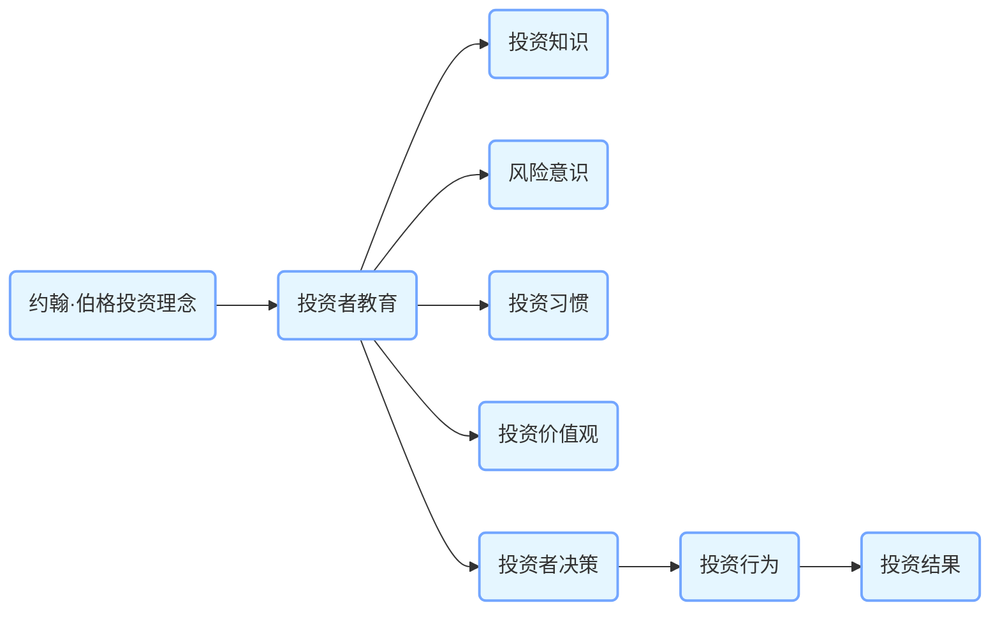

# 约翰·伯格的投资者教育重要性论述

> 关键词：约翰·伯格、投资者教育、投资理念、金融市场、长期投资、风险控制、财富积累

> 摘要：本文围绕约翰·伯格对投资者教育重要性的论述展开。深入探讨约翰·伯格在投资领域的核心理念与贡献，阐述投资者教育在金融市场中的关键地位和作用。通过分析其独特的投资思想，揭示投资者教育对于个人投资者实现财富积累、风险控制以及适应市场变化的重要意义。同时结合实际案例与相关理论，全面展现投资者教育在当今金融环境下的价值和影响，为投资者和金融从业者提供深入的思考和参考。

## 1. 背景介绍 
### 1.1 目的和范围
本文旨在深入研究约翰·伯格关于投资者教育重要性的论述。通过全面梳理伯格的投资理念、相关著作和实践经验，剖析投资者教育在投资决策、财富管理以及金融市场稳定等方面的重要作用。范围涵盖伯格的主要观点、投资者教育的理论基础、实际应用案例以及对金融市场的影响等多个层面，力求为读者呈现一个系统、深入的关于投资者教育重要性的认知体系。

### 1.2 预期读者
本文预期读者包括广大个人投资者，他们希望通过了解约翰·伯格的思想提升自身投资素养和决策能力；金融从业者，如投资顾问、基金经理等，可从中获取关于投资者教育的新思路和方法；金融研究人员，为其研究投资者行为和金融市场发展提供参考；以及对金融投资领域感兴趣的普通读者，增进对投资和投资者教育的认识。

### 1.3 文档结构概述
本文首先介绍约翰·伯格的背景以及投资者教育的相关背景知识，包括目的、预期读者和文档结构等内容。接着阐述核心概念，明确投资者教育的定义、与投资理念的联系等，并通过示意图和流程图进行直观展示。然后详细讲解核心算法原理和具体操作步骤，以帮助投资者更好地理解和实施投资者教育。随后介绍相关数学模型和公式，通过举例说明其在投资决策中的应用。再通过项目实战，给出代码实际案例并进行详细解释。之后探讨投资者教育的实际应用场景。接着推荐相关的学习资源、开发工具框架以及论文著作。最后总结投资者教育的未来发展趋势与挑战，解答常见问题，并提供扩展阅读和参考资料。

### 1.4 术语表
#### 1.4.1 核心术语定义
- **投资者教育**：是指通过各种方式向投资者传授投资知识、技能和理念，帮助投资者了解金融市场、掌握投资工具、提高投资决策能力和风险意识的过程。
- **长期投资**：是指投资者基于对资产长期价值的判断，持有资产较长时间，以获取资产增值和收益的投资策略。
- **指数基金**：是一种按照特定指数构成比例投资于股票或其他资产的基金，旨在复制指数的表现，具有成本低、分散风险等特点。

#### 1.4.2 相关概念解释
- **投资理念**：是投资者在投资过程中所遵循的基本思想和原则，它指导投资者的投资决策和行为。不同的投资理念会导致不同的投资策略和结果。
- **风险控制**：是指投资者通过各种方法和手段，对投资过程中可能面临的风险进行识别、评估和应对，以降低风险对投资收益的影响。

#### 1.4.3 缩略词列表
- **ETF**：交易型开放式指数基金（Exchange Traded Fund）
- **CAPM**：资本资产定价模型（Capital Asset Pricing Model）

## 2. 核心概念与联系 

### 投资者教育的定义与内涵
投资者教育是一个综合性的过程，它不仅仅是传授投资知识，还包括培养投资者的风险意识、投资习惯和正确的投资价值观。其目的是使投资者能够做出理性、明智的投资决策，实现自身财富的保值和增值。

### 约翰·伯格的投资理念与投资者教育的联系
约翰·伯格是指数基金的创始人，他倡导低成本、长期投资的理念。他认为投资者应该通过投资指数基金来获取市场平均收益，避免频繁交易和过度投机。这种投资理念与投资者教育密切相关，投资者教育可以帮助投资者理解和接受伯格的投资理念，从而做出更符合自身利益的投资决策。

### 文本示意图
投资者教育处于中心位置，它与投资知识、风险意识、投资习惯和投资价值观相互关联。投资知识为投资者提供了投资的基础，风险意识帮助投资者识别和应对投资中的风险，投资习惯影响投资者的投资行为，而投资价值观则决定了投资者的投资目标和方向。约翰·伯格的投资理念作为一种重要的投资思想，通过投资者教育影响投资者的决策和行为。

### Mermaid 流程图


## 3. 核心算法原理 & 具体操作步骤 

### 核心算法原理
在投资者教育中，我们可以借鉴一些基本的算法思想来帮助投资者做出决策。例如，我们可以使用简单的风险评估算法来评估投资者的风险承受能力。以下是一个用 Python 实现的简单风险评估算法示例：

```python
def risk_assessment(age, income, investment_experience):
    """
    风险评估函数
    :param age: 投资者年龄
    :param income: 投资者年收入
    :param investment_experience: 投资经验（0-无经验，1-有一定经验，2-丰富经验）
    :return: 风险承受能力等级（0-低风险，1-中风险，2-高风险）
    """
    score = 0
    if age < 30:
        score += 2
    elif age < 50:
        score += 1
    if income > 100000:
        score += 1
    if investment_experience == 2:
        score += 1
    if score <= 1:
        return 0
    elif score <= 2:
        return 1
    else:
        return 2
```

### 具体操作步骤
1. **收集投资者信息**：包括年龄、年收入、投资经验等。
2. **调用风险评估函数**：将收集到的信息作为参数传递给 `risk_assessment` 函数，得到投资者的风险承受能力等级。
3. **根据风险承受能力制定投资策略**：如果风险承受能力等级为低风险，可以建议投资者选择较为保守的投资产品，如债券基金；如果为中风险，可以选择混合基金；如果为高风险，可以适当配置股票基金。

## 4. 数学模型和公式 & 详细讲解 & 举例说明 

### 资本资产定价模型（CAPM）
资本资产定价模型（CAPM）是一种用于计算资产预期收益率的模型，其公式为：

$$E(R_i) = R_f + \beta_i (E(R_m) - R_f)$$

其中：
- $E(R_i)$ 是资产 $i$ 的预期收益率
- $R_f$ 是无风险收益率，通常可以用国债收益率来近似表示
- $\beta_i$ 是资产 $i$ 的贝塔系数，反映了资产 $i$ 的收益率相对于市场收益率的波动程度
- $E(R_m)$ 是市场组合的预期收益率

### 详细讲解
CAPM 模型的核心思想是资产的预期收益率由无风险收益率和风险溢价两部分组成。风险溢价是资产的贝塔系数乘以市场风险溢价（$E(R_m) - R_f$），它反映了资产承担市场风险所获得的额外收益。

### 举例说明
假设无风险收益率 $R_f = 3\%$，市场组合的预期收益率 $E(R_m) = 10\%$，某股票的贝塔系数 $\beta_i = 1.2$。则该股票的预期收益率为：

$$E(R_i) = 0.03 + 1.2\times(0.1 - 0.03) = 0.03 + 1.2\times0.07 = 0.03 + 0.084 = 0.114 = 11.4\%$$

这意味着根据 CAPM 模型，该股票的预期收益率为 11.4%。

## 5. 项目实战：代码实际案例和详细解释说明 

### 5.1  开发环境搭建
在进行项目实战之前，需要搭建相应的开发环境。我们可以使用 Python 作为开发语言，推荐使用 Anaconda 来管理 Python 环境。具体步骤如下：
1. **下载并安装 Anaconda**：从 Anaconda 官方网站（https://www.anaconda.com/products/individual）下载适合自己操作系统的 Anaconda 安装包，并按照安装向导进行安装。
2. **创建虚拟环境**：打开 Anaconda Prompt，输入以下命令创建一个新的虚拟环境：
```sh
conda create -n investment_env python=3.8
```
3. **激活虚拟环境**：输入以下命令激活虚拟环境：
```sh
conda activate investment_env
```
4. **安装必要的库**：在激活的虚拟环境中，输入以下命令安装必要的库：
```sh
pip install pandas numpy matplotlib
```

### 5.2  源代码详细实现和代码解读
以下是一个简单的投资组合模拟代码示例，用于演示如何根据不同的资产配置计算投资组合的收益率：

```python
import pandas as pd
import numpy as np
import matplotlib.pyplot as plt

# 模拟资产收益率数据
np.random.seed(0)
num_assets = 3
num_periods = 100
asset_returns = pd.DataFrame(np.random.normal(0.01, 0.05, size=(num_periods, num_assets)),
                             columns=['Asset1', 'Asset2', 'Asset3'])

# 定义资产配置权重
weights = np.array([0.3, 0.4, 0.3])

# 计算投资组合的收益率
portfolio_returns = (asset_returns * weights).sum(axis=1)

# 绘制投资组合收益率曲线
plt.plot(portfolio_returns)
plt.title('Portfolio Returns')
plt.xlabel('Period')
plt.ylabel('Return')
plt.show()
```

### 代码解读与分析
1. **数据模拟**：使用 `numpy` 库生成模拟的资产收益率数据，模拟了 3 种资产在 100 个周期内的收益率。
2. **资产配置权重**：定义了每种资产的配置权重，分别为 0.3、0.4 和 0.3。
3. **计算投资组合收益率**：将每种资产的收益率乘以其对应的权重，然后求和得到投资组合的收益率。
4. **绘制收益率曲线**：使用 `matplotlib` 库绘制投资组合的收益率曲线，直观展示投资组合的收益变化情况。

通过这个示例，投资者可以了解不同资产配置对投资组合收益率的影响，从而更好地进行资产配置决策。

## 6. 实际应用场景 
### 个人投资者
对于个人投资者来说，投资者教育可以帮助他们树立正确的投资理念，避免盲目跟风和过度投机。通过学习投资知识和风险评估方法，个人投资者可以根据自己的风险承受能力和投资目标选择适合自己的投资产品，实现财富的稳健增长。例如，一个年轻的投资者，通过投资者教育了解到长期投资的重要性，选择定期定额投资指数基金，随着时间的推移，可能会获得较为可观的收益。

### 金融机构
金融机构可以通过开展投资者教育活动，提高客户的投资素养和风险意识，增强客户的忠诚度和信任度。同时，投资者教育也有助于金融机构规范客户的投资行为，降低金融风险。例如，银行可以通过举办投资讲座、发放宣传资料等方式，向客户普及投资知识和风险防范知识。

### 金融市场稳定
投资者教育对于维护金融市场的稳定也具有重要意义。当投资者具备较高的投资素养和风险意识时，他们能够做出理性的投资决策，减少市场的波动和投机行为。例如，在股票市场出现大幅波动时，受过良好投资者教育的投资者不会盲目恐慌抛售股票，从而有助于稳定市场。

## 7. 工具和资源推荐
### 7.1 学习资源推荐
#### 7.1.1 书籍推荐
- 《聪明的投资者》（The Intelligent Investor）：本杰明·格雷厄姆著，被誉为投资界的圣经，书中介绍了价值投资的基本理念和方法。
- 《漫步华尔街》（A Random Walk Down Wall Street）：伯顿·马尔基尔著，全面介绍了投资的各种理论和方法，对投资者教育具有重要的参考价值。
- 《共同基金常识》（Common Sense on Mutual Funds）：约翰·伯格著，深入探讨了共同基金的投资策略和管理方法，是投资者了解基金投资的必读书籍。

#### 7.1.2 在线课程
- Coursera 平台上的“投资学原理”课程：由知名高校教授授课，系统介绍投资学的基本原理和方法。
- edX 平台上的“金融市场”课程：涵盖金融市场的各个方面，包括股票市场、债券市场、衍生品市场等。

#### 7.1.3 技术博客和网站
- 雪球网：国内知名的投资交流社区，投资者可以在上面分享投资经验、交流投资心得。
- 晨星网：提供专业的基金评级和分析服务，投资者可以通过该网站了解基金的业绩表现和风险状况。

### 7.2 开发工具框架推荐
#### 7.2.1 IDE和编辑器
- PyCharm：功能强大的 Python 集成开发环境，适合专业开发者使用。
- Jupyter Notebook：交互式的开发环境，适合数据分析师和科研人员使用。

#### 7.2.2 调试和性能分析工具
- pdb：Python 内置的调试工具，可以帮助开发者调试代码。
- cProfile：Python 内置的性能分析工具，可以分析代码的运行时间和性能瓶颈。

#### 7.2.3 相关框架和库
- Pandas：用于数据处理和分析的 Python 库，提供了丰富的数据结构和函数。
- Numpy：用于科学计算的 Python 库，提供了高效的数组操作和数学函数。
- Matplotlib：用于数据可视化的 Python 库，可以绘制各种类型的图表。

### 7.3 相关论文著作推荐
#### 7.3.1 经典论文
- Markowitz, H. M. (1952). Portfolio Selection. The Journal of Finance, 7(1), 77-91. 该论文提出了现代投资组合理论，为投资组合的优化提供了理论基础。
- Sharpe, W. F. (1964). Capital Asset Prices: A Theory of Market Equilibrium Under Conditions of Risk. The Journal of Finance, 19(3), 425-442. 该论文提出了资本资产定价模型（CAPM），为资产定价提供了重要的理论依据。

#### 7.3.2 最新研究成果
- Barberis, N., & Thaler, R. H. (2003). A Survey of Behavioral Finance. Handbook of the Economics of Finance, 1, 1053-1128. 该论文对行为金融学的研究成果进行了全面的综述，为理解投资者行为提供了新的视角。

#### 7.3.3 应用案例分析
- Bodie, Z., Kane, A., & Marcus, A. J. (2018). Investments. McGraw-Hill Education. 该教材中包含了大量的投资应用案例，通过对这些案例的分析，可以帮助读者更好地理解投资理论和方法的实际应用。

## 8. 总结：未来发展趋势与挑战
### 未来发展趋势
- **数字化和智能化**：随着信息技术的不断发展，投资者教育将越来越多地借助数字化和智能化手段进行。例如，通过在线课程、智能投顾等方式，为投资者提供更加个性化、便捷的教育服务。
- **跨学科融合**：投资者教育将不再局限于金融领域，而是与心理学、社会学等学科进行跨学科融合。通过综合运用多学科的知识和方法，更好地理解投资者的行为和心理，提高投资者教育的效果。
- **国际化合作**：随着全球金融市场的一体化，投资者教育也将加强国际间的合作与交流。不同国家和地区可以分享投资者教育的经验和资源，共同推动投资者教育的发展。

### 挑战
- **信息过载**：在信息爆炸的时代，投资者面临着海量的信息，如何筛选和获取有价值的信息成为一个挑战。投资者教育需要帮助投资者提高信息甄别能力，避免受到虚假信息的误导。
- **投资者素质差异**：不同投资者的知识水平、风险承受能力和投资经验存在差异，如何针对不同投资者的特点开展个性化的投资者教育是一个难题。
- **金融创新的挑战**：金融市场不断创新，新的金融产品和投资方式层出不穷。投资者教育需要及时跟上金融创新的步伐，帮助投资者了解和掌握新的投资知识和技能。

## 9. 附录：常见问题与解答
### 投资者教育真的有必要吗？
投资者教育非常有必要。在金融市场中，投资者面临着各种风险和挑战，如果缺乏必要的投资知识和风险意识，很容易做出错误的投资决策，导致财富损失。通过投资者教育，投资者可以了解投资的基本原理和方法，提高风险意识和投资决策能力，从而实现财富的稳健增长。

### 如何选择适合自己的投资产品？
选择适合自己的投资产品需要考虑多个因素，包括自己的风险承受能力、投资目标、投资期限等。首先，可以通过风险评估工具了解自己的风险承受能力。如果风险承受能力较低，可以选择较为保守的投资产品，如债券基金、货币