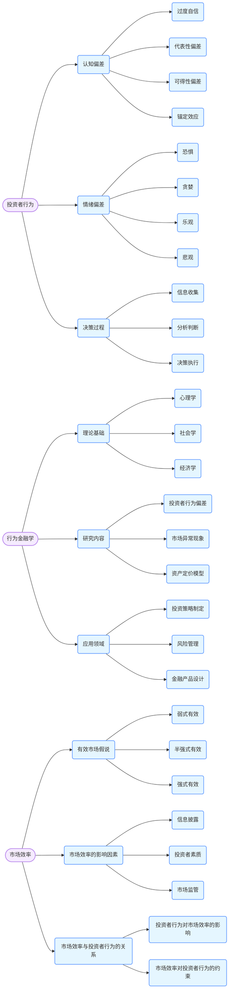

# 约翰·伯格的投资者行为研究：为什么大多数人表现不佳

> 关键词：约翰·伯格、投资者行为、投资表现、行为金融学、市场效率

> 摘要：本文深入探讨约翰·伯格对投资者行为的研究，旨在剖析为何大多数投资者在金融市场中的表现不尽如人意。通过对伯格相关理论的梳理，结合行为金融学的知识，从投资者的心理、决策过程等多个角度进行分析，并阐述其背后的原理和影响。同时，通过实际案例和数学模型来进一步说明问题，为投资者提供更深入的理解和启示，帮助他们更好地认识自身行为，提升投资表现。

## 1. 背景介绍 
### 1.1 目的和范围
本文的主要目的是全面解读约翰·伯格的投资者行为研究，重点聚焦于为何大多数投资者难以在金融市场中取得良好的表现。研究范围涵盖了伯格的核心观点、行为金融学的相关理论、投资者决策过程中的各种影响因素，以及实际市场中的案例分析。通过对这些内容的研究，为投资者提供理论支持和实践指导，帮助他们认识到自身行为的局限性，从而改进投资策略。

### 1.2 预期读者
本文预期读者包括广大的个人投资者、金融从业者、金融专业的学生以及对投资行为研究感兴趣的人士。对于个人投资者来说，了解这些内容可以帮助他们优化投资决策，提高投资收益；金融从业者可以从中获取新的视角和思路，更好地为客户服务；金融专业学生可以将其作为学习行为金融学和投资学的参考资料；对投资行为研究感兴趣的人士则可以深入了解相关领域的前沿知识。

### 1.3 文档结构概述
本文将按照以下结构进行阐述：首先介绍核心概念与联系，梳理约翰·伯格的相关理论以及与行为金融学的关系；接着讲解核心算法原理与具体操作步骤，通过Python代码模拟投资者的决策过程；然后介绍数学模型和公式，从理论层面分析投资者行为；之后通过项目实战，展示实际案例并进行详细解释；再探讨实际应用场景，说明这些研究成果在现实中的应用；接着推荐相关的工具和资源；最后总结未来发展趋势与挑战，并解答常见问题，提供扩展阅读和参考资料。

### 1.4 术语表
#### 1.4.1 核心术语定义
- **约翰·伯格**：现代指数基金的创始人，先锋集团（Vanguard Group）的创办者，对投资理论和实践有着深远的影响，他的研究主要关注投资者行为和市场效率。
- **投资者行为**：指投资者在金融市场中进行投资决策、交易等活动时的行为表现，包括心理因素、决策过程、投资策略等方面。
- **行为金融学**：将心理学、社会学等学科的理论与传统金融学相结合，研究投资者在金融市场中的行为偏差和决策过程的学科。
- **市场效率**：指市场价格反映所有可用信息的程度，包括弱式有效、半强式有效和强式有效市场。

#### 1.4.2 相关概念解释
- **认知偏差**：指投资者在认知过程中由于心理因素的影响而产生的偏差，如过度自信、损失厌恶、羊群效应等。这些偏差会导致投资者做出错误的决策。
- **情绪偏差**：投资者的情绪状态对投资决策产生的影响，如恐惧、贪婪等情绪会使投资者在市场波动时做出不理性的决策。
- **有效市场假说**：认为市场价格已经反映了所有可用信息，投资者无法通过分析信息来获得超额收益。约翰·伯格的研究在一定程度上对有效市场假说进行了补充和修正。

#### 1.4.3 缩略词列表
- **EMH**：有效市场假说（Efficient Market Hypothesis）
- **BF**：行为金融学（Behavioral Finance）

## 2. 核心概念与联系 

### 约翰·伯格的核心观点
约翰·伯格认为，大多数投资者表现不佳的主要原因在于投资者自身的行为偏差以及市场的复杂性。他强调投资者往往受到情绪和认知偏差的影响，做出不理性的投资决策。例如，投资者可能会过度自信，认为自己能够准确预测市场走势，从而频繁交易，增加交易成本；或者在市场下跌时因恐惧而卖出股票，错过后续的反弹机会。

### 行为金融学与投资者行为的联系
行为金融学为解释投资者行为提供了理论基础。它认为投资者并非完全理性的经济人，而是受到心理和情绪因素的影响。认知偏差和情绪偏差会导致投资者的决策偏离传统金融学所假设的理性决策模型。例如，损失厌恶理论指出，投资者对损失的敏感程度要远高于对收益的敏感程度，这会导致他们在面对损失时采取过度保守的策略，而在面对收益时又过于冒险。

### 市场效率与投资者行为的关系
市场效率理论认为市场价格能够迅速反映所有可用信息。然而，投资者的行为偏差可能会导致市场价格偏离其内在价值。例如，当投资者出现羊群效应时，会导致股票价格过度波动，偏离其真实价值。约翰·伯格认为，投资者应该认识到市场的复杂性和不确定性，采取长期投资、分散投资等策略，以应对市场的变化。

### 文本示意图
```plaintext
投资者行为
├── 认知偏差
│   ├── 过度自信
│   ├── 代表性偏差
│   ├── 可得性偏差
│   └── 锚定效应
├── 情绪偏差
│   ├── 恐惧
│   ├── 贪婪
│   ├── 乐观
│   └── 悲观
└── 决策过程
    ├── 信息收集
    ├── 分析判断
    └── 决策执行

行为金融学
├── 理论基础
│   ├── 心理学
│   ├── 社会学
│   └── 经济学
├── 研究内容
│   ├── 投资者行为偏差
│   ├── 市场异常现象
│   └── 资产定价模型
└── 应用领域
    ├── 投资策略制定
    ├── 风险管理
    └── 金融产品设计

市场效率
├── 有效市场假说
│   ├── 弱式有效
│   ├── 半强式有效
│   └── 强式有效
├── 市场效率的影响因素
│   ├── 信息披露
│   ├── 投资者素质
│   └── 市场监管
└── 市场效率与投资者行为的关系
    ├── 投资者行为对市场效率的影响
    └── 市场效率对投资者行为的约束
```

### Mermaid 流程图


## 3. 核心算法原理 & 具体操作步骤 

### 模拟投资者决策过程的算法原理
我们可以通过一个简单的Python代码来模拟投资者的决策过程。假设投资者在面对市场涨跌时，会根据自己的情绪和认知偏差做出决策。我们用一个随机数来模拟市场的涨跌情况，用不同的参数来表示投资者的情绪和认知偏差。

### Python源代码实现
```python
import random

# 定义投资者类
class Investor:
    def __init__(self, initial_funds, overconfidence=0.5, loss_aversion=0.5):
        self.funds = initial_funds  # 初始资金
        self.overconfidence = overconfidence  # 过度自信程度，范围0-1
        self.loss_aversion = loss_aversion  # 损失厌恶程度，范围0-1
        self.stock_holding = 0  # 持有的股票数量

    def make_decision(self, market_change):
        # 模拟投资者的决策过程
        if market_change > 0:
            # 市场上涨
            if random.random() < self.overconfidence:
                # 过度自信的投资者会买入股票
                amount_to_buy = self.funds * 0.2  # 买入20%的资金
                self.funds -= amount_to_buy
                self.stock_holding += amount_to_buy / (1 + market_change)
        else:
            # 市场下跌
            if random.random() < self.loss_aversion:
                # 损失厌恶的投资者会卖出股票
                amount_to_sell = self.stock_holding * 0.2  # 卖出20%的股票
                self.stock_holding -= amount_to_sell
                self.funds += amount_to_sell * (1 + market_change)

    def get_total_value(self, current_price):
        # 计算投资者的总价值
        return self.funds + self.stock_holding * current_price

# 模拟市场变化
def simulate_market(num_periods):
    market_changes = []
    for _ in range(num_periods):
        market_changes.append(random.uniform(-0.1, 0.1))  # 市场涨跌范围在-10%到10%之间
    return market_changes

# 模拟投资过程
def simulate_investment(initial_funds, num_periods, overconfidence=0.5, loss_aversion=0.5):
    investor = Investor(initial_funds, overconfidence, loss_aversion)
    market_changes = simulate_market(num_periods)
    current_price = 1  # 初始股票价格
    values = []
    for change in market_changes:
        current_price *= (1 + change)
        investor.make_decision(change)
        values.append(investor.get_total_value(current_price))
    return values

# 主程序
if __name__ == "__main__":
    initial_funds = 10000
    num_periods = 100
    overconfidence = 0.7
    loss_aversion = 0.8
    values = simulate_investment(initial_funds, num_periods, overconfidence, loss_aversion)
    print("最终资产价值:", values[-1])
```

### 具体操作步骤
1. **定义投资者类**：在`Investor`类中，我们定义了投资者的初始资金、过度自信程度和损失厌恶程度，以及持有的股票数量。
2. **模拟市场变化**：`simulate_market`函数生成一系列随机的市场涨跌情况。
3. **模拟投资过程**：`simulate_investment`函数模拟投资者在不同市场变化下的决策过程，并记录每个时期的资产价值。
4. **运行主程序**：设置初始资金、投资周期、过度自信程度和损失厌恶程度，调用`simulate_investment`函数进行模拟，并输出最终的资产价值。

## 4. 数学模型和公式 & 详细讲解 & 举例说明 

### 投资者决策模型
我们可以用一个简单的数学模型来描述投资者的决策过程。假设投资者在第 $t$ 期的资金为 $F_t$，持有的股票数量为 $S_t$，股票价格为 $P_t$，市场变化率为 $r_t$。

投资者在市场上涨时（$r_t > 0$），如果过度自信程度为 $\alpha$，则买入的资金量为 $B_t = \alpha F_t$，买入的股票数量为 $\Delta S_t = \frac{B_t}{P_t(1 + r_t)}$。

投资者在市场下跌时（$r_t < 0$），如果损失厌恶程度为 $\beta$，则卖出的股票数量为 $S_{sell,t} = \beta S_t$，卖出获得的资金量为 $F_{sell,t} = S_{sell,t} P_t(1 + r_t)$。

投资者在第 $t + 1$ 期的资金和股票数量分别为：

$$F_{t + 1} = F_t - B_t + F_{sell,t}$$

$$S_{t + 1} = S_t + \Delta S_t - S_{sell,t}$$

### 举例说明
假设投资者初始资金 $F_0 = 10000$，初始股票数量 $S_0 = 0$，股票价格 $P_0 = 1$。在第 1 期，市场变化率 $r_1 = 0.05$（上涨 5%），投资者的过度自信程度 $\alpha = 0.2$。

则买入的资金量 $B_1 = 0.2 \times 10000 = 2000$，买入的股票数量 $\Delta S_1 = \frac{2000}{1 \times (1 + 0.05)} \approx 1904.76$。

第 1 期结束后，投资者的资金 $F_1 = 10000 - 2000 = 8000$，股票数量 $S_1 = 1904.76$。

在第 2 期，市场变化率 $r_2 = -0.03$（下跌 3%），投资者的损失厌恶程度 $\beta = 0.1$。

则卖出的股票数量 $S_{sell,2} = 0.1 \times 1904.76 \approx 190.48$，卖出获得的资金量 $F_{sell,2} = 190.48 \times 1 \times (1 - 0.03) \approx 184.76$。

第 2 期结束后，投资者的资金 $F_2 = 8000 + 184.76 = 8184.76$，股票数量 $S_2 = 1904.76 - 190.48 = 1714.28$。

### 数学模型的意义
这个数学模型可以帮助我们理解投资者在不同市场情况下的决策过程，以及这些决策如何影响投资者的资产价值。通过调整过度自信程度和损失厌恶程度等参数，我们可以模拟不同类型投资者的行为，从而分析投资者行为对投资表现的影响。

## 5. 项目实战：代码实际案例和详细解释说明 

### 5.1  开发环境搭建
- **Python 安装**：首先需要安装 Python 环境，建议使用 Python 3.7 及以上版本。可以从 Python 官方网站（https://www.python.org/downloads/）下载安装包进行安装。
- **IDE 选择**：推荐使用 PyCharm 作为开发工具，它是一款功能强大的 Python 集成开发环境，提供了代码编辑、调试、版本控制等多种功能。可以从 JetBrains 官方网站（https://www.jetbrains.com/pycharm/）下载安装。
- **依赖库安装**：本项目只需要 Python 内置库，无需额外安装依赖库。

### 5.2  源代码详细实现和代码解读
```python
import random

# 定义投资者类
class Investor:
    def __init__(self, initial_funds, overconfidence=0.5, loss_aversion=0.5):
        self.funds = initial_funds  # 初始资金
        self.overconfidence = overconfidence  # 过度自信程度，范围0-1
        self.loss_aversion = loss_aversion  # 损失厌恶程度，范围0-1
        self.stock_holding = 0  # 持有的股票数量

    def make_decision(self, market_change):
        # 模拟投资者的决策过程
        if market_change > 0:
            # 市场上涨
            if random.random() < self.overconfidence:
                # 过度自信的投资者会买入股票
                amount_to_buy = self.funds * 0.2  # 买入20%的资金
                self.funds -= amount_to_buy
                self.stock_holding += amount_to_buy / (1 + market_change)
        else:
            # 市场下跌
            if random.random() < self.loss_aversion:
                # 损失厌恶的投资者会卖出股票
                amount_to_sell = self.stock_holding * 0.2  # 卖出20%的股票
                self.stock_holding -= amount_to_sell
                self.funds += amount_to_sell * (1 + market_change)

    def get_total_value(self, current_price):
        # 计算投资者的总价值
        return self.funds + self.stock_holding * current_price

# 模拟市场变化
def simulate_market(num_periods):
    market_changes = []
    for _ in range(num_periods):
        market_changes.append(random.uniform(-0.1, 0.1))  # 市场涨跌范围在-10%到10%之间
    return market_changes

# 模拟投资过程
def simulate_investment(initial_funds, num_periods, overconfidence=0.5, loss_aversion=0.5):
    investor = Investor(initial_funds, overconfidence, loss_aversion)
    market_changes = simulate_market(num_periods)
    current_price = 1  # 初始股票价格
    values = []
    for change in market_changes:
        current_price *= (1 + change)
        investor.make_decision(change)
        values.append(investor.get_total_value(current_price))
    return values

# 主程序
if __name__ == "__main__":
    initial_funds = 10000
    num_periods = 100
    overconfidence = 0.7
    loss_aversion = 0.8
    values = simulate_investment(initial_funds, num_periods, overconfidence, loss_aversion)
    print("最终资产价值:", values[-1])
```

### 代码解读与分析
- **投资者类（`Investor`）**：
  - `__init__` 方法：初始化投资者的初始资金、过度自信程度、损失厌恶程度和持有的股票数量。
  - `make_decision` 方法：根据市场变化和投资者的情绪偏差做出决策。当市场上涨时，过度自信的投资者会买入股票；当市场下跌时，损失厌恶的投资者会卖出股票。
  - `get_total_value` 方法：计算投资者的总价值，包括资金和股票的价值。
- **模拟市场变化函数（`simulate_market`）**：生成一系列随机的市场涨跌情况，涨跌范围在 -10% 到 10% 之间。
- **模拟投资过程函数（`simulate_investment`）**：创建投资者对象，模拟市场变化，调用投资者的决策方法，并记录每个时期的资产价值。
- **主程序**：设置初始资金、投资周期、过度自信程度和损失厌恶程度，调用 `simulate_investment` 函数进行模拟，并输出最终的资产价值。

通过这个代码案例，我们可以看到投资者的情绪偏差如何影响投资决策，进而影响投资表现。过度自信和损失厌恶的投资者可能会在市场波动时做出不理性的决策，导致资产价值下降。

## 6. 实际应用场景 

### 个人投资者
对于个人投资者来说，了解约翰·伯格的投资者行为研究可以帮助他们认识到自己的行为偏差，从而改进投资策略。例如，投资者可以意识到自己的过度自信，避免频繁交易，采用长期投资策略；同时，认识到损失厌恶的影响，避免在市场下跌时盲目卖出股票。

### 金融机构
金融机构可以利用这些研究成果来更好地了解客户的需求和行为，为客户提供更个性化的投资建议和服务。例如，根据客户的风险承受能力和情绪偏差，为客户制定合适的投资组合，帮助客户实现投资目标。

### 市场监管机构
市场监管机构可以通过研究投资者行为，制定相应的政策和法规，保护投资者的利益，维护市场的稳定和公平。例如，加强信息披露要求，减少投资者的信息不对称；加强对投资者教育，提高投资者的素质和风险意识。

### 学术研究
约翰·伯格的投资者行为研究为学术研究提供了重要的理论和实证基础。学者们可以进一步深入研究投资者行为的影响因素和机制，探索更有效的投资策略和风险管理方法。

## 7. 工具和资源推荐
### 7.1 学习资源推荐
#### 7.1.1 书籍推荐
- 《漫步华尔街》（A Random Walk Down Wall Street）：作者是伯顿·马尔基尔（Burton Malkiel），这本书介绍了有效市场假说和投资策略，对投资者行为有深入的探讨。
- 《思考，快与慢》（Thinking, Fast and Slow）：作者是丹尼尔·卡尼曼（Daniel Kahneman），这本书是行为经济学的经典著作，介绍了人类的认知偏差和决策过程。
- 《聪明的投资者》（The Intelligent Investor）：作者是本杰明·格雷厄姆（Benjamin Graham），这本书是价值投资的经典著作，强调投资者的理性和耐心。

#### 7.1.2 在线课程
- Coursera 上的“Behavioral Finance”课程：由知名教授授课，系统地介绍了行为金融学的理论和应用。
- edX 上的“Investment Strategies”课程：提供了投资策略的深入讲解，包括投资者行为对投资决策的影响。

#### 7.1.3 技术博客和网站
- 雪球网（https://xueqiu.com/）：是一个专注于投资交流的社区，提供了丰富的投资资讯和投资者的经验分享。
- 金融界（https://www.jrj.com.cn/）：提供全面的金融信息和市场分析，有助于投资者了解市场动态和投资者行为。

### 7.2 开发工具框架推荐
#### 7.2.1 IDE和编辑器
- PyCharm：功能强大的 Python 集成开发环境，适合开发和调试 Python 代码。
- Jupyter Notebook：交互式的开发环境，适合进行数据分析和可视化，方便验证投资模型和算法。

#### 7.2.2 调试和性能分析工具
- pdb：Python 内置的调试工具，用于调试 Python 代码。
- cProfile：Python 内置的性能分析工具，用于分析代码的性能瓶颈。

#### 7.2.3 相关框架和库
- Pandas：用于数据处理和分析，方便处理金融数据。
- Matplotlib：用于数据可视化，帮助投资者直观地了解投资表现。

### 7.3 相关论文著作推荐
#### 7.3.1 经典论文
- “Efficient Capital Markets: A Review of Theory and Empirical Work” by Eugene F. Fama：这篇论文提出了有效市场假说，对金融市场的研究产生了深远的影响。
- “Prospect Theory: An Analysis of Decision under Risk” by Daniel Kahneman and Amos Tversky：这篇论文提出了前景理论，解释了投资者在面对风险时的决策行为。

#### 7.3.2 最新研究成果
- 可以关注《Journal of Finance》、《Review of Financial Studies》等顶级金融学术期刊，了解投资者行为研究的最新进展。

#### 7.3.3 应用案例分析
- 可以参考一些金融机构的研究报告和案例分析，了解投资者行为研究在实际应用中的效果和经验。

## 8. 总结：未来发展趋势与挑战

### 未来发展趋势
- **跨学科研究的深入**：投资者行为研究将更加注重跨学科的融合，结合心理学、社会学、神经科学等多学科的知识，深入探讨投资者行为的内在机制。
- **大数据和人工智能的应用**：利用大数据和人工智能技术，可以更全面地收集和分析投资者的行为数据，为投资者提供更精准的投资建议和风险管理方案。
- **个性化投资服务的发展**：随着投资者对个性化投资服务的需求增加，金融机构将根据投资者的行为特征和风险偏好，提供更加个性化的投资产品和服务。

### 挑战
- **数据隐私和安全问题**：在收集和分析投资者行为数据的过程中，需要注意保护投资者的隐私和数据安全，避免数据泄露和滥用。
- **行为偏差的复杂性**：投资者的行为偏差是复杂多样的，而且受到多种因素的影响，如何准确地识别和纠正这些偏差是一个挑战。
- **市场环境的变化**：金融市场环境不断变化，投资者的行为也会随之变化，如何及时调整投资策略和风险管理方法以适应市场变化是一个重要的挑战。

## 9. 附录：常见问题与解答

### 1. 什么是投资者行为偏差？
投资者行为偏差是指投资者在投资决策过程中由于心理和情绪因素的影响而产生的偏差。常见的行为偏差包括过度自信、损失厌恶、羊群效应等。这些偏差会导致投资者做出不理性的决策，影响投资表现。

### 2. 如何避免投资者行为偏差？
投资者可以通过学习投资知识，提高自己的投资素养；制定合理的投资计划和风险控制策略；保持冷静和理性，避免情绪化决策等方式来避免行为偏差。同时，投资者也可以寻求专业的投资顾问的帮助。

### 3. 约翰·伯格的研究对投资者有什么启示？
约翰·伯格的研究启示投资者要认识到自己的行为偏差，避免频繁交易，采用长期投资、分散投资等策略；要相信市场的有效性，不要试图通过预测市场走势来获取超额收益；要保持耐心和理性，避免受到情绪的影响。

### 4. 行为金融学与传统金融学有什么区别？
传统金融学假设投资者是完全理性的，市场是有效的，资产价格能够反映所有可用信息。而行为金融学认为投资者并非完全理性，存在认知偏差和情绪偏差，这些偏差会导致市场价格偏离其内在价值。行为金融学结合了心理学、社会学等学科的知识，更注重对投资者行为的研究。

## 10. 扩展阅读 & 参考资料

### 扩展阅读
- 《金融心理学》（Psychology of Finance）：深入探讨了金融市场中的心理因素和投资者行为。
- 《非理性繁荣》（Irrational Exuberance）：分析了金融市场中的泡沫现象和投资者的非理性行为。

### 参考资料
- 约翰·伯格的相关著作和演讲。
- 行为金融学领域的学术论文和研究报告。
- 金融市场的统计数据和案例分析。

作者：AI天才研究院/AI Genius Institute & 禅与计算机程序设计艺术 /Zen And The Art of Computer Programming