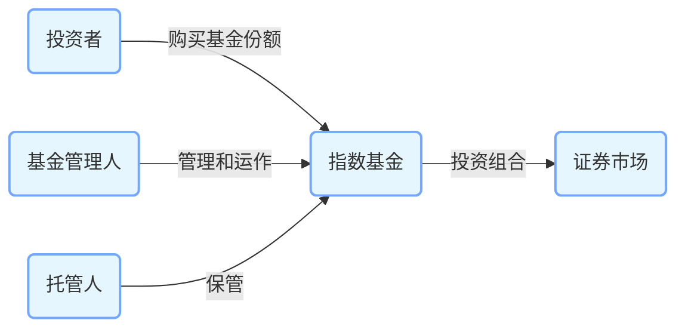

# 约翰·伯格的指数基金投资理论

> 关键词：约翰·伯格、指数基金、投资理论、市场效率、长期投资

> 摘要：本文深入探讨了约翰·伯格的指数基金投资理论。首先介绍了该理论产生的背景，包括其目的、预期读者和文档结构等。接着阐述了指数基金的核心概念、原理及架构，通过Python代码详细讲解了核心算法原理和具体操作步骤。从数学模型和公式的角度对该理论进行了剖析，并给出举例说明。以实际项目案例展示了指数基金投资的代码实现和解读。分析了指数基金在不同场景下的实际应用，推荐了相关的学习资源、开发工具框架以及论文著作。最后总结了该理论的未来发展趋势与挑战，解答了常见问题，并提供了扩展阅读和参考资料，旨在帮助读者全面理解和应用约翰·伯格的指数基金投资理论。

## 1. 背景介绍 
### 1.1 目的和范围
约翰·伯格（John C. Bogle）是美国投资界的传奇人物，他创立了先锋集团（Vanguard Group），并大力推广指数基金投资。本文的目的在于深入研究约翰·伯格的指数基金投资理论，详细剖析其核心原理、实际应用及发展前景。范围涵盖指数基金的基本概念、投资策略、数学模型、实际案例以及相关的工具和资源等方面，旨在为投资者、金融从业者和对投资理论感兴趣的人士提供全面而深入的知识体系。

### 1.2 预期读者
本文的预期读者包括：
- 个人投资者：希望通过了解指数基金投资理论，优化自己的投资组合，实现资产的稳健增值。
- 金融从业者：如基金经理、投资顾问等，需要深入研究该理论，为客户提供更专业的投资建议。
- 学术研究人员：对投资理论和金融市场有研究兴趣，希望从理论和实践的角度深入探讨指数基金的相关问题。
- 学生群体：学习金融、投资等相关专业的学生，通过本文可以系统地了解指数基金投资理论，为今后的学习和实践打下基础。

### 1.3 文档结构概述
本文将按照以下结构进行阐述：
- 核心概念与联系：介绍指数基金的基本概念、原理和架构，通过文本示意图和Mermaid流程图进行直观展示。
- 核心算法原理 & 具体操作步骤：使用Python代码详细讲解指数基金投资的核心算法原理和具体操作步骤。
- 数学模型和公式 & 详细讲解 & 举例说明：运用数学模型和公式对指数基金投资进行分析，并给出具体的举例说明。
- 项目实战：代码实际案例和详细解释说明：通过实际项目案例，展示指数基金投资的代码实现和详细解读。
- 实际应用场景：分析指数基金在不同场景下的实际应用。
- 工具和资源推荐：推荐相关的学习资源、开发工具框架以及论文著作。
- 总结：未来发展趋势与挑战：总结指数基金投资理论的未来发展趋势和面临的挑战。
- 附录：常见问题与解答：解答读者在学习和应用指数基金投资理论过程中常见的问题。
- 扩展阅读 & 参考资料：提供相关的扩展阅读材料和参考资料，方便读者进一步深入学习。

### 1.4 术语表
#### 1.4.1 核心术语定义
- **指数基金**：是一种按照特定指数（如沪深300指数、标普500指数等）的成分股组成及权重进行投资的基金，旨在复制该指数的表现。
- **市场效率**：指市场价格能够充分反映所有可用信息的程度。在有效市场中，资产价格能够迅速调整以反映新的信息。
- **长期投资**：指投资者持有资产的时间较长，通常为数年甚至数十年，以获取资产的长期增值。
- **被动投资**：指投资者不主动进行选股和择时，而是通过投资指数基金等方式，跟随市场指数的表现获取收益。

#### 1.4.2 相关概念解释
- **跟踪误差**：指指数基金的收益率与所跟踪指数收益率之间的差异。跟踪误差越小，说明指数基金对指数的复制效果越好。
- **基金管理费**：指基金管理人为管理和运作基金而向基金投资者收取的费用。指数基金的管理费通常较低。
- **红利再投资**：指将基金分红所得的现金自动再投资于该基金，以增加基金份额，实现复利增长。

#### 1.4.3 缩略词列表
- **ETF**：交易型开放式指数基金（Exchange Traded Fund），是一种在证券交易所上市交易的指数基金。
- **LOF**：上市型开放式基金（Listed Open-Ended Fund），既可以在证券交易所上市交易，也可以在基金公司进行申购和赎回。

## 2. 核心概念与联系 
### 指数基金的基本概念
指数基金是一种被动投资工具，它通过购买某一特定指数的全部或部分成分股，来跟踪该指数的表现。例如，沪深300指数基金就是以沪深300指数为跟踪标的，按照该指数的成分股组成及权重进行投资。指数基金的特点是低成本、分散化投资和透明度高。

### 指数基金的原理
指数基金的原理基于市场效率理论。在有效市场中，资产价格能够充分反映所有可用信息，因此主动选股和择时很难获得超越市场平均水平的收益。指数基金通过复制指数的成分股组成及权重，避免了主动投资的选股和择时风险，从而获得市场平均收益。

### 指数基金的架构
指数基金的架构主要包括基金管理人、托管人、投资者和证券市场。基金管理人负责基金的投资运作和管理，托管人负责保管基金资产，投资者通过购买基金份额参与投资，证券市场则为基金的投资提供了交易场所。

### 文本示意图
```plaintext
指数基金架构

投资者 --> 购买基金份额 --> 指数基金
指数基金 --> 投资组合（成分股） --> 证券市场
基金管理人 --> 管理和运作基金
托管人 --> 保管基金资产
```

### Mermaid流程图


## 3. 核心算法原理 & 具体操作步骤 
### 核心算法原理
指数基金的核心算法原理是根据所跟踪指数的成分股组成及权重，计算出基金的投资组合。假设某指数有 $n$ 只成分股，第 $i$ 只成分股的权重为 $w_i$，基金的总资产为 $A$，则第 $i$ 只成分股的投资金额为 $A \times w_i$。

### Python代码实现
```python
import pandas as pd

# 假设指数成分股信息，包含股票代码和权重
index_components = {
    'stock_code': ['000001', '000002', '000003'],
    'weight': [0.3, 0.5, 0.2]
}
df = pd.DataFrame(index_components)

# 基金总资产
total_asset = 1000000

# 计算每只成分股的投资金额
df['investment_amount'] = df['weight'] * total_asset

print(df)
```
### 代码解释
1. 导入 `pandas` 库，用于数据处理和分析。
2. 定义指数成分股信息，包括股票代码和权重。
3. 创建 `DataFrame` 对象，存储指数成分股信息。
4. 设定基金总资产为 1000000。
5. 计算每只成分股的投资金额，即权重乘以基金总资产。
6. 打印计算结果。

### 具体操作步骤
1. **确定跟踪指数**：选择要跟踪的指数，如沪深300指数、标普500指数等。
2. **获取指数成分股信息**：通过金融数据提供商或相关网站，获取所跟踪指数的成分股组成及权重。
3. **计算投资组合**：根据指数成分股信息和基金总资产，计算出每只成分股的投资金额。
4. **进行投资交易**：按照计算出的投资组合，在证券市场上进行股票买卖交易。
5. **定期调整投资组合**：由于指数成分股会定期调整，基金的投资组合也需要相应调整，以保证跟踪效果。

## 4. 数学模型和公式 & 详细讲解 & 举例说明 
### 数学模型和公式
#### 投资组合的计算
假设某指数有 $n$ 只成分股，第 $i$ 只成分股的权重为 $w_i$，基金的总资产为 $A$，则第 $i$ 只成分股的投资金额 $I_i$ 为：
$$I_i = A \times w_i$$
其中，$\sum_{i=1}^{n} w_i = 1$。

#### 基金收益率的计算
基金的收益率 $R_f$ 可以通过以下公式计算：
$$R_f = \sum_{i=1}^{n} w_i \times R_i$$
其中，$R_i$ 为第 $i$ 只成分股的收益率。

### 详细讲解
- **投资组合的计算**：根据指数成分股的权重和基金总资产，计算出每只成分股的投资金额，确保基金的投资组合与指数的成分股组成及权重一致。
- **基金收益率的计算**：基金的收益率是由每只成分股的收益率加权平均得到的，权重为各成分股在指数中的权重。

### 举例说明
假设某指数有 3 只成分股，权重分别为 0.3、0.5 和 0.2，基金总资产为 1000000。各成分股的收益率分别为 0.1、0.2 和 0.15。

#### 投资组合的计算
第 1 只成分股的投资金额：$I_1 = 1000000 \times 0.3 = 300000$
第 2 只成分股的投资金额：$I_2 = 1000000 \times 0.5 = 500000$
第 3 只成分股的投资金额：$I_3 = 1000000 \times 0.2 = 200000$

#### 基金收益率的计算
基金收益率：$R_f = 0.3 \times 0.1 + 0.5 \times 0.2 + 0.2 \times 0.15 = 0.16$

即基金的收益率为 16%。

## 5. 项目实战：代码实际案例和详细解释说明 
### 5.1  开发环境搭建
#### 安装Python
首先，需要安装Python环境。可以从Python官方网站（https://www.python.org/downloads/）下载适合自己操作系统的Python版本，并按照安装向导进行安装。

#### 安装必要的库
在Python环境中，需要安装一些必要的库，如 `pandas`、`numpy`、`yfinance` 等。可以使用以下命令进行安装：
```sh
pip install pandas numpy yfinance
```

### 5.2  源代码详细实现和代码解读
```python
import yfinance as yf
import pandas as pd
import numpy as np

# 定义指数成分股代码
stock_codes = ['AAPL', 'MSFT', 'AMZN']

# 下载股票数据
start_date = '2020-01-01'
end_date = '2021-01-01'
data = yf.download(stock_codes, start=start_date, end=end_date)['Close']

# 计算每日收益率
returns = data.pct_change().dropna()

# 假设权重
weights = np.array([0.3, 0.5, 0.2])

# 计算投资组合的每日收益率
portfolio_returns = (returns * weights).sum(axis=1)

# 计算投资组合的累计收益率
cumulative_returns = (1 + portfolio_returns).cumprod()

# 绘制累计收益率曲线
import matplotlib.pyplot as plt
plt.plot(cumulative_returns)
plt.title('Portfolio Cumulative Returns')
plt.xlabel('Date')
plt.ylabel('Cumulative Returns')
plt.show()
```

### 代码解读
1. **导入必要的库**：导入 `yfinance` 用于下载股票数据，`pandas` 用于数据处理，`numpy` 用于数值计算，`matplotlib.pyplot` 用于绘制图表。
2. **定义指数成分股代码**：定义要投资的指数成分股代码。
3. **下载股票数据**：使用 `yfinance` 下载指定日期范围内的股票收盘价数据。
4. **计算每日收益率**：使用 `pct_change()` 方法计算每日收益率，并去除缺失值。
5. **假设权重**：假设各成分股的权重。
6. **计算投资组合的每日收益率**：将各成分股的每日收益率乘以权重，并求和得到投资组合的每日收益率。
7. **计算投资组合的累计收益率**：使用 `cumprod()` 方法计算投资组合的累计收益率。
8. **绘制累计收益率曲线**：使用 `matplotlib.pyplot` 绘制投资组合的累计收益率曲线。

### 5.3  代码解读与分析
通过上述代码，我们可以模拟一个简单的指数基金投资组合，并计算其累计收益率。从代码中可以看出，指数基金的投资组合是根据各成分股的权重进行构建的，通过计算各成分股的收益率和权重的加权平均，得到投资组合的收益率。累计收益率曲线可以直观地展示投资组合的表现。

## 6. 实际应用场景 
### 个人投资者的资产配置
对于个人投资者来说，指数基金是一种非常适合的资产配置工具。通过投资指数基金，个人投资者可以以较低的成本获得市场平均收益，同时实现资产的分散化投资，降低投资风险。例如，一个年轻的投资者可以将大部分资产投资于宽基指数基金，如沪深300指数基金、中证500指数基金等，以获取市场的长期增长收益。

### 机构投资者的风险管理
机构投资者，如保险公司、养老基金等，通常需要进行大规模的资产配置和风险管理。指数基金可以作为一种有效的风险管理工具，帮助机构投资者降低投资组合的风险。例如，机构投资者可以通过投资指数基金来跟踪市场指数，避免主动投资的选股和择时风险。

### 长期投资计划
指数基金非常适合长期投资计划。由于指数基金的投资策略是跟踪市场指数，长期来看，市场指数通常会呈现上涨趋势，因此投资者可以通过长期持有指数基金获得资产的增值。例如，一个投资者可以制定一个长达 20 年的指数基金投资计划，每月定期定额投资指数基金，以实现资产的长期增长。

### 退休规划
对于即将退休或已经退休的投资者来说，指数基金也是一种重要的退休规划工具。通过投资指数基金，投资者可以在退休后获得稳定的现金流，同时保证资产的保值增值。例如，一个退休投资者可以将一部分资产投资于股息率较高的指数基金，以获取稳定的股息收入。

## 7. 工具和资源推荐
### 7.1 学习资源推荐
#### 7.1.1 书籍推荐
- 《聪明的投资者》（The Intelligent Investor）：本杰明·格雷厄姆（Benjamin Graham）著，是价值投资领域的经典著作，对指数基金投资也有一定的指导意义。
- 《漫步华尔街》（A Random Walk Down Wall Street）：伯顿·马尔基尔（Burton G. Malkiel）著，介绍了市场效率理论和指数基金投资的优势。
- 《约翰·伯格的投资常识》（The Little Book of Common Sense Investing）：约翰·伯格（John C. Bogle）著，是指数基金投资的经典之作，详细阐述了指数基金的投资理念和策略。

#### 7.1.2 在线课程
- Coursera上的“投资学原理”（Principles of Investing）课程：由普林斯顿大学教授伯顿·马尔基尔（Burton G. Malkiel）授课，介绍了投资的基本原理和指数基金投资的相关知识。
- edX上的“金融市场”（Financial Markets）课程：由耶鲁大学教授罗伯特·席勒（Robert J. Shiller）授课，涵盖了金融市场的各个方面，包括指数基金投资。

#### 7.1.3 技术博客和网站
- 晨星网（Morningstar）：提供基金评级、分析和研究报告，是投资者了解指数基金的重要信息来源。
- 雪球网（Xueqiu）：一个投资社区，投资者可以在上面交流指数基金投资的经验和心得。
- 且慢网（Qieman）：提供基金投资组合策略和服务，帮助投资者进行指数基金投资。

### 7.2 开发工具框架推荐
#### 7.2.1 IDE和编辑器
- PyCharm：一款专业的Python集成开发环境，提供代码编辑、调试、版本控制等功能，适合开发指数基金投资相关的Python代码。
- Jupyter Notebook：一个交互式的开发环境，支持Python、R等多种编程语言，适合进行数据探索和分析，在指数基金投资的数据分析和建模中非常有用。

#### 7.2.2 调试和性能分析工具
- pdb：Python自带的调试工具，可以帮助开发者调试代码，查找代码中的错误。
- cProfile：Python的性能分析工具，可以分析代码的执行时间和内存使用情况，帮助开发者优化代码性能。

#### 7.2.3 相关框架和库
- pandas：一个强大的数据处理和分析库，提供了数据结构和数据操作方法，在指数基金投资的数据处理和分析中非常常用。
- numpy：一个用于科学计算的库，提供了高效的数组操作和数学函数，在指数基金投资的数值计算中非常有用。
- yfinance：一个用于下载股票数据的Python库，可以方便地获取股票的历史价格、成交量等信息。

### 7.3 相关论文著作推荐
#### 7.3.1 经典论文
- 《有效资本市场：理论与实证研究回顾》（Efficient Capital Markets: A Review of Theory and Empirical Work）：尤金·法玛（Eugene F. Fama）著，提出了有效市场假说，为指数基金投资提供了理论基础。
- 《资产定价的套利理论》（Arbitrage Theory of Capital Asset Pricing）：斯蒂芬·罗斯（Stephen A. Ross）著，介绍了套利定价理论，对指数基金投资的定价和风险分析有一定的参考价值。

#### 7.3.2 最新研究成果
- 可以关注《金融研究》、《经济研究》等国内顶级金融学术期刊，以及Journal of Finance、Review of Financial Studies等国际知名金融学术期刊，获取指数基金投资的最新研究成果。

#### 7.3.3 应用案例分析
- 可以参考各大基金公司的研究报告和投资策略报告，了解指数基金在实际投资中的应用案例和分析方法。

## 8. 总结：未来发展趋势与挑战
### 未来发展趋势
- **规模持续增长**：随着投资者对指数基金投资理念的认识不断提高，指数基金的规模有望继续保持增长。特别是在全球范围内，指数基金已经成为一种主流的投资工具，未来在国内市场也将有更大的发展空间。
- **产品创新不断**：基金公司将不断推出新的指数基金产品，以满足投资者多样化的投资需求。例如，除了传统的宽基指数基金，还将出现更多的行业指数基金、主题指数基金等。
- **智能化投资服务**：随着人工智能和大数据技术的发展，指数基金投资将越来越智能化。投资者可以通过智能投顾平台，根据自己的风险偏好和投资目标，自动生成指数基金投资组合。

### 挑战
- **市场竞争加剧**：随着指数基金市场的不断发展，市场竞争将越来越激烈。基金公司需要不断降低成本、提高服务质量，以吸引更多的投资者。
- **跟踪误差控制**：虽然指数基金的目标是跟踪指数的表现，但由于各种因素的影响，如交易成本、成分股调整等，指数基金可能会出现跟踪误差。基金公司需要采取有效的措施，控制跟踪误差，提高指数基金的跟踪效果。
- **投资者教育不足**：目前，仍有很多投资者对指数基金投资理念缺乏了解，存在一些误解。需要加强投资者教育，提高投资者对指数基金的认识和理解，引导投资者理性投资。

## 9. 附录：常见问题与解答
### 指数基金和主动管理型基金有什么区别？
指数基金是一种被动投资工具，它通过复制指数的成分股组成及权重，来跟踪指数的表现，不进行主动的选股和择时。而主动管理型基金则是由基金经理根据自己的判断和研究，主动选择股票进行投资，试图获得超越市场平均水平的收益。

### 指数基金的费用为什么比较低？
指数基金的费用比较低主要是因为其投资策略相对简单，不需要进行大量的研究和分析工作，也不需要频繁地进行交易。因此，指数基金的管理费、托管费等费用相对较低。

### 如何选择适合自己的指数基金？
选择适合自己的指数基金需要考虑以下几个因素：
- **投资目标**：根据自己的投资目标，如长期投资、短期投资、资产保值增值等，选择合适的指数基金。
- **风险偏好**：根据自己的风险偏好，选择不同风险水平的指数基金。例如，风险偏好较低的投资者可以选择宽基指数基金，风险偏好较高的投资者可以选择行业指数基金或主题指数基金。
- **跟踪误差**：选择跟踪误差较小的指数基金，以保证基金的表现与所跟踪指数的表现一致。
- **费用**：选择费用较低的指数基金，以降低投资成本。

### 指数基金可以进行定投吗？
可以。指数基金非常适合进行定投。通过定期定额投资指数基金，投资者可以平均成本，降低市场波动的影响，同时实现资产的长期增长。

## 10. 扩展阅读 & 参考资料
### 扩展阅读
- 《财务自由之路》（Rich Dad Poor Dad）：罗伯特·清崎（Robert Kiyosaki）著，介绍了财务自由的理念和方法，对投资者的理财规划有一定的启发。
- 《小狗钱钱》（The Puppy That Learned About Money）：博多·舍费尔（Bodo Schäfer）著，是一本适合初学者的理财启蒙书籍，通过生动有趣的故事，介绍了理财的基本知识和方法。

### 参考资料
- 约翰·伯格的相关著作和演讲
- 各大基金公司的研究报告和投资策略报告
- 金融学术期刊上的相关论文

作者：AI天才研究院/AI Genius Institute & 禅与计算机程序设计艺术 /Zen And The Art of Computer Programming