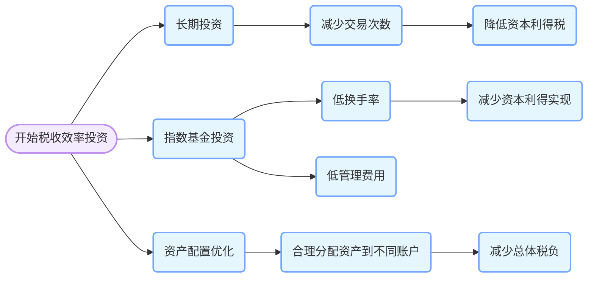

# 约翰·伯格的税收效率投资策略

> 关键词：约翰·伯格、税收效率、投资策略、指数基金、资产配置

> 摘要：本文深入探讨了约翰·伯格的税收效率投资策略。约翰·伯格作为投资领域的传奇人物，其提出的税收效率投资策略对于投资者降低税负、提高投资回报具有重要意义。文章首先介绍了该策略提出的背景，包括目的、预期读者、文档结构和相关术语。接着阐述了核心概念与联系，通过文本示意图和Mermaid流程图展示其原理和架构。详细讲解了核心算法原理和具体操作步骤，结合Python代码进行说明。分析了相关的数学模型和公式，并举例解释。通过项目实战案例，展示了该策略在实际中的应用，包括开发环境搭建、源代码实现和代码解读。还探讨了实际应用场景，推荐了学习该策略的工具和资源，最后总结了未来发展趋势与挑战，解答了常见问题并提供了扩展阅读和参考资料。

## 1. 背景介绍 
### 1.1 目的和范围
约翰·伯格的税收效率投资策略旨在帮助投资者在投资过程中最大程度地减少税收对投资回报的影响。在投资领域，税收是一个不可忽视的因素，它会直接削减投资者的实际收益。该策略的目的就是通过合理的资产配置、投资选择和交易时机把握等方法，降低投资者所需缴纳的税款，从而提高投资的净回报率。

本策略的范围涵盖了多种投资领域，包括股票市场、债券市场以及基金投资等。无论是个人投资者还是机构投资者，都可以根据自身的投资目标和风险承受能力，运用该策略来优化投资组合，实现税收效率的最大化。

### 1.2 预期读者
- **个人投资者**：对于普通个人投资者来说，税收效率投资策略可以帮助他们在有限的资金基础上，通过合理规划投资，减少税收支出，提高投资收益。例如，一位上班族利用业余时间进行股票和基金投资，通过运用该策略，可以在不增加额外风险的情况下，增加自己的财富积累。
- **机构投资者**：机构投资者管理着大量的资金，税收对其投资回报的影响更为显著。如养老基金、保险公司等，它们需要通过实施税收效率投资策略，来确保资产的稳健增长，满足客户的收益要求。
- **金融从业者**：包括投资顾问、理财规划师等，他们需要深入了解该策略，以便为客户提供更专业的投资建议和规划。

### 1.3 文档结构概述
本文将按照以下结构进行阐述：
- 核心概念与联系：介绍约翰·伯格税收效率投资策略的核心概念，通过文本示意图和Mermaid流程图展示其原理和架构。
- 核心算法原理 & 具体操作步骤：详细讲解该策略的核心算法原理，并结合Python代码说明具体操作步骤。
- 数学模型和公式 & 详细讲解 & 举例说明：分析相关的数学模型和公式，通过具体例子加深理解。
- 项目实战：通过实际案例展示该策略在实际投资中的应用，包括开发环境搭建、源代码实现和代码解读。
- 实际应用场景：探讨该策略在不同投资场景中的应用。
- 工具和资源推荐：推荐学习该策略的相关工具和资源，包括书籍、在线课程、技术博客等。
- 总结：总结未来发展趋势与挑战。
- 附录：解答常见问题。
- 扩展阅读 & 参考资料：提供相关的扩展阅读材料和参考资料。

### 1.4 术语表
#### 1.4.1 核心术语定义
- **税收效率**：指在投资过程中，通过合理的投资策略和方法，使投资者缴纳的税款占投资收益的比例最小化，从而提高投资的实际回报率。
- **指数基金**：一种按照特定指数（如沪深300指数、标普500指数等）的成分股组成及权重进行投资的基金。它具有成本低、分散风险等特点，是约翰·伯格税收效率投资策略中常用的投资工具。
- **资产配置**：指投资者根据自身的投资目标、风险承受能力等因素，将资金分配到不同类型的资产（如股票、债券、现金等）中，以实现投资组合的优化。

#### 1.4.2 相关概念解释
- **资本利得税**：是对投资者出售资产（如股票、基金等）所获得的利润征收的税款。在税收效率投资策略中，合理控制资本利得的实现时间和金额，可以降低资本利得税的支出。
- **股息税**：是对投资者从股票等投资中获得的股息收入征收的税款。不同类型的股息收入可能适用不同的税率，了解股息税的相关规定对于制定税收效率投资策略至关重要。

#### 1.4.3 缩略词列表
- **ETF**：交易型开放式指数基金（Exchange Traded Fund），是一种可以在证券交易所像股票一样交易的指数基金。
- **IRA**：个人退休账户（Individual Retirement Account），是一种具有税收优惠的退休储蓄账户。

## 2. 核心概念与联系 

### 核心概念原理
约翰·伯格的税收效率投资策略基于以下几个核心概念：
- **长期投资**：长期持有投资资产可以减少交易次数，从而降低资本利得税的支出。因为短期资本利得通常适用较高的税率，而长期资本利得税率相对较低。例如，在美国，持有资产超过一年的长期资本利得税率可能低于短期资本利得税率。
- **指数基金投资**：指数基金具有较低的换手率，因为它是按照特定指数的成分股进行投资，不需要频繁调整持仓。低换手率意味着较少的资本利得实现，从而减少了资本利得税的产生。此外，指数基金的管理费用也相对较低，进一步提高了投资的净回报率。
- **资产配置优化**：通过合理的资产配置，将不同类型的资产分配到不同的投资账户中，可以实现税收效率的最大化。例如，将产生较高股息收入的资产放在具有税收优惠的账户（如IRA）中，将产生资本利得的资产放在应税账户中，这样可以减少股息税和资本利得税的总体支出。

### 文本示意图
```plaintext
税收效率投资策略
|-- 长期投资
|   |-- 减少交易次数
|   |-- 降低资本利得税
|-- 指数基金投资
|   |-- 低换手率
|   |-- 减少资本利得实现
|   |-- 低管理费用
|-- 资产配置优化
|   |-- 合理分配资产到不同账户
|   |-- 减少总体税负
```

### Mermaid流程图


## 3. 核心算法原理 & 具体操作步骤 

### 核心算法原理
约翰·伯格的税收效率投资策略的核心算法原理可以概括为以下几点：
- **计算最优资产配置比例**：根据投资者的投资目标、风险承受能力和税收情况，计算出不同资产（如股票、债券、现金等）在投资组合中的最优配置比例。可以使用现代投资组合理论（MPT）中的均值 - 方差模型来实现这一目标。该模型通过计算资产的预期收益率、方差和协方差，找到在给定风险水平下预期收益率最高的投资组合。
- **评估不同投资工具的税收影响**：对于不同的投资工具（如指数基金、主动管理基金、股票等），评估其在不同持有期限下的税收影响。例如，计算不同基金的换手率，以及由此产生的资本利得税；分析不同股票的股息政策和股息税。
- **动态调整投资组合**：根据市场情况、投资者的税收情况和投资目标的变化，动态调整投资组合的资产配置。例如，当市场行情发生变化时，可能需要调整股票和债券的比例；当投资者的税收情况发生变化时，可能需要调整资产在不同账户中的分配。

### 具体操作步骤

#### 步骤1：确定投资目标和风险承受能力
投资者需要明确自己的投资目标，如短期获利、长期财富积累、退休养老等。同时，评估自己的风险承受能力，可以通过问卷调查、投资经验等方式进行。

#### 步骤2：计算最优资产配置比例
使用Python代码实现均值 - 方差模型来计算最优资产配置比例。以下是一个简单的示例代码：
```python
import numpy as np
import pandas as pd
from scipy.optimize import minimize

# 假设我们有三种资产：股票、债券和现金
# 定义资产的预期收益率
expected_returns = np.array([0.1, 0.05, 0.02])
# 定义资产的协方差矩阵
cov_matrix = np.array([[0.2, 0.1, 0.05],
                       [0.1, 0.15, 0.03],
                       [0.05, 0.03, 0.01]])

# 定义目标函数：最小化投资组合的方差
def portfolio_variance(weights, cov_matrix):
    return np.dot(weights.T, np.dot(cov_matrix, weights))

# 定义约束条件：权重之和为1
constraints = ({'type': 'eq', 'fun': lambda x: np.sum(x) - 1})
# 定义权重的取值范围：0到1之间
bounds = [(0, 1) for _ in range(len(expected_returns))]

# 初始权重猜测
initial_weights = np.ones(len(expected_returns)) / len(expected_returns)

# 最小化方差
result = minimize(portfolio_variance, initial_weights, args=(cov_matrix,),
                  method='SLSQP', bounds=bounds, constraints=constraints)

optimal_weights = result.x
print("最优资产配置比例：", optimal_weights)
```
#### 步骤3：选择合适的投资工具
根据最优资产配置比例，选择合适的投资工具。优先考虑指数基金，因为其具有较低的税收成本。同时，根据不同资产的特点，选择不同类型的指数基金，如股票指数基金、债券指数基金等。

#### 步骤4：分配资产到不同账户
根据投资工具的税收特点，将资产分配到不同的账户中。例如，将产生较高股息收入的资产放在具有税收优惠的账户（如IRA）中，将产生资本利得的资产放在应税账户中。

#### 步骤5：动态调整投资组合
定期评估投资组合的表现，根据市场情况、投资者的税收情况和投资目标的变化，动态调整投资组合的资产配置。例如，每年对投资组合进行一次重新平衡，确保资产配置比例保持在最优水平。

## 4. 数学模型和公式 & 详细讲解 & 举例说明 

### 均值 - 方差模型
均值 - 方差模型是现代投资组合理论的核心模型，用于计算最优资产配置比例。该模型的目标是在给定风险水平下最大化投资组合的预期收益率，或者在给定预期收益率下最小化投资组合的风险（方差）。

#### 数学公式
设投资组合中有 $n$ 种资产，第 $i$ 种资产的预期收益率为 $r_i$，权重为 $w_i$，投资组合的预期收益率为 $R_p$，则有：
$$R_p = \sum_{i=1}^{n} w_i r_i$$
投资组合的方差 $\sigma_p^2$ 为：
$$\sigma_p^2 = \sum_{i=1}^{n} \sum_{j=1}^{n} w_i w_j \sigma_{ij}$$
其中，$\sigma_{ij}$ 是资产 $i$ 和资产 $j$ 的协方差。

#### 详细讲解
均值 - 方差模型的核心思想是通过合理分配资产的权重，在预期收益率和风险之间找到一个平衡点。在实际应用中，通常使用优化算法来求解最优权重。例如，在上述Python代码中，我们使用 `scipy.optimize.minimize` 函数来最小化投资组合的方差，同时满足权重之和为1的约束条件。

#### 举例说明
假设我们有两种资产：股票和债券。股票的预期收益率为 $r_1 = 0.1$，方差为 $\sigma_1^2 = 0.2$；债券的预期收益率为 $r_2 = 0.05$，方差为 $\sigma_2^2 = 0.1$；两种资产的协方差为 $\sigma_{12} = 0.05$。

设股票的权重为 $w_1$，债券的权重为 $w_2 = 1 - w_1$。投资组合的预期收益率为：
$$R_p = w_1 r_1 + w_2 r_2 = w_1 \times 0.1 + (1 - w_1) \times 0.05 = 0.05 + 0.05 w_1$$
投资组合的方差为：
$$\sigma_p^2 = w_1^2 \sigma_1^2 + w_2^2 \sigma_2^2 + 2 w_1 w_2 \sigma_{12} = w_1^2 \times 0.2 + (1 - w_1)^2 \times 0.1 + 2 w_1 (1 - w_1) \times 0.05$$
通过求解上述方程，可以找到在给定预期收益率下最小化方差的最优权重 $w_1$ 和 $w_2$。

### 资本利得税计算
资本利得税是对投资者出售资产所获得的利润征收的税款。资本利得税的计算公式为：
$$资本利得税 = 资本利得 \times 税率$$
其中，资本利得 = 出售价格 - 购买价格。

#### 详细讲解
资本利得税的税率通常根据持有期限的不同而有所不同。短期资本利得（持有期限小于一年）通常适用较高的税率，而长期资本利得（持有期限大于一年）适用较低的税率。在税收效率投资策略中，通过合理控制资产的持有期限，可以降低资本利得税的支出。

#### 举例说明
假设投资者购买了一只股票，购买价格为 $100$ 元，一年后以 $120$ 元的价格出售。如果该投资者适用的短期资本利得税率为 $20\%$，长期资本利得税率为 $15\%$。
- 如果投资者持有该股票的期限小于一年，则资本利得为 $120 - 100 = 20$ 元，资本利得税为 $20 \times 20\% = 4$ 元。
- 如果投资者持有该股票的期限大于一年，则资本利得为 $120 - 100 = 20$ 元，资本利得税为 $20 \times 15\% = 3$ 元。

## 5. 项目实战：代码实际案例和详细解释说明 

### 5.1  开发环境搭建
- **Python环境**：首先需要安装Python环境，建议使用Python 3.7及以上版本。可以从Python官方网站（https://www.python.org/downloads/）下载并安装。
- **必要的库**：需要安装一些必要的Python库，如 `numpy`、`pandas`、`scipy` 等。可以使用 `pip` 命令进行安装：
```sh
pip install numpy pandas scipy
```

### 5.2  源代码详细实现和代码解读
以下是一个完整的项目实战代码示例，用于实现约翰·伯格的税收效率投资策略：
```python
import numpy as np
import pandas as pd
from scipy.optimize import minimize

# 定义资产的预期收益率
expected_returns = np.array([0.1, 0.05, 0.02])
# 定义资产的协方差矩阵
cov_matrix = np.array([[0.2, 0.1, 0.05],
                       [0.1, 0.15, 0.03],
                       [0.05, 0.03, 0.01]])

# 定义目标函数：最小化投资组合的方差
def portfolio_variance(weights, cov_matrix):
    return np.dot(weights.T, np.dot(cov_matrix, weights))

# 定义约束条件：权重之和为1
constraints = ({'type': 'eq', 'fun': lambda x: np.sum(x) - 1})
# 定义权重的取值范围：0到1之间
bounds = [(0, 1) for _ in range(len(expected_returns))]

# 初始权重猜测
initial_weights = np.ones(len(expected_returns)) / len(expected_returns)

# 最小化方差
result = minimize(portfolio_variance, initial_weights, args=(cov_matrix,),
                  method='SLSQP', bounds=bounds, constraints=constraints)

optimal_weights = result.x
print("最优资产配置比例：", optimal_weights)

# 模拟投资组合的收益
num_periods = 100
returns = np.random.multivariate_normal(expected_returns, cov_matrix, num_periods)
portfolio_returns = np.dot(returns, optimal_weights)

# 计算投资组合的累计收益
cumulative_returns = np.cumprod(1 + portfolio_returns)

# 绘制累计收益曲线
import matplotlib.pyplot as plt
plt.plot(cumulative_returns)
plt.xlabel('Period')
plt.ylabel('Cumulative Returns')
plt.title('Portfolio Cumulative Returns')
plt.show()
```
### 代码解读
1. **数据定义**：首先定义了三种资产的预期收益率 `expected_returns` 和协方差矩阵 `cov_matrix`。
2. **目标函数定义**：定义了目标函数 `portfolio_variance`，用于计算投资组合的方差。
3. **约束条件和边界定义**：定义了约束条件 `constraints`，确保权重之和为1；定义了权重的取值范围 `bounds`，确保权重在0到1之间。
4. **优化求解**：使用 `scipy.optimize.minimize` 函数来最小化投资组合的方差，得到最优资产配置比例 `optimal_weights`。
5. **模拟投资组合收益**：使用 `np.random.multivariate_normal` 函数模拟资产的收益率，然后计算投资组合的收益率 `portfolio_returns`。
6. **计算累计收益**：使用 `np.cumprod` 函数计算投资组合的累计收益 `cumulative_returns`。
7. **绘制累计收益曲线**：使用 `matplotlib.pyplot` 库绘制投资组合的累计收益曲线。

### 5.3  代码解读与分析
通过上述代码，我们可以实现约翰·伯格税收效率投资策略中的资产配置优化。通过计算最优资产配置比例，可以在给定风险水平下最大化投资组合的预期收益率。同时，通过模拟投资组合的收益和绘制累计收益曲线，可以直观地观察投资组合的表现。

需要注意的是，上述代码只是一个简单的示例，实际应用中还需要考虑更多因素，如税收影响、交易成本等。例如，可以在模拟投资组合收益时，考虑资本利得税的影响，对收益进行调整。

## 6. 实际应用场景 
### 个人退休规划
对于个人投资者来说，退休规划是一个重要的投资目标。在进行退休规划时，可以运用约翰·伯格的税收效率投资策略，通过合理的资产配置和投资选择，降低税收支出，提高退休资产的积累。例如，将一部分资金投资于指数基金，并将其放在具有税收优惠的个人退休账户（IRA）中，这样可以在长期投资过程中减少股息税和资本利得税的支出。

### 机构投资者资产配置
机构投资者如养老基金、保险公司等，需要管理大量的资金，税收对其投资回报的影响更为显著。这些机构可以运用该策略，通过优化资产配置，将不同类型的资产分配到不同的账户中，实现税收效率的最大化。例如，将产生较高股息收入的资产放在免税账户中，将产生资本利得的资产放在应税账户中。

### 高净值投资者财富管理
高净值投资者通常拥有较多的资产，面临较高的税收负担。他们可以运用约翰·伯格的税收效率投资策略，通过长期投资、指数基金投资和资产配置优化等方法，降低税收支出，保护和增值自己的财富。例如，通过合理控制资产的持有期限，避免短期资本利得税的高额征收。

## 7. 工具和资源推荐
### 7.1 学习资源推荐
#### 7.1.1 书籍推荐
- 《共同基金常识》（*The Little Book of Common Sense Investing*）：约翰·伯格的经典著作，详细阐述了指数基金投资的理念和方法，以及税收效率投资策略的相关内容。
- 《聪明的投资者》（*The Intelligent Investor*）：本杰明·格雷厄姆的经典投资著作，对价值投资和投资组合管理有深入的讲解，对于理解税收效率投资策略也有很大的帮助。

#### 7.1.2 在线课程
- Coursera上的“投资学原理”（*Principles of Investing*）课程：该课程涵盖了投资组合理论、资产配置等内容，对于学习税收效率投资策略的理论基础有很大的帮助。
- Udemy上的“税收优化投资策略”（*Tax-Optimized Investment Strategies*）课程：专门讲解税收效率投资策略的课程，结合实际案例进行分析。

#### 7.1.3 技术博客和网站
- 晨星网（Morningstar）：提供基金评级、投资分析等服务，有很多关于投资策略和税收效率的文章和研究报告。
- 金融界网站：提供丰富的金融资讯和投资分析，包括税收政策解读和投资策略建议。

### 7.2 开发工具框架推荐
#### 7.2.1 IDE和编辑器
- PyCharm：一款专业的Python集成开发环境，具有代码编辑、调试、版本控制等功能，适合开发和调试投资策略相关的Python代码。
- Jupyter Notebook：一种交互式的开发环境，适合进行数据分析和可视化，对于研究投资策略和模拟投资组合收益非常方便。

#### 7.2.2 调试和性能分析工具
- pdb：Python自带的调试工具，可以帮助开发者定位代码中的问题。
- cProfile：Python的性能分析工具，可以分析代码的运行时间和函数调用情况，帮助优化代码性能。

#### 7.2.3 相关框架和库
- numpy：用于进行数值计算和矩阵运算，在投资组合理论的计算中非常有用。
- pandas：用于数据处理和分析，方便处理和分析投资数据。
- scipy：提供了优化算法、统计分析等功能，用于求解最优资产配置比例。

### 7.3 相关论文著作推荐
#### 7.3.1 经典论文
- Markowitz, H. M. (1952). *Portfolio Selection*. The Journal of Finance, 7(1), 77-91. 该论文提出了现代投资组合理论的均值 - 方差模型，是投资组合理论的经典之作。
- Sharpe, W. F. (1964). *Capital Asset Prices: A Theory of Market Equilibrium under Conditions of Risk*. The Journal of Finance, 19(3), 425-442. 该论文提出了资本资产定价模型（CAPM），对于理解资产的预期收益率和风险之间的关系有重要意义。

#### 7.3.2 最新研究成果
- Fama, E. F., & French, K. R. (2015). *A Five-Factor Asset Pricing Model*. Journal of Financial Economics, 116(1), 1-22. 该论文提出了五因子资产定价模型，对传统的资产定价模型进行了改进。
- Pastor, L., & Stambaugh, R. F. (2012). *Are Stocks Really Less Volatile in the Long Run?*. The Journal of Finance, 67(2), 431-478. 该论文探讨了股票长期波动性的问题，对于长期投资策略的制定有一定的参考价值。

#### 7.3.3 应用案例分析
- 一些金融研究机构和投资公司会发布关于税收效率投资策略的应用案例分析报告，这些报告可以帮助投资者了解该策略在实际中的应用效果和操作方法。例如，贝莱德（BlackRock）等公司会定期发布投资策略研究报告。

## 8. 总结：未来发展趋势与挑战
### 未来发展趋势
- **数字化和智能化**：随着科技的不断发展，投资领域也将越来越数字化和智能化。未来，可能会出现更多基于人工智能和大数据的投资工具和平台，帮助投资者更精准地实施税收效率投资策略。例如，智能投顾可以根据投资者的个人情况和市场数据，自动生成最优的投资组合和税收优化方案。
- **全球化投资**：随着全球经济的一体化，投资者将有更多的机会进行全球化投资。在全球化投资过程中，税收效率投资策略将面临更多的挑战和机遇。投资者需要了解不同国家和地区的税收政策，合理配置资产，以实现全球范围内的税收效率最大化。
- **可持续投资**：越来越多的投资者开始关注可持续投资，即投资于那些具有良好环境、社会和治理（ESG）表现的企业。在可持续投资过程中，税收效率投资策略也将发挥重要作用。例如，一些国家和地区可能会对可持续投资给予税收优惠，投资者可以通过合理选择投资项目，享受这些税收优惠。

### 挑战
- **税收政策变化**：税收政策是影响税收效率投资策略的重要因素之一。不同国家和地区的税收政策不断变化，投资者需要及时了解和适应这些变化，调整投资策略。例如，一些国家可能会提高资本利得税税率，这将增加投资者的税收负担，需要投资者重新评估投资组合。
- **市场不确定性**：市场的不确定性是投资领域面临的共同挑战。股票市场、债券市场等的波动可能会影响投资组合的表现，进而影响税收效率。投资者需要具备一定的风险承受能力和应对市场波动的能力，及时调整投资组合，以实现税收效率和投资回报的平衡。
- **数据质量和隐私问题**：在实施税收效率投资策略过程中，需要大量的市场数据和投资者个人数据。数据的质量和隐私问题是需要关注的重要问题。如果数据质量不高，可能会导致投资决策失误；如果数据隐私得不到保障，可能会给投资者带来不必要的风险。

## 9. 附录：常见问题与解答
### 问题1：指数基金一定能实现税收效率最大化吗？
答：指数基金通常具有较低的换手率和管理费用，从理论上来说，有助于实现税收效率。但并不是所有的指数基金都能实现税收效率最大化。不同的指数基金在成分股选择、跟踪误差等方面可能存在差异，这些因素可能会影响其税收效率。此外，投资者的投资期限、投资金额等因素也会对税收效率产生影响。因此，投资者在选择指数基金时，需要综合考虑各种因素，选择最适合自己的基金。

### 问题2：如何确定自己的风险承受能力？
答：确定自己的风险承受能力可以从以下几个方面考虑：
- **投资目标**：如果投资目标是短期获利，那么风险承受能力可能相对较高；如果投资目标是长期财富积累或退休养老，那么风险承受能力可能相对较低。
- **投资经验**：有丰富投资经验的投资者可能对风险有更好的认识和承受能力；而投资经验较少的投资者可能需要更加谨慎。
- **财务状况**：投资者的财务状况也会影响其风险承受能力。如果投资者有稳定的收入和充足的储蓄，那么风险承受能力可能相对较高；反之，如果投资者的财务状况不稳定，那么风险承受能力可能较低。
- **心理承受能力**：投资者的心理承受能力也是一个重要因素。有些投资者对市场波动比较敏感，可能无法承受较大的投资损失，那么他们的风险承受能力相对较低。

### 问题3：税收效率投资策略是否适用于所有投资者？
答：税收效率投资策略适用于大多数投资者，但并不是适用于所有投资者。对于一些短期投资者或风险偏好较高的投资者来说，他们可能更关注投资的短期收益，而对税收效率的关注度相对较低。此外，一些投资者可能由于投资金额较小或投资期限较短，税收对其投资回报的影响相对较小，此时税收效率投资策略的效果可能不明显。因此，投资者需要根据自己的投资目标、风险承受能力和投资情况等因素，综合考虑是否采用税收效率投资策略。

## 10. 扩展阅读 & 参考资料
### 扩展阅读
- 《漫步华尔街》（*A Random Walk Down Wall Street*）：该书介绍了各种投资策略和市场理论，对于深入理解投资领域有很大的帮助。
- 《金融炼金术》（*The Alchemy of Finance*）：乔治·索罗斯的著作，阐述了他的投资哲学和市场分析方法。

### 参考资料
- John C. Bogle. *The Little Book of Common Sense Investing*. Wiley, 2007.
- Harry M. Markowitz. *Portfolio Selection*. The Journal of Finance, 1952.
- William F. Sharpe. *Capital Asset Prices: A Theory of Market Equilibrium under Conditions of Risk*. The Journal of Finance, 1964.

作者：AI天才研究院/AI Genius Institute & 禅与计算机程序设计艺术 /Zen And The Art of Computer Programming