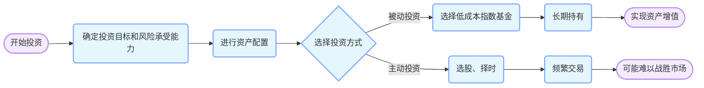

# 约翰·伯格的简单投资法则

> 关键词：约翰·伯格、简单投资法则、指数基金、长期投资、资产配置

> 摘要：本文深入探讨了约翰·伯格所提出的简单投资法则。约翰·伯格是投资领域的传奇人物，他的投资理念以简单、有效、长期为核心。文章将详细介绍其法则的核心概念、算法原理、数学模型等内容，并通过项目实战案例展示如何运用这些法则进行投资。同时，分析其在实际应用场景中的表现，推荐相关的学习资源、开发工具和论文著作。最后总结其未来发展趋势与挑战，解答常见问题并提供扩展阅读和参考资料，旨在帮助投资者更好地理解和运用约翰·伯格的投资法则。

## 1. 背景介绍 
### 1.1 目的和范围
本文的目的是全面剖析约翰·伯格的简单投资法则，让投资者深入理解其背后的原理和应用方法。范围涵盖从基本概念的介绍到实际投资案例的分析，以及对相关学习资源和工具的推荐，为投资者提供一个系统的学习和实践指南。

### 1.2 预期读者
预期读者包括对投资领域感兴趣的初学者、有一定投资经验但希望优化投资策略的投资者，以及从事金融研究和教学的专业人士。

### 1.3 文档结构概述
本文首先介绍背景信息，包括目的、读者群体和文档结构。接着阐述核心概念与联系，通过示意图和流程图展示投资法则的架构。然后详细讲解核心算法原理和具体操作步骤，结合 Python 代码进行说明。之后介绍数学模型和公式，并举例说明。通过项目实战展示实际应用，分析应用场景。推荐相关的工具和资源，最后总结未来发展趋势与挑战，解答常见问题并提供扩展阅读和参考资料。

### 1.4 术语表
#### 1.4.1 核心术语定义
- **指数基金**：一种按照特定指数构成规则，购买该指数包含的全部或部分证券的基金，旨在复制指数表现。
- **长期投资**：指投资者将资金投入市场后，持有较长时间，通常为数年甚至数十年，以获取长期的资本增值。
- **资产配置**：根据投资者的风险承受能力、投资目标等因素，将资金分配到不同类型的资产中，如股票、债券、现金等。

#### 1.4.2 相关概念解释
- **被动投资**：与主动投资相对，不试图通过选股、择时等方式超越市场表现，而是通过跟踪指数来获取市场平均收益。指数基金是被动投资的典型代表。
- **复利效应**：指在投资过程中，不仅本金会产生收益，收益也会继续产生收益，随着时间的推移，资产会呈现指数级增长。

#### 1.4.3 缩略词列表
- **ETF**：交易型开放式指数基金（Exchange Traded Fund），是一种在交易所上市交易的、基金份额可变的开放式基金。

## 2. 核心概念与联系 

### 核心概念原理
约翰·伯格的简单投资法则核心在于强调长期投资和被动投资。他认为普通投资者很难通过主动选股和择时来战胜市场，而选择低成本的指数基金进行长期投资是获取市场平均收益的有效方式。

长期投资利用了复利效应，随着时间的推移，即使是较小的年化收益率也能带来巨大的资产增值。例如，假设初始投资为 10000 元，年化收益率为 8%，经过 30 年，根据复利计算公式 $A = P(1 + r)^n$（其中 $A$ 为最终资产，$P$ 为初始本金，$r$ 为年化收益率，$n$ 为投资年限），最终资产将达到 $10000\times(1 + 0.08)^{30} \approx 100626.57$ 元。

被动投资则通过投资指数基金，避免了主动投资中高昂的管理费用和交易成本。指数基金的管理费用通常较低，能够让投资者更多地分享市场的收益。

### 架构的文本示意图
```plaintext
约翰·伯格简单投资法则
|-- 长期投资
|   |-- 利用复利效应实现资产增值
|-- 被动投资
|   |-- 选择低成本指数基金
|       |-- 复制市场指数表现
|       |-- 降低管理费用和交易成本
|-- 资产配置
|   |-- 根据风险承受能力分配资产
|       |-- 股票、债券、现金等
```

### Mermaid 流程图


## 3. 核心算法原理 & 具体操作步骤 

### 核心算法原理
在约翰·伯格的投资法则中，核心算法主要围绕资产配置和长期投资收益计算。

#### 资产配置算法
资产配置的目标是根据投资者的风险承受能力和投资目标，将资金合理分配到不同类型的资产中。一种常见的资产配置方法是根据年龄来确定股票和债券的比例，例如，用 100 减去投资者的年龄得到股票投资的比例，剩余部分投资于债券。

以下是一个简单的 Python 代码示例，用于根据年龄计算资产配置比例：
```python
def asset_allocation(age):
    stock_percentage = 100 - age
    bond_percentage = age
    return stock_percentage, bond_percentage

# 示例：假设投资者年龄为 30 岁
age = 30
stock_percentage, bond_percentage = asset_allocation(age)
print(f"股票投资比例: {stock_percentage}%")
print(f"债券投资比例: {bond_percentage}%")
```

#### 长期投资收益计算算法
长期投资收益可以通过复利公式计算。以下是一个 Python 代码示例，用于计算长期投资的最终资产：
```python
def compound_interest(principal, annual_rate, years):
    final_amount = principal * (1 + annual_rate) ** years
    return final_amount

# 示例：初始投资 10000 元，年化收益率 8%，投资 30 年
principal = 10000
annual_rate = 0.08
years = 30
final_amount = compound_interest(principal, annual_rate, years)
print(f"最终资产: {final_amount:.2f} 元")
```

### 具体操作步骤
1. **确定投资目标和风险承受能力**：投资者需要明确自己的投资目标，如养老、子女教育等，并评估自己的风险承受能力。可以通过一些风险测评问卷来辅助判断。
2. **进行资产配置**：根据自己的风险承受能力和投资目标，按照一定的方法进行资产配置。例如，使用上述的年龄法确定股票和债券的投资比例。
3. **选择投资产品**：对于被动投资，选择低成本的指数基金。可以通过基金评级网站、基金公司官网等渠道筛选合适的指数基金。
4. **定期投资**：采用定期定额投资的方式，如每月固定金额投资指数基金，避免因市场波动而做出错误的投资决策。
5. **长期持有**：坚持长期投资，避免频繁交易。市场短期波动是正常的，长期来看，市场通常会呈现上涨趋势。

## 4. 数学模型和公式 & 详细讲解 & 举例说明 

### 复利公式
复利公式为 $A = P(1 + r)^n$，其中：
- $A$ 表示最终资产
- $P$ 表示初始本金
- $r$ 表示年化收益率
- $n$ 表示投资年限

详细讲解：复利的核心在于收益会继续产生收益。每年的收益都会加入到本金中，下一年的收益将基于新的本金计算。随着时间的推移，复利的效果会越来越明显。

举例说明：假设小明初始投资 5000 元，年化收益率为 7%，投资期限为 20 年。根据复利公式计算，最终资产 $A = 5000\times(1 + 0.07)^{20} \approx 19348.42$ 元。

### 资产配置比例公式
前面提到的根据年龄确定资产配置比例的公式为：
股票投资比例 = 100 - 年龄
债券投资比例 = 年龄

详细讲解：这种方法基于一个基本的原则，即随着年龄的增长，投资者的风险承受能力逐渐降低。年轻投资者可以承受较高的风险，因此股票投资比例较高；而年长投资者更注重资产的稳定性，债券投资比例较高。

举例说明：假设小李今年 25 岁，根据上述公式，股票投资比例为 $100 - 25 = 75\%$，债券投资比例为 25%。如果小李有 100000 元的投资资金，那么他应该将 $100000\times0.75 = 75000$ 元投资于股票，$100000\times0.25 = 25000$ 元投资于债券。

## 5. 项目实战：代码实际案例和详细解释说明 

### 5.1  开发环境搭建
为了实现约翰·伯格投资法则的相关代码，我们可以使用 Python 编程语言。以下是开发环境搭建的步骤：

1. **安装 Python**：访问 Python 官方网站（https://www.python.org/downloads/），下载并安装适合你操作系统的 Python 版本。建议安装 Python 3.7 及以上版本。
2. **安装开发工具**：可以选择使用集成开发环境（IDE），如 PyCharm 或 Visual Studio Code。这些工具提供了代码编辑、调试等功能，方便开发。
3. **安装必要的库**：在本项目中，我们主要使用 Python 的基本库，无需额外安装其他库。

### 5.2  源代码详细实现和代码解读

#### 资产配置代码实现
```python
def asset_allocation(age):
    """
    根据年龄计算资产配置比例
    :param age: 投资者年龄
    :return: 股票投资比例和债券投资比例
    """
    stock_percentage = 100 - age
    bond_percentage = age
    return stock_percentage, bond_percentage

# 示例：假设投资者年龄为 40 岁
age = 40
stock_percentage, bond_percentage = asset_allocation(age)
print(f"股票投资比例: {stock_percentage}%")
print(f"债券投资比例: {bond_percentage}%")
```
代码解读：
- `asset_allocation` 函数接受一个参数 `age`，表示投资者的年龄。
- 在函数内部，根据公式计算股票投资比例和债券投资比例。
- 最后返回计算结果，并打印输出。

#### 长期投资收益计算代码实现
```python
def compound_interest(principal, annual_rate, years):
    """
    计算长期投资的最终资产
    :param principal: 初始本金
    :param annual_rate: 年化收益率
    :param years: 投资年限
    :return: 最终资产
    """
    final_amount = principal * (1 + annual_rate) ** years
    return final_amount

# 示例：初始投资 20000 元，年化收益率 6%，投资 15 年
principal = 20000
annual_rate = 0.06
years = 15
final_amount = compound_interest(principal, annual_rate, years)
print(f"最终资产: {final_amount:.2f} 元")
```
代码解读：
- `compound_interest` 函数接受三个参数：`principal` 表示初始本金，`annual_rate` 表示年化收益率，`years` 表示投资年限。
- 在函数内部，根据复利公式计算最终资产。
- 最后返回计算结果，并打印输出。

### 5.3  代码解读与分析
通过上述代码，我们可以看到如何使用 Python 实现约翰·伯格投资法则中的资产配置和长期投资收益计算。这些代码简单易懂，能够帮助投资者快速计算出自己的投资方案和预期收益。

在实际应用中，投资者可以根据自己的实际情况修改代码中的参数，如年龄、初始本金、年化收益率等，以得到更符合自己需求的结果。同时，投资者还可以将这些代码集成到自己的投资管理系统中，实现自动化的投资决策。

## 6. 实际应用场景 
### 个人养老规划
对于个人养老规划，约翰·伯格的简单投资法则非常适用。年轻人可以将大部分资金投资于股票指数基金，利用长期投资和复利效应实现资产的快速增长。随着年龄的增长，逐渐增加债券的投资比例，降低投资风险。例如，小张今年 28 岁，他可以将 72% 的资金投资于股票指数基金，28% 的资金投资于债券基金。每年定期定额投资，到他 60 岁退休时，有望积累一笔可观的养老资金。

### 子女教育基金
为子女教育储备资金也可以采用这种投资法则。家长可以在孩子年幼时，选择低成本的指数基金进行长期投资。由于投资期限较长，可以承受一定的市场波动。例如，小李的孩子今年 3 岁，他计划为孩子储备大学教育费用。他可以每月定期投资一定金额的指数基金，到孩子 18 岁上大学时，通过长期投资的收益可能足以支付大学学费。

### 普通投资者资产增值
对于普通投资者来说，没有专业的投资知识和时间进行主动选股和择时。选择指数基金进行长期投资是一种简单有效的方式。通过资产配置，平衡风险和收益。例如，小王是一名上班族，每月有一定的闲置资金。他可以根据自己的年龄和风险承受能力进行资产配置，选择几只不同类型的指数基金进行投资，长期持有，实现资产的稳步增值。

## 7. 工具和资源推荐
### 7.1 学习资源推荐
#### 7.1.1 书籍推荐
- 《共同基金常识》（*Common Sense on Mutual Funds*）：约翰·伯格的经典著作，详细阐述了他的投资理念和方法，是投资者必读的书籍之一。
- 《漫步华尔街》（*A Random Walk Down Wall Street*）：这本书介绍了有效市场假说和指数投资的优势，对理解约翰·伯格的投资法则有很大帮助。
- 《聪明的投资者》（*The Intelligent Investor*）：本杰明·格雷厄姆的经典之作，强调了价值投资和长期投资的重要性，与约翰·伯格的投资理念有相通之处。

#### 7.1.2 在线课程
- Coursera 上的“投资学原理”课程：由知名大学教授授课，系统介绍了投资的基本原理和方法，包括资产配置、风险管理等内容。
- 网易云课堂上的“指数基金投资实战”课程：专门针对指数基金投资进行讲解，结合实际案例，帮助学员掌握指数基金投资技巧。

#### 7.1.3 技术博客和网站
- 雪球网：国内知名的投资交流社区，有很多投资者分享自己的投资经验和见解，也有关于指数基金的分析和讨论。
- 晨星网：提供基金评级、分析等服务，投资者可以通过该网站筛选合适的指数基金。

### 7.2 开发工具框架推荐
#### 7.2.1 IDE和编辑器
- PyCharm：功能强大的 Python 集成开发环境，提供代码编辑、调试、自动补全等功能，适合专业开发者使用。
- Visual Studio Code：轻量级的代码编辑器，支持多种编程语言，通过安装插件可以实现 Python 开发的各种功能。

#### 7.2.2 调试和性能分析工具
- PDB：Python 自带的调试工具，可以帮助开发者定位代码中的问题。
- cProfile：Python 的性能分析工具，可以分析代码的运行时间和函数调用情况，帮助优化代码性能。

#### 7.2.3 相关框架和库
- Pandas：用于数据处理和分析的 Python 库，可以方便地处理投资数据，如基金净值、收益率等。
- Matplotlib：用于数据可视化的 Python 库，可以将投资数据以图表的形式展示，更直观地分析投资情况。

### 7.3 相关论文著作推荐
#### 7.3.1 经典论文
- Eugene F. Fama 的“有效资本市场：理论与实证研究回顾”（*Efficient Capital Markets: A Review of Theory and Empirical Work*）：该论文提出了有效市场假说，为指数投资提供了理论基础。
- Burton G. Malkiel 的“随机游走假说”（*The Random Walk Hypothesis*）：阐述了股票价格的随机波动特性，支持了被动投资的观点。

#### 7.3.2 最新研究成果
- 关注顶级金融学术期刊，如《金融杂志》（*Journal of Finance*）、《金融经济学杂志》（*Journal of Financial Economics*）等，这些期刊会发表关于投资领域的最新研究成果。

#### 7.3.3 应用案例分析
- 可以通过金融研究机构的报告和案例分析，了解其他投资者如何应用约翰·伯格的投资法则取得成功，从中吸取经验教训。

## 8. 总结：未来发展趋势与挑战
### 未来发展趋势
- **指数基金市场的持续增长**：随着投资者对简单投资法则的认识不断提高，指数基金市场有望继续保持增长。越来越多的投资者会选择低成本的指数基金进行长期投资。
- **科技与投资的融合**：科技的发展将为投资带来更多的便利和创新。例如，智能投顾平台可以根据投资者的风险承受能力和投资目标，自动为投资者进行资产配置和投资组合调整。
- **全球资产配置的增加**：投资者将更加注重全球资产配置，通过投资不同国家和地区的指数基金，分散投资风险，获取更广泛的市场收益。

### 挑战
- **市场波动风险**：尽管长期投资可以平滑市场波动，但短期内市场的大幅波动仍可能给投资者带来心理压力和损失。投资者需要具备足够的耐心和风险承受能力。
- **基金选择的困难**：市场上指数基金众多，投资者在选择合适的指数基金时可能会面临困难。需要综合考虑基金的规模、费用、跟踪误差等因素。
- **政策和监管变化**：投资市场受到政策和监管的影响较大。政策和监管的变化可能会对指数基金的发展和投资者的收益产生影响。

## 9. 附录：常见问题与解答
### 1. 指数基金一定能赚钱吗？
指数基金并不能保证一定赚钱。虽然从长期来看，市场通常会呈现上涨趋势，但短期内市场可能会出现波动甚至下跌。投资者需要有足够的耐心和风险承受能力，坚持长期投资。

### 2. 如何选择合适的指数基金？
选择指数基金时，可以考虑以下因素：基金的规模、费用、跟踪误差、基金公司的信誉等。一般来说，规模较大、费用较低、跟踪误差较小的指数基金是较好的选择。

### 3. 资产配置比例需要定期调整吗？
需要定期调整。随着投资者年龄的增长、投资目标的变化和市场情况的波动，资产配置比例可能需要进行相应的调整。一般建议每年或每几年进行一次资产配置的重新评估和调整。

### 4. 约翰·伯格的投资法则适合所有投资者吗？
约翰·伯格的投资法则适合大多数普通投资者，尤其是那些没有专业投资知识和时间进行主动投资的投资者。但对于一些有丰富投资经验和专业知识的投资者，可能会根据自己的情况采用更复杂的投资策略。

## 10. 扩展阅读 & 参考资料
### 扩展阅读
- 《投资者的未来》（*The Future for Investors*）：深入探讨了长期投资的策略和方法，对理解约翰·伯格的投资法则有进一步的帮助。
- 《非理性繁荣》（*Irrational Exuberance*）：分析了投资者的非理性行为和市场泡沫的形成，提醒投资者在投资过程中要保持理性。

### 参考资料
- John C. Bogle. *Common Sense on Mutual Funds*. Wiley, 2009.
- Burton G. Malkiel. *A Random Walk Down Wall Street*. Norton, 2019.
- Benjamin Graham. *The Intelligent Investor*. HarperBusiness, 2003.

作者：AI天才研究院/AI Genius Institute & 禅与计算机程序设计艺术 /Zen And The Art of Computer Programming