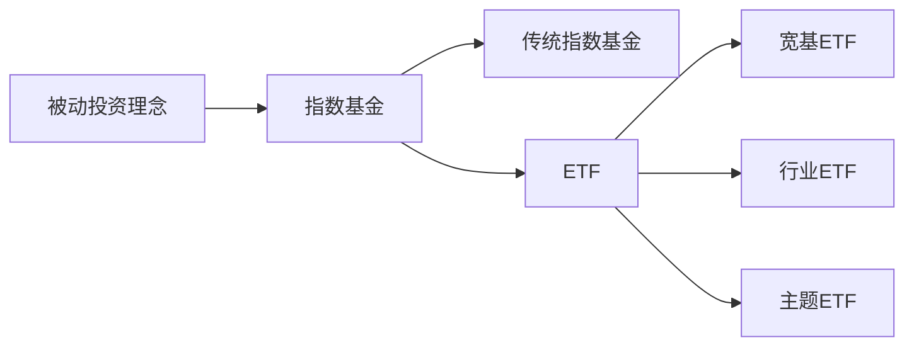

# 约翰·伯格的被动投资：ETF时代的新发展

> 关键词：约翰·伯格、被动投资、ETF、指数基金、投资策略

> 摘要：本文围绕约翰·伯格的被动投资理念展开，深入探讨在ETF时代其理念的新发展。首先介绍了被动投资的背景，包括约翰·伯格的贡献以及相关术语；接着阐述核心概念与联系，如被动投资与ETF的关系；详细讲解核心算法原理和操作步骤，并结合数学模型和公式进行说明；通过项目实战展示ETF投资的代码实现与解读；分析实际应用场景；推荐相关工具和资源；最后总结未来发展趋势与挑战，还包含常见问题解答和扩展阅读参考资料，旨在为投资者全面理解和应用被动投资理念在ETF时代的新发展提供专业指导。

## 1. 背景介绍 
### 1.1 目的和范围
本文的主要目的是深入剖析约翰·伯格的被动投资理念在ETF时代的新发展。通过全面的分析和讲解，让读者了解被动投资的核心原理、操作方法以及在ETF市场中的实际应用。范围涵盖了从被动投资的基本概念到ETF产品的具体投资策略，从理论层面的数学模型到实践中的代码实现和案例分析。同时，还会对相关的工具、资源和研究成果进行推荐，帮助读者进一步深入学习和实践。

### 1.2 预期读者
本文预期读者包括对投资领域感兴趣的初学者，希望通过了解被动投资理念和ETF产品来开启投资之旅；也适用于有一定投资经验的专业人士，他们可以从更深入的理论分析和实际案例中获取新的投资思路和方法；此外，对于金融领域的研究人员和学者，本文提供的数学模型、算法原理和最新研究成果也具有一定的参考价值。

### 1.3 文档结构概述
本文将按照以下结构进行阐述：首先介绍背景知识，包括目的、预期读者、文档结构和术语表；接着讲解核心概念与联系，通过文本示意图和Mermaid流程图展示被动投资与ETF的关系；然后详细说明核心算法原理和具体操作步骤，并结合Python代码进行解释；再介绍数学模型和公式，并举例说明；之后通过项目实战展示ETF投资的代码实现和详细解读；分析实际应用场景；推荐相关的工具和资源；最后总结未来发展趋势与挑战，提供常见问题解答和扩展阅读参考资料。

### 1.4 术语表
#### 1.4.1 核心术语定义
- **被动投资**：一种投资策略，通过复制市场指数的表现来获取收益，而不是试图通过主动选股和市场时机选择来超越市场。
- **ETF（交易型开放式指数基金）**：一种在证券交易所上市交易的开放式基金，它跟踪特定的指数，投资者可以像买卖股票一样在二级市场交易ETF份额。
- **指数基金**：一种按照特定指数的成分股组成及其权重进行投资的基金，旨在复制该指数的表现。
- **跟踪误差**：指ETF或指数基金的实际表现与所跟踪指数表现之间的差异。

#### 1.4.2 相关概念解释
- **市场有效性**：指市场价格能够及时、准确地反映所有可用信息的程度。在有效市场中，主动投资难以长期持续地超越市场平均水平，这为被动投资提供了理论基础。
- **分散投资**：通过投资于多种不同的资产或证券，降低单个资产或证券对投资组合的影响，从而降低投资风险。ETF和指数基金通常具有广泛的分散性。

#### 1.4.3 缩略词列表
- **ETF**：交易型开放式指数基金（Exchange-Traded Fund）
- **CAPM**：资本资产定价模型（Capital Asset Pricing Model）

## 2. 核心概念与联系 

### 核心概念原理
约翰·伯格是被动投资理念的倡导者和先驱。他认为，大多数投资者难以通过主动投资长期战胜市场，因为市场是相对有效的，且主动投资需要支付较高的管理费用和交易成本。被动投资通过投资于指数基金或ETF，以较低的成本复制市场指数的表现，能够让投资者获得市场平均收益。

ETF作为一种特殊的指数基金，结合了开放式基金和封闭式基金的特点。它可以在证券交易所上市交易，具有交易灵活、成本低廉、透明度高等优点。投资者可以通过买卖ETF份额，方便地参与不同市场、不同行业的投资。

### 架构的文本示意图
```plaintext
被动投资理念
|
|-- 指数基金
|   |-- 传统指数基金
|   |-- ETF
|       |-- 宽基ETF
|       |-- 行业ETF
|       |-- 主题ETF
```

### Mermaid流程图


## 3. 核心算法原理 & 具体操作步骤 

### 核心算法原理
在被动投资中，核心目标是尽可能准确地复制所跟踪指数的表现。以ETF为例，其投资组合的构建通常是按照所跟踪指数的成分股及其权重进行配置。

以下是一个简单的Python代码示例，用于模拟ETF投资组合的构建：
```python
import pandas as pd

# 假设我们跟踪的指数成分股及其权重
index_components = {
    'Stock A': 0.2,
    'Stock B': 0.3,
    'Stock C': 0.5
}

# 假设我们有一定的投资金额
investment_amount = 10000

# 计算每只股票的投资金额
portfolio = {}
for stock, weight in index_components.items():
    portfolio[stock] = investment_amount * weight

# 输出投资组合
print("ETF投资组合：")
for stock, amount in portfolio.items():
    print(f"{stock}: {amount} 元")
```
### 具体操作步骤
1. **选择跟踪指数**：根据自己的投资目标和风险偏好，选择合适的指数进行跟踪。例如，如果你希望投资于整个股票市场，可以选择沪深300指数；如果你对某个特定行业感兴趣，可以选择相应的行业指数。
2. **选择ETF产品**：在市场上选择跟踪该指数的ETF产品。需要考虑ETF的规模、流动性、跟踪误差等因素。
3. **确定投资金额**：根据自己的财务状况和投资计划，确定投资于ETF的金额。
4. **构建投资组合**：按照所跟踪指数的成分股及其权重，计算每只股票的投资金额，构建ETF投资组合。
5. **定期调整**：由于指数成分股会定期调整，ETF的投资组合也需要相应调整，以确保其能够准确跟踪指数表现。

## 4. 数学模型和公式 & 详细讲解 & 举例说明 

### 资本资产定价模型（CAPM）
资本资产定价模型用于描述资产的预期收益率与市场风险之间的关系。其公式为：
$$E(R_i) = R_f + \beta_i(E(R_m) - R_f)$$
其中：
- $E(R_i)$ 是资产 $i$ 的预期收益率
- $R_f$ 是无风险收益率，通常可以用国债收益率来近似表示
- $\beta_i$ 是资产 $i$ 的贝塔系数，衡量资产 $i$ 的收益率相对于市场收益率的波动程度
- $E(R_m)$ 是市场组合的预期收益率

### 详细讲解
CAPM模型的核心思想是，资产的预期收益率由两部分组成：无风险收益率和风险溢价。风险溢价是资产承担市场风险所获得的额外收益，与资产的贝塔系数成正比。贝塔系数大于1表示资产的波动程度大于市场平均水平，贝塔系数小于1表示资产的波动程度小于市场平均水平。

### 举例说明
假设无风险收益率 $R_f = 3\%$，市场组合的预期收益率 $E(R_m) = 10\%$，某ETF的贝塔系数 $\beta = 1.2$。根据CAPM模型，该ETF的预期收益率为：
$$E(R) = 0.03 + 1.2\times(0.1 - 0.03) = 0.114 = 11.4\%$$

这意味着，在给定的市场条件下，该ETF的预期收益率为11.4%。

## 5. 项目实战：代码实际案例和详细解释说明 

### 5.1  开发环境搭建
- **Python环境**：建议使用Python 3.7及以上版本，可以通过Anaconda或Python官方网站进行安装。
- **相关库**：需要安装`pandas`、`numpy`、`yfinance`等库。可以使用以下命令进行安装：
```sh
pip install pandas numpy yfinance
```

### 5.2  源代码详细实现和代码解读
以下是一个使用Python和`yfinance`库进行ETF历史数据获取和简单分析的代码示例：
```python
import yfinance as yf
import pandas as pd
import matplotlib.pyplot as plt

# 选择要分析的ETF代码
etf_symbol = 'SPY'

# 获取ETF的历史数据
etf_data = yf.download(etf_symbol, start='2020-01-01', end='2023-01-01')

# 计算每日收益率
etf_data['Daily Return'] = etf_data['Close'].pct_change()

# 绘制收盘价和每日收益率曲线
fig, axes = plt.subplots(2, 1, figsize=(10, 8))
etf_data['Close'].plot(ax=axes[0], title=f'{etf_symbol} 收盘价')
etf_data['Daily Return'].plot(ax=axes[1], title=f'{etf_symbol} 每日收益率')
plt.tight_layout()
plt.show()

# 计算年化收益率和波动率
annual_return = etf_data['Daily Return'].mean() * 252
annual_volatility = etf_data['Daily Return'].std() * (252 ** 0.5)

print(f'{etf_symbol} 年化收益率: {annual_return:.2%}')
print(f'{etf_symbol} 年化波动率: {annual_volatility:.2%}')
```
### 代码解读与分析
1. **数据获取**：使用`yfinance`库的`download`函数获取指定ETF的历史数据，时间范围从2020年1月1日到2023年1月1日。
2. **每日收益率计算**：通过`pct_change`函数计算ETF每日收盘价的百分比变化，得到每日收益率。
3. **绘图**：使用`matplotlib`库绘制ETF的收盘价和每日收益率曲线，方便直观观察其走势。
4. **年化收益率和波动率计算**：年化收益率是每日收益率的平均值乘以252（一年的交易日数量），年化波动率是每日收益率的标准差乘以$\sqrt{252}$。最后输出计算结果。

## 6. 实际应用场景 
### 个人投资者
对于个人投资者来说，ETF是一种简单、便捷、低成本的投资工具。可以通过投资宽基ETF实现对整个市场的分散投资，降低投资风险；也可以根据自己的投资偏好，选择行业ETF或主题ETF，参与特定行业或主题的投资。例如，投资者看好科技行业的发展，可以投资科技行业ETF。

### 机构投资者
机构投资者可以利用ETF进行资产配置和风险管理。通过投资不同市场、不同行业的ETF，构建多元化的投资组合，实现资产的有效配置。同时，ETF的高流动性和透明度也使得机构投资者可以方便地进行交易和调整投资组合。例如，养老金基金可以通过投资ETF实现资产的长期稳健增值。

### 套利交易
由于ETF同时存在一级市场和二级市场，当ETF的二级市场价格与基金净值出现偏差时，就会产生套利机会。套利者可以通过申购赎回ETF份额和买卖ETF二级市场份额来获取差价收益。例如，当ETF的二级市场价格高于基金净值时，套利者可以在一级市场申购ETF份额，然后在二级市场卖出；反之亦然。

## 7. 工具和资源推荐
### 7.1 学习资源推荐
#### 7.1.1 书籍推荐
- 《漫步华尔街》：作者是伯顿·马尔基尔，这本书深入浅出地介绍了投资的基本原理和策略，包括被动投资理念，是投资领域的经典之作。
- 《聪明的投资者》：作者是本杰明·格雷厄姆，该书强调了价值投资和风险控制的重要性，对被动投资也有一定的阐述。
- 《约翰·伯格的投资50堂课》：详细介绍了约翰·伯格的投资理念和方法，是了解被动投资的必读之书。

#### 7.1.2 在线课程
- Coursera上的“投资学原理”：由知名大学教授授课，系统介绍了投资的基本理论和方法，包括被动投资和ETF投资。
- 网易云课堂上的“ETF投资实战教程”：结合实际案例，详细讲解了ETF的投资策略和操作技巧。

#### 7.1.3 技术博客和网站
- 雪球网：是一个财经社交平台，有很多投资者分享ETF投资的经验和心得，也有专业的研究报告和分析文章。
- 集思录：提供ETF的实时数据、折溢价率等信息，还有丰富的投资策略讨论和分析。

### 7.2 开发工具框架推荐
#### 7.2.1 IDE和编辑器
- PyCharm：是一款专业的Python集成开发环境，具有代码自动补全、调试等功能，适合开发Python投资分析代码。
- Jupyter Notebook：是一个交互式的开发环境，可以方便地进行数据分析和可视化，非常适合进行投资数据的探索和分析。

#### 7.2.2 调试和性能分析工具
- `pdb`：是Python自带的调试工具，可以帮助开发者定位代码中的错误和问题。
- `cProfile`：用于分析Python代码的性能，找出代码中的瓶颈和耗时操作。

#### 7.2.3 相关框架和库
- `pandas`：是Python中用于数据处理和分析的重要库，提供了丰富的数据结构和函数，方便进行ETF数据的处理和分析。
- `numpy`：是Python中用于科学计算的基础库，提供了高效的数组操作和数学函数，在投资分析中经常使用。
- `scikit-learn`：是一个机器学习库，可以用于构建投资模型和进行预测分析。

### 7.3 相关论文著作推荐
#### 7.3.1 经典论文
- 《有效资本市场：理论与实证研究回顾》：由尤金·法玛发表，提出了有效市场假说，为被动投资提供了重要的理论基础。
- 《资本资产定价：风险条件下的市场均衡理论》：由威廉·夏普发表，提出了资本资产定价模型（CAPM），用于描述资产的预期收益率与市场风险之间的关系。

#### 7.3.2 最新研究成果
- 关于ETF流动性和市场影响的研究：随着ETF市场的不断发展，其流动性和对市场的影响成为研究热点。相关研究可以帮助投资者更好地理解ETF的交易机制和市场行为。
- 基于机器学习的ETF投资策略研究：利用机器学习算法对ETF数据进行分析和预测，开发更有效的投资策略。

#### 7.3.3 应用案例分析
- 国内外大型机构投资者的ETF投资案例：分析这些案例可以了解机构投资者在资产配置、风险管理等方面的经验和做法。
- 个人投资者的ETF投资成功案例：从中可以学习到个人投资者在实际操作中的投资思路和技巧。

## 8. 总结：未来发展趋势与挑战
### 未来发展趋势
- **产品创新**：ETF市场将不断推出新的产品，如跨境ETF、ESG（环境、社会和治理）主题ETF等，满足投资者多样化的投资需求。
- **智能化投资**：随着人工智能和机器学习技术的发展，ETF投资将更加智能化。例如，利用算法进行资产配置和交易决策，提高投资效率和收益。
- **国际化发展**：ETF市场将进一步国际化，投资者可以通过ETF更方便地参与全球市场的投资。

### 挑战
- **市场波动风险**：尽管ETF具有分散投资的特点，但市场波动仍然会对其价格产生影响。投资者需要具备一定的风险承受能力和风险管理能力。
- **跟踪误差问题**：ETF在跟踪指数的过程中可能会出现跟踪误差，影响其投资效果。基金管理人需要不断优化投资组合和管理策略，降低跟踪误差。
- **监管挑战**：随着ETF市场的快速发展，监管难度也在增加。监管机构需要加强对ETF市场的监管，保障投资者的合法权益。

## 9. 附录：常见问题与解答
### 问题1：ETF和指数基金有什么区别？
解答：ETF和指数基金都属于被动投资工具，旨在复制指数的表现。主要区别在于，ETF可以在证券交易所上市交易，交易方式更灵活，像股票一样可以实时买卖；而传统指数基金通常通过基金公司进行申购和赎回，交易时间和方式相对固定。此外，ETF的交易成本通常较低，透明度更高。

### 问题2：如何选择适合自己的ETF？
解答：选择适合自己的ETF需要考虑以下因素：投资目标和风险偏好，如果你希望获取市场平均收益且风险承受能力较低，可以选择宽基ETF；如果你对某个特定行业或主题有研究和判断，可以选择相应的行业ETF或主题ETF。同时，还需要关注ETF的规模、流动性、跟踪误差等指标，选择规模较大、流动性好、跟踪误差小的ETF产品。

### 问题3：ETF投资有哪些风险？
解答：ETF投资的风险主要包括市场风险、跟踪误差风险、流动性风险等。市场风险是指由于市场波动导致ETF价格下跌的风险；跟踪误差风险是指ETF的实际表现与所跟踪指数表现之间的差异；流动性风险是指在交易ETF时，由于市场流动性不足导致无法及时买卖或买卖价格不理想的风险。

## 10. 扩展阅读 & 参考资料
### 扩展阅读
- 《金融市场与金融机构》：全面介绍了金融市场的运作机制和金融机构的业务，有助于深入理解ETF市场的背景和环境。
- 《量化投资：策略与技术》：介绍了量化投资的方法和策略，对于利用量化技术进行ETF投资分析有一定的帮助。

### 参考资料
- 各ETF基金公司的官方网站，获取ETF产品的详细信息和资料。
- 证券交易所的官方网站，查询ETF的交易规则和市场数据。
- 相关学术期刊和研究报告，如《金融研究》《投资研究》等，获取最新的研究成果和行业动态。

作者：AI天才研究院/AI Genius Institute & 禅与计算机程序设计艺术 /Zen And The Art of Computer Programming