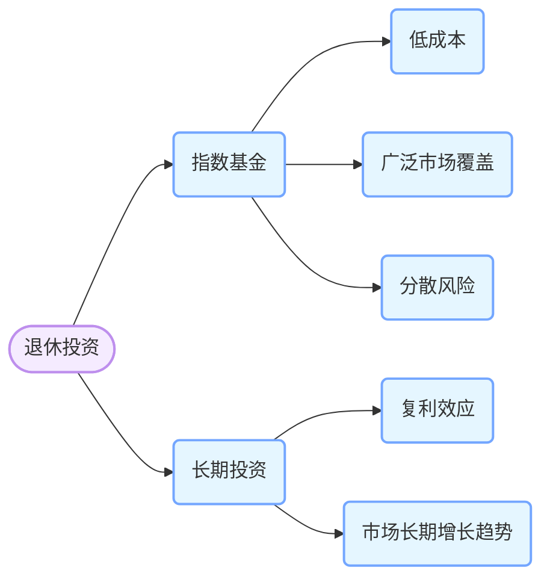

# 约翰·伯格的退休投资建议：简单而有效

> 关键词：约翰·伯格、退休投资、简单有效策略、指数基金、长期投资

> 摘要：本文深入探讨了约翰·伯格提出的退休投资建议。约翰·伯格作为投资界的传奇人物，其倡导的简单而有效的退休投资理念影响深远。文章首先介绍了相关背景知识，包括目的范围、预期读者等。接着阐述核心概念，如指数基金等，以及它们之间的联系。详细讲解了核心算法原理和具体操作步骤，用 Python 代码进行说明。还给出了数学模型和公式，并举例说明。通过项目实战，展示代码案例并进行解读。分析了实际应用场景，推荐了学习资源、开发工具框架和相关论文著作。最后总结了未来发展趋势与挑战，提供常见问题解答和扩展阅读参考资料，旨在帮助读者理解并运用约翰·伯格的退休投资建议，实现更合理的退休投资规划。

## 1. 背景介绍 
### 1.1 目的和范围
在当今社会，退休规划成为人们关注的重要话题。随着生活成本的上升和人口老龄化的加剧，如何在退休后维持稳定的经济来源是每个人都需要思考的问题。约翰·伯格的退休投资建议以其简单性和有效性吸引了众多投资者的关注。本文的目的在于深入剖析约翰·伯格的退休投资建议，详细阐述其核心原理、操作方法以及实际应用，帮助读者理解并运用这些建议来制定适合自己的退休投资计划。

本文的范围涵盖了约翰·伯格退休投资建议的各个方面，包括核心概念、算法原理、数学模型、项目实战、应用场景等。同时，还会介绍相关的学习资源、开发工具和研究论文，为读者提供全面的信息，以便更好地掌握和实践这些投资建议。

### 1.2 预期读者
本文预期读者包括对退休投资有兴趣的普通投资者、金融从业者、投资顾问以及正在学习投资知识的学生等。无论您是投资新手还是有一定经验的投资者，都能从本文中获取有价值的信息。对于新手来说，本文可以帮助他们了解退休投资的基本概念和方法；对于有经验的投资者，本文可以提供新的思路和视角，帮助他们优化自己的投资组合。

### 1.3 文档结构概述
本文将按照以下结构进行组织：
- 核心概念与联系：介绍约翰·伯格退休投资建议中的核心概念，如指数基金、长期投资等，并说明它们之间的联系。
- 核心算法原理 & 具体操作步骤：详细讲解核心算法原理，并用 Python 代码展示具体操作步骤。
- 数学模型和公式 & 详细讲解 & 举例说明：给出相关的数学模型和公式，并通过具体例子进行说明。
- 项目实战：代码实际案例和详细解释说明，包括开发环境搭建、源代码实现和代码解读。
- 实际应用场景：分析约翰·伯格退休投资建议在不同场景下的应用。
- 工具和资源推荐：推荐学习资源、开发工具框架和相关论文著作。
- 总结：未来发展趋势与挑战：总结约翰·伯格退休投资建议的未来发展趋势和面临的挑战。
- 附录：常见问题与解答：提供常见问题的解答，帮助读者解决实际遇到的问题。
- 扩展阅读 & 参考资料：列出扩展阅读的内容和参考资料，方便读者进一步深入学习。

### 1.4 术语表
#### 1.4.1 核心术语定义
- **指数基金**：是一种按照证券价格指数编制原理构建投资组合进行证券投资的基金。它的投资组合模仿特定的市场指数，如标普 500 指数等，旨在获得与市场指数相近的收益。
- **长期投资**：指投资者将资金投入到某项资产中，并持有较长时间，通常为数年甚至数十年，以获取资产的长期增值。
- **资产配置**：是指根据投资需求将投资资金在不同资产类别之间进行分配，如股票、债券、现金等，以实现风险和收益的平衡。

#### 1.4.2 相关概念解释
- **市场效率**：指市场价格反映所有可用信息的程度。在有效市场中，资产价格能够迅速准确地反映所有相关信息，投资者很难通过分析信息获得超额收益。
- **复利效应**：指在投资过程中，将所获得的收益再投资，使得本金不断增加，从而在下一个周期获得更多的收益。复利效应在长期投资中具有强大的威力。

#### 1.4.3 缩略词列表
- **ETF**：交易型开放式指数基金（Exchange Traded Fund），是一种在交易所上市交易的、基金份额可变的开放式基金，通常跟踪特定的市场指数。
- **S&P 500**：标准普尔 500 指数（Standard & Poor's 500 Index），是记录美国 500 家上市公司的一个股票指数，广泛用于衡量美国股票市场的表现。

## 2. 核心概念与联系 
### 核心概念原理
约翰·伯格退休投资建议的核心概念主要包括指数基金和长期投资。

#### 指数基金原理
指数基金的原理是通过购买构成特定市场指数的所有或部分股票，来复制该指数的表现。例如，标普 500 指数基金就是通过购买标普 500 指数所包含的 500 只股票，按照其在指数中的权重进行投资，从而获得与标普 500 指数相近的收益。指数基金的优势在于其低成本和广泛的市场覆盖。由于不需要进行主动的股票选择和市场时机把握，指数基金的管理费用相对较低。同时，它能够分散投资风险，因为它投资于多个股票，避免了个别股票波动对投资组合的过大影响。

#### 长期投资原理
长期投资的原理基于复利效应和市场的长期增长趋势。复利效应使得投资者的收益能够不断累积，随着时间的推移，即使是较小的收益率也能带来显著的财富增长。例如，假设每年的投资收益率为 8%，初始投资为 10000 元，经过 30 年，投资将增长到约 100626.57 元。市场的长期增长趋势也是长期投资的重要依据。虽然市场会有短期的波动，但从长期来看，经济通常是增长的，股票市场也会随之上涨。

### 架构的文本示意图
```plaintext
退休投资
|
|-- 指数基金
|   |-- 低成本
|   |-- 广泛市场覆盖
|   |-- 分散风险
|
|-- 长期投资
|   |-- 复利效应
|   |-- 市场长期增长趋势
```

### Mermaid 流程图


## 3. 核心算法原理 & 具体操作步骤 
### 核心算法原理
在约翰·伯格的退休投资建议中，一个重要的算法原理是基于资产配置的投资组合优化。假设我们将投资组合分为股票和债券两部分，目标是在一定的风险水平下最大化投资组合的预期收益。

设 $w_s$ 为股票在投资组合中的权重，$w_b$ 为债券在投资组合中的权重，且 $w_s + w_b = 1$。股票的预期收益率为 $r_s$，债券的预期收益率为 $r_b$，则投资组合的预期收益率 $r_p$ 为：

$r_p = w_s r_s + w_b r_b$

投资组合的风险可以用方差 $\sigma_p^2$ 来衡量，其计算公式为：

$\sigma_p^2 = w_s^2 \sigma_s^2 + w_b^2 \sigma_b^2 + 2 w_s w_b \rho_{sb} \sigma_s \sigma_b$

其中，$\sigma_s^2$ 和 $\sigma_b^2$ 分别为股票和债券的方差，$\rho_{sb}$ 为股票和债券的相关系数。

我们的目标是在给定的风险水平 $\sigma_{target}^2$ 下，找到最优的权重 $w_s$ 和 $w_b$，使得投资组合的预期收益率 $r_p$ 最大化。

### 具体操作步骤
以下是使用 Python 实现上述算法的具体步骤：

```python
import numpy as np
from scipy.optimize import minimize

# 定义预期收益率、方差和相关系数
r_s = 0.1  # 股票预期收益率
r_b = 0.05  # 债券预期收益率
sigma_s = 0.2  # 股票标准差
sigma_b = 0.1  # 债券标准差
rho_sb = 0.2  # 股票和债券的相关系数

# 目标风险水平
sigma_target = 0.15

# 定义目标函数：最大化预期收益率
def objective(weights):
    w_s = weights[0]
    w_b = 1 - w_s
    return -(w_s * r_s + w_b * r_b)

# 定义约束条件：投资组合风险等于目标风险
def constraint(weights):
    w_s = weights[0]
    w_b = 1 - w_s
    sigma_p = np.sqrt(w_s**2 * sigma_s**2 + w_b**2 * sigma_b**2 + 2 * w_s * w_b * rho_sb * sigma_s * sigma_b)
    return sigma_p - sigma_target

# 初始权重猜测
initial_guess = [0.5]

# 约束条件定义
cons = ({'type': 'eq', 'fun': constraint})

# 权重范围约束
bounds = [(0, 1)]

# 优化求解
result = minimize(objective, initial_guess, method='SLSQP', bounds=bounds, constraints=cons)

# 最优权重
optimal_w_s = result.x[0]
optimal_w_b = 1 - optimal_w_s

# 最优投资组合预期收益率
optimal_r_p = optimal_w_s * r_s + optimal_w_b * r_b

print(f"最优股票权重: {optimal_w_s:.2f}")
print(f"最优债券权重: {optimal_w_b:.2f}")
print(f"最优投资组合预期收益率: {optimal_r_p:.2%}")
```

### 代码解释
1. **导入必要的库**：导入 `numpy` 用于数值计算，`scipy.optimize.minimize` 用于优化求解。
2. **定义参数**：定义股票和债券的预期收益率、标准差、相关系数以及目标风险水平。
3. **定义目标函数**：目标函数是最大化投资组合的预期收益率，由于 `minimize` 函数是求最小值，所以在预期收益率前加负号。
4. **定义约束条件**：约束条件是投资组合的风险等于目标风险。
5. **初始权重猜测**：设置初始的股票权重猜测值。
6. **约束条件定义**：将约束条件定义为等式约束。
7. **权重范围约束**：设置股票权重的范围为 0 到 1。
8. **优化求解**：使用 `minimize` 函数进行优化求解。
9. **输出结果**：输出最优的股票和债券权重以及最优投资组合的预期收益率。

## 4. 数学模型和公式 & 详细讲解 & 举例说明 
### 数学模型和公式
#### 投资组合预期收益率公式
如前文所述，投资组合的预期收益率 $r_p$ 计算公式为：

$r_p = w_s r_s + w_b r_b$

其中，$w_s$ 和 $w_b$ 分别为股票和债券在投资组合中的权重，$r_s$ 和 $r_b$ 分别为股票和债券的预期收益率。

#### 投资组合方差公式
投资组合的方差 $\sigma_p^2$ 计算公式为：

$\sigma_p^2 = w_s^2 \sigma_s^2 + w_b^2 \sigma_b^2 + 2 w_s w_b \rho_{sb} \sigma_s \sigma_b$

其中，$\sigma_s^2$ 和 $\sigma_b^2$ 分别为股票和债券的方差，$\rho_{sb}$ 为股票和债券的相关系数。

### 详细讲解
#### 预期收益率公式
预期收益率公式是基于加权平均的原理。投资组合的预期收益率是由各资产的预期收益率按照其在投资组合中的权重加权平均得到的。权重表示了各资产在投资组合中所占的比例，权重越大，该资产对投资组合预期收益率的影响就越大。

#### 方差公式
方差公式考虑了各资产自身的风险（方差）以及资产之间的相关性。$w_s^2 \sigma_s^2$ 和 $w_b^2 \sigma_b^2$ 分别表示股票和债券自身风险对方差的贡献。$2 w_s w_b \rho_{sb} \sigma_s \sigma_b$ 表示股票和债券之间的相关性对方差的贡献。当 $\rho_{sb} > 0$ 时，股票和债券正相关，它们的波动方向相似，会增加投资组合的风险；当 $\rho_{sb} < 0$ 时，股票和债券负相关，它们的波动方向相反，会降低投资组合的风险。

### 举例说明
假设股票的预期收益率 $r_s = 0.1$，标准差 $\sigma_s = 0.2$，债券的预期收益率 $r_b = 0.05$，标准差 $\sigma_b = 0.1$，股票和债券的相关系数 $\rho_{sb} = 0.2$。我们将投资组合中股票的权重 $w_s$ 设为 0.6，债券的权重 $w_b = 1 - w_s = 0.4$。

#### 计算预期收益率
$r_p = w_s r_s + w_b r_b = 0.6 \times 0.1 + 0.4 \times 0.05 = 0.08$，即 8%。

#### 计算方差
$\sigma_p^2 = w_s^2 \sigma_s^2 + w_b^2 \sigma_b^2 + 2 w_s w_b \rho_{sb} \sigma_s \sigma_b$

$= 0.6^2 \times 0.2^2 + 0.4^2 \times 0.1^2 + 2 \times 0.6 \times 0.4 \times 0.2 \times 0.2 \times 0.1$

$= 0.0144 + 0.0016 + 0.00192$

$= 0.01792$

标准差 $\sigma_p = \sqrt{0.01792} \approx 0.134$，即 13.4%。

通过这个例子，我们可以看到如何使用公式计算投资组合的预期收益率和风险。

## 5. 项目实战：代码实际案例和详细解释说明 
### 5.1  开发环境搭建
#### 安装 Python
首先，需要安装 Python 编程语言。可以从 Python 官方网站（https://www.python.org/downloads/）下载适合自己操作系统的 Python 安装包，并按照安装向导进行安装。建议安装 Python 3.7 及以上版本。

#### 安装必要的库
在项目中，我们需要使用 `numpy` 和 `scipy` 库。可以使用以下命令进行安装：

```sh
pip install numpy scipy
```

### 5.2  源代码详细实现和代码解读
以下是一个完整的 Python 代码示例，用于实现基于约翰·伯格退休投资建议的资产配置优化：

```python
import numpy as np
from scipy.optimize import minimize

# 定义预期收益率、方差和相关系数
r_s = 0.1  # 股票预期收益率
r_b = 0.05  # 债券预期收益率
sigma_s = 0.2  # 股票标准差
sigma_b = 0.1  # 债券标准差
rho_sb = 0.2  # 股票和债券的相关系数

# 目标风险水平
sigma_target = 0.15

# 定义目标函数：最大化预期收益率
def objective(weights):
    w_s = weights[0]
    w_b = 1 - w_s
    return -(w_s * r_s + w_b * r_b)

# 定义约束条件：投资组合风险等于目标风险
def constraint(weights):
    w_s = weights[0]
    w_b = 1 - w_s
    sigma_p = np.sqrt(w_s**2 * sigma_s**2 + w_b**2 * sigma_b**2 + 2 * w_s * w_b * rho_sb * sigma_s * sigma_b)
    return sigma_p - sigma_target

# 初始权重猜测
initial_guess = [0.5]

# 约束条件定义
cons = ({'type': 'eq', 'fun': constraint})

# 权重范围约束
bounds = [(0, 1)]

# 优化求解
result = minimize(objective, initial_guess, method='SLSQP', bounds=bounds, constraints=cons)

# 最优权重
optimal_w_s = result.x[0]
optimal_w_b = 1 - optimal_w_s

# 最优投资组合预期收益率
optimal_r_p = optimal_w_s * r_s + optimal_w_b * r_b

print(f"最优股票权重: {optimal_w_s:.2f}")
print(f"最优债券权重: {optimal_w_b:.2f}")
print(f"最优投资组合预期收益率: {optimal_r_p:.2%}")
```

### 代码解读与分析
#### 导入库
```python
import numpy as np
from scipy.optimize import minimize
```
导入 `numpy` 库用于数值计算，`scipy.optimize.minimize` 函数用于优化求解。

#### 定义参数
```python
r_s = 0.1  # 股票预期收益率
r_b = 0.05  # 债券预期收益率
sigma_s = 0.2  # 股票标准差
sigma_b = 0.1  # 债券标准差
rho_sb = 0.2  # 股票和债券的相关系数
sigma_target = 0.15  # 目标风险水平
```
定义股票和债券的预期收益率、标准差、相关系数以及目标风险水平。

#### 定义目标函数
```python
def objective(weights):
    w_s = weights[0]
    w_b = 1 - w_s
    return -(w_s * r_s + w_b * r_b)
```
目标函数是最大化投资组合的预期收益率。由于 `minimize` 函数是求最小值，所以在预期收益率前加负号。

#### 定义约束条件
```python
def constraint(weights):
    w_s = weights[0]
    w_b = 1 - w_s
    sigma_p = np.sqrt(w_s**2 * sigma_s**2 + w_b**2 * sigma_b**2 + 2 * w_s * w_b * rho_sb * sigma_s * sigma_b)
    return sigma_p - sigma_target
```
约束条件是投资组合的风险等于目标风险。

#### 初始权重猜测和约束条件定义
```python
initial_guess = [0.5]
cons = ({'type': 'eq', 'fun': constraint})
bounds = [(0, 1)]
```
设置初始的股票权重猜测值为 0.5，将约束条件定义为等式约束，设置股票权重的范围为 0 到 1。

#### 优化求解
```python
result = minimize(objective, initial_guess, method='SLSQP', bounds=bounds, constraints=cons)
```
使用 `minimize` 函数进行优化求解，采用 SLSQP 方法。

#### 输出结果
```python
optimal_w_s = result.x[0]
optimal_w_b = 1 - optimal_w_s
optimal_r_p = optimal_w_s * r_s + optimal_w_b * r_b

print(f"最优股票权重: {optimal_w_s:.2f}")
print(f"最优债券权重: {optimal_w_b:.2f}")
print(f"最优投资组合预期收益率: {optimal_r_p:.2%}")
```
输出最优的股票和债券权重以及最优投资组合的预期收益率。

## 6. 实际应用场景 
### 个人退休投资规划
对于个人投资者来说，约翰·伯格的退休投资建议可以帮助他们制定简单而有效的退休投资计划。投资者可以根据自己的风险承受能力和退休目标，选择合适的指数基金进行投资，并长期持有。例如，一个年轻的投资者可以将大部分资金投资于股票指数基金，以获取较高的长期收益；而一个接近退休的投资者可以适当增加债券指数基金的比例，以降低投资组合的风险。

### 养老基金管理
养老基金管理机构可以采用约翰·伯格的投资理念，通过合理的资产配置和指数基金投资，为养老金的保值增值提供保障。养老基金通常具有长期投资的特点，适合采用长期投资策略。通过投资指数基金，可以降低管理成本，提高投资效率，同时分散投资风险。

### 金融机构投资建议
金融机构可以将约翰·伯格的退休投资建议纳入其投资咨询服务中，为客户提供更专业、更简单的投资方案。金融机构可以根据客户的年龄、收入、风险偏好等因素，为客户制定个性化的退休投资计划，推荐合适的指数基金产品。

## 7. 工具和资源推荐
### 7.1 学习资源推荐
#### 7.1.1 书籍推荐
- 《共同基金常识》（*The Little Book of Common Sense Investing*）：约翰·伯格的经典著作，详细阐述了他的投资理念和方法，是学习退休投资的必读之书。
- 《聪明的投资者》（*The Intelligent Investor*）：本杰明·格雷厄姆的经典投资书籍，介绍了价值投资的基本原理和方法，对退休投资也有很大的指导意义。

#### 7.1.2 在线课程
- Coursera 上的“投资学原理”课程：由知名大学教授授课，系统介绍投资学的基本原理和方法，包括资产配置、风险管理等内容。
- edX 上的“金融市场”课程：提供了金融市场的全面介绍，包括股票市场、债券市场、基金市场等，有助于了解退休投资的市场环境。

#### 7.1.3 技术博客和网站
- 晨星网（Morningstar）：提供基金评级、分析和研究报告，是了解基金产品的重要网站。
- 雪球网：国内知名的投资社区，投资者可以在上面交流投资经验、分享投资观点。

### 7.2 开发工具框架推荐
#### 7.2.1 IDE和编辑器
- PyCharm：功能强大的 Python 集成开发环境，提供代码编辑、调试、版本控制等功能，适合开发复杂的投资分析程序。
- Jupyter Notebook：交互式的开发环境，适合进行数据探索和分析，方便展示代码和结果。

#### 7.2.2 调试和性能分析工具
- `pdb`：Python 自带的调试工具，可以帮助开发者定位代码中的问题。
- `cProfile`：Python 的性能分析工具，可以分析代码的运行时间和函数调用情况，帮助优化代码性能。

#### 7.2.3 相关框架和库
- `pandas`：用于数据处理和分析的 Python 库，提供了丰富的数据结构和函数，方便进行投资数据的处理和分析。
- `matplotlib`：用于数据可视化的 Python 库，可以绘制各种图表，如折线图、柱状图、散点图等，帮助直观展示投资数据和结果。

### 7.3 相关论文著作推荐
#### 7.3.1 经典论文
- “The Capital Asset Pricing Model: Theory and Evidence”：该论文介绍了资本资产定价模型（CAPM），是现代投资理论的重要基础。
- “Efficient Capital Markets: A Review of Theory and Empirical Work”：该论文对有效市场假说进行了全面的综述，对理解市场效率和投资策略有重要意义。

#### 7.3.2 最新研究成果
- 关注《金融研究》《经济研究》等学术期刊，这些期刊会发表最新的金融投资研究成果。
- 参加金融学术会议，如中国金融学年会等，可以了解到最新的研究动态和前沿观点。

#### 7.3.3 应用案例分析
- 一些金融机构的研究报告中会包含实际的投资案例分析，可以从中学习到如何应用投资理论和方法解决实际问题。
- 财经媒体的报道也会介绍一些成功的投资案例，可以关注这些报道，获取实践经验。

## 8. 总结：未来发展趋势与挑战
### 未来发展趋势
#### 指数基金市场持续增长
随着投资者对低成本、简单有效的投资方式的需求增加，指数基金市场有望继续保持增长。越来越多的投资者将认识到指数基金的优势，选择指数基金作为退休投资的主要工具。

#### 科技赋能退休投资
随着科技的不断发展，金融科技将在退休投资领域发挥越来越重要的作用。例如，智能投顾可以根据投资者的个人情况和市场数据，为投资者提供个性化的退休投资建议；区块链技术可以提高投资交易的透明度和安全性。

#### 多元化投资组合
投资者将更加注重投资组合的多元化，不仅包括股票和债券，还会增加对其他资产类别的投资，如房地产、大宗商品等。多元化投资可以进一步降低投资组合的风险，提高收益的稳定性。

### 挑战
#### 市场波动风险
尽管长期投资可以平滑市场波动的影响，但市场的短期剧烈波动仍然可能对退休投资产生不利影响。投资者需要具备足够的风险承受能力和耐心，避免在市场波动时做出错误的决策。

#### 利率和通胀风险
利率和通胀的变化会对投资组合的收益产生影响。例如，利率上升会导致债券价格下跌，通胀上升会降低投资的实际收益。投资者需要密切关注利率和通胀的变化，及时调整投资组合。

#### 技术风险
金融科技的应用也带来了一些技术风险，如数据安全、系统故障等。投资者和金融机构需要加强技术风险管理，确保投资交易的安全和稳定。

## 9. 附录：常见问题与解答
### 问题 1：指数基金一定能获得市场平均收益吗？
解答：理论上，指数基金的目标是复制特定市场指数的表现，获得与市场指数相近的收益。但在实际操作中，由于基金的管理费用、跟踪误差等因素，指数基金的实际收益可能会略低于市场指数的收益。

### 问题 2：长期投资需要多长时间？
解答：长期投资的时间没有固定的标准，一般来说，建议至少持有 5 年以上。因为市场存在短期波动，只有持有较长时间，才能平滑市场波动的影响，充分发挥复利效应和市场长期增长的优势。

### 问题 3：如何选择适合自己的指数基金？
解答：选择适合自己的指数基金需要考虑以下因素：
- **跟踪指数**：选择跟踪具有代表性的市场指数的基金，如标普 500 指数、沪深 300 指数等。
- **管理费用**：选择管理费用较低的基金，以降低投资成本。
- **基金规模**：一般来说，基金规模较大的基金流动性较好，跟踪误差相对较小。
- **历史业绩**：参考基金的历史业绩，但要注意历史业绩不代表未来表现。

### 问题 4：资产配置的比例应该如何确定？
解答：资产配置的比例需要根据个人的风险承受能力、投资目标和投资期限等因素来确定。一般来说，风险承受能力较高、投资期限较长的投资者可以适当增加股票的比例；风险承受能力较低、投资期限较短的投资者可以适当增加债券的比例。也可以咨询专业的投资顾问，根据自己的具体情况制定合理的资产配置方案。

## 10. 扩展阅读 & 参考资料
### 扩展阅读
- 《漫步华尔街》（*A Random Walk Down Wall Street*）：该书介绍了有效市场假说和随机漫步理论，对投资决策有一定的启发。
- 《非理性繁荣》（*Irrational Exuberance*）：探讨了金融市场中的非理性行为和泡沫现象，帮助投资者更好地理解市场波动。

### 参考资料
- 约翰·伯格的官方网站：获取更多关于约翰·伯格的投资理念和相关信息。
- 金融数据提供商，如 Wind、Bloomberg 等：获取准确的金融市场数据和分析报告。

作者：AI天才研究院/AI Genius Institute & 禅与计算机程序设计艺术 /Zen And The Art of Computer Programming