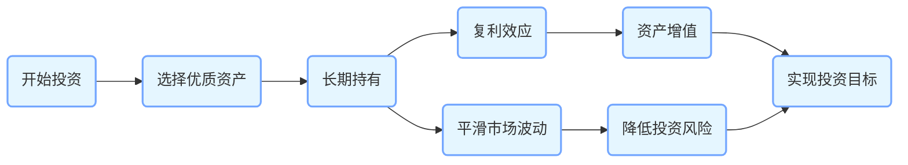

# 约翰·伯格的长期投资观：时间是你的朋友

> 关键词：约翰·伯格、长期投资观、时间价值、投资策略、指数基金

> 摘要：本文深入探讨了约翰·伯格的长期投资观，以“时间是你的朋友”这一核心观点展开。详细介绍了长期投资观的背景、核心概念，剖析了其背后的核心算法原理，结合数学模型进行阐述，并通过项目实战案例展示长期投资策略的实际应用。同时探讨了长期投资观的实际应用场景，推荐了相关学习资源、开发工具框架及论文著作。最后总结了未来发展趋势与挑战，解答常见问题，为投资者全面理解和应用约翰·伯格的长期投资观提供了丰富且深入的参考。

## 1. 背景介绍 
### 1.1 目的和范围
本文的目的在于全面解读约翰·伯格的长期投资观，尤其是“时间是你的朋友”这一关键理念。我们将探讨这一投资观形成的背景、核心原理、实际应用以及对投资者的重要意义。范围涵盖了从理论层面的概念阐述到实际操作的案例分析，旨在帮助投资者深入理解长期投资的价值和策略，从而在投资决策中做出更明智的选择。

### 1.2 预期读者
本文预期读者包括各类投资者，无论是初涉投资领域的新手，还是有一定经验的专业投资者。同时，对于金融领域的研究者、学生以及对投资知识感兴趣的普通读者也具有参考价值。

### 1.3 文档结构概述
本文将按照以下结构展开：首先介绍背景信息，包括目的、预期读者和文档结构概述；接着阐述长期投资观的核心概念与联系，通过文本示意图和 Mermaid 流程图进行直观展示；然后深入剖析核心算法原理和具体操作步骤，并给出 Python 源代码；之后讲解相关数学模型和公式，结合举例说明；再通过项目实战案例展示长期投资策略的实际应用和代码解读；随后探讨长期投资观的实际应用场景；推荐相关的工具和资源；总结未来发展趋势与挑战；解答常见问题；最后提供扩展阅读和参考资料。

### 1.4 术语表
#### 1.4.1 核心术语定义
- **长期投资**：指投资者基于对资产长期价值的判断，持有资产较长时间（通常为数年甚至数十年），以获取资产增值和收益的投资策略。
- **时间价值**：在投资领域，时间价值指随着时间的推移，资金通过投资获得的增值能力。时间越长，资金的增值潜力越大。
- **指数基金**：一种按照特定指数构成比例投资于股票、债券等资产的基金，旨在复制指数的表现。

#### 1.4.2 相关概念解释
- **复利效应**：是指在每一个计息期后，将所生利息加入本金再计利息，逐期滚算，使得资产随着时间的推移呈现指数级增长。复利是长期投资中实现资产增值的重要机制。
- **市场波动**：指市场价格在短期内的上下变动。长期投资者通常可以忽略短期市场波动，专注于资产的长期价值。

#### 1.4.3 缩略词列表
- **ETF**：交易型开放式指数基金（Exchange Traded Fund）
- **CAPM**：资本资产定价模型（Capital Asset Pricing Model）

## 2. 核心概念与联系 
约翰·伯格的长期投资观的核心在于认识到时间在投资中的重要价值。其基本原理是，通过长期持有优质资产，投资者可以充分利用复利效应实现资产的稳健增长，同时减少短期市场波动对投资组合的影响。

### 文本示意图
长期投资观的核心概念可以用以下示意图表示：

时间是投资的关键因素，它与复利效应、资产增值和风险降低紧密相连。长期投资通过复利效应使资产实现指数级增长，同时随着时间的推移，市场波动的影响逐渐被平滑，投资风险降低。投资者通过选择适合的投资标的，如指数基金，长期持有，最终实现投资目标。

### Mermaid 流程图


## 3. 核心算法原理 & 具体操作步骤 
### 核心算法原理
长期投资的核心算法原理基于复利计算。复利的计算公式为：

$A = P(1 + r)^n$

其中：
- $A$ 是最终的本利和
- $P$ 是初始本金
- $r$ 是每期的利率
- $n$ 是期数

### Python 源代码实现
```python
def compound_interest(principal, rate, periods):
    """
    计算复利
    :param principal: 初始本金
    :param rate: 每期利率
    :param periods: 期数
    :return: 最终本利和
    """
    return principal * (1 + rate) ** periods

# 示例
initial_principal = 10000
annual_interest_rate = 0.08
investment_years = 30

final_amount = compound_interest(initial_principal, annual_interest_rate, investment_years)
print(f"经过 {investment_years} 年，初始本金 {initial_principal} 元，年利率 {annual_interest_rate * 100}% 的投资，最终本利和为 {final_amount} 元。")
```

### 具体操作步骤
1. **设定投资目标**：明确自己的投资目标，如养老、子女教育、财富增值等。根据投资目标确定投资期限和预期收益率。
2. **选择投资标的**：选择具有长期增长潜力的资产，如优质股票、债券、指数基金等。对于普通投资者，指数基金是一种较为合适的选择，因为它具有成本低、分散风险等优点。
3. **制定投资计划**：根据自己的财务状况和投资目标，制定合理的投资计划。确定投资金额、投资频率和资产配置比例。
4. **长期持有**：一旦确定了投资计划，就要坚持长期持有，避免因短期市场波动而频繁买卖。
5. **定期评估和调整**：定期评估投资组合的表现，根据市场情况和个人财务状况的变化，适当调整资产配置比例。

## 4. 数学模型和公式 & 详细讲解 & 举例说明 
### 复利公式
复利公式 $A = P(1 + r)^n$ 详细解释了资产在复利作用下的增长过程。

- **$P$（初始本金）**：是投资者最初投入的资金。例如，小明初始投资 10000 元，那么 $P = 10000$。
- **$r$（每期利率）**：表示每期的投资收益率。如果投资的年化收益率为 8%，那么 $r = 0.08$。
- **$n$（期数）**：指投资的时间周期数。如果投资期限为 30 年，每年计算一次复利，那么 $n = 30$。

### 举例说明
假设小李初始投资 5000 元，年化收益率为 7%，投资期限为 20 年。根据复利公式计算：

$A = 5000\times(1 + 0.07)^{20}$

$A \approx 5000\times3.869684$

$A \approx 19348.42$（元）

经过 20 年，小李的初始投资 5000 元将增长到约 19348.42 元。

### 考虑定期追加投资的情况
如果投资者在投资过程中定期追加投资，那么复利计算会更加复杂。假设投资者每年年初追加投资 $M$ 元，年化收益率为 $r$，投资期限为 $n$ 年。最终本利和的计算公式为：

$A = M\times\frac{(1 + r)^n - 1}{r}\times(1 + r)+P\times(1 + r)^n$

其中：
- $A$ 是最终本利和
- $P$ 是初始本金
- $M$ 是每年追加投资金额
- $r$ 是年化收益率
- $n$ 是投资年限

### 举例说明（定期追加投资）
小张初始投资 2000 元，每年年初追加投资 1000 元，年化收益率为 6%，投资期限为 15 年。

$A = 1000\times\frac{(1 + 0.06)^{15} - 1}{0.06}\times(1 + 0.06)+2000\times(1 + 0.06)^{15}$

首先计算 $\frac{(1 + 0.06)^{15} - 1}{0.06}$：

$(1 + 0.06)^{15} \approx 2.396558$

$\frac{(1 + 0.06)^{15} - 1}{0.06} \approx \frac{2.396558 - 1}{0.06} \approx 23.27597$

$1000\times23.27597\times(1 + 0.06) \approx 24672.53$

$2000\times(1 + 0.06)^{15} \approx 2000\times2.396558 \approx 4793.12$

$A \approx 24672.53 + 4793.12 = 29465.65$（元）

经过 15 年，小张的投资最终本利和约为 29465.65 元。

## 5. 项目实战：代码实际案例和详细解释说明 
### 5.1  开发环境搭建
本项目使用 Python 进行开发，建议使用 Anaconda 环境进行管理。以下是具体的搭建步骤：
1. **下载并安装 Anaconda**：从 Anaconda 官方网站（https://www.anaconda.com/products/individual）下载适合自己操作系统的 Anaconda 安装包，并按照安装向导进行安装。
2. **创建虚拟环境**：打开 Anaconda Prompt（Windows）或终端（Mac/Linux），执行以下命令创建一个新的虚拟环境：
```bash
conda create -n investment_env python=3.8
```
3. **激活虚拟环境**：执行以下命令激活虚拟环境：
```bash
conda activate investment_env
```
4. **安装必要的库**：本项目需要使用 `pandas`、`numpy` 等库，执行以下命令进行安装：
```bash
pip install pandas numpy matplotlib
```

### 5.2  源代码详细实现和代码解读
```python
import pandas as pd
import numpy as np
import matplotlib.pyplot as plt

def simulate_investment(initial_principal, annual_contribution, annual_return_rate, investment_years):
    """
    模拟长期投资过程
    :param initial_principal: 初始本金
    :param annual_contribution: 每年追加投资金额
    :param annual_return_rate: 年化收益率
    :param investment_years: 投资年限
    :return: 每年的投资余额
    """
    investment_values = [initial_principal]
    for year in range(1, investment_years + 1):
        previous_value = investment_values[-1]
        current_value = (previous_value + annual_contribution) * (1 + annual_return_rate)
        investment_values.append(current_value)
    return investment_values

# 设定参数
initial_principal = 10000
annual_contribution = 2000
annual_return_rate = 0.07
investment_years = 30

# 模拟投资
investment_values = simulate_investment(initial_principal, annual_contribution, annual_return_rate, investment_years)

# 生成时间序列
years = np.arange(0, investment_years + 1)

# 绘制投资余额变化图
plt.figure(figsize=(10, 6))
plt.plot(years, investment_values, label='Investment Value')
plt.xlabel('Years')
plt.ylabel('Investment Balance')
plt.title('Long-Term Investment Simulation')
plt.legend()
plt.grid(True)
plt.show()

# 打印最终投资余额
print(f"经过 {investment_years} 年，最终投资余额为 {investment_values[-1]} 元。")
```

### 代码解读与分析
1. **`simulate_investment` 函数**：该函数接受初始本金、每年追加投资金额、年化收益率和投资年限作为参数，模拟长期投资过程。在函数内部，通过循环逐年计算投资余额，考虑了每年追加投资和复利增长的因素。
2. **参数设定**：设定初始本金为 10000 元，每年追加投资 2000 元，年化收益率为 7%，投资年限为 30 年。
3. **模拟投资**：调用 `simulate_investment` 函数进行投资模拟，得到每年的投资余额。
4. **绘制图表**：使用 `matplotlib` 库绘制投资余额随时间变化的图表，直观展示长期投资的增长过程。
5. **打印最终投资余额**：打印经过 30 年后的最终投资余额。

通过这个项目实战案例，我们可以直观地看到长期投资在复利效应下的资产增长情况，进一步理解约翰·伯格的长期投资观。

## 6. 实际应用场景 
### 养老规划
长期投资在养老规划中具有重要应用。随着人口老龄化的加剧，养老问题日益突出。通过长期投资，投资者可以在年轻时积累足够的财富，为退休后的生活提供保障。例如，投资者可以每月定期投资一定金额到指数基金中，经过几十年的积累，利用复利效应实现资产的大幅增长。

### 子女教育
为子女的教育储备资金也是长期投资的一个重要应用场景。从子女出生开始，家长可以制定长期投资计划，选择适合的投资标的，如教育基金、债券等。随着时间的推移，投资收益可以为子女的教育费用提供支持，减轻家庭的经济负担。

### 财富传承
长期投资还可以用于财富传承。投资者可以通过长期持有优质资产，如股票、房产等，实现资产的增值和保值。在适当的时候，将资产传承给下一代，实现家族财富的延续。

### 企业发展
对于企业来说，长期投资也是一种重要的战略决策。企业可以通过长期投资于研发、技术创新、市场拓展等方面，提升自身的核心竞争力，实现可持续发展。例如，一些科技企业会长期投资于研发项目，以保持在技术领域的领先地位。

## 7. 工具和资源推荐
### 7.1 学习资源推荐
#### 7.1.1 书籍推荐
- 《共同基金常识》（约翰·伯格著）：这本书是约翰·伯格的经典著作，深入阐述了长期投资和指数基金的理念，是投资者的必读之书。
- 《聪明的投资者》（本杰明·格雷厄姆著）：价值投资的经典之作，介绍了投资的基本原则和方法，对长期投资者具有重要的指导意义。
- 《漫步华尔街》（伯顿·马尔基尔著）：本书系统地介绍了各种投资理论和方法，强调了长期投资和分散投资的重要性。

#### 7.1.2 在线课程
- Coursera 平台上的“投资学原理”课程：由知名高校的教授授课，系统地介绍了投资学的基本原理和方法。
- 网易云课堂上的“基金投资入门与实战”课程：适合初学者，讲解了基金投资的基本知识和技巧。

#### 7.1.3 技术博客和网站
- 雪球网：国内知名的投资社区，提供了丰富的投资资讯、研究报告和投资者交流平台。
- 东方财富网：提供全面的金融信息和投资分析工具，是投资者获取市场信息的重要渠道。

### 7.2 开发工具框架推荐
#### 7.2.1 IDE和编辑器
- PyCharm：一款专业的 Python 集成开发环境，提供了丰富的代码编辑、调试和项目管理功能。
- Jupyter Notebook：交互式的开发环境，适合进行数据分析和可视化，方便快速验证投资模型和算法。

#### 7.2.2 调试和性能分析工具
- `pdb`：Python 自带的调试工具，用于调试 Python 代码，定位和解决问题。
- `cProfile`：Python 的性能分析工具，用于分析代码的运行时间和性能瓶颈。

#### 7.2.3 相关框架和库
- `pandas`：强大的数据处理和分析库，用于处理投资数据和进行数据分析。
- `numpy`：提供了高效的数值计算功能，在投资模型的实现中经常使用。
- `matplotlib`：用于数据可视化，将投资结果以图表的形式直观展示。

### 7.3 相关论文著作推荐
#### 7.3.1 经典论文
- Markowitz, H. M. (1952). "Portfolio Selection". The Journal of Finance, 7(1): 77 - 91. 这篇论文提出了现代投资组合理论，为资产配置和风险管理提供了理论基础。
- Sharpe, W. F. (1964). "Capital Asset Prices: A Theory of Market Equilibrium under Conditions of Risk". The Journal of Finance, 19(3): 425 - 442. 该论文提出了资本资产定价模型（CAPM），用于解释资产的预期收益率和风险之间的关系。