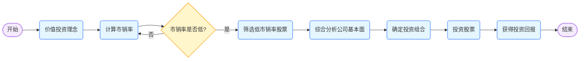

# 约翰·内夫的低市销率投资：另一种价值投资视角

> 关键词：约翰·内夫、低市销率投资、价值投资、财务分析、股票估值

> 摘要：本文深入探讨了约翰·内夫所倡导的低市销率投资这一独特的价值投资视角。首先介绍了低市销率投资的背景，包括目的、预期读者等内容。接着阐述了核心概念及联系，通过示意图和流程图直观呈现。详细讲解了核心算法原理和操作步骤，并结合Python代码进行说明。运用数学模型和公式进一步剖析低市销率投资的本质，还给出了实际案例。在项目实战部分，展示了开发环境搭建、源代码实现与解读。分析了低市销率投资的实际应用场景，推荐了相关的学习资源、开发工具框架和论文著作。最后总结了未来发展趋势与挑战，解答常见问题并提供扩展阅读与参考资料，旨在为投资者提供全面且深入的低市销率投资知识体系。

## 1. 背景介绍 
### 1.1 目的和范围
本文章旨在全面介绍约翰·内夫的低市销率投资理念，深入剖析其核心原理、操作方法以及在实际投资中的应用。通过对低市销率投资的研究，帮助投资者了解这一独特的价值投资视角，为他们在股票投资决策中提供新的思路和方法。文章的范围涵盖了低市销率投资的基本概念、相关算法、数学模型、实际案例分析以及未来发展趋势等方面。

### 1.2 预期读者
本文预期读者主要包括对股票投资感兴趣的个人投资者，无论是新手投资者希望了解更多投资策略，还是有一定经验的投资者寻求新的投资视角。同时，金融专业的学生、研究人员以及金融从业者也可以从本文中获取关于低市销率投资的专业知识和研究思路。

### 1.3 文档结构概述
本文将按照以下结构进行阐述：首先介绍低市销率投资的背景信息，包括目的、读者群体和文档结构等；接着阐述核心概念及联系，通过示意图和流程图直观展示其原理；详细讲解核心算法原理和操作步骤，并结合Python代码进行说明；运用数学模型和公式深入剖析低市销率投资的本质；在项目实战部分，展示开发环境搭建、源代码实现与解读；分析低市销率投资的实际应用场景；推荐相关的学习资源、开发工具框架和论文著作；最后总结未来发展趋势与挑战，解答常见问题并提供扩展阅读与参考资料。

### 1.4 术语表
#### 1.4.1 核心术语定义
- **市销率（Price-to-Sales Ratio，PS）**：是指股票价格与每股销售收入的比率，反映了市场对公司销售收入的估值水平。计算公式为：$PS = \frac{股价}{每股销售收入}$。
- **低市销率投资**：是一种价值投资策略，通过寻找市销率较低的股票进行投资，认为这些股票可能被市场低估，具有较高的投资价值。
- **价值投资**：是一种投资理念，强调通过分析公司的基本面，寻找被市场低估的股票进行投资，以获取长期的投资回报。

#### 1.4.2 相关概念解释
- **每股销售收入**：是指公司的销售收入除以总股本，反映了每股股票对应的销售收入水平。
- **市场估值**：是指市场对公司价值的评估，通常通过股票价格、市销率、市盈率等指标来体现。
- **投资回报**：是指投资者通过投资所获得的收益，包括股息收入和资本增值。

#### 1.4.3 缩略词列表
- **PS**：市销率（Price-to-Sales Ratio）

## 2. 核心概念与联系 
### 核心概念原理
约翰·内夫的低市销率投资基于价值投资的基本理念，认为市场有时会对某些公司的价值产生错误的评估。市销率作为一个重要的估值指标，反映了市场对公司销售收入的估值水平。当市销率较低时，意味着市场对公司的销售收入给予了较低的估值，可能是因为公司目前处于困境、市场关注度较低或者行业竞争激烈等原因。但实际上，这些公司可能具有良好的基本面、潜在的增长能力或者被低估的资产。通过选择低市销率的股票进行投资，投资者可以在市场发现这些公司的真实价值时获得较高的投资回报。

### 架构的文本示意图
```plaintext
低市销率投资理念
|
|-- 价值投资基础
|   |-- 寻找被低估股票
|   |-- 关注公司基本面
|
|-- 市销率指标
|   |-- 计算市销率
|   |-- 筛选低市销率股票
|
|-- 投资决策
|   |-- 综合分析公司情况
|   |-- 确定投资组合
|
|-- 投资回报
|   |-- 股息收入
|   |-- 资本增值
```

### Mermaid 流程图


## 3. 核心算法原理 & 具体操作步骤 
### 核心算法原理
低市销率投资的核心算法主要围绕市销率的计算和低市销率股票的筛选。市销率的计算公式为：

$PS = \frac{P}{S}$

其中，$PS$ 表示市销率，$P$ 表示股票价格，$S$ 表示每股销售收入。

在实际操作中，投资者需要获取大量股票的价格和每股销售收入数据，计算它们的市销率，并按照市销率从小到大进行排序，筛选出市销率较低的股票。

### 具体操作步骤
1. **数据收集**：收集股票的价格数据和公司的财务报表数据，从中提取每股销售收入信息。可以通过金融数据提供商（如东方财富、Wind等）、证券交易所网站或者公司官方公告等渠道获取数据。
2. **市销率计算**：根据上述公式，使用收集到的股票价格和每股销售收入数据计算每只股票的市销率。
3. **股票筛选**：按照市销率从小到大对股票进行排序，设定一个市销率阈值（例如市销率小于1），筛选出市销率低于该阈值的股票。
4. **基本面分析**：对筛选出的低市销率股票进行基本面分析，包括公司的盈利能力、偿债能力、成长能力等方面，评估公司的投资价值。
5. **投资组合确定**：根据基本面分析的结果，选择部分低市销率股票构建投资组合。可以采用分散投资的原则，降低投资风险。

### Python 源代码实现
```python
import pandas as pd

# 模拟收集的股票数据
data = {
    '股票代码': ['000001', '000002', '000003', '000004', '000005'],
    '股票价格': [10.0, 15.0, 20.0, 25.0, 30.0],
    '每股销售收入': [5.0, 10.0, 2.0, 8.0, 15.0]
}

df = pd.DataFrame(data)

# 计算市销率
df['市销率'] = df['股票价格'] / df['每股销售收入']

# 筛选市销率小于1的股票
low_ps_stocks = df[df['市销率'] < 1]

print("低市销率股票筛选结果：")
print(low_ps_stocks)
```

### 代码解释
1. **数据模拟**：使用字典 `data` 模拟收集到的股票数据，包括股票代码、股票价格和每股销售收入。
2. **数据转换**：将字典数据转换为 Pandas 的 DataFrame 对象 `df`，方便进行数据处理。
3. **市销率计算**：使用 `df['市销率'] = df['股票价格'] / df['每股销售收入']` 计算每只股票的市销率。
4. **股票筛选**：使用布尔索引 `df[df['市销率'] < 1]` 筛选出市销率小于1的股票，并将结果存储在 `low_ps_stocks` 中。
5. **结果输出**：打印筛选出的低市销率股票信息。

## 4. 数学模型和公式 & 详细讲解 & 举例说明 
### 数学模型和公式
低市销率投资的核心数学模型主要围绕市销率的计算和投资回报的评估。

#### 市销率计算公式
$PS = \frac{P}{S}$

其中，$PS$ 表示市销率，$P$ 表示股票价格，$S$ 表示每股销售收入。

#### 投资回报计算公式
投资回报可以分为股息收入和资本增值两部分。假设投资者在 $t_0$ 时刻以价格 $P_0$ 买入股票，在 $t_1$ 时刻以价格 $P_1$ 卖出股票，期间获得的股息为 $D$，则投资回报率 $R$ 的计算公式为：

$R = \frac{P_1 - P_0 + D}{P_0} \times 100\%$

### 详细讲解
- **市销率**：市销率反映了市场对公司销售收入的估值水平。较低的市销率可能意味着公司被市场低估，具有潜在的投资价值。但市销率并不是唯一的投资指标，还需要结合公司的基本面进行综合分析。
- **投资回报**：投资回报是投资者关注的核心指标之一。股息收入是公司向股东分配的利润，资本增值是指股票价格上涨带来的收益。投资者在评估投资回报时，需要考虑投资期限、市场波动等因素。

### 举例说明
假设某股票的当前价格为 $P = 20$ 元，每股销售收入为 $S = 10$ 元，则该股票的市销率为：

$PS = \frac{20}{10} = 2$

如果投资者在 $t_0$ 时刻以 $P_0 = 20$ 元的价格买入该股票，在 $t_1$ 时刻以 $P_1 = 25$ 元的价格卖出股票，期间获得的股息为 $D = 1$ 元，则投资回报率为：

$R = \frac{25 - 20 + 1}{20} \times 100\% = 30\%$

## 5. 项目实战：代码实际案例和详细解释说明 
### 5.1  开发环境搭建
#### 操作系统
本项目可以在 Windows、Linux 或 macOS 等主流操作系统上进行开发。

#### Python 环境
建议使用 Python 3.7 及以上版本。可以从 Python 官方网站（https://www.python.org/downloads/）下载并安装 Python。

#### 第三方库安装
本项目需要使用以下第三方库：
- `pandas`：用于数据处理和分析。
- `numpy`：用于数值计算。
- `matplotlib`：用于数据可视化。

可以使用以下命令安装这些库：
```sh
pip install pandas numpy matplotlib
```

### 5.2  源代码详细实现和代码解读
```python
import pandas as pd
import numpy as np
import matplotlib.pyplot as plt

# 从 CSV 文件中读取股票数据
def read_stock_data(file_path):
    df = pd.read_csv(file_path)
    return df

# 计算市销率
def calculate_ps_ratio(df):
    df['市销率'] = df['股票价格'] / df['每股销售收入']
    return df

# 筛选低市销率股票
def filter_low_ps_stocks(df, threshold=1):
    low_ps_stocks = df[df['市销率'] < threshold]
    return low_ps_stocks

# 绘制低市销率股票市销率分布直方图
def plot_ps_distribution(low_ps_stocks):
    plt.hist(low_ps_stocks['市销率'], bins=20)
    plt.xlabel('市销率')
    plt.ylabel('股票数量')
    plt.title('低市销率股票市销率分布直方图')
    plt.show()

# 主函数
def main():
    file_path = 'stock_data.csv'
    # 读取股票数据
    stock_data = read_stock_data(file_path)
    # 计算市销率
    stock_data = calculate_ps_ratio(stock_data)
    # 筛选低市销率股票
    low_ps_stocks = filter_low_ps_stocks(stock_data)
    print("低市销率股票筛选结果：")
    print(low_ps_stocks)
    # 绘制市销率分布直方图
    plot_ps_distribution(low_ps_stocks)

if __name__ == "__main__":
    main()
```

### 代码解读与分析
1. **数据读取**：`read_stock_data` 函数用于从 CSV 文件中读取股票数据，并将其转换为 Pandas 的 DataFrame 对象。
2. **市销率计算**：`calculate_ps_ratio` 函数根据股票价格和每股销售收入计算每只股票的市销率，并将结果添加到 DataFrame 中。
3. **低市销率股票筛选**：`filter_low_ps_stocks` 函数根据设定的市销率阈值筛选出低市销率股票。
4. **数据可视化**：`plot_ps_distribution` 函数使用 `matplotlib` 库绘制低市销率股票市销率分布直方图，直观展示低市销率股票的市销率分布情况。
5. **主函数**：`main` 函数调用上述函数完成数据读取、市销率计算、股票筛选和数据可视化等操作。

## 6. 实际应用场景 
### 股票投资组合构建
投资者可以使用低市销率投资策略构建股票投资组合。通过筛选市销率较低的股票，选择具有良好基本面的公司进行投资，分散投资风险，提高投资回报。例如，投资者可以将资金分配到不同行业的低市销率股票中，避免过度集中投资于某一行业。

### 价值发现与长期投资
低市销率投资策略有助于投资者发现被市场低估的股票。对于那些具有潜在增长能力但目前市销率较低的公司，投资者可以进行长期投资，等待市场发现其真实价值，从而获得较高的资本增值。例如，一些新兴行业的公司在发展初期可能市销率较低，但随着行业的发展和公司的成长，其市销率可能会逐渐提高。

### 投资决策辅助
在进行股票投资决策时，市销率可以作为一个重要的参考指标。投资者可以将市销率与其他估值指标（如市盈率、市净率等）结合使用，综合评估公司的投资价值。例如，当一只股票的市销率较低且市盈率也较低时，可能意味着该股票具有较高的投资价值。

## 7. 工具和资源推荐
### 7.1 学习资源推荐
#### 7.1.1 书籍推荐
- 《约翰·内夫的成功投资》：本书详细介绍了约翰·内夫的投资理念和方法，包括低市销率投资策略，是学习低市销率投资的经典读物。
- 《聪明的投资者》：本杰明·格雷厄姆的经典著作，阐述了价值投资的基本原理和方法，对低市销率投资有重要的指导意义。
- 《证券分析》：同样是本杰明·格雷厄姆的著作，深入分析了证券的价值评估方法，为低市销率投资提供了理论基础。

#### 7.1.2 在线课程
- Coursera 上的“投资学原理”课程：该课程系统介绍了投资学的基本原理和方法，包括股票估值、投资组合构建等内容，对学习低市销率投资有很大帮助。
- 网易云课堂上的“价值投资实战教程”：课程结合实际案例，讲解价值投资的实战技巧，其中包括低市销率投资策略的应用。

#### 7.1.3 技术博客和网站
- 雪球网：国内知名的投资社区，提供大量的股票分析文章和投资策略讨论，投资者可以在上面学习到低市销率投资的实践经验。
- 东方财富网：提供丰富的金融数据和资讯，投资者可以通过该网站获取股票的价格、财务报表等数据，用于低市销率投资分析。

### 7.2 开发工具框架推荐
#### 7.2.1 IDE和编辑器
- PyCharm：一款专业的 Python 集成开发环境，提供代码编辑、调试、版本控制等功能，适合进行低市销率投资相关的 Python 代码开发。
- Jupyter Notebook：一种交互式开发环境，支持代码、文本、图表等多种形式的展示，方便进行数据分析和可视化，对于低市销率投资的数据处理和分析非常有用。

#### 7.2.2 调试和性能分析工具
- `pdb`：Python 自带的调试工具，可以帮助开发者定位代码中的问题，提高代码的稳定性。
- `cProfile`：Python 的性能分析工具，可以分析代码的运行时间和资源消耗情况，帮助开发者优化代码性能。

#### 7.2.3 相关框架和库
- `pandas`：强大的数据处理和分析库，提供了丰富的数据结构和函数，方便进行股票数据的处理和分析。
- `numpy`：用于数值计算的基础库，在低市销率投资的算法实现中经常使用。
- `matplotlib`：用于数据可视化的库，可以绘制各种图表，直观展示低市销率股票的相关数据。

### 7.3 相关论文著作推荐
#### 7.3.1 经典论文
- Fama, E. F., & French, K. R. (1992). The cross-section of expected stock returns. Journal of Finance, 47(2), 427-465. 该论文提出了著名的 Fama-French 三因子模型，对股票收益的影响因素进行了深入分析，为低市销率投资提供了理论支持。
- Lakonishok, J., Shleifer, A., & Vishny, R. W. (1994). Contrarian investment, extrapolation, and risk. Journal of Finance, 49(5), 1541-1578. 研究了逆向投资策略的有效性，其中包括低市销率投资策略，对投资者有重要的启示作用。

#### 7.3.2 最新研究成果
可以通过学术数据库（如知网、万方、Web of Science 等）搜索关于低市销率投资的最新研究论文，了解该领域的最新发展动态。

#### 7.3.3 应用案例分析
一些金融研究机构和投资公司会发布关于低市销率投资的应用案例分析报告，投资者可以通过这些报告了解低市销率投资在实际中的应用效果和操作方法。

## 8. 总结：未来发展趋势与挑战
### 未来发展趋势
- **与其他投资策略融合**：低市销率投资策略可能会与其他投资策略（如成长投资、动量投资等）相结合，形成更加多元化的投资策略。例如，投资者可以在筛选低市销率股票的基础上，进一步选择具有较高成长潜力的公司进行投资。
- **大数据和人工智能的应用**：随着大数据和人工智能技术的发展，投资者可以利用更多的数据和先进的算法进行低市销率投资分析。例如，通过分析社交媒体数据、行业新闻等非结构化数据，挖掘潜在的低市销率投资机会。
- **国际化投资**：随着全球金融市场的一体化，投资者可以将低市销率投资策略应用于国际市场，寻找全球范围内的低市销率股票进行投资，实现资产的全球化配置。

### 挑战
- **市场有效性问题**：在有效市场中，股票价格已经反映了所有公开信息，低市销率股票可能并不一定被低估。因此，投资者需要更加深入地分析公司的基本面，寻找真正具有投资价值的低市销率股票。
- **行业差异问题**：不同行业的市销率水平存在较大差异，不能简单地以统一的市销率阈值来筛选股票。投资者需要了解不同行业的特点和市销率的合理范围，进行行业内的比较和分析。
- **宏观经济环境变化**：宏观经济环境的变化会对股票市场产生影响，低市销率股票的投资价值也可能随之发生变化。投资者需要密切关注宏观经济指标和政策变化，及时调整投资策略。

## 9. 附录：常见问题与解答
### 问题1：市销率越低越好吗？
答：市销率越低并不一定意味着股票的投资价值越高。市销率只是一个估值指标，还需要结合公司的基本面进行综合分析。例如，一些公司市销率低可能是因为其业务处于衰退期或者面临重大风险。因此，在选择低市销率股票时，需要关注公司的盈利能力、偿债能力、成长能力等方面。

### 问题2：如何确定市销率的阈值？
答：市销率的阈值没有固定的标准，通常需要根据不同行业和市场情况进行调整。一般来说，可以参考行业的平均市销率水平，将阈值设定为低于行业平均市销率的某个数值。例如，对于一些成熟行业，可以将阈值设定为市销率小于1；对于新兴行业，由于其发展潜力较大，市销率阈值可以适当提高。

### 问题3：低市销率投资策略适合短期投资还是长期投资？
答：低市销率投资策略更适合长期投资。因为低市销率股票的价值发现需要一定的时间，市场对公司的重新估值可能不会立即发生。长期投资可以让投资者有足够的时间等待公司的价值被市场认可，从而获得较高的投资回报。同时，长期投资也可以降低市场短期波动对投资收益的影响。

## 10. 扩展阅读 & 参考资料
### 扩展阅读
- 《金融炼金术》：乔治·索罗斯的著作，探讨了金融市场的运行规律和投资哲学，对投资者的思维方式有很大的启发。
- 《投资最重要的事》：霍华德·马克斯的著作，分享了作者在投资领域的经验和见解，包括风险控制、逆向投资等方面，对低市销率投资有一定的借鉴意义。

### 参考资料
- 约翰·内夫的相关访谈和演讲资料。
- 各大金融数据提供商（如东方财富、Wind等）的股票数据和研究报告。
- 相关学术期刊上关于低市销率投资和价值投资的研究论文。

作者：AI天才研究院/AI Genius Institute & 禅与计算机程序设计艺术 /Zen And The Art of Computer Programming