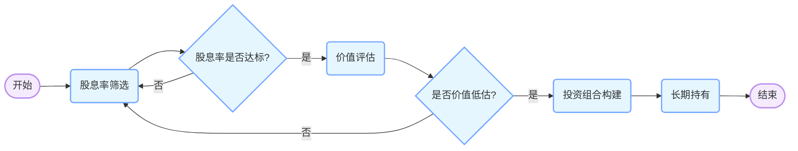

# 约翰·奈夫的高股息价值投资：稳定收益的来源

> 关键词：约翰·奈夫、高股息价值投资、稳定收益、股息率、价值评估

> 摘要：本文深入探讨了约翰·奈夫所倡导的高股息价值投资策略，旨在揭示其作为稳定收益来源的原理和方法。通过对高股息价值投资的核心概念、算法原理、数学模型进行详细分析，并结合项目实战案例和实际应用场景，为投资者提供全面且深入的理解。同时，推荐了相关的学习资源、开发工具和论文著作，最后对该投资策略的未来发展趋势与挑战进行了总结，还设置了常见问题解答和扩展阅读参考资料，以帮助读者更好地掌握这一投资策略。

## 1. 背景介绍 
### 1.1 目的和范围
本文章的主要目的是深入剖析约翰·奈夫的高股息价值投资策略，详细阐述其作为稳定收益来源的内在逻辑和实际应用方法。范围涵盖高股息价值投资的核心概念、算法原理、数学模型、项目实战案例、实际应用场景等多个方面，旨在为投资者提供一个全面、系统的投资知识体系，帮助他们更好地理解和运用这一策略进行投资决策。

### 1.2 预期读者
预期读者包括对价值投资感兴趣的个人投资者、金融从业者、投资机构分析师以及相关领域的研究人员。无论你是投资新手，希望了解一种稳健的投资策略，还是有一定投资经验的专业人士，希望进一步优化投资组合，本文都将为你提供有价值的参考。

### 1.3 文档结构概述
本文将按照以下结构进行阐述：首先介绍高股息价值投资的核心概念及其相互联系，通过文本示意图和 Mermaid 流程图进行直观展示；接着详细讲解核心算法原理和具体操作步骤，并使用 Python 源代码进行说明；然后给出数学模型和公式，并结合实例进行详细讲解；之后通过项目实战案例，介绍开发环境搭建、源代码实现和代码解读；再探讨该投资策略的实际应用场景；推荐相关的学习资源、开发工具和论文著作；最后总结未来发展趋势与挑战，设置常见问题解答和扩展阅读参考资料。

### 1.4 术语表
#### 1.4.1 核心术语定义
- **高股息价值投资**：一种投资策略，专注于寻找那些股息率较高且具有内在价值的股票进行投资，通过股息收入和股票价值的增长获取稳定收益。
- **股息率**：股息与股票价格的比率，反映了投资者从股息中获得的收益率。计算公式为：股息率 = 年度股息 / 股票价格。
- **内在价值**：股票所具有的真实价值，通常通过对公司的财务状况、盈利能力、行业前景等因素进行综合分析来评估。
- **市盈率（PE）**：股票价格与每股收益的比率，用于衡量股票的估值水平。计算公式为：市盈率 = 股票价格 / 每股收益。

#### 1.4.2 相关概念解释
- **安全边际**：指股票的市场价格低于其内在价值的部分。在高股息价值投资中，寻找具有较大安全边际的股票可以降低投资风险。
- **现金流折现模型（DCF）**：一种评估股票内在价值的方法，通过预测公司未来的现金流，并将其折现到当前时刻来计算股票的价值。

#### 1.4.3 缩略词列表
- **PE**：市盈率（Price - Earnings Ratio）
- **DCF**：现金流折现模型（Discounted Cash Flow Model）

## 2. 核心概念与联系 

### 核心概念原理
约翰·奈夫的高股息价值投资策略基于以下几个核心原理：

1. **股息的稳定性**：股息是公司向股东分配的利润，稳定的股息发放通常意味着公司具有稳定的盈利能力和良好的财务状况。通过投资高股息股票，投资者可以获得持续的现金流入，降低投资组合的波动性。

2. **价值低估**：寻找那些市场价格低于其内在价值的股票。这些股票可能由于市场短期波动、行业负面消息或公司暂时的困境而被低估。当市场逐渐认识到其真实价值时，股票价格有望上涨，从而为投资者带来资本增值。

3. **长期投资**：高股息价值投资强调长期持有股票，以充分享受股息收入和股票价值增长的双重收益。短期市场波动可能会影响股票价格，但从长期来看，公司的基本面和内在价值将决定股票的表现。

### 架构的文本示意图
```plaintext
高股息价值投资
|
|-- 股息率筛选
|   |-- 计算股息率
|   |-- 设定股息率阈值
|
|-- 价值评估
|   |-- 财务分析
|   |   |-- 盈利能力
|   |   |-- 偿债能力
|   |   |-- 运营能力
|   |-- 估值模型
|   |   |-- 市盈率法
|   |   |-- 现金流折现模型
|
|-- 投资组合构建
|   |-- 分散投资
|   |-- 风险控制
|
|-- 长期持有
|   |-- 享受股息收入
|   |-- 等待价值回归
```

### Mermaid 流程图


## 3. 核心算法原理 & 具体操作步骤 

### 核心算法原理
高股息价值投资的核心算法主要包括股息率计算和价值评估两部分。

#### 股息率计算
股息率的计算公式为：
$$股息率 = \frac{年度股息}{股票价格}$$

年度股息可以通过公司的财务报表或公告获取，股票价格可以从证券交易所或金融数据提供商处获得。

#### 价值评估
常见的价值评估方法有市盈率法和现金流折现模型。

##### 市盈率法
市盈率法通过比较股票的市盈率与行业平均市盈率或历史市盈率来判断股票是否被低估。计算公式为：
$$市盈率 = \frac{股票价格}{每股收益}$$

如果股票的市盈率低于行业平均市盈率或历史市盈率，且公司具有良好的基本面，则该股票可能被低估。

##### 现金流折现模型
现金流折现模型通过预测公司未来的现金流，并将其折现到当前时刻来计算股票的内在价值。计算公式为：
$$V = \sum_{t=1}^{n} \frac{CF_t}{(1 + r)^t} + \frac{TV}{(1 + r)^n}$$

其中，$V$ 表示股票的内在价值，$CF_t$ 表示第 $t$ 期的现金流，$r$ 表示折现率，$TV$ 表示终值，$n$ 表示预测期数。

### 具体操作步骤

#### 步骤 1：数据收集
收集股票的历史股息数据、财务报表数据（如每股收益、现金流等）、股票价格数据以及行业相关数据。

#### 步骤 2：股息率计算
使用上述股息率计算公式，计算每只股票的股息率。

#### 步骤 3：股息率筛选
设定一个股息率阈值，筛选出股息率高于该阈值的股票。

#### 步骤 4：价值评估
对筛选出的股票进行价值评估，可以使用市盈率法或现金流折现模型。

#### 步骤 5：投资组合构建
根据价值评估结果，选择具有较高投资价值的股票构建投资组合。同时，注意分散投资，降低投资风险。

#### 步骤 6：长期持有
持有投资组合，定期进行业绩评估和调整。

### Python 源代码实现

```python
import pandas as pd

# 假设我们有一个包含股票信息的 DataFrame
# 列名包括 '股票代码', '股票价格', '年度股息', '每股收益'
data = {
    '股票代码': ['000001', '000002', '000003'],
    '股票价格': [10.0, 20.0, 30.0],
    '年度股息': [0.5, 1.0, 1.5],
    '每股收益': [1.0, 2.0, 3.0]
}
df = pd.DataFrame(data)

# 计算股息率
df['股息率'] = df['年度股息'] / df['股票价格']

# 设定股息率阈值
dividend_yield_threshold = 0.05

# 筛选出股息率高于阈值的股票
filtered_df = df[df['股息率'] > dividend_yield_threshold]

# 计算市盈率
filtered_df['市盈率'] = filtered_df['股票价格'] / filtered_df['每股收益']

print(filtered_df)
```

## 4. 数学模型和公式 & 详细讲解 & 举例说明 

### 股息率公式
$$股息率 = \frac{年度股息}{股票价格}$$

#### 详细讲解
股息率反映了投资者从股息中获得的收益率。年度股息是公司在一年内向股东分配的每股股息总和，股票价格是当前股票的市场价格。股息率越高，说明投资者从股息中获得的收益越高。

#### 举例说明
假设某股票的年度股息为 2 元，当前股票价格为 50 元，则该股票的股息率为：
$$股息率 = \frac{2}{50} = 0.04 = 4\%$$

### 市盈率公式
$$市盈率 = \frac{股票价格}{每股收益}$$

#### 详细讲解
市盈率是衡量股票估值水平的重要指标。每股收益是公司每股股票的盈利情况，股票价格是当前股票的市场价格。市盈率越高，说明市场对该股票的预期越高，但也可能意味着股票被高估；市盈率越低，说明股票可能被低估。

#### 举例说明
假设某股票的当前价格为 30 元，每股收益为 3 元，则该股票的市盈率为：
$$市盈率 = \frac{30}{3} = 10$$

### 现金流折现模型公式
$$V = \sum_{t=1}^{n} \frac{CF_t}{(1 + r)^t} + \frac{TV}{(1 + r)^n}$$

#### 详细讲解
现金流折现模型的核心思想是将公司未来的现金流折现到当前时刻，以计算股票的内在价值。$CF_t$ 表示第 $t$ 期的现金流，$r$ 表示折现率，$TV$ 表示终值，$n$ 表示预测期数。折现率反映了资金的时间价值和投资风险，终值是预测期结束后公司的价值。

#### 举例说明
假设某公司未来 3 年的现金流分别为 100 万元、120 万元、150 万元，折现率为 10%，预测期结束后的终值为 1000 万元。则该公司的内在价值为：

第 1 年现金流折现：
$$\frac{100}{(1 + 0.1)^1} = \frac{100}{1.1} \approx 90.91$$

第 2 年现金流折现：
$$\frac{120}{(1 + 0.1)^2} = \frac{120}{1.21} \approx 99.17$$

第 3 年现金流折现：
$$\frac{150}{(1 + 0.1)^3} = \frac{150}{1.331} \approx 112.69$$

终值折现：
$$\frac{1000}{(1 + 0.1)^3} = \frac{1000}{1.331} \approx 751.31$$

内在价值：
$$V = 90.91 + 99.17 + 112.69 + 751.31 = 1054.08$$

## 5. 项目实战：代码实际案例和详细解释说明 

### 5.1  开发环境搭建
#### 操作系统
推荐使用 Windows、Mac OS 或 Linux 操作系统。

#### 编程语言
使用 Python 作为开发语言，Python 具有丰富的数据分析和金融计算库，适合进行高股息价值投资分析。

#### 安装必要的库
使用以下命令安装必要的 Python 库：
```sh
pip install pandas numpy matplotlib yfinance
```

- `pandas`：用于数据处理和分析。
- `numpy`：用于数值计算。
- `matplotlib`：用于数据可视化。
- `yfinance`：用于获取股票数据。

### 5.2  源代码详细实现和代码解读

```python
import yfinance as yf
import pandas as pd
import matplotlib.pyplot as plt

# 定义股票列表
stock_list = ['AAPL', 'MSFT', 'JNJ', 'PG']

# 获取股票数据
data = yf.download(stock_list, start='2020-01-01', end='2023-01-01')

# 提取收盘价和股息数据
close_prices = data['Close']
dividends = data['Dividends']

# 计算股息率
dividend_yields = dividends / close_prices

# 计算平均股息率
average_dividend_yields = dividend_yields.mean()

# 绘制股息率折线图
average_dividend_yields.plot(kind='line', title='Average Dividend Yields')
plt.xlabel('Stock')
plt.ylabel('Dividend Yield')
plt.show()

# 筛选出股息率最高的股票
highest_dividend_stock = average_dividend_yields.idxmax()
print(f"股息率最高的股票是: {highest_dividend_stock}")
```

### 代码解读与分析

#### 代码功能概述
该代码的主要功能是获取指定股票的历史价格和股息数据，计算股息率，绘制股息率折线图，并筛选出股息率最高的股票。

#### 代码详细解读
1. **导入必要的库**：导入 `yfinance`、`pandas` 和 `matplotlib.pyplot` 库。
2. **定义股票列表**：定义要分析的股票列表。
3. **获取股票数据**：使用 `yf.download` 函数获取指定股票在指定时间范围内的历史数据。
4. **提取收盘价和股息数据**：从获取的数据中提取收盘价和股息数据。
5. **计算股息率**：使用股息数据除以收盘价数据，计算股息率。
6. **计算平均股息率**：计算每只股票的平均股息率。
7. **绘制股息率折线图**：使用 `plot` 函数绘制平均股息率折线图。
8. **筛选出股息率最高的股票**：使用 `idxmax` 函数筛选出平均股息率最高的股票，并打印结果。

## 6. 实际应用场景 
### 个人投资者
对于个人投资者来说，高股息价值投资策略可以作为一种稳健的投资方式。通过投资高股息股票，个人投资者可以获得稳定的股息收入，同时享受股票价值增长的潜力。这种策略适合那些风险偏好较低、追求长期稳定收益的投资者。

### 机构投资者
机构投资者如养老基金、保险公司等通常需要保证资金的安全性和稳定性。高股息价值投资策略符合他们的投资需求，通过构建高股息股票投资组合，机构投资者可以获得稳定的现金流，降低投资组合的波动性。

### 资产配置
高股息价值投资可以作为资产配置的一部分，与其他投资策略如成长投资、指数投资等相结合。通过合理的资产配置，可以降低整个投资组合的风险，提高投资收益的稳定性。

## 7. 工具和资源推荐
### 7.1 学习资源推荐
#### 7.1.1 书籍推荐
- 《约翰·奈夫的成功投资》：约翰·奈夫亲自撰写的投资著作，详细介绍了他的投资理念和策略。
- 《聪明的投资者》：本杰明·格雷厄姆的经典投资著作，对价值投资的原理和方法进行了深入阐述。
- 《证券分析》：同样是本杰明·格雷厄姆的著作，被誉为投资领域的圣经，为投资者提供了系统的投资分析方法。

#### 7.1.2 在线课程
- Coursera 上的“投资学原理”课程：由知名大学教授授课，涵盖了投资学的基本原理和方法。
- 网易云课堂上的“价值投资实战课程”：结合实际案例，讲解价值投资的具体应用。

#### 7.1.3 技术博客和网站
- 雪球网：国内知名的投资交流社区，提供丰富的股票分析和投资策略分享。
- Seeking Alpha：国外的投资研究网站，有大量专业的投资分析文章和报告。

### 7.2 开发工具框架推荐
#### 7.2.1 IDE和编辑器
- PyCharm：功能强大的 Python 集成开发环境，提供代码编辑、调试、版本控制等功能。
- Jupyter Notebook：交互式编程环境，适合进行数据分析和可视化。

#### 7.2.2 调试和性能分析工具
- PDB：Python 内置的调试工具，可用于调试 Python 代码。
- cProfile：Python 内置的性能分析工具，可用于分析代码的性能瓶颈。

#### 7.2.3 相关框架和库
- Pandas：用于数据处理和分析的 Python 库，提供了丰富的数据结构和函数。
- NumPy：用于数值计算的 Python 库，提供了高效的数组操作和数学函数。
- Matplotlib：用于数据可视化的 Python 库，可绘制各种类型的图表。

### 7.3 相关论文著作推荐
#### 7.3.1 经典论文
- 《The Dividend Puzzle》：探讨了股息政策的谜题，对理解股息的作用和影响具有重要意义。
- 《Value Investing: The Use of Historical Financial Statement Information to Separate Winners from Losers》：研究了价值投资策略的有效性，为价值投资提供了理论支持。

#### 7.3.2 最新研究成果
- 可以关注顶级金融学术期刊如《Journal of Finance》、《Review of Financial Studies》等，获取关于高股息价值投资的最新研究成果。

#### 7.3.3 应用案例分析
- 一些金融研究机构和咨询公司会发布高股息价值投资的应用案例分析报告，可以通过他们的官方网站获取相关资料。

## 8. 总结：未来发展趋势与挑战
### 未来发展趋势
- **数字化和智能化**：随着科技的发展，高股息价值投资将越来越多地借助数字化和智能化工具进行分析和决策。例如，利用大数据和人工智能技术筛选高股息股票，优化投资组合。
- **全球资产配置**：投资者将更加注重全球资产配置，寻找不同国家和地区的高股息投资机会，以降低单一市场的风险。
- **社会责任投资**：越来越多的投资者开始关注企业的社会责任，将社会责任因素纳入高股息价值投资的考量范围，推动企业实现可持续发展。

### 挑战
- **市场不确定性**：宏观经济环境、政策变化、地缘政治等因素会增加市场的不确定性，影响高股息股票的表现。投资者需要具备更强的风险意识和应对能力。
- **行业竞争加剧**：随着高股息价值投资策略的普及，市场上的竞争将加剧，寻找被低估的高股息股票将变得更加困难。
- **数据质量和可靠性**：高股息价值投资依赖大量的金融数据进行分析，数据的质量和可靠性将直接影响投资决策的准确性。投资者需要确保获取的数据来源可靠，并进行有效的数据清洗和预处理。

## 9. 附录：常见问题与解答
### 问题 1：高股息股票一定是好的投资选择吗？
答：不一定。高股息股票可能由于公司业绩下滑、行业前景不佳等原因而存在风险。投资者在选择高股息股票时，需要综合考虑公司的基本面、财务状况、行业前景等因素，进行全面的价值评估。

### 问题 2：如何确定股息率的合理阈值？
答：股息率的合理阈值没有固定的标准，通常需要根据市场环境、行业特点和投资者的风险偏好来确定。一般来说，可以参考同行业的平均股息率或历史股息率水平，同时结合公司的盈利能力和发展前景进行判断。

### 问题 3：现金流折现模型中的折现率如何确定？
答：折现率的确定需要考虑资金的时间价值和投资风险。常用的方法是使用资本资产定价模型（CAPM）来计算折现率，公式为：$r = R_f + \beta (R_m - R_f)$，其中 $R_f$ 表示无风险利率，$\beta$ 表示股票的贝塔系数，$R_m$ 表示市场收益率。

## 10. 扩展阅读 & 参考资料
### 扩展阅读
- 《漫步华尔街》：探讨了股票市场的有效性和投资策略，对高股息价值投资有一定的启示作用。
- 《财务自由之路》：提供了个人理财和投资的实用建议，帮助读者实现财务自由。

### 参考资料
- 约翰·奈夫的官方网站和相关访谈记录。
- 金融数据提供商如 Bloomberg、Wind 等的研究报告。

作者：AI天才研究院/AI Genius Institute & 禅与计算机程序设计艺术 /Zen And The Art of Computer Programming