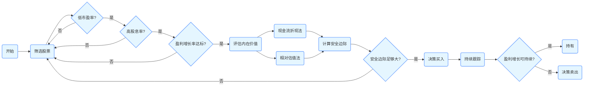

# 约翰·聂夫的小盘股研究方法论

> 关键词：约翰·聂夫、小盘股、研究方法论、价值投资、股票分析

> 摘要：本文深入探讨了约翰·聂夫的小盘股研究方法论。约翰·聂夫是投资领域的传奇人物，其独特的投资理念和方法在小盘股投资中具有重要价值。文章首先介绍了相关背景，包括研究目的、预期读者等。接着阐述了核心概念，给出了原理和架构的文本示意图与Mermaid流程图。详细讲解了核心算法原理和具体操作步骤，运用Python代码进行说明。通过数学模型和公式对方法论进行了更深入的剖析，并举例说明。以实际项目案例展示了该方法论的应用，包括开发环境搭建、源代码实现与解读。分析了其在不同场景下的实际应用，推荐了相关学习资源、开发工具框架和论文著作。最后总结了未来发展趋势与挑战，解答了常见问题，并提供了扩展阅读和参考资料。

## 1. 背景介绍 
### 1.1 目的和范围
本研究的目的在于深入剖析约翰·聂夫的小盘股研究方法论，为投资者提供一套系统、科学的小盘股投资分析框架。通过对该方法论的研究，投资者可以更好地理解小盘股的投资价值和风险，提高投资决策的准确性和成功率。

研究范围主要聚焦于约翰·聂夫在小盘股投资过程中所运用的核心理念、分析方法和决策流程。同时，结合实际案例和市场数据，对该方法论在不同市场环境下的有效性和适用性进行探讨。

### 1.2 预期读者
本文的预期读者包括各类投资者，如个人投资者、专业投资机构的分析师和基金经理等。对于初涉股市的投资者，本文可以帮助他们了解专业的小盘股研究方法，建立正确的投资理念；对于有一定投资经验的读者，本文提供了深入学习和借鉴约翰·聂夫投资智慧的机会，有助于进一步优化投资策略。

此外，金融专业的学生和研究人员也可以从本文中获取有关投资理论和实践的知识，为学术研究和职业发展提供参考。

### 1.3 文档结构概述
本文将按照以下结构进行组织：
1. **背景介绍**：阐述研究目的、预期读者和文档结构，为后续内容的展开奠定基础。
2. **核心概念与联系**：介绍约翰·聂夫小盘股研究方法论中的核心概念，如低市盈率、股息率等，并分析它们之间的相互关系。
3. **核心算法原理 & 具体操作步骤**：详细讲解该方法论中的核心算法，如估值计算、风险评估等，并给出具体的操作步骤，同时使用Python代码进行实现。
4. **数学模型和公式 & 详细讲解 & 举例说明**：运用数学模型和公式对方法论进行量化分析，通过具体例子说明其应用。
5. **项目实战：代码实际案例和详细解释说明**：以一个实际的小盘股投资项目为例，展示如何运用该方法论进行投资分析和决策，包括开发环境搭建、源代码实现和代码解读。
6. **实际应用场景**：分析该方法论在不同市场环境和投资场景下的应用。
7. **工具和资源推荐**：推荐相关的学习资源、开发工具框架和论文著作，帮助读者进一步深入学习和应用该方法论。
8. **总结：未来发展趋势与挑战**：总结约翰·聂夫小盘股研究方法论的优势和不足，探讨其未来的发展趋势和面临的挑战。
9. **附录：常见问题与解答**：解答读者在学习和应用该方法论过程中可能遇到的常见问题。
10. **扩展阅读 & 参考资料**：提供相关的扩展阅读材料和参考资料，方便读者进一步深入研究。

### 1.4 术语表
#### 1.4.1 核心术语定义
- **小盘股**：指流通市值相对较小的股票。一般来说，小盘股的流通市值在市场中处于较低水平，其规模通常小于大盘股和中盘股。
- **低市盈率（P/E）**：市盈率是指股票价格与每股收益的比率。低市盈率意味着股票价格相对较低，或者每股收益相对较高，通常被视为具有投资价值的信号。
- **股息率**：股息率是指股息与股票价格的比率，反映了股票的分红水平。较高的股息率表示公司愿意将更多的利润分配给股东。
- **盈利增长率**：指公司盈利在一定时期内的增长速度，是衡量公司成长能力的重要指标。

#### 1.4.2 相关概念解释
- **价值投资**：一种投资策略，强调通过分析股票的内在价值，寻找被低估的股票进行投资。约翰·聂夫的小盘股研究方法论属于价值投资的范畴。
- **安全边际**：指股票的内在价值与市场价格之间的差额。安全边际越大，投资的风险越低。

#### 1.4.3 缩略词列表
- **P/E**：市盈率（Price-to-Earnings Ratio）
- **PEG**：市盈率相对盈利增长比率（Price/Earnings to Growth Ratio）

## 2. 核心概念与联系 
### 核心概念原理
约翰·聂夫的小盘股研究方法论基于价值投资的理念，核心在于寻找被市场低估的小盘股。其主要涉及以下几个核心概念：

#### 低市盈率（P/E）
市盈率是衡量股票估值的重要指标。低市盈率意味着投资者可以以较低的价格购买到公司的每股收益。聂夫认为，市场有时会对某些小盘股存在过度悲观的预期，导致其市盈率偏低。通过寻找低市盈率的小盘股，投资者有可能发现被低估的投资机会。

#### 股息率
股息率反映了公司对股东的分红回报。较高的股息率不仅可以为投资者提供稳定的现金流，还表明公司具有较强的盈利能力和财务稳定性。聂夫偏好那些股息率较高的小盘股，因为这意味着即使股票价格短期内没有上涨，投资者也能通过分红获得一定的收益。

#### 盈利增长率
盈利增长率是衡量公司成长能力的关键指标。虽然聂夫注重低市盈率，但他也不会忽视公司的盈利增长潜力。他认为，具有一定盈利增长率的小盘股，其未来的盈利可能会进一步提升，从而推动股票价格上涨。

#### 安全边际
安全边际是价值投资的重要原则之一。聂夫在选择小盘股时，会尽量确保股票的内在价值与市场价格之间存在较大的安全边际。这样即使市场出现不利变化，投资者的损失也能得到一定程度的控制。

### 架构的文本示意图
```plaintext
约翰·聂夫小盘股研究方法论
|-- 核心概念
|   |-- 低市盈率（P/E）
|   |-- 股息率
|   |-- 盈利增长率
|   |-- 安全边际
|-- 分析流程
|   |-- 筛选股票
|   |   |-- 设定低市盈率阈值
|   |   |-- 设定股息率阈值
|   |   |-- 设定盈利增长率阈值
|   |-- 评估内在价值
|   |   |-- 现金流折现法
|   |   |-- 相对估值法
|   |-- 计算安全边际
|   |   |-- 内在价值 - 市场价格
|-- 决策依据
|   |-- 安全边际足够大
|   |-- 盈利增长可持续
```

### Mermaid流程图


## 3. 核心算法原理 & 具体操作步骤 

### 核心算法原理
#### 市盈率计算
市盈率（P/E）的计算公式为：
$$P/E = \frac{股票价格}{每股收益}$$
通过计算股票的市盈率，可以评估其相对估值水平。一般来说，较低的市盈率表示股票可能被低估。

#### 股息率计算
股息率的计算公式为：
$$股息率 = \frac{每股股息}{股票价格} \times 100\%$$
股息率反映了股票的分红水平，较高的股息率意味着投资者可以获得更多的分红收益。

#### 盈利增长率计算
盈利增长率可以通过以下公式计算：
$$盈利增长率 = \frac{本期盈利 - 上期盈利}{上期盈利} \times 100\%$$
盈利增长率衡量了公司盈利的增长速度，是评估公司成长能力的重要指标。

#### 现金流折现法计算内在价值
现金流折现法是一种常用的估值方法，其基本原理是将公司未来的现金流折现到当前时点，以计算其内在价值。具体步骤如下：
1. 预测公司未来的自由现金流（FCF）。
2. 确定合适的折现率（r），通常可以使用加权平均资本成本（WACC）。
3. 根据以下公式计算内在价值（V）：
$$V = \sum_{t=1}^{n} \frac{FCF_t}{(1 + r)^t} + \frac{TV}{(1 + r)^n}$$
其中，$FCF_t$ 表示第 $t$ 期的自由现金流，$TV$ 表示终值，$n$ 表示预测期数。

#### 相对估值法计算内在价值
相对估值法是通过比较同行业其他公司的估值指标，来评估目标公司的内在价值。常用的相对估值指标包括市盈率、市净率（P/B）等。具体步骤如下：
1. 选择同行业的可比公司。
2. 计算可比公司的平均估值指标。
3. 根据目标公司的财务数据和可比公司的平均估值指标，计算目标公司的内在价值。

### 具体操作步骤

#### 步骤1：数据收集
收集小盘股的相关数据，包括股票价格、每股收益、每股股息、盈利数据等。可以通过金融数据提供商（如Wind、东方财富等）获取这些数据。

#### 步骤2：筛选股票
根据设定的低市盈率、高股息率和盈利增长率阈值，筛选出符合条件的小盘股。例如，可以设定市盈率低于行业平均水平、股息率高于一定比例、盈利增长率连续多年为正等条件。

#### 步骤3：评估内在价值
使用现金流折现法或相对估值法对筛选出的股票进行内在价值评估。

#### 步骤4：计算安全边际
计算股票的安全边际，即内在价值与市场价格之间的差额。安全边际越大，投资的风险越低。

#### 步骤5：决策买入或卖出
根据安全边际和盈利增长的可持续性，做出买入或卖出的决策。如果安全边际足够大且盈利增长可持续，则可以考虑买入；反之，如果安全边际变小或盈利增长出现问题，则可以考虑卖出。

### Python代码实现
```python
import pandas as pd

# 示例数据
data = {
    '股票代码': ['000001', '000002', '000003'],
    '股票价格': [10, 20, 30],
    '每股收益': [1, 2, 3],
    '每股股息': [0.5, 1, 1.5],
    '上期盈利': [100, 200, 300],
    '本期盈利': [120, 220, 320]
}

df = pd.DataFrame(data)

# 计算市盈率
df['市盈率'] = df['股票价格'] / df['每股收益']

# 计算股息率
df['股息率'] = df['每股股息'] / df['股票价格'] * 100

# 计算盈利增长率
df['盈利增长率'] = (df['本期盈利'] - df['上期盈利']) / df['上期盈利'] * 100

# 筛选股票
low_pe_threshold = 15
high_dividend_yield_threshold = 3
positive_growth_threshold = 0

filtered_df = df[(df['市盈率'] < low_pe_threshold) & 
                 (df['股息率'] > high_dividend_yield_threshold) & 
                 (df['盈利增长率'] > positive_growth_threshold)]

print("筛选后的股票：")
print(filtered_df)
```

## 4. 数学模型和公式 & 详细讲解 & 举例说明 

### 市盈率模型
#### 公式
$$P/E = \frac{P}{EPS}$$
其中，$P$ 表示股票价格，$EPS$ 表示每股收益。

#### 详细讲解
市盈率是衡量股票估值的最常用指标之一。它反映了投资者为获得公司每股收益所愿意支付的价格。一般来说，较低的市盈率可能意味着股票被低估，但也可能反映了市场对公司未来盈利的悲观预期。因此，在使用市盈率进行估值时，需要结合其他因素进行综合分析。

#### 举例说明
假设某小盘股的股票价格为 $20$ 元，每股收益为 $2$ 元，则该股票的市盈率为：
$$P/E = \frac{20}{2} = 10$$
如果同行业的平均市盈率为 $15$，则该股票的市盈率相对较低，可能具有一定的投资价值。

### 股息率模型
#### 公式
$$股息率 = \frac{D}{P} \times 100\%$$
其中，$D$ 表示每股股息，$P$ 表示股票价格。

#### 详细讲解
股息率反映了股票的分红水平，是投资者获得现金回报的重要来源。较高的股息率通常意味着公司具有较强的盈利能力和稳定的现金流，同时也表明公司愿意将更多的利润分配给股东。

#### 举例说明
假设某小盘股的每股股息为 $0.5$ 元，股票价格为 $10$ 元，则该股票的股息率为：
$$股息率 = \frac{0.5}{10} \times 100\% = 5\%$$
如果市场上同类股票的平均股息率为 $3\%$，则该股票的股息率相对较高，具有一定的吸引力。

### 盈利增长率模型
#### 公式
$$盈利增长率 = \frac{EPS_{t} - EPS_{t-1}}{EPS_{t-1}} \times 100\%$$
其中，$EPS_{t}$ 表示本期每股收益，$EPS_{t-1}$ 表示上期每股收益。

#### 详细讲解
盈利增长率是衡量公司成长能力的重要指标。持续的盈利增长通常意味着公司具有良好的发展前景和竞争优势。投资者通常会更青睐那些盈利增长率较高的股票。

#### 举例说明
假设某小盘股上期每股收益为 $1$ 元，本期每股收益为 $1.2$ 元，则该股票的盈利增长率为：
$$盈利增长率 = \frac{1.2 - 1}{1} \times 100\% = 20\%$$
如果同行业的平均盈利增长率为 $15\%$，则该股票的盈利增长率相对较高，具有较好的成长潜力。

### 现金流折现法模型
#### 公式
$$V = \sum_{t=1}^{n} \frac{FCF_t}{(1 + r)^t} + \frac{TV}{(1 + r)^n}$$
其中，$V$ 表示公司的内在价值，$FCF_t$ 表示第 $t$ 期的自由现金流，$r$ 表示折现率，$TV$ 表示终值，$n$ 表示预测期数。

#### 详细讲解
现金流折现法的核心思想是将公司未来的现金流折现到当前时点，以反映其真实的价值。预测期内的自由现金流是公司经营活动产生的现金流量减去资本支出后的剩余现金流量。终值是指预测期结束后公司的价值，通常可以使用永续增长模型进行估算。

#### 举例说明
假设某小盘股预计未来三年的自由现金流分别为 $100$ 万元、$120$ 万元和 $150$ 万元，折现率为 $10\%$，预测期结束后公司的自由现金流以 $5\%$ 的速度永续增长。则该公司的内在价值计算如下：
1. 计算预测期内自由现金流的现值：
    - 第一年：$\frac{100}{(1 + 0.1)^1} = 90.91$（万元）
    - 第二年：$\frac{120}{(1 + 0.1)^2} = 99.17$（万元）
    - 第三年：$\frac{150}{(1 + 0.1)^3} = 112.69$（万元）
2. 计算终值：
    - $TV = \frac{150 \times (1 + 0.05)}{0.1 - 0.05} = 3150$（万元）
    - 终值的现值：$\frac{3150}{(1 + 0.1)^3} = 2366.87$（万元）
3. 计算内在价值：
    - $V = 90.91 + 99.17 + 112.69 + 2366.87 = 2669.64$（万元）

### 相对估值法模型
#### 公式
$$V = P/E_{可比} \times EPS_{目标}$$
其中，$V$ 表示目标公司的内在价值，$P/E_{可比}$ 表示可比公司的平均市盈率，$EPS_{目标}$ 表示目标公司的每股收益。

#### 详细讲解
相对估值法通过比较同行业其他公司的估值指标，来评估目标公司的价值。该方法的优点是简单易懂，操作方便，但缺点是依赖于可比公司的选择和市场的有效性。

#### 举例说明
假设某小盘股所在行业的可比公司平均市盈率为 $15$，该公司的每股收益为 $2$ 元，则该公司的内在价值为：
$$V = 15 \times 2 = 30$$（元）

## 5. 项目实战：代码实际案例和详细解释说明 

### 5.1  开发环境搭建
#### 操作系统
可以选择 Windows、Linux 或 macOS 操作系统。本案例以 Windows 10 为例进行说明。

#### Python 安装
从 Python 官方网站（https://www.python.org/downloads/）下载并安装 Python 3.8 或以上版本。安装过程中注意勾选“Add Python to PATH”选项，以便在命令行中可以直接使用 Python 命令。

#### 开发工具
推荐使用 PyCharm 作为开发工具。可以从 JetBrains 官方网站（https://www.jetbrains.com/pycharm/download/）下载并安装 PyCharm Community Edition 版本。

#### 第三方库安装
在命令行中使用以下命令安装所需的第三方库：
```sh
pip install pandas numpy requests beautifulsoup4
```
- `pandas`：用于数据处理和分析。
- `numpy`：用于数值计算。
- `requests`：用于发送 HTTP 请求，获取网页数据。
- `beautifulsoup4`：用于解析 HTML 页面。

### 5.2  源代码详细实现和代码解读
```python
import requests
from bs4 import BeautifulSoup
import pandas as pd
import numpy as np

# 定义函数获取股票数据
def get_stock_data(stock_code):
    url = f"https://finance.yahoo.com/quote/{stock_code}/key-statistics?p={stock_code}"
    headers = {
        'User-Agent': 'Mozilla/5.0 (Windows NT 10.0; Win64; x64) AppleWebKit/537.36 (KHTML, like Gecko) Chrome/58.0.3029.110 Safari/537.3'}
    response = requests.get(url, headers=headers)
    soup = BeautifulSoup(response.text, 'html.parser')
    
    # 提取市盈率
    pe_ratio = None
    pe_ratio_elements = soup.find_all('td', text='Trailing P/E')
    if pe_ratio_elements:
        pe_ratio_element = pe_ratio_elements[0].find_next_sibling('td')
        if pe_ratio_element:
            pe_ratio = float(pe_ratio_element.text)
    
    # 提取股息率
    dividend_yield = None
    dividend_yield_elements = soup.find_all('td', text='Forward Annual Dividend Yield')
    if dividend_yield_elements:
        dividend_yield_element = dividend_yield_elements[0].find_next_sibling('td')
        if dividend_yield_element:
            dividend_yield = float(dividend_yield_element.text.replace('%', ''))
    
    # 提取盈利增长率
    growth_rate = None
    growth_rate_elements = soup.find_all('td', text='Quarterly Earnings Growth (yoy)')
    if growth_rate_elements:
        growth_rate_element = growth_rate_elements[0].find_next_sibling('td')
        if growth_rate_element:
            growth_rate = float(growth_rate_element.text.replace('%', ''))
    
    return {
        '股票代码': stock_code,
        '市盈率': pe_ratio,
        '股息率': dividend_yield,
        '盈利增长率': growth_rate
    }

# 定义股票代码列表
stock_codes = ['AAPL', 'GOOG', 'MSFT']

# 获取股票数据
stock_data = []
for stock_code in stock_codes:
    data = get_stock_data(stock_code)
    stock_data.append(data)

# 转换为 DataFrame
df = pd.DataFrame(stock_data)

# 筛选股票
low_pe_threshold = 20
high_dividend_yield_threshold = 2
positive_growth_threshold = 0

filtered_df = df[(df['市盈率'] < low_pe_threshold) & 
                 (df['股息率'] > high_dividend_yield_threshold) & 
                 (df['盈利增长率'] > positive_growth_threshold)]

print("筛选后的股票：")
print(filtered_df)
```

### 5.3  代码解读与分析
#### 代码功能概述
该代码的主要功能是从雅虎财经网站获取指定股票的市盈率、股息率和盈利增长率数据，并根据设定的阈值筛选出符合条件的股票。

#### 代码详细解读
1. **导入必要的库**：导入 `requests`、`BeautifulSoup`、`pandas` 和 `numpy` 库。
2. **定义 `get_stock_data` 函数**：该函数接受股票代码作为参数，通过发送 HTTP 请求获取雅虎财经网站上该股票的相关数据，并使用 `BeautifulSoup` 解析 HTML 页面，提取市盈率、股息率和盈利增长率数据。
3. **定义股票代码列表**：定义一个包含多个股票代码的列表。
4. **获取股票数据**：遍历股票代码列表，调用 `get_stock_data` 函数获取每只股票的数据，并将数据存储在一个列表中。
5. **转换为 DataFrame**：将获取到的股票数据转换为 `pandas` 的 `DataFrame` 对象，方便进行数据处理和分析。
6. **筛选股票**：根据设定的低市盈率、高股息率和盈利增长率阈值，筛选出符合条件的股票。
7. **输出筛选结果**：打印筛选后的股票数据。

#### 代码分析
该代码的优点是简单易懂，通过网络爬虫技术可以方便地获取股票数据。但也存在一些局限性，如雅虎财经网站的页面结构可能会发生变化，导致数据提取失败；代码没有考虑数据的异常情况和错误处理等。在实际应用中，可以对代码进行进一步的优化和扩展。

## 6. 实际应用场景 
### 个人投资者
对于个人投资者来说，约翰·聂夫的小盘股研究方法论可以帮助他们在众多的小盘股中筛选出具有投资价值的股票。通过关注低市盈率、高股息率和盈利增长率等指标，个人投资者可以降低投资风险，提高投资收益。例如，个人投资者可以使用该方法论构建自己的小盘股投资组合，定期对组合进行评估和调整。

### 专业投资机构
专业投资机构如基金公司、证券公司等可以将该方法论应用于小盘股投资策略的制定和实施。投资机构可以利用自身的研究资源和数据分析能力，对小盘股进行更深入的研究和筛选。同时，该方法论也可以作为投资决策的重要参考依据，帮助投资机构提高投资决策的科学性和准确性。

### 学术研究
在学术研究领域，约翰·聂夫的小盘股研究方法论可以为学者们提供一个研究价值投资和小盘股投资的案例。学者们可以通过对该方法论的实证研究，验证其在不同市场环境下的有效性和适用性，并进一步探索其背后的理论基础和影响因素。

### 风险管理
在风险管理方面，该方法论可以帮助投资者识别小盘股投资中的潜在风险。通过计算安全边际和评估盈利增长的可持续性，投资者可以及时发现投资组合中存在的风险，并采取相应的措施进行调整。例如，当某只股票的安全边际变小或盈利增长出现问题时，投资者可以考虑卖出该股票，以降低投资风险。

## 7. 工具和资源推荐
### 7.1 学习资源推荐
#### 7.1.1 书籍推荐
- 《约翰·聂夫的成功投资》：这是约翰·聂夫本人撰写的一本投资著作，详细介绍了他的投资理念、方法和实践经验。
- 《聪明的投资者》：本杰明·格雷厄姆的经典著作，是价值投资的奠基之作，对约翰·聂夫的投资理念产生了重要影响。
- 《怎样选择成长股》：菲利普·费雪的代表作，介绍了如何寻找具有成长潜力的股票，与约翰·聂夫的小盘股研究方法论有一定的关联。

#### 7.1.2 在线课程
- Coursera 上的“投资学原理”课程：该课程涵盖了投资学的基本原理和方法，包括价值投资、股票分析等内容。
- edX 上的“金融市场”课程：由耶鲁大学教授罗伯特·席勒主讲，介绍了金融市场的运作机制和投资策略。

#### 7.1.3 技术博客和网站
- 雪球网：国内知名的投资社区，提供了丰富的股票分析和投资经验分享。
- 价值投资网：专注于价值投资领域的网站，提供了大量的价值投资理论和实践案例。

### 7.2 开发工具框架推荐
#### 7.2.1 IDE和编辑器
- PyCharm：一款功能强大的 Python 集成开发环境，提供了代码编辑、调试、版本控制等功能。
- Jupyter Notebook：一种交互式的编程环境，适合进行数据分析和可视化。

#### 7.2.2 调试和性能分析工具
- PDB：Python 自带的调试工具，可以帮助开发者定位和解决代码中的问题。
- cProfile：Python 的性能分析工具，可以分析代码的运行时间和资源消耗情况。

#### 7.2.3 相关框架和库
- Pandas：用于数据处理和分析的 Python 库，提供了丰富的数据结构和数据分析方法。
- Numpy：用于数值计算的 Python 库，提供了高效的数组和矩阵运算功能。
- Scikit-learn：用于机器学习的 Python 库，提供了各种机器学习算法和工具。

### 7.3 相关论文著作推荐
#### 7.3.1 经典论文
- 《证券分析》：本杰明·格雷厄姆和大卫·多德的经典论文，奠定了价值投资的理论基础。
- 《有效市场假说》：尤金·法玛的论文，提出了有效市场假说，对投资理论和实践产生了深远影响。

#### 7.3.2 最新研究成果
- 《小盘股溢价现象的实证研究》：探讨了小盘股在市场中是否存在溢价现象及其影响因素。
- 《基于价值投资理念的小盘股投资策略研究》：研究了如何运用价值投资理念制定小盘股投资策略。

#### 7.3.3 应用案例分析
- 《某基金公司小盘股投资组合的构建与绩效评估》：分析了某基金公司小盘股投资组合的构建方法和绩效表现。
- 《个人投资者运用约翰·聂夫方法论的投资实践案例》：介绍了个人投资者如何运用约翰·聂夫的小盘股研究方法论进行投资实践。

## 8. 总结：未来发展趋势与挑战
### 优势总结
约翰·聂夫的小盘股研究方法论具有以下优势：
1. **价值投资理念**：基于价值投资的理念，注重寻找被低估的股票，从长期来看，具有较高的投资回报率。
2. **综合指标评估**：综合考虑了市盈率、股息率、盈利增长率等多个指标，能够更全面地评估小盘股的投资价值。
3. **强调安全边际**：重视安全边际的计算，能够有效降低投资风险。

### 不足之处
该方法论也存在一些不足之处：
1. **市场有效性假设**：该方法论基于市场有时会对股票进行错误定价的假设，但在有效市场中，股票价格可能已经反映了所有的公开信息，因此寻找被低估的股票可能会变得更加困难。
2. **数据获取和分析难度**：需要获取大量的财务数据和市场信息，并进行复杂的分析和计算，对于个人投资者来说，可能存在一定的难度。
3. **行业和公司差异**：不同行业和公司的特点不同，该方法论可能无法完全适用于所有的小盘股。

### 未来发展趋势
1. **与大数据和人工智能结合**：随着大数据和人工智能技术的发展，可以利用这些技术对更多的信息进行分析和挖掘，提高小盘股研究的准确性和效率。
2. **多因素模型的应用**：除了市盈率、股息率和盈利增长率等指标外，可以考虑引入更多的因素，构建多因素模型，更全面地评估小盘股的投资价值。
3. **全球市场的拓展**：随着全球经济一体化的发展，可以将该方法论应用于全球市场的小盘股投资，寻找更多的投资机会。

### 面临的挑战
1. **市场环境变化**：市场环境不断变化，如宏观经济形势、政策法规等，可能会影响小盘股的投资价值和风险特征，需要及时调整投资策略。
2. **竞争加剧**：随着越来越多的投资者关注小盘股投资，市场竞争将加剧，寻找被低估的股票将变得更加困难。
3. **技术更新换代**：大数据和人工智能等技术不断更新换代，需要不断学习和掌握新的技术和方法，以适应市场的变化。

## 9. 附录：常见问题与解答
### 问题1：如何确定低市盈率、高股息率和盈利增长率的阈值？
解答：这些阈值的确定需要结合市场环境、行业特点和个人投资目标等因素进行综合考虑。一般来说，可以参考同行业的平均水平和历史数据，同时根据自己的风险偏好和投资期限进行适当调整。例如，如果市场整体估值较高，可以适当提高低市盈率的阈值；如果投资者更注重现金回报，可以提高高股息率的阈值。

### 问题2：现金流折现法中的折现率如何确定？
解答：折现率通常可以使用加权平均资本成本（WACC）来确定。WACC 是公司债务成本和股权成本的加权平均值，反映了公司的融资成本。具体计算方法如下：
$$WACC = E/V \times Re + D/V \times Rd \times (1 - Tc)$$
其中，$E$ 表示股权价值，$V$ 表示公司总价值，$Re$ 表示股权成本，$D$ 表示债务价值，$Rd$ 表示债务成本，$Tc$ 表示公司所得税税率。

### 问题3：该方法论是否适用于所有市场环境？
解答：该方法论在不同的市场环境下都有一定的适用性，但在市场波动较大或市场有效性较高的情况下，其效果可能会受到一定的影响。在市场波动较大时，股票价格可能会出现较大的波动，导致安全边际的计算出现偏差；在市场有效性较高时，股票价格可能已经反映了所有的公开信息，寻找被低估的股票将变得更加困难。因此，在实际应用中，需要根据市场环境的变化及时调整投资策略。

### 问题4：如何持续跟踪投资组合中的股票？
解答：可以通过定期关注公司的财务报表、新闻公告等信息，了解公司的经营状况和发展前景。同时，可以关注市场动态和行业趋势，分析其对公司的影响。另外，还可以使用一些专业的投资分析工具和软件，对投资组合进行实时监控和评估。

## 10. 扩展阅读 & 参考资料
### 扩展阅读
- 《金融炼金术》：乔治·索罗斯的著作，介绍了他的投资哲学和实践经验。
- 《投资最重要的事》：霍华德·马克斯的著作，强调了投资中的风险管理和逆向思维。
- 《邓普顿教你逆向投资》：约翰·邓普顿的投资经验分享，介绍了逆向投资的理念和方法。

### 参考资料
- 《约翰·聂夫的成功投资》，约翰·聂夫著
- 《聪明的投资者》，本杰明·格雷厄姆著
- 《怎样选择成长股》，菲利普·费雪著
- 雅虎财经网站（https://finance.yahoo.com/）
- 雪球网（https://xueqiu.com/）
- 价值投资网（https://www.value-investing.net/）

作者：AI天才研究院/AI Genius Institute & 禅与计算机程序设计艺术 /Zen And The Art of Computer Programming