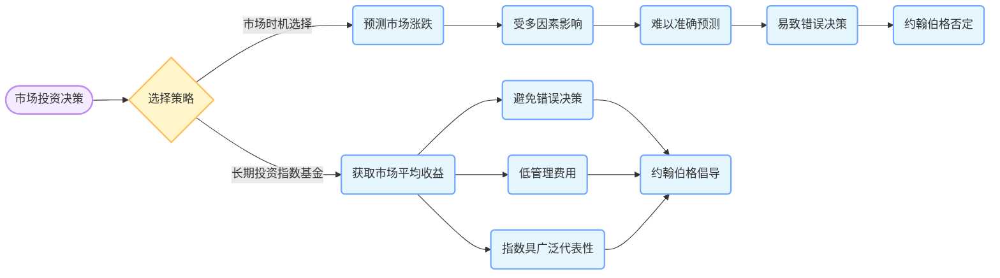

# 约翰伯格对市场时机选择的看法

> 关键词：约翰伯格、市场时机选择、投资理念、指数基金、长期投资

> 摘要：本文深入探讨了约翰伯格对市场时机选择的看法。约翰伯格作为投资界的传奇人物，他的投资理念对广大投资者产生了深远影响。他对市场时机选择持否定态度，主张通过长期投资指数基金来获取市场平均收益。文章将从背景介绍入手，详细阐述其核心概念与联系，分析背后的算法原理（虽在这一主题下算法原理并非传统意义的算法，但会从投资逻辑角度进行阐述），探讨相关数学模型和公式，结合项目实战案例说明其观点的实际应用，介绍实际应用场景，推荐相关工具和资源，最后总结未来发展趋势与挑战，并解答常见问题。

## 1. 背景介绍 
### 1.1 目的和范围
本文章的目的是全面剖析约翰伯格对市场时机选择的看法，深入理解其背后的投资逻辑和理念。范围涵盖约翰伯格投资思想的核心要点，包括他对市场时机选择的批判、长期投资的倡导以及指数基金的推崇等方面。通过对这些内容的研究，帮助投资者更好地理解投资的本质，做出更合理的投资决策。

### 1.2 预期读者
本文预期读者为广大投资者，包括个人投资者、专业投资人士以及对投资领域感兴趣的学生和研究人员。无论你是初涉投资领域的新手，还是经验丰富的投资者，都能从本文中获得关于约翰伯格投资理念的深入理解，为自己的投资实践提供参考。

### 1.3 文档结构概述
本文将按照以下结构进行阐述：首先介绍核心概念与联系，明确市场时机选择和约翰伯格相关投资理念的定义和关系；接着分析核心算法原理和具体操作步骤，从投资逻辑角度探讨如何遵循约翰伯格的理念进行投资；然后介绍数学模型和公式，用数据和理论支持其观点；再通过项目实战案例详细说明其理念的实际应用；之后介绍实际应用场景，让读者了解在哪些情况下适用该理念；接着推荐相关的工具和资源，帮助读者进一步学习和实践；最后总结未来发展趋势与挑战，解答常见问题，并提供扩展阅读和参考资料。

### 1.4 术语表
#### 1.4.1 核心术语定义
- **市场时机选择**：指投资者试图通过预测市场的涨跌来决定何时买入或卖出资产，以获取更高的投资收益。例如，在市场即将上涨时买入股票，在市场即将下跌时卖出股票。
- **长期投资**：是一种投资策略，投资者将资金投入到资产中，并持有较长的时间，通常为数年甚至数十年，不被短期市场波动所影响，旨在通过资产的长期增值获得收益。
- **指数基金**：是一种按照特定指数（如沪深300指数、标普500指数等）的成分股组成和权重进行投资的基金。它通过复制指数的表现，为投资者提供一种低成本、广泛分散风险的投资方式。

#### 1.4.2 相关概念解释
- **有效市场假说**：该假说认为市场价格已经反映了所有可用的信息，因此投资者很难通过分析信息来获得超额收益。在有效市场中，市场时机选择变得更加困难，因为市场价格是随机波动的，难以准确预测。
- **复利效应**：是指在投资过程中，每一期的收益都会加入到本金中，在下一期产生更多的收益。长期投资能够充分发挥复利效应，使投资收益随着时间的推移呈指数级增长。

#### 1.4.3 缩略词列表
- **ETF**：交易型开放式指数基金（Exchange Traded Fund），是一种在交易所上市交易的、基金份额可变的开放式指数基金。

## 2. 核心概念与联系 

### 核心概念原理
约翰伯格认为市场时机选择是一种难以实现的投资策略。市场是复杂多变的，受到众多因素的影响，如宏观经济数据、政治事件、公司业绩等。这些因素的变化是难以预测的，因此投资者很难准确判断市场的涨跌时机。例如，即使投资者对宏观经济有一定的了解，但突发的政治事件可能会瞬间改变市场的走势，使得之前的预测变得毫无意义。

相反，约翰伯格倡导长期投资指数基金。指数基金具有广泛的市场代表性，能够反映整个市场的平均表现。通过长期持有指数基金，投资者可以获得市场的平均收益，避免了因试图选择市场时机而可能带来的错误决策。同时，指数基金的管理费用较低，这也有助于提高投资者的实际收益。

### 架构的文本示意图
```plaintext
市场时机选择
|
|-- 难以预测市场涨跌
|   |-- 受众多因素影响
|   |   |-- 宏观经济数据
|   |   |-- 政治事件
|   |   |-- 公司业绩
|   |
|   |-- 容易导致错误决策
|
|-- 约翰伯格的否定态度

长期投资指数基金
|
|-- 获得市场平均收益
|   |-- 指数基金具有广泛市场代表性
|
|-- 避免错误决策
|
|-- 低管理费用
|
|-- 约翰伯格的倡导
```

### Mermaid 流程图


## 3. 核心算法原理 & 具体操作步骤 

### 核心算法原理（投资逻辑角度）
从投资逻辑的角度来看，约翰伯格对市场时机选择的否定和对长期投资指数基金的倡导是基于以下原理。

假设市场是一个复杂的系统，其价格波动是随机的，难以预测。我们可以用一个简单的数学模型来表示市场价格的变化。设 $P_t$ 表示第 $t$ 期的市场价格，$\epsilon_t$ 表示第 $t$ 期的随机扰动项，其均值为 0，方差为 $\sigma^2$。则市场价格的变化可以表示为：

$P_t = P_{t-1} + \epsilon_t$

这个模型表明，市场价格的变化是由上一期的价格和随机扰动项决定的。由于随机扰动项是不可预测的，因此我们很难准确预测市场价格的涨跌。

而指数基金的收益可以近似看作是市场的平均收益。设 $R_{index}$ 表示指数基金的收益率，$R_{market}$ 表示市场的平均收益率，则有：

$R_{index} \approx R_{market}$

长期投资指数基金，投资者可以通过复利效应获得较高的收益。设初始投资金额为 $P_0$，投资期限为 $n$ 年，每年的收益率为 $r$，则 $n$ 年后的投资收益 $P_n$ 可以表示为：

$P_n = P_0(1 + r)^n$

### 具体操作步骤
1. **确定投资目标**：投资者首先需要明确自己的投资目标，如养老、子女教育、财富增值等。根据投资目标确定投资期限和风险承受能力。
2. **选择合适的指数基金**：根据自己的投资目标和风险承受能力，选择合适的指数基金。例如，如果投资者希望获得全球市场的平均收益，可以选择投资全球指数基金；如果投资者更关注国内市场，可以选择国内的主要指数基金，如沪深300指数基金。
3. **定期定额投资**：采用定期定额投资的方式，每月或每季度投入固定金额的资金到指数基金中。这样可以避免因市场波动而做出错误的投资决策，同时也能充分发挥复利效应。
4. **长期持有**：在投资过程中，不要被短期市场波动所影响，坚持长期持有指数基金。一般来说，投资期限越长，获得正收益的概率越高。

### Python 代码示例
```python
# 模拟长期投资指数基金的收益
import matplotlib.pyplot as plt

# 初始投资金额
initial_investment = 10000
# 年收益率
annual_return_rate = 0.08
# 投资期限（年）
investment_years = 30

# 计算每年的投资收益
investment_values = []
for year in range(investment_years + 1):
    investment_value = initial_investment * (1 + annual_return_rate) ** year
    investment_values.append(investment_value)

# 绘制投资收益曲线
years = list(range(investment_years + 1))
plt.plot(years, investment_values)
plt.xlabel('Years')
plt.ylabel('Investment Value')
plt.title('Long-term Investment in Index Fund')
plt.grid(True)
plt.show()

# 输出最终投资收益
final_value = investment_values[-1]
print(f"After {investment_years} years, the investment value is: ${final_value:.2f}")
```

在这个代码示例中，我们模拟了一个初始投资金额为 10000 美元，年收益率为 8%，投资期限为 30 年的长期投资指数基金的收益情况。通过绘制投资收益曲线，我们可以直观地看到复利效应的作用。最后，我们输出了 30 年后的投资收益。

## 4. 数学模型和公式 & 详细讲解 & 举例说明 

### 复利公式
复利公式是长期投资中最重要的数学模型之一，它描述了投资收益随着时间的增长情况。复利公式为：

$$P_n = P_0(1 + r)^n$$

其中，$P_0$ 表示初始投资金额，$r$ 表示年利率，$n$ 表示投资期限（年），$P_n$ 表示 $n$ 年后的投资收益。

### 详细讲解
复利的核心思想是将每一期的收益加入到本金中，在下一期产生更多的收益。例如，假设你初始投资 10000 美元，年利率为 8%，投资期限为 1 年。则 1 年后的投资收益为：

$P_1 = 10000\times(1 + 0.08)^1 = 10800$（美元）

如果将这 10800 美元继续投资 1 年，年利率仍为 8%，则第 2 年后的投资收益为：

$P_2 = 10800\times(1 + 0.08)^1 = 10000\times(1 + 0.08)^2 = 11664$（美元）

可以看到，第 2 年的收益不仅包括初始投资的 8%，还包括第 1 年收益的 8%，这就是复利的效应。随着投资期限的增加，复利效应会越来越明显。

### 举例说明
假设你有两个投资方案：方案 A 是每年将 10000 美元存入银行，年利率为 2%，单利计算；方案 B 是每年将 10000 美元投资于指数基金，年利率为 8%，复利计算。投资期限为 30 年。

方案 A 的收益计算：

每年的利息为 $10000\times0.02 = 200$ 美元，30 年的总利息为 $200\times30 = 6000$ 美元，30 年后的总收益为 $10000 + 6000 = 16000$ 美元。

方案 B 的收益计算：

根据复利公式，$P_{30} = 10000\times(1 + 0.08)^{30} \approx 100626.57$ 美元。

可以看到，方案 B 的收益远远高于方案 A，这就是复利效应的强大之处。通过长期投资指数基金，利用复利效应，投资者可以获得较高的收益。

## 5. 项目实战：代码实际案例和详细解释说明 

### 5.1 开发环境搭建
要运行上述 Python 代码，你需要搭建一个基本的 Python 开发环境。以下是具体步骤：

1. **安装 Python**：访问 Python 官方网站（https://www.python.org/downloads/），下载并安装适合你操作系统的 Python 版本。建议安装 Python 3.6 及以上版本。
2. **安装开发工具**：可以选择安装 PyCharm、VS Code 等集成开发环境（IDE），或者使用 Jupyter Notebook 进行代码开发和测试。这里以 VS Code 为例，你可以从 VS Code 官方网站（https://code.visualstudio.com/）下载并安装。
3. **安装必要的库**：在上述代码中，我们使用了 `matplotlib` 库来绘制投资收益曲线。你可以使用以下命令来安装 `matplotlib` 库：

```sh
pip install matplotlib
```

### 5.2 源代码详细实现和代码解读
```python
# 模拟长期投资指数基金的收益
import matplotlib.pyplot as plt

# 初始投资金额
initial_investment = 10000
# 年收益率
annual_return_rate = 0.08
# 投资期限（年）
investment_years = 30

# 计算每年的投资收益
investment_values = []
for year in range(investment_years + 1):
    investment_value = initial_investment * (1 + annual_return_rate) ** year
    investment_values.append(investment_value)

# 绘制投资收益曲线
years = list(range(investment_years + 1))
plt.plot(years, investment_values)
plt.xlabel('Years')
plt.ylabel('Investment Value')
plt.title('Long-term Investment in Index Fund')
plt.grid(True)
plt.show()

# 输出最终投资收益
final_value = investment_values[-1]
print(f"After {investment_years} years, the investment value is: ${final_value:.2f}")
```

### 代码解读与分析
1. **导入必要的库**：
```python
import matplotlib.pyplot as plt
```
这行代码导入了 `matplotlib.pyplot` 库，用于绘制投资收益曲线。

2. **定义投资参数**：
```python
initial_investment = 10000
annual_return_rate = 0.08
investment_years = 30
```
这里定义了初始投资金额为 10000 美元，年收益率为 8%，投资期限为 30 年。

3. **计算每年的投资收益**：
```python
investment_values = []
for year in range(investment_years + 1):
    investment_value = initial_investment * (1 + annual_return_rate) ** year
    investment_values.append(investment_value)
```
使用 `for` 循环遍历每年，根据复利公式计算每年的投资收益，并将其存储在 `investment_values` 列表中。

4. **绘制投资收益曲线**：
```python
years = list(range(investment_years + 1))
plt.plot(years, investment_values)
plt.xlabel('Years')
plt.ylabel('Investment Value')
plt.title('Long-term Investment in Index Fund')
plt.grid(True)
plt.show()
```
使用 `matplotlib` 库绘制投资收益曲线，设置 x 轴为年份，y 轴为投资价值，添加标题和网格线，并显示图形。

5. **输出最终投资收益**：
```python
final_value = investment_values[-1]
print(f"After {investment_years} years, the investment value is: ${final_value:.2f}")
```
获取最后一年的投资收益，并将其格式化输出。

通过这个代码示例，我们可以直观地看到长期投资指数基金的复利效应，以及随着时间的推移，投资收益的增长情况。

## 6. 实际应用场景 
### 个人养老规划
对于个人投资者来说，养老规划是一个重要的投资目标。由于养老投资的期限较长，通常为几十年，因此市场时机选择变得非常困难。根据约翰伯格的理念，个人投资者可以选择长期投资指数基金来实现养老目标。通过定期定额投资指数基金，利用复利效应，投资者可以在退休时获得较为可观的养老资金。

### 子女教育投资
子女教育投资也是一个长期的投资过程，一般需要 10 年以上的时间。在这个过程中，市场波动较大，很难准确选择市场时机。投资者可以选择投资指数基金，为子女的教育储备资金。例如，从孩子出生开始，每月定期投资一定金额的指数基金，到孩子上大学时，这笔投资可能已经增值不少。

### 资产配置
在资产配置中，指数基金可以作为一种重要的投资工具。投资者可以将一部分资金投资于指数基金，以获取市场的平均收益，同时降低投资组合的风险。例如，一个投资者的资产配置可以包括股票、债券和指数基金等。通过合理配置指数基金的比例，投资者可以在保证一定收益的前提下，降低投资组合的波动性。

### 机构投资者
对于机构投资者来说，如养老金、保险公司等，由于资金规模较大，投资期限较长，市场时机选择的难度更大。机构投资者可以采用约翰伯格的理念，长期投资指数基金，以实现资产的稳健增值。同时，指数基金的低管理费用也可以降低机构投资者的投资成本。

## 7. 工具和资源推荐
### 7.1 学习资源推荐
#### 7.1.1 书籍推荐
- 《漫步华尔街》（A Random Walk Down Wall Street）：作者是伯顿·马尔基尔（Burton Malkiel），这本书系统地介绍了有效市场假说和长期投资的理念，与约翰伯格的观点有很多相似之处。
- 《聪明的投资者》（The Intelligent Investor）：作者是本杰明·格雷厄姆（Benjamin Graham），这是一本投资领域的经典著作，强调了价值投资和长期投资的重要性。
- 《共同基金常识》（Common Sense on Mutual Funds）：作者是约翰·伯格（John C. Bogle）本人，这本书详细阐述了他的投资理念和对指数基金的推崇。

#### 7.1.2 在线课程
- Coursera 上的“投资学原理”（Principles of Investment）课程：该课程由知名大学的教授授课，涵盖了投资领域的基本概念和理论，包括市场时机选择、长期投资等内容。
- edX 上的“金融市场”（Financial Markets）课程：由耶鲁大学教授罗伯特·席勒（Robert Shiller）主讲，课程内容丰富，对投资市场有深入的分析和讲解。

#### 7.1.3 技术博客和网站
- 雪球网（https://xueqiu.com/）：是一个投资社区，投资者可以在上面交流投资经验、分享投资观点，同时也有很多关于指数基金和长期投资的文章和讨论。
- 晨星网（https://www.morningstar.com/）：提供基金评级、分析和研究报告等服务，投资者可以通过晨星网了解指数基金的表现和排名。

### 7.2 开发工具框架推荐
#### 7.2.1 IDE和编辑器
- PyCharm：是一款专门为 Python 开发设计的集成开发环境，具有代码自动补全、调试、版本控制等功能，非常适合 Python 开发者。
- VS Code：是一款轻量级的代码编辑器，支持多种编程语言，通过安装插件可以扩展其功能，适合初学者和有一定经验的开发者。

#### 7.2.2 调试和性能分析工具
- PDB：是 Python 自带的调试工具，可以帮助开发者在代码中设置断点、单步执行代码、查看变量值等，方便调试程序。
- cProfile：是 Python 的性能分析工具，可以分析代码的运行时间和函数调用情况，帮助开发者找出代码中的性能瓶颈。

#### 7.2.3 相关框架和库
- Pandas：是一个强大的数据分析库，提供了数据结构和数据分析工具，适合处理和分析投资数据。
- NumPy：是 Python 的科学计算库，提供了高效的数组操作和数学函数，在投资领域的数据分析和建模中经常使用。

### 7.3 相关论文著作推荐
#### 7.3.1 经典论文
- “Efficient Capital Markets: A Review of Theory and Empirical Work”：作者是尤金·法玛（Eugene F. Fama），这篇论文提出了有效市场假说，对投资领域产生了深远影响。
- “The Capital Asset Pricing Model: Theory and Evidence”：作者是威廉·夏普（William F. Sharpe）等，这篇论文介绍了资本资产定价模型（CAPM），是现代投资理论的重要基础。

#### 7.3.2 最新研究成果
- 可以关注《金融研究》《经济学季刊》等学术期刊，这些期刊会发表投资领域的最新研究成果，包括市场时机选择、指数基金等方面的研究。

#### 7.3.3 应用案例分析
- 一些金融机构和研究机构会发布关于指数基金投资的应用案例分析报告，投资者可以通过这些报告了解指数基金在实际投资中的应用情况和效果。

## 8. 总结：未来发展趋势与挑战
### 未来发展趋势
- **指数基金市场的持续增长**：随着投资者对约翰伯格投资理念的认可，指数基金市场有望继续保持增长。越来越多的投资者会选择长期投资指数基金，以获取市场的平均收益。
- **智能化投资的发展**：随着人工智能和大数据技术的发展，智能化投资工具将越来越普及。这些工具可以根据投资者的风险承受能力、投资目标等因素，为投资者提供个性化的指数基金投资方案。
- **全球市场的融合**：随着全球经济的一体化，全球金融市场的融合程度将越来越高。投资者可以通过投资全球指数基金，实现全球资产的配置，降低投资风险。

### 挑战
- **市场波动的影响**：尽管长期投资指数基金可以降低市场波动的影响，但市场的大幅波动仍然可能对投资者的心理造成压力。投资者需要保持理性，坚持长期投资的理念。
- **竞争加剧**：随着指数基金市场的发展，竞争将越来越激烈。基金公司可能会通过降低管理费用、推出创新产品等方式来吸引投资者，这也给投资者选择合适的指数基金带来了一定的困难。
- **监管政策的变化**：金融市场的监管政策可能会发生变化，这可能会对指数基金的发展产生影响。投资者需要关注监管政策的变化，及时调整投资策略。

## 9. 附录：常见问题与解答
### 问题 1：市场时机选择真的不可能实现吗？
虽然市场时机选择并非完全不可能，但实现的难度非常大。市场受到众多因素的影响，这些因素的变化是难以预测的。即使是专业的投资者和分析师，也很难准确判断市场的涨跌时机。历史数据表明，大多数试图进行市场时机选择的投资者最终都无法获得优于市场平均水平的收益。

### 问题 2：长期投资指数基金一定能获得收益吗？
长期投资指数基金并不能保证一定能获得收益。市场是波动的，指数基金的净值也会随之波动。在某些情况下，如市场长期处于熊市，指数基金的净值可能会下跌。但从长期来看，随着经济的发展和市场的上涨，指数基金通常能够获得正收益。同时，通过定期定额投资和长期持有，可以降低市场波动的影响，提高获得收益的概率。

### 问题 3：如何选择合适的指数基金？
选择合适的指数基金需要考虑以下几个因素：
- **指数的代表性**：选择具有广泛市场代表性的指数，如沪深300指数、标普500指数等，能够反映整个市场的平均表现。
- **基金的规模**：一般来说，基金规模较大的指数基金流动性较好，管理成本相对较低。
- **管理费用**：管理费用是影响投资收益的重要因素之一，选择管理费用较低的指数基金可以提高实际收益。
- **跟踪误差**：跟踪误差是指指数基金的净值表现与所跟踪指数的表现之间的差异。选择跟踪误差较小的指数基金，能够更好地复制指数的表现。

### 问题 4：定期定额投资有什么优点？
定期定额投资具有以下优点：
- **平均成本**：通过定期定额投资，投资者在市场下跌时可以买入更多的基金份额，在市场上涨时买入较少的基金份额，从而降低平均成本。
- **避免情绪化决策**：定期定额投资不需要投资者判断市场时机，避免了因市场波动而产生的情绪化决策。
- **充分发挥复利效应**：定期定额投资可以将每一期的投资收益加入到本金中，充分发挥复利效应，实现资产的长期增值。

## 10. 扩展阅读 & 参考资料
### 扩展阅读
- 《金融炼金术》（The Alchemy of Finance）：作者是乔治·索罗斯（George Soros），这本书介绍了索罗斯的投资哲学和操作方法，对理解市场的复杂性和不确定性有很大帮助。
- 《非理性繁荣》（Irrational Exuberance）：作者是罗伯特·席勒（Robert Shiller），这本书分析了金融市场中的非理性行为和泡沫现象，提醒投资者要保持理性。

### 参考资料
- Bogle, John C. Common Sense on Mutual Funds: New Imperatives for the Intelligent Investor. Wiley, 2007.
- Malkiel, Burton G. A Random Walk Down Wall Street: The Time-Tested Strategy for Successful Investing. W. W. Norton & Company, 2019.
- Graham, Benjamin. The Intelligent Investor: The Definitive Book on Value Investing. Harper Business, 2003.

作者：AI天才研究院/AI Genius Institute & 禅与计算机程序设计艺术 /Zen And The Art of Computer Programming