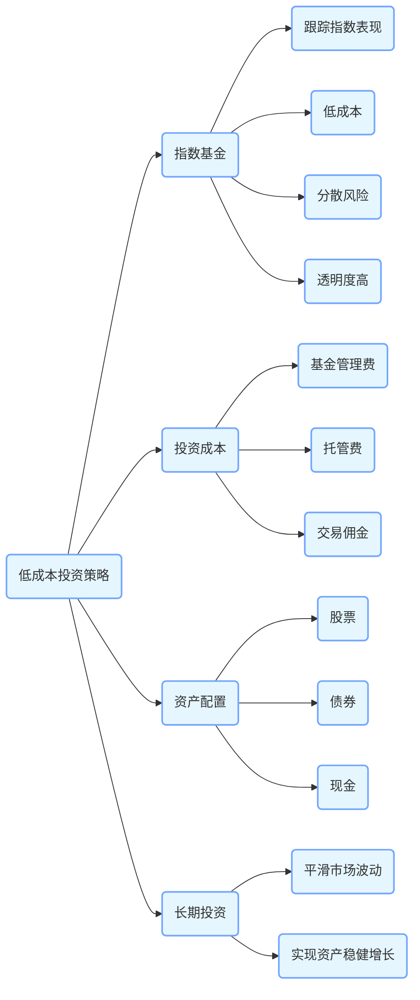

# 约翰伯格的低成本投资策略

> 关键词：约翰伯格、低成本投资策略、指数基金、投资成本、长期投资、资产配置、投资回报

> 摘要：本文深入探讨了约翰伯格所倡导的低成本投资策略。首先介绍了该策略产生的背景和目的，明确预期读者群体。接着阐述了低成本投资策略的核心概念及其内在联系，详细讲解了相关核心算法原理和具体操作步骤，运用数学模型和公式对其进行深入剖析并举例说明。通过项目实战给出实际案例和代码解释，分析该策略在不同场景下的实际应用。同时推荐了相关的学习资源、开发工具框架以及论文著作。最后总结了该策略的未来发展趋势与挑战，还设置了常见问题解答和扩展阅读参考资料。约翰伯格的低成本投资策略以其简单、有效、低成本的特点，为投资者提供了一种稳健的投资思路，对于追求长期稳定回报的投资者具有重要的参考价值。

## 1. 背景介绍 
### 1.1 目的和范围
约翰伯格的低成本投资策略旨在为广大投资者提供一种简单、有效且成本低廉的投资方式，帮助投资者在长期投资过程中实现资产的稳健增长。该策略的范围涵盖了股票、债券等多种资产类别，通过合理的资产配置和选择低成本的投资工具，降低投资成本，减少市场波动对投资组合的影响，从而提高投资回报。其目的并非追求短期的高收益，而是注重长期的资产积累和保值增值，适合那些具有长期投资目标、风险承受能力适中的投资者。

### 1.2 预期读者
本文的预期读者主要包括以下几类人群：
1. **普通投资者**：缺乏专业投资知识和经验，但希望通过合理的投资实现资产增值的人群。他们可能没有时间和精力进行深入的市场研究和个股分析，约翰伯格的低成本投资策略为他们提供了一种简单易行的投资方法。
2. **长期投资者**：具有明确的长期投资目标，如养老、子女教育等，注重资产的长期稳定增长，对投资风险有一定的承受能力，但希望通过降低投资成本来提高投资回报的投资者。
3. **投资初学者**：刚刚接触投资领域，对各种投资概念和策略还不太熟悉，希望从基础的投资知识和策略学起的人群。约翰伯格的低成本投资策略简单易懂，适合作为投资初学者的入门指南。
4. **财务规划师和投资顾问**：需要为客户提供专业的投资建议和资产配置方案的专业人士。了解约翰伯格的低成本投资策略可以丰富他们的投资工具箱，为客户提供更多元化的投资选择。

### 1.3 文档结构概述
本文将按照以下结构进行阐述：
1. **背景介绍**：介绍约翰伯格的低成本投资策略的目的、预期读者、文档结构概述以及相关术语表。
2. **核心概念与联系**：阐述低成本投资策略的核心概念，如指数基金、投资成本、资产配置等，并分析它们之间的内在联系。通过文本示意图和Mermaid流程图直观展示这些概念的关系。
3. **核心算法原理 & 具体操作步骤**：详细讲解低成本投资策略的核心算法原理，并给出具体的操作步骤，同时使用Python源代码进行详细阐述。
4. **数学模型和公式 & 详细讲解 & 举例说明**：运用数学模型和公式对低成本投资策略进行深入分析，详细讲解公式的含义和应用，并通过具体例子进行说明。
5. **项目实战：代码实际案例和详细解释说明**：通过实际项目案例，介绍开发环境的搭建、源代码的详细实现和代码解读，帮助读者更好地理解和应用低成本投资策略。
6. **实际应用场景**：分析低成本投资策略在不同市场环境和投资目标下的实际应用场景，为读者提供实际操作的参考。
7. **工具和资源推荐**：推荐相关的学习资源、开发工具框架以及论文著作，帮助读者进一步深入学习和研究低成本投资策略。
8. **总结：未来发展趋势与挑战**：总结低成本投资策略的发展趋势，分析其面临的挑战，并对未来的发展进行展望。
9. **附录：常见问题与解答**：解答读者在学习和应用低成本投资策略过程中可能遇到的常见问题。
10. **扩展阅读 & 参考资料**：提供相关的扩展阅读材料和参考资料，方便读者进一步深入研究。

### 1.4 术语表
#### 1.4.1 核心术语定义
1. **约翰伯格**：美国著名的投资家，先锋集团（Vanguard Group）的创始人，被誉为“指数基金之父”。他倡导低成本投资策略，对现代投资理论和实践产生了深远的影响。
2. **低成本投资策略**：一种通过选择低成本的投资工具（如指数基金）、合理的资产配置和长期投资来降低投资成本、提高投资回报的投资策略。
3. **指数基金**：一种按照特定指数（如标普500指数、沪深300指数等）的成分股构成和权重进行投资的基金。指数基金的投资目标是跟踪指数的表现，具有低成本、分散风险等特点。
4. **投资成本**：投资者在投资过程中所支付的各种费用，包括基金管理费、托管费、交易佣金等。投资成本的高低直接影响投资回报。
5. **资产配置**：投资者根据自己的投资目标、风险承受能力和投资期限等因素，将资金分配到不同的资产类别（如股票、债券、现金等）中的过程。合理的资产配置可以降低投资组合的风险，提高投资回报。
6. **长期投资**：投资者将资金投入到投资市场中，持有较长时间（一般为数年以上）的投资行为。长期投资可以平滑市场波动的影响，实现资产的稳健增长。

#### 1.4.2 相关概念解释
1. **被动投资**：一种投资策略，投资者不主动进行个股或债券的选择和买卖，而是通过投资指数基金等被动投资工具来跟踪市场指数的表现。被动投资的特点是低成本、简单易行，适合大多数投资者。
2. **主动投资**：一种投资策略，投资者通过深入的市场研究和个股分析，主动选择投资标的和买卖时机，试图超越市场平均水平的投资行为。主动投资的特点是成本较高、风险较大，但可能获得较高的投资回报。
3. **基金管理费**：基金管理公司为管理基金资产而向投资者收取的费用。基金管理费通常按照基金资产净值的一定比例收取，是基金投资成本的重要组成部分。
4. **托管费**：基金托管银行为保管基金资产而向投资者收取的费用。托管费通常按照基金资产净值的一定比例收取，也是基金投资成本的一部分。
5. **交易佣金**：投资者在买卖股票、基金等证券时向券商支付的费用。交易佣金的高低直接影响投资者的交易成本。

#### 1.4.3 缩略词列表
1. **ETF**：Exchange-Traded Fund，交易型开放式指数基金，一种在证券交易所上市交易的指数基金。
2. **SPDR**：Standard & Poor's Depositary Receipts，标准普尔存托凭证，一种跟踪标普500指数的ETF。
3. **VTI**：Vanguard Total Stock Market Index Fund，先锋全股票市场指数基金，一种跟踪美国全股票市场指数的基金。

## 2. 核心概念与联系 
### 核心概念原理
约翰伯格的低成本投资策略的核心概念主要包括指数基金、投资成本、资产配置和长期投资。

#### 指数基金
指数基金是一种被动投资工具，它按照特定指数的成分股构成和权重进行投资，旨在跟踪指数的表现。指数基金的投资组合是由指数的成分股组成，因此其投资业绩与指数的表现高度相关。指数基金的优点在于低成本、分散风险和透明度高。由于指数基金不需要进行主动的个股选择和买卖，因此其管理费用和交易成本较低。同时，指数基金投资于多个股票，分散了单个股票的风险，降低了投资组合的波动性。此外，指数基金的投资组合是公开透明的，投资者可以清楚地了解基金的投资情况。

#### 投资成本
投资成本是投资者在投资过程中所支付的各种费用，包括基金管理费、托管费、交易佣金等。投资成本的高低直接影响投资回报。较高的投资成本会降低投资者的实际收益，而较低的投资成本则可以提高投资回报。约翰伯格认为，投资者应该尽量选择低成本的投资工具，以降低投资成本，提高投资回报。

#### 资产配置
资产配置是投资者根据自己的投资目标、风险承受能力和投资期限等因素，将资金分配到不同的资产类别（如股票、债券、现金等）中的过程。合理的资产配置可以降低投资组合的风险，提高投资回报。不同的资产类别具有不同的风险和收益特征，通过将资金分散投资到不同的资产类别中，可以实现风险的分散和收益的平衡。例如，股票具有较高的风险和潜在收益，而债券则具有较低的风险和稳定的收益。投资者可以根据自己的风险承受能力和投资目标，合理配置股票和债券的比例，以实现投资组合的优化。

#### 长期投资
长期投资是投资者将资金投入到投资市场中，持有较长时间（一般为数年以上）的投资行为。长期投资可以平滑市场波动的影响，实现资产的稳健增长。市场在短期内可能会出现较大的波动，但从长期来看，市场往往呈现出上涨的趋势。通过长期投资，投资者可以避免因短期市场波动而做出错误的投资决策，从而实现资产的长期增值。

### 核心概念架构的文本示意图
```plaintext
低成本投资策略
|-- 指数基金
|   |-- 跟踪指数表现
|   |-- 低成本
|   |-- 分散风险
|   |-- 透明度高
|-- 投资成本
|   |-- 基金管理费
|   |-- 托管费
|   |-- 交易佣金
|-- 资产配置
|   |-- 股票
|   |-- 债券
|   |-- 现金
|-- 长期投资
|   |-- 平滑市场波动
|   |-- 实现资产稳健增长
```

### Mermaid 流程图


## 3. 核心算法原理 & 具体操作步骤 
### 核心算法原理
约翰伯格的低成本投资策略的核心算法原理基于以下几个方面：

#### 指数基金的选择
指数基金的选择主要基于其跟踪的指数和费用率。投资者应该选择跟踪市场代表性指数（如标普500指数、沪深300指数等）的指数基金，因为这些指数能够反映市场的整体表现。同时，投资者应该选择费用率较低的指数基金，以降低投资成本。费用率是指基金管理公司每年从基金资产中收取的管理费用和其他费用的比例。费用率越低，投资者实际获得的投资回报就越高。

#### 资产配置的确定
资产配置的确定需要考虑投资者的投资目标、风险承受能力和投资期限等因素。一般来说，投资者的风险承受能力越高，投资期限越长，其股票资产的配置比例可以越高；反之，投资者的风险承受能力越低，投资期限越短，其债券和现金资产的配置比例可以越高。常见的资产配置方法包括均值 - 方差优化法、风险平价法等。

#### 长期投资的坚持
长期投资的坚持是低成本投资策略的关键。投资者应该避免因短期市场波动而频繁买卖投资组合，以免增加交易成本和错过市场上涨的机会。投资者应该根据自己的投资目标和资产配置计划，长期持有投资组合，实现资产的稳健增长。

### 具体操作步骤
#### 步骤1：确定投资目标和风险承受能力
投资者首先需要明确自己的投资目标，如养老、子女教育、资产增值等。然后，投资者需要评估自己的风险承受能力，可以通过填写风险测评问卷等方式来确定自己的风险承受水平。风险承受能力主要包括投资者的财务状况、投资经验、投资期限、心理承受能力等因素。

#### 步骤2：选择指数基金
根据自己的投资目标和风险承受能力，投资者选择适合自己的指数基金。投资者可以从以下几个方面进行选择：
1. **跟踪指数**：选择跟踪市场代表性指数的指数基金，如标普500指数、沪深300指数等。
2. **费用率**：选择费用率较低的指数基金，以降低投资成本。
3. **规模**：选择规模较大的指数基金，以保证基金的流动性和稳定性。

#### 步骤3：确定资产配置比例
根据自己的投资目标、风险承受能力和投资期限等因素，投资者确定股票、债券和现金等资产的配置比例。例如，一个风险承受能力较高、投资期限较长的投资者可以将股票资产的配置比例设定为70%，债券资产的配置比例设定为20%，现金资产的配置比例设定为10%；而一个风险承受能力较低、投资期限较短的投资者可以将股票资产的配置比例设定为30%，债券资产的配置比例设定为60%，现金资产的配置比例设定为10%。

#### 步骤4：定期调整投资组合
投资者需要定期（如每年或每半年）对投资组合进行调整，以保持资产配置比例的平衡。由于不同资产类别的市场表现不同，投资组合的资产配置比例可能会发生变化。例如，股票市场表现较好时，股票资产的比例可能会上升，超过了原来设定的比例；此时，投资者需要卖出部分股票，买入债券或现金，以恢复原来的资产配置比例。

#### 步骤5：长期持有投资组合
投资者应该长期持有投资组合，避免因短期市场波动而频繁买卖。长期投资可以平滑市场波动的影响，实现资产的稳健增长。

### Python源代码详细阐述
以下是一个简单的Python代码示例，用于演示如何根据风险承受能力和投资期限确定资产配置比例，并选择相应的指数基金。

```python
# 定义指数基金类
class IndexFund:
    def __init__(self, name, tracking_index, expense_ratio, fund_size):
        self.name = name
        self.tracking_index = tracking_index
        self.expense_ratio = expense_ratio
        self.fund_size = fund_size

    def __str__(self):
        return f"基金名称: {self.name}, 跟踪指数: {self.tracking_index}, 费用率: {self.expense_ratio}, 基金规模: {self.fund_size}"

# 定义投资者类
class Investor:
    def __init__(self, investment_goal, risk_tolerance, investment_horizon):
        self.investment_goal = investment_goal
        self.risk_tolerance = risk_tolerance
        self.investment_horizon = investment_horizon

    def determine_asset_allocation(self):
        if self.risk_tolerance == "高" and self.investment_horizon >= 10:
            stock_ratio = 0.7
            bond_ratio = 0.2
            cash_ratio = 0.1
        elif self.risk_tolerance == "中" and self.investment_horizon >= 5:
            stock_ratio = 0.5
            bond_ratio = 0.4
            cash_ratio = 0.1
        else:
            stock_ratio = 0.3
            bond_ratio = 0.6
            cash_ratio = 0.1
        return stock_ratio, bond_ratio, cash_ratio

    def select_index_funds(self, index_funds):
        stock_funds = []
        bond_funds = []
        for fund in index_funds:
            if "股票" in fund.tracking_index:
                stock_funds.append(fund)
            elif "债券" in fund.tracking_index:
                bond_funds.append(fund)
        # 选择费用率最低的股票基金和债券基金
        stock_funds.sort(key=lambda x: x.expense_ratio)
        bond_funds.sort(key=lambda x: x.expense_ratio)
        selected_stock_fund = stock_funds[0] if stock_funds else None
        selected_bond_fund = bond_funds[0] if bond_funds else None
        return selected_stock_fund, selected_bond_fund

# 示例指数基金列表
index_funds = [
    IndexFund("标普500指数基金", "标普500股票指数", 0.005, 1000000000),
    IndexFund("沪深300指数基金", "沪深300股票指数", 0.006, 800000000),
    IndexFund("国债指数基金", "国债债券指数", 0.003, 500000000),
    IndexFund("企业债指数基金", "企业债债券指数", 0.004, 400000000)
]

# 示例投资者
investor = Investor("资产增值", "高", 15)

# 确定资产配置比例
stock_ratio, bond_ratio, cash_ratio = investor.determine_asset_allocation()
print(f"股票资产配置比例: {stock_ratio}, 债券资产配置比例: {bond_ratio}, 现金资产配置比例: {cash_ratio}")

# 选择指数基金
selected_stock_f