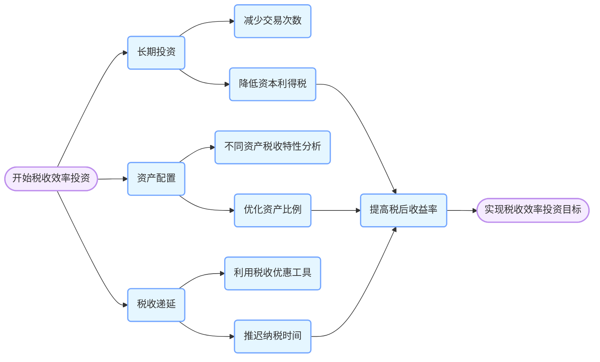

# 约翰伯格的税收效率投资

> 关键词：约翰伯格、税收效率投资、投资策略、税收优化、长期投资

> 摘要：本文深入探讨了约翰伯格所倡导的税收效率投资理念。从背景介绍入手，详细阐述了相关核心概念及其联系，剖析了核心算法原理与具体操作步骤，并运用数学模型和公式进行解释说明。通过项目实战展示实际代码案例及解读，探讨了该投资理念的实际应用场景。同时推荐了相关学习资源、开发工具框架以及论文著作。最后总结了其未来发展趋势与挑战，并给出常见问题解答和扩展阅读参考资料，旨在帮助投资者更好地理解和运用税收效率投资策略，实现资产的长期增值。

## 1. 背景介绍 
### 1.1 目的和范围
本文的目的是全面深入地介绍约翰伯格的税收效率投资理念和策略。范围涵盖了从理论基础到实际应用的各个方面，包括核心概念的阐述、算法原理的分析、数学模型的构建、实际案例的展示以及未来发展趋势的探讨等。通过对这些内容的详细介绍，帮助投资者理解如何在投资过程中提高税收效率，降低税收对投资回报的影响，从而实现更优的投资收益。

### 1.2 预期读者
本文的预期读者主要包括对投资领域感兴趣的个人投资者、金融从业者以及相关专业的研究人员。对于个人投资者来说，希望通过学习本文能够掌握税收效率投资的方法，优化自己的投资组合；金融从业者可以将其作为拓展业务知识和为客户提供更专业服务的参考；研究人员则可以从中获取相关理论和实践的资料，为进一步的学术研究提供支持。

### 1.3 文档结构概述
本文将按照以下结构进行组织：首先介绍背景信息，包括目的、预期读者和文档结构概述等；接着阐述核心概念与联系，通过文本示意图和 Mermaid 流程图展示其原理和架构；然后详细讲解核心算法原理和具体操作步骤，并给出 Python 源代码；之后运用数学模型和公式进行解释说明，并举例分析；通过项目实战展示代码实际案例并进行详细解读；探讨该投资理念的实际应用场景；推荐相关的工具和资源，包括学习资源、开发工具框架和论文著作等；最后总结未来发展趋势与挑战，给出常见问题解答和扩展阅读参考资料。

### 1.4 术语表
#### 1.4.1 核心术语定义
- **税收效率投资**：指在投资过程中，通过合理的投资策略和资产配置，最大限度地降低税收对投资回报的影响，提高投资的税后收益率。
- **资产配置**：将资金分配到不同类型的资产中，如股票、债券、基金等，以实现风险分散和收益最大化的目标。
- **长期投资**：指投资者持有资产的时间较长，通常为数年甚至数十年，以获取资产的长期增值收益。
- **资本利得税**：对投资者出售资产所获得的利润征收的税款。
- **股息税**：对投资者从股票投资中获得的股息收入征收的税款。

#### 1.4.2 相关概念解释
- **税收递延**：指通过特定的投资工具或策略，将应纳税款的缴纳时间推迟到未来某个时期，从而获得资金的时间价值。
- **税损 harvesting**：指在投资组合中，当某些资产出现亏损时，及时出售这些资产，以亏损来抵消其他资产的收益，从而降低当期应纳税额。
- **指数基金**：一种被动式投资基金，其投资组合旨在跟踪特定的市场指数，如标普 500 指数等。由于其交易频率较低，通常具有较高的税收效率。

#### 1.4.3 缩略词列表
- **ETF**：交易型开放式指数基金（Exchange-Traded Fund）
- **IRA**：个人退休账户（Individual Retirement Account）
- **401(k)**：美国的一种雇主赞助的退休储蓄计划

## 2. 核心概念与联系 
### 核心概念原理
约翰伯格的税收效率投资理念基于几个核心原理。首先是长期投资的理念，他认为长期持有资产可以减少交易次数，从而降低资本利得税的产生。因为频繁的买卖资产会导致每次交易产生的利润都需要缴纳资本利得税，而长期投资可以让资产在持有期间实现增值，只有在最终出售时才需要缴纳税款。

其次是资产配置的重要性。通过合理地将资金分配到不同类型的资产中，可以根据不同资产的税收特性进行优化。例如，债券的利息收入通常需要缴纳普通所得税，而股票的资本利得和股息收入的税率可能相对较低。因此，可以根据个人的税收情况和投资目标，调整股票和债券的比例，以降低整体税负。

另外，税收递延也是一个关键原理。通过利用一些税收优惠的投资工具，如 IRA 和 401(k) 等，投资者可以将应纳税款的缴纳时间推迟到退休后。在退休后，由于收入水平可能较低，适用的税率也会相应降低，从而实现税收的优化。

### 架构的文本示意图
```plaintext
约翰伯格的税收效率投资
|-- 长期投资
|   |-- 减少交易次数
|   |-- 降低资本利得税
|-- 资产配置
|   |-- 不同资产税收特性分析
|   |-- 优化资产比例
|-- 税收递延
|   |-- 利用税收优惠工具
|   |-- 推迟纳税时间
```

### Mermaid 流程图


## 3. 核心算法原理 & 具体操作步骤 
### 核心算法原理
税收效率投资的核心算法原理主要围绕如何计算不同投资策略下的税后收益率。以下是一个简化的算法思路：

1. 计算投资组合中各项资产的税前收益。
2. 根据不同资产的税收特性，计算各项资产的应纳税额。
3. 从税前收益中扣除应纳税额，得到税后收益。
4. 计算投资组合的税后收益率。

### 具体操作步骤
1. **确定投资组合**：明确投资组合中包含的资产种类和比例，例如股票、债券、基金等。
2. **收集资产信息**：获取各项资产的预期收益率、股息率、资本利得率等信息。
3. **分析税收政策**：了解不同资产的税收政策，包括资本利得税税率、股息税税率等。
4. **计算税前收益**：根据资产的预期收益率和投资比例，计算投资组合的税前收益。
5. **计算应纳税额**：根据各项资产的税收特性和收益情况，计算应纳税额。
6. **计算税后收益**：从税前收益中扣除应纳税额，得到税后收益。
7. **计算税后收益率**：将税后收益除以投资本金，得到税后收益率。

### Python 源代码详细阐述
```python
# 定义投资组合中各项资产的信息
assets = [
    {
        "name": "股票",
        "investment": 50000,  # 投资金额
        "expected_return": 0.1,  # 预期收益率
        "dividend_yield": 0.02,  # 股息率
        "capital_gains_rate": 0.15  # 资本利得税税率
    },
    {
        "name": "债券",
        "investment": 30000,
        "expected_return": 0.05,
        "interest_income_rate": 0.05,  # 利息收入税率
        "ordinary_income_tax_rate": 0.25  # 普通所得税税率
    },
    {
        "name": "基金",
        "investment": 20000,
        "expected_return": 0.08,
        "dividend_yield": 0.01,
        "capital_gains_rate": 0.15
    }
]

# 计算税前收益
pre_tax_income = 0
for asset in assets:
    pre_tax_income += asset["investment"] * asset["expected_return"]

# 计算应纳税额
tax_payable = 0
for asset in assets:
    if "dividend_yield" in asset:
        dividend_income = asset["investment"] * asset["dividend_yield"]
        tax_payable += dividend_income * asset["capital_gains_rate"]
    if "interest_income_rate" in asset:
        interest_income = asset["investment"] * asset["interest_income_rate"]
        tax_payable += interest_income * asset["ordinary_income_tax_rate"]
    capital_gains = asset["investment"] * (asset["expected_return"] - (asset.get("dividend_yield", 0) + asset.get("interest_income_rate", 0)))
    tax_payable += capital_gains * asset["capital_gains_rate"]

# 计算税后收益
after_tax_income = pre_tax_income - tax_payable

# 计算投资本金
total_investment = sum([asset["investment"] for asset in assets])

# 计算税后收益率
after_tax_return_rate = after_tax_income / total_investment

print(f"税前收益: {pre_tax_income}")
print(f"应纳税额: {tax_payable}")
print(f"税后收益: {after_tax_income}")
print(f"税后收益率: {after_tax_return_rate * 100:.2f}%")
```

## 4. 数学模型和公式 & 详细讲解 & 举例说明 
### 数学模型和公式
#### 1. 税前收益计算公式
设投资组合中有 $n$ 项资产，第 $i$ 项资产的投资金额为 $I_i$，预期收益率为 $r_i$，则投资组合的税前收益 $P$ 计算公式为：
$$P = \sum_{i=1}^{n} I_i \times r_i$$

#### 2. 应纳税额计算公式
对于不同类型的资产，应纳税额的计算方式不同。

- **股票**：设股票的股息率为 $d_i$，资本利得税税率为 $t_{cg}$，则股票的应纳税额 $T_{stock}$ 计算公式为：
$$T_{stock} = I_i \times d_i \times t_{cg} + I_i \times (r_i - d_i) \times t_{cg}$$

- **债券**：设债券的利息收入税率为 $r_{int}$，普通所得税税率为 $t_{oi}$，则债券的应纳税额 $T_{bond}$ 计算公式为：
$$T_{bond} = I_i \times r_{int} \times t_{oi}$$

#### 3. 税后收益计算公式
投资组合的税后收益 $A$ 计算公式为：
$$A = P - T$$
其中 $T$ 为投资组合的总应纳税额，即各项资产应纳税额之和。

#### 4. 税后收益率计算公式
投资组合的税后收益率 $R_{after}$ 计算公式为：
$$R_{after} = \frac{A}{\sum_{i=1}^{n} I_i} \times 100\%$$

### 详细讲解
这些公式的核心思想是先计算投资组合的税前收益，然后根据不同资产的税收特性计算应纳税额，最后从税前收益中扣除应纳税额得到税后收益，并计算税后收益率。通过这些公式，可以比较不同投资组合在考虑税收因素后的实际收益情况，从而进行投资决策。

### 举例说明
假设投资组合中有两项资产：股票和债券。股票的投资金额为 $50000$ 元，预期收益率为 $10\%$，股息率为 $2\%$，资本利得税税率为 $15\%$；债券的投资金额为 $30000$ 元，预期收益率为 $5\%$，利息收入税率为 $5\%$，普通所得税税率为 $25\%$。

#### 1. 计算税前收益
股票的税前收益：$50000 \times 0.1 = 5000$ 元
债券的税前收益：$30000 \times 0.05 = 1500$ 元
投资组合的税前收益：$P = 5000 + 1500 = 6500$ 元

#### 2. 计算应纳税额
股票的应纳税额：
股息税：$50000 \times 0.02 \times 0.15 = 150$ 元
资本利得税：$50000 \times (0.1 - 0.02) \times 0.15 = 600$ 元
股票总应纳税额：$150 + 600 = 750$ 元

债券的应纳税额：
利息税：$30000 \times 0.05 \times 0.25 = 375$ 元

投资组合的总应纳税额：$T = 750 + 375 = 1125$ 元

#### 3. 计算税后收益
税后收益：$A = 6500 - 1125 = 5375$ 元

#### 4. 计算税后收益率
投资本金：$50000 + 30000 = 80000$ 元
税后收益率：$R_{after} = \frac{5375}{80000} \times 100\% = 6.72\%$

## 5. 项目实战：代码实际案例和详细解释说明 
### 5.1  开发环境搭建
#### 1. 安装 Python
首先需要安装 Python 环境，建议使用 Python 3.7 及以上版本。可以从 Python 官方网站（https://www.python.org/downloads/）下载并安装适合自己操作系统的 Python 版本。

#### 2. 安装必要的库
本项目只使用 Python 的内置库，无需额外安装其他库。如果需要进行更复杂的数据分析和可视化，可以安装 `pandas`、`numpy` 和 `matplotlib` 等库，使用以下命令进行安装：
```sh
pip install pandas numpy matplotlib
```

### 5.2  源代码详细实现和代码解读
```python
# 定义投资组合中各项资产的信息
assets = [
    {
        "name": "股票",
        "investment": 50000,  # 投资金额
        "expected_return": 0.1,  # 预期收益率
        "dividend_yield": 0.02,  # 股息率
        "capital_gains_rate": 0.15  # 资本利得税税率
    },
    {
        "name": "债券",
        "investment": 30000,
        "expected_return": 0.05,
        "interest_income_rate": 0.05,  # 利息收入税率
        "ordinary_income_tax_rate": 0.25  # 普通所得税税率
    },
    {
        "name": "基金",
        "investment": 20000,
        "expected_return": 0.08,
        "dividend_yield": 0.01,
        "capital_gains_rate": 0.15
    }
]

# 计算税前收益
pre_tax_income = 0
for asset in assets:
    pre_tax_income += asset["investment"] * asset["expected_return"]

# 计算应纳税额
tax_payable = 0
for asset in assets:
    if "dividend_yield" in asset:
        dividend_income = asset["investment"] * asset["dividend_yield"]
        tax_payable += dividend_income * asset["capital_gains_rate"]
    if "interest_income_rate" in asset:
        interest_income = asset["investment"] * asset["interest_income_rate"]
        tax_payable += interest_income * asset["ordinary_income_tax_rate"]
    capital_gains = asset["investment"] * (asset["expected_return"] - (asset.get("dividend_yield", 0) + asset.get("interest_income_rate", 0)))
    tax_payable += capital_gains * asset["capital_gains_rate"]

# 计算税后收益
after_tax_income = pre_tax_income - tax_payable

# 计算投资本金
total_investment = sum([asset["investment"] for asset in assets])

# 计算税后收益率
after_tax_return_rate = after_tax_income / total_investment

print(f"税前收益: {pre_tax_income}")
print(f"应纳税额: {tax_payable}")
print(f"税后收益: {after_tax_income}")
print(f"税后收益率: {after_tax_return_rate * 100:.2f}%")
```

#### 代码解读
1. **定义投资组合信息**：使用列表 `assets` 存储投资组合中各项资产的信息，每个资产信息以字典的形式表示，包含资产名称、投资金额、预期收益率、股息率、资本利得税税率等信息。
2. **计算税前收益**：通过遍历 `assets` 列表，将每项资产的投资金额乘以预期收益率，然后累加得到投资组合的税前收益。
3. **计算应纳税额**：同样遍历 `assets` 列表，根据不同资产的税收特性计算应纳税额。对于有股息的资产，计算股息税；对于有利息收入的资产，计算利息税；同时计算资本利得税，最后将各项税额累加得到总应纳税额。
4. **计算税后收益**：用税前收益减去应纳税额得到税后收益。
5. **计算投资本金**：将各项资产的投资金额相加得到投资本金。
6. **计算税后收益率**：用税后收益除以投资本金得到税后收益率，并将结果转换为百分比形式输出。

### 5.3  代码解读与分析
通过上述代码，我们可以清晰地看到如何计算投资组合的税前收益、应纳税额、税后收益和税后收益率。代码的核心在于对不同资产的税收特性进行分析和计算，从而准确评估投资组合在考虑税收因素后的实际收益情况。

在实际应用中，我们可以根据不同的投资组合和税收政策，修改 `assets` 列表中的信息，重新运行代码即可得到相应的结果。此外，还可以对代码进行扩展，例如添加更多的资产类型、考虑不同的税收优惠政策等，以实现更复杂的税收效率投资分析。

## 6. 实际应用场景 
### 个人投资者
对于个人投资者来说，税收效率投资可以帮助他们在实现资产增值的同时，降低税收负担。例如，通过长期投资指数基金，减少交易次数，降低资本利得税的产生。同时，合理配置资产，将一部分资金投资于税收优惠的资产，如国债等，可以享受免税或低税的待遇。另外，利用 IRA 和 401(k) 等退休账户进行投资，可以实现税收递延，在退休后以较低的税率缴纳税款。

### 金融机构
金融机构可以将税收效率投资策略应用于为客户提供的投资服务中。例如，为高净值客户制定个性化的投资组合，根据客户的税收情况和投资目标，优化资产配置，提高税后收益率。同时，金融机构也可以开发相关的投资产品，如税收效率型基金，吸引更多的投资者。

### 企业投资者
企业投资者在进行投资决策时，也需要考虑税收因素。通过合理的投资策略和资产配置，企业可以降低投资收益的税负，提高资金的使用效率。例如，企业可以将闲置资金投资于税收优惠的项目或资产，以减少应纳税额。

## 7. 工具和资源推荐
### 7.1 学习资源推荐
#### 7.1.1 书籍推荐
- 《聪明的投资者》（The Intelligent Investor）：作者本杰明·格雷厄姆（Benjamin Graham），这本书是投资领域的经典之作，介绍了价值投资的理念和方法，对税收效率投资也有一定的启示作用。
- 《漫步华尔街》（A Random Walk Down Wall Street）：作者伯顿·马尔基尔（Burton G. Malkiel），本书探讨了各种投资策略和市场现象，包括税收对投资的影响，适合投资者了解投资的基本知识和税收效率投资的相关概念。
- 《约翰·伯格的投资50堂课》（John Bogle on Investing: The First 50 Years）：作者约翰·伯格（John Bogle）本人，这本书集中了他多年的投资智慧，详细阐述了他的投资理念和税收效率投资策略。

#### 7.1.2 在线课程
- Coursera 上的“投资学原理”（Principles of Investing）课程：由知名大学的教授授课，涵盖了投资的基本原理、资产配置、风险管理等内容，其中也会涉及到税收对投资的影响。
- edX 上的“金融市场”（Financial Markets）课程：耶鲁大学教授罗伯特·席勒（Robert Shiller）主讲，课程深入探讨了金融市场的运行机制和投资策略，对理解税收效率投资有很大的帮助。

#### 7.1.3 技术博客和网站
- 晨星网（Morningstar）：提供基金、股票等投资产品的评级和分析，同时也有关于投资策略和税收优化的文章和研究报告。
- 投资百科（Investopedia）：是一个综合性的投资知识网站，提供各种投资术语的解释、投资策略的介绍以及税收相关的信息。
- 金融界（JRJ.com）：国内知名的金融资讯网站，有丰富的投资文章和专家观点，也会关注税收效率投资的相关话题。

### 7.2 开发工具框架推荐
#### 7.2.1 IDE和编辑器
- PyCharm：是一款专业的 Python 集成开发环境，具有代码编辑、调试、代码分析等功能，适合开发复杂的投资分析程序。
- Jupyter Notebook：是一个交互式的开发环境，可以方便地编写和运行 Python 代码，同时支持 Markdown 文本和可视化展示，非常适合进行数据分析和投资模型的构建。

#### 7.2.2 调试和性能分析工具
- Python 的内置调试器 `pdb`：可以帮助开发者在代码运行过程中进行调试，查找代码中的错误和问题。
- `cProfile`：Python 的性能分析模块，可以分析代码的运行时间和函数调用情况，帮助开发者优化代码性能。

#### 7.2.3 相关框架和库
- Pandas：是一个强大的数据分析库，提供了数据结构和数据处理工具，方便对投资数据进行清洗、分析和可视化。
- Numpy：是 Python 的数值计算库，提供了高效的数组和矩阵运算功能，在投资模型的计算中经常会用到。
- Matplotlib：是一个常用的绘图库，可以绘制各种类型的图表，如折线图、柱状图、散点图等，用于可视化投资数据和分析结果。

### 7.3 相关论文著作推荐
#### 7.3.1 经典论文
- “资本资产定价模型：理论与实证”（Capital Asset Pricing Model: Theory and Empirical Evidence）：该论文深入探讨了资本资产定价模型的理论基础和实证检验，对理解投资组合的风险和收益关系有重要意义，也与税收效率投资中的资产配置相关。
- “有效市场假说：回顾与展望”（Efficient Market Hypothesis: A Review and Prospect）：有效市场假说对投资策略的制定有重要影响，这篇论文对该假说进行了全面的回顾和展望，有助于投资者理解市场的有效性和税收效率投资的可行性。

#### 7.3.2 最新研究成果
- 关注《金融研究》《经济研究》等国内外知名学术期刊，这些期刊会发表关于投资、税收等领域的最新研究成果，为投资者提供前沿的理论和方法。
- 参加金融领域的学术会议，如美国金融协会（American Finance Association）年会等，可以了解到最新的研究动态和趋势。

#### 7.3.3 应用案例分析
- 一些金融咨询公司和研究机构会发布投资案例分析报告，介绍不同投资组合的构建和税收优化策略。可以通过这些报告了解实际应用中的税收效率投资方法和效果。

## 8. 总结：未来发展趋势与挑战
### 未来发展趋势
#### 1. 数字化和智能化
随着科技的不断发展，税收效率投资将越来越多地借助数字化和智能化工具。例如，利用大数据和人工智能技术进行投资组合的优化和税收策略的制定。通过分析大量的市场数据和个人税收信息，为投资者提供更加个性化、精准的投资建议。

#### 2. 跨领域融合
税收效率投资将与其他领域进行更深入的融合，如金融科技、风险管理等。例如，结合区块链技术实现投资交易的透明化和可追溯性，降低税收合规成本；同时，将税收效率投资纳入全面风险管理体系，提高投资的稳定性和可持续性。

#### 3. 国际化趋势
随着全球经济的一体化，投资者的资产配置越来越多元化，涉及到不同国家和地区的税收政策。未来，税收效率投资将更加注重国际化的税收筹划和资产配置，以应对不同国家税收法规的差异。

### 挑战
#### 1. 税收政策的复杂性
不同国家和地区的税收政策各不相同，且税收法规经常发生变化。投资者需要花费大量的时间和精力去了解和适应这些政策，增加了税收效率投资的难度。

#### 2. 市场不确定性
金融市场充满了不确定性，资产价格的波动、宏观经济环境的变化等都会影响投资组合的收益和税收情况。投资者需要具备较强的风险管理能力，以应对市场不确定性带来的挑战。

#### 3. 数据安全和隐私问题
在数字化和智能化的背景下，税收效率投资需要处理大量的个人和市场数据。如何保障数据的安全和隐私，防止数据泄露和滥用，是一个亟待解决的问题。

## 9. 附录：常见问题与解答
### 1. 税收效率投资是否适合所有投资者？
税收效率投资并不适合所有投资者。它更适合那些有一定投资经验、对税收政策有一定了解且有长期投资目标的投资者。对于短期投资者或对税收不太敏感的投资者来说，可能不太需要过于关注税收效率投资。

### 2. 如何选择适合自己的税收优惠投资工具？
选择适合自己的税收优惠投资工具需要考虑多个因素，如个人的投资目标、风险承受能力、税收情况等。例如，对于年轻人来说，IRA 和 401(k) 等退休账户可以作为长期投资的选择；对于高收入人群来说，可以考虑投资一些免税的债券或基金。

### 3. 税收效率投资会影响投资的收益吗？
在合理的情况下，税收效率投资可以提高投资的税后收益率，从而增加实际收益。但如果为了追求税收效率而过度调整投资组合，可能会影响投资的风险收益平衡，导致收益下降。因此，需要在税收效率和投资收益之间找到一个平衡点。

### 4. 如何应对税收政策的变化？
投资者需要密切关注税收政策的变化，及时调整投资策略。可以通过关注政府发布的税收法规、咨询专业的税务顾问等方式，了解税收政策的最新动态，并根据变化调整投资组合和税收筹划方案。

## 10. 扩展阅读 & 参考资料
### 扩展阅读
- 《投资最重要的事》（The Most Important Thing Illuminated）：作者霍华德·马克斯（Howard Marks），这本书强调了投资中的风险管理和价值判断，对税收效率投资也有一定的启示。
- 《金融炼金术》（The Alchemy of Finance）：作者乔治·索罗斯（George Soros），书中介绍了索罗斯的投资哲学和市场分析方法，有助于投资者拓宽投资视野。

### 参考资料
- 美国国税局（IRS）官方网站：提供美国最新的税收法规和政策解读，是了解美国税收情况的重要参考来源。
- 各国金融监管机构的官方网站：如中国证监会、英国金融行为监管局（FCA）等，这些网站会发布与投资和税收相关的政策和法规。

作者：AI天才研究院/AI Genius Institute & 禅与计算机程序设计艺术 /Zen And The Art of Computer Programming