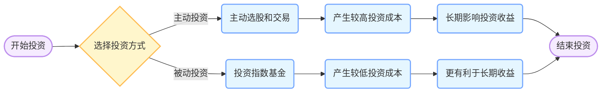

# 约翰博格尔的投资成本控制策略

> 关键词：约翰博格尔、投资成本控制、指数基金、成本影响、长期投资

> 摘要：本文深入探讨了约翰博格尔的投资成本控制策略。约翰博格尔作为投资界的传奇人物，以其创立的指数基金和对投资成本的深刻见解影响了全球投资者。文章首先介绍了相关背景，包括目的范围、预期读者等。接着阐述核心概念，如指数基金、投资成本等，并展示其联系。详细讲解核心算法原理及操作步骤，结合数学模型和公式说明成本对投资收益的影响。通过项目实战案例展示成本控制策略的实际应用。分析实际应用场景，推荐学习资源、开发工具和相关论文著作。最后总结未来发展趋势与挑战，解答常见问题并提供扩展阅读和参考资料，帮助投资者更好地理解和运用约翰博格尔的投资成本控制策略。

## 1. 背景介绍 
### 1.1 目的和范围
本文的目的在于全面剖析约翰博格尔的投资成本控制策略，深入探究其背后的原理、实际应用及对投资者的重要意义。范围涵盖了从核心概念的阐述到具体算法原理的讲解，再到实际项目案例的分析，以及对未来发展趋势的展望等多个方面。旨在为投资者提供一个系统、全面的视角，帮助他们理解如何通过有效的成本控制来提升投资收益。

### 1.2 预期读者
本文的预期读者主要包括各类投资者，无论是个人投资者还是专业投资机构的从业者。对于初涉投资领域的新手，本文可以帮助他们建立正确的投资成本控制观念；对于有一定投资经验的投资者，能为他们提供更深入的理论支持和实践指导，进一步优化投资策略。同时，金融研究人员和相关专业的学生也可以从本文中获取有价值的研究素材和知识。

### 1.3 文档结构概述
本文将按照以下结构展开：首先介绍相关背景信息，包括目的、读者和文档结构等；接着阐述核心概念及其联系，通过文本示意图和 Mermaid 流程图进行清晰展示；然后详细讲解核心算法原理和具体操作步骤，并结合 Python 代码进行说明；再介绍数学模型和公式，通过举例加深理解；之后通过项目实战案例展示成本控制策略的实际应用；分析实际应用场景；推荐相关的学习资源、开发工具和论文著作；最后总结未来发展趋势与挑战，解答常见问题并提供扩展阅读和参考资料。

### 1.4 术语表
#### 1.4.1 核心术语定义
- **指数基金**：一种按照特定指数的成分股组成及其权重进行投资的基金，旨在复制指数的表现。例如，沪深 300 指数基金就是以沪深 300 指数的成分股为投资对象。
- **投资成本**：投资者在进行投资过程中所产生的各种费用，包括交易佣金、基金管理费、托管费等。
- **复利效应**：指在投资过程中，将所获得的收益再投资，使得本金不断增加，从而在下一个周期获得更多的收益，呈现出收益不断累积增长的效果。

#### 1.4.2 相关概念解释
- **主动投资**：投资者通过积极的研究和分析，试图挑选出表现优于市场平均水平的投资标的，以获取超额收益。
- **被动投资**：主要是指投资于指数基金等，不进行主动的股票挑选，而是跟随市场指数的表现，以获取市场平均收益。

#### 1.4.3 缩略词列表
- **ETF**：交易型开放式指数基金（Exchange Traded Fund），是一种在交易所上市交易的、基金份额可变的开放式基金。
- **ROI**：投资回报率（Return on Investment），用于衡量投资的收益水平。

## 2. 核心概念与联系 

### 核心概念原理
#### 指数基金
指数基金的原理是通过购买构成特定指数的全部或部分股票，来跟踪该指数的表现。例如，标准普尔 500 指数基金就是投资于标准普尔 500 指数所包含的 500 只股票。由于其投资组合的构建是基于指数成分股，因此不需要进行大量的主动选股和研究工作，从而降低了管理成本。

#### 投资成本控制
投资成本控制的核心原理是认识到投资成本对投资收益的长期影响。即使是看似微小的成本差异，在复利效应的作用下，也可能对最终的投资回报产生巨大的影响。因此，投资者应该尽量减少不必要的成本支出，选择低成本的投资产品。

### 架构的文本示意图
```plaintext
投资成本控制策略
|-- 指数基金投资
|   |-- 跟踪市场指数
|   |-- 降低管理成本
|-- 成本管理
|   |-- 减少交易佣金
|   |-- 降低基金管理费
|-- 长期投资
|   |-- 利用复利效应
|   |-- 平滑市场波动
```

### Mermaid 流程图


## 3. 核心算法原理 & 具体操作步骤 

### 核心算法原理
在投资成本控制中，一个重要的算法原理是计算不同投资产品的总成本率以及其对投资收益的影响。总成本率可以通过以下公式计算：

```python
def total_cost_rate(management_fee, transaction_fee, other_fees):
    """
    计算投资产品的总成本率
    :param management_fee: 基金管理费
    :param transaction_fee: 交易佣金
    :param other_fees: 其他费用
    :return: 总成本率
    """
    return management_fee + transaction_fee + other_fees

# 示例
management_fee = 0.01  # 1% 的管理费
transaction_fee = 0.005  # 0.5% 的交易佣金
other_fees = 0.002  # 0.2% 的其他费用

cost_rate = total_cost_rate(management_fee, transaction_fee, other_fees)
print(f"总成本率: {cost_rate * 100}%")
```

### 具体操作步骤
1. **评估投资目标**：明确自己的投资目标，例如是长期资产增值、短期获利还是获取稳定的现金流等。
2. **研究投资产品**：对不同的投资产品进行研究，包括股票、基金、债券等，了解它们的成本结构，如管理费、交易佣金等。
3. **计算总成本率**：使用上述算法计算不同投资产品的总成本率。
4. **比较投资产品**：根据总成本率和预期收益，比较不同投资产品的优劣。
5. **选择低成本产品**：优先选择总成本率较低的投资产品，如指数基金。
6. **定期评估和调整**：定期评估投资组合的表现和成本情况，根据市场变化和自身情况进行调整。

## 4. 数学模型和公式 & 详细讲解 & 举例说明 

### 数学模型和公式
#### 复利终值公式
复利终值公式用于计算在复利情况下，一笔初始投资在一定期限后的价值。公式为：

$$FV = PV(1 + r)^n$$

其中，$FV$ 表示终值（即投资到期后的价值），$PV$ 表示现值（即初始投资金额），$r$ 表示每期的利率，$n$ 表示期数。

#### 考虑成本后的投资收益公式
考虑投资成本后，实际的投资收益可以通过以下公式计算：

$$A = P(1 + r - c)^n$$

其中，$A$ 表示考虑成本后的最终投资金额，$P$ 表示初始投资金额，$r$ 表示投资的年化收益率，$c$ 表示年化成本率，$n$ 表示投资年限。

### 详细讲解
复利终值公式体现了复利效应的核心，即每一期的收益都会加入到本金中，在下一期继续产生收益。而考虑成本后的投资收益公式则考虑了投资成本对最终收益的影响。成本率 $c$ 会降低实际的收益率，从而减少最终的投资金额。

### 举例说明
假设投资者初始投资 $P = 10000$ 元，投资的年化收益率 $r = 0.1$（即 10%），投资年限 $n = 20$ 年。

如果不考虑成本，根据复利终值公式，最终的投资金额为：

$$FV = 10000\times(1 + 0.1)^{20} \approx 67274.99$$ 元

如果考虑年化成本率 $c = 0.02$（即 2%），则根据考虑成本后的投资收益公式，最终的投资金额为：

$$A = 10000\times(1 + 0.1 - 0.02)^{20} \approx 46609.57$$ 元

可以看到，由于 2% 的年化成本率，最终的投资金额减少了约 $67274.99 - 46609.57 = 20665.42$ 元，这充分说明了投资成本对长期投资收益的巨大影响。

## 5. 项目实战：代码实际案例和详细解释说明 

### 5.1  开发环境搭建
为了实现投资成本控制的项目实战，我们可以使用 Python 进行开发。以下是搭建开发环境的步骤：
1. **安装 Python**：从 Python 官方网站（https://www.python.org/downloads/）下载并安装适合你操作系统的 Python 版本。
2. **安装必要的库**：我们需要使用 `numpy` 和 `matplotlib` 库进行数值计算和数据可视化。可以使用以下命令进行安装：
```sh
pip install numpy matplotlib
```

### 5.2  源代码详细实现和代码解读
```python
import numpy as np
import matplotlib.pyplot as plt

# 初始投资金额
initial_investment = 10000
# 投资年限
years = 20
# 年化收益率
annual_return = 0.1
# 不同的年化成本率
cost_rates = [0, 0.01, 0.02, 0.03]

# 计算不同成本率下的最终投资金额
final_amounts = []
for cost_rate in cost_rates:
    final_amount = initial_investment * (1 + annual_return - cost_rate) ** years
    final_amounts.append(final_amount)

# 打印结果
for i, cost_rate in enumerate(cost_rates):
    print(f"年化成本率: {cost_rate * 100}%, 最终投资金额: {final_amounts[i]:.2f} 元")

# 绘制图表
plt.figure(figsize=(10, 6))
plt.bar([f"{rate * 100}%" for rate in cost_rates], final_amounts)
plt.xlabel("年化成本率")
plt.ylabel("最终投资金额 (元)")
plt.title("不同年化成本率对最终投资金额的影响")
plt.show()
```

### 代码解读与分析
1. **导入必要的库**：导入 `numpy` 和 `matplotlib.pyplot` 库，分别用于数值计算和数据可视化。
2. **定义参数**：定义初始投资金额、投资年限、年化收益率和不同的年化成本率。
3. **计算最终投资金额**：使用 `for` 循环遍历不同的成本率，根据考虑成本后的投资收益公式计算最终投资金额，并将结果存储在 `final_amounts` 列表中。
4. **打印结果**：打印不同成本率下的最终投资金额，让用户直观地看到成本对投资收益的影响。
5. **绘制图表**：使用 `matplotlib` 库绘制柱状图，直观地展示不同成本率下最终投资金额的差异。

通过这个项目实战，我们可以清晰地看到投资成本对最终投资收益的影响，进一步验证了约翰博格尔投资成本控制策略的重要性。

## 6. 实际应用场景 
### 个人投资者
对于个人投资者来说，约翰博格尔的投资成本控制策略具有重要的实际应用价值。个人投资者通常资金规模相对较小，投资成本对收益的影响更为显著。例如，一个普通上班族每月拿出一部分资金进行基金投资。如果选择高成本的主动管理型基金，可能每年需要支付较高的管理费和交易佣金。而如果选择低成本的指数基金，就可以有效降低投资成本。长期来看，这将为投资者节省大量的费用，增加实际的投资收益。

### 机构投资者
机构投资者虽然资金规模较大，但同样需要关注投资成本。例如，养老基金、保险公司等机构投资者，它们的投资期限较长，对投资收益的稳定性要求较高。通过采用成本控制策略，投资于指数基金等低成本产品，可以降低投资组合的整体成本，提高长期的投资回报率。同时，成本的降低也有助于提高机构的竞争力，为投资者带来更好的回报。

### 投资顾问
投资顾问在为客户制定投资方案时，也可以运用约翰博格尔的投资成本控制策略。投资顾问可以向客户介绍不同投资产品的成本结构，帮助客户选择低成本的投资产品。例如，在推荐基金时，优先推荐管理费较低的指数基金。通过为客户控制投资成本，投资顾问可以提高客户的满意度，建立良好的客户关系。

## 7. 工具和资源推荐
### 7.1 学习资源推荐
#### 7.1.1 书籍推荐
- 《漫步华尔街》：这本书全面介绍了各种投资理论和方法，包括指数基金投资，对投资者理解投资成本控制有很大的帮助。
- 《共同基金常识》：约翰博格尔的经典著作，深入探讨了基金投资的各个方面，强调了成本控制对投资成功的重要性。

#### 7.1.2 在线课程
- Coursera 上的“投资学原理”课程：提供了系统的投资学知识，包括投资成本分析和控制的内容。
- edX 上的“金融市场”课程：涵盖了金融市场的基本原理和投资策略，有助于投资者了解投资成本在市场中的作用。

#### 7.1.3 技术博客和网站
- 雪球网：是一个投资交流社区，有很多投资者分享自己的投资经验和成本控制策略。
- 晨星网：提供基金评级和分析服务，投资者可以通过该网站了解不同基金的成本情况。

### 7.2 开发工具框架推荐
#### 7.2.1 IDE和编辑器
- PyCharm：是一款专业的 Python 集成开发环境，提供了丰富的代码编辑、调试和分析功能，适合开发投资相关的 Python 程序。
- Jupyter Notebook：是一个交互式的开发环境，方便进行数据分析和可视化，对于研究投资成本和收益的关系非常有用。

#### 7.2.2 调试和性能分析工具
- pdb：Python 自带的调试工具，可以帮助开发者定位代码中的问题。
- cProfile：Python 的性能分析工具，可以分析代码的运行时间和资源占用情况，优化投资成本计算的代码。

#### 7.2.3 相关框架和库
- Pandas：是一个强大的数据分析库，可用于处理和分析投资数据，如基金的历史净值、成本数据等。
- Scikit-learn：提供了丰富的机器学习算法，可用于预测投资收益和评估投资风险，辅助投资成本控制决策。

### 7.3 相关论文著作推荐
#### 7.3.1 经典论文
- “The Arithmetic of Active Management”：该论文指出，从整体上看，主动管理型基金的表现很难超过市场平均水平，强调了被动投资和成本控制的重要性。
- “Cost Matters Hypothesis”：深入研究了投资成本对投资收益的影响，为投资成本控制策略提供了理论支持。

#### 7.3.2 最新研究成果
- 一些学术期刊如《金融研究》《投资研究》等会发表关于投资成本控制的最新研究成果，投资者可以关注这些期刊获取最新的研究动态。

#### 7.3.3 应用案例分析
- 一些金融研究机构会发布投资成本控制的应用案例分析报告，通过实际案例展示如何通过成本控制提高投资收益，投资者可以参考这些报告学习实际操作经验。

## 8. 总结：未来发展趋势与挑战
### 未来发展趋势
#### 指数基金市场持续扩大
随着投资者对投资成本控制意识的不断提高，指数基金市场有望继续扩大。越来越多的投资者将认识到指数基金低成本、分散风险的优势，选择投资指数基金。同时，金融机构也会推出更多种类的指数基金产品，满足不同投资者的需求。

#### 科技助力成本控制
随着金融科技的发展，投资者将有更多的工具和平台来进行投资成本控制。例如，智能投顾可以根据投资者的风险偏好和投资目标，自动筛选出低成本的投资产品；区块链技术可以提高交易的透明度和效率，降低交易成本。

#### 全球投资成本趋同
随着全球金融市场的一体化，不同地区的投资成本差异将逐渐缩小。投资者可以更容易地在全球范围内选择低成本的投资产品，实现资产的全球配置。

### 挑战
#### 市场波动的影响
市场波动可能会影响投资者对成本控制策略的坚持。在市场大幅上涨时，一些投资者可能会为了追求更高的收益而放弃低成本的指数基金，转而投资高风险的主动管理型基金。而在市场下跌时，投资者可能会因为恐慌而频繁交易，增加交易成本。

#### 金融创新带来的新成本
金融市场的不断创新会带来新的投资产品和交易方式，但也可能伴随着新的成本。例如，一些复杂的金融衍生品虽然可能提供更高的收益，但同时也伴随着较高的交易成本和风险。投资者需要具备足够的知识和能力来识别和评估这些新成本。

#### 监管政策的变化
监管政策的变化可能会对投资成本产生影响。例如，监管部门可能会出台新的规定，调整基金管理费的收取标准或限制某些投资产品的交易成本。投资者需要密切关注监管政策的变化，及时调整投资策略。

## 9. 附录：常见问题与解答
### 问题 1：指数基金一定能跑赢主动管理型基金吗？
解答：指数基金并不一定能跑赢主动管理型基金。在某些特定的市场环境下，主动管理型基金的基金经理可能通过出色的选股和择时能力获得超过市场平均水平的收益。然而，从长期来看，由于主动管理型基金的成本较高，扣除成本后，大多数主动管理型基金的表现难以超过指数基金。

### 问题 2：投资成本控制是不是只需要关注基金管理费？
解答：不是的。投资成本包括多个方面，除了基金管理费外，还包括交易佣金、托管费、销售服务费等。这些成本虽然单个看起来可能不多，但累积起来会对投资收益产生显著的影响。因此，投资者在进行成本控制时，需要全面考虑所有的成本因素。

### 问题 3：如何判断一个指数基金的成本是否合理？
解答：可以通过比较不同指数基金的管理费、托管费等费用来判断其成本是否合理。一般来说，同类指数基金中，费用较低的基金更具优势。此外，还可以参考指数基金的跟踪误差，跟踪误差较小且成本较低的指数基金通常是比较好的选择。

### 问题 4：投资成本控制策略适用于短期投资吗？
解答：投资成本控制策略同样适用于短期投资。虽然短期投资的时间较短，成本对收益的影响可能相对较小，但在频繁交易的情况下，交易成本也会迅速累积。因此，即使是短期投资，也应该尽量选择成本较低的投资产品和交易方式。

## 10. 扩展阅读 & 参考资料
### 扩展阅读
- 《聪明的投资者》：进一步深入探讨了投资的基本原则和策略，对投资成本控制有更深入的见解。
- 《投资最重要的事》：强调了投资过程中需要关注的重要因素，包括成本控制和风险评估。

### 参考资料
- John C. Bogle. “Common Sense on Mutual Funds: New Imperatives for the Intelligent Investor”. Wiley, 2009.
- Burton G. Malkiel. “A Random Walk Down Wall Street”. W. W. Norton & Company, 2019.
- 相关金融学术期刊和研究报告。

作者：AI天才研究院/AI Genius Institute & 禅与计算机程序设计艺术 /Zen And The Art of Computer Programming