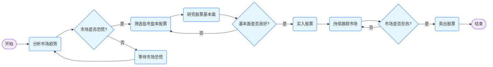

# 约翰聂夫的反向投资理念

> 关键词：约翰聂夫、反向投资理念、价值投资、低市盈率、市场趋势

> 摘要：本文深入探讨了约翰聂夫的反向投资理念。首先介绍了该理念产生的背景，包括目的、适用读者、文档结构和相关术语。接着阐述了反向投资理念的核心概念及其联系，用文本示意图和 Mermaid 流程图进行了清晰展示。详细讲解了核心算法原理，结合 Python 代码进行说明，同时给出了相关的数学模型和公式，并举例解释。通过项目实战，展示了在实际投资中如何运用该理念，包括开发环境搭建、源代码实现与解读。分析了反向投资理念的实际应用场景，推荐了学习该理念的工具和资源，包括书籍、在线课程、技术博客、开发工具、相关框架和库以及论文著作等。最后总结了该理念的未来发展趋势与挑战，解答了常见问题，并提供了扩展阅读和参考资料，帮助读者全面理解和应用约翰聂夫的反向投资理念。

## 1. 背景介绍 
### 1.1 目的和范围
约翰聂夫是投资界的传奇人物，他所倡导的反向投资理念在投资领域有着深远的影响。本文的目的在于深入剖析约翰聂夫的反向投资理念，详细阐述其核心思想、原理、操作方法以及实际应用场景。通过全面的介绍，帮助投资者更好地理解和运用这一理念，提升投资决策的科学性和有效性。范围涵盖了反向投资理念的理论基础、算法原理、数学模型、实际案例以及相关的学习资源和未来发展趋势等方面。

### 1.2 预期读者
本文预期读者主要包括各类投资者，无论是个人投资者还是专业投资机构的从业者。对于那些希望在投资领域获得更稳健收益、寻求独特投资策略的人来说，本文将提供有价值的参考。同时，金融专业的学生、研究人员也可以通过本文深入了解反向投资理念，丰富自己的知识体系和研究视角。

### 1.3 文档结构概述
本文将按照以下结构进行阐述：首先介绍反向投资理念的背景，包括目的、读者群体和文档结构；接着详细讲解核心概念及其联系，通过文本示意图和 Mermaid 流程图帮助读者理解；然后阐述核心算法原理，并结合 Python 代码进行说明；之后给出相关的数学模型和公式，并举例解释；通过项目实战展示该理念在实际投资中的应用；分析实际应用场景；推荐学习该理念的工具和资源；总结未来发展趋势与挑战；解答常见问题；最后提供扩展阅读和参考资料。

### 1.4 术语表
#### 1.4.1 核心术语定义
- **反向投资理念**：与市场主流趋势相反的投资策略，通过寻找被市场低估的股票进行投资，等待市场重新发现其价值，从而获得超额收益。
- **低市盈率**：市盈率（P/E）是股票价格与每股收益的比率，低市盈率意味着股票价格相对较低，可能被市场低估。
- **价值投资**：一种基于对股票内在价值的分析，寻找被低估的股票进行投资的策略。

#### 1.4.2 相关概念解释
- **市场趋势**：市场在一定时期内的总体走向，包括上涨、下跌或盘整等趋势。
- **股票估值**：对股票内在价值的评估，常用的方法包括市盈率法、市净率法等。
- **超额收益**：投资组合的实际收益超过市场平均收益的部分。

#### 1.4.3 缩略词列表
- **P/E**：市盈率（Price-to-Earnings Ratio）
- **P/B**：市净率（Price-to-Book Ratio）

## 2. 核心概念与联系 

### 核心概念原理
约翰聂夫的反向投资理念基于价值投资的基本原理。他认为市场并非总是有效的，会出现股票价格与内在价值背离的情况。当市场对某只股票过度悲观时，其价格会大幅下跌，导致市盈率等估值指标处于较低水平。此时，这些被市场忽视或抛弃的股票往往具有较高的投资价值。

反向投资者会通过深入研究和分析，寻找那些具有稳定业绩、良好基本面但因短期市场因素而被低估的股票。他们不随波逐流，敢于在市场恐慌时买入，在市场狂热时卖出，以获得长期的超额收益。

### 架构的文本示意图
```plaintext
反向投资理念
|-- 核心目标：寻找被低估股票获得超额收益
|-- 投资依据
|   |-- 低市盈率
|   |-- 稳定业绩
|   |-- 良好基本面
|-- 操作策略
|   |-- 市场恐慌时买入
|   |-- 市场狂热时卖出
|-- 风险控制
|   |-- 分散投资
|   |-- 深入研究
```

### Mermaid 流程图


## 3. 核心算法原理 & 具体操作步骤 

### 核心算法原理
反向投资理念的核心算法可以概括为以下几个步骤：
1. **筛选低市盈率股票**：通过计算股票的市盈率（P/E），筛选出市盈率低于市场平均水平的股票。市盈率的计算公式为：
$$P/E = \frac{股票价格}{每股收益}$$
2. **评估股票基本面**：对筛选出的低市盈率股票进行基本面分析，包括公司的财务状况、行业地位、竞争优势等。可以使用一些财务指标，如市净率（P/B）、净资产收益率（ROE）等进行评估。市净率的计算公式为：
$$P/B = \frac{股票价格}{每股净资产}$$
净资产收益率的计算公式为：
$$ROE = \frac{净利润}{净资产}$$
3. **判断市场趋势**：分析市场的整体趋势，判断市场是否处于恐慌或狂热状态。可以使用一些技术分析指标，如移动平均线、相对强弱指数（RSI）等进行判断。
4. **制定投资策略**：根据市场趋势和股票基本面的评估结果，制定投资策略。在市场恐慌时，买入基本面良好的低市盈率股票；在市场狂热时，卖出持有的股票。

### 具体操作步骤
以下是使用 Python 实现反向投资理念核心算法的具体代码：
```python
import pandas as pd
import yfinance as yf

# 步骤 1：筛选低市盈率股票
def screen_low_pe_stocks(tickers, market_pe):
    low_pe_stocks = []
    for ticker in tickers:
        try:
            stock = yf.Ticker(ticker)
            info = stock.info
            pe_ratio = info.get('trailingPE')
            if pe_ratio and pe_ratio < market_pe:
                low_pe_stocks.append(ticker)
        except Exception as e:
            print(f"Error getting info for {ticker}: {e}")
    return low_pe_stocks

# 步骤 2：评估股票基本面
def evaluate_fundamentals(tickers):
    good_fundamentals_stocks = []
    for ticker in tickers:
        try:
            stock = yf.Ticker(ticker)
            info = stock.info
            pb_ratio = info.get('priceToBook')
            roe = info.get('returnOnEquity')
            if pb_ratio and pb_ratio < 3 and roe and roe > 0.1:
                good_fundamentals_stocks.append(ticker)
        except Exception as e:
            print(f"Error evaluating fundamentals for {ticker}: {e}")
    return good_fundamentals_stocks

# 步骤 3：判断市场趋势（简单示例，使用移动平均线）
def judge_market_trend(market_ticker, short_window=50, long_window=200):
    data = yf.download(market_ticker, period='1y')
    short_ma = data['Close'].rolling(window=short_window).mean()
    long_ma = data['Close'].rolling(window=long_window).mean()
    last_short_ma = short_ma[-1]
    last_long_ma = long_ma[-1]
    if last_short_ma < last_long_ma:
        return '恐慌'
    else:
        return '狂热'

# 步骤 4：制定投资策略
def investment_strategy(tickers, market_ticker):
    market_trend = judge_market_trend(market_ticker)
    if market_trend == '恐慌':
        low_pe_stocks = screen_low_pe_stocks(tickers, market_pe=15)
        good_fundamentals_stocks = evaluate_fundamentals(low_pe_stocks)
        return good_fundamentals_stocks
    else:
        return []

# 示例使用
tickers = ['AAPL', 'MSFT', 'GOOG', 'AMZN', 'FB']
market_ticker = '^GSPC'
invest_stocks = investment_strategy(tickers, market_ticker)
print("建议投资的股票:", invest_stocks)
```
### 代码解释
1. **screen_low_pe_stocks 函数**：遍历输入的股票列表，使用 yfinance 库获取每只股票的市盈率信息，筛选出市盈率低于市场平均水平的股票。
2. **evaluate_fundamentals 函数**：对筛选出的低市盈率股票进行基本面分析，获取市净率和净资产收益率信息，筛选出市净率低于 3 且净资产收益率大于 0.1 的股票。
3. **judge_market_trend 函数**：使用 yfinance 库下载市场指数（如标普 500）的数据，计算短期和长期移动平均线，根据短期和长期移动平均线的关系判断市场趋势。
4. **investment_strategy 函数**：根据市场趋势调用上述函数，在市场恐慌时筛选出基本面良好的低市盈率股票，返回建议投资的股票列表。

## 4. 数学模型和公式 & 详细讲解 & 举例说明 

### 数学模型和公式
1. **市盈率（P/E）**
$$P/E = \frac{股票价格}{每股收益}$$
市盈率是衡量股票估值的重要指标之一。较低的市盈率意味着投资者可以以较低的价格购买到公司的每股收益，可能表示股票被低估。例如，某股票价格为 50 元，每股收益为 5 元，则其市盈率为 $P/E = \frac{50}{5} = 10$。

2. **市净率（P/B）**
$$P/B = \frac{股票价格}{每股净资产}$$
市净率反映了股票价格与每股净资产的关系。较低的市净率可能表示股票被低估，具有较高的投资价值。例如，某股票价格为 30 元，每股净资产为 10 元，则其市净率为 $P/B = \frac{30}{10} = 3$。

3. **净资产收益率（ROE）**
$$ROE = \frac{净利润}{净资产}$$
净资产收益率衡量了公司运用自有资本的效率。较高的净资产收益率表示公司能够有效地利用净资产创造利润。例如，某公司净利润为 1000 万元，净资产为 5000 万元，则其净资产收益率为 $ROE = \frac{1000}{5000} = 0.2$ 或 20%。

### 详细讲解
- **市盈率**：市盈率是投资者常用的估值指标之一，但需要注意的是，不同行业的市盈率水平可能存在较大差异。例如，科技行业的市盈率通常较高，而传统制造业的市盈率相对较低。因此，在使用市盈率进行选股时，需要结合行业平均水平进行比较。
- **市净率**：市净率主要用于评估公司的资产价值。对于一些重资产行业，如钢铁、煤炭等，市净率具有较高的参考价值。但对于一些轻资产行业，如互联网、软件等，市净率的参考意义相对较小。
- **净资产收益率**：净资产收益率反映了公司的盈利能力和股东权益的回报水平。较高的净资产收益率通常表示公司具有较强的竞争力和盈利能力。但需要注意的是，净资产收益率也可能受到会计政策、财务杠杆等因素的影响，因此需要综合考虑其他因素进行分析。

### 举例说明
假设我们要分析两只股票 A 和 B 的投资价值，相关数据如下：
| 股票 | 股票价格（元） | 每股收益（元） | 每股净资产（元） | 净利润（万元） | 净资产（万元） |
| ---- | ---- | ---- | ---- | ---- | ---- |
| A | 20 | 2 | 10 | 1000 | 5000 |
| B | 30 | 1.5 | 15 | 1200 | 8000 |

1. **计算市盈率**
股票 A 的市盈率：$P/E_A = \frac{20}{2} = 10$
股票 B 的市盈率：$P/E_B = \frac{30}{1.5} = 20$
从市盈率来看，股票 A 的估值相对较低。

2. **计算市净率**
股票 A 的市净率：$P/B_A = \frac{20}{10} = 2$
股票 B 的市净率：$P/B_B = \frac{30}{15} = 2$
两只股票的市净率相同。

3. **计算净资产收益率**
股票 A 的净资产收益率：$ROE_A = \frac{1000}{5000} = 0.2$ 或 20%
股票 B 的净资产收益率：$ROE_B = \frac{1200}{8000} = 0.15$ 或 15%
股票 A 的净资产收益率高于股票 B，说明股票 A 的盈利能力更强。

综合以上分析，股票 A 在市盈率和净资产收益率方面表现更优，可能具有更高的投资价值。

## 5. 项目实战：代码实际案例和详细解释说明 

### 5.1  开发环境搭建
为了运行上述反向投资理念的 Python 代码，需要搭建以下开发环境：
1. **Python 安装**：建议安装 Python 3.7 及以上版本。可以从 Python 官方网站（https://www.python.org/downloads/）下载安装包进行安装。
2. **依赖库安装**：使用以下命令安装所需的依赖库：
```sh
pip install pandas yfinance
```
- `pandas`：用于数据处理和分析。
- `yfinance`：用于获取股票市场数据。

### 5.2  源代码详细实现和代码解读
以下是完整的源代码及详细解读：
```python
import pandas as pd
import yfinance as yf

# 步骤 1：筛选低市盈率股票
def screen_low_pe_stocks(tickers, market_pe):
    low_pe_stocks = []
    for ticker in tickers:
        try:
            # 使用 yfinance 获取股票信息
            stock = yf.Ticker(ticker)
            info = stock.info
            # 获取股票的市盈率
            pe_ratio = info.get('trailingPE')
            if pe_ratio and pe_ratio < market_pe:
                # 如果市盈率低于市场平均水平，将股票添加到低市盈率股票列表中
                low_pe_stocks.append(ticker)
        except Exception as e:
            print(f"Error getting info for {ticker}: {e}")
    return low_pe_stocks

# 步骤 2：评估股票基本面
def evaluate_fundamentals(tickers):
    good_fundamentals_stocks = []
    for ticker in tickers:
        try:
            stock = yf.Ticker(ticker)
            info = stock.info
            # 获取股票的市净率
            pb_ratio = info.get('priceToBook')
            # 获取股票的净资产收益率
            roe = info.get('returnOnEquity')
            if pb_ratio and pb_ratio < 3 and roe and roe > 0.1:
                # 如果市净率低于 3 且净资产收益率大于 0.1，将股票添加到基本面良好的股票列表中
                good_fundamentals_stocks.append(ticker)
        except Exception as e:
            print(f"Error evaluating fundamentals for {ticker}: {e}")
    return good_fundamentals_stocks

# 步骤 3：判断市场趋势（简单示例，使用移动平均线）
def judge_market_trend(market_ticker, short_window=50, long_window=200):
    # 使用 yfinance 下载市场指数数据
    data = yf.download(market_ticker, period='1y')
    # 计算短期移动平均线
    short_ma = data['Close'].rolling(window=short_window).mean()
    # 计算长期移动平均线
    long_ma = data['Close'].rolling(window=long_window).mean()
    # 获取最后一个短期移动平均线值
    last_short_ma = short_ma[-1]
    # 获取最后一个长期移动平均线值
    last_long_ma = long_ma[-1]
    if last_short_ma < last_long_ma:
        return '恐慌'
    else:
        return '狂热'

# 步骤 4：制定投资策略
def investment_strategy(tickers, market_ticker):
    market_trend = judge_market_trend(market_ticker)
    if market_trend == '恐慌':
        # 在市场恐慌时，筛选低市盈率股票
        low_pe_stocks = screen_low_pe_stocks(tickers, market_pe=15)
        # 对低市盈率股票进行基本面评估
        good_fundamentals_stocks = evaluate_fundamentals(low_pe_stocks)
        return good_fundamentals_stocks
    else:
        return []

# 示例使用
tickers = ['AAPL', 'MSFT', 'GOOG', 'AMZN', 'FB']
market_ticker = '^GSPC'
invest_stocks = investment_strategy(tickers, market_ticker)
print("建议投资的股票:", invest_stocks)
```
### 代码解读与分析
- **整体逻辑**：代码实现了反向投资理念的核心算法，包括筛选低市盈率股票、评估股票基本面、判断市场趋势和制定投资策略四个步骤。
- **筛选低市盈率股票**：通过遍历输入的股票列表，使用 `yfinance` 库获取每只股票的市盈率信息，筛选出市盈率低于市场平均水平的股票。
- **评估股票基本面**：对筛选出的低市盈率股票进行基本面分析，获取市净率和净资产收益率信息，筛选出市净率低于 3 且净资产收益率大于 0.1 的股票。
- **判断市场趋势**：使用 `yfinance` 库下载市场指数（如标普 500）的数据，计算短期和长期移动平均线，根据短期和长期移动平均线的关系判断市场趋势。
- **制定投资策略**：根据市场趋势调用上述函数，在市场恐慌时筛选出基本面良好的低市盈率股票，返回建议投资的股票列表。

需要注意的是，这只是一个简单的示例，实际投资中还需要考虑更多因素，如宏观经济环境、行业发展趋势、公司治理等。

## 6. 实际应用场景 
约翰聂夫的反向投资理念在以下实际应用场景中具有重要价值：

### 熊市投资
在熊市中，市场情绪普遍悲观，股票价格大幅下跌，很多优质股票也会被错杀。此时，反向投资者可以运用该理念，寻找那些被市场低估的股票。例如，在 2008 年全球金融危机期间，市场大幅下跌，许多金融股的市盈率和市净率都降至历史低位。反向投资者如果能够在此时深入研究，挑选出那些基本面良好、具有长期投资价值的金融股，在市场复苏后将获得丰厚的回报。

### 行业困境投资
当某个行业面临短期困境时，如受到政策调控、技术变革或突发事件的影响，该行业的股票价格往往会受到打压。反向投资者可以关注这些行业，寻找其中被低估的优质企业。例如，近年来传统能源行业受到新能源发展的冲击，股价表现不佳。但对于一些具有资源优势、技术实力和成本控制能力的传统能源企业，反向投资者可以在其股价低迷时进行投资，等待行业复苏。

### 冷门股投资
市场上总有一些冷门股，由于缺乏市场关注，其股价长期处于低位。反向投资者可以通过深入研究，挖掘这些冷门股的潜在价值。例如，一些小型企业或新兴行业的企业，可能由于规模较小、知名度不高而被市场忽视。但如果这些企业具有独特的技术、产品或商业模式，反向投资者可以提前布局，分享企业成长带来的收益。

### 市场情绪极端时投资
当市场情绪达到极端状态时，如过度乐观或过度悲观，反向投资理念尤为有效。在市场过度乐观时，投资者往往会忽视风险，推高股票价格；而在市场过度悲观时，投资者则会恐慌抛售，导致股票价格过低。反向投资者可以在市场情绪极端时保持冷静，逆向操作，获取超额收益。

## 7. 工具和资源推荐
### 7.1 学习资源推荐
#### 7.1.1 书籍推荐
- 《约翰聂夫的成功投资》：这是约翰聂夫本人撰写的著作，详细阐述了他的反向投资理念和投资策略，是学习反向投资的经典书籍。
- 《聪明的投资者》：本杰明·格雷厄姆的经典著作，被誉为投资界的圣经，对价值投资和反向投资理念有深入的阐述。
- 《金融炼金术》：乔治·索罗斯的著作，介绍了他的反身性理论和投资实践，对反向投资有一定的启示作用。

#### 7.1.2 在线课程
- Coursera 上的“投资学原理”课程：由知名高校教授授课，涵盖了投资学的基本原理和方法，包括价值投资和反向投资等内容。
- Udemy 上的“股票投资实战技巧”课程：通过实际案例讲解股票投资的技巧和策略，对学习反向投资有一定的帮助。

#### 7.1.3 技术博客和网站
- 雪球网：国内知名的投资社区，汇聚了众多投资者的经验和观点，提供了丰富的股票分析和投资策略分享。
- Seeking Alpha：国外知名的金融投资网站，提供专业的股票分析、市场评论和投资建议，对学习反向投资有很大的参考价值。

### 7.2 开发工具框架推荐
#### 7.2.1 IDE和编辑器
- PyCharm：一款专业的 Python 集成开发环境，提供了丰富的代码编辑、调试和分析功能，适合开发反向投资相关的 Python 代码。
- Jupyter Notebook：一种交互式的开发环境，适合进行数据分析和代码演示，方便对反向投资算法进行验证和测试。

#### 7.2.2 调试和性能分析工具
- PDB：Python 自带的调试工具，可以帮助开发者逐行调试代码，查找问题所在。
- cProfile：Python 的性能分析工具，可以分析代码的运行时间和函数调用情况，帮助优化代码性能。

#### 7.2.3 相关框架和库
- Pandas：用于数据处理和分析的 Python 库，提供了高效的数据结构和数据分析工具，在反向投资中可以用于处理股票市场数据。
- NumPy：Python 的数值计算库，提供了高效的数组操作和数学函数，在反向投资算法中可以用于计算市盈率、市净率等指标。
- Scikit-learn：Python 的机器学习库，提供了丰富的机器学习算法和工具，在反向投资中可以用于构建预测模型和进行数据分析。

### 7.3 相关论文著作推荐
#### 7.3.1 经典论文
- “The Cross - Section of Expected Stock Returns”（《股票预期回报的横截面分析》）：该论文提出了影响股票回报的多种因素，对理解股票估值和投资策略有重要意义。
- “Value versus Growth: The International Evidence”（《价值投资与成长投资：国际证据》）：通过对国际市场的研究，比较了价值投资和成长投资的表现，为反向投资提供了理论支持。

#### 7.3.2 最新研究成果
- 近年来，学术界对反向投资理念的研究不断深入，涉及到行为金融学、机器学习等多个领域。可以关注顶级金融学术期刊，如《Journal of Finance》《Review of Financial Studies》等，获取最新的研究成果。

#### 7.3.3 应用案例分析
- 一些金融研究机构和投资公司会发布反向投资的应用案例分析报告，可以关注这些报告，了解反向投资在实际中的应用效果和操作方法。

## 8. 总结：未来发展趋势与挑战
### 未来发展趋势
- **与科技融合**：随着科技的不断发展，反向投资理念将与大数据、人工智能等技术深度融合。通过大数据分析，可以更全面地了解市场信息和投资者情绪，挖掘更多被低估的股票；利用人工智能算法，可以构建更精准的投资模型，提高投资决策的科学性和效率。
- **全球化投资**：随着全球经济一体化的发展，反向投资将不再局限于国内市场，投资者将更加关注全球范围内的投资机会。通过在不同国家和地区寻找被低估的股票，可以实现投资组合的多元化，降低风险。
- **社会责任投资**：未来，投资者将更加注重企业的社会责任和可持续发展。反向投资理念也将融入社会责任投资的元素，寻找那些具有良好社会形象、注重环境保护和员工福利的被低估企业进行投资。

### 挑战
- **市场有效性增强**：随着市场信息的传播速度加快和投资者素质的提高，市场的有效性可能会不断增强。这意味着股票价格更能反映其内在价值，寻找被低估股票的难度将加大。反向投资者需要不断提高自己的分析能力和研究水平，才能在市场中找到投资机会。
- **黑天鹅事件影响**：黑天鹅事件是指那些难以预测、具有重大影响的突发事件，如自然灾害、政治危机、疫情等。这些事件可能会导致市场剧烈波动，打乱反向投资的策略。投资者需要具备应对黑天鹅事件的能力，制定合理的风险控制措施。
- **投资者情绪难以把握**：反向投资需要准确把握市场情绪的变化，但投资者情绪受到多种因素的影响，如宏观经济环境、政策变化、媒体报道等，难以准确预测和把握。这给反向投资带来了一定的挑战。

## 9. 附录：常见问题与解答
### 问题 1：反向投资是否适合所有投资者？
反向投资并不适合所有投资者。它需要投资者具备较强的分析能力、耐心和独立思考能力。对于缺乏投资经验和专业知识的投资者来说，反向投资可能存在较大的风险。此外，反向投资需要投资者能够承受短期的市场波动，因此更适合长期投资者。

### 问题 2：如何判断股票是否被低估？
判断股票是否被低估需要综合考虑多个因素，如市盈率、市净率、净资产收益率等估值指标，以及公司的财务状况、行业地位、竞争优势等基本面因素。同时，还需要结合市场趋势和投资者情绪进行分析。不能仅仅依靠单一指标来判断股票是否被低估。

### 问题 3：反向投资的风险如何控制？
反向投资的风险控制可以从以下几个方面入手：
- **分散投资**：通过投资多只不同行业、不同类型的股票，降低单一股票的风险。
- **深入研究**：在投资前对公司进行深入的研究和分析，了解其基本面和发展前景，避免投资那些存在重大问题的公司。
- **设置止损点**：在投资过程中设置合理的止损点，当股票价格下跌到一定程度时及时卖出，避免损失进一步扩大。

### 问题 4：反向投资与价值投资有什么区别和联系？
反向投资和价值投资都强调寻找被低估的股票进行投资，但它们也存在一些区别。价值投资更注重公司的内在价值，通过对公司基本面的分析来确定其价值；而反向投资更注重市场情绪和趋势的反向操作，在市场恐慌时买入，在市场狂热时卖出。两者的联系在于，它们都基于股票价格与内在价值的背离，目标都是获得超额收益。

## 10. 扩展阅读 & 参考资料
### 扩展阅读
- 《非理性繁荣》：罗伯特·席勒的著作，探讨了市场泡沫和投资者非理性行为，对理解反向投资的市场环境有一定的帮助。
- 《投资最重要的事》：霍华德·马克斯的著作，分享了他的投资经验和哲学，对学习反向投资有一定的启示。

### 参考资料
- 约翰聂夫相关的访谈和演讲记录
- 金融学术期刊上关于反向投资的研究论文
- 各大金融网站和投资社区上的相关文章和讨论

作者：AI天才研究院/AI Genius Institute & 禅与计算机程序设计艺术 /Zen And The Art of Computer Programming