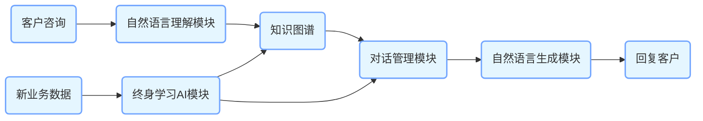

# 终身学习AI在智能客服系统中的实时优化

> 关键词：终身学习AI、智能客服系统、实时优化、机器学习、自然语言处理

> 摘要：本文深入探讨了终身学习AI在智能客服系统中的实时优化应用。首先介绍了相关背景，包括目的范围、预期读者等内容。接着阐述了终身学习AI和智能客服系统的核心概念与联系，通过算法原理、数学模型等方面进行详细剖析。结合项目实战给出具体的代码案例及解释，分析其在实际应用场景中的表现。最后推荐了相关的工具和资源，总结了未来发展趋势与挑战，并对常见问题进行解答，为智能客服系统利用终身学习AI进行实时优化提供全面的技术参考。

## 1. 背景介绍 
### 1.1 目的和范围
智能客服系统在现代企业服务中扮演着至关重要的角色，它能够高效地处理大量客户咨询，提升客户满意度和企业运营效率。然而，传统的智能客服系统往往存在知识更新不及时、无法适应新的业务场景和客户需求等问题。终身学习AI作为一种新兴的人工智能技术，具有持续学习和适应新数据的能力，将其应用于智能客服系统中进行实时优化，可以有效解决上述问题。

本文的范围涵盖了终身学习AI的基本原理、在智能客服系统中的应用架构、核心算法、数学模型，以及通过实际项目案例展示如何实现实时优化，同时探讨其在不同应用场景中的表现和未来发展趋势。

### 1.2 预期读者
本文预期读者包括人工智能领域的研究人员、智能客服系统的开发者、软件架构师、企业中负责客户服务系统规划和管理的人员，以及对终身学习AI和智能客服系统感兴趣的技术爱好者。

### 1.3 文档结构概述
本文将按照以下结构进行阐述：首先介绍相关背景知识，包括目的、读者和文档结构等；接着深入探讨终身学习AI和智能客服系统的核心概念及其联系；然后详细讲解核心算法原理和具体操作步骤，通过Python代码进行阐述；再介绍相关的数学模型和公式，并举例说明；之后通过项目实战展示代码实际案例和详细解释；分析实际应用场景；推荐相关的工具和资源；最后总结未来发展趋势与挑战，解答常见问题并提供扩展阅读和参考资料。

### 1.4 术语表
#### 1.4.1 核心术语定义
- **终身学习AI（Lifelong Learning AI）**：一种能够持续从新数据中学习，不断更新和扩展自身知识和技能，且能在学习新任务时保留以往学习成果的人工智能技术。
- **智能客服系统（Intelligent Customer Service System）**：利用人工智能技术，如自然语言处理、机器学习等，自动回答客户咨询、解决客户问题的系统。
- **实时优化（Real - time Optimization）**：在系统运行过程中，根据实时数据和反馈信息，及时调整系统参数和策略，以提高系统性能和效果的过程。

#### 1.4.2 相关概念解释
- **自然语言处理（Natural Language Processing, NLP）**：是人工智能领域的一个重要分支，主要研究如何让计算机理解、处理和生成人类语言，包括文本分类、情感分析、机器翻译等任务。
- **机器学习（Machine Learning）**：是一门多领域交叉学科，涉及概率论、统计学、逼近论、凸分析、算法复杂度理论等多门学科。它专门研究计算机怎样模拟或实现人类的学习行为，以获取新的知识或技能，重新组织已有的知识结构使之不断改善自身的性能。

#### 1.4.3 缩略词列表
- **AI**：Artificial Intelligence，人工智能
- **NLP**：Natural Language Processing，自然语言处理
- **ML**：Machine Learning，机器学习

## 2. 核心概念与联系 
### 2.1 终身学习AI的原理
终身学习AI的核心目标是让人工智能系统能够像人类一样，在整个生命周期中持续学习新知识，同时保留和利用以往学习的经验。传统的机器学习模型通常是针对单一任务进行训练，当遇到新任务时，需要重新收集数据并进行训练，这不仅耗费大量时间和资源，还可能导致遗忘之前学习的知识，即“灾难性遗忘”问题。

终身学习AI通过多种策略来解决这些问题，例如基于记忆的方法，系统会保留一部分过去的训练数据或模型参数，在学习新任务时参考这些信息，避免遗忘；基于正则化的方法，通过在损失函数中添加额外的约束项，鼓励模型在学习新任务时尽量保持对旧任务的性能。

### 2.2 智能客服系统的架构
智能客服系统一般由以下几个主要部分组成：
- **用户界面**：提供客户与系统交互的接口，如网页、APP、聊天窗口等。
- **自然语言理解（NLU）模块**：对客户输入的自然语言进行解析，提取关键信息，理解客户意图。
- **知识图谱**：存储企业的业务知识、常见问题及答案等信息，为客服系统提供知识支持。
- **对话管理模块**：根据客户意图和历史对话记录，生成合适的回复，并管理对话流程。
- **自然语言生成（NLG）模块**：将系统的回复信息转换为自然语言文本，返回给客户。

### 2.3 终身学习AI与智能客服系统的联系
将终身学习AI应用于智能客服系统中，可以实现系统的实时优化。例如，当出现新的业务场景或客户问题时，智能客服系统可以利用终身学习AI技术，实时学习新的知识和模式，更新自身的回答策略，从而更好地满足客户需求。同时，终身学习AI可以帮助智能客服系统避免因业务变化而导致的知识过时问题，保持系统的准确性和有效性。

以下是它们联系的Mermaid流程图：


## 3. 核心算法原理 & 具体操作步骤 
### 3.1 基于记忆重放的终身学习算法原理
记忆重放是一种常见的终身学习策略，其基本思想是在学习新任务时，随机抽取一部分过去的训练数据进行重放，让模型在学习新任务的同时回顾旧知识，从而减轻灾难性遗忘。

以下是基于记忆重放的终身学习算法的Python代码示例：
```python
import numpy as np
import torch
import torch.nn as nn
import torch.optim as optim

# 定义一个简单的神经网络模型
class SimpleNet(nn.Module):
    def __init__(self, input_size, hidden_size, output_size):
        super(SimpleNet, self).__init__()
        self.fc1 = nn.Linear(input_size, hidden_size)
        self.relu = nn.ReLU()
        self.fc2 = nn.Linear(hidden_size, output_size)

    def forward(self, x):
        out = self.fc1(x)
        out = self.relu(out)
        out = self.fc2(out)
        return out

# 初始化模型、优化器和损失函数
input_size = 10
hidden_size = 20
output_size = 5
model = SimpleNet(input_size, hidden_size, output_size)
optimizer = optim.Adam(model.parameters(), lr=0.001)
criterion = nn.CrossEntropyLoss()

# 模拟旧任务数据
old_data = torch.randn(100, input_size)
old_labels = torch.randint(0, output_size, (100,))

# 模拟新任务数据
new_data = torch.randn(50, input_size)
new_labels = torch.randint(0, output_size, (50,))

# 记忆重放比例
replay_ratio = 0.2

# 训练过程
num_epochs = 10
for epoch in range(num_epochs):
    # 随机选择一部分旧数据进行重放
    replay_indices = np.random.choice(len(old_data), int(replay_ratio * len(new_data)))
    replay_data = old_data[replay_indices]
    replay_labels = old_labels[replay_indices]

    # 合并新数据和重放数据
    combined_data = torch.cat((new_data, replay_data), dim=0)
    combined_labels = torch.cat((new_labels, replay_labels), dim=0)

    # 前向传播
    outputs = model(combined_data)
    loss = criterion(outputs, combined_labels)

    # 反向传播和优化
    optimizer.zero_grad()
    loss.backward()
    optimizer.step()

    if (epoch + 1) % 1 == 0:
        print(f'Epoch [{epoch + 1}/{num_epochs}], Loss: {loss.item():.4f}')
```
### 3.2 具体操作步骤
1. **数据准备**：收集和整理智能客服系统中的历史对话数据作为旧任务数据，同时准备新出现的业务场景或客户问题数据作为新任务数据。
2. **模型初始化**：选择合适的机器学习模型，如神经网络，对其进行初始化。
3. **训练过程**：在每个训练周期中，按照一定比例随机抽取旧任务数据进行重放，将重放数据和新任务数据合并。
4. **前向传播和损失计算**：将合并后的数据输入到模型中进行前向传播，计算损失函数。
5. **反向传播和优化**：根据损失函数进行反向传播，更新模型的参数。
6. **重复训练**：重复上述步骤，直到模型收敛或达到预定的训练次数。

## 4. 数学模型和公式 & 详细讲解 & 举例说明 
### 4.1 损失函数
在基于记忆重放的终身学习算法中，常用的损失函数是交叉熵损失函数。对于一个分类问题，假设模型的输出为 $\hat{y}$，真实标签为 $y$，交叉熵损失函数的定义如下：
$$L(y,\hat{y}) = -\sum_{i=1}^{C}y_{i}\log(\hat{y}_{i})$$
其中，$C$ 是类别数，$y_{i}$ 是真实标签的第 $i$ 个分量，$\hat{y}_{i}$ 是模型输出的第 $i$ 个分量。

### 4.2 详细讲解
交叉熵损失函数衡量了模型输出的概率分布与真实标签的概率分布之间的差异。当模型的输出与真实标签越接近时，损失函数的值越小；反之，损失函数的值越大。在训练过程中，我们的目标是通过调整模型的参数，使得损失函数的值最小化。

### 4.3 举例说明
假设我们有一个三分类问题，真实标签 $y = [1, 0, 0]$，模型的输出 $\hat{y} = [0.8, 0.1, 0.1]$。根据交叉熵损失函数的公式，我们可以计算出损失值：
$$L(y,\hat{y}) = -(1\times\log(0.8)+0\times\log(0.1)+0\times\log(0.1))\approx - \log(0.8)\approx 0.223$$

## 5. 项目实战：代码实际案例和详细解释说明 
### 5.1  开发环境搭建
- **操作系统**：推荐使用Ubuntu 18.04或更高版本，也可以使用Windows 10或macOS。
- **Python版本**：Python 3.7或更高版本。
- **深度学习框架**：PyTorch 1.7或更高版本。
- **自然语言处理库**：NLTK、SpaCy等。

安装所需库的命令如下：
```bash
pip install torch torchvision
pip install nltk spacy
python -m spacy download en_core_web_sm
```

### 5.2  源代码详细实现和代码解读
以下是一个简单的智能客服系统结合终身学习AI进行实时优化的代码示例：
```python
import torch
import torch.nn as nn
import torch.optim as optim
import nltk
from nltk.tokenize import word_tokenize
from collections import Counter
import numpy as np

# 数据预处理
nltk.download('punkt')

# 定义一个简单的文本分类模型
class TextClassifier(nn.Module):
    def __init__(self, vocab_size, embedding_dim, hidden_dim, output_dim):
        super(TextClassifier, self).__init__()
        self.embedding = nn.Embedding(vocab_size, embedding_dim)
        self.fc1 = nn.Linear(embedding_dim, hidden_dim)
        self.relu = nn.ReLU()
        self.fc2 = nn.Linear(hidden_dim, output_dim)

    def forward(self, x):
        embedded = self.embedding(x)
        pooled = torch.mean(embedded, dim=1)
        out = self.fc1(pooled)
        out = self.relu(out)
        out = self.fc2(out)
        return out

# 数据处理函数
def preprocess_text(texts):
    all_tokens = []
    for text in texts:
        tokens = word_tokenize(text.lower())
        all_tokens.extend(tokens)
    word_counts = Counter(all_tokens)
    vocab = sorted(word_counts, key=word_counts.get, reverse=True)
    word_to_idx = {word: idx for idx, word in enumerate(vocab)}
    idx_to_word = {idx: word for idx, word in enumerate(vocab)}
    data = []
    for text in texts:
        tokens = word_tokenize(text.lower())
        indices = [word_to_idx[word] for word in tokens if word in word_to_idx]
        data.append(indices)
    return data, word_to_idx, idx_to_word

# 模拟旧任务数据
old_texts = ["How can I reset my password?", "What is the shipping cost?"]
old_labels = [0, 1]

# 模拟新任务数据
new_texts = ["When will my order arrive?", "How do I track my order?"]
new_labels = [2, 3]

# 数据预处理
old_data, word_to_idx, idx_to_word = preprocess_text(old_texts)
new_data, _, _ = preprocess_text(new_texts)

# 填充数据
max_length = max([len(seq) for seq in old_data + new_data])
old_data = [seq + [0] * (max_length - len(seq)) for seq in old_data]
new_data = [seq + [0] * (max_length - len(seq)) for seq in new_data]

# 转换为张量
old_data = torch.tensor(old_data)
old_labels = torch.tensor(old_labels)
new_data = torch.tensor(new_data)
new_labels = torch.tensor(new_labels)

# 初始化模型、优化器和损失函数
vocab_size = len(word_to_idx)
embedding_dim = 100
hidden_dim = 200
output_dim = 4
model = TextClassifier(vocab_size, embedding_dim, hidden_dim, output_dim)
optimizer = optim.Adam(model.parameters(), lr=0.001)
criterion = nn.CrossEntropyLoss()

# 记忆重放比例
replay_ratio = 0.2

# 训练过程
num_epochs = 10
for epoch in range(num_epochs):
    # 随机选择一部分旧数据进行重放
    replay_indices = np.random.choice(len(old_data), int(replay_ratio * len(new_data)))
    replay_data = old_data[replay_indices]
    replay_labels = old_labels[replay_indices]

    # 合并新数据和重放数据
    combined_data = torch.cat((new_data, replay_data), dim=0)
    combined_labels = torch.cat((new_labels, replay_labels), dim=0)

    # 前向传播
    outputs = model(combined_data)
    loss = criterion(outputs, combined_labels)

    # 反向传播和优化
    optimizer.zero_grad()
    loss.backward()
    optimizer.step()

    if (epoch + 1) % 1 == 0:
        print(f'Epoch [{epoch + 1}/{num_epochs}], Loss: {loss.item():.4f}')
```
### 5.3  代码解读与分析
1. **数据预处理**：使用NLTK库对文本数据进行分词处理，统计词频，构建词汇表，并将文本转换为对应的索引序列。
2. **模型定义**：定义了一个简单的文本分类模型，包括嵌入层、全连接层和激活函数。
3. **训练过程**：在每个训练周期中，按照记忆重放比例随机抽取旧数据进行重放，将重放数据和新数据合并后输入到模型中进行训练。
4. **损失计算和优化**：使用交叉熵损失函数计算损失，通过反向传播更新模型的参数。

## 6. 实际应用场景 
### 6.1 电商客服
在电商领域，客户的咨询问题可能涉及商品信息、订单状态、退换货政策等多个方面。随着业务的发展，新的商品上线、促销活动推出等都会带来新的客户问题。终身学习AI可以帮助智能客服系统实时学习这些新的知识，快速准确地回答客户的咨询，提高客户满意度。

### 6.2 金融客服
金融行业的政策法规、产品信息等变化频繁，客户的咨询问题也较为复杂。智能客服系统利用终身学习AI可以实时跟踪这些变化，及时更新知识和回答策略，为客户提供准确的金融信息和服务。

### 6.3 电信客服
电信运营商的业务套餐、优惠活动等不断更新，客户对网络故障、话费查询等问题的咨询也时有发生。终身学习AI可以让智能客服系统实时适应这些变化，更好地满足客户的需求。

## 7. 工具和资源推荐
### 7.1 学习资源推荐
#### 7.1.1 书籍推荐
- 《深度学习》（Deep Learning）：由Ian Goodfellow、Yoshua Bengio和Aaron Courville合著，是深度学习领域的经典教材，全面介绍了深度学习的基本原理、算法和应用。
- 《Python自然语言处理》（Natural Language Processing with Python）：由Steven Bird、Ewan Klein和Edward Loper编写，详细介绍了使用Python进行自然语言处理的方法和技术。

#### 7.1.2 在线课程
- Coursera上的“深度学习专项课程”（Deep Learning Specialization）：由Andrew Ng教授授课，系统地介绍了深度学习的各个方面。
- edX上的“自然语言处理基础”（Foundations of Natural Language Processing）：提供了自然语言处理的基础知识和实践经验。

#### 7.1.3 技术博客和网站
- Medium上的Towards Data Science：汇集了大量关于人工智能、机器学习、数据科学等领域的技术文章和案例分析。
- AI开源社区：提供了丰富的人工智能开源项目和技术文档。

### 7.2 开发工具框架推荐
#### 7.2.1 IDE和编辑器
- PyCharm：一款专业的Python集成开发环境，提供了丰富的代码编辑、调试和项目管理功能。
- Visual Studio Code：一款轻量级的代码编辑器，支持多种编程语言，有丰富的插件扩展功能。

#### 7.2.2 调试和性能分析工具
- PyTorch Profiler：用于分析PyTorch模型的性能，帮助开发者找出性能瓶颈。
- TensorBoard：可以可视化深度学习模型的训练过程和性能指标。

#### 7.2.3 相关框架和库
- PyTorch：一个开源的深度学习框架，提供了丰富的神经网络模型和优化算法。
- Hugging Face Transformers：一个用于自然语言处理的开源库，提供了预训练的语言模型和工具。

### 7.3 相关论文著作推荐
#### 7.3.1 经典论文
- "Overcoming catastrophic forgetting in neural networks"：提出了克服神经网络灾难性遗忘问题的方法。
- "Lifelong Machine Learning"：对终身学习机器学习的概念和方法进行了深入探讨。

#### 7.3.2 最新研究成果
- 关注顶级人工智能会议，如NeurIPS、ICML、ACL等，这些会议上的最新研究成果反映了终身学习AI和智能客服系统领域的前沿动态。

#### 7.3.3 应用案例分析
- 可以参考一些企业的技术博客和研究报告，了解终身学习AI在智能客服系统中的实际应用案例和效果。

## 8. 总结：未来发展趋势与挑战
### 8.1 未来发展趋势
- **多模态融合**：未来的智能客服系统可能会融合语音、图像等多模态信息，提供更加丰富和自然的交互体验。终身学习AI可以帮助系统实时学习和适应这些多模态数据的变化。
- **个性化服务**：根据客户的历史行为和偏好，为客户提供个性化的服务和回答。终身学习AI可以不断学习客户的个性化信息，提高服务的精准度。
- **与其他技术的结合**：如区块链、物联网等技术的结合，为智能客服系统带来更多的应用场景和创新机会。

### 8.2 挑战
- **数据隐私和安全**：终身学习AI需要不断收集和学习新的数据，这可能会涉及到客户的隐私和数据安全问题。如何在保证数据安全的前提下，实现有效的终身学习是一个重要的挑战。
- **计算资源和效率**：终身学习AI的训练和优化过程通常需要大量的计算资源和时间。如何提高计算效率，降低资源消耗是需要解决的问题。
- **模型的可解释性**：随着人工智能模型的复杂度不断增加，模型的可解释性变得越来越重要。如何让终身学习AI模型的决策过程和结果具有可解释性，是未来研究的一个方向。

## 9. 附录：常见问题与解答
### 9.1 终身学习AI会导致模型过拟合吗？
终身学习AI本身的目的是避免过拟合和灾难性遗忘。通过记忆重放等策略，模型可以在学习新任务时回顾旧知识，保持对不同任务的泛化能力。但是，如果重放数据的选择不合理或训练参数设置不当，仍然可能会出现过拟合的问题。

### 9.2 如何选择合适的记忆重放比例？
记忆重放比例的选择需要根据具体的任务和数据情况进行调整。一般来说，可以通过实验的方法，尝试不同的重放比例，观察模型在旧任务和新任务上的性能，选择性能最优的比例。

### 9.3 终身学习AI在智能客服系统中的实时优化效果如何评估？
可以通过以下几个指标来评估：客户满意度、问题解决率、回答准确率、响应时间等。同时，可以使用一些机器学习的评估指标，如准确率、召回率、F1值等，对模型的分类性能进行评估。

## 10. 扩展阅读 & 参考资料
- Goodfellow, I., Bengio, Y., & Courville, A. (2016). Deep Learning. MIT Press.
- Bird, S., Klein, E., & Loper, E. (2009). Natural Language Processing with Python. O'Reilly Media.
- Kirkpatrick, J., Pascanu, R., Rabinowitz, N., et al. (2017). Overcoming catastrophic forgetting in neural networks. Proceedings of the national academy of sciences.
- Thrun, S., & Mitchell, T. (1995). Lifelong Machine Learning. Carnegie Mellon University.

作者：AI天才研究院/AI Genius Institute & 禅与计算机程序设计艺术 /Zen And The Art of Computer Programming