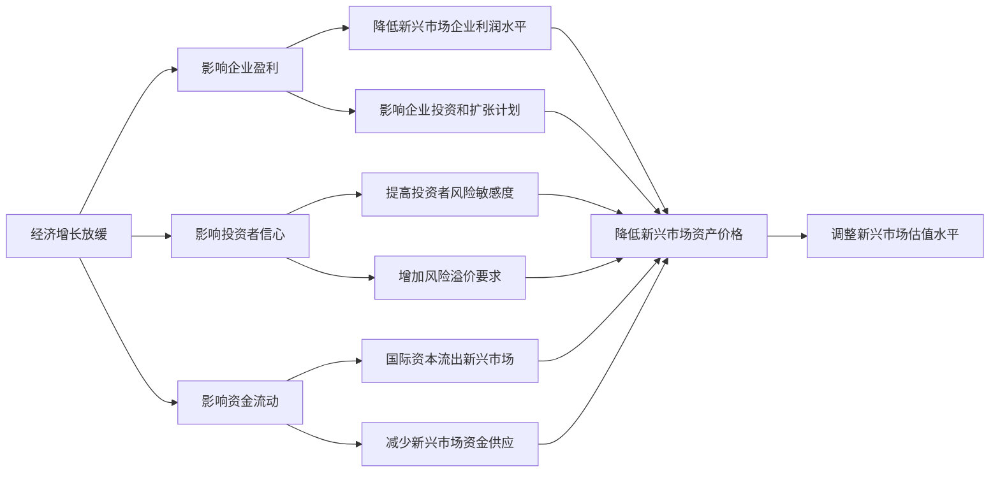

# 经济增长放缓对新兴市场估值的潜在影响

> 关键词：经济增长放缓、新兴市场、市场估值、潜在影响、金融市场

> 摘要：本文旨在深入探讨经济增长放缓对新兴市场估值的潜在影响。通过对新兴市场的背景介绍，明确研究目的和范围，界定相关术语。详细阐述核心概念及其联系，剖析影响新兴市场估值的核心算法原理，并给出具体操作步骤。运用数学模型和公式进行定量分析并举例说明。结合项目实战案例，展示代码实现和解读。探讨经济增长放缓下新兴市场估值变化在不同实际应用场景中的体现。推荐相关学习资源、开发工具框架以及论文著作。最后总结未来发展趋势与挑战，解答常见问题并提供扩展阅读和参考资料，帮助读者全面理解经济增长放缓与新兴市场估值之间的复杂关系。

## 1. 背景介绍 
### 1.1 目的和范围
本研究的主要目的是全面分析经济增长放缓对新兴市场估值所产生的潜在影响。新兴市场在全球经济格局中占据着越来越重要的地位，其经济发展和市场表现备受关注。经济增长放缓是一个全球性的经济现象，对新兴市场的影响具有独特性和复杂性。通过本研究，我们希望能够揭示这种影响的内在机制和外在表现，为投资者、政策制定者和相关研究人员提供有价值的参考。

研究范围涵盖了全球主要的新兴市场，包括亚洲、拉丁美洲、非洲和东欧等地区的新兴经济体。我们将综合考虑宏观经济指标、金融市场数据、行业动态等多方面因素，从多个维度分析经济增长放缓对新兴市场估值的影响。

### 1.2 预期读者
本文的预期读者包括但不限于以下几类人群：
- 投资者：无论是个人投资者还是机构投资者，都对新兴市场的投资机会和风险密切关注。了解经济增长放缓对新兴市场估值的影响，有助于他们做出更明智的投资决策。
- 政策制定者：新兴市场国家的政策制定者需要根据经济形势的变化制定相应的经济政策。本研究可以为他们提供理论支持和实践参考，帮助他们更好地应对经济增长放缓带来的挑战。
- 金融分析师和研究人员：专业的金融分析师和研究人员可以从本文中获取有关新兴市场估值的最新研究成果和分析方法，进一步深入研究相关领域的问题。
- 经济学爱好者：对经济学和金融市场感兴趣的普通读者可以通过本文了解经济增长放缓与新兴市场估值之间的关系，拓宽自己的知识面。

### 1.3 文档结构概述
本文将按照以下结构展开：
- 核心概念与联系：介绍新兴市场、经济增长放缓和市场估值等核心概念，并阐述它们之间的相互关系。
- 核心算法原理 & 具体操作步骤：详细讲解用于分析经济增长放缓对新兴市场估值影响的核心算法原理，并给出具体的操作步骤。
- 数学模型和公式 & 详细讲解 & 举例说明：运用数学模型和公式对经济增长放缓与新兴市场估值之间的关系进行定量分析，并通过具体例子进行说明。
- 项目实战：代码实际案例和详细解释说明：通过实际的项目案例，展示如何运用上述算法和模型进行数据分析和预测，并对代码进行详细解读。
- 实际应用场景：探讨经济增长放缓对新兴市场估值的影响在不同实际应用场景中的体现，如投资决策、政策制定等。
- 工具和资源推荐：推荐相关的学习资源、开发工具框架以及论文著作，帮助读者进一步深入研究相关领域的问题。
- 总结：未来发展趋势与挑战：总结经济增长放缓对新兴市场估值的影响，并展望未来的发展趋势和面临的挑战。
- 附录：常见问题与解答：解答读者在阅读过程中可能遇到的常见问题。
- 扩展阅读 & 参考资料：提供相关的扩展阅读材料和参考资料，方便读者进一步深入研究。

### 1.4 术语表
#### 1.4.1 核心术语定义
- 新兴市场：指那些经济发展较快、市场潜力较大，但在金融市场成熟度、制度建设等方面相对发达国家仍有差距的国家和地区的市场。
- 经济增长放缓：指一个国家或地区的经济增长速度逐渐下降，通常表现为国内生产总值（GDP）增长率的降低。
- 市场估值：指对市场中资产（如股票、债券、房地产等）的价值进行评估的过程和结果。市场估值通常采用多种方法，如市盈率、市净率、现金流折现法等。

#### 1.4.2 相关概念解释
- 宏观经济指标：反映一个国家或地区宏观经济状况的统计指标，如GDP、通货膨胀率、失业率、利率等。这些指标对新兴市场的经济增长和市场估值具有重要影响。
- 金融市场：指资金融通的场所，包括股票市场、债券市场、外汇市场等。金融市场的表现直接影响新兴市场的估值水平。
- 风险溢价：指投资者为了承担额外的风险而要求获得的额外回报。在经济增长放缓的情况下，投资者对新兴市场的风险溢价要求可能会提高，从而影响新兴市场的估值。

#### 1.4.3 缩略词列表
- GDP：国内生产总值（Gross Domestic Product）
- P/E：市盈率（Price-to-Earnings Ratio）
- P/B：市净率（Price-to-Book Ratio）
- DCF：现金流折现法（Discounted Cash Flow）

## 2. 核心概念与联系 

### 核心概念原理
#### 新兴市场
新兴市场是全球经济增长的重要驱动力之一。这些市场通常具有较高的经济增长率、丰富的自然资源和庞大的消费市场。然而，新兴市场也面临着一些挑战，如政治不稳定、金融市场不成熟、法律法规不完善等。新兴市场的发展受到多种因素的影响，包括国内政策、国际经济环境、全球资本流动等。

#### 经济增长放缓
经济增长放缓是一个复杂的经济现象，可能由多种因素引起，如全球经济衰退、国内需求不足、贸易摩擦、货币政策收紧等。经济增长放缓会对新兴市场的各个方面产生影响，包括企业盈利、就业状况、财政收入等。

#### 市场估值
市场估值是投资者评估资产价值的重要依据。常见的市场估值方法包括市盈率（P/E）、市净率（P/B）、现金流折现法（DCF）等。市盈率是指股票价格与每股盈利的比率，反映了投资者对企业未来盈利的预期。市净率是指股票价格与每股净资产的比率，反映了股票的相对估值水平。现金流折现法是通过预测企业未来的现金流，并将其折现到当前时点，来评估企业的内在价值。

### 架构的文本示意图
```plaintext
经济增长放缓
|
|-- 影响企业盈利
|   |
|   |-- 降低新兴市场企业的利润水平
|   |-- 影响企业的投资和扩张计划
|
|-- 影响投资者信心
|   |
|   |-- 提高投资者对风险的敏感度
|   |-- 增加投资者对新兴市场的风险溢价要求
|
|-- 影响资金流动
|   |
|   |-- 导致国际资本从新兴市场流出
|   |-- 减少新兴市场的资金供应
|
|-- 最终影响新兴市场估值
|   |
|   |-- 降低新兴市场股票、债券等资产的价格
|   |-- 调整新兴市场的估值水平
```

### Mermaid 流程图


## 3. 核心算法原理 & 具体操作步骤 

### 核心算法原理
我们可以通过构建一个简单的模型来分析经济增长放缓对新兴市场估值的影响。假设新兴市场的估值主要由企业盈利和投资者要求的回报率决定。企业盈利受到经济增长的影响，而投资者要求的回报率则受到风险溢价的影响。

设 $V$ 为新兴市场的估值，$E$ 为企业盈利，$r$ 为投资者要求的回报率。则有：

$V = \frac{E}{r}$

经济增长放缓会导致企业盈利 $E$ 下降，同时由于投资者对风险的担忧增加，会提高风险溢价，从而使投资者要求的回报率 $r$ 上升。因此，经济增长放缓会使新兴市场的估值 $V$ 下降。

### 具体操作步骤
#### 步骤 1：收集数据
收集新兴市场的宏观经济数据，如 GDP 增长率、通货膨胀率、利率等；企业财务数据，如营业收入、净利润等；以及金融市场数据，如股票价格、债券收益率等。

#### 步骤 2：计算企业盈利
根据收集到的企业财务数据，计算企业的盈利水平。可以采用净利润、每股盈利等指标来衡量企业盈利。

#### 步骤 3：计算投资者要求的回报率
投资者要求的回报率可以通过资本资产定价模型（CAPM）来计算：

$r = R_f + \beta \times (R_m - R_f)$

其中，$R_f$ 为无风险利率，$\beta$ 为资产的系统性风险系数，$R_m$ 为市场组合的预期收益率。

#### 步骤 4：计算新兴市场估值
根据上述公式 $V = \frac{E}{r}$，计算新兴市场的估值。

#### 步骤 5：分析经济增长放缓的影响
通过比较不同经济增长情景下的企业盈利和投资者要求的回报率，分析经济增长放缓对新兴市场估值的影响。

### Python 源代码实现
```python
import numpy as np

# 步骤 1：收集数据（假设已经收集好）
# 企业盈利
E = 100  # 假设企业盈利为 100
# 无风险利率
R_f = 0.03  # 假设无风险利率为 3%
# 市场组合的预期收益率
R_m = 0.08  # 假设市场组合的预期收益率为 8%
# 资产的系统性风险系数
beta = 1.2  # 假设资产的系统性风险系数为 1.2

# 步骤 3：计算投资者要求的回报率
r = R_f + beta * (R_m - R_f)

# 步骤 4：计算新兴市场估值
V = E / r

print(f"新兴市场估值: {V}")

# 步骤 5：分析经济增长放缓的影响
# 假设经济增长放缓导致企业盈利下降 20%
E_slowdown = E * (1 - 0.2)
# 同时投资者要求的回报率上升到 10%
r_slowdown = 0.1

V_slowdown = E_slowdown / r_slowdown

print(f"经济增长放缓后的新兴市场估值: {V_slowdown}")
```

## 4. 数学模型和公式 & 详细讲解 & 举例说明 

### 数学模型和公式
#### 市盈率模型
市盈率（P/E）是最常用的市场估值指标之一，其计算公式为：

$P/E = \frac{P}{E}$

其中，$P$ 为股票价格，$E$ 为每股盈利。

在经济增长放缓的情况下，企业盈利 $E$ 可能会下降，而投资者对风险的担忧增加，可能会导致市盈率 $P/E$ 下降。因此，股票价格 $P$ 可能会下降。

#### 现金流折现模型
现金流折现模型（DCF）是一种基于企业未来现金流的估值方法，其计算公式为：

$V = \sum_{t=1}^{n} \frac{CF_t}{(1 + r)^t}$

其中，$V$ 为企业的内在价值，$CF_t$ 为第 $t$ 期的现金流，$r$ 为折现率，$n$ 为预测期数。

经济增长放缓会影响企业的未来现金流 $CF_t$，同时也会影响折现率 $r$。如果经济增长放缓导致企业未来现金流减少，同时折现率上升，那么企业的内在价值 $V$ 会下降。

### 详细讲解
#### 市盈率模型
市盈率模型的核心思想是通过比较股票价格和每股盈利来评估股票的相对估值水平。市盈率越高，说明投资者对企业未来盈利的预期越高；市盈率越低，说明投资者对企业未来盈利的预期越低。

在经济增长放缓的情况下，企业的盈利增长可能会受到抑制，导致每股盈利下降。同时，投资者对风险的担忧增加，可能会降低对企业未来盈利的预期，从而导致市盈率下降。因此，股票价格可能会下降。

#### 现金流折现模型
现金流折现模型的核心思想是将企业未来的现金流折现到当前时点，以评估企业的内在价值。折现率反映了投资者对资金时间价值和风险的要求。

经济增长放缓会对企业的未来现金流产生负面影响，因为经济增长放缓可能会导致市场需求下降、企业销售额减少等。同时，经济增长放缓也会增加投资者对风险的担忧，从而提高折现率。因此，企业的内在价值会下降。

### 举例说明
假设一家新兴市场企业的当前每股盈利为 $E = 2$ 元，市场平均市盈率为 $P/E = 15$，则该企业的股票价格为 $P = E \times (P/E) = 2 \times 15 = 30$ 元。

如果经济增长放缓导致该企业的每股盈利下降到 $E' = 1.6$ 元，同时市场平均市盈率下降到 $P/E' = 12$，则该企业的股票价格将下降到 $P' = E' \times (P/E') = 1.6 \times 12 = 19.2$ 元。

再假设该企业未来三年的现金流分别为 $CF_1 = 100$ 万元、$CF_2 = 120$ 万元、$CF_3 = 150$ 万元，折现率为 $r = 10\%$。则该企业的内在价值为：

$V = \frac{CF_1}{(1 + r)^1} + \frac{CF_2}{(1 + r)^2} + \frac{CF_3}{(1 + r)^3}$

$= \frac{100}{(1 + 0.1)^1} + \frac{120}{(1 + 0.1)^2} + \frac{150}{(1 + 0.1)^3}$

$\approx 90.91 + 99.17 + 112.70$

$\approx 302.78$（万元）

如果经济增长放缓导致该企业未来三年的现金流分别下降到 $CF_1' = 80$ 万元、$CF_2' = 100$ 万元、$CF_3' = 120$ 万元，同时折现率上升到 $r' = 12\%$。则该企业的内在价值将下降到：

$V' = \frac{CF_1'}{(1 + r')^1} + \frac{CF_2'}{(1 + r')^2} + \frac{CF_3'}{(1 + r')^3}$

$= \frac{80}{(1 + 0.12)^1} + \frac{100}{(1 + 0.12)^2} + \frac{120}{(1 + 0.12)^3}$

$\approx 71.43 + 79.72 + 85.41$

$\approx 236.56$（万元）

## 5. 项目实战：代码实际案例和详细解释说明 

### 5.1  开发环境搭建
#### 安装 Python
首先，需要安装 Python 编程语言。可以从 Python 官方网站（https://www.python.org/downloads/）下载适合自己操作系统的 Python 安装包，并按照安装向导进行安装。

#### 安装必要的库
本项目需要使用一些 Python 库，如 `pandas`、`numpy`、`matplotlib` 等。可以使用 `pip` 命令来安装这些库：

```sh
pip install pandas numpy matplotlib
```

### 5.2  源代码详细实现和代码解读
```python
import pandas as pd
import numpy as np
import matplotlib.pyplot as plt

# 步骤 1：收集数据
# 假设我们有一个包含新兴市场企业盈利和市场利率的数据文件 data.csv
data = pd.read_csv('data.csv')

# 提取企业盈利和市场利率数据
earnings = data['earnings']
interest_rates = data['interest_rates']

# 步骤 2：计算投资者要求的回报率
# 假设无风险利率为 2%，系统性风险系数为 1.1
R_f = 0.02
beta = 1.1

# 计算投资者要求的回报率
required_returns = R_f + beta * (interest_rates - R_f)

# 步骤 3：计算新兴市场估值
valuations = earnings / required_returns

# 步骤 4：分析经济增长放缓的影响
# 假设经济增长放缓导致企业盈利下降 15%
earnings_slowdown = earnings * (1 - 0.15)

# 同时投资者要求的回报率上升 2 个百分点
required_returns_slowdown = required_returns + 0.02

valuations_slowdown = earnings_slowdown / required_returns_slowdown

# 步骤 5：可视化结果
plt.figure(figsize=(12, 6))
plt.plot(valuations, label='Original Valuations')
plt.plot(valuations_slowdown, label='Valuations after Economic Slowdown')
plt.xlabel('Time')
plt.ylabel('Valuations')
plt.title('Impact of Economic Slowdown on Emerging Market Valuations')
plt.legend()
plt.show()
```

### 5.3  代码解读与分析
#### 数据读取
使用 `pandas` 库的 `read_csv` 函数读取包含新兴市场企业盈利和市场利率的数据文件 `data.csv`。

#### 计算投资者要求的回报率
根据资本资产定价模型（CAPM）计算投资者要求的回报率。无风险利率假设为 2%，系统性风险系数假设为 1.1。

#### 计算新兴市场估值
根据公式 $V = \frac{E}{r}$ 计算新兴市场的估值。

#### 分析经济增长放缓的影响
假设经济增长放缓导致企业盈利下降 15%，同时投资者要求的回报率上升 2 个百分点。重新计算新兴市场的估值。

#### 可视化结果
使用 `matplotlib` 库绘制原始估值和经济增长放缓后的估值随时间变化的曲线，以便直观地观察经济增长放缓对新兴市场估值的影响。

## 6. 实际应用场景 
### 投资决策
对于投资者来说，了解经济增长放缓对新兴市场估值的影响至关重要。在经济增长放缓的情况下，新兴市场的估值可能会下降，投资者需要更加谨慎地选择投资标的。例如，投资者可以选择那些具有较强抗风险能力、盈利稳定的企业进行投资，避免投资那些对经济增长较为敏感的行业和企业。

### 政策制定
新兴市场国家的政策制定者需要根据经济增长放缓的情况制定相应的经济政策。例如，政府可以通过实施扩张性的财政政策和货币政策来刺激经济增长，提高企业的盈利水平，从而稳定新兴市场的估值。同时，政府还可以加强金融监管，防范金融风险，提高投资者的信心。

### 风险管理
金融机构在进行风险管理时，需要考虑经济增长放缓对新兴市场估值的影响。例如，银行在发放贷款时，需要对新兴市场企业的还款能力进行更加严格的评估，避免因经济增长放缓导致企业违约风险增加。保险公司在制定保险费率时，也需要考虑新兴市场的风险状况，合理确定保险费率。

## 7. 工具和资源推荐
### 7.1 学习资源推荐
#### 7.1.1 书籍推荐
- 《新兴市场投资》：本书系统介绍了新兴市场的投资机会、风险和策略，对于投资者了解新兴市场具有重要的参考价值。
- 《宏观经济学》：宏观经济学是研究经济增长、通货膨胀、失业等宏观经济现象的学科，对于理解经济增长放缓的原因和影响具有重要的帮助。
- 《金融市场学》：金融市场学介绍了金融市场的基本原理、结构和运行机制，对于了解新兴市场的金融市场具有重要的作用。

#### 7.1.2 在线课程
- Coursera 上的“新兴市场经济学”课程：该课程由知名大学的教授授课，系统介绍了新兴市场的经济发展、政策制定和金融市场等方面的知识。
- edX 上的“宏观经济学原理”课程：该课程深入浅出地讲解了宏观经济学的基本原理和方法，对于初学者来说是一个很好的入门课程。

#### 7.1.3 技术博客和网站
- 新兴市场投资研究网：该网站提供了关于新兴市场投资的最新研究成果、市场动态和分析报告，是投资者了解新兴市场的重要信息来源。
- 宏观经济研究博客：该博客关注宏观经济形势的变化，对于理解经济增长放缓的原因和影响具有重要的参考价值。

### 7.2 开发工具框架推荐
#### 7.2.1 IDE和编辑器
- PyCharm：是一款专业的 Python 集成开发环境，具有代码编辑、调试、代码分析等功能，适合开发 Python 项目。
- Jupyter Notebook：是一个基于网页的交互式开发环境，适合进行数据分析和可视化。

#### 7.2.2 调试和性能分析工具
- PDB：是 Python 自带的调试工具，可以帮助开发者调试 Python 代码。
- cProfile：是 Python 自带的性能分析工具，可以帮助开发者分析 Python 代码的性能瓶颈。

#### 7.2.3 相关框架和库
- Pandas：是一个用于数据处理和分析的 Python 库，提供了丰富的数据结构和数据分析工具。
- NumPy：是一个用于科学计算的 Python 库，提供了高效的数组和矩阵运算功能。
- Matplotlib：是一个用于数据可视化的 Python 库，可以绘制各种类型的图表。

### 7.3 相关论文著作推荐
#### 7.3.1 经典论文
- "Emerging Markets and Global Financial Stability"：该论文探讨了新兴市场在全球金融稳定中的作用和影响，是研究新兴市场金融问题的经典论文之一。
- "The Impact of Economic Growth on Stock Market Valuations in Emerging Economies"：该论文分析了经济增长对新兴市场股票估值的影响，具有重要的理论和实践意义。

#### 7.3.2 最新研究成果
- 可以通过学术数据库（如 Web of Science、EBSCOhost 等）搜索关于经济增长放缓对新兴市场估值影响的最新研究论文，了解该领域的最新研究动态。

#### 7.3.3 应用案例分析
- 一些国际金融机构（如国际货币基金组织、世界银行等）会发布关于新兴市场的研究报告和应用案例分析，可以从中了解经济增长放缓对新兴市场估值影响的实际案例。

## 8. 总结：未来发展趋势与挑战
### 未来发展趋势
- 新兴市场的经济结构调整：为了应对经济增长放缓的挑战，新兴市场国家可能会加快经济结构调整的步伐，推动产业升级和创新发展，提高经济的抗风险能力。
- 金融市场的深化和开放：新兴市场国家可能会进一步深化金融市场改革，扩大金融市场开放，吸引更多的国际资本流入，提高金融市场的效率和稳定性。
- 区域经济合作的加强：新兴市场国家可能会加强区域经济合作，共同应对经济增长放缓的挑战，实现互利共赢的发展。

### 挑战
- 全球经济不确定性增加：全球经济增长放缓、贸易摩擦、地缘政治风险等因素增加了全球经济的不确定性，给新兴市场的发展带来了挑战。
- 金融市场波动加剧：经济增长放缓可能会导致新兴市场金融市场波动加剧，投资者的风险偏好下降，资金流出新兴市场，进一步影响新兴市场的估值。
- 政策协调难度加大：新兴市场国家在制定经济政策时需要考虑到全球经济形势的变化和其他国家的政策调整，政策协调难度加大。

## 9. 附录：常见问题与解答
### 问题 1：经济增长放缓一定会导致新兴市场估值下降吗？
不一定。经济增长放缓会对新兴市场估值产生负面影响，但具体影响程度还受到其他因素的影响，如企业的竞争力、行业的发展前景、政府的政策支持等。如果企业能够通过提高自身竞争力、开拓新市场等方式应对经济增长放缓的挑战，那么其估值可能不会受到太大影响。

### 问题 2：如何衡量经济增长放缓的程度？
可以通过多种宏观经济指标来衡量经济增长放缓的程度，如 GDP 增长率、工业增加值增长率、固定资产投资增长率等。一般来说，GDP 增长率的下降幅度越大，说明经济增长放缓的程度越严重。

### 问题 3：新兴市场估值下降对投资者有哪些影响？
新兴市场估值下降可能会导致投资者的资产价值缩水，投资回报率下降。同时，新兴市场估值下降也可能会增加投资者的风险偏好，导致资金从新兴市场流出，进一步影响新兴市场的金融稳定。

### 问题 4：政府可以采取哪些措施来应对经济增长放缓对新兴市场估值的影响？
政府可以采取以下措施来应对经济增长放缓对新兴市场估值的影响：
- 实施扩张性的财政政策和货币政策，刺激经济增长，提高企业的盈利水平。
- 加强金融监管，防范金融风险，提高投资者的信心。
- 推动经济结构调整和产业升级，提高经济的抗风险能力。
- 加强国际合作，共同应对全球经济挑战。

## 10. 扩展阅读 & 参考资料
### 扩展阅读
- 《新兴市场的崛起与挑战》
- 《金融全球化背景下的新兴市场金融发展》
- 《新兴市场投资策略》

### 参考资料
- 国际货币基金组织（IMF）发布的《世界经济展望》报告
- 世界银行发布的《全球经济展望》报告
- 各新兴市场国家的统计部门发布的经济数据和统计报告

作者：AI天才研究院/AI Genius Institute & 禅与计算机程序设计艺术 /Zen And The Art of Computer Programming