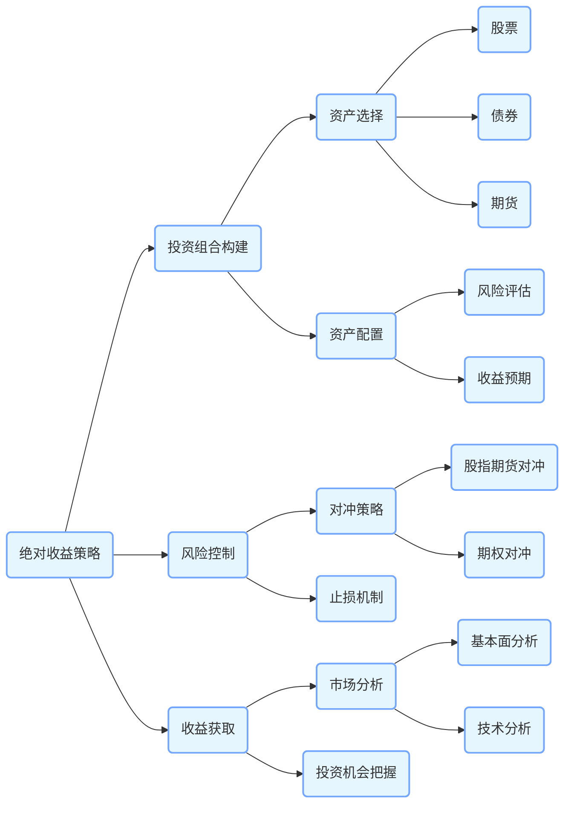

# 绝对收益策略：追求不依赖市场的稳定回报

> 关键词：绝对收益策略、稳定回报、市场独立性、投资组合、风险管理

> 摘要：本文聚焦于绝对收益策略，旨在深入探讨如何实现不依赖市场的稳定回报。首先介绍了绝对收益策略的背景，包括目的、预期读者、文档结构和相关术语。接着阐述了核心概念及其联系，通过文本示意图和 Mermaid 流程图进行直观展示。详细讲解了核心算法原理和具体操作步骤，并结合 Python 源代码进行说明。引入数学模型和公式，通过举例加深理解。通过项目实战，展示了代码的实际案例和详细解释。分析了绝对收益策略的实际应用场景，推荐了相关的学习资源、开发工具框架和论文著作。最后总结了未来发展趋势与挑战，提供了常见问题的解答和扩展阅读参考资料。

## 1. 背景介绍 
### 1.1 目的和范围
在金融市场中，投资者往往面临着市场波动带来的风险，传统的相对收益策略依赖于市场的整体表现，当市场行情不佳时，投资者可能遭受较大损失。绝对收益策略的目的就是打破这种对市场的依赖，为投资者提供一种无论市场涨跌都能实现稳定回报的投资方法。

本文的范围涵盖了绝对收益策略的核心概念、算法原理、数学模型、实际应用案例等方面，旨在为投资者、金融从业者和研究人员提供全面深入的了解。

### 1.2 预期读者
- 投资者：希望通过了解绝对收益策略，优化自己的投资组合，实现稳定的资产增值。
- 金融从业者：包括基金经理、投资顾问等，为其在实际工作中运用和推广绝对收益策略提供参考。
- 研究人员：对金融投资领域的新策略进行深入研究，探索其理论基础和应用前景。

### 1.3 文档结构概述
本文将按照以下结构展开：首先介绍绝对收益策略的背景信息，包括目的、读者和文档结构；接着阐述核心概念和联系，通过示意图和流程图进行直观展示；然后详细讲解核心算法原理和具体操作步骤，结合 Python 代码实现；引入数学模型和公式，并举例说明；通过项目实战展示代码的实际应用；分析绝对收益策略的实际应用场景；推荐相关的学习资源、开发工具框架和论文著作；最后总结未来发展趋势与挑战，提供常见问题解答和扩展阅读参考资料。

### 1.4 术语表
#### 1.4.1 核心术语定义
- 绝对收益策略：一种投资策略，旨在通过各种投资手段，在一定时间内实现正的回报，而不依赖于市场的整体走势。
- 夏普比率：衡量投资组合每承受一单位总风险，会产生多少的超额报酬。计算公式为 $Sharpe Ratio = \frac{R_p - R_f}{\sigma_p}$，其中 $R_p$ 是投资组合的预期收益率，$R_f$ 是无风险利率，$\sigma_p$ 是投资组合的标准差。
- 最大回撤：在选定周期内任一历史时点往后推，产品净值走到最低点时的收益率回撤幅度的最大值。它是衡量投资组合风险的重要指标。

#### 1.4.2 相关概念解释
- 市场中性策略：绝对收益策略的一种常见形式，通过同时构建多头和空头头寸，使投资组合对市场整体波动的敏感性降低，从而实现与市场走势无关的收益。
- 对冲基金：通常采用绝对收益策略的投资机构，运用各种金融工具进行对冲操作，以降低风险并追求稳定回报。

#### 1.4.3 缩略词列表
- VaR：Value at Risk，风险价值，是一种统计方法，用于衡量在一定的置信水平下，投资组合在未来特定时期内可能遭受的最大损失。
- ETF：Exchange Traded Fund，交易型开放式指数基金，是一种在交易所上市交易的、基金份额可变的开放式基金。

## 2. 核心概念与联系 
绝对收益策略的核心在于通过合理的资产配置和风险管理，实现不依赖市场的稳定回报。其主要概念包括投资组合的构建、风险控制和收益获取。

### 核心概念原理
投资组合的构建是绝对收益策略的基础，通过选择不同的资产类别，如股票、债券、期货等，并根据市场情况和投资目标进行合理配置，以降低单一资产的风险。风险控制则是通过对冲、止损等手段，确保投资组合在市场波动时的稳定性。收益获取则是通过对市场趋势的分析和投资机会的把握，实现资产的增值。

### 架构的文本示意图
```
绝对收益策略
|-- 投资组合构建
|   |-- 资产选择
|   |   |-- 股票
|   |   |-- 债券
|   |   |-- 期货
|   |-- 资产配置
|       |-- 风险评估
|       |-- 收益预期
|-- 风险控制
|   |-- 对冲策略
|   |   |-- 股指期货对冲
|   |   |-- 期权对冲
|   |-- 止损机制
|-- 收益获取
|   |-- 市场分析
|   |   |-- 基本面分析
|   |   |-- 技术分析
|   |-- 投资机会把握
```

### Mermaid 流程图


## 3. 核心算法原理 & 具体操作步骤 
### 核心算法原理
绝对收益策略的核心算法主要涉及投资组合的优化和风险控制。一种常见的方法是基于均值 - 方差模型，该模型通过最大化投资组合的预期收益和最小化投资组合的方差来实现最优资产配置。

### 具体操作步骤
1. **数据收集**：收集各种资产的历史价格数据、收益率数据等。
2. **计算均值和协方差矩阵**：根据历史数据计算每种资产的预期收益率和资产之间的协方差矩阵。
3. **设置约束条件**：设置投资组合的预期收益率、风险承受能力等约束条件。
4. **求解优化问题**：使用优化算法求解在约束条件下的最优资产配置。

### Python 源代码实现
```python
import numpy as np
import pandas as pd
from scipy.optimize import minimize

# 数据收集
# 假设我们有三种资产的历史收益率数据
returns = pd.DataFrame({
    'Asset1': [0.05, 0.03, 0.02, 0.04, 0.06],
    'Asset2': [0.03, 0.02, 0.01, 0.03, 0.05],
    'Asset3': [0.02, 0.01, 0.005, 0.02, 0.04]
})

# 计算均值和协方差矩阵
mean_returns = returns.mean()
cov_matrix = returns.cov()

# 定义目标函数：最小化投资组合的方差
def portfolio_variance(weights, cov_matrix):
    return np.dot(weights.T, np.dot(cov_matrix, weights))

# 定义约束条件
# 权重之和为 1
constraints = ({'type': 'eq', 'fun': lambda x: np.sum(x) - 1})
# 权重非负
bounds = tuple((0, 1) for x in range(len(mean_returns)))

# 初始权重
initial_weights = np.ones(len(mean_returns)) / len(mean_returns)

# 求解优化问题
result = minimize(portfolio_variance, initial_weights, args=(cov_matrix,),
                  method='SLSQP', bounds=bounds, constraints=constraints)

# 最优权重
optimal_weights = result.x

print("最优权重：", optimal_weights)
```

### 代码解释
1. **数据收集**：使用 `pandas` 库创建一个包含三种资产历史收益率的 `DataFrame`。
2. **计算均值和协方差矩阵**：使用 `mean()` 方法计算每种资产的预期收益率，使用 `cov()` 方法计算资产之间的协方差矩阵。
3. **定义目标函数**：定义一个函数 `portfolio_variance` 来计算投资组合的方差。
4. **设置约束条件**：使用 `constraints` 字典设置权重之和为 1 的约束条件，使用 `bounds` 元组设置权重非负的约束条件。
5. **求解优化问题**：使用 `scipy.optimize.minimize` 函数求解在约束条件下的最优资产配置。
6. **输出结果**：打印最优权重。

## 4. 数学模型和公式 & 详细讲解 & 举例说明 
### 均值 - 方差模型
均值 - 方差模型是由哈里·马科维茨（Harry Markowitz）提出的一种投资组合优化模型，其核心思想是在给定预期收益率的情况下，最小化投资组合的方差；或者在给定方差的情况下，最大化投资组合的预期收益率。

#### 数学公式
设投资组合中包含 $n$ 种资产，第 $i$ 种资产的权重为 $w_i$，预期收益率为 $r_i$，资产之间的协方差矩阵为 $\Sigma$，则投资组合的预期收益率 $R_p$ 和方差 $\sigma_p^2$ 分别为：
$$
R_p = \sum_{i=1}^{n} w_i r_i
$$
$$
\sigma_p^2 = \sum_{i=1}^{n} \sum_{j=1}^{n} w_i w_j \sigma_{ij} = \mathbf{w}^T \Sigma \mathbf{w}
$$
其中，$\mathbf{w} = [w_1, w_2, \cdots, w_n]^T$ 是权重向量，$\sigma_{ij}$ 是资产 $i$ 和资产 $j$ 之间的协方差。

#### 详细讲解
均值 - 方差模型的目标是在满足一定约束条件下，找到最优的权重向量 $\mathbf{w}$，使得投资组合的预期收益率最大或方差最小。常见的约束条件包括权重之和为 1 和权重非负。

#### 举例说明
假设我们有两种资产，资产 A 的预期收益率为 0.1，资产 B 的预期收益率为 0.2，资产 A 和资产 B 之间的协方差为 0.01，我们希望在预期收益率为 0.15 的情况下，最小化投资组合的方差。

设资产 A 的权重为 $w_A$，资产 B 的权重为 $w_B = 1 - w_A$，则投资组合的预期收益率为：
$$
R_p = w_A \times 0.1 + (1 - w_A) \times 0.2 = 0.15
$$
解得 $w_A = 0.5$，$w_B = 0.5$。

投资组合的方差为：
$$
\sigma_p^2 = w_A^2 \times \sigma_A^2 + w_B^2 \times \sigma_B^2 + 2 w_A w_B \times \sigma_{AB}
$$
假设 $\sigma_A^2 = 0.04$，$\sigma_B^2 = 0.09$，则：
$$
\sigma_p^2 = 0.5^2 \times 0.04 + 0.5^2 \times 0.09 + 2 \times 0.5 \times 0.5 \times 0.01 = 0.0325
$$

### 夏普比率
夏普比率是衡量投资组合风险调整后收益的指标，它表示投资组合每承受一单位总风险，会产生多少的超额报酬。

#### 数学公式
$$
Sharpe Ratio = \frac{R_p - R_f}{\sigma_p}
$$
其中，$R_p$ 是投资组合的预期收益率，$R_f$ 是无风险利率，$\sigma_p$ 是投资组合的标准差。

#### 详细讲解
夏普比率越高，说明投资组合在承担相同风险的情况下，获得的超额报酬越高。投资者可以通过比较不同投资组合的夏普比率，选择最优的投资组合。

#### 举例说明
假设投资组合的预期收益率为 0.1，无风险利率为 0.02，投资组合的标准差为 0.2，则夏普比率为：
$$
Sharpe Ratio = \frac{0.1 - 0.02}{0.2} = 0.4
$$

## 5. 项目实战：代码实际案例和详细解释说明 
### 5.1  开发环境搭建
- **Python 安装**：从 Python 官方网站（https://www.python.org/downloads/）下载并安装 Python 3.x 版本。
- **安装必要的库**：使用 `pip` 命令安装所需的库，如 `pandas`、`numpy`、`scipy` 等。
```bash
pip install pandas numpy scipy
```

### 5.2  源代码详细实现和代码解读
```python
import numpy as np
import pandas as pd
from scipy.optimize import minimize

# 数据收集
# 假设我们有四种资产的历史收益率数据
returns = pd.DataFrame({
    'Asset1': [0.06, 0.04, 0.03, 0.05, 0.07],
    'Asset2': [0.04, 0.03, 0.02, 0.04, 0.06],
    'Asset3': [0.03, 0.02, 0.01, 0.03, 0.05],
    'Asset4': [0.02, 0.01, 0.005, 0.02, 0.04]
})

# 计算均值和协方差矩阵
mean_returns = returns.mean()
cov_matrix = returns.cov()

# 定义目标函数：最小化投资组合的方差
def portfolio_variance(weights, cov_matrix):
    return np.dot(weights.T, np.dot(cov_matrix, weights))

# 定义约束条件
# 权重之和为 1
constraints = ({'type': 'eq', 'fun': lambda x: np.sum(x) - 1})
# 权重非负
bounds = tuple((0, 1) for x in range(len(mean_returns)))

# 初始权重
initial_weights = np.ones(len(mean_returns)) / len(mean_returns)

# 求解优化问题
result = minimize(portfolio_variance, initial_weights, args=(cov_matrix,),
                  method='SLSQP', bounds=bounds, constraints=constraints)

# 最优权重
optimal_weights = result.x

# 计算最优投资组合的预期收益率和标准差
optimal_return = np.dot(optimal_weights, mean_returns)
optimal_std = np.sqrt(portfolio_variance(optimal_weights, cov_matrix))

print("最优权重：", optimal_weights)
print("最优投资组合的预期收益率：", optimal_return)
print("最优投资组合的标准差：", optimal_std)
```

### 代码解读与分析
1. **数据收集**：使用 `pandas` 库创建一个包含四种资产历史收益率的 `DataFrame`。
2. **计算均值和协方差矩阵**：使用 `mean()` 方法计算每种资产的预期收益率，使用 `cov()` 方法计算资产之间的协方差矩阵。
3. **定义目标函数**：定义一个函数 `portfolio_variance` 来计算投资组合的方差。
4. **设置约束条件**：使用 `constraints` 字典设置权重之和为 1 的约束条件，使用 `bounds` 元组设置权重非负的约束条件。
5. **求解优化问题**：使用 `scipy.optimize.minimize` 函数求解在约束条件下的最优资产配置。
6. **计算最优投资组合的预期收益率和标准差**：使用最优权重计算最优投资组合的预期收益率和标准差。
7. **输出结果**：打印最优权重、最优投资组合的预期收益率和标准差。

通过这个项目实战，我们可以看到如何使用 Python 实现绝对收益策略中的投资组合优化问题，通过合理的资产配置，实现风险的降低和收益的最大化。

## 6. 实际应用场景 
### 个人投资者
个人投资者可以使用绝对收益策略来优化自己的投资组合，降低市场波动对资产的影响。例如，通过构建包含股票、债券、基金等多种资产的投资组合，并根据市场情况进行动态调整，实现稳定的资产增值。

### 机构投资者
机构投资者如保险公司、养老基金等，通常对资产的稳定性和长期回报有较高的要求。绝对收益策略可以帮助他们在满足风险控制要求的前提下，实现资产的保值增值。例如，保险公司可以通过投资对冲基金等采用绝对收益策略的产品，降低投资风险。

### 金融机构
金融机构如银行、证券公司等，可以为客户提供基于绝对收益策略的投资产品和服务。例如，银行可以推出结构化理财产品，通过运用绝对收益策略，为客户提供相对稳定的收益。

## 7. 工具和资源推荐
### 7.1 学习资源推荐
#### 7.1.1 书籍推荐
- 《投资组合理论与资本市场》（*Portfolio Theory and Capital Markets*）：哈里·马科维茨（Harry Markowitz）的经典著作，详细介绍了均值 - 方差模型等投资组合理论。
- 《聪明的投资者》（*The Intelligent Investor*）：本杰明·格雷厄姆（Benjamin Graham）的著作，强调了价值投资和风险控制的重要性。
- 《对冲基金奇才》（*Hedge Fund Market Wizards*）：杰克·施瓦格（Jack D. Schwager）的访谈录，介绍了多位成功对冲基金经理的投资策略和经验。

#### 7.1.2 在线课程
- Coursera 上的“金融市场”（*Financial Markets*）课程：由耶鲁大学的罗伯特·席勒（Robert Shiller）教授授课，涵盖了金融市场的基本概念、投资策略等内容。
- edX 上的“投资组合管理”（*Portfolio Management*）课程：介绍了投资组合的构建、优化和风险管理等知识。

#### 7.1.3 技术博客和网站
- 雪球（https://xueqiu.com/）：国内知名的投资社区，提供了丰富的股票、基金等投资信息和交流平台。
- Seeking Alpha（https://seekingalpha.com/）：国外知名的金融投资网站，提供了大量的股票分析、投资策略等文章。

### 7.2 开发工具框架推荐
#### 7.2.1 IDE和编辑器
- PyCharm：一款专业的 Python 集成开发环境，提供了代码编辑、调试、版本控制等功能。
- Jupyter Notebook：一个交互式的开发环境，适合进行数据分析和模型验证。

#### 7.2.2 调试和性能分析工具
- PDB：Python 自带的调试工具，可以帮助开发者定位代码中的问题。
- cProfile：Python 标准库中的性能分析工具，可以分析代码的运行时间和函数调用情况。

#### 7.2.3 相关框架和库
- Pandas：一个强大的数据分析库，提供了数据结构和数据处理功能。
- Numpy：用于科学计算的基础库，提供了高效的数组操作和数学函数。
- Scipy：一个用于科学计算和优化的库，包含了许多优化算法和统计函数。

### 7.3 相关论文著作推荐
#### 7.3.1 经典论文
- Markowitz, H. M. (1952). *Portfolio Selection*. The Journal of Finance, 7(1), 77 - 91. 这篇论文提出了均值 - 方差模型，开创了现代投资组合理论的先河。
- Sharpe, W. F. (1964). *Capital Asset Prices: A Theory of Market Equilibrium Under Conditions of Risk*. The Journal of Finance, 19(3), 425 - 442. 这篇论文提出了资本资产定价模型（CAPM），对金融市场的定价理论产生了深远影响。

#### 7.3.2 最新研究成果
- 可以关注《Journal of Financial Economics》、《Review of Financial Studies》等顶级金融学术期刊，了解绝对收益策略的最新研究进展。

#### 7.3.3 应用案例分析
- 一些金融机构和研究机构会发布关于绝对收益策略的应用案例分析报告，可以通过他们的官方网站或专业数据库获取。

## 8. 总结：未来发展趋势与挑战
### 未来发展趋势
- **智能化和自动化**：随着人工智能和机器学习技术的发展，绝对收益策略将越来越多地采用智能化和自动化的方法。例如，通过机器学习算法对市场数据进行分析和预测，实现投资组合的自动调整。
- **多元化和全球化**：投资者将越来越注重资产的多元化和全球化配置，通过投资不同国家和地区的资产，降低单一市场的风险。绝对收益策略将在多元化和全球化投资中发挥重要作用。
- **与其他策略的融合**：绝对收益策略将与其他投资策略，如量化投资、价值投资等进行融合，形成更加复杂和有效的投资策略。

### 挑战
- **市场不确定性**：金融市场具有高度的不确定性，绝对收益策略虽然旨在降低市场波动的影响，但仍然难以完全避免市场风险。例如，突发的宏观经济事件、政策变化等都可能对投资组合产生不利影响。
- **数据质量和模型有效性**：绝对收益策略依赖于大量的市场数据和复杂的数学模型，数据质量的好坏和模型的有效性直接影响策略的效果。如果数据存在误差或模型不合理，可能导致投资决策失误。
- **监管要求**：随着金融市场的发展，监管机构对投资策略的监管要求越来越严格。绝对收益策略的实施需要遵守相关的监管规定，这对金融机构和投资者提出了更高的要求。

## 9. 附录：常见问题与解答
### 问题 1：绝对收益策略一定能实现正回报吗？
答：绝对收益策略的目标是在一定时间内实现正的回报，但并不保证一定能实现。市场具有不确定性，即使采用了绝对收益策略，也可能因为市场波动、突发事件等原因导致投资组合出现亏损。

### 问题 2：绝对收益策略适合所有投资者吗？
答：绝对收益策略并不适合所有投资者。对于风险承受能力较低、追求稳定回报的投资者来说，绝对收益策略是一个不错的选择。但对于风险承受能力较高、追求高收益的投资者来说，可能更适合采用相对收益策略。

### 问题 3：如何评估绝对收益策略的效果？
答：可以通过夏普比率、最大回撤等指标来评估绝对收益策略的效果。夏普比率越高，说明投资组合在承担相同风险的情况下，获得的超额报酬越高；最大回撤越小，说明投资组合在市场波动时的稳定性越好。

### 问题 4：绝对收益策略需要频繁调整投资组合吗？
答：这取决于市场情况和投资策略的具体要求。一般来说，如果市场波动较大，可能需要适当调整投资组合以降低风险；如果市场相对稳定，可以适当减少调整频率。但无论如何，都需要根据实际情况进行动态调整。

## 10. 扩展阅读 & 参考资料
### 扩展阅读
- 《金融炼金术》（*The Alchemy of Finance*）：乔治·索罗斯（George Soros）的著作，介绍了他的投资哲学和金融市场理论。
- 《黑天鹅》（*The Black Swan: The Impact of the Highly Improbable*）：纳西姆·尼古拉斯·塔勒布（Nassim Nicholas Taleb）的著作，探讨了不可预测的重大事件对金融市场的影响。

### 参考资料
- 马科维茨, H. M. (1952). 投资组合选择. 《金融杂志》, 7(1), 77 - 91.
- 夏普, W. F. (1964). 资本资产价格: 风险条件下的市场均衡理论. 《金融杂志》, 19(3), 425 - 442.
- 相关金融学术期刊和研究报告。

作者：AI天才研究院/AI Genius Institute & 禅与计算机程序设计艺术 /Zen And The Art of Computer Programming