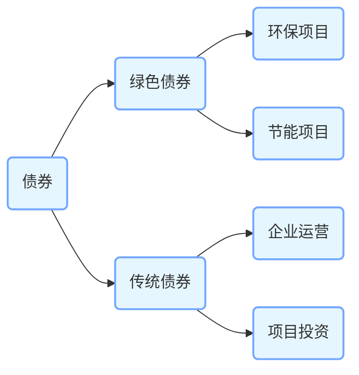

# 绿色债券收益率与传统债券的比较研究

> 关键词：绿色债券、传统债券、收益率比较、金融市场、可持续投资

> 摘要：本文旨在深入研究绿色债券收益率与传统债券收益率的差异。通过对绿色债券和传统债券的核心概念、算法原理、数学模型等方面进行系统分析，并结合实际案例和应用场景，全面探讨两者收益率的影响因素及特点。同时，提供相关的工具和资源推荐，最后对绿色债券和传统债券的未来发展趋势与挑战进行总结。希望能为投资者、金融从业者和相关研究人员提供有价值的参考。

## 1. 背景介绍 
### 1.1 目的和范围
本研究的主要目的是清晰地比较绿色债券收益率与传统债券收益率，分析两者之间存在差异的原因和影响因素。范围涵盖了绿色债券和传统债券的基本概念、市场表现、收益率计算方法以及在不同经济环境下的变化情况。通过对这些方面的研究，旨在为投资者在选择投资产品时提供科学的决策依据，也为金融市场的健康发展提供理论支持。

### 1.2 预期读者
本文预期读者包括金融市场的投资者，他们希望通过了解绿色债券和传统债券收益率的差异，优化投资组合，实现资产的保值增值；金融从业者，如银行、证券等机构的工作人员，有助于他们更好地开展业务，为客户提供专业的建议；以及相关领域的研究人员，为他们的学术研究提供新的思路和参考。

### 1.3 文档结构概述
本文首先介绍了绿色债券和传统债券的核心概念及其相互联系，通过文本示意图和 Mermaid 流程图进行直观展示。接着阐述了计算两者收益率的核心算法原理，并给出具体的 Python 代码实现。然后介绍了相关的数学模型和公式，并通过举例进行详细讲解。之后通过实际案例分析，展示了在实际项目中如何运用这些理论和方法。随后探讨了绿色债券和传统债券的实际应用场景。再推荐了学习和开发过程中可用的工具和资源。最后对绿色债券和传统债券的未来发展趋势与挑战进行总结，并提供常见问题解答和扩展阅读及参考资料。

### 1.4 术语表
#### 1.4.1 核心术语定义
- **绿色债券**：是一种专门为支持符合规定条件的绿色项目而发行的债券。这些绿色项目通常涉及环境保护、应对气候变化等可持续发展领域，如可再生能源项目、节能项目等。
- **传统债券**：是发行人向投资者发行的一种债务凭证，发行人承诺在一定时期内支付利息，并在到期时偿还本金。传统债券的发行目的较为广泛，不局限于特定的绿色领域。
- **收益率**：是指投资所获得的收益与投资成本之间的比率，反映了投资的盈利能力。在债券投资中，收益率通常包括票面利率、当期收益率、到期收益率等不同的计算方式。

#### 1.4.2 相关概念解释
- **票面利率**：是债券发行人在发行债券时承诺支付给投资者的利息率，通常以年利率表示。它是债券利息计算的基础。
- **当期收益率**：是指债券每年支付的利息与当前债券市场价格的比率，反映了债券当前的利息收益情况。
- **到期收益率**：是一种考虑了债券所有现金流（包括利息和本金偿还）以及当前市场价格的内部收益率计算方法。它假设投资者持有债券至到期，并将所有利息收入按照到期收益率进行再投资，是衡量债券投资收益的重要指标。

#### 1.4.3 缩略词列表
- **YTM**：Yield to Maturity，到期收益率
- **CR**：Coupon Rate，票面利率
- **CY**：Current Yield，当期收益率

## 2. 核心概念与联系 

### 核心概念原理
绿色债券和传统债券在本质上都是一种债务融资工具，但它们在发行目的、资金用途和市场影响等方面存在明显差异。

绿色债券的发行旨在为绿色项目提供资金支持，促进可持续发展。其资金必须专门用于符合特定绿色标准的项目，如可再生能源发电、污水处理、绿色建筑等。投资者购买绿色债券不仅可以获得经济收益，还能为环境保护和可持续发展做出贡献，因此具有一定的社会和环境效益。

传统债券的发行目的则更加多样化，可以用于企业的日常运营、项目投资、债务偿还等各种用途。它的市场规模较大，投资者群体广泛，是金融市场中常见的融资和投资工具。

### 架构的文本示意图
```plaintext
             债券
            /    \
       绿色债券  传统债券
      /    |      |    \
环保项目  节能项目  企业运营  项目投资
```

### Mermaid 流程图


从图中可以看出，债券分为绿色债券和传统债券两大类，绿色债券主要用于环保和节能等绿色项目，而传统债券的用途更加广泛。

## 3. 核心算法原理 & 具体操作步骤 

### 债券收益率的计算方法
#### 当期收益率（CY）
当期收益率是指债券每年支付的利息与当前债券市场价格的比率，计算公式为：
$$CY = \frac{CR \times F}{P}$$
其中，$CR$ 是票面利率，$F$ 是债券面值，$P$ 是债券当前市场价格。

#### 到期收益率（YTM）
到期收益率是一种考虑了债券所有现金流（包括利息和本金偿还）以及当前市场价格的内部收益率计算方法。对于每年付息一次、按面值偿还本金的债券，其到期收益率可以通过以下公式近似计算：
$$P = \frac{C}{(1 + YTM)^1} + \frac{C}{(1 + YTM)^2} + \cdots + \frac{C + F}{(1 + YTM)^n}$$
其中，$C$ 是每年支付的利息（$C = CR \times F$），$F$ 是债券面值，$P$ 是债券当前市场价格，$n$ 是债券剩余到期年限，$YTM$ 是到期收益率。

### Python 代码实现
```python
def current_yield(coupon_rate, face_value, market_price):
    """
    计算当期收益率
    :param coupon_rate: 票面利率
    :param face_value: 债券面值
    :param market_price: 债券当前市场价格
    :return: 当期收益率
    """
    return (coupon_rate * face_value) / market_price

def approximate_yield_to_maturity(coupon_rate, face_value, market_price, years_to_maturity):
    """
    近似计算到期收益率
    :param coupon_rate: 票面利率
    :param face_value: 债券面值
    :param market_price: 债券当前市场价格
    :param years_to_maturity: 债券剩余到期年限
    :return: 到期收益率
    """
    annual_interest = coupon_rate * face_value
    return (annual_interest + (face_value - market_price) / years_to_maturity) / ((face_value + market_price) / 2)

# 示例数据
coupon_rate = 0.05  # 票面利率 5%
face_value = 1000  # 债券面值 1000 元
market_price = 950  # 债券当前市场价格 950 元
years_to_maturity = 5  # 债券剩余到期年限 5 年

# 计算当期收益率
cy = current_yield(coupon_rate, face_value, market_price)
print(f"当期收益率: {cy * 100:.2f}%")

# 计算到期收益率
ytm = approximate_yield_to_maturity(coupon_rate, face_value, market_price, years_to_maturity)
print(f"到期收益率: {ytm * 100:.2f}%")
```
### 代码解释
- `current_yield` 函数：该函数接受票面利率、债券面值和债券当前市场价格作为输入，根据当期收益率的计算公式返回计算结果。
- `approximate_yield_to_maturity` 函数：该函数接受票面利率、债券面值、债券当前市场价格和债券剩余到期年限作为输入，使用近似公式计算到期收益率并返回结果。
- 示例数据部分：定义了票面利率、债券面值、债券当前市场价格和债券剩余到期年限等参数，并调用上述两个函数计算当期收益率和到期收益率，最后将结果打印输出。

## 4. 数学模型和公式 & 详细讲解 & 举例说明 

### 当期收益率公式
$$CY = \frac{CR \times F}{P}$$
#### 详细讲解
当期收益率反映了债券当前的利息收益情况。分子 $CR \times F$ 表示每年支付的利息，分母 $P$ 是债券当前市场价格。通过将每年的利息除以当前市场价格，得到了每单位投资在当前能够获得的利息收益比例。

#### 举例说明
假设某债券的票面利率 $CR = 0.06$（即 6%），债券面值 $F = 1000$ 元，当前市场价格 $P = 980$ 元。则该债券的当期收益率为：
$$CY = \frac{0.06 \times 1000}{980} \approx 0.0612 = 6.12\%$$
这意味着投资者以 980 元的价格购买该债券，每年能够获得约 6.12% 的利息收益。

### 到期收益率公式
$$P = \frac{C}{(1 + YTM)^1} + \frac{C}{(1 + YTM)^2} + \cdots + \frac{C + F}{(1 + YTM)^n}$$
#### 详细讲解
到期收益率是一种考虑了债券所有现金流（包括利息和本金偿还）以及当前市场价格的内部收益率计算方法。公式左边的 $P$ 是债券当前市场价格，右边是债券未来所有现金流（每年的利息 $C$ 和到期时的本金 $F$）按照到期收益率 $YTM$ 进行折现后的现值之和。通过求解该方程，可以得到使债券未来现金流现值等于当前市场价格的到期收益率。

#### 举例说明
假设某债券的票面利率 $CR = 0.05$（即 5%），债券面值 $F = 1000$ 元，当前市场价格 $P = 950$ 元，剩余到期年限 $n = 5$ 年。每年支付的利息 $C = CR \times F = 0.05 \times 1000 = 50$ 元。

使用上述公式可以列出方程：
$$950 = \frac{50}{(1 + YTM)^1} + \frac{50}{(1 + YTM)^2} + \frac{50}{(1 + YTM)^3} + \frac{50}{(1 + YTM)^4} + \frac{50 + 1000}{(1 + YTM)^5}$$
这个方程通常需要使用数值方法（如牛顿迭代法）来求解。在实际应用中，也可以使用近似公式进行计算，如前面 Python 代码中使用的近似公式。

通过近似公式计算得到的到期收益率约为 6.38%，这意味着如果投资者持有该债券至到期，并将所有利息收入按照 6.38% 的收益率进行再投资，那么整个投资过程的实际收益率约为 6.38%。

## 5. 项目实战：代码实际案例和详细解释说明 

### 5.1  开发环境搭建
#### 操作系统
可以选择 Windows、Linux 或 macOS 等主流操作系统。本示例以 Windows 10 为例。

#### Python 安装
从 Python 官方网站（https://www.python.org/downloads/）下载适合 Windows 10 的 Python 3.x 版本（建议选择 Python 3.7 及以上版本），并按照安装向导进行安装。安装过程中注意勾选“Add Python to PATH”选项，以便在命令行中可以直接使用 Python 命令。

#### 开发工具
可以选择 PyCharm、Visual Studio Code 等集成开发环境（IDE），也可以使用 Jupyter Notebook 进行交互式开发。本示例使用 Visual Studio Code。

安装 Visual Studio Code 后，需要安装 Python 扩展。打开 Visual Studio Code，点击左侧的扩展图标，在搜索框中输入“Python”，选择 Microsoft 提供的 Python 扩展并安装。

### 5.2  源代码详细实现和代码解读
```python
import numpy as np

def current_yield(coupon_rate, face_value, market_price):
    """
    计算当期收益率
    :param coupon_rate: 票面利率
    :param face_value: 债券面值
    :param market_price: 债券当前市场价格
    :return: 当期收益率
    """
    return (coupon_rate * face_value) / market_price

def yield_to_maturity(coupon_rate, face_value, market_price, years_to_maturity, periods_per_year=1):
    """
    计算到期收益率
    :param coupon_rate: 票面利率
    :param face_value: 债券面值
    :param market_price: 债券当前市场价格
    :param years_to_maturity: 债券剩余到期年限
    :param periods_per_year: 每年付息次数
    :return: 到期收益率
    """
    num_periods = years_to_maturity * periods_per_year
    coupon_payment = (coupon_rate * face_value) / periods_per_year
    guess = 0.05  # 初始猜测值
    tolerance = 1e-6  # 误差容忍度
    max_iterations = 1000  # 最大迭代次数
    for _ in range(max_iterations):
        present_value = 0
        for t in range(1, num_periods + 1):
            if t == num_periods:
                present_value += (coupon_payment + face_value) / ((1 + guess / periods_per_year) ** t)
            else:
                present_value += coupon_payment / ((1 + guess / periods_per_year) ** t)
        error = present_value - market_price
        if abs(error) < tolerance:
            return guess
        # 使用牛顿迭代法更新猜测值
        derivative = 0
        for t in range(1, num_periods + 1):
            if t == num_periods:
                derivative -= t * (coupon_payment + face_value) / ((1 + guess / periods_per_year) ** (t + 1))
            else:
                derivative -= t * coupon_payment / ((1 + guess / periods_per_year) ** (t + 1))
        guess = guess - error / derivative
    return None

# 示例数据
coupon_rate = 0.06  # 票面利率 6%
face_value = 1000  # 债券面值 1000 元
market_price = 970  # 债券当前市场价格 970 元
years_to_maturity = 4  # 债券剩余到期年限 4 年

# 计算当期收益率
cy = current_yield(coupon_rate, face_value, market_price)
print(f"当期收益率: {cy * 100:.2f}%")

# 计算到期收益率
ytm = yield_to_maturity(coupon_rate, face_value, market_price, years_to_maturity)
if ytm is not None:
    print(f"到期收益率: {ytm * 100:.2f}%")
else:
    print("未能收敛到解")
```

### 5.3  代码解读与分析
#### 函数定义
- `current_yield` 函数：与前面的代码类似，用于计算当期收益率。
- `yield_to_maturity` 函数：用于计算到期收益率。该函数使用牛顿迭代法来求解到期收益率方程。具体步骤如下：
    1. 初始化参数，包括总期数 `num_periods`、每期利息 `coupon_payment`、初始猜测值 `guess`、误差容忍度 `tolerance` 和最大迭代次数 `max_iterations`。
    2. 在每次迭代中，计算债券未来现金流的现值 `present_value`，并计算现值与当前市场价格的误差 `error`。
    3. 如果误差小于误差容忍度，则认为找到了满足条件的到期收益率，返回该值。
    4. 否则，使用牛顿迭代法更新猜测值。牛顿迭代法的核心是通过计算函数的导数来更新猜测值，使得猜测值逐步逼近真实解。
    5. 如果迭代次数达到最大迭代次数仍未收敛到解，则返回 `None`。

#### 示例数据和计算
定义了票面利率、债券面值、债券当前市场价格和债券剩余到期年限等参数，并调用 `current_yield` 和 `yield_to_maturity` 函数计算当期收益率和到期收益率，最后将结果打印输出。

## 6. 实际应用场景 
### 投资者角度
对于投资者来说，比较绿色债券收益率与传统债券收益率可以帮助他们优化投资组合。如果绿色债券的收益率具有竞争力，且投资者关注环境保护和可持续发展，那么他们可以将一定比例的资金投资于绿色债券，以实现经济收益和社会环境效益的双赢。例如，一些机构投资者可能会根据自身的投资策略和风险偏好，在投资组合中配置一定比例的绿色债券，以分散风险并支持可持续发展项目。

### 企业角度
企业在选择融资方式时，需要考虑债券的发行成本和市场接受度。如果绿色债券市场发展良好，且投资者对绿色项目的认可度较高，企业可以考虑发行绿色债券来筹集资金。发行绿色债券不仅可以获得资金支持，还可以提升企业的社会形象和品牌价值。例如，一些能源企业为了开展可再生能源项目，可能会选择发行绿色债券来满足项目的资金需求。

### 金融市场角度
绿色债券和传统债券收益率的比较有助于金融市场的健康发展。通过研究两者的差异，可以发现市场的潜在需求和发展趋势，为金融创新提供方向。例如，金融机构可以根据绿色债券和传统债券的特点，开发出更多的金融产品和服务，满足不同投资者的需求。同时，政府和监管机构也可以根据市场情况制定相应的政策，促进绿色金融市场的发展。

## 7. 工具和资源推荐
### 7.1 学习资源推荐
#### 7.1.1 书籍推荐
- 《债券市场：分析与策略》（**The Bond Market: Analysis and Strategies**）：这本书全面介绍了债券市场的基本概念、分析方法和投资策略，对于理解债券收益率的计算和影响因素非常有帮助。
- 《绿色金融：理论与实践》（**Green Finance: Theory and Practice**）：详细探讨了绿色金融的相关理论和实践，包括绿色债券的发行、定价和风险管理等方面的内容。

#### 7.1.2 在线课程
- Coursera 上的“Fixed Income Securities”课程：由知名大学的教授授课，系统地介绍了固定收益证券的相关知识，包括债券的定价、收益率计算和风险管理等内容。
- edX 上的“Green Finance and Investment”课程：专注于绿色金融领域，涵盖了绿色债券、可持续投资等方面的知识和实践案例。

#### 7.1.3 技术博客和网站
- 彭博社（Bloomberg）：提供了丰富的金融市场数据和分析报告，包括债券市场的实时行情、收益率曲线等信息。
- 气候债券倡议组织（Climate Bonds Initiative）：专注于绿色债券市场的研究和推广，提供了大量关于绿色债券的政策、标准和市场动态等方面的信息。

### 7.2 开发工具框架推荐
#### 7.2.1 IDE和编辑器
- PyCharm：是一款专业的 Python 集成开发环境，提供了丰富的代码编辑、调试和项目管理功能，适合开发复杂的金融分析程序。
- Visual Studio Code：是一款轻量级的代码编辑器，支持多种编程语言和插件扩展，具有良好的用户体验和开发效率。

#### 7.2.2 调试和性能分析工具
- Py-Spy：是一个用于分析 Python 程序性能的工具，可以实时监测程序的 CPU 使用率、函数调用时间等信息，帮助开发者找出程序的性能瓶颈。
- PDB：是 Python 自带的调试工具，可以在代码中设置断点，逐步执行程序，查看变量的值和程序的执行流程，方便调试和排查问题。

#### 7.2.3 相关框架和库
- NumPy：是 Python 中用于科学计算的基础库，提供了高效的数组操作和数学函数，在债券收益率计算中可以用于处理大量的数据。
- Pandas：是一个用于数据处理和分析的库，提供了丰富的数据结构和数据操作方法，方便对债券市场数据进行清洗、整理和分析。

### 7.3 相关论文著作推荐
#### 7.3.1 经典论文
- “The Pricing of Options and Corporate Liabilities”（**Black, F., & Scholes, M. (1973)**）：这篇论文提出了著名的 Black-Scholes 期权定价模型，为金融衍生品的定价和风险管理奠定了基础，对于理解债券市场的定价机制也有一定的参考价值。
- “The Theory of Rational Option Pricing”（**Merton, R. C. (1973)**）：进一步扩展了 Black-Scholes 模型，提出了更一般的期权定价理论，对金融理论的发展产生了深远影响。

#### 7.3.2 最新研究成果
- 近年来，有许多关于绿色债券市场发展和收益率影响因素的研究成果。例如，一些研究通过实证分析发现，绿色债券的收益率受到市场供求关系、绿色项目的质量和风险等因素的影响。可以通过学术数据库（如 Web of Science、EBSCOhost 等）搜索相关的最新研究论文。

#### 7.3.3 应用案例分析
- 国际金融公司（IFC）发布的一些报告中包含了大量的绿色债券应用案例分析，这些案例详细介绍了不同企业和项目发行绿色债券的背景、过程和效果，对于了解绿色债券的实际应用具有重要的参考价值。

## 8. 总结：未来发展趋势与挑战
### 未来发展趋势
#### 市场规模扩大
随着全球对环境保护和可持续发展的关注度不断提高，绿色债券市场有望继续保持快速增长。越来越多的企业和政府将发行绿色债券来筹集资金，以支持绿色项目的发展。同时，投资者对绿色债券的需求也将不断增加，推动市场规模进一步扩大。

#### 产品创新
未来，绿色债券市场可能会出现更多的创新产品和服务。例如，可能会推出与绿色指数挂钩的债券、绿色资产支持证券等，以满足不同投资者的需求。此外，金融科技的应用也将为绿色债券市场带来新的发展机遇，如区块链技术可以提高债券发行和交易的透明度和效率。

#### 国际化发展
绿色债券市场的国际化程度将不断提高。随着全球绿色金融合作的加强，不同国家和地区的绿色债券市场将更加互联互通。国际投资者将更加关注新兴市场的绿色债券投资机会，促进绿色债券市场的全球一体化发展。

### 挑战
#### 标准不统一
目前，全球绿色债券市场的标准和定义尚未完全统一。不同国家和地区的绿色债券标准存在差异，这给投资者和发行人带来了一定的困惑。需要加强国际合作，制定统一的绿色债券标准和认证体系，提高市场的透明度和可比性。

#### 信息披露不足
绿色债券的信息披露质量有待提高。一些发行人在信息披露方面存在不完整、不及时的问题，投资者难以准确了解绿色项目的具体情况和环境效益。需要建立健全的信息披露制度，加强对发行人的监管，确保投资者能够获得充分、准确的信息。

#### 风险管理难度大
绿色债券投资面临着一些特殊的风险，如绿色项目的技术风险、环境风险等。如何有效地识别、评估和管理这些风险是绿色债券市场发展面临的重要挑战。需要开发适合绿色债券的风险管理工具和方法，提高投资者的风险应对能力。

## 9. 附录：常见问题与解答
### 1. 绿色债券的收益率一定比传统债券低吗？
不一定。绿色债券的收益率受到多种因素的影响，包括市场供求关系、绿色项目的质量和风险、宏观经济环境等。在某些情况下，绿色债券的收益率可能与传统债券相当，甚至更高。例如，如果市场对绿色债券的需求旺盛，而供给相对有限，那么绿色债券的价格可能会上涨，收益率相应下降；反之，如果市场对绿色债券的认可度较低，发行人为了吸引投资者，可能会提高债券的收益率。

### 2. 如何判断一个债券是否为绿色债券？
可以通过以下几个方面来判断一个债券是否为绿色债券：
- **发行文件**：查看债券的发行文件，了解资金的用途是否明确用于绿色项目。发行文件中通常会详细说明绿色项目的范围和标准。
- **认证机构**：一些绿色债券会经过专业的认证机构认证，如气候债券倡议组织（Climate Bonds Initiative）等。认证机构会对债券的绿色属性进行评估和验证，并颁发认证证书。
- **信息披露**：发行人需要定期披露绿色项目的进展情况和环境效益等信息。可以通过查看发行人的信息披露文件来了解债券的绿色属性。

### 3. 投资绿色债券有哪些风险？
投资绿色债券可能面临以下风险：
- **信用风险**：与传统债券一样，绿色债券也存在发行人违约的风险。投资者需要评估发行人的信用状况，选择信用等级较高的债券进行投资。
- **市场风险**：债券市场价格会受到宏观经济环境、利率波动等因素的影响。如果市场利率上升，债券价格可能会下跌，投资者可能会面临资本损失。
- **绿色项目风险**：绿色项目可能面临技术风险、环境风险等。例如，一些可再生能源项目可能受到天气条件、技术故障等因素的影响，导致项目收益不稳定。投资者需要对绿色项目的风险进行评估，并根据自身的风险承受能力进行投资决策。

## 10. 扩展阅读 & 参考资料
### 扩展阅读
- 《可持续金融：原则与实践》（**Sustainable Finance: Principles and Practice**）：进一步探讨了可持续金融的相关理论和实践，包括绿色金融的发展趋势、政策框架和风险管理等方面的内容。
- 《金融科技与绿色金融创新》（**Fintech and Green Finance Innovation**）：介绍了金融科技在绿色金融领域的应用和创新，如区块链、人工智能等技术在绿色债券发行、交易和监管中的应用。

### 参考资料
- 气候债券倡议组织（Climate Bonds Initiative）官方网站：https://www.climatebonds.net/
- 国际金融公司（IFC）官方网站：https://www.ifc.org/
- 彭博社（Bloomberg）官方网站：https://www.bloomberg.com/

作者：AI天才研究院/AI Genius Institute & 禅与计算机程序设计艺术 /Zen And The Art of Computer Programming