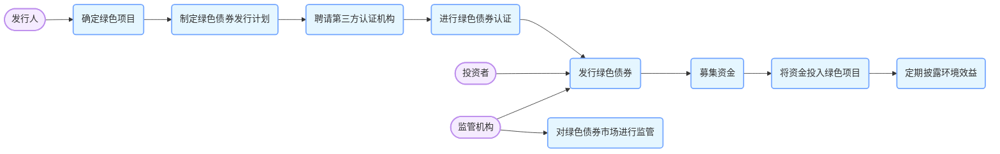

# 绿色债券：可持续金融的新兴投资工具

> 关键词：绿色债券、可持续金融、新兴投资工具、环境效益、融资机制

> 摘要：本文围绕绿色债券这一可持续金融的新兴投资工具展开深入探讨。首先介绍了绿色债券的背景，包括其目的、预期读者、文档结构和相关术语。接着阐述了绿色债券的核心概念与联系，通过文本示意图和 Mermaid 流程图展示其架构。详细讲解了绿色债券相关的核心算法原理和具体操作步骤，并用 Python 代码进行说明。同时给出了绿色债券的数学模型和公式，并举例阐释。通过项目实战，介绍了开发环境搭建、源代码实现与解读。分析了绿色债券的实际应用场景，推荐了学习资源、开发工具框架和相关论文著作。最后总结了绿色债券的未来发展趋势与挑战，还提供了常见问题解答和扩展阅读参考资料，旨在为读者全面了解绿色债券提供专业且深入的知识。

## 1. 背景介绍 
### 1.1 目的和范围
绿色债券作为可持续金融领域的重要创新，其目的在于为具有环境效益的项目提供专项融资支持，推动经济向绿色、低碳、可持续的方向转型。它不仅有助于缓解环境问题，如气候变化、资源短缺等，还能为投资者提供新的投资机会，实现经济效益与环境效益的双赢。

本文的范围涵盖了绿色债券的基本概念、核心原理、操作步骤、数学模型、实际应用、相关工具和资源，以及未来发展趋势等方面。通过对这些内容的详细阐述，旨在帮助读者全面了解绿色债券这一新兴投资工具，为投资者、金融机构、政府部门以及相关研究人员提供有价值的参考。

### 1.2 预期读者
本文的预期读者包括但不限于以下几类人群：
1. **投资者**：希望了解绿色债券投资机会、风险和收益特征，以优化投资组合，实现可持续投资目标的个人和机构投资者。
2. **金融机构**：银行、证券公司、基金公司等金融机构的从业人员，需要掌握绿色债券的发行、承销、交易等业务知识，以开展相关金融服务。
3. **政府部门**：负责制定和实施环境政策、金融政策的政府官员，需要了解绿色债券在推动可持续发展中的作用，以制定相关政策和法规。
4. **研究人员**：从事金融、环境、可持续发展等领域研究的学者和专家，希望深入研究绿色债券的理论和实践，为学术研究和政策制定提供参考。

### 1.3 文档结构概述
本文将按照以下结构进行阐述：
1. **核心概念与联系**：介绍绿色债券的定义、特点、分类和相关概念，通过文本示意图和 Mermaid 流程图展示其架构。
2. **核心算法原理 & 具体操作步骤**：讲解绿色债券相关的核心算法原理，如债券定价、风险评估等，并给出具体的操作步骤，用 Python 代码进行详细说明。
3. **数学模型和公式 & 详细讲解 & 举例说明**：建立绿色债券的数学模型，给出相关公式，并通过具体例子进行详细讲解。
4. **项目实战：代码实际案例和详细解释说明**：通过一个实际的绿色债券项目案例，介绍开发环境搭建、源代码实现和代码解读。
5. **实际应用场景**：分析绿色债券在不同领域的实际应用场景，如能源、交通、建筑等。
6. **工具和资源推荐**：推荐学习绿色债券的相关资源，包括书籍、在线课程、技术博客和网站；介绍开发绿色债券相关应用的工具和框架，以及相关的论文著作。
7. **总结：未来发展趋势与挑战**：总结绿色债券的发展现状，分析其未来发展趋势和面临的挑战。
8. **附录：常见问题与解答**：解答读者在学习和实践绿色债券过程中常见的问题。
9. **扩展阅读 & 参考资料**：提供与绿色债券相关的扩展阅读材料和参考资料，方便读者进一步深入学习。

### 1.4 术语表
#### 1.4.1 核心术语定义
1. **绿色债券**：是指将募集资金专门用于支持符合规定条件的绿色项目或为这些项目进行再融资的债券工具。绿色项目通常包括可再生能源、能效提升、污染防治、水资源管理等具有环境效益的项目。
2. **可持续金融**：是指将环境、社会和治理（ESG）因素纳入金融决策过程，以促进经济、社会和环境的可持续发展的金融活动。
3. **环境效益**：是指项目实施后对环境产生的积极影响，如减少温室气体排放、节约能源、保护生物多样性等。
4. **募集资金**：是指债券发行人通过发行债券向投资者筹集的资金。
5. **绿色项目评估**：是指对绿色项目的环境效益、技术可行性、经济可行性等方面进行评估，以确定项目是否符合绿色债券的发行要求。

#### 1.4.2 相关概念解释
1. **绿色债券标准**：是指为规范绿色债券的发行和交易，确保募集资金用于绿色项目，制定的一系列标准和指南。目前，国际上比较知名的绿色债券标准有国际资本市场协会（ICMA）发布的《绿色债券原则》（GBP）和气候债券倡议组织（CBI）发布的《气候债券标准》（CBS）。
2. **绿色债券认证**：是指由独立的第三方机构对绿色债券的发行进行认证，以确保债券的募集资金用于符合规定条件的绿色项目，并披露相关的环境效益信息。绿色债券认证可以提高债券的市场认可度和可信度。
3. **绿色债券指数**：是指反映绿色债券市场表现的指数，如彭博巴克莱全球绿色债券指数、中证绿色债券指数等。绿色债券指数可以为投资者提供参考，帮助他们了解绿色债券市场的整体走势和表现。

#### 1.4.3 缩略词列表
1. **GBP**：Green Bond Principles，绿色债券原则
2. **CBS**：Climate Bond Standard，气候债券标准
3. **ICMA**：International Capital Market Association，国际资本市场协会
4. **CBI**：Climate Bonds Initiative，气候债券倡议组织
5. **ESG**：Environmental, Social and Governance，环境、社会和治理

## 2. 核心概念与联系 

### 绿色债券的定义与特点
绿色债券是一种特殊类型的债券，其核心特点在于募集资金专门用于支持具有环境效益的项目。与普通债券相比，绿色债券具有以下特点：
1. **明确的资金用途**：绿色债券的募集资金必须用于符合规定条件的绿色项目，如可再生能源项目、能效提升项目等。
2. **环境效益披露**：发行人需要定期披露绿色项目的进展情况和环境效益，以确保投资者了解资金的使用情况和项目的环境影响。
3. **第三方认证**：为了提高绿色债券的可信度和市场认可度，发行人通常会聘请独立的第三方机构对绿色债券的发行进行认证。

### 绿色债券的分类
根据不同的分类标准，绿色债券可以分为以下几类：
1. **按发行主体分类**：可以分为政府绿色债券、金融机构绿色债券和企业绿色债券。政府绿色债券由政府发行，用于支持公共绿色项目；金融机构绿色债券由银行、证券公司等金融机构发行，用于为绿色项目提供融资；企业绿色债券由企业发行，用于支持自身的绿色项目。
2. **按募集资金用途分类**：可以分为纯绿色债券和绿色收益债券。纯绿色债券的募集资金全部用于绿色项目；绿色收益债券的募集资金用于多个项目，其中一部分用于绿色项目，另一部分用于其他项目。
3. **按债券期限分类**：可以分为短期绿色债券、中期绿色债券和长期绿色债券。短期绿色债券的期限一般在 1 年以内；中期绿色债券的期限一般在 1 - 5 年之间；长期绿色债券的期限一般在 5 年以上。

### 绿色债券的架构示意图
以下是绿色债券的架构文本示意图：

```plaintext
绿色债券架构
|-- 发行人
|   |-- 政府
|   |-- 金融机构
|   |-- 企业
|-- 募集资金
|   |-- 用于绿色项目
|       |-- 可再生能源
|       |-- 能效提升
|       |-- 污染防治
|       |-- 水资源管理
|-- 投资者
|   |-- 个人投资者
|   |-- 机构投资者
|-- 第三方认证机构
|   |-- 对绿色债券进行认证
|-- 监管机构
|   |-- 对绿色债券市场进行监管
```

### 绿色债券的 Mermaid 流程图


这个流程图展示了绿色债券从发行到资金使用和监管的整个过程。发行人首先确定绿色项目，然后制定发行计划，聘请第三方认证机构进行认证，之后发行绿色债券募集资金，将资金投入绿色项目，并定期披露环境效益。投资者参与购买绿色债券，监管机构对整个市场进行监管。

## 3. 核心算法原理 & 具体操作步骤 

### 绿色债券定价算法原理
绿色债券的定价与普通债券类似，主要基于债券的现金流和市场利率。基本的定价原理是将债券未来各期的现金流按照市场利率进行折现，得到债券的现值。

假设绿色债券的面值为 $F$，票面利率为 $r$，期限为 $n$ 年，每年付息一次，市场利率为 $y$。则债券的定价公式为：

$P = \sum_{t=1}^{n} \frac{C}{(1 + y)^t} + \frac{F}{(1 + y)^n}$

其中，$C = F \times r$ 为每年的利息支付。

### Python 代码实现
```python
def bond_pricing(face_value, coupon_rate, market_rate, years):
    """
    计算绿色债券的价格
    :param face_value: 债券面值
    :param coupon_rate: 票面利率
    :param market_rate: 市场利率
    :param years: 债券期限（年）
    :return: 债券价格
    """
    coupon_payment = face_value * coupon_rate
    price = 0
    for t in range(1, years + 1):
        price += coupon_payment / ((1 + market_rate) ** t)
    price += face_value / ((1 + market_rate) ** years)
    return price

# 示例
face_value = 1000
coupon_rate = 0.05
market_rate = 0.06
years = 5

bond_price = bond_pricing(face_value, coupon_rate, market_rate, years)
print(f"绿色债券的价格为: {bond_price}")
```

### 绿色债券风险评估算法原理
绿色债券的风险评估主要考虑信用风险、利率风险和环境风险等因素。信用风险评估可以使用信用评级模型，如 Altman 的 Z - score 模型；利率风险评估可以使用久期和凸性等指标；环境风险评估需要考虑绿色项目的技术可行性、环境效益的可持续性等因素。

以下是一个简单的信用风险评估示例，使用 Z - score 模型：

$Z = 1.2X_1 + 1.4X_2 + 3.3X_3 + 0.6X_4 + 1.0X_5$

其中：
- $X_1$ = 营运资金 / 总资产
- $X_2$ = 留存收益 / 总资产
- $X_3$ = 息税前利润 / 总资产
- $X_4$ = 股权市场价值 / 总负债
- $X_5$ = 销售收入 / 总资产

根据 Z 值的大小，可以判断企业的信用风险程度：
- $Z > 2.99$：信用风险较低
- $1.81 < Z < 2.99$：信用风险处于灰色区域
- $Z < 1.81$：信用风险较高

### Python 代码实现
```python
def z_score(working_capital, total_assets, retained_earnings, ebit, market_value_equity, total_liabilities, sales):
    """
    计算 Z - score
    :param working_capital: 营运资金
    :param total_assets: 总资产
    :param retained_earnings: 留存收益
    :param ebit: 息税前利润
    :param market_value_equity: 股权市场价值
    :param total_liabilities: 总负债
    :param sales: 销售收入
    :return: Z - score
    """
    x1 = working_capital / total_assets
    x2 = retained_earnings / total_assets
    x3 = ebit / total_assets
    x4 = market_value_equity / total_liabilities
    x5 = sales / total_assets
    z = 1.2 * x1 + 1.4 * x2 + 3.3 * x3 + 0.6 * x4 + 1.0 * x5
    return z

# 示例
working_capital = 200
total_assets = 1000
retained_earnings = 150
ebit = 200
market_value_equity = 800
total_liabilities = 600
sales = 1500

z = z_score(working_capital, total_assets, retained_earnings, ebit, market_value_equity, total_liabilities, sales)
print(f"Z - score 为: {z}")
```

### 具体操作步骤
1. **绿色债券定价操作步骤**
    - 确定债券的基本信息，包括面值、票面利率、期限等。
    - 收集市场利率数据，可以参考同期限、同信用等级的债券收益率。
    - 使用上述定价公式或代码计算债券的价格。
2. **绿色债券风险评估操作步骤**
    - 收集发行人的财务数据，包括营运资金、总资产、留存收益、息税前利润、股权市场价值、总负债和销售收入等。
    - 使用 Z - score 模型或其他信用评级模型计算信用风险指标。
    - 结合利率风险和环境风险评估结果，综合评估绿色债券的风险。

## 4. 数学模型和公式 & 详细讲解 & 举例说明 

### 绿色债券定价模型
如前所述，绿色债券的定价模型基于现金流折现原理。公式为：

$P = \sum_{t=1}^{n} \frac{C}{(1 + y)^t} + \frac{F}{(1 + y)^n}$

详细讲解：
- $P$ 表示债券的价格，即投资者购买债券所需支付的金额。
- $C$ 为每年的利息支付，由债券面值 $F$ 乘以票面利率 $r$ 得到，即 $C = F \times r$。
- $y$ 是市场利率，反映了投资者对该债券的预期收益率。市场利率越高，债券的现值越低；市场利率越低，债券的现值越高。
- $n$ 是债券的期限，即债券从发行到到期的年数。

举例说明：
假设某绿色债券的面值 $F = 1000$ 元，票面利率 $r = 5\%$，期限 $n = 3$ 年，市场利率 $y = 6\%$。

首先计算每年的利息支付 $C$：
$C = F \times r = 1000 \times 0.05 = 50$（元）

然后计算债券价格 $P$：
$P = \frac{50}{(1 + 0.06)^1} + \frac{50}{(1 + 0.06)^2} + \frac{50}{(1 + 0.06)^3} + \frac{1000}{(1 + 0.06)^3}$

$P = \frac{50}{1.06} + \frac{50}{1.06^2} + \frac{50}{1.06^3} + \frac{1000}{1.06^3}$

$P \approx 47.17 + 44.50 + 41.98 + 839.62$

$P \approx 973.27$（元）

这意味着在市场利率为 $6\%$ 的情况下，该绿色债券的价格约为 973.27 元。

### 绿色债券久期模型
久期（Duration）是衡量债券价格对利率变动敏感性的指标。麦考利久期（Macaulay Duration）的计算公式为：

$D = \frac{\sum_{t=1}^{n} t \times \frac{C}{(1 + y)^t} + n \times \frac{F}{(1 + y)^n}}{P}$

详细讲解：
- $D$ 表示麦考利久期，单位为年。
- $t$ 是现金流发生的时间（年）。
- 分子部分是各期现金流的时间加权现值之和，分母 $P$ 是债券的价格。

举例说明：
仍以上述绿色债券为例，计算其麦考利久期。

先计算分子部分：
$1 \times \frac{50}{(1 + 0.06)^1} + 2 \times \frac{50}{(1 + 0.06)^2} + 3 \times \frac{50}{(1 + 0.06)^3} + 3 \times \frac{1000}{(1 + 0.06)^3}$

$= 1 \times 47.17 + 2 \times 44.50 + 3 \times 41.98 + 3 \times 839.62$

$= 47.17 + 89 + 125.94 + 2518.86$

$= 2780.97$

分母 $P \approx 973.27$

则麦考利久期 $D = \frac{2780.97}{973.27} \approx 2.86$（年）

这表明该债券的价格对利率变动的敏感性约相当于一个 2.86 年期的零息债券。

### 绿色债券凸性模型
凸性（Convexity）是对债券价格 - 收益率曲线弯曲程度的度量，它可以更精确地描述债券价格对利率变动的非线性关系。凸性的计算公式为：

$Cx = \frac{\sum_{t=1}^{n} t(t + 1) \times \frac{C}{(1 + y)^{t + 2}} + n(n + 1) \times \frac{F}{(1 + y)^{n + 2}}}{P}$

详细讲解：
- $Cx$ 表示凸性。
- 分子部分是各期现金流的时间二次加权现值之和，分母 $P$ 是债券的价格。

举例说明：
继续使用上述绿色债券数据计算凸性。

计算分子部分：
$1\times(1 + 1) \times \frac{50}{(1 + 0.06)^{1 + 2}} + 2\times(2 + 1) \times \frac{50}{(1 + 0.06)^{2 + 2}} + 3\times(3 + 1) \times \frac{50}{(1 + 0.06)^{3 + 2}} + 3\times(3 + 1) \times \frac{1000}{(1 + 0.06)^{3 + 2}}$

经过计算得到分子的值，再除以债券价格 $P \approx 973.27$ 得到凸性值。具体计算过程较为复杂，这里省略详细计算步骤。凸性值越大，债券价格对利率变动的非线性关系越明显，在利率变动时，债券价格的波动可能会与久期预测的结果有所不同。

## 5. 项目实战：代码实际案例和详细解释说明 

### 5.1  开发环境搭建
为了实现绿色债券相关的代码项目，我们可以使用 Python 语言进行开发。以下是搭建开发环境的步骤：

1. **安装 Python**：访问 Python 官方网站（https://www.python.org/downloads/），根据自己的操作系统选择合适的 Python 版本进行下载和安装。建议安装 Python 3.7 及以上版本。
2. **安装开发工具**：可以选择使用 PyCharm、Jupyter Notebook 等开发工具。这里以 PyCharm 为例，访问 JetBrains 官方网站（https://www.jetbrains.com/pycharm/download/）下载并安装 PyCharm 社区版。
3. **创建虚拟环境**：在命令行中使用以下命令创建一个虚拟环境：
```sh
python -m venv green_bond_env
```
激活虚拟环境：
- 在 Windows 系统上：
```sh
green_bond_env\Scripts\activate
```
- 在 Linux 或 macOS 系统上：
```sh
source green_bond_env/bin/activate
```
4. **安装必要的库**：在激活的虚拟环境中，使用以下命令安装所需的库：
```sh
pip install numpy pandas matplotlib
```

### 5.2  源代码详细实现和代码解读
以下是一个完整的绿色债券项目代码示例，包括债券定价、风险评估和数据可视化：

```python
import numpy as np
import pandas as pd
import matplotlib.pyplot as plt

def bond_pricing(face_value, coupon_rate, market_rate, years):
    """
    计算绿色债券的价格
    :param face_value: 债券面值
    :param coupon_rate: 票面利率
    :param market_rate: 市场利率
    :param years: 债券期限（年）
    :return: 债券价格
    """
    coupon_payment = face_value * coupon_rate
    price = 0
    for t in range(1, years + 1):
        price += coupon_payment / ((1 + market_rate) ** t)
    price += face_value / ((1 + market_rate) ** years)
    return price

def z_score(working_capital, total_assets, retained_earnings, ebit, market_value_equity, total_liabilities, sales):
    """
    计算 Z - score
    :param working_capital: 营运资金
    :param total_assets: 总资产
    :param retained_earnings: 留存收益
    :param ebit: 息税前利润
    :param market_value_equity: 股权市场价值
    :param total_liabilities: 总负债
    :param sales: 销售收入
    :return: Z - score
    """
    x1 = working_capital / total_assets
    x2 = retained_earnings / total_assets
    x3 = ebit / total_assets
    x4 = market_value_equity / total_liabilities
    x5 = sales / total_assets
    z = 1.2 * x1 + 1.4 * x2 + 3.3 * x3 + 0.6 * x4 + 1.0 * x5
    return z

# 示例数据
face_value = 1000
coupon_rate = 0.05
years = 5
market_rates = np.linspace(0.01, 0.1, 100)

# 计算不同市场利率下的债券价格
bond_prices = []
for market_rate in market_rates:
    price = bond_pricing(face_value, coupon_rate, market_rate, years)
    bond_prices.append(price)

# 绘制债券价格 - 市场利率曲线
plt.figure(figsize=(10, 6))
plt.plot(market_rates, bond_prices)
plt.xlabel('市场利率')
plt.ylabel('债券价格')
plt.title('绿色债券价格 - 市场利率曲线')
plt.grid(True)
plt.show()

# 风险评估示例
working_capital = 200
total_assets = 1000
retained_earnings = 150
ebit = 200
market_value_equity = 800
total_liabilities = 600
sales = 1500

z = z_score(working_capital, total_assets, retained_earnings, ebit, market_value_equity, total_liabilities, sales)
print(f"Z - score 为: {z}")

if z > 2.99:
    print("信用风险较低")
elif 1.81 < z < 2.99:
    print("信用风险处于灰色区域")
else:
    print("信用风险较高")
```

### 5.3  代码解读与分析
1. **债券定价函数 `bond_pricing`**：该函数接受债券面值、票面利率、市场利率和债券期限作为输入，通过现金流折现的方法计算债券的价格。
2. **Z - score 函数 `z_score`**：该函数接受发行人的财务数据作为输入，计算 Z - score 值，用于评估发行人的信用风险。
3. **数据生成与可视化**：使用 `np.linspace` 生成一系列不同的市场利率，然后调用 `bond_pricing` 函数计算对应的债券价格。最后使用 `matplotlib` 库绘制债券价格 - 市场利率曲线，直观展示债券价格随市场利率的变化情况。
4. **风险评估**：使用示例财务数据调用 `z_score` 函数计算 Z - score 值，并根据 Z - score 的范围判断发行人的信用风险程度。

通过这个项目实战，我们可以更好地理解绿色债券的定价和风险评估原理，并学会使用 Python 进行相关的计算和可视化分析。

## 6. 实际应用场景 
### 能源领域
在能源领域，绿色债券为可再生能源项目的开发和建设提供了重要的融资支持。例如，太阳能电站、风力发电场等项目通常需要大量的前期投资，绿色债券可以帮助项目开发商筹集资金。以某大型海上风电场项目为例，项目开发商通过发行绿色债券募集资金用于风电场的建设和设备采购。债券发行后，吸引了众多投资者的关注，包括机构投资者和个人投资者。资金到位后，风电场顺利建设并投入运营，不仅为当地提供了清洁能源，减少了对传统化石能源的依赖，还带来了显著的环境效益，如减少了温室气体排放。同时，投资者也获得了稳定的收益，实现了经济效益和环境效益的双赢。

### 交通领域
交通领域是碳排放的主要来源之一，绿色债券在推动交通领域的绿色转型方面发挥着重要作用。例如，城市轨道交通项目、电动汽车基础设施建设项目等都可以通过发行绿色债券来融资。某城市为了改善交通拥堵和减少尾气排放，计划建设地铁线路。该城市政府发行了绿色债券，将募集资金用于地铁线路的建设和相关设备的购置。地铁线路建成后，提高了城市的公共交通服务水平，吸引了更多人选择地铁出行，从而减少了私人汽车的使用，降低了碳排放。此外，绿色债券还可以支持电动汽车充电桩的建设，促进电动汽车的普及，进一步推动交通领域的绿色发展。

### 建筑领域
在建筑领域，绿色债券可以用于支持绿色建筑项目的开发和改造。绿色建筑具有节能、环保、舒适等特点，能够有效降低建筑物的能耗和环境影响。某房地产开发商计划开发一个绿色住宅小区，采用了一系列节能技术和环保材料。为了筹集项目资金，开发商发行了绿色债券。债券募集的资金用于小区的建设和相关设施的配备。小区建成后，不仅满足了居民对高品质居住环境的需求，还通过节能措施降低了居民的生活成本，同时减少了对环境的负面影响。此外，绿色建筑项目还可以获得相关的绿色认证，提高项目的市场价值和竞争力。

### 水资源管理领域
水资源管理是可持续发展的重要方面，绿色债券可以为水资源保护、污水处理等项目提供融资。例如，某城市的污水处理厂升级改造项目，通过发行绿色债券筹集资金用于设备更新和工艺改进。改造后的污水处理厂提高了污水处理能力和水质标准，有效减少了污水对环境的污染，保护了水资源。同时，项目的实施也改善了当地的生态环境，促进了经济的可持续发展。

### 农业领域
在农业领域，绿色债券可以支持可持续农业项目的发展，如有机农业、生态农业等。某农业企业计划开展有机农业种植项目，采用生态友好的种植方式，减少化肥和农药的使用。为了筹集项目资金，企业发行了绿色债券。债券募集的资金用于土地改良、种子采购和农业设备的购置。项目实施后，生产出的有机农产品不仅满足了市场对健康食品的需求，还保护了土壤和生态环境，促进了农业的可持续发展。

## 7. 工具和资源推荐
### 7.1 学习资源推荐
#### 7.1.1 书籍推荐
1. 《绿色金融：理论与实践》：本书全面介绍了绿色金融的基本概念、理论框架和实践案例，包括绿色债券、绿色信贷、绿色保险等方面的内容，对于深入了解绿色金融领域具有重要的参考价值。
2. 《可持续金融与投资：环境、社会和治理视角》：从环境、社会和治理（ESG）的角度出发，探讨了可持续金融的发展趋势和投资策略，对绿色债券等可持续金融工具进行了详细的分析和介绍。
3. 《债券市场：分析与策略》：虽然不是专门针对绿色债券的书籍，但它涵盖了债券市场的基本原理、定价方法、风险分析等内容，对于理解绿色债券的定价和投资具有重要的帮助。

#### 7.1.2 在线课程
1. Coursera 上的“可持续金融与投资”课程：该课程由知名大学的教授授课，介绍了可持续金融的概念、工具和实践，包括绿色债券的发行、定价和投资等方面的内容。
2. edX 上的“绿色金融与可持续发展”课程：课程内容涵盖了绿色金融的政策、市场和项目融资等方面，通过案例分析和实践操作，帮助学员掌握绿色金融的核心知识和技能。
3. 中国大学 MOOC 上的“金融科技与绿色金融”课程：结合金融科技的发展，探讨了绿色金融的创新模式和应用场景，对绿色债券的数字化发行和交易进行了介绍。

#### 7.1.3 技术博客和网站
1. 国际资本市场协会（ICMA）官网（https://www.icmagroup.org/）：提供了绿色债券原则（GBP）等相关标准和指南，以及绿色债券市场的最新动态和研究报告。
2. 气候债券倡议组织（CBI）官网（https://www.climatebonds.net/）：专注于气候债券的研究和推广，提供了大量关于绿色债券的市场数据、案例分析和研究成果。
3. 中国金融学会绿色金融专业委员会官网（http://www.greenfinance.org.cn/）：关注中国绿色金融的发展，发布了许多关于绿色债券的政策解读、市场分析和实践案例。

### 7.2 开发工具框架推荐
#### 7.2.1 IDE和编辑器
1. PyCharm：是一款专门为 Python 开发设计的集成开发环境（IDE），具有强大的代码编辑、调试、自动补全和代码分析等功能，适合开发绿色债券相关的 Python 程序。
2. Jupyter Notebook：是一个交互式的开发环境，支持 Python、R 等多种编程语言。它以笔记本的形式展示代码和结果，方便进行数据探索、模型验证和可视化分析，非常适合进行绿色债券的数据分析和建模。
3. Visual Studio Code：是一款轻量级的代码编辑器，支持多种编程语言和插件扩展。它具有丰富的代码编辑功能和调试功能，并且可以通过安装相关插件来支持 Python 开发，是开发绿色债券相关程序的不错选择。

#### 7.2.2 调试和性能分析工具
1. Py-Spy：是一个用于 Python 程序性能分析的工具，它可以实时监测 Python 程序的 CPU 使用情况和函数调用时间，帮助开发者找出程序中的性能瓶颈。
2. PDB：是 Python 自带的调试器，它可以让开发者在程序运行过程中暂停执行，查看变量的值和程序的执行流程，方便进行代码调试和问题排查。
3. cProfile：是 Python 标准库中的一个性能分析模块，它可以统计 Python 程序中各个函数的调用次数和执行时间，帮助开发者分析程序的性能。

#### 7.2.3 相关框架和库
1. NumPy：是 Python 中用于科学计算的基础库，提供了高效的多维数组对象和各种数学函数，在绿色债券的定价、风险评估等计算中经常会用到。
2. Pandas：是一个用于数据处理和分析的库，提供了强大的数据结构和数据操作功能，如数据读取、清洗、转换和统计分析等，适合处理绿色债券的相关数据。
3. Matplotlib：是 Python 中常用的绘图库，用于数据可视化。它可以绘制各种类型的图表，如折线图、柱状图、散点图等，帮助开发者直观地展示绿色债券的价格走势、风险分布等信息。

### 7.3 相关论文著作推荐
#### 7.3.1 经典论文
1. “The Green Bond Premium”：该论文研究了绿色债券的溢价现象，分析了影响绿色债券溢价的因素，对于理解绿色债券的市场定价机制具有重要的参考价值。
2. “Green Bonds and Corporate Sustainability”：探讨了绿色债券与企业可持续发展之间的关系，通过实证研究分析了发行绿色债券对企业财务绩效和环境绩效的影响。
3. “The Role of Green Bonds in Financing the Energy Transition”：分析了绿色债券在能源转型中的作用，讨论了绿色债券市场的发展现状和未来趋势，为能源领域的绿色融资提供了理论支持。

#### 7.3.2 最新研究成果
1. 可以关注《Journal of Financial Economics》《Review of Financial Studies》等国际顶级金融期刊，这些期刊经常发表关于绿色金融和绿色债券的最新研究成果。
2. 国内的《金融研究》《经济研究》等期刊也会刊登一些关于绿色债券的研究论文，反映了国内在该领域的研究动态。

#### 7.3.3 应用案例分析
1. 《绿色债券案例集》：收集了国内外多个绿色债券项目的案例，详细介绍了项目的背景、发行情况、资金使用和环境效益等方面的内容，为实际项目的开展提供了参考和借鉴。
2. 国际金融公司（IFC）和世界银行等国际组织发布的相关报告中，也包含了许多绿色债券的应用案例分析，可以从中了解不同行业和地区的绿色债券实践经验。

## 8. 总结：未来发展趋势与挑战
### 未来发展趋势
1. **市场规模持续扩大**：随着全球对可持续发展的重视程度不断提高，绿色债券市场将继续保持快速增长的态势。越来越多的政府、金融机构和企业将发行绿色债券，以满足绿色项目的融资需求。同时，投资者对绿色债券的认可度也在不断提高，市场需求将进一步推动绿色债券市场的发展。
2. **产品创新不断涌现**：为了满足不同投资者的需求和适应市场的变化，绿色债券的产品形式将不断创新。例如，可能会出现更多的与绿色项目收益挂钩的结构化绿色债券，以及针对特定领域或行业的绿色主题债券。此外，绿色债券与其他金融工具的融合也将更加深入，如绿色债券与资产证券化的结合，将为绿色项目提供更多的融资渠道。
3. **国际化程度加深**：绿色债券市场将更加国际化，跨国发行和投资将更加频繁。国际投资者将更加关注新兴市场的绿色债券项目，而新兴市场的发行人也将积极参与国际绿色债券市场。同时，国际标准和规范的统一将促进绿色债券市场的跨境流通和合作，推动全球绿色金融的发展。
4. **与科技融合加速**：金融科技的发展将为绿色债券市场带来新的机遇和变革。例如，区块链技术可以提高绿色债券发行和交易的透明度和效率，智能合约可以实现绿色债券的自动化管理和执行。此外，大数据和人工智能技术可以用于绿色项目的评估和筛选，提高绿色债券的投资决策水平。

### 面临的挑战
1. **标准和认证的统一**：目前，全球绿色债券市场存在多种标准和认证体系，缺乏统一的规范。这给投资者和发行人带来了困惑，增加了市场的交易成本。未来需要加强国际合作，推动绿色债券标准和认证的统一，提高市场的透明度和可信度。
2. **环境效益的量化和评估**：准确量化和评估绿色项目的环境效益是绿色债券市场发展的关键。然而，目前环境效益的评估方法和指标体系还不够完善，存在一定的主观性和不确定性。需要进一步研究和开发科学、客观的环境效益评估方法，为投资者提供准确的信息。
3. **市场流动性不足**：与传统债券市场相比，绿色债券市场的流动性相对不足。这主要是由于绿色债券的投资者群体相对较小，市场交易活跃度不高。提高绿色债券市场的流动性需要加强市场基础设施建设，完善交易机制，吸引更多的投资者参与。
4. **政策支持的稳定性**：绿色债券市场的发展离不开政策的支持。然而，政策的稳定性和连续性是一个挑战。政府的政策变化可能会影响绿色债券的发行和投资，给市场带来不确定性。需要建立稳定的政策环境，为绿色债券市场的长期发展提供保障。

## 9. 附录：常见问题与解答
### 1. 绿色债券与普通债券有什么区别？
绿色债券与普通债券的主要区别在于募集资金的用途。绿色债券的募集资金专门用于支持具有环境效益的项目，如可再生能源、能效提升、污染防治等。而普通债券的募集资金用途没有特定的限制，可以用于企业的日常运营、项目投资等各种用途。此外，绿色债券通常需要进行第三方认证，并定期披露项目的环境效益信息，以确保资金的使用符合绿色标准。

### 2. 如何判断一个绿色债券项目是否真正具有环境效益？
判断一个绿色债券项目是否真正具有环境效益可以从以下几个方面入手：
- **项目评估**：查看项目的可行性研究报告和环境影响评估报告，了解项目的技术方案、环境目标和预期的环境效益。
- **第三方认证**：选择经过独立第三方认证机构认证的绿色债券项目。认证机构会对项目的环境效益进行评估和审核，确保项目符合相关的绿色标准。
- **信息披露**：关注发行人定期披露的项目进展情况和环境效益信息。通过对披露信息的分析，可以了解项目的实际执行情况和环境效益的实现程度。

### 3. 投资绿色债券有哪些风险？
投资绿色债券与投资普通债券类似，也存在一定的风险，主要包括以下几个方面：
- **信用风险**：发行人可能无法按时支付债券的本金和利息，导致投资者遭受损失。可以通过对发行人的信用状况进行评估，选择信用等级较高的绿色债券来降低信用风险。
- **利率风险**：市场利率的波动会影响债券的价格。当市场利率上升时，债券价格可能会下降；当市场利率下降时，债券价格可能会上升。投资者可以通过合理配置债券组合，分散利率风险。
- **环境风险**：虽然绿色债券的项目具有环境效益，但项目本身可能存在技术风险、运营风险等，导致环境效益无法实现。投资者需要对项目的环境风险进行评估，了解项目的技术可行性和运营稳定性。

### 4. 绿色债券的发行流程是怎样的？
绿色债券的发行流程一般包括以下几个步骤：
- **确定绿色项目**：发行人首先需要确定符合绿色标准的项目，并对项目进行可行性研究和环境影响评估。
- **制定发行计划**：发行人根据项目的融资需求和市场情况，制定绿色债券的发行计划，包括债券的规模、期限、票面利率等。
- **聘请第三方认证机构**：为了提高绿色债券的可信度，发行人通常会聘请独立的第三方认证机构对绿色债券的发行进行认证。认证机构会对项目的环境效益、资金使用等方面进行评估和审核。
- **发行债券**：发行人通过证券市场或其他渠道发行绿色债券，向投资者募集资金。
- **资金使用和监管**：发行人将募集资金用于绿色项目，并按照相关规定进行资金管理和监管。同时，发行人需要定期披露项目的进展情况和环境效益信息。

### 5. 个人投资者如何参与绿色债券投资？
个人投资者可以通过以下几种方式参与绿色债券投资：
- **购买绿色债券基金**：可以通过购买绿色债券基金间接参与绿色债券投资。绿色债券基金由专业的基金管理人管理，会投资于多种绿色债券，分散投资风险。
- **通过证券公司购买绿色债券**：个人投资者可以在证券公司开立证券账户，通过证券市场直接购买绿色债券。在购买前，需要了解债券的基本信息、风险特征和投资价值。
- **参与银行理财产品**：一些银行会推出与绿色债券相关的理财产品，个人投资者可以通过购买这些理财产品参与绿色债券投资。

## 10. 扩展阅读 & 参考资料
### 扩展阅读
1. 《绿色金融发展报告》：定期发布绿色金融领域的发展动态、市场数据和政策解读，为读者提供全面的绿色金融信息。
2. 《可持续发展目标报告》：联合国发布的报告，介绍了全球可持续发展目标的进展情况，与绿色债券的发展密切相关，有助于读者了解绿色债券在推动可持续发展中的作用。
3. 《气候变化经济学》：探讨了气候变化对经济的影响以及应对气候变化的经济策略，为理解绿色债券在应对气候变化中的重要性提供了理论基础。

### 参考资料
1. 国际资本市场协会（ICMA）. 绿色债券原则（GBP）[R]. 2021.
2. 气候债券倡议组织（CBI）. 气候债券标准（CBS）[R]. 2021.
3. 中国人民银行, 财政部等七部委. 关于构建绿色金融体系的指导意见[R]. 2016.
4. 彭博巴克莱. 全球绿色债券指数报告[R]. 定期发布.
5. 中证指数有限公司. 中证绿色债券指数报告[R]. 定期发布.

作者：AI天才研究院/AI Genius Institute & 禅与计算机程序设计艺术 /Zen And The Art of Computer Programming