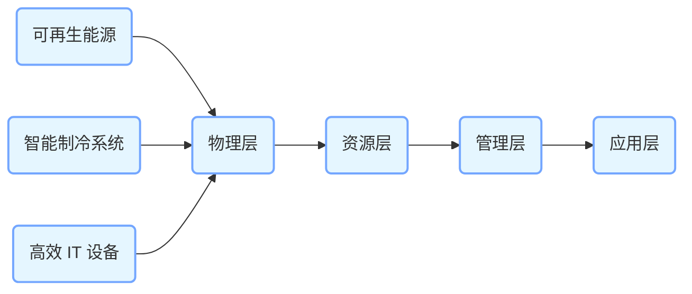

# 绿色数据中心技术的市场增长与投资前景

> 关键词：绿色数据中心技术、市场增长、投资前景、节能减排、可持续发展

> 摘要：本文深入探讨了绿色数据中心技术的市场增长与投资前景。首先介绍了绿色数据中心技术的背景，包括其目的、预期读者等内容。接着阐述了核心概念与联系，通过文本示意图和 Mermaid 流程图清晰展示其原理和架构。详细讲解了核心算法原理及具体操作步骤，结合数学模型和公式进行说明。通过项目实战案例，对代码实现和解读进行分析。探讨了绿色数据中心技术的实际应用场景，推荐了相关的工具和资源。最后总结了其未来发展趋势与挑战，解答了常见问题并给出扩展阅读和参考资料，旨在为关注绿色数据中心技术市场和投资的人士提供全面且深入的参考。

## 1. 背景介绍 
### 1.1 目的和范围
随着全球数字化进程的加速，数据中心的规模和数量不断增长，其能耗问题也日益凸显。绿色数据中心技术旨在降低数据中心的能源消耗，提高能源利用效率，减少对环境的影响，实现可持续发展。本文的范围涵盖绿色数据中心技术的各个方面，包括其核心概念、算法原理、实际应用、市场增长情况以及投资前景等，旨在为读者全面呈现绿色数据中心技术的全貌。

### 1.2 预期读者
本文预期读者包括数据中心行业从业者，如数据中心运营商、工程师等；对绿色技术和可持续发展感兴趣的投资者；关注节能减排和环境保护的政策制定者以及相关领域的研究人员等。

### 1.3 文档结构概述
本文首先介绍绿色数据中心技术的背景信息，让读者了解其产生的原因和意义。接着阐述核心概念与联系，帮助读者理解其基本原理和架构。然后详细讲解核心算法原理及具体操作步骤，并结合数学模型进行深入分析。通过项目实战案例，展示绿色数据中心技术在实际中的应用。探讨其实际应用场景，为读者提供更多的应用思路。推荐相关的工具和资源，方便读者进一步学习和研究。最后总结未来发展趋势与挑战，解答常见问题并给出扩展阅读和参考资料。

### 1.4 术语表
#### 1.4.1 核心术语定义
- **绿色数据中心**：指在其生命周期内，通过采用高效节能技术、可再生能源等手段，最大限度地降低能源消耗和对环境的影响，同时具备高可靠性、高可用性和高性能的新型数据中心。
- **PUE（Power Usage Effectiveness）**：即能源使用效率，是衡量数据中心能源效率的重要指标，定义为数据中心总能耗与 IT 设备能耗之比。PUE 值越接近 1，表示数据中心的能源效率越高。
- **制冷系统**：数据中心中用于冷却 IT 设备的系统，主要包括空调、冷水机组等设备，其能耗在数据中心总能耗中占比较大。
- **服务器虚拟化**：将物理服务器资源抽象成多个虚拟服务器，提高服务器资源的利用率，减少服务器数量，从而降低能源消耗。

#### 1.4.2 相关概念解释
- **节能减排**：指节约能源、降低能源消耗、减少污染物排放。在数据中心领域，节能减排主要通过采用高效节能技术、优化设备运行等方式实现。
- **可持续发展**：既满足当代人的需求，又不损害后代人满足其需求的能力的发展。绿色数据中心技术是数据中心行业实现可持续发展的重要途径。
- **可再生能源**：指在自然界中可以不断再生、永续利用的能源，如太阳能、风能、水能等。在数据中心中使用可再生能源可以减少对传统化石能源的依赖，降低碳排放。

#### 1.4.3 缩略词列表
- **PUE**：Power Usage Effectiveness（能源使用效率）
- **IT**：Information Technology（信息技术）
- **UPS**：Uninterruptible Power Supply（不间断电源）

## 2. 核心概念与联系 

绿色数据中心技术的核心概念主要围绕节能减排和可持续发展展开，涉及多个方面的技术和系统，它们相互关联、相互影响，共同构成了绿色数据中心的整体架构。

### 核心概念原理
绿色数据中心技术的核心原理是通过优化数据中心的各个环节，提高能源利用效率，减少能源消耗和对环境的影响。主要包括以下几个方面：
- **高效的 IT 设备**：采用低功耗、高性能的服务器、存储设备等 IT 硬件，减少设备本身的能耗。
- **智能的制冷系统**：根据数据中心的实际热负荷，智能调节制冷设备的运行，提高制冷效率，降低制冷能耗。
- **服务器虚拟化技术**：将物理服务器资源进行虚拟化，实现资源的动态分配和共享，提高服务器的利用率，减少服务器数量和能耗。
- **可再生能源的利用**：在数据中心中引入太阳能、风能等可再生能源，为数据中心提供部分或全部电力，减少对传统电网的依赖，降低碳排放。

### 架构的文本示意图
绿色数据中心的架构主要包括以下几个层次：
- **物理层**：包括数据中心的建筑、电力供应系统、制冷系统、服务器、存储设备等硬件设施。
- **资源层**：对物理层的资源进行抽象和管理，包括服务器虚拟化、存储虚拟化等技术，实现资源的动态分配和共享。
- **管理层**：负责对数据中心的资源进行监控、管理和优化，包括能源管理系统、设备管理系统等，确保数据中心的高效运行。
- **应用层**：运行各种业务应用系统，为用户提供服务。

### Mermaid 流程图


## 3. 核心算法原理 & 具体操作步骤 

### 核心算法原理
在绿色数据中心技术中，能源管理是一个关键环节，其中涉及到很多优化算法，以实现能源的高效利用。下面以基于预测的制冷系统控制算法为例进行讲解。

该算法的核心思想是通过对数据中心未来一段时间内的热负荷进行预测，提前调整制冷系统的运行参数，使制冷系统的制冷量与数据中心的热负荷相匹配，从而提高制冷效率，降低能耗。

### Python 源代码详细阐述
```python
import numpy as np
import pandas as pd
from sklearn.linear_model import LinearRegression
from sklearn.model_selection import train_test_split

# 模拟数据：读取历史热负荷数据
# 假设数据文件包含两列：时间和热负荷
data = pd.read_csv('heat_load_data.csv')
X = data['time'].values.reshape(-1, 1)
y = data['heat_load'].values

# 划分训练集和测试集
X_train, X_test, y_train, y_test = train_test_split(X, y, test_size=0.2, random_state=42)

# 创建线性回归模型
model = LinearRegression()

# 训练模型
model.fit(X_train, y_train)

# 预测未来一段时间内的热负荷
future_time = np.array([[max(X) + 1], [max(X) + 2], [max(X) + 3]])  # 假设预测未来 3 个时间点的热负荷
predicted_heat_load = model.predict(future_time)

# 根据预测的热负荷调整制冷系统的运行参数
# 这里简单假设制冷量与热负荷成正比，制冷系统的制冷量调整系数为 1.2
cooling_capacity = predicted_heat_load * 1.2

print("预测的热负荷：", predicted_heat_load)
print("调整后的制冷量：", cooling_capacity)
```

### 具体操作步骤
1. **数据收集**：收集数据中心的历史热负荷数据，包括时间和对应的热负荷值。
2. **数据预处理**：对收集到的数据进行清洗、归一化等预处理操作，以提高模型的训练效果。
3. **模型选择和训练**：选择合适的预测模型，如线性回归、决策树、神经网络等，并使用训练数据对模型进行训练。
4. **热负荷预测**：使用训练好的模型对未来一段时间内的数据中心热负荷进行预测。
5. **制冷系统参数调整**：根据预测的热负荷值，调整制冷系统的运行参数，如空调的温度设定、风机的转速等，使制冷系统的制冷量与热负荷相匹配。

## 4. 数学模型和公式 & 详细讲解 & 举例说明 

### 数学模型
在上述基于预测的制冷系统控制算法中，使用了线性回归模型。线性回归模型的数学表达式为：

$$y = \beta_0 + \beta_1x_1 + \beta_2x_2 + \cdots + \beta_nx_n + \epsilon$$

其中，$y$ 是因变量（在本例中为热负荷），$x_1, x_2, \cdots, x_n$ 是自变量（在本例中为时间），$\beta_0, \beta_1, \beta_2, \cdots, \beta_n$ 是回归系数，$\epsilon$ 是误差项。

### 详细讲解
线性回归模型的目标是找到一组回归系数 $\beta_0, \beta_1, \beta_2, \cdots, \beta_n$，使得预测值与实际值之间的误差平方和最小。误差平方和的表达式为：

$$S(\beta) = \sum_{i=1}^{m}(y_i - \hat{y}_i)^2 = \sum_{i=1}^{m}(y_i - (\beta_0 + \beta_1x_{i1} + \beta_2x_{i2} + \cdots + \beta_nx_{in}))^2$$

其中，$m$ 是样本数量，$y_i$ 是第 $i$ 个样本的实际值，$\hat{y}_i$ 是第 $i$ 个样本的预测值。

通过最小化误差平方和 $S(\beta)$，可以得到回归系数 $\beta_0, \beta_1, \beta_2, \cdots, \beta_n$ 的最优解。在实际应用中，可以使用最小二乘法来求解回归系数。

### 举例说明
假设我们有以下历史热负荷数据：

| 时间（小时） | 热负荷（千瓦） |
| ---- | ---- |
| 1 | 10 |
| 2 | 12 |
| 3 | 14 |
| 4 | 16 |
| 5 | 18 |

我们可以使用线性回归模型来预测未来时间的热负荷。首先，将时间作为自变量 $x$，热负荷作为因变量 $y$，建立线性回归模型：

$$y = \beta_0 + \beta_1x$$

使用最小二乘法求解回归系数 $\beta_0$ 和 $\beta_1$：

$$\beta_1 = \frac{\sum_{i=1}^{n}(x_i - \bar{x})(y_i - \bar{y})}{\sum_{i=1}^{n}(x_i - \bar{x})^2}$$

$$\beta_0 = \bar{y} - \beta_1\bar{x}$$

其中，$\bar{x}$ 和 $\bar{y}$ 分别是 $x$ 和 $y$ 的平均值。

计算可得：

$\bar{x} = \frac{1 + 2 + 3 + 4 + 5}{5} = 3$

$\bar{y} = \frac{10 + 12 + 14 + 16 + 18}{5} = 14$

$\sum_{i=1}^{5}(x_i - \bar{x})(y_i - \bar{y}) = (1 - 3)(10 - 14) + (2 - 3)(12 - 14) + (3 - 3)(14 - 14) + (4 - 3)(16 - 14) + (5 - 3)(18 - 14) = 20$

$\sum_{i=1}^{5}(x_i - \bar{x})^2 = (1 - 3)^2 + (2 - 3)^2 + (3 - 3)^2 + (4 - 3)^2 + (5 - 3)^2 = 10$

$\beta_1 = \frac{20}{10} = 2$

$\beta_0 = 14 - 2 \times 3 = 8$

所以，线性回归模型为：

$$y = 8 + 2x$$

假设我们要预测时间为 6 小时的热负荷，将 $x = 6$ 代入模型可得：

$y = 8 + 2 \times 6 = 20$（千瓦）

因此，预测时间为 6 小时的热负荷为 20 千瓦。

## 5. 项目实战：代码实际案例和详细解释说明 

### 5.1  开发环境搭建
- **操作系统**：推荐使用 Linux 系统，如 Ubuntu 18.04 或更高版本。
- **编程语言**：Python 3.7 或更高版本。
- **开发工具**：可以使用 PyCharm、Jupyter Notebook 等开发工具。
- **依赖库**：需要安装 pandas、numpy、scikit-learn 等库，可以使用以下命令进行安装：

```sh
pip install pandas numpy scikit-learn
```

### 5.2  源代码详细实现和代码解读
以下是一个完整的基于预测的制冷系统控制算法的 Python 代码示例：

```python
import numpy as np
import pandas as pd
from sklearn.linear_model import LinearRegression
from sklearn.model_selection import train_test_split

# 模拟数据：读取历史热负荷数据
# 假设数据文件包含两列：时间和热负荷
data = pd.read_csv('heat_load_data.csv')
X = data['time'].values.reshape(-1, 1)
y = data['heat_load'].values

# 划分训练集和测试集
X_train, X_test, y_train, y_test = train_test_split(X, y, test_size=0.2, random_state=42)

# 创建线性回归模型
model = LinearRegression()

# 训练模型
model.fit(X_train, y_train)

# 评估模型
score = model.score(X_test, y_test)
print("模型评估得分：", score)

# 预测未来一段时间内的热负荷
future_time = np.array([[max(X) + 1], [max(X) + 2], [max(X) + 3]])  # 假设预测未来 3 个时间点的热负荷
predicted_heat_load = model.predict(future_time)

# 根据预测的热负荷调整制冷系统的运行参数
# 这里简单假设制冷量与热负荷成正比，制冷系统的制冷量调整系数为 1.2
cooling_capacity = predicted_heat_load * 1.2

print("预测的热负荷：", predicted_heat_load)
print("调整后的制冷量：", cooling_capacity)
```

### 代码解读与分析
1. **数据读取**：使用 `pandas` 库的 `read_csv` 函数读取历史热负荷数据文件，并将时间和热负荷分别存储在 `X` 和 `y` 中。
2. **数据划分**：使用 `sklearn` 库的 `train_test_split` 函数将数据划分为训练集和测试集，测试集占比为 20%。
3. **模型创建和训练**：创建一个线性回归模型 `LinearRegression`，并使用训练数据对模型进行训练。
4. **模型评估**：使用测试数据对训练好的模型进行评估，计算模型的评估得分，得分越高表示模型的预测效果越好。
5. **热负荷预测**：使用训练好的模型对未来一段时间内的数据中心热负荷进行预测。
6. **制冷系统参数调整**：根据预测的热负荷值，调整制冷系统的运行参数，这里简单假设制冷量与热负荷成正比，制冷系统的制冷量调整系数为 1.2。

## 6. 实际应用场景 
绿色数据中心技术在多个领域都有广泛的应用，以下是一些常见的实际应用场景：
- **互联网企业**：互联网企业拥有大量的数据中心，用于存储和处理用户数据。采用绿色数据中心技术可以降低能源消耗，减少运营成本，提高企业的竞争力。例如，谷歌、亚马逊等互联网巨头都在积极推广绿色数据中心技术，通过采用高效的 IT 设备、智能的制冷系统和可再生能源等手段，实现数据中心的节能减排。
- **金融机构**：金融机构对数据的安全性和可靠性要求极高，其数据中心需要 24 小时不间断运行。绿色数据中心技术可以提高数据中心的能源效率，降低能源成本，同时减少对环境的影响。例如，银行、证券等金融机构可以采用服务器虚拟化技术，提高服务器的利用率，减少服务器数量，从而降低能源消耗。
- **政府部门**：政府部门的数据中心通常存储着大量的敏感信息，对数据的安全性和可靠性要求也很高。采用绿色数据中心技术可以提高数据中心的能源效率，降低运营成本，同时符合政府的节能减排政策。例如，政府的数据中心可以采用智能的能源管理系统，实时监控和优化数据中心的能源消耗。
- **科研机构**：科研机构的数据中心通常需要处理大量的科研数据，其计算任务繁重，能源消耗也较大。绿色数据中心技术可以提高数据中心的计算效率，降低能源消耗，为科研工作提供更好的支持。例如，科研机构可以采用高效的并行计算技术和可再生能源，提高数据中心的性能和可持续性。

## 7. 工具和资源推荐
### 7.1 学习资源推荐
#### 7.1.1 书籍推荐
- 《绿色数据中心