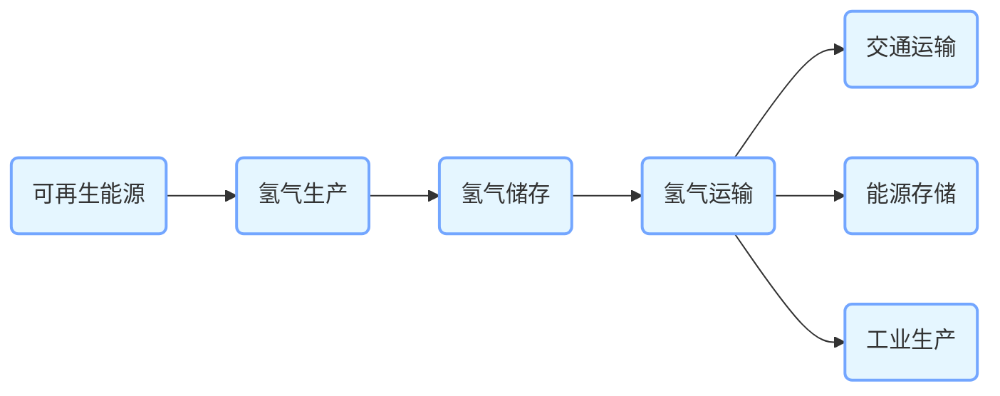

# 绿色氢能产业链的投资机会分析

> 关键词：绿色氢能、产业链、投资机会、能源转型、市场前景

> 摘要：本文聚焦于绿色氢能产业链的投资机会分析。首先介绍了绿色氢能的背景，包括其在能源转型中的重要性、预期读者以及文档结构。接着阐述了绿色氢能相关的核心概念与联系，通过文本示意图和 Mermaid 流程图展示其原理和架构。详细讲解了核心算法原理及具体操作步骤，用 Python 代码进行说明。分析了相关的数学模型和公式，并举例解释。通过项目实战案例，包括开发环境搭建、源代码实现和解读，深入剖析绿色氢能产业链的实际应用。探讨了绿色氢能在不同场景的实际应用，推荐了学习、开发工具框架以及相关论文著作等资源。最后总结了绿色氢能产业链的未来发展趋势与挑战，解答常见问题，并提供扩展阅读和参考资料，旨在为投资者提供全面的绿色氢能产业链投资分析。

## 1. 背景介绍 
### 1.1 目的和范围
随着全球对气候变化问题的关注度不断提高，以及对传统化石能源依赖所带来的环境和能源安全问题的日益担忧，清洁能源的开发和利用成为了全球能源发展的重要方向。绿色氢能作为一种极具潜力的清洁能源，在能源转型中扮演着关键角色。本文的目的是深入分析绿色氢能产业链的投资机会，为投资者提供全面、深入的信息和分析，帮助他们了解绿色氢能产业链的各个环节、市场前景、技术发展趋势以及潜在的投资风险和回报。

本文的范围涵盖了绿色氢能产业链的各个方面，包括上游的氢气生产、中游的氢气储存和运输，以及下游的氢气应用。同时，还将分析绿色氢能产业链相关的政策环境、市场需求、技术创新等因素对投资机会的影响。

### 1.2 预期读者
本文的预期读者主要包括以下几类人群：
1. **投资者**：包括个人投资者、机构投资者、风险投资公司等，他们对绿色氢能产业链的投资机会感兴趣，希望通过本文了解该领域的投资前景、风险和回报。
2. **能源行业从业者**：包括氢能企业的管理人员、技术人员、市场营销人员等，他们希望通过本文了解绿色氢能产业链的最新发展动态、技术趋势和市场需求，为企业的战略决策和业务发展提供参考。
3. **政策制定者**：包括政府部门的官员、政策研究机构的人员等，他们希望通过本文了解绿色氢能产业链的发展现状和面临的问题，为制定相关的政策和规划提供依据。
4. **科研人员**：包括高校、科研机构的研究人员等，他们希望通过本文了解绿色氢能产业链的技术创新方向和研究热点，为开展相关的科研工作提供参考。

### 1.3 文档结构概述
本文将按照以下结构进行组织：
1. **背景介绍**：介绍绿色氢能产业链投资机会分析的目的和范围、预期读者以及文档结构概述。
2. **核心概念与联系**：阐述绿色氢能的核心概念、原理和架构，通过文本示意图和 Mermaid 流程图展示其产业链的各个环节及其相互关系。
3. **核心算法原理 & 具体操作步骤**：讲解与绿色氢能产业链相关的核心算法原理，如氢气生产过程中的电解水算法，并使用 Python 源代码进行详细阐述，同时说明具体的操作步骤。
4. **数学模型和公式 & 详细讲解 & 举例说明**：分析绿色氢能产业链中的数学模型和公式，如氢气生产成本的计算模型，进行详细讲解并举例说明。
5. **项目实战：代码实际案例和详细解释说明**：通过实际的项目案例，介绍绿色氢能产业链项目的开发环境搭建、源代码详细实现和代码解读，帮助读者更好地理解和应用相关技术。
6. **实际应用场景**：探讨绿色氢能在不同领域的实际应用场景，如交通运输、能源存储、工业生产等，分析其市场需求和发展前景。
7. **工具和资源推荐**：推荐与绿色氢能产业链相关的学习资源、开发工具框架以及论文著作等，帮助读者进一步深入学习和研究该领域。
8. **总结：未来发展趋势与挑战**：总结绿色氢能产业链的未来发展趋势，分析其面临的挑战和机遇，为投资者提供决策参考。
9. **附录：常见问题与解答**：解答读者在绿色氢能产业链投资方面常见的问题，帮助他们更好地理解和把握相关知识。
10. **扩展阅读 & 参考资料**：提供与绿色氢能产业链相关的扩展阅读材料和参考资料，方便读者进一步深入学习和研究。

### 1.4 术语表
#### 1.4.1 核心术语定义
1. **绿色氢能**：是指通过可再生能源（如太阳能、风能、水能等）电解水产生的氢气，其生产过程不产生温室气体排放，是一种清洁、可持续的能源。
2. **产业链**：是指在一种最终产品的生产加工过程中，从最初的自然资源到最终产品到达消费者手中，所包含的各个环节所构成的整个链条。绿色氢能产业链包括氢气生产、储存、运输、应用等多个环节。
3. **电解水制氢**：是指通过电解的方式将水分解成氢气和氧气的过程。在电解水制氢过程中，电能被转化为化学能，储存于氢气中。
4. **氢气储运**：是指将生产出来的氢气进行储存和运输的过程。常见的氢气储运方式包括气态储运、液态储运和固态储运等。
5. **燃料电池**：是一种将燃料（如氢气）和氧化剂（如氧气）的化学能直接转化为电能的装置。燃料电池具有高效、清洁、安静等优点，在交通运输、分布式发电等领域具有广泛的应用前景。

#### 1.4.2 相关概念解释
1. **能源转型**：是指从传统的化石能源向清洁能源的转变过程。能源转型的目的是减少对化石能源的依赖，降低温室气体排放，实现能源的可持续发展。
2. **可再生能源**：是指在自然界中可以不断再生、永续利用的能源，如太阳能、风能、水能、生物能等。可再生能源具有清洁、无污染、分布广泛等优点，是未来能源发展的重要方向。
3. **低碳经济**：是指以低能耗、低污染、低排放为基础的经济模式。低碳经济的核心是能源技术创新、制度创新和人类生存发展观念的根本性转变。
4. **氢经济**：是指以氢气为主要能源载体的经济模式。在氢经济中，氢气将广泛应用于交通运输、能源存储、工业生产等各个领域，成为未来能源体系的重要组成部分。

#### 1.4.3 缩略词列表
1. **PEM**：Proton Exchange Membrane，质子交换膜
2. **SOEC**：Solid Oxide Electrolysis Cell，固体氧化物电解池
3. **FCV**：Fuel Cell Vehicle，燃料电池汽车
4. **GHG**：Greenhouse Gas，温室气体

## 2. 核心概念与联系 
### 绿色氢能的核心概念
绿色氢能是通过可再生能源电解水制取的氢气，其核心在于利用太阳能、风能、水能等清洁能源产生的电力，将水分子分解为氢气和氧气。与传统的化石能源制氢相比，绿色氢能的生产过程几乎不产生温室气体排放，具有清洁、可持续的特点，是实现能源转型和应对气候变化的重要途径。

### 绿色氢能产业链架构
绿色氢能产业链主要包括上游的氢气生产、中游的氢气储存和运输以及下游的氢气应用三个环节，各环节相互关联、相互影响，共同构成了一个完整的产业链体系。

#### 上游：氢气生产
氢气生产是绿色氢能产业链的起点，主要通过电解水的方式制取氢气。常见的电解水技术包括质子交换膜电解水（PEM）和固体氧化物电解池（SOEC）等。PEM 电解水具有响应速度快、效率高、启停灵活等优点，适用于可再生能源波动性较大的场景；SOEC 电解水则具有较高的电解效率和较低的能耗，在高温条件下运行，适合大规模制氢。

#### 中游：氢气储存和运输
氢气储存和运输是连接氢气生产和应用的关键环节。由于氢气具有低密度、易燃、易爆等特性，其储存和运输面临着诸多挑战。目前，常见的氢气储存方式包括气态储存、液态储存和固态储存等；氢气运输方式主要有管道运输、公路运输和铁路运输等。

#### 下游：氢气应用
氢气应用是绿色氢能产业链的最终目标，涵盖了交通运输、能源存储、工业生产等多个领域。在交通运输领域，氢气可作为燃料电池汽车的燃料，实现零排放、高效率的交通运输；在能源存储领域，氢气可作为储能介质，将可再生能源的多余电力转化为氢气储存起来，在需要时再将氢气转化为电能，实现能源的稳定供应；在工业生产领域，氢气可作为化工原料，用于合成氨、甲醇等化工产品，替代传统的化石能源，降低工业生产的碳排放。

### 文本示意图
```plaintext
绿色氢能产业链
|-- 上游：氢气生产
|   |-- 可再生能源（太阳能、风能、水能等）
|   |-- 电解水技术（PEM、SOEC 等）
|-- 中游：氢气储存和运输
|   |-- 储存方式（气态、液态、固态）
|   |-- 运输方式（管道、公路、铁路）
|-- 下游：氢气应用
|   |-- 交通运输（燃料电池汽车等）
|   |-- 能源存储
|   |-- 工业生产（合成氨、甲醇等）
```

### Mermaid 流程图


## 3. 核心算法原理 & 具体操作步骤 
### 核心算法原理：电解水制氢算法
电解水制氢的基本原理是在直流电的作用下，水分子在电极表面发生氧化还原反应，分解为氢气和氧气。其化学反应方程式如下：
$$
2H_2O \xrightarrow{电解} 2H_2 \uparrow + O_2 \uparrow
$$

在实际的电解水过程中，电解效率是一个重要的指标，它反映了电能转化为化学能的效率。电解效率 $\eta$ 可以通过以下公式计算：
$$
\eta = \frac{m_{H_2} \times \Delta H_{H_2}}{W_{电}} \times 100\%
$$
其中，$m_{H_2}$ 是实际产生的氢气质量，$\Delta H_{H_2}$ 是氢气的燃烧热，$W_{电}$ 是消耗的电能。

### Python 代码实现
```python
# 定义氢气的燃烧热（单位：kJ/g）
delta_H_H2 = 142

def calculate_electrolysis_efficiency(m_H2, W_electric):
    """
    计算电解水制氢的效率
    :param m_H2: 实际产生的氢气质量（单位：g）
    :param W_electric: 消耗的电能（单位：kJ）
    :return: 电解效率（百分比）
    """
    efficiency = (m_H2 * delta_H_H2 / W_electric) * 100
    return efficiency

# 示例数据
m_H2_example = 10  # 实际产生的氢气质量为 10g
W_electric_example = 2000  # 消耗的电能为 2000kJ

# 计算电解效率
efficiency_example = calculate_electrolysis_efficiency(m_H2_example, W_electric_example)
print(f"电解效率为: {efficiency_example:.2f}%")
```

### 具体操作步骤
1. **数据收集**：收集实际产生的氢气质量 $m_{H_2}$ 和消耗的电能 $W_{电}$ 等数据。
2. **调用函数**：将收集到的数据作为参数传入 `calculate_electrolysis_efficiency` 函数中，计算电解效率。
3. **结果输出**：打印计算得到的电解效率，结果以百分比形式显示。

## 4. 数学模型和公式 & 详细讲解 & 举例说明 
### 氢气生产成本计算模型
氢气生产成本是影响绿色氢能产业链投资决策的重要因素之一。氢气生产成本主要包括电力成本、设备投资成本、运维成本等。以下是一个简化的氢气生产成本计算模型：
$$
C_{H_2} = \frac{C_{电} \times W_{电}}{m_{H_2}} + \frac{C_{设备}}{n \times m_{H_2}} + \frac{C_{运维}}{m_{H_2}}
$$
其中，$C_{H_2}$ 是氢气生产成本（单位：元/kg），$C_{电}$ 是电价（单位：元/kWh），$W_{电}$ 是生产 1kg 氢气消耗的电能（单位：kWh/kg），$C_{设备}$ 是设备投资成本（单位：元），$n$ 是设备的使用寿命（单位：年），$C_{运维}$ 是每年的运维成本（单位：元）。

### 详细讲解
1. **电力成本**：$C_{电} \times W_{电}$ 表示生产 1kg 氢气所需的电力成本。电价 $C_{电}$ 是影响电力成本的关键因素，不同地区的电价差异较大。生产 1kg 氢气消耗的电能 $W_{电}$ 与电解水技术的效率有关，效率越高，消耗的电能越少。
2. **设备投资成本**：$\frac{C_{设备}}{n \times m_{H_2}}$ 表示设备投资成本分摊到每千克氢气上的费用。设备投资成本 $C_{设备}$ 包括电解槽、电源、控制系统等设备的购置和安装费用。设备的使用寿命 $n$ 越长，分摊到每千克氢气上的设备投资成本越低。
3. **运维成本**：$\frac{C_{运维}}{m_{H_2}}$ 表示每年的运维成本分摊到每千克氢气上的费用。运维成本 $C_{运维}$ 包括设备的维修、保养、更换零部件等费用。

### 举例说明
假设某绿色氢能项目采用 PEM 电解水技术，生产 1kg 氢气消耗的电能为 50kWh/kg，电价为 0.5 元/kWh，设备投资成本为 100 万元，设备的使用寿命为 10 年，每年的运维成本为 10 万元。则该项目的氢气生产成本计算如下：

首先，计算电力成本：
$$
C_{电} \times W_{电} = 0.5 \times 50 = 25 \text{（元/kg）}
$$

然后，计算设备投资成本分摊：
$$
\frac{C_{设备}}{n \times m_{H_2}} = \frac{1000000}{10 \times 1000} = 100 \text{（元/kg）}
$$

最后，计算运维成本分摊：
$$
\frac{C_{运维}}{m_{H_2}} = \frac{100000}{1000} = 100 \text{（元/kg）}
$$

将上述三项成本相加，得到氢气生产成本：
$$
C_{H_2} = 25 + 100 + 100 = 225 \text{（元/kg）}
$$

通过这个例子可以看出，设备投资成本和运维成本在氢气生产成本中占比较大，降低设备投资成本和运维成本是降低氢气生产成本的关键。

## 5. 项目实战：代码实际案例和详细解释说明 
### 5.1  开发环境搭建
#### 硬件环境
为了进行绿色氢能产业链相关项目的开发，需要具备以下硬件环境：
1. **计算机**：建议使用性能较好的台式机或笔记本电脑，具备足够的内存和处理器性能，以运行相关的开发工具和模拟软件。
2. **服务器（可选）**：如果需要进行大规模的数据处理和模拟计算，可以考虑使用服务器。服务器可以提供更高的计算能力和存储容量。

#### 软件环境
1. **操作系统**：推荐使用 Linux 操作系统，如 Ubuntu、CentOS 等，因为 Linux 系统具有稳定性高、开源免费、易于定制等优点。也可以使用 Windows 操作系统，但需要注意相关软件的兼容性。
2. **编程语言**：Python 是一种广泛应用于数据分析、机器学习、科学计算等领域的编程语言，在绿色氢能产业链项目开发中也非常适用。建议安装 Python 3.7 及以上版本。
3. **开发工具**：推荐使用 PyCharm 作为 Python 开发工具，它具有代码编辑、调试、自动补全、版本控制等功能，能够提高开发效率。也可以使用 Jupyter Notebook 进行交互式编程和数据分析。
4. **数据库（可选）**：如果需要存储和管理大量的数据，可以使用数据库管理系统，如 MySQL、PostgreSQL 等。

### 5.2  源代码详细实现和代码解读
#### 项目需求
假设我们要开发一个绿色氢能项目的氢气产量预测系统，根据历史的可再生能源发电量和电解水设备运行参数，预测未来一段时间内的氢气产量。

#### 源代码实现
```python
import pandas as pd
from sklearn.model_selection import train_test_split
from sklearn.linear_model import LinearRegression
from sklearn.metrics import mean_squared_error

# 读取历史数据
data = pd.read_csv('hydrogen_production_data.csv')

# 提取特征和目标变量
X = data[['renewable_energy_generation', 'electrolyzer_power']]
y = data['hydrogen_production']

# 划分训练集和测试集
X_train, X_test, y_train, y_test = train_test_split(X, y, test_size=0.2, random_state=42)

# 创建线性回归模型
model = LinearRegression()

# 训练模型
model.fit(X_train, y_train)

# 预测测试集数据
y_pred = model.predict(X_test)

# 计算均方误差
mse = mean_squared_error(y_test, y_pred)
print(f"均方误差: {mse}")

# 预测未来氢气产量
future_data = pd.DataFrame({
    'renewable_energy_generation': [1000, 1200],
    'electrolyzer_power': [500, 600]
})
future_hydrogen_production = model.predict(future_data)
print(f"未来氢气产量预测: {future_hydrogen_production}")
```

#### 代码解读
1. **数据读取**：使用 `pandas` 库的 `read_csv` 函数读取历史数据文件 `hydrogen_production_data.csv`，该文件包含了可再生能源发电量、电解水设备功率和氢气产量等信息。
2. **特征提取和目标变量选择**：从数据中提取可再生能源发电量和电解水设备功率作为特征变量 $X$，氢气产量作为目标变量 $y$。
3. **数据集划分**：使用 `sklearn` 库的 `train_test_split` 函数将数据集划分为训练集和测试集，测试集占比为 20%。
4. **模型创建和训练**：创建一个线性回归模型 `LinearRegression`，并使用训练集数据对模型进行训练。
5. **模型预测和评估**：使用训练好的模型对测试集数据进行预测，并计算预测结果的均方误差 `mse`，用于评估模型的性能。
6. **未来氢气产量预测**：创建一个包含未来可再生能源发电量和电解水设备功率的数据集 `future_data`，使用训练好的模型对未来氢气产量进行预测，并打印预测结果。

### 5.3  代码解读与分析
#### 模型选择
线性回归模型是一种简单而有效的机器学习模型，适用于预测连续变量。在本项目中，氢气产量是一个连续变量，且可再生能源发电量和电解水设备功率与氢气产量之间可能存在线性关系，因此选择线性回归模型进行预测是合理的。

#### 模型评估
均方误差（MSE）是一种常用的回归模型评估指标，它衡量了预测值与真实值之间的平均误差平方。MSE 值越小，说明模型的预测性能越好。在本项目中，通过计算均方误差可以评估线性回归模型的预测精度。

#### 局限性和改进方向
本项目的线性回归模型存在一定的局限性，例如它假设特征变量与目标变量之间存在线性关系，而实际情况可能更加复杂。为了提高模型的预测性能，可以考虑使用更复杂的机器学习模型，如决策树、随机森林、神经网络等，或者对特征变量进行进一步的处理和特征工程。

## 6. 实际应用场景 
### 交通运输领域
#### 燃料电池汽车
燃料电池汽车是绿色氢能在交通运输领域的典型应用。燃料电池汽车以氢气为燃料，通过燃料电池将氢气和氧气的化学能直接转化为电能，驱动车辆行驶。与传统的燃油汽车相比，燃料电池汽车具有零排放、高效率、续航里程长等优点，是未来交通运输的重要发展方向。

目前，全球各大汽车制造商都在积极开展燃料电池汽车的研发和生产。例如，丰田的 Mirai、本田的 Clarity Fuel Cell 等车型已经实现了商业化量产。随着氢气基础设施的不断完善和燃料电池技术的不断进步，燃料电池汽车的市场份额有望逐步扩大。

#### 氢动力火车和船舶
除了燃料电池汽车，绿色氢能还可以应用于火车和船舶等交通运输工具。氢动力火车和船舶具有零排放、低噪音等优点，适用于长途运输和内河航运等领域。例如，德国的阿尔斯通公司已经推出了氢动力火车 Coradia iLint，该火车以氢气为燃料，实现了零排放运行。

### 能源存储领域
#### 可再生能源储能
可再生能源（如太阳能、风能等）具有间歇性和波动性的特点，给电网的稳定运行带来了挑战。绿色氢能可以作为一种储能介质，将可再生能源的多余电力转化为氢气储存起来，在需要时再将氢气转化为电能，实现能源的稳定供应。

例如，在风力发电场中，当风力较大、发电量超过电网需求时，可以将多余的电力用于电解水制氢，将氢气储存起来；当风力较小、发电量不足时，可以通过燃料电池将储存的氢气转化为电能，补充电网的电力需求。

#### 分布式能源系统
绿色氢能还可以应用于分布式能源系统，为偏远地区或独立建筑物提供能源供应。分布式能源系统通常由可再生能源发电设备、氢气生产设备、氢气储存设备和燃料电池等组成，能够实现能源的自给自足和高效利用。

例如，在一些偏远的岛屿或山区，可以建设分布式能源系统，利用当地的太阳能、风能等可再生能源发电，通过电解水制氢将多余的电力储存起来，在需要时通过燃料电池将氢气转化为电能，为当地居民和企业提供电力供应。

### 工业生产领域
#### 化工原料
氢气是一种重要的化工原料，广泛应用于合成氨、甲醇、石油炼制等化工生产过程。传统的化工生产过程通常使用化石能源作为原料，产生大量的温室气体排放。绿色氢能可以替代化石能源作为化工原料，降低化工生产的碳排放。

例如，在合成氨生产过程中，传统的方法是使用天然气作为原料，通过蒸汽重整反应制取氢气，然后与氮气反应合成氨。而采用绿色氢能作为原料，可以通过电解水制取氢气，实现合成氨生产的零排放。

#### 金属冶炼
氢气还可以用于金属冶炼过程，替代传统的焦炭和煤炭作为还原剂。在金属冶炼过程中，使用氢气作为还原剂可以减少二氧化碳排放，提高金属的纯度和质量。

例如，在钢铁冶炼过程中，使用氢气直接还原铁矿石可以生产出高纯度的海绵铁，然后通过电炉炼钢工艺生产出高质量的钢铁产品。这种氢气直接还原铁工艺具有节能减排、环保等优点，是未来钢铁工业发展的重要方向。

## 7. 工具和资源推荐
### 7.1 学习资源推荐
#### 7.1.1 书籍推荐
1. 《氢能与燃料电池技术》：本书系统地介绍了氢能与燃料电池的基本原理、技术发展现状和应用前景，涵盖了氢气的生产、储存、运输、应用以及燃料电池的工作原理、性能优化等方面的内容，是一本全面了解氢能与燃料电池技术的优秀书籍。
2. 《可再生能源概论》：本书全面介绍了太阳能、风能、水能、生物质能等可再生能源的基本原理、技术特点和应用现状，同时也涉及了可再生能源与氢能的结合应用，对于理解绿色氢能在能源转型中的作用具有重要的参考价值。
3. 《能源经济学》：本书从经济学的角度出发，分析了能源市场的供求关系、价格形成机制、能源政策等问题，对于研究绿色氢能产业链的投资机会和市场前景具有重要的指导意义。

#### 7.1.2 在线课程
1. Coursera 平台上的 “Hydrogen and Fuel Cells” 课程：该课程由美国加州大学欧文分校的教授授课，系统地介绍了氢能与燃料电池的基本原理、技术发展现状和应用前景，通过视频讲解、案例分析、在线讨论等方式，帮助学习者深入了解氢能与燃料电池技术。
2. edX 平台上的 “Renewable Energy: Science and Engineering” 课程：该课程由澳大利亚新南威尔士大学的教授授课，全面介绍了太阳能、风能、水能等可再生能源的科学原理、工程技术和应用实践，同时也涉及了可再生能源与氢能的结合应用，对于学习者理解绿色氢能在能源转型中的作用具有重要的帮助。
3. 中国大学 MOOC 平台上的 “能源与可持续发展” 课程：该课程由清华大学的教授授课，从能源的基本概念、能源与环境的关系、能源转型的必要性等方面入手，系统地介绍了可再生能源、核能、氢能等清洁能源的发展现状和未来趋势，对于学习者了解绿色氢能产业链的背景和意义具有重要的指导作用。

#### 7.1.3 技术博客和网站
1. Hydrogen Council（https://www.hydrogencouncil.com/）：国际氢能委员会的官方网站，提供了全球氢能产业的最新动态、政策法规、研究报告等信息，是了解全球氢能产业发展趋势的重要平台。
2. International Energy Agency（https://www.iea.org/）：国际能源署的官方网站，提供了全球能源市场的统计数据、分析报告、政策建议等信息，其中也包括了氢能产业的相关内容，对于研究绿色氢能产业链的市场前景和政策环境具有重要的参考价值。
3. Clean Energy Wire（https://www.cleanenergywire.org/）：一个专注于清洁能源领域的新闻和信息平台，提供了德国和欧洲地区清洁能源政策、技术创新、市场动态等方面的最新消息，对于了解欧洲绿色氢能产业的发展情况具有重要的帮助。

### 7.2 开发工具框架推荐
#### 7.2.1 IDE和编辑器
1. PyCharm：一款专业的 Python 集成开发环境（IDE），具有代码编辑、调试、自动补全、版本控制等功能，支持多种 Python 框架和库，是 Python 开发的首选工具。
2. Jupyter Notebook：一个交互式的编程环境，支持多种编程语言，如 Python、R、Julia 等。Jupyter Notebook 以网页的形式展示代码、文本、图表等内容，方便用户进行数据分析、模型训练和结果展示，在数据科学和机器学习领域得到了广泛的应用。
3. Visual Studio Code：一款轻量级的代码编辑器，支持多种编程语言和插件扩展。Visual Studio Code 具有丰富的功能和良好的用户体验，适合初学者和有经验的开发者使用。

#### 7.2.2 调试和性能分析工具
1. Py-Spy：一个用于 Python 代码性能分析的工具，它可以实时监控 Python 程序的 CPU 使用率、函数调用次数等信息，帮助开发者找出代码中的性能瓶颈。
2. cProfile：Python 标准库中的一个性能分析模块，它可以统计 Python 程序中各个函数的执行时间、调用次数等信息，帮助开发者分析代码的性能。
3. PDB：Python 标准库中的一个调试模块，它可以在 Python 程序中设置断点、单步执行代码、查看变量值等，帮助开发者调试代码中的错误。

#### 7.2.3 相关框架和库
1. Pandas：一个用于数据处理和分析的 Python 库，提供了高效的数据结构和数据操作方法，如数据读取、清洗、转换、分析等，是数据科学和机器学习领域常用的工具之一。
2. NumPy：一个用于科学计算的 Python 库，提供了高效的多维数组对象和数学函数，如数组运算、线性代数、随机数生成等，是 Python 科学计算的基础库。
3. Scikit-learn：一个用于机器学习的 Python 库，提供了丰富的机器学习算法和工具，如分类、回归、聚类、降维等，支持数据预处理、模型选择、模型评估等功能，是机器学习领域常用的工具之一。

### 7.3 相关论文著作推荐
#### 7.3.1 经典论文
1. “The Future of Hydrogen: Seizing Today’s Opportunities”：国际能源署发布的一份报告，全面分析了氢能在全球能源转型中的作用和潜力，探讨了氢能产业链的各个环节，包括氢气生产、储存、运输、应用等方面的技术发展现状和未来趋势，是研究绿色氢能产业链的重要参考资料。
2. “Hydrogen Energy: Opportunities and Challenges”：发表在《Energy & Environmental Science》杂志上的一篇综述论文，系统地介绍了氢能的基本原理、技术发展现状和应用前景，分析了氢能在能源存储、交通运输、工业生产等领域的应用潜力和面临的挑战，对于了解氢能产业的发展动态具有重要的参考价值。
3. “A Review of Hydrogen Storage Technologies for Mobile and Stationary Applications”：发表在《Journal of Power Sources》杂志上的一篇综述论文，全面回顾了氢气储存技术的发展历程和现状，分析了各种氢气储存技术的优缺点和应用场景，对于研究氢气储存技术具有重要的指导意义。

#### 7.3.2 最新研究成果
1. “Highly Efficient and Stable NiFe-Based Oxygen Evolution Reaction Catalysts for Alkaline Water Electrolysis”：发表在《Journal of the American Chemical Society》杂志上的一篇研究论文，报道了一种高效稳定的镍铁基析氧反应催化剂，可用于碱性水电解制氢，提高了电解水制氢的效率和稳定性。
2. “A Review of Proton Exchange Membrane Fuel Cells: Technology, Applications, and Challenges”：发表在《Renewable and Sustainable Energy Reviews》杂志上的一篇综述论文，总结了质子交换膜燃料电池的技术发展现状、应用领域和面临的挑战，对于研究质子交换膜燃料电池技术具有重要的参考价值。
3. “Hydrogen Storage in Metal-Organic Frameworks: A Review”：发表在《Chemical Reviews》杂志上的一篇综述论文，全面介绍了金属有机框架材料在氢气储存领域的应用研究进展，分析了金属有机框架材料的结构特点、氢气储存性能和储存机制，对于研究氢气储存新材料具有重要的指导意义。

#### 7.3.3 应用案例分析
1. “Hydrogen Fuel Cell Buses in China: A Case Study”：发表在《Journal of Cleaner Production》杂志上的一篇案例分析论文，以中国的氢燃料电池公交车项目为例，分析了氢燃料电池公交车的技术性能、运营成本、环境效益等方面的情况，为氢燃料电池公交车的推广应用提供了参考。
2. “The Application of Hydrogen Energy in Industrial Parks: A Case Study of Zhangjiagang Free Trade Port Area”：发表在《Energy Strategy Reviews》杂志上的一篇案例分析论文，以张家港保税港区为例，介绍了氢能在工业园区的应用实践，分析了氢能在工业园区的能源供应、节能减排、产业升级等方面的作用和效益，为氢能在工业园区的推广应用提供了借鉴。
3. “A Case Study of a Hydrogen-Powered Ferry: Technical and Economic Analysis”：发表在《Marine Technology and SNAME News》杂志上的一篇案例分析论文，以一艘氢动力渡轮为例，分析了氢动力渡轮的技术性能、运营成本、经济效益等方面的情况，为氢动力船舶的推广应用提供了参考。

## 8. 总结：未来发展趋势与挑战
### 未来发展趋势
#### 技术创新推动成本下降
随着电解水技术、氢气储存和运输技术、燃料电池技术等的不断创新和进步，绿色氢能的生产成本将逐渐降低。例如，新型电解水催化剂的研发和应用将提高电解水制氢的效率，降低电力消耗；先进的氢气储存材料和技术将提高氢气的储存密度和安全性，降低储存成本；高性能燃料电池的开发将提高燃料电池的效率和寿命，降低燃料电池汽车的成本。

#### 市场需求不断增长
随着全球对气候变化问题的关注度不断提高，以及对清洁能源的需求不断增加，绿色氢能的市场需求将呈现出快速增长的趋势。在交通运输领域，燃料电池汽车、氢动力火车和船舶等的市场份额将逐步扩大；在能源存储领域，绿色氢能将作为一种重要的储能介质，为可再生能源的大规模应用提供支持；在工业生产领域，绿色氢能将替代化石能源作为化工原料和还原剂，降低工业生产的碳排放。

#### 产业链协同发展
绿色氢能产业链的各个环节将实现更加紧密的协同发展。上游的氢气生产企业将与中游的氢气储存和运输企业、下游的氢气应用企业建立更加稳定的合作关系，实现产业链的一体化发展。同时，政府、企业、科研机构等各方将加强合作，共同推动绿色氢能产业链的技术创新、市场培育和政策支持，促进绿色氢能产业的健康发展。

### 面临的挑战
#### 技术瓶颈
虽然绿色氢能技术在近年来取得了显著的进展，但仍然面临着一些技术瓶颈。例如，电解水制氢的效率和成本仍然有待进一步提高；氢气储存和运输的安全性和经济性仍然是制约氢气大规模应用的关键因素；燃料电池的性能和寿命仍然需要进一步提升。

#### 基础设施建设滞后
绿色氢能的大规模应用需要完善的基础设施支持，包括氢气生产设施、氢气储存设施、氢气运输管道、加氢站等。目前，全球范围内的氢气基础设施建设仍然相对滞后，这在一定程度上限制了绿色氢能的市场推广和应用。

#### 政策支持不足
绿色氢能产业的发展离不开政府的政策支持。目前，虽然一些国家和地区已经出台了相关的政策措施，鼓励绿色氢能产业的发展，但整体上政策支持力度仍然不足。例如，缺乏明确的氢能发展规划和目标，补贴政策不够完善，标准和规范体系不够健全等。

#### 市场竞争力不足
与传统的化石能源相比，绿色氢能的成本仍然较高，市场竞争力不足。在当前的能源市场环境下，消费者更倾向于选择价格较低的化石能源产品，这给绿色氢能的市场推广和应用带来了一定的困难。

## 9. 附录：常见问题与解答
### 问题 1：绿色氢能与其他氢能有什么区别？
绿色氢能是通过可再生能源电解水制取的氢气，其生产过程不产生温室气体排放，是一种清洁、可持续的能源。而其他氢能，如灰氢和蓝氢，通常是通过化石能源（如天然气、煤炭等）制取的氢气，生产过程中会产生一定量的温室气体排放。虽然蓝氢在生产过程中采用了碳捕集和封存技术，可以减少温室气体排放，但仍然无法实现零排放。

### 问题 2：绿色氢能的生产成本为什么这么高？
绿色氢能的生产成本较高主要是由以下几个因素造成的：
1. **电力成本**：电解水制氢需要消耗大量的电能，而可再生能源发电的成本相对较高，导致电力成本在氢气生产成本中占比较大。
2. **设备投资成本**：电解水制氢设备、氢气储存和运输设备等的投资成本较高，需要大量的资金投入。
3. **运维成本**：氢气生产、储存和运输过程中的运维成本也较高，包括设备的维修、保养、更换零部件等费用。

### 问题 3：绿色氢能在交通运输领域的应用前景如何？
绿色氢能在交通运输领域具有广阔的应用前景。燃料电池汽车以氢气为燃料，具有零排放、高效率、续航里程长等优点，是未来交通运输的重要发展方向。随着氢气基础设施的不断完善和燃料电池技术的不断进步，燃料电池汽车的市场份额有望逐步扩大。此外，氢动力火车和船舶等也具有零排放、低噪音等优点，适用于长途运输和内河航运等领域，未来也将得到更多的应用。

### 问题 4：如何降低绿色氢能的生产成本？
降低绿色氢能的生产成本可以从以下几个方面入手：
1. **提高电解水制氢效率**：研发新型电解水催化剂和电解槽技术，提高电解水制氢的效率，降低电力消耗。
2. **降低设备投资成本**：通过技术创新和规模化生产，降低电解水制氢设备、氢气储存和运输设备等的投资成本。
3. **优化氢气生产和储运工艺**：采用先进的氢气生产和储运工艺，提高氢气的生产效率和储运安全性，降低生产成本。
4. **利用低价电力**：充分利用可再生能源发电的低谷期和低价电力，降低电力成本。

### 问题 5：绿色氢能产业的发展需要政府提供哪些支持？
绿色氢能产业的发展需要政府提供以下几个方面的支持：
1. **政策规划**：制定明确的氢能发展规划和目标，引导产业有序发展。
2. **补贴政策**：出台补贴政策，对氢气生产、储存、运输、应用等环节给予补贴，降低企业的生产成本。
3. **标准和规范体系建设**：建立健全氢气生产、储存、运输、应用等方面的标准和规范体系，保障产业的安全和质量。
4. **基础设施建设支持**：加大对氢气基础设施建设的投入，建设氢气生产设施、氢气储存设施、氢气运输管道、加氢站等，完善产业发展的基础设施条件。
5. **科研创新支持**：加大对氢能科研创新的投入，支持高校、科研机构和企业开展氢能技术研发和创新，提高产业的技术水平和竞争力。

## 10. 扩展阅读 & 参考资料
### 扩展阅读
1. 《氢经济时代》：本书探讨了氢经济的概念、发展趋势和面临的挑战，分析了氢气在能源、交通、工业等领域的应用前景，对于深入了解氢经济时代具有重要的参考价值。
2. 《能源转型：从化石能源到可再生能源》：本书介绍了能源转型的背景、原因和趋势，分析了可再生能源的发展现状和未来前景，对于理解绿色氢能在能源转型中的作用具有重要的帮助。
3. 《绿色金融与可持续发展》：本书探讨了绿色金融的概念、发展现状和未来趋势，分析了绿色金融在支持清洁能源产业发展中的作用和机制，对于研究绿色氢能产业链的投资机会和金融支持具有重要的参考意义。

### 参考资料
1. International Energy Agency. The Future of Hydrogen: Seizing Today’s Opportunities. Paris: International Energy Agency, 2019.
2. Hydrogen Council. Hydrogen Insights 2021. Brussels: Hydrogen Council, 2021.
3. European Commission. A Hydrogen Strategy for a Climate-Neutral Europe. Brussels: European Commission, 2020.
4. U.S. Department of Energy. Hydrogen Program Plan. Washington, D.C.: U.S. Department of Energy, 2020.
5. China Hydrogen Alliance. China Hydrogen Energy and Fuel Cell Industry White Paper 2020. Beijing: China Hydrogen Alliance, 2020.

作者：AI天才研究院/AI Genius Institute & 禅与计算机程序设计艺术 /Zen And The Art of Computer Programming