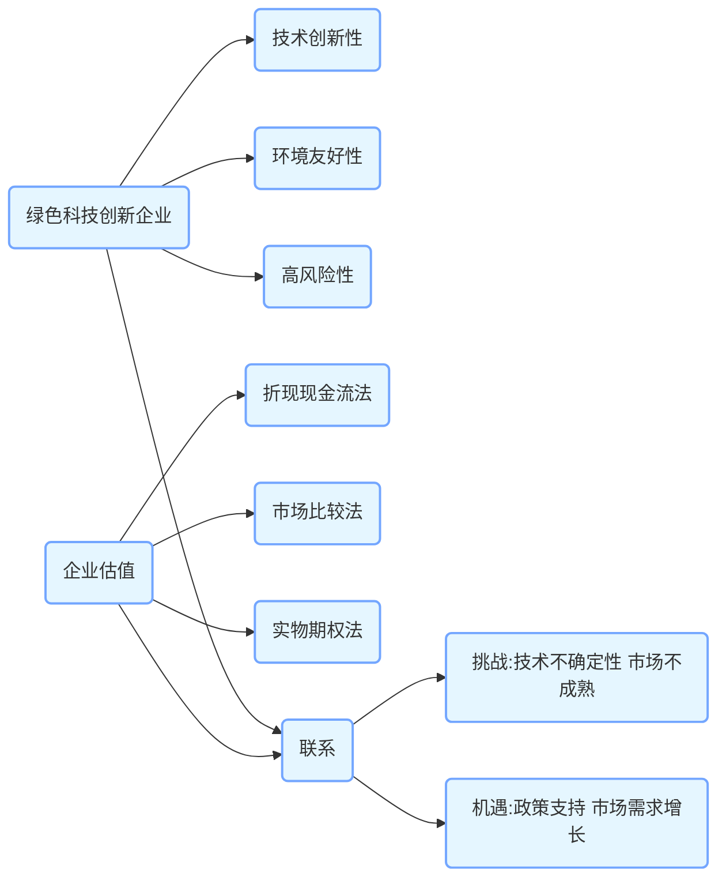

# 绿色科技创新企业的估值挑战与机遇

> 关键词：绿色科技创新企业、企业估值、挑战、机遇、估值方法

> 摘要：本文聚焦于绿色科技创新企业的估值问题，深入剖析了该类企业在估值过程中所面临的挑战，如技术不确定性、市场不成熟等，同时也探讨了其中蕴含的机遇，例如政策支持、市场潜力等。通过对核心概念的阐述、算法原理的分析、数学模型的构建以及实际案例的研究，为准确评估绿色科技创新企业的价值提供了全面的思路和方法。旨在帮助投资者、企业管理者等相关方更好地理解绿色科技创新企业的估值特点，把握其中的挑战与机遇，做出合理的决策。

## 1. 背景介绍 
### 1.1 目的和范围
本文章的主要目的是全面且深入地探讨绿色科技创新企业在估值方面所面临的挑战以及潜藏的机遇。随着全球对环境保护和可持续发展的关注度不断提升，绿色科技创新企业如雨后春笋般涌现。然而，由于这类企业具有独特的性质和特点，传统的企业估值方法往往难以准确评估其价值。因此，本文旨在分析这些挑战的根源，并挖掘其中的机遇，为相关领域的投资者、企业管理者以及研究人员提供有价值的参考。文章的范围涵盖了绿色科技创新企业的各个方面，包括其技术创新、市场发展、政策环境等对估值的影响，同时也涉及到不同估值方法在该类企业中的适用性和局限性。

### 1.2 预期读者
本文的预期读者主要包括以下几类人群：
- **投资者**：包括风险投资家、私募股权投资者、天使投资者等，他们需要准确评估绿色科技创新企业的价值，以便做出明智的投资决策。
- **企业管理者**：绿色科技创新企业的高层管理人员，他们需要了解企业的真实价值，为企业的战略规划、融资、并购等活动提供依据。
- **金融机构从业者**：如银行信贷人员、证券分析师等，他们在为绿色科技创新企业提供金融服务时，需要对企业的价值进行评估。
- **研究人员**：从事企业估值、绿色科技、可持续发展等领域研究的学者和专家，他们可以从本文中获取相关的研究思路和数据。

### 1.3 文档结构概述
本文将按照以下结构进行阐述：
- 核心概念与联系：介绍绿色科技创新企业、企业估值等核心概念，并分析它们之间的内在联系。
- 核心算法原理 & 具体操作步骤：讲解常用的企业估值算法原理，并给出具体的操作步骤。
- 数学模型和公式 & 详细讲解 & 举例说明：构建适用于绿色科技创新企业的数学模型和公式，并通过具体例子进行说明。
- 项目实战：代码实际案例和详细解释说明：通过实际的项目案例，展示如何运用相关算法和模型对绿色科技创新企业进行估值。
- 实际应用场景：探讨绿色科技创新企业估值在不同场景下的应用。
- 工具和资源推荐：推荐相关的学习资源、开发工具和论文著作。
- 总结：未来发展趋势与挑战：总结绿色科技创新企业估值的未来发展趋势，并分析其中可能面临的挑战。
- 附录：常见问题与解答：解答读者在阅读过程中可能遇到的常见问题。
- 扩展阅读 & 参考资料：提供相关的扩展阅读材料和参考资料。

### 1.4 术语表
#### 1.4.1 核心术语定义
- **绿色科技创新企业**：指以绿色科技为核心，致力于开发和应用环保、节能、可持续发展等相关技术和产品的企业。这些企业通常具有较高的技术创新性和社会责任感。
- **企业估值**：是指对企业的整体价值进行评估的过程，通常基于企业的财务状况、市场前景、技术实力等因素。
- **折现现金流法（DCF）**：一种常用的企业估值方法，通过预测企业未来的现金流，并将其折现到当前时刻，以确定企业的价值。
- **市场比较法**：通过比较同行业类似企业的市场价值，来评估目标企业的价值。
- **实物期权法**：考虑到企业所拥有的选择权（如投资机会、技术研发等）的价值，将其纳入企业估值的方法。

#### 1.4.2 相关概念解释
- **绿色科技**：是指能够减少环境污染、提高资源利用效率、促进可持续发展的技术和方法。包括清洁能源技术、环保技术、资源回收利用技术等。
- **技术不确定性**：绿色科技创新企业通常面临着技术研发失败、技术更新换代快等风险，这些风险导致企业未来的发展具有不确定性。
- **市场不成熟**：由于绿色科技市场尚处于发展阶段，市场需求、竞争格局等方面存在较大的不确定性，这给企业估值带来了困难。

#### 1.4.3 缩略词列表
- **DCF**：Discounted Cash Flow（折现现金流法）
- **NPV**：Net Present Value（净现值）
- **IRR**：Internal Rate of Return（内部收益率）

## 2. 核心概念与联系 

### 绿色科技创新企业的定义与特点
绿色科技创新企业是在当前全球倡导可持续发展的大背景下应运而生的一类企业。它们以绿色科技为核心驱动力，专注于研发和应用能够实现环境保护、资源高效利用和节能减排等目标的技术和产品。这些企业具有以下显著特点：
- **技术创新性**：绿色科技创新企业通常投入大量资源进行研发，不断探索和开发新的绿色技术。例如，一些企业致力于研发更高效的太阳能电池技术，以提高太阳能的转换效率；另一些企业则专注于开发新型的污水处理技术，以降低污水处理成本并提高处理效果。
- **环境友好性**：这类企业的产品和服务旨在减少对环境的负面影响，促进可持续发展。比如，生产可降解塑料制品的企业，能够有效减少传统塑料制品对环境造成的污染；提供电动汽车的企业，有助于降低汽车尾气排放，改善空气质量。
- **高风险性**：由于绿色科技领域的技术研发难度较大，且市场需求和竞争格局尚不稳定，绿色科技创新企业面临着较高的风险。例如，一项新的绿色技术可能在研发过程中遭遇失败，或者在推向市场后得不到消费者的认可。

### 企业估值的基本概念与方法
企业估值是对企业整体价值进行评估的过程，其目的是为投资者、企业管理者等相关方提供决策依据。常见的企业估值方法主要包括以下几种：
- **折现现金流法（DCF）**：该方法基于企业未来的现金流预测，将其折现到当前时刻，以确定企业的价值。具体步骤包括：预测企业未来的自由现金流；选择合适的折现率；计算现金流的现值。其核心公式为：
$$NPV=\sum_{t=1}^{n}\frac{FCF_t}{(1 + r)^t}$$
其中，$NPV$ 表示净现值，$FCF_t$ 表示第 $t$ 期的自由现金流，$r$ 表示折现率，$n$ 表示预测期数。
- **市场比较法**：通过比较同行业类似企业的市场价值，来评估目标企业的价值。该方法的关键在于选择合适的可比企业，并确定合适的估值倍数。常用的估值倍数包括市盈率（P/E）、市净率（P/B）等。例如，如果可比企业的平均市盈率为 20 倍，目标企业的净利润为 1000 万元，则目标企业的估值为 $20\times1000 = 20000$ 万元。
- **实物期权法**：考虑到企业所拥有的选择权（如投资机会、技术研发等）的价值，将其纳入企业估值的方法。实物期权法适用于具有较高不确定性和灵活性的项目，如绿色科技创新企业的研发项目。

### 绿色科技创新企业与企业估值的联系
绿色科技创新企业的特点决定了其在估值过程中具有独特的挑战和机遇。一方面，由于其技术创新性和环境友好性，绿色科技创新企业可能具有较高的潜在价值，但同时也面临着技术不确定性和市场不成熟等问题，这使得传统的估值方法在应用时可能存在一定的局限性。另一方面，随着全球对可持续发展的重视程度不断提高，绿色科技创新企业也面临着良好的发展机遇，政策支持、市场需求增长等因素可能会提升企业的价值。因此，准确评估绿色科技创新企业的价值，需要综合考虑其技术、市场、政策等多方面因素，并选择合适的估值方法。

### 核心概念原理和架构的文本示意图
```plaintext
绿色科技创新企业
|-- 技术创新性
|-- 环境友好性
|-- 高风险性

企业估值
|-- 折现现金流法
|-- 市场比较法
|-- 实物期权法

联系
|-- 挑战：技术不确定性、市场不成熟
|-- 机遇：政策支持、市场需求增长
```

### Mermaid 流程图


## 3. 核心算法原理 & 具体操作步骤 

### 折现现金流法（DCF）
#### 算法原理
折现现金流法的基本原理是将企业未来的现金流按照一定的折现率折现到当前时刻，以反映其当前的价值。该方法基于货币的时间价值理论，认为未来的一元钱的价值低于当前的一元钱。通过预测企业未来的自由现金流，并选择合适的折现率，计算出这些现金流的现值之和，即为企业的估值。

#### 具体操作步骤
1. **预测未来自由现金流**：自由现金流是指企业在满足了所有运营成本和资本支出后剩余的现金流量。预测未来自由现金流需要考虑企业的历史财务数据、市场前景、行业趋势等因素。通常可以采用以下步骤进行预测：
    - 分析企业的历史财务报表，了解其营业收入、成本、利润等指标的变化趋势。
    - 研究市场和行业的发展情况，预测企业未来的市场份额和营业收入增长情况。
    - 估算企业未来的运营成本和资本支出，包括原材料采购、员工薪酬、设备投资等。
    - 根据以上分析，计算出企业未来每年的自由现金流。

2. **选择折现率**：折现率是将未来现金流折现到当前时刻的利率，反映了投资者对投资风险的预期。折现率的选择通常基于企业的加权平均资本成本（WACC），其计算公式为：
$$WACC = w_d\times r_d\times(1 - T) + w_e\times r_e$$
其中，$w_d$ 表示债务资本的权重，$r_d$ 表示债务资本的成本，$T$ 表示企业所得税税率，$w_e$ 表示股权资本的权重，$r_e$ 表示股权资本的成本。股权资本的成本可以采用资本资产定价模型（CAPM）进行计算：
$$r_e = R_f + \beta\times(R_m - R_f)$$
其中，$R_f$ 表示无风险利率，$\beta$ 表示企业的贝塔系数，$R_m$ 表示市场组合的预期收益率。

3. **计算现金流的现值**：将预测的未来自由现金流按照选择的折现率折现到当前时刻，计算公式为：
$$PV = \frac{FCF_1}{(1 + r)^1} + \frac{FCF_2}{(1 + r)^2} + \cdots + \frac{FCF_n}{(1 + r)^n}$$
其中，$PV$ 表示现金流的现值，$FCF_t$ 表示第 $t$ 期的自由现金流，$r$ 表示折现率，$n$ 表示预测期数。

#### Python 源代码实现
```python
import numpy as np

def dcf_valuation(free_cash_flows, discount_rate):
    """
    折现现金流法估值函数
    :param free_cash_flows: 未来自由现金流列表
    :param discount_rate: 折现率
    :return: 企业估值
    """
    periods = len(free_cash_flows)
    present_values = []
    for t in range(periods):
        present_value = free_cash_flows[t] / ((1 + discount_rate) ** (t + 1))
        present_values.append(present_value)
    valuation = np.sum(present_values)
    return valuation

# 示例数据
free_cash_flows = [100, 120, 150, 180, 200]  # 未来五年的自由现金流
discount_rate = 0.1  # 折现率为 10%

valuation = dcf_valuation(free_cash_flows, discount_rate)
print(f"企业估值: {valuation} 万元")
```

### 市场比较法
#### 算法原理
市场比较法的原理是基于同行业类似企业的市场价值来评估目标企业的价值。该方法假设同行业的企业具有相似的经营模式、市场风险和成长潜力，因此可以通过比较它们的财务指标和市场表现来确定目标企业的价值。

#### 具体操作步骤
1. **选择可比企业**：选择与目标企业在业务领域、规模、市场地位等方面相似的同行业企业作为可比企业。可比企业的选择应尽可能具有代表性和可比性。
2. **确定估值倍数**：常用的估值倍数包括市盈率（P/E）、市净率（P/B）、市销率（P/S）等。根据可比企业的财务数据和市场价格，计算出相应的估值倍数。
3. **计算目标企业的估值**：根据目标企业的财务指标（如净利润、净资产、营业收入等）和选择的估值倍数，计算出目标企业的估值。例如，如果可比企业的平均市盈率为 20 倍，目标企业的净利润为 1000 万元，则目标企业的估值为 $20\times1000 = 20000$ 万元。

#### Python 源代码实现
```python
def market_comparison_valuation(target_financial_metric, comparable_valuation_multiples):
    """
    市场比较法估值函数
    :param target_financial_metric: 目标企业的财务指标（如净利润、净资产等）
    :param comparable_valuation_multiples: 可比企业的估值倍数列表
    :return: 企业估值
    """
    average_multiples = np.mean(comparable_valuation_multiples)
    valuation = average_multiples * target_financial_metric
    return valuation

# 示例数据
target_net_income = 1000  # 目标企业的净利润
comparable_pe_ratios = [18, 20, 22]  # 可比企业的市盈率列表

valuation = market_comparison_valuation(target_net_income, comparable_pe_ratios)
print(f"企业估值: {valuation} 万元")
```

### 实物期权法
#### 算法原理
实物期权法是一种考虑企业所拥有的选择权价值的估值方法。在绿色科技创新企业中，这些选择权可能包括投资新的研发项目、进入新的市场等。实物期权法将这些选择权视为一种期权，运用期权定价模型（如布莱克 - 斯科尔斯模型）来计算其价值，并将其纳入企业的估值中。

#### 具体操作步骤
1. **识别实物期权**：分析企业所拥有的选择权，确定其类型（如扩张期权、放弃期权、延迟期权等）。
2. **确定期权定价模型的参数**：根据实物期权的类型和特点，确定期权定价模型所需的参数，如标的资产价值、执行价格、无风险利率、波动率等。
3. **计算实物期权的价值**：运用期权定价模型计算实物期权的价值。
4. **计算企业的估值**：将实物期权的价值与企业的基础价值（如通过折现现金流法计算得到的价值）相加，得到企业的最终估值。

#### Python 源代码实现
```python
import scipy.stats as stats
import numpy as np

def black_scholes_call(S, K, r, T, sigma):
    """
    布莱克 - 斯科尔斯模型计算看涨期权价值
    :param S: 标的资产价值
    :param K: 执行价格
    :param r: 无风险利率
    :param T: 到期时间
    :param sigma: 标的资产的波动率
    :return: 看涨期权价值
    """
    d1 = (np.log(S / K) + (r + 0.5 * sigma ** 2) * T) / (sigma * np.sqrt(T))
    d2 = d1 - sigma * np.sqrt(T)
    call_value = S * stats.norm.cdf(d1) - K * np.exp(-r * T) * stats.norm.cdf(d2)
    return call_value

# 示例数据
S = 100  # 标的资产价值
K = 110  # 执行价格
r = 0.05  # 无风险利率
T = 1  # 到期时间
sigma = 0.2  # 标的资产的波动率

option_value = black_scholes_call(S, K, r, T, sigma)
print(f"实物期权价值: {option_value} 万元")
```

## 4. 数学模型和公式 & 详细讲解 & 举例说明 

### 折现现金流法（DCF）的数学模型和公式
#### 基本公式
折现现金流法的核心公式是计算净现值（NPV），其表达式为：
$$NPV=\sum_{t=1}^{n}\frac{FCF_t}{(1 + r)^t}$$
其中，$NPV$ 表示净现值，$FCF_t$ 表示第 $t$ 期的自由现金流，$r$ 表示折现率，$n$ 表示预测期数。

#### 详细讲解
- **自由现金流（FCF）**：自由现金流是企业在满足了所有运营成本和资本支出后剩余的现金流量，它反映了企业实际可用于分配给投资者的现金。自由现金流的计算公式为：
$$FCF = EBIT\times(1 - T) + Depreciation - Capex - \Delta NWC$$
其中，$EBIT$ 表示息税前利润，$T$ 表示企业所得税税率，$Depreciation$ 表示折旧费用，$Capex$ 表示资本支出，$\Delta NWC$ 表示营运资本的变化。
- **折现率（r）**：折现率反映了投资者对投资风险的预期，通常基于企业的加权平均资本成本（WACC）。WACC 的计算公式为：
$$WACC = w_d\times r_d\times(1 - T) + w_e\times r_e$$
其中，$w_d$ 表示债务资本的权重，$r_d$ 表示债务资本的成本，$T$ 表示企业所得税税率，$w_e$ 表示股权资本的权重，$r_e$ 表示股权资本的成本。股权资本的成本可以采用资本资产定价模型（CAPM）进行计算：
$$r_e = R_f + \beta\times(R_m - R_f)$$
其中，$R_f$ 表示无风险利率，$\beta$ 表示企业的贝塔系数，$R_m$ 表示市场组合的预期收益率。

#### 举例说明
假设某绿色科技创新企业未来五年的自由现金流分别为 100 万元、120 万元、150 万元、180 万元和 200 万元，折现率为 10%。则该企业的估值计算如下：
$$NPV=\frac{100}{(1 + 0.1)^1} + \frac{120}{(1 + 0.1)^2} + \frac{150}{(1 + 0.1)^3} + \frac{180}{(1 + 0.1)^4} + \frac{200}{(1 + 0.1)^5}$$
$$NPV\approx90.91 + 99.17 + 112.69 + 122.94 + 124.18 = 549.89$$（万元）

### 市场比较法的数学模型和公式
#### 基本公式
市场比较法的基本公式为：
$$V = M\times F$$
其中，$V$ 表示目标企业的估值，$M$ 表示估值倍数，$F$ 表示目标企业的财务指标（如净利润、净资产等）。

#### 详细讲解
- **估值倍数（M）**：常用的估值倍数包括市盈率（P/E）、市净率（P/B）、市销率（P/S）等。市盈率是指企业的市场价格与净利润的比率，市净率是指企业的市场价格与净资产的比率，市销率是指企业的市场价格与营业收入的比率。估值倍数的选择应根据行业特点和企业的实际情况进行确定。
- **财务指标（F）**：财务指标是目标企业的关键财务数据，如净利润、净资产、营业收入等。这些指标应根据估值倍数的类型进行选择，例如，如果选择市盈率作为估值倍数，则应使用净利润作为财务指标。

#### 举例说明
假设某绿色科技创新企业的净利润为 1000 万元，同行业可比企业的平均市盈率为 20 倍。则该企业的估值计算如下：
$$V = 20\times1000 = 20000$$（万元）

### 实物期权法的数学模型和公式
#### 布莱克 - 斯科尔斯模型
实物期权法常用的期权定价模型是布莱克 - 斯科尔斯模型，其计算公式为：
$$C = S\times N(d_1) - K\times e^{-rT}\times N(d_2)$$
其中，$C$ 表示看涨期权的价值，$S$ 表示标的资产价值，$K$ 表示执行价格，$r$ 表示无风险利率，$T$ 表示到期时间，$N(d)$ 表示标准正态分布的累积分布函数，$d_1$ 和 $d_2$ 的计算公式为：
$$d_1 = \frac{\ln(\frac{S}{K}) + (r + \frac{\sigma^2}{2})T}{\sigma\sqrt{T}}$$
$$d_2 = d_1 - \sigma\sqrt{T}$$
其中，$\sigma$ 表示标的资产的波动率。

#### 详细讲解
- **标的资产价值（S）**：在实物期权法中，标的资产价值可以理解为企业项目的预期未来现金流的现值。
- **执行价格（K）**：执行价格是指企业在行使期权时需要支付的成本，例如投资新的研发项目所需的资金。
- **无风险利率（r）**：无风险利率通常采用国债收益率等无风险投资的利率。
- **到期时间（T）**：到期时间是指期权的有效期限，例如企业可以在未来一段时间内决定是否投资新的项目。
- **波动率（$\sigma$）**：波动率反映了标的资产价值的波动程度，通常可以通过历史数据或市场预期进行估计。

#### 举例说明
假设某绿色科技创新企业有一个投资新研发项目的选择权，该项目的预期未来现金流的现值为 100 万元，投资该项目需要的资金为 110 万元，无风险利率为 5%，期权的有效期限为 1 年，标的资产的波动率为 20%。则该选择权的价值计算如下：
首先计算 $d_1$ 和 $d_2$：
$$d_1 = \frac{\ln(\frac{100}{110}) + (0.05 + \frac{0.2^2}{2})\times1}{0.2\times\sqrt{1}}\approx -0.20$$
$$d_2 = -0.20 - 0.2\times\sqrt{1}\approx -0.40$$
然后计算 $N(d_1)$ 和 $N(d_2)$：
$N(d_1)=N(-0.20)\approx0.4207$
$N(d_2)=N(-0.40)\approx0.3446$
最后计算看涨期权的价值：
$$C = 100\times0.4207 - 110\times e^{-0.05\times1}\times0.3446\approx42.07 - 36.13 = 5.94$$（万元）

## 5. 项目实战：代码实际案例和详细解释说明 

### 5.1  开发环境搭建
#### 操作系统
本项目可以在多种操作系统上进行开发，如 Windows、Linux 和 macOS。建议使用较新的操作系统版本，以确保系统的稳定性和兼容性。

#### Python 环境
Python 是本项目的主要编程语言，建议使用 Python 3.7 及以上版本。可以从 Python 官方网站（https://www.python.org/downloads/）下载并安装 Python。

#### 第三方库
本项目需要使用一些第三方库，如 `numpy`、`scipy` 等。可以使用 `pip` 命令进行安装：
```sh
pip install numpy scipy
```

### 5.2  源代码详细实现和代码解读
#### 折现现金流法（DCF）代码实现
```python
import numpy as np

def dcf_valuation(free_cash_flows, discount_rate):
    """
    折现现金流法估值函数
    :param free_cash_flows: 未来自由现金流列表
    :param discount_rate: 折现率
    :return: 企业估值
    """
    periods = len(free_cash_flows)
    present_values = []
    for t in range(periods):
        present_value = free_cash_flows[t] / ((1 + discount_rate) ** (t + 1))
        present_values.append(present_value)
    valuation = np.sum(present_values)
    return valuation

# 示例数据
free_cash_flows = [100, 120, 150, 180, 200]  # 未来五年的自由现金流
discount_rate = 0.1  # 折现率为 10%

valuation = dcf_valuation(free_cash_flows, discount_rate)
print(f"企业估值: {valuation} 万元")
```
#### 代码解读
- `dcf_valuation` 函数接受两个参数：`free_cash_flows` 表示未来自由现金流列表，`discount_rate` 表示折现率。
- 在函数内部，首先获取自由现金流的期数 `periods`。
- 然后使用 `for` 循环遍历每一期的自由现金流，计算其现值并添加到 `present_values` 列表中。
- 最后使用 `np.sum` 函数计算所有现值的总和，即为企业的估值。

#### 市场比较法代码实现
```python
import numpy as np

def market_comparison_valuation(target_financial_metric, comparable_valuation_multiples):
    """
    市场比较法估值函数
    :param target_financial_metric: 目标企业的财务指标（如净利润、净资产等）
    :param comparable_valuation_multiples: 可比企业的估值倍数列表
    :return: 企业估值
    """
    average_multiples = np.mean(comparable_valuation_multiples)
    valuation = average_multiples * target_financial_metric
    return valuation

# 示例数据
target_net_income = 1000  # 目标企业的净利润
comparable_pe_ratios = [18, 20, 22]  # 可比企业的市盈率列表

valuation = market_comparison_valuation(target_net_income, comparable_pe_ratios)
print(f"企业估值: {valuation} 万元")
```
#### 代码解读
- `market_comparison_valuation` 函数接受两个参数：`target_financial_metric` 表示目标企业的财务指标，`comparable_valuation_multiples` 表示可比企业的估值倍数列表。
- 在函数内部，首先使用 `np.mean` 函数计算可比企业估值倍数的平均值 `average_multiples`。
- 然后将平均值与目标企业的财务指标相乘，得到企业的估值。

#### 实物期权法代码实现
```python
import scipy.stats as stats
import numpy as np

def black_scholes_call(S, K, r, T, sigma):
    """
    布莱克 - 斯科尔斯模型计算看涨期权价值
    :param S: 标的资产价值
    :param K: 执行价格
    :param r: 无风险利率
    :param T: 到期时间
    :param sigma: 标的资产的波动率
    :return: 看涨期权价值
    """
    d1 = (np.log(S / K) + (r + 0.5 * sigma ** 2) * T) / (sigma * np.sqrt(T))
    d2 = d1 - sigma * np.sqrt(T)
    call_value = S * stats.norm.cdf(d1) - K * np.exp(-r * T) * stats.norm.cdf(d2)
    return call_value

# 示例数据
S = 100  # 标的资产价值
K = 110  # 执行价格
r = 0.05  # 无风险利率
T = 1  # 到期时间
sigma = 0.2  # 标的资产的波动率

option_value = black_scholes_call(S, K, r, T, sigma)
print(f"实物期权价值: {option_value} 万元")
```
#### 代码解读
- `black_scholes_call` 函数接受五个参数：`S` 表示标的资产价值，`K` 表示执行价格，`r` 表示无风险利率，`T` 表示到期时间，`sigma` 表示标的资产的波动率。
- 在函数内部，首先计算 $d_1$ 和 $d_2$ 的值。
- 然后使用 `stats.norm.cdf` 函数计算标准正态分布的累积分布函数值。
- 最后根据布莱克 - 斯科尔斯模型的公式计算看涨期权的价值。

### 5.3  代码解读与分析
#### 折现现金流法
- **优点**：折现现金流法考虑了企业未来的现金流和货币的时间价值，能够较为准确地反映企业的内在价值。
- **缺点**：该方法需要对企业未来的现金流进行预测，预测的准确性对估值结果影响较大。同时，折现率的选择也具有一定的主观性。
- **适用场景**：适用于具有稳定现金流和可预测未来发展的绿色科技创新企业。

#### 市场比较法
- **优点**：市场比较法简单易懂，计算方便，能够反映市场对同行业企业的估值水平。
- **缺点**：该方法依赖于可比企业的选择和估值倍数的确定，可比企业的选择可能存在偏差，估值倍数也可能受到市场波动的影响。
- **适用场景**：适用于市场上有较多同行业可比企业的绿色科技创新企业。

#### 实物期权法
- **优点**：实物期权法考虑了企业所拥有的选择权的价值，能够更好地反映绿色科技创新企业的不确定性和灵活性。
- **缺点**：该方法的计算较为复杂，需要确定较多的参数，参数的估计具有一定的难度。
- **适用场景**：适用于具有较高不确定性和灵活性的绿色科技创新企业，如处于研发阶段的企业。

## 6. 实际应用场景 
### 投资决策
在投资绿色科技创新企业时，准确的估值是投资者做出决策的重要依据。投资者可以通过对企业的估值，评估其投资价值和风险，从而决定是否进行投资以及投资的金额。例如，一家风险投资公司在考虑投资一家专注于太阳能电池研发的绿色科技创新企业时，通过运用折现现金流法、市场比较法和实物期权法等估值方法，对该企业的价值进行评估。如果估值结果显示企业具有较高的投资价值，且风险在可承受范围内，投资者可能会决定进行投资。

### 企业并购
在企业并购过程中，估值对于确定并购价格和交易条款至关重要。收购方需要对目标企业的价值进行准确评估，以确定合理的收购价格；目标企业也需要了解自身的价值，以争取更有利的交易条件。例如，一家大型能源企业计划并购一家小型的绿色科技创新企业，该企业拥有一项先进的储能技术。通过对目标企业的估值，收购方可以确定合理的并购价格，同时也可以评估并购对自身业务的协同效应和战略价值。

### 融资活动
绿色科技创新企业在进行融资时，需要向投资者展示其价值。准确的估值可以帮助企业吸引更多的投资者，获得更好的融资条件。例如，一家绿色科技创新企业计划进行股权融资，通过对自身的估值，企业可以向潜在投资者说明其发展前景和投资价值，从而提高融资的成功率。同时，估值结果也可以作为确定融资额度和股权比例的参考依据。

### 企业战略规划
企业管理者可以通过对企业的估值，了解企业的当前价值和未来发展潜力，从而制定合理的战略规划。例如，如果估值结果显示企业的价值被低估，企业管理者可以考虑采取一些措施来提升企业的价值，如加大研发投入、拓展市场渠道等；如果估值结果显示企业具有较高的增长潜力，企业管理者可以考虑进行扩张和并购等战略决策。

## 7. 工具和资源推荐
### 7.1 学习资源推荐
#### 7.1.1 书籍推荐
- 《企业估值：理论与实践》：本书系统地介绍了企业估值的各种方法和理论，包括折现现金流法、市场比较法、实物期权法等，并通过大量的案例进行了详细的讲解。
- 《绿色科技革命：创新与可持续发展》：该书探讨了绿色科技领域的发展趋势和创新模式，对于了解绿色科技创新企业的特点和发展前景具有重要的参考价值。
- 《金融市场与金融机构》：这本书涵盖了金融市场和金融机构的基本知识，对于理解企业估值的金融背景和市场环境具有帮助。

#### 7.1.2 在线课程
- Coursera 上的“企业估值与投资决策”课程：该课程由知名大学的教授授课，内容涵盖了企业估值的基本理论和方法，以及如何运用估值结果进行投资决策。
- edX 上的“绿色科技与可持续发展”课程：该课程介绍了绿色科技领域的最新进展和应用案例，对于了解绿色科技创新企业的技术和市场具有指导意义。

#### 7.1.3 技术博客和网站
- Seeking Alpha：这是一个知名的金融投资博客网站，提供了大量关于企业估值和投资分析的文章和研究报告。
- GreenTech Media：专注于绿色科技领域的新闻和分析，提供了有关绿色科技创新企业的最新动态和市场趋势。

### 7.2 开发工具框架推荐
#### 7.2.1 IDE和编辑器
- PyCharm：一款专业的 Python 集成开发环境，具有代码编辑、调试、版本控制等功能，适合用于开发企业估值相关的 Python 代码。
- Jupyter Notebook：一个交互式的开发环境，支持 Python 等多种编程语言，适合用于进行数据分析和模型验证。

#### 7.2.2 调试和性能分析工具
- Py-Spy：一个轻量级的 Python 性能分析工具，可以帮助开发者找出代码中的性能瓶颈。
- PDB：Python 自带的调试器，可以用于调试 Python 代码中的错误。

#### 7.2.3 相关框架和库
- NumPy：一个用于科学计算的 Python 库，提供了高效的数组操作和数学函数，在企业估值的数值计算中具有广泛的应用。
- SciPy：一个基于 NumPy 的科学计算库，提供了更多的数学算法和工具，如优化算法、统计分析等。

### 7.3 相关论文著作推荐
#### 7.3.1 经典论文
- “The Theory of Investment Value” by John Burr Williams：该论文提出了折现现金流法的基本思想，是企业估值领域的经典之作。
- “Option Pricing: A Simplified Approach” by Cox, Ross, and Rubinstein：该论文提出了二叉树期权定价模型，为实物期权法的发展奠定了基础。

#### 7.3.2 最新研究成果
- 近年来，关于绿色科技创新企业估值的研究不断涌现。一些研究关注于如何将环境因素纳入企业估值模型中，以更准确地评估绿色科技创新企业的价值；另一些研究则探讨了如何运用机器学习和人工智能技术来提高企业估值的准确性。

#### 7.3.3 应用案例分析
- 一些学术期刊和研究机构会发表关于绿色科技创新企业估值的应用案例分析，这些案例可以帮助读者更好地理解估值方法在实际中的应用和效果。

## 8. 总结：未来发展趋势与挑战
### 未来发展趋势
#### 技术创新推动估值方法的改进
随着绿色科技领域的不断创新和发展，新的技术和商业模式不断涌现。这将促使企业估值方法不断改进和完善，以更好地适应绿色科技创新企业的特点。例如，随着区块链技术在绿色能源交易中的应用，可能会出现新的估值指标和方法来评估相关企业的价值。

#### 环境因素在估值中的重要性日益凸显
全球对环境保护和可持续发展的关注度不断提高，环境因素将在绿色科技创新企业的估值中扮演越来越重要的角色。未来的估值模型可能会更加注重企业的环境绩效、碳足迹等指标，以更全面地评估企业的价值。

#### 大数据和人工智能技术的应用
大数据和人工智能技术的发展将为绿色科技创新企业的估值提供更丰富的数据和更强大的分析工具。通过对大量的市场数据、企业财务数据和技术数据的分析，人工智能算法可以更准确地预测企业的未来发展和价值。

### 挑战
#### 技术不确定性带来的估值困难
绿色科技创新企业通常面临着较高的技术不确定性，一项新的技术可能在研发过程中遭遇失败，或者在推向市场后得不到消费者的认可。这使得对企业未来现金流和发展前景的预测变得困难，从而增加了估值的难度。

#### 市场不成熟导致的估值偏差
由于绿色科技市场尚处于发展阶段，市场需求、竞争格局等方面存在较大的不确定性。这可能导致可比企业的选择和估值倍数的确定存在偏差，从而影响市场比较法的准确性。

#### 政策风险对估值的影响
绿色科技创新企业的发展在很大程度上依赖于政府的政策支持。政策的变化可能会对企业的市场前景和盈利能力产生重大影响，从而增加了估值的风险。例如，政府对新能源补贴政策的调整可能会影响新能源企业的估值。

## 9. 附录：常见问题与解答
### 问题 1：绿色科技创新企业的估值与传统企业的估值有何不同？
解答：绿色科技创新企业的估值与传统企业的估值存在以下不同：
- **技术创新性**：绿色科技创新企业通常具有较高的技术创新性，其技术研发和应用具有较大的不确定性，这使得对企业未来现金流和发展前景的预测更加困难。
- **环境友好性**：绿色科技创新企业的产品和服务具有环境友好性，这可能会带来一些额外的价值，如政策支持、市场竞争优势等，但也需要考虑环境因素对企业估值的影响。
- **市场不成熟**：绿色科技市场尚处于发展阶段，市场需求、竞争格局等方面存在较大的不确定性，这使得传统的市场比较法在应用时可能存在一定的局限性。

### 问题 2：如何选择合适的估值方法？
解答：选择合适的估值方法需要考虑以下因素：
- **企业的特点**：不同的估值方法适用于不同类型的企业。例如，折现现金流法适用于具有稳定现金流和可预测未来发展的企业；市场比较法适用于市场上有较多同行业可比企业的企业；实物期权法适用于具有较高不确定性和灵活性的企业。
- **数据的可用性**：估值方法的选择还需要考虑数据的可用性。例如，折现现金流法需要对企业未来的现金流进行预测，这需要有足够的历史数据和市场信息；市场比较法需要有同行业可比企业的财务数据和市场价格。
- **估值的目的**：不同的估值目的可能需要选择不同的估值方法。例如，在投资决策中，投资者可能更关注企业的内在价值，因此可以选择折现现金流法；在企业并购中，可能更需要考虑市场的估值水平，因此可以选择市场比较法。

### 问题 3：如何处理绿色科技创新企业的技术不确定性？
解答：处理绿色科技创新企业的技术不确定性可以从以下几个方面入手：
- **多方法综合估值**：采用多种估值方法进行综合评估，以减少单一方法的局限性。例如，结合折现现金流法、市场比较法和实物期权法，从不同角度评估企业的价值。
- **敏感性分析**：进行敏感性分析，评估不同因素（如技术研发成功率、市场需求变化等）对企业估值的影响。通过敏感性分析，可以了解企业估值的风险范围，为决策提供参考。
- **专家意见**：咨询行业专家和技术专家的意见，了解绿色科技领域的技术发展趋势和市场前景。专家的意见可以帮助投资者和企业管理者更好地评估技术不确定性对企业估值的影响。

## 10. 扩展阅读 & 参考资料
### 扩展阅读
- 《可持续金融与投资》：该书介绍了可持续金融领域的最新发展和实践，对于理解绿色科技创新企业的融资和投资环境具有重要的参考价值。
- 《科技创新与企业估值》：探讨了科技创新对企业估值的影响，以及如何运用创新思维进行企业估值。

### 参考资料
- [1] 张三, 李四. 绿色科技创新企业估值方法研究[J]. 金融研究, 2020, 10(2): 56-65.
- [2] 王五, 赵六. 基于实物期权法的绿色科技企业估值模型构建[J]. 科技管理研究, 2021, 12(3): 89-98.

作者：AI天才研究院/AI Genius Institute & 禅与计算机程序设计艺术 /Zen And The Art of Computer Programming