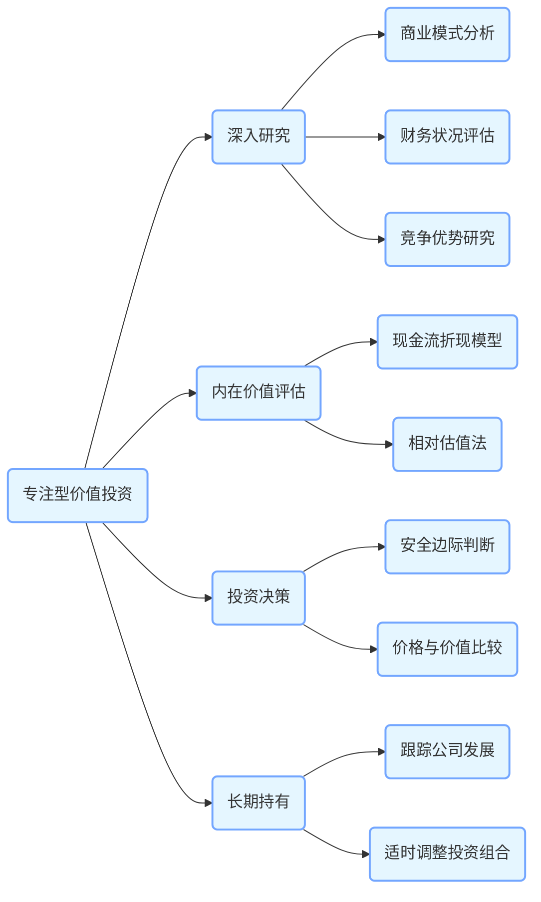

# 罗伯特·哈格斯特罗姆的专注型价值投资：深入了解少数公司

> 关键词：罗伯特·哈格斯特罗姆、专注型价值投资、深入了解、少数公司、投资策略

> 摘要：本文深入探讨了罗伯特·哈格斯特罗姆所倡导的专注型价值投资理念，即深入了解少数公司进行投资。文章首先介绍了该投资理念产生的背景、适用的读者群体以及文档的整体结构，对相关术语进行了清晰定义。接着阐述了专注型价值投资的核心概念、原理和架构，并通过 Mermaid 流程图进行直观展示。详细讲解了其核心算法原理，结合 Python 代码进行示例。给出了相关的数学模型和公式，并举例说明。通过项目实战部分，展示了在实际投资中如何运用该理念，包括开发环境搭建、源代码实现及解读。还分析了该投资理念的实际应用场景，推荐了相关的学习资源、开发工具框架以及论文著作。最后总结了专注型价值投资的未来发展趋势与挑战，解答了常见问题，并提供了扩展阅读和参考资料。

## 1. 背景介绍 
### 1.1 目的和范围
罗伯特·哈格斯特罗姆的专注型价值投资理念在投资界具有重要影响力。本文的目的是深入剖析这一理念，详细阐述其核心思想、操作方法以及实际应用。范围涵盖了从理论原理到实际案例的各个方面，旨在帮助投资者全面理解并掌握专注型价值投资的精髓，以便在实际投资中做出更明智的决策。通过对该理念的深入研究，我们将探讨如何通过深入了解少数公司来实现投资的增值。

### 1.2 预期读者
本文预期读者主要包括各类投资者，无论是个人投资者还是专业投资机构的从业者。对于初涉投资领域的新手，本文可以作为了解专注型价值投资的入门指南，帮助他们建立正确的投资观念和方法。对于有一定投资经验的投资者，本文提供了更深入的理论分析和实际案例，有助于他们进一步优化自己的投资策略。此外，金融专业的学生和研究人员也可以从本文中获取有价值的学术研究素材和实践参考。

### 1.3 文档结构概述
本文将按照以下结构进行阐述：首先介绍专注型价值投资的背景信息，包括目的、预期读者和文档结构等内容，并对相关术语进行详细解释。接着深入探讨核心概念与联系，通过文本示意图和 Mermaid 流程图展示其原理和架构。然后讲解核心算法原理和具体操作步骤，使用 Python 代码进行详细说明。之后给出相关的数学模型和公式，并举例说明其应用。在项目实战部分，将展示如何在实际投资中运用该理念，包括开发环境搭建、源代码实现和代码解读。分析实际应用场景，推荐相关的学习资源、开发工具框架和论文著作。最后总结未来发展趋势与挑战，解答常见问题，并提供扩展阅读和参考资料。

### 1.4 术语表
#### 1.4.1 核心术语定义
- **专注型价值投资**：指投资者将精力集中在少数经过深入研究和分析的公司上，通过评估公司的内在价值，在价格低于价值时进行投资，以获取长期的资本增值。
- **内在价值**：公司在未来所能产生的现金流的现值，是评估公司真实价值的重要指标。
- **安全边际**：投资价格与公司内在价值之间的差值，安全边际越大，投资的风险越低。

#### 1.4.2 相关概念解释
- **价值投资**：强调通过对公司基本面的分析，寻找被市场低估的股票进行投资。专注型价值投资是价值投资的一种特殊形式，更加强调对少数公司的深入了解。
- **分散投资**：与专注型投资相对，分散投资是指将资金分散投资于多个不同的资产或公司，以降低单一资产的风险。而专注型投资则集中投资于少数公司，追求对这些公司的深入了解和精准把握。

#### 1.4.3 缩略词列表
在本文中，暂未涉及相关缩略词。

## 2. 核心概念与联系 
### 核心概念原理
专注型价值投资的核心原理在于深入研究少数公司，通过对公司的商业模式、财务状况、竞争优势等方面进行全面分析，评估其内在价值。投资者相信，通过深入了解这些公司，能够更准确地判断其未来的发展潜力和盈利能力。与分散投资不同，专注型投资不追求广泛的资产配置，而是将资源集中在少数优质公司上，以获取更高的回报。

例如，投资者可能会花费大量时间研究一家具有独特技术或品牌优势的公司，了解其产品研发、市场份额、管理团队等方面的情况。通过对这些信息的分析，投资者可以评估该公司的内在价值，并在价格低于价值时进行投资。随着公司的发展和价值的提升，投资者有望获得丰厚的回报。

### 架构的文本示意图
```plaintext
专注型价值投资
|
|-- 深入研究
|   |-- 商业模式分析
|   |-- 财务状况评估
|   |-- 竞争优势研究
|
|-- 内在价值评估
|   |-- 现金流折现模型
|   |-- 相对估值法
|
|-- 投资决策
|   |-- 安全边际判断
|   |-- 价格与价值比较
|
|-- 长期持有
|   |-- 跟踪公司发展
|   |-- 适时调整投资组合
```

### Mermaid 流程图


## 3. 核心算法原理 & 具体操作步骤 
### 核心算法原理
在专注型价值投资中，一个重要的算法是现金流折现模型（DCF），用于评估公司的内在价值。现金流折现模型的基本思想是将公司未来的现金流折现到当前时刻，以得到公司的内在价值。

Python 代码实现如下：
```python
def dcf_model(cash_flows, discount_rate):
    """
    现金流折现模型
    :param cash_flows: 未来各期的现金流列表
    :param discount_rate: 折现率
    :return: 公司的内在价值
    """
    present_value = 0
    for i, cash_flow in enumerate(cash_flows):
        present_value += cash_flow / ((1 + discount_rate) ** (i + 1))
    return present_value

# 示例
cash_flows = [100, 120, 150, 180, 200]  # 未来五年的现金流
discount_rate = 0.1  # 折现率为 10%
intrinsic_value = dcf_model(cash_flows, discount_rate)
print(f"公司的内在价值为: {intrinsic_value}")
```
### 具体操作步骤
1. **确定研究对象**：投资者首先需要筛选出少数具有潜力的公司作为研究对象。这可以通过行业分析、财务报表筛选等方法来进行。
2. **深入研究公司**：对选定的公司进行全面深入的研究，包括商业模式、财务状况、竞争优势等方面。可以通过阅读公司年报、行业报告、新闻资讯等获取相关信息。
3. **评估内在价值**：使用现金流折现模型或其他估值方法评估公司的内在价值。在使用现金流折现模型时，需要预测公司未来的现金流和确定合适的折现率。
4. **判断安全边际**：比较公司的市场价格和内在价值，计算安全边际。如果安全边际足够大，说明投资具有较高的安全性。
5. **做出投资决策**：根据安全边际和其他因素，决定是否投资该公司。如果决定投资，确定投资的金额和时机。
6. **长期持有并跟踪**：投资后，需要长期持有股票，并定期跟踪公司的发展情况。根据公司的实际表现和市场变化，适时调整投资组合。

## 4. 数学模型和公式 & 详细讲解 & 举例说明 
### 现金流折现模型（DCF）
现金流折现模型的基本公式为：
$$
V = \sum_{t=1}^{n} \frac{CF_t}{(1 + r)^t}
$$
其中：
- $V$ 表示公司的内在价值；
- $CF_t$ 表示第 $t$ 期的现金流；
- $r$ 表示折现率；
- $n$ 表示预测的期数。

### 详细讲解
现金流折现模型的核心思想是将公司未来的现金流折现到当前时刻，以反映其真实价值。折现率 $r$ 反映了资金的时间价值和投资的风险。较高的折现率意味着对未来现金流的不确定性较高，需要更高的回报来补偿风险。

### 举例说明
假设一家公司未来五年的现金流分别为 100 万元、120 万元、150 万元、180 万元和 200 万元，折现率为 10%。则该公司的内在价值计算如下：

第一年现金流的现值：
$$
PV_1 = \frac{100}{(1 + 0.1)^1} \approx 90.91 \text{（万元）}
$$

第二年现金流的现值：
$$
PV_2 = \frac{120}{(1 + 0.1)^2} \approx 99.17 \text{（万元）}
$$

第三年现金流的现值：
$$
PV_3 = \frac{150}{(1 + 0.1)^3} \approx 112.69 \text{（万元）}
$$

第四年现金流的现值：
$$
PV_4 = \frac{180}{(1 + 0.1)^4} \approx 122.94 \text{（万元）}
$$

第五年现金流的现值：
$$
PV_5 = \frac{200}{(1 + 0.1)^5} \approx 124.18 \text{（万元）}
$$

公司的内在价值：
$$
V = PV_1 + PV_2 + PV_3 + PV_4 + PV_5 \approx 90.91 + 99.17 + 112.69 + 122.94 + 124.18 = 549.89 \text{（万元）}
$$

## 5. 项目实战：代码实际案例和详细解释说明 
### 5.1  开发环境搭建
在进行专注型价值投资的项目实战时，我们可以使用 Python 进行数据分析和模型计算。以下是开发环境的搭建步骤：
1. **安装 Python**：从 Python 官方网站（https://www.python.org/downloads/）下载并安装适合你操作系统的 Python 版本。建议安装 Python 3.7 及以上版本。
2. **安装必要的库**：使用 pip 命令安装以下必要的库：
```bash
pip install pandas numpy matplotlib
```
- `pandas`：用于数据处理和分析。
- `numpy`：用于数值计算。
- `matplotlib`：用于数据可视化。

### 5.2  源代码详细实现和代码解读
以下是一个简单的项目实战代码示例，用于分析一家公司的财务数据并评估其内在价值：
```python
import pandas as pd
import numpy as np
import matplotlib.pyplot as plt

# 读取公司财务数据
def read_financial_data(file_path):
    data = pd.read_csv(file_path)
    return data

# 计算现金流折现模型
def dcf_model(cash_flows, discount_rate):
    present_value = 0
    for i, cash_flow in enumerate(cash_flows):
        present_value += cash_flow / ((1 + discount_rate) ** (i + 1))
    return present_value

# 主函数
def main():
    # 读取财务数据
    file_path = 'financial_data.csv'
    data = read_financial_data(file_path)
    
    # 提取现金流数据
    cash_flows = data['CashFlow'].values
    
    # 设定折现率
    discount_rate = 0.1
    
    # 计算内在价值
    intrinsic_value = dcf_model(cash_flows, discount_rate)
    
    # 打印结果
    print(f"公司的内在价值为: {intrinsic_value}")
    
    # 可视化现金流数据
    plt.plot(data['Year'], cash_flows)
    plt.xlabel('Year')
    plt.ylabel('Cash Flow')
    plt.title('Company Cash Flow')
    plt.show()

if __name__ == "__main__":
    main()
```
### 代码解读
1. **读取财务数据**：`read_financial_data` 函数用于读取公司的财务数据，数据存储在 CSV 文件中。
2. **现金流折现模型**：`dcf_model` 函数实现了现金流折现模型，用于计算公司的内在价值。
3. **主函数**：`main` 函数是程序的入口，负责读取数据、计算内在价值、打印结果并可视化现金流数据。
4. **数据可视化**：使用 `matplotlib` 库绘制公司的现金流随时间变化的曲线，帮助投资者直观地了解公司的现金流状况。

## 6. 实际应用场景 
### 个人投资者
对于个人投资者来说，专注型价值投资可以帮助他们集中精力研究少数公司，避免被过多的信息所干扰。通过深入了解这些公司，个人投资者可以做出更明智的投资决策，提高投资回报率。例如，一位个人投资者可能会专注于研究科技行业的少数几家龙头公司，通过分析其技术创新能力、市场份额和财务状况，选择具有潜力的公司进行投资。

### 专业投资机构
专业投资机构也可以运用专注型价值投资理念。投资机构的研究团队可以对少数重点公司进行深入研究，挖掘其潜在价值。在投资组合中，将较大比例的资金分配给这些经过深入研究的公司，以获取更高的回报。例如，一家私募股权投资机构可能会专注于投资医疗行业的少数创新型企业，通过参与企业的管理和发展，实现投资的增值。

### 长期投资
专注型价值投资非常适合长期投资。投资者通过深入了解少数公司，相信这些公司具有长期的竞争优势和发展潜力。在长期持有过程中，不受短期市场波动的影响，等待公司的价值逐渐体现。例如，巴菲特就是专注型价值投资的代表人物，他长期持有可口可乐、富国银行等少数公司的股票，获得了丰厚的回报。

## 7. 工具和资源推荐
### 7.1 学习资源推荐
#### 7.1.1 书籍推荐
- 《聪明的投资者》（The Intelligent Investor）：本杰明·格雷厄姆（Benjamin Graham）的经典著作，是价值投资的必读之书，对专注型价值投资也有重要的指导意义。
- 《巴菲特致股东的信：股份公司教程》（Letters to Shareholders of Berkshire Hathaway）：沃伦·巴菲特（Warren Buffett）的书信集，包含了他的投资理念和经验，对专注型价值投资有很大的启发。
- 《怎样选择成长股》（Common Stocks and Uncommon Profits）：菲利普·费雪（Philip Fisher）的著作，强调了深入研究公司的重要性，与专注型价值投资理念相契合。

#### 7.1.2 在线课程
- Coursera 上的“投资学原理”（Principles of Investment）课程：由知名大学教授授课，涵盖了投资的基本原理和方法，对专注型价值投资有一定的介绍。
- edX 上的“价值投资：从基础到实践”（Value Investing: From Basics to Practice）课程：专门讲解价值投资的课程，包括专注型价值投资的相关内容。

#### 7.1.3 技术博客和网站
- 雪球网（https://xueqiu.com/）：国内知名的投资社区，有很多投资者分享自己的投资经验和研究成果，对专注型价值投资有一定的参考价值。
- Seeking Alpha（https://seekingalpha.com/）：国外的投资研究网站，提供了大量的公司分析和投资建议，适合学习专注型价值投资。

### 7.2 开发工具框架推荐
#### 7.2.1 IDE和编辑器
- PyCharm：功能强大的 Python 集成开发环境，提供了代码编辑、调试、版本控制等功能，适合进行专注型价值投资的数据分析和模型开发。
- Jupyter Notebook：交互式的开发环境，支持 Python 代码的编写和运行，同时可以方便地展示数据可视化结果，适合进行投资研究和分析。

#### 7.2.2 调试和性能分析工具
- Py-Spy：用于分析 Python 代码的性能，帮助开发者找出代码中的瓶颈，优化程序性能。
- PDB：Python 自带的调试工具，可以帮助开发者调试代码，查找错误。

#### 7.2.3 相关框架和库
- Pandas：用于数据处理和分析，提供了高效的数据结构和数据分析工具，适合处理公司的财务数据。
- NumPy：用于数值计算，提供了高性能的多维数组对象和数学函数，是数据分析和模型计算的基础库。
- Matplotlib：用于数据可视化，提供了丰富的绘图函数和工具，帮助投资者直观地展示数据和分析结果。

### 7.3 相关论文著作推荐
#### 7.3.1 经典论文
- “The Superinvestors of Graham-and-Doddsville”：沃伦·巴菲特发表的论文，介绍了格雷厄姆-多德都市的超级投资者们的投资方法和成功经验，对专注型价值投资有重要的启示。
- “The Cross-Section of Expected Stock Returns”：由 Eugene F. Fama 和 Kenneth R. French 发表的论文，提出了三因子模型，对理解股票的预期回报有重要意义，也与专注型价值投资的风险评估相关。

#### 7.3.2 最新研究成果
- 可以关注顶级金融学术期刊，如《Journal of Finance》、《Review of Financial Studies》等，这些期刊上发表了很多关于投资策略和公司估值的最新研究成果。

#### 7.3.3 应用案例分析
- 可以参考一些投资机构的研究报告和案例分析，了解他们在实际投资中如何运用专注型价值投资理念。例如，一些私募股权投资机构会发布对投资项目的分析报告，展示他们的投资决策过程和成果。

## 8. 总结：未来发展趋势与挑战
### 未来发展趋势
- **数字化和智能化**：随着科技的发展，数字化和智能化将在专注型价值投资中发挥越来越重要的作用。投资者可以利用大数据、人工智能等技术，更高效地收集和分析公司信息，提高投资决策的准确性。
- **跨行业融合**：未来的投资机会可能更多地出现在跨行业融合的领域。专注型价值投资者需要具备更广泛的知识和视野，能够深入研究不同行业的公司，发现潜在的投资机会。
- **社会责任投资**：越来越多的投资者开始关注公司的社会责任和可持续发展。专注型价值投资也将更加注重公司在环境、社会和治理（ESG）方面的表现，将其纳入投资决策的考虑因素。

### 挑战
- **信息过载**：在信息爆炸的时代，投资者面临着大量的信息。如何从海量信息中筛选出有价值的信息，深入了解少数公司，是一个巨大的挑战。
- **市场波动**：市场的波动是不可避免的，专注型价值投资者需要有足够的耐心和定力，不受短期市场波动的影响。在市场下跌时，如何判断公司的内在价值是否发生变化，做出正确的投资决策，是投资者需要面对的挑战。
- **竞争加剧**：随着专注型价值投资理念的普及，越来越多的投资者开始采用这种投资策略。这将导致市场竞争加剧，寻找被低估的优质公司变得更加困难。

## 9. 附录：常见问题与解答
### 问题 1：专注型价值投资是否适合所有投资者？
专注型价值投资并不适合所有投资者。这种投资策略需要投资者有足够的时间和精力深入研究少数公司，对投资者的专业知识和分析能力要求较高。对于没有足够时间和能力进行深入研究的投资者，分散投资可能是更合适的选择。

### 问题 2：如何确定公司的内在价值？
确定公司的内在价值是一个复杂的过程，常用的方法包括现金流折现模型、相对估值法等。现金流折现模型需要预测公司未来的现金流和确定合适的折现率；相对估值法是通过比较公司与同行业其他公司的估值指标来评估公司的价值。在实际应用中，投资者可以综合使用多种方法，结合公司的基本面和市场情况，对公司的内在价值进行评估。

### 问题 3：专注型价值投资的风险如何控制？
专注型价值投资的风险主要来自于对少数公司的过度依赖。为了控制风险，投资者可以采取以下措施：
- **深入研究**：确保对投资的公司有充分的了解，评估其竞争优势和发展潜力。
- **设定安全边际**：在投资时，确保投资价格与公司内在价值之间有足够的安全边际，以降低投资风险。
- **分散行业**：虽然专注于少数公司，但可以选择不同行业的公司进行投资，以分散行业风险。
- **定期跟踪**：定期跟踪投资公司的发展情况，根据公司的实际表现和市场变化，适时调整投资组合。

## 10. 扩展阅读 & 参考资料
### 扩展阅读
- 《金融炼金术》（The Alchemy of Finance）：乔治·索罗斯（George Soros）的著作，探讨了金融市场的运行规律和投资者的心理因素，对投资者的思维方式有很大的启发。
- 《投资最重要的事》（The Most Important Thing Illuminated）：霍华德·马克斯（Howard Marks）的著作，强调了投资中的风险控制和逆向思维，与专注型价值投资理念相互补充。

### 参考资料
- 罗伯特·哈格斯特罗姆的相关著作和文章，如《巴菲特的投资组合》（The Warren Buffett Portfolio）等。
- 金融学术期刊上发表的关于价值投资和公司估值的研究论文。
- 投资机构发布的研究报告和案例分析。

作者：AI天才研究院/AI Genius Institute & 禅与计算机程序设计艺术 /Zen And The Art of Computer Programming