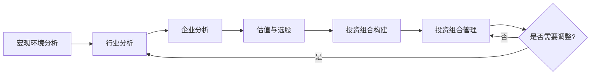

# 罗伯特哈格斯特朗的全球价值投资

> 关键词：罗伯特哈格斯特朗、全球价值投资、价值投资理念、投资策略、市场分析

> 摘要：本文深入探讨了罗伯特哈格斯特朗所倡导的全球价值投资理念。通过对其背景的介绍，明确了研究的目的、范围、预期读者以及文档结构。详细阐述了全球价值投资的核心概念、联系，分析了其核心算法原理和具体操作步骤，并运用数学模型和公式进行了理论支撑。结合项目实战案例，展示了如何在实际中运用相关理念和方法。同时介绍了全球价值投资的实际应用场景，推荐了相关的学习资源、开发工具框架以及论文著作。最后对全球价值投资的未来发展趋势与挑战进行了总结，并给出了常见问题的解答和扩展阅读的参考资料，旨在为投资者提供全面且深入的全球价值投资指引。

## 1. 背景介绍 
### 1.1 目的和范围
罗伯特哈格斯特朗是价值投资领域的知名人物，其全球价值投资理念在投资界具有广泛的影响力。本文的目的在于深入剖析他的全球价值投资理念，揭示其核心思想、操作方法和实际应用。研究范围涵盖了全球价值投资的理论基础、核心概念、算法原理、数学模型，以及在实际项目中的应用案例。通过对这些方面的研究，为投资者提供全面且深入的了解，帮助他们更好地运用全球价值投资策略进行投资决策。

### 1.2 预期读者
本文预期读者主要包括对价值投资感兴趣的个人投资者、专业投资机构的从业人员、金融领域的研究人员以及相关专业的学生。对于个人投资者，本文可以帮助他们掌握全球价值投资的方法和技巧，提高投资收益；对于专业投资机构的从业人员，能够为他们提供新的投资思路和策略；对于金融领域的研究人员，有助于他们深入研究价值投资理论；对于相关专业的学生，可作为学习价值投资的参考资料。

### 1.3 文档结构概述
本文将按照以下结构进行阐述：首先介绍全球价值投资的背景信息，包括目的、范围、预期读者和文档结构概述；接着详细讲解全球价值投资的核心概念与联系，通过文本示意图和 Mermaid 流程图进行直观展示；然后分析核心算法原理和具体操作步骤，并使用 Python 源代码进行详细阐述；再运用数学模型和公式对全球价值投资进行理论分析，并举例说明；之后通过项目实战案例，介绍开发环境搭建、源代码实现和代码解读；接着探讨全球价值投资的实际应用场景；推荐相关的学习资源、开发工具框架和论文著作；最后总结全球价值投资的未来发展趋势与挑战，给出常见问题的解答和扩展阅读的参考资料。

### 1.4 术语表
#### 1.4.1 核心术语定义
- **全球价值投资**：指投资者在全球范围内寻找被低估的资产，通过分析企业的基本面、财务状况、行业前景等因素，以低于其内在价值的价格买入，并长期持有，等待资产价值回归，从而获得投资收益的一种投资策略。
- **内在价值**：企业在其剩余寿命中可以产生的现金流量的折现值，是评估企业真实价值的重要指标。
- **安全边际**：指股票的市场价格低于其内在价值的幅度，是价值投资的重要原则之一，用于降低投资风险。

#### 1.4.2 相关概念解释
- **基本面分析**：通过对宏观经济、行业状况、企业财务等方面的分析，评估企业的内在价值和发展前景。
- **财务报表分析**：对企业的资产负债表、利润表、现金流量表等财务报表进行分析，了解企业的财务状况、经营成果和现金流量情况。
- **行业分析**：研究行业的发展趋势、竞争格局、市场规模等因素，评估行业的投资价值和风险。

#### 1.4.3 缩略词列表
- **PE**：市盈率，指股票价格与每股收益的比率，用于评估股票的估值水平。
- **PB**：市净率，指股票价格与每股净资产的比率，反映股票的市场价格相对于净资产的倍数。
- **DCF**：现金流折现模型，是一种通过预测企业未来的现金流量，并将其折现到当前的价值评估方法。

## 2. 核心概念与联系 
### 核心概念原理
全球价值投资的核心原理基于价值投资的基本理念，即寻找被市场低估的资产。在全球范围内，不同国家和地区的市场环境、经济发展水平、行业竞争格局等因素存在差异，这为投资者提供了更多寻找低估资产的机会。投资者通过对企业的基本面进行深入分析，包括财务状况、经营管理、行业前景等方面，评估企业的内在价值。当股票的市场价格低于其内在价值时，投资者认为该股票具有投资价值，从而买入并长期持有，等待市场价格向内在价值回归，实现投资收益。

### 架构的文本示意图
全球价值投资的架构可以分为以下几个层次：
1. **宏观环境分析**：包括全球经济形势、政治局势、货币政策等因素的分析，了解全球市场的整体趋势和风险。
2. **行业分析**：研究不同行业的发展前景、竞争格局、市场规模等因素，筛选出具有投资价值的行业。
3. **企业分析**：对行业内的企业进行基本面分析，包括财务状况、经营管理、技术创新等方面，评估企业的内在价值。
4. **估值与选股**：运用估值方法，如市盈率、市净率、现金流折现模型等，计算企业的内在价值，并与市场价格进行比较，选择被低估的股票。
5. **投资组合构建**：根据投资者的风险偏好和投资目标，将选择的股票构建成投资组合，实现分散投资，降低风险。
6. **投资组合管理**：定期对投资组合进行评估和调整，根据市场变化和企业基本面的变化，及时调整投资组合的结构。

### Mermaid 流程图


## 3. 核心算法原理 & 具体操作步骤 
### 核心算法原理
全球价值投资的核心算法主要涉及企业内在价值的计算和估值方法。常见的估值方法包括市盈率法、市净率法和现金流折现模型。

#### 市盈率法
市盈率（PE）是指股票价格与每股收益的比率，计算公式为：
$PE = \frac{P}{EPS}$
其中，$P$ 为股票价格，$EPS$ 为每股收益。市盈率法通过比较不同股票的市盈率，选择市盈率较低的股票进行投资。一般来说，市盈率较低的股票可能被市场低估，具有投资价值。

#### 市净率法
市净率（PB）是指股票价格与每股净资产的比率，计算公式为：
$PB = \frac{P}{BVPS}$
其中，$P$ 为股票价格，$BVPS$ 为每股净资产。市净率法通过比较不同股票的市净率，选择市净率较低的股票进行投资。市净率较低的股票可能被市场低估，具有一定的安全边际。

#### 现金流折现模型
现金流折现模型（DCF）是一种通过预测企业未来的现金流量，并将其折现到当前的价值评估方法。其基本原理是，企业的价值等于其未来现金流量的现值之和。计算公式为：
$V = \sum_{t=1}^{n} \frac{CF_t}{(1 + r)^t}$
其中，$V$ 为企业的内在价值，$CF_t$ 为第 $t$ 期的现金流量，$r$ 为折现率，$n$ 为预测期数。

### 具体操作步骤
#### 步骤 1：宏观环境分析
- 收集全球经济数据，包括 GDP 增长率、通货膨胀率、利率等指标，分析全球经济形势。
- 关注全球政治局势和政策变化，评估其对投资市场的影响。
- 研究不同国家和地区的货币政策，了解货币供应量和利率走势。

#### 步骤 2：行业分析
- 确定具有发展前景的行业，如科技、医疗、消费等。
- 分析行业的竞争格局，了解行业内的主要竞争对手和市场份额。
- 研究行业的市场规模和增长趋势，评估行业的投资价值。

#### 步骤 3：企业分析
- 收集企业的财务报表，包括资产负债表、利润表、现金流量表等，分析企业的财务状况。
- 研究企业的经营管理情况，包括管理层的能力、企业的战略规划等。
- 关注企业的技术创新能力和市场竞争力，评估企业的发展前景。

#### 步骤 4：估值与选股
- 运用市盈率法、市净率法或现金流折现模型等估值方法，计算企业的内在价值。
- 将企业的内在价值与市场价格进行比较，选择被低估的股票。
- 考虑股票的流动性、风险等因素，筛选出符合投资要求的股票。

#### 步骤 5：投资组合构建
- 根据投资者的风险偏好和投资目标，确定投资组合的资产配置比例。
- 将选择的股票按照一定的比例构建成投资组合，实现分散投资。
- 考虑投资组合的行业分布、地域分布等因素，降低投资组合的风险。

#### 步骤 6：投资组合管理
- 定期对投资组合进行评估和调整，根据市场变化和企业基本面的变化，及时调整投资组合的结构。
- 关注投资组合的风险状况，采取适当的风险控制措施，如止损、止盈等。
- 评估投资组合的业绩表现，总结经验教训，不断优化投资策略。

### Python 源代码实现
```python
import pandas as pd
import numpy as np

# 市盈率法选股
def pe_selection(data, pe_threshold):
    """
    data: 包含股票代码、股票价格、每股收益的数据框
    pe_threshold: 市盈率阈值
    """
    data['PE'] = data['Price'] / data['EPS']
    selected_stocks = data[data['PE'] < pe_threshold]
    return selected_stocks

# 市净率法选股
def pb_selection(data, pb_threshold):
    """
    data: 包含股票代码、股票价格、每股净资产的数据框
    pb_threshold: 市净率阈值
    """
    data['PB'] = data['Price'] / data['BVPS']
    selected_stocks = data[data['PB'] < pb_threshold]
    return selected_stocks

# 现金流折现模型计算企业内在价值
def dcf_valuation(cash_flows, discount_rate):
    """
    cash_flows: 未来各期的现金流量列表
    discount_rate: 折现率
    """
    n = len(cash_flows)
    present_values = []
    for t in range(n):
        present_value = cash_flows[t] / ((1 + discount_rate) ** (t + 1))
        present_values.append(present_value)
    intrinsic_value = sum(present_values)
    return intrinsic_value

# 示例数据
data = pd.DataFrame({
    'StockCode': ['000001', '000002', '000003'],
    'Price': [10, 20, 30],
    'EPS': [1, 2, 3],
    'BVPS': [5, 10, 15]
})

# 市盈率法选股示例
pe_selected = pe_selection(data, 10)
print("市盈率法选股结果：")
print(pe_selected)

# 市净率法选股示例
pb_selected = pb_selection(data, 2)
print("市净率法选股结果：")
print(pb_selected)

# 现金流折现模型示例
cash_flows = [100, 200, 300]
discount_rate = 0.1
intrinsic_value = dcf_valuation(cash_flows, discount_rate)
print("企业内在价值：", intrinsic_value)
```

## 4. 数学模型和公式 & 详细讲解 & 举例说明 
### 市盈率模型
#### 公式
$PE = \frac{P}{EPS}$
其中，$PE$ 为市盈率，$P$ 为股票价格，$EPS$ 为每股收益。

#### 详细讲解
市盈率是衡量股票估值水平的常用指标之一。它反映了投资者为获得每股收益所愿意支付的价格。一般来说，市盈率较低的股票可能被市场低估，具有投资价值；而市盈率较高的股票可能被市场高估，投资风险较大。

#### 举例说明
假设某股票的价格为 $20$ 元，每股收益为 $2$ 元，则该股票的市盈率为：
$PE = \frac{20}{2} = 10$
如果同行业的平均市盈率为 $15$，则该股票的市盈率相对较低，可能被市场低估，具有一定的投资价值。

### 市净率模型
#### 公式
$PB = \frac{P}{BVPS}$
其中，$PB$ 为市净率，$P$ 为股票价格，$BVPS$ 为每股净资产。

#### 详细讲解
市净率反映了股票的市场价格相对于净资产的倍数。市净率较低的股票可能被市场低估，具有一定的安全边际。因为即使企业破产清算，投资者也可以获得一定的净资产价值。

#### 举例说明
假设某股票的价格为 $15$ 元，每股净资产为 $10$ 元，则该股票的市净率为：
$PB = \frac{15}{10} = 1.5$
如果同行业的平均市净率为 $2$，则该股票的市净率相对较低，可能被市场低估，具有一定的投资价值。

### 现金流折现模型
#### 公式
$V = \sum_{t=1}^{n} \frac{CF_t}{(1 + r)^t}$
其中，$V$ 为企业的内在价值，$CF_t$ 为第 $t$ 期的现金流量，$r$ 为折现率，$n$ 为预测期数。

#### 详细讲解
现金流折现模型的基本思想是，企业的价值等于其未来现金流量的现值之和。未来现金流量是指企业在未来各期能够产生的现金流入减去现金流出的净额。折现率是将未来现金流量折现到当前的比率，反映了资金的时间价值和投资风险。预测期数是指预测企业未来现金流量的期限。

#### 举例说明
假设某企业未来三年的现金流量分别为 $100$ 万元、$200$ 万元、$300$ 万元，折现率为 $10\%$，则该企业的内在价值为：
$V = \frac{100}{(1 + 0.1)^1} + \frac{200}{(1 + 0.1)^2} + \frac{300}{(1 + 0.1)^3}$
$V = \frac{100}{1.1} + \frac{200}{1.21} + \frac{300}{1.331}$
$V \approx 90.91 + 165.29 + 225.39$
$V \approx 481.59$（万元）

## 5. 项目实战：代码实际案例和详细解释说明 
### 5.1  开发环境搭建
#### 操作系统
可以选择 Windows、Linux 或 macOS 操作系统。

#### 编程语言
使用 Python 编程语言，推荐使用 Python 3.7 及以上版本。

#### 开发工具
可以使用 PyCharm、Jupyter Notebook 等开发工具。

#### 安装必要的库
在命令行中使用以下命令安装必要的库：
```sh
pip install pandas numpy
```

### 5.2  源代码详细实现和代码解读
```python
import pandas as pd
import numpy as np

# 市盈率法选股
def pe_selection(data, pe_threshold):
    """
    data: 包含股票代码、股票价格、每股收益的数据框
    pe_threshold: 市盈率阈值
    """
    data['PE'] = data['Price'] / data['EPS']
    selected_stocks = data[data['PE'] < pe_threshold]
    return selected_stocks

# 市净率法选股
def pb_selection(data, pb_threshold):
    """
    data: 包含股票代码、股票价格、每股净资产的数据框
    pb_threshold: 市净率阈值
    """
    data['PB'] = data['Price'] / data['BVPS']
    selected_stocks = data[data['PB'] < pb_threshold]
    return selected_stocks

# 现金流折现模型计算企业内在价值
def dcf_valuation(cash_flows, discount_rate):
    """
    cash_flows: 未来各期的现金流量列表
    discount_rate: 折现率
    """
    n = len(cash_flows)
    present_values = []
    for t in range(n):
        present_value = cash_flows[t] / ((1 + discount_rate) ** (t + 1))
        present_values.append(present_value)
    intrinsic_value = sum(present_values)
    return intrinsic_value

# 示例数据
data = pd.DataFrame({
    'StockCode': ['000001', '000002', '000003'],
    'Price': [10, 20, 30],
    'EPS': [1, 2, 3],
    'BVPS': [5, 10, 15]
})

# 市盈率法选股示例
pe_selected = pe_selection(data, 10)
print("市盈率法选股结果：")
print(pe_selected)

# 市净率法选股示例
pb_selected = pb_selection(data, 2)
print("市净率法选股结果：")
print(pb_selected)

# 现金流折现模型示例
cash_flows = [100, 200, 300]
discount_rate = 0.1
intrinsic_value = dcf_valuation(cash_flows, discount_rate)
print("企业内在价值：", intrinsic_value)
```

#### 代码解读
1. **导入必要的库**：导入 `pandas` 和 `numpy` 库，用于数据处理和数值计算。
2. **定义市盈率法选股函数**：`pe_selection` 函数接受一个包含股票代码、股票价格和每股收益的数据框以及一个市盈率阈值作为输入，计算每只股票的市盈率，并筛选出市盈率低于阈值的股票。
3. **定义市净率法选股函数**：`pb_selection` 函数接受一个包含股票代码、股票价格和每股净资产的数据框以及一个市净率阈值作为输入，计算每只股票的市净率，并筛选出市净率低于阈值的股票。
4. **定义现金流折现模型函数**：`dcf_valuation` 函数接受一个未来各期的现金流量列表和一个折现率作为输入，计算企业的内在价值。
5. **创建示例数据**：使用 `pandas` 的 `DataFrame` 函数创建一个包含股票代码、股票价格、每股收益和每股净资产的示例数据框。
6. **进行选股和估值计算**：调用 `pe_selection` 函数和 `pb_selection` 函数进行选股，并调用 `dcf_valuation` 函数计算企业的内在价值。
7. **输出结果**：打印选股结果和企业的内在价值。

### 5.3  代码解读与分析
通过上述代码，我们可以实现基于市盈率法、市净率法和现金流折现模型的选股和估值计算。市盈率法和市净率法是比较简单的估值方法，通过比较不同股票的市盈率和市净率，选择被低估的股票。现金流折现模型则是一种更为复杂的估值方法，需要对企业未来的现金流量进行预测，并选择合适的折现率。在实际应用中，投资者可以根据自己的需求和偏好选择合适的估值方法，并结合其他因素进行投资决策。

## 6. 实际应用场景 
### 个人投资者
个人投资者可以运用全球价值投资理念，在全球范围内寻找被低估的股票进行投资。通过对不同国家和地区的市场进行分析，选择具有投资价值的股票构建投资组合，实现资产的增值。同时，个人投资者可以根据自己的风险偏好和投资目标，调整投资组合的结构，降低投资风险。

### 专业投资机构
专业投资机构可以利用全球价值投资策略，管理大规模的资产。通过深入的研究和分析，挖掘全球市场中的投资机会，为客户提供优质的投资产品和服务。专业投资机构还可以运用量化投资模型和风险管理工具，提高投资效率和风险控制能力。

### 跨国企业
跨国企业可以运用全球价值投资理念，进行战略投资和并购。通过对全球范围内的企业进行评估和分析，选择具有潜力的企业进行投资或并购，实现企业的扩张和多元化发展。同时，跨国企业可以利用全球价值投资策略，优化企业的资产配置，提高企业的经济效益。

## 7. 工具和资源推荐
### 7.1 学习资源推荐
#### 7.1.1 书籍推荐
- 《聪明的投资者》：本杰明·格雷厄姆著，价值投资领域的经典著作，介绍了价值投资的基本理念和方法。
- 《证券分析》：本杰明·格雷厄姆和戴维·多德著，详细阐述了证券分析的理论和方法，是价值投资者的必读之书。
- 《巴菲特致股东的信》：沃伦·巴菲特著，收录了巴菲特多年来致股东的信，展示了他的投资理念和决策过程。

#### 7.1.2 在线课程
- Coursera 上的《投资学原理》：由知名大学的教授授课，介绍了投资学的基本原理和方法。
- edX 上的《价值投资基础》：系统讲解了价值投资的理论和实践，适合初学者学习。

#### 7.1.3 技术博客和网站
- 雪球网：国内知名的投资社区，提供股票、基金等投资产品的分析和讨论。
- Seeking Alpha：国外知名的投资网站，提供全球市场的投资分析和研究报告。

### 7.2 开发工具框架推荐
#### 7.2.1 IDE和编辑器
- PyCharm：专业的 Python 集成开发环境，提供代码编辑、调试、版本控制等功能。
- Jupyter Notebook：交互式的开发环境，适合进行数据分析和模型验证。

#### 7.2.2 调试和性能分析工具
- PDB：Python 自带的调试工具，用于调试 Python 代码。
- cProfile：Python 自带的性能分析工具，用于分析 Python 代码的性能瓶颈。

#### 7.2.3 相关框架和库
- Pandas：用于数据处理和分析的 Python 库，提供了高效的数据结构和数据分析工具。
- NumPy：用于数值计算的 Python 库，提供了高效的数组操作和数学函数。

### 7.3 相关论文著作推荐
#### 7.3.1 经典论文
- 《有效市场假说》：尤金·法玛著，提出了有效市场假说，对金融市场的研究产生了深远的影响。
- 《资本资产定价模型》：威廉·夏普著，提出了资本资产定价模型，用于解释资产的预期收益率与风险之间的关系。

#### 7.3.2 最新研究成果
- 关注顶级金融学术期刊，如《Journal of Finance》、《Review of Financial Studies》等，了解全球价值投资领域的最新研究成果。

#### 7.3.3 应用案例分析
- 研究知名投资机构和投资者的投资案例，如巴菲特的投资组合、桥水基金的投资策略等，学习他们的投资理念和方法。

## 8. 总结：未来发展趋势与挑战
### 未来发展趋势
- **全球化程度加深**：随着全球经济一体化的发展，全球价值投资的市场范围将进一步扩大，投资者将有更多的机会在全球范围内寻找被低估的资产。
- **科技应用加速**：人工智能、大数据、区块链等技术将在全球价值投资中得到更广泛的应用，提高投资决策的效率和准确性。
- **可持续投资兴起**：投资者将更加关注企业的社会责任和可持续发展能力，可持续投资将成为全球价值投资的重要方向。

### 挑战
- **市场不确定性增加**：全球政治、经济形势的不确定性增加，如贸易摩擦、地缘政治冲突等，将给全球价值投资带来更大的风险。
- **信息过载**：随着信息传播的加速和信息总量的增加，投资者面临着信息过载的问题，如何筛选和分析有效信息成为挑战。
- **竞争加剧**：全球价值投资市场的竞争将日益激烈，投资者需要不断提升自己的专业能力和投资水平，才能在市场中取得优势。

## 9. 附录：常见问题与解答
### 问题 1：全球价值投资与传统价值投资有什么区别？
全球价值投资是在全球范围内寻找被低估的资产，而传统价值投资通常局限于某个国家或地区的市场。全球价值投资可以利用不同国家和地区市场的差异，获得更多的投资机会，但也面临着更多的风险和挑战，如汇率风险、政治风险等。

### 问题 2：如何确定企业的内在价值？
确定企业的内在价值可以运用多种估值方法，如市盈率法、市净率法、现金流折现模型等。不同的估值方法适用于不同的企业和行业，投资者可以根据实际情况选择合适的估值方法。同时，企业的内在价值还受到宏观经济环境、行业发展趋势、企业经营管理等多种因素的影响，需要综合考虑。

### 问题 3：全球价值投资的风险有哪些？
全球价值投资的风险主要包括市场风险、汇率风险、政治风险、行业风险等。市场风险是指由于市场波动导致股票价格下跌的风险；汇率风险是指由于汇率变动导致投资收益损失的风险；政治风险是指由于政治局势不稳定导致投资环境恶化的风险；行业风险是指由于行业发展不景气导致企业业绩下滑的风险。投资者需要通过分散投资、风险控制等方法降低投资风险。

## 10. 扩展阅读 & 参考资料
### 扩展阅读
- 《投资最重要的事》：霍华德·马克斯著，介绍了投资中的重要原则和方法，对价值投资者有很大的启发。
- 《金融炼金术》：乔治·索罗斯著，阐述了索罗斯的投资哲学和投资策略，适合对投资理论有深入研究的读者阅读。

### 参考资料
- 罗伯特·哈格斯特朗的相关著作和文章。
- 金融学术期刊上的相关研究论文。
- 各大金融网站和投资社区的分析报告和讨论内容。

作者：AI天才研究院/AI Genius Institute & 禅与计算机程序设计艺术 /Zen And The Art of Computer Programming