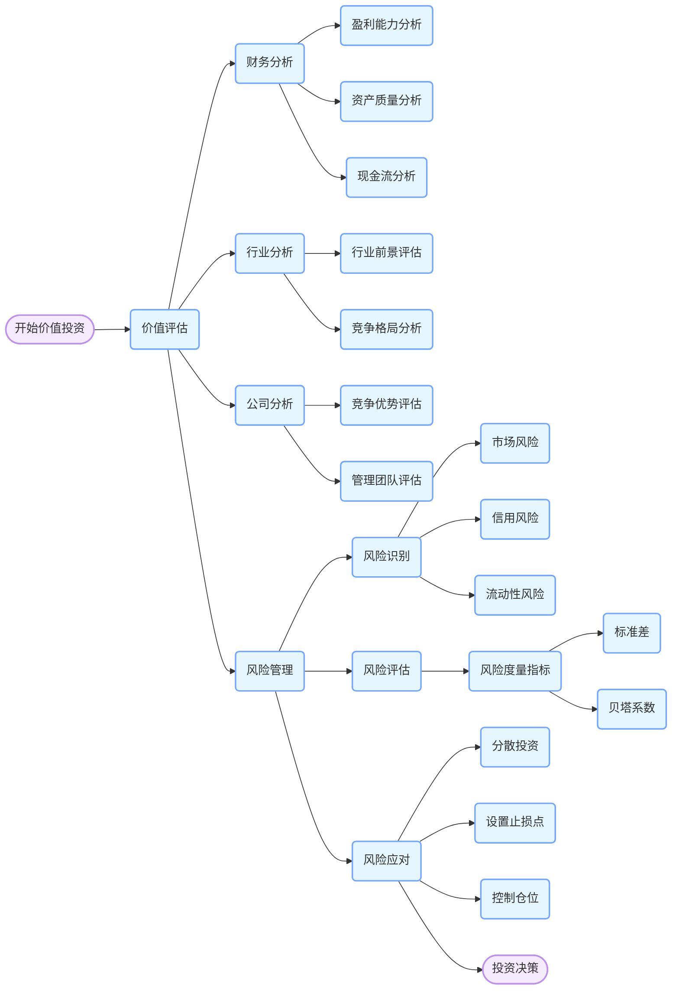

# 罗杰·洛温斯坦的价值投资风险管理

> 关键词：罗杰·洛温斯坦、价值投资、风险管理、金融市场、投资策略

> 摘要：本文围绕罗杰·洛温斯坦的价值投资风险管理展开深入探讨。首先介绍了相关背景，包括目的、预期读者、文档结构和术语表。接着阐述了价值投资与风险管理的核心概念及联系，给出了原理和架构的文本示意图与Mermaid流程图。详细讲解了核心算法原理和具体操作步骤，并用Python代码进行了说明。通过数学模型和公式对价值投资风险管理进行了深入剖析，并举例说明。以实际项目案例展示了如何在实践中应用这些理论和方法，包括开发环境搭建、源代码实现与解读。分析了其在不同场景下的实际应用，推荐了学习、开发相关的工具和资源，包括书籍、在线课程、技术博客、开发工具框架和相关论文著作等。最后总结了未来发展趋势与挑战，解答了常见问题，并提供了扩展阅读和参考资料。

## 1. 背景介绍 

### 1.1 目的和范围
本文章的主要目的是深入研究罗杰·洛温斯坦所倡导的价值投资风险管理理念，剖析其核心思想、方法和应用。罗杰·洛温斯坦是一位著名的财经作家，他对金融市场和投资领域有着深刻的见解，其作品涉及众多知名金融事件和投资人物。我们将聚焦于他的价值投资风险管理相关理念，探讨如何在实际投资中运用这些理念来降低风险、提高收益。

研究范围涵盖了价值投资的基本概念、风险管理的主要方法、相关的数学模型和公式，以及在实际项目中的应用案例。通过对这些内容的详细分析，帮助读者全面理解罗杰·洛温斯坦的价值投资风险管理体系，并能够将其应用到自己的投资实践中。

### 1.2 预期读者
本文预期读者包括对投资领域感兴趣的初学者，他们希望通过了解专业的价值投资风险管理方法来开启自己的投资之旅；也包括有一定投资经验的投资者，他们希望从罗杰·洛温斯坦的独特视角中获取新的思路和方法，进一步优化自己的投资策略；同时，金融专业的学生和研究人员也可以从本文中获取有价值的学术参考和研究素材。

### 1.3 文档结构概述
本文将按照以下结构展开：首先介绍背景信息，让读者了解文章的目的、预期读者和整体结构。接着阐述价值投资与风险管理的核心概念及它们之间的联系，通过文本示意图和Mermaid流程图进行直观展示。然后详细讲解核心算法原理和具体操作步骤，并用Python代码进行实现和说明。之后通过数学模型和公式对价值投资风险管理进行深入分析，并举例说明。再通过实际项目案例展示如何在实践中应用这些理论和方法，包括开发环境搭建、源代码实现与解读。分析其在不同场景下的实际应用，推荐学习、开发相关的工具和资源。最后总结未来发展趋势与挑战，解答常见问题，并提供扩展阅读和参考资料。

### 1.4 术语表

#### 1.4.1 核心术语定义
- **价值投资**：是一种投资策略，其核心思想是通过对股票、债券等金融资产的内在价值进行评估，寻找被市场低估的资产进行投资，以获取长期的资本增值。
- **风险管理**：是指在投资过程中，通过识别、评估和应对各种风险因素，采取相应的措施来降低风险对投资组合的影响，确保投资目标的实现。
- **内在价值**：是指资产本身所具有的价值，它不受市场价格波动的影响，而是由资产的基本面因素，如公司的盈利能力、资产质量、现金流等决定。
- **安全边际**：是价值投资中的一个重要概念，指的是股票的内在价值与市场价格之间的差值。安全边际越大，投资的风险就越低。

#### 1.4.2 相关概念解释
- **市场效率**：市场效率是指市场价格反映资产内在价值的程度。在有效市场中，市场价格能够迅速、准确地反映所有可用的信息，因此很难通过价值投资策略获得超额收益。而在非有效市场中，市场价格可能会偏离资产的内在价值，为价值投资者提供了投资机会。
- **风险溢价**：是指投资者为了承担额外的风险而要求获得的额外收益。在价值投资中，投资者通常会寻找那些具有较高风险溢价的资产，以获得更高的回报。

#### 1.4.3 缩略词列表
- **PV**：Present Value，现值
- **NPV**：Net Present Value，净现值
- **IRR**：Internal Rate of Return，内部收益率

## 2. 核心概念与联系 

### 核心概念原理
罗杰·洛温斯坦的价值投资风险管理基于价值投资的基本原理，强调通过深入研究和分析，寻找被市场低估的资产，并通过合理的风险管理措施来降低投资风险。

价值投资的核心在于对资产内在价值的评估。投资者需要通过分析公司的财务报表、行业前景、竞争优势等因素，来估算资产的内在价值。如果市场价格低于内在价值，那么该资产就被认为是被低估的，具有投资价值。

风险管理则是在价值投资的基础上，对投资过程中可能面临的各种风险进行识别、评估和应对。常见的风险包括市场风险、信用风险、流动性风险等。投资者可以通过分散投资、设置止损点、控制仓位等方法来降低风险。

### 架构的文本示意图
```
价值投资风险管理架构

|-- 价值评估
|   |-- 财务分析
|   |   |-- 盈利能力分析
|   |   |-- 资产质量分析
|   |   |-- 现金流分析
|   |-- 行业分析
|   |   |-- 行业前景评估
|   |   |-- 竞争格局分析
|   |-- 公司分析
|       |-- 竞争优势评估
|       |-- 管理团队评估
|
|-- 风险管理
|   |-- 风险识别
|   |   |-- 市场风险
|   |   |-- 信用风险
|   |   |-- 流动性风险
|   |-- 风险评估
|   |   |-- 风险度量指标
|   |   |   |-- 标准差
|   |   |   |-- 贝塔系数
|   |-- 风险应对
|       |-- 分散投资
|       |-- 设置止损点
|       |-- 控制仓位
```

### Mermaid流程图


## 3. 核心算法原理 & 具体操作步骤 

### 核心算法原理
在价值投资风险管理中，有几个重要的算法原理，如净现值（NPV）和内部收益率（IRR）。

#### 净现值（NPV）
净现值是指投资项目在未来各期现金流量的现值之和与初始投资之间的差值。其计算公式为：

$$NPV = \sum_{t=0}^{n} \frac{CF_t}{(1 + r)^t}$$

其中，$CF_t$ 表示第 $t$ 期的现金流量，$r$ 表示折现率，$n$ 表示投资项目的期限。

如果 $NPV > 0$，则说明该投资项目具有正的净现值，值得投资；如果 $NPV < 0$，则说明该投资项目的净现值为负，不建议投资。

#### 内部收益率（IRR）
内部收益率是指使投资项目的净现值等于零的折现率。即满足以下方程的 $r$ 值：

$$\sum_{t=0}^{n} \frac{CF_t}{(1 + IRR)^t} = 0$$

内部收益率反映了投资项目的实际收益率。如果内部收益率大于投资者要求的最低收益率，则说明该投资项目具有吸引力。

### 具体操作步骤
#### 步骤1：收集数据
收集投资项目的相关数据，包括各期的现金流量、初始投资、投资期限等。

#### 步骤2：确定折现率
折现率是反映资金时间价值和投资风险的重要参数。通常可以根据市场利率、投资项目的风险水平等因素来确定折现率。

#### 步骤3：计算净现值和内部收益率
使用上述公式计算投资项目的净现值和内部收益率。

#### 步骤4：进行投资决策
根据净现值和内部收益率的计算结果，进行投资决策。如果 $NPV > 0$ 且 $IRR$ 大于投资者要求的最低收益率，则可以考虑投资该项目；否则，应谨慎投资或放弃该项目。

### Python源代码实现
```python
import numpy as np
from scipy.optimize import newton

def npv(cash_flows, discount_rate):
    """
    计算净现值
    :param cash_flows: 各期现金流量列表，第一个元素为初始投资（负数）
    :param discount_rate: 折现率
    :return: 净现值
    """
    periods = np.arange(len(cash_flows))
    present_values = cash_flows / (1 + discount_rate) ** periods
    return present_values.sum()

def irr(cash_flows):
    """
    计算内部收益率
    :param cash_flows: 各期现金流量列表，第一个元素为初始投资（负数）
    :return: 内部收益率
    """
    def npv_irr(r):
        return npv(cash_flows, r)
    return newton(npv_irr, 0.1)

# 示例数据
cash_flows = [-1000, 300, 300, 300, 300]  # 初始投资1000，后续四年每年现金流入300
discount_rate = 0.1  # 折现率为10%

# 计算净现值
npv_result = npv(cash_flows, discount_rate)
print(f"净现值: {npv_result}")

# 计算内部收益率
irr_result = irr(cash_flows)
print(f"内部收益率: {irr_result * 100:.2f}%")
```

## 4. 数学模型和公式 & 详细讲解 & 举例说明 

### 净现值（NPV）
#### 详细讲解
净现值是一种衡量投资项目盈利能力的重要指标。它考虑了资金的时间价值，将未来各期的现金流量折现到当前时刻，然后与初始投资进行比较。

从数学角度来看，净现值的计算公式是一个等比数列求和的形式。折现率 $r$ 反映了资金的时间价值和投资风险。折现率越高，未来现金流量的现值就越低，说明投资者对风险的要求越高。

#### 举例说明
假设有一个投资项目，初始投资为 $1000$ 元，预计在未来三年每年年末分别获得现金流入 $300$ 元、$400$ 元、$500$ 元。折现率为 $10\%$。

首先，计算各期现金流量的现值：

第1年现金流量的现值：$PV_1 = \frac{300}{(1 + 0.1)^1} = 272.73$ 元

第2年现金流量的现值：$PV_2 = \frac{400}{(1 + 0.1)^2} = 330.58$ 元

第3年现金流量的现值：$PV_3 = \frac{500}{(1 + 0.1)^3} = 375.66$ 元

然后，计算净现值：

$NPV = -1000 + 272.73 + 330.58 + 375.66 = -21.03$ 元

由于 $NPV < 0$，说明该投资项目在折现率为 $10\%$ 的情况下，不具有投资价值。

### 内部收益率（IRR）
#### 详细讲解
内部收益率是指使投资项目的净现值等于零的折现率。它反映了投资项目的实际收益率。

从数学角度来看，内部收益率的计算是一个求解非线性方程的过程。通常可以使用迭代法或数值方法来求解。

#### 举例说明
还是以上述投资项目为例，我们需要求解方程：

$$-1000 + \frac{300}{(1 + IRR)^1} + \frac{400}{(1 + IRR)^2} + \frac{500}{(1 + IRR)^3} = 0$$

使用 Python 中的 `scipy.optimize.newton` 函数可以求解该方程：

```python
import numpy as np
from scipy.optimize import newton

cash_flows = [-1000, 300, 400, 500]

def npv_irr(r):
    periods = np.arange(len(cash_flows))
    present_values = cash_flows / (1 + r) ** periods
    return present_values.sum()

irr_result = newton(npv_irr, 0.1)
print(f"内部收益率: {irr_result * 100:.2f}%")
```

假设计算得到的内部收益率为 $8.5\%$，如果投资者要求的最低收益率为 $10\%$，则说明该投资项目的实际收益率低于投资者的要求，不建议投资。

### 安全边际
#### 数学模型和公式
安全边际的计算公式为：

$$安全边际 = \frac{内在价值 - 市场价格}{内在价值}$$

#### 详细讲解
安全边际反映了投资的风险程度。安全边际越大，说明市场价格与内在价值之间的差距越大，投资的风险就越低。

#### 举例说明
假设某股票的内在价值为 $50$ 元，市场价格为 $40$ 元，则安全边际为：

$$安全边际 = \frac{50 - 40}{50} = 0.2 = 20\%$$

这意味着该股票的市场价格比内在价值低 $20\%$，具有一定的安全边际。投资者可以在一定程度上抵御市场价格波动的风险。

## 5. 项目实战：代码实际案例和详细解释说明 

### 5.1  开发环境搭建
#### 操作系统
可以选择 Windows、Linux 或 macOS 等主流操作系统。

#### Python 环境
安装 Python 3.x 版本，可以从 Python 官方网站（https://www.python.org/downloads/） 下载并安装。

#### 第三方库
需要安装以下第三方库：
- `numpy`：用于数值计算
- `scipy`：用于科学计算，包括求解非线性方程
- `pandas`：用于数据处理和分析
- `matplotlib`：用于数据可视化

可以使用 `pip` 命令来安装这些库：

```sh
pip install numpy scipy pandas matplotlib
```

### 5.2  源代码详细实现和代码解读
```python
import numpy as np
import pandas as pd
import matplotlib.pyplot as plt
from scipy.optimize import newton

def npv(cash_flows, discount_rate):
    """
    计算净现值
    :param cash_flows: 各期现金流量列表，第一个元素为初始投资（负数）
    :param discount_rate: 折现率
    :return: 净现值
    """
    periods = np.arange(len(cash_flows))
    present_values = cash_flows / (1 + discount_rate) ** periods
    return present_values.sum()

def irr(cash_flows):
    """
    计算内部收益率
    :param cash_flows: 各期现金流量列表，第一个元素为初始投资（负数）
    :return: 内部收益率
    """
    def npv_irr(r):
        return npv(cash_flows, r)
    return newton(npv_irr, 0.1)

# 模拟投资项目数据
projects = [
    {"name": "项目A", "cash_flows": [-1000, 300, 300, 300, 300]},
    {"name": "项目B", "cash_flows": [-1500, 400, 400, 400, 400, 400]},
    {"name": "项目C", "cash_flows": [-2000, 500, 500, 500, 500, 500, 500]}
]

discount_rate = 0.1  # 折现率为10%

# 计算每个项目的净现值和内部收益率
results = []
for project in projects:
    name = project["name"]
    cash_flows = np.array(project["cash_flows"])
    npv_result = npv(cash_flows, discount_rate)
    irr_result = irr(cash_flows)
    results.append({"name": name, "NPV": npv_result, "IRR": irr_result})

# 将结果转换为 DataFrame
results_df = pd.DataFrame(results)

# 打印结果
print(results_df)

# 可视化结果
plt.figure(figsize=(10, 6))
bar_width = 0.35
index = np.arange(len(results_df))

plt.bar(index, results_df["NPV"], bar_width, label="净现值")
plt.bar(index + bar_width, results_df["IRR"] * 100, bar_width, label="内部收益率（%）")

plt.xlabel("项目名称")
plt.ylabel("数值")
plt.title("各项目净现值和内部收益率比较")
plt.xticks(index + bar_width / 2, results_df["name"])
plt.legend()

plt.show()
```

### 5.3  代码解读与分析
#### 代码功能概述
这段代码模拟了三个投资项目，分别计算了每个项目的净现值和内部收益率，并将结果存储在一个 DataFrame 中进行展示。最后，使用 `matplotlib` 库将结果进行可视化，方便比较不同项目的盈利能力。

#### 代码详细解读
1. **函数定义**：
    - `npv` 函数：用于计算净现值。它接受各期现金流量列表和折现率作为输入，返回净现值。
    - `irr` 函数：用于计算内部收益率。它通过定义一个内部函数 `npv_irr` 来计算净现值，并使用 `scipy.optimize.newton` 函数求解使净现值等于零的折现率。

2. **数据模拟**：
    - `projects` 列表：存储了三个投资项目的信息，包括项目名称和各期现金流量。

3. **计算净现值和内部收益率**：
    - 使用 `for` 循环遍历每个项目，调用 `npv` 和 `irr` 函数计算净现值和内部收益率，并将结果存储在 `results` 列表中。

4. **结果展示**：
    - 将 `results` 列表转换为 `pandas` 的 DataFrame，并打印结果。
    - 使用 `matplotlib` 库绘制柱状图，比较不同项目的净现值和内部收益率。

#### 结果分析
通过计算净现值和内部收益率，可以对不同投资项目的盈利能力进行评估。净现值大于零且内部收益率高于折现率的项目通常具有投资价值。在这个例子中，我们可以根据计算结果选择最优的投资项目。

## 6. 实际应用场景 
### 股票投资
在股票投资中，罗杰·洛温斯坦的价值投资风险管理理念可以帮助投资者筛选出具有投资价值的股票。投资者可以通过分析公司的财务报表、行业前景等因素，估算股票的内在价值，并与市场价格进行比较。如果股票的市场价格低于内在价值，且具有一定的安全边际，那么投资者可以考虑买入该股票。同时，通过分散投资不同行业、不同规模的股票，可以降低市场风险。

### 债券投资
在债券投资中，价值投资风险管理理念同样适用。投资者可以通过分析债券的信用评级、票面利率、到期收益率等因素，评估债券的内在价值。如果债券的市场价格低于内在价值，那么投资者可以考虑买入该债券。此外，投资者还可以通过分散投资不同期限、不同信用等级的债券，降低信用风险和利率风险。

### 项目投资
在进行项目投资时，投资者可以使用净现值和内部收益率等指标来评估项目的盈利能力。通过预测项目的未来现金流量，并选择合适的折现率，计算项目的净现值和内部收益率。如果项目的净现值大于零且内部收益率高于投资者要求的最低收益率，那么该项目具有投资价值。同时，投资者还需要考虑项目的风险因素，如市场风险、技术风险等，并采取相应的风险管理措施。

### 基金投资
在基金投资中，投资者可以根据基金的投资策略、历史业绩、管理团队等因素，选择符合价值投资理念的基金。例如，选择那些注重基本面分析、长期投资的基金。同时，投资者可以通过分散投资不同类型的基金，如股票型基金、债券型基金、混合型基金等，降低投资组合的风险。

## 7. 工具和资源推荐

### 7.1 学习资源推荐

#### 7.1.1 书籍推荐
- 《聪明的投资者》（The Intelligent Investor）：作者是本杰明·格雷厄姆（Benjamin Graham），这本书是价值投资的经典之作，对价值投资的理念和方法进行了系统的阐述。
- 《证券分析》（Security Analysis）：同样是本杰明·格雷厄姆的著作，被誉为投资领域的“圣经”，详细介绍了证券分析的基本方法和技巧。
- 《巴菲特致股东的信：股份公司教程》（Letters to Shareholders of Berkshire Hathaway）：作者是沃伦·巴菲特（Warren Buffett），这本书收录了巴菲特历年致股东的信，从中可以学习到巴菲特的投资理念和管理经验。
- 《金融炼金术》（The Alchemy of Finance）：作者是乔治·索罗斯（George Soros），这本书介绍了索罗斯的反身性理论和投资策略，对理解金融市场的运行机制有很大的帮助。

#### 7.1.2 在线课程
- Coursera 上的“投资学原理”（Principles of Investments）：由宾夕法尼亚大学的教授授课，课程内容涵盖了投资学的基本概念、资产定价模型、投资组合理论等方面。
- edX 上的“金融市场”（Financial Markets）：由耶鲁大学的教授授课，课程介绍了金融市场的基本结构、金融工具的定价和风险管理等内容。
- 中国大学 MOOC 上的“证券投资学”：由国内高校的教授授课，结合中国金融市场的实际情况，介绍了证券投资的基本理论和方法。

#### 7.1.3 技术博客和网站
- Seeking Alpha：一个专注于金融市场和投资分析的网站，提供了大量的股票、债券、基金等投资产品的分析报告和评论。
- ValueWalk：一个价值投资博客，分享了许多价值投资者的观点和经验，以及对市场动态的分析。
- 雪球网：国内知名的投资交流社区，汇聚了众多投资者和投资专家，提供了丰富的投资资讯和交流平台。

### 7.2 开发工具框架推荐

#### 7.2.1 IDE和编辑器
- PyCharm：一款专业的 Python 集成开发环境，具有强大的代码编辑、调试、代码分析等功能，适合 Python 开发者使用。
- Jupyter Notebook：一个交互式的开发环境，支持 Python、R 等多种编程语言，方便进行数据探索、模型开发和结果展示。
- Visual Studio Code：一款轻量级的代码编辑器，支持多种编程语言和插件扩展，具有丰富的开发工具和社区资源。

#### 7.2.2 调试和性能分析工具
- PDB：Python 自带的调试工具，可以在代码中设置断点，逐步执行代码，查看变量的值和程序的执行流程。
- cProfile：Python 标准库中的性能分析工具，可以统计代码中各个函数的执行时间和调用次数，帮助开发者找出性能瓶颈。
- Py-Spy：一个用于分析 Python 程序性能的工具，可以实时监控 Python 程序的 CPU 使用情况和函数调用情况。

#### 7.2.3 相关框架和库
- Pandas：一个强大的数据处理和分析库，提供了丰富的数据结构和数据操作方法，方便进行数据清洗、转换和分析。
- NumPy：一个用于科学计算的基础库，提供了高效的多维数组对象和各种数学函数，是许多数据分析和机器学习库的基础。
- Scikit-learn：一个常用的机器学习库，提供了各种机器学习算法和工具，如分类、回归、聚类等，方便进行模型开发和评估。

### 7.3 相关论文著作推荐

#### 7.3.1 经典论文
- Eugene F. Fama 和 Kenneth R. French 的“Common Risk Factors in the Returns on Stocks and Bonds”：这篇论文提出了著名的三因子模型，解释了股票和债券收益率的影响因素。
- Harry Markowitz 的“Portfolio Selection”：这篇论文开创了现代投资组合理论，提出了均值 - 方差分析方法，为投资组合的优化提供了理论基础。
- Stephen A. Ross 的“The Arbitrage Theory of Capital Asset Pricing”：这篇论文提出了套利定价理论（APT），为资产定价提供了另一种理论框架。

#### 7.3.2 最新研究成果
- 关注《Journal of Finance》、《Review of Financial Studies》、《Journal of Financial Economics》等金融领域的顶级学术期刊，了解最新的研究成果和前沿理论。
- 参加金融领域的学术会议，如 American Finance Association（AFA）年会、Western Finance Association（WFA）年会等，与国内外的学者和专家进行交流和学习。

#### 7.3.3 应用案例分析
- 阅读一些知名投资机构的研究报告和案例分析，如 Berkshire Hathaway 的年报、Bridgewater Associates 的研究报告等，学习他们的投资策略和风险管理方法。
- 分析一些成功的投资案例，如巴菲特投资可口可乐、彼得·林奇投资富达麦哲伦基金等，总结他们的投资经验和教训。

## 8. 总结：未来发展趋势与挑战 

### 未来发展趋势
#### 数字化和智能化
随着科技的不断发展，金融领域的数字化和智能化趋势将越来越明显。价值投资风险管理也将借助人工智能、大数据、机器学习等技术，实现更加精准的风险评估和投资决策。例如，通过大数据分析可以获取更多的市场信息和公司数据，利用机器学习算法可以建立更加准确的投资模型。

#### 全球化和多元化
金融市场的全球化程度不断提高，投资者可以更加方便地进行全球资产配置。价值投资风险管理也将更加注重全球化和多元化，投资者需要考虑不同国家和地区的经济、政治、文化等因素对投资的影响。同时，投资产品也将越来越多元化，除了传统的股票、债券、基金等，还将出现更多的金融衍生品和创新型投资产品。

#### 社会责任投资
随着社会对环境保护、社会责任和公司治理（ESG）的关注度不断提高，社会责任投资将成为未来价值投资的一个重要发展方向。投资者将更加注重投资项目的 ESG 表现，选择那些具有良好社会形象和可持续发展能力的公司进行投资。

### 挑战
#### 市场不确定性增加
金融市场的不确定性不断增加，如宏观经济波动、政策变化、地缘政治风险等，给价值投资风险管理带来了更大的挑战。投资者需要更加敏锐地捕捉市场变化，及时调整投资策略。

#### 数据质量和隐私问题
在数字化和智能化的背景下，数据的质量和隐私问题变得越来越重要。投资者需要确保所使用的数据准确、可靠，同时要保护好数据的隐私和安全。否则，可能会导致投资决策的失误和个人信息的泄露。

#### 技术更新换代快
科技的发展日新月异，金融领域的技术更新换代也非常快。投资者需要不断学习和掌握新的技术和方法，才能跟上时代的步伐。否则，可能会被市场淘汰。

## 9. 附录：常见问题与解答 

### 问题1：价值投资是否适合所有投资者？
价值投资并不适合所有投资者。价值投资需要投资者具备一定的财务知识和分析能力，能够对公司的基本面进行深入研究。同时，价值投资通常是一种长期投资策略，需要投资者有足够的耐心和定力，能够承受市场短期波动的影响。因此，对于那些缺乏投资知识和经验、追求短期收益的投资者来说，价值投资可能并不是一个合适的选择。

### 问题2：如何确定股票的内在价值？
确定股票的内在价值是价值投资的核心问题。常见的方法包括：
- **股息折现模型（DDM）**：根据公司未来的股息发放情况，将其折现到当前时刻，得到股票的内在价值。
- **现金流折现模型（DCF）**：预测公司未来的自由现金流，将其折现到当前时刻，得到公司的内在价值，再除以总股本，得到股票的内在价值。
- **相对估值法**：通过比较同行业其他公司的市盈率、市净率等估值指标，来估算目标股票的内在价值。

### 问题3：风险管理是否意味着不承担风险？
风险管理并不意味着不承担风险。在投资过程中，风险是不可避免的。风险管理的目的是通过识别、评估和应对各种风险因素，采取相应的措施来降低风险对投资组合的影响，而不是完全消除风险。投资者可以通过分散投资、设置止损点、控制仓位等方法来管理风险，同时也需要根据自己的风险承受能力和投资目标来合理承担一定的风险。

### 问题4：如何选择合适的折现率？
折现率的选择需要考虑多个因素，包括市场利率、投资项目的风险水平、投资者的要求收益率等。一般来说，可以参考市场上同类投资项目的收益率来确定折现率。如果投资项目的风险较高，那么折现率也应该相应提高；如果投资者的要求收益率较高，那么折现率也应该提高。

## 10. 扩展阅读 & 参考资料
### 扩展阅读
- 《穷查理宝典：查理·芒格智慧箴言录》（Poor Charlie's Almanack: The Wit and Wisdom of Charles T. Munger）：作者是查理·芒格（Charlie Munger），这本书收录了芒格的演讲、文章和访谈等内容，展现了他的投资智慧和人生哲学。
- 《漫步华尔街》（A Random Walk Down Wall Street）：作者是伯顿·马尔基尔（Burton G. Malkiel），这本书介绍了有效市场假说和随机漫步理论，对股票投资的策略和方法进行了深入探讨。
- 《投资最重要的事》（The Most Important Thing: Uncommon Sense for the Thoughtful Investor）：作者是霍华德·马克斯（Howard Marks），这本书分享了马克斯的投资经验和智慧，强调了在投资中要注重风险控制和逆向思维。

### 参考资料
- 罗杰·洛温斯坦的相关著作和文章，如《当天才失败时：长期资本管理公司的崛起与陨落》（When Genius Failed: The Rise and Fall of Long-Term Capital Management）等。
- 金融领域的学术期刊和研究报告，如《Journal of Finance》、《Review of Financial Studies》、《中国金融》等。
- 金融数据提供商的网站，如 Bloomberg、Wind、东方财富等，获取相关的金融数据和市场信息。

作者：AI天才研究院/AI Genius Institute & 禅与计算机程序设计艺术 /Zen And The Art of Computer Programming