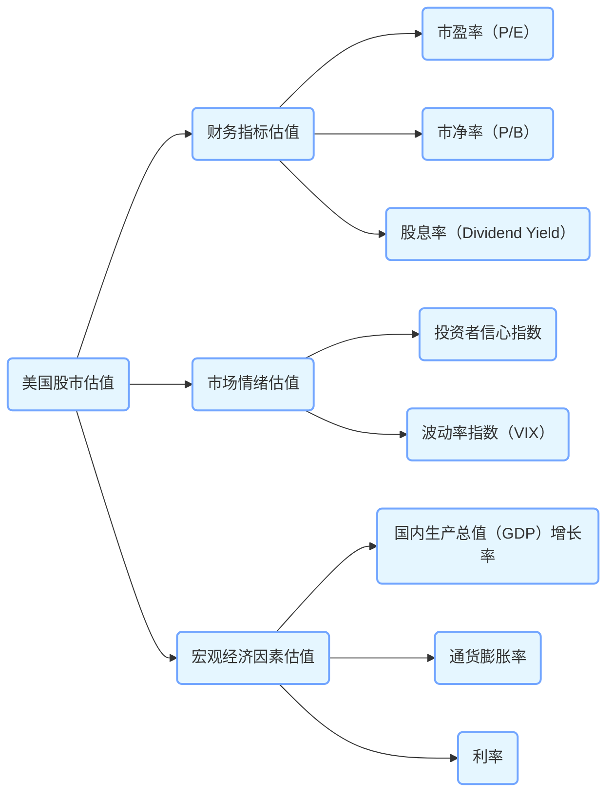

# 美国股市估值:多角度评估方法

> 关键词：美国股市估值、多角度评估、估值方法、财务指标、市场情绪

> 摘要：本文旨在全面探讨美国股市估值的多角度评估方法。通过深入分析不同的评估视角，包括财务指标、市场情绪、宏观经济因素等，详细阐述各种估值方法的原理、操作步骤以及数学模型。结合实际案例展示如何运用这些方法进行美国股市估值，并介绍相关的工具和资源。最后总结美国股市估值的未来发展趋势与挑战，为投资者和研究人员提供全面而深入的参考。

## 1. 背景介绍 
### 1.1 目的和范围
美国股市作为全球最大且最具影响力的金融市场之一，其估值情况对于投资者、金融机构和政策制定者都具有至关重要的意义。准确评估美国股市的价值有助于投资者做出合理的投资决策，帮助金融机构进行风险管理，为政策制定者提供市场健康状况的参考。本文的目的是系统地介绍多种多角度评估美国股市估值的方法，涵盖从微观的公司财务指标到宏观的市场和经济因素等多个层面。范围包括常见的估值指标、估值模型的原理和应用，以及如何结合实际情况运用这些方法进行综合评估。

### 1.2 预期读者
本文预期读者包括对美国股市投资感兴趣的个人投资者、专业的金融分析师、基金经理、金融研究机构的研究人员以及相关专业的学生等。无论您是初涉股市的新手，还是经验丰富的专业人士，都能从本文中获取关于美国股市估值的深入知识和实用方法。

### 1.3 文档结构概述
本文将按照以下结构展开：首先介绍核心概念与联系，明确美国股市估值相关的基本概念和它们之间的关系；接着阐述核心算法原理和具体操作步骤，通过Python代码详细说明常见估值方法的实现；然后讲解数学模型和公式，并结合实例进行说明；再通过项目实战展示如何运用这些方法进行实际的股市估值分析；之后探讨美国股市估值在不同场景下的实际应用；推荐相关的工具和资源，包括学习资料、开发工具和研究论文等；最后总结美国股市估值的未来发展趋势与挑战，并提供常见问题的解答和扩展阅读的参考资料。

### 1.4 术语表
#### 1.4.1 核心术语定义
- **市盈率（P/E Ratio）**：指股票价格除以每股收益（EPS）的比率，反映了投资者为获取公司每一元盈利所愿意支付的价格。
- **市净率（P/B Ratio）**：是股票价格与每股净资产的比率，用于衡量股票价格相对于每股净资产的高低。
- **股息率（Dividend Yield）**：指股息与股票价格的比率，反映了投资者通过股息获得的收益率。
- **自由现金流（Free Cash Flow）**：是企业产生的、在满足了再投资需要之后剩余的现金流量，这部分现金流量是在不影响公司持续发展的前提下可供分配给企业资本供应者的最大现金额。
- **市场情绪（Market Sentiment）**：是投资者对市场的总体看法和心理预期，会影响投资者的买卖决策，进而影响股市价格。

#### 1.4.2 相关概念解释
- **绝对估值法**：是通过对上市公司历史及当前的基本面的分析和对未来反映公司经营状况的财务数据的预测获得上市公司股票的内在价值。常见的绝对估值法有现金流贴现模型等。
- **相对估值法**：是使用市盈率、市净率、市销率、市现率等价格指标与其他多只股票（对比系）进行对比，如果低于对比系的相应的指标值的平均值，股票价格被低估，股价将很有希望上涨，使得指标回归对比系的平均值。
- **宏观经济因素**：包括国内生产总值（GDP）增长率、通货膨胀率、利率、汇率等，这些因素会对整个股市的估值产生影响。

#### 1.4.3 缩略词列表
- **EPS**：Earnings Per Share，每股收益
- **P/E**：Price-to-Earnings Ratio，市盈率
- **P/B**：Price-to-Book Ratio，市净率
- **FCF**：Free Cash Flow，自由现金流
- **GDP**：Gross Domestic Product，国内生产总值

## 2. 核心概念与联系 

### 核心概念原理
#### 财务指标估值
财务指标是评估美国股市估值的基础。市盈率（P/E）反映了市场对公司盈利的预期和投资者的估值水平。较高的P/E可能意味着市场对公司未来盈利增长有较高期望，但也可能表示股票被高估；较低的P/E则可能暗示股票被低估或公司盈利前景不佳。市净率（P/B）则从资产角度评估股票价值，P/B小于1可能表示股票价格低于公司净资产价值，具有一定的投资价值。股息率（Dividend Yield）体现了投资者从股息中获得的收益，高股息率的股票对于追求稳定收益的投资者具有吸引力。

#### 市场情绪估值
市场情绪是投资者对市场的整体心理状态和预期。当市场情绪乐观时，投资者更愿意买入股票，推动股价上涨，导致股市估值上升；反之，当市场情绪悲观时，投资者倾向于卖出股票，使股价下跌，股市估值下降。市场情绪可以通过各种指标来衡量，如投资者信心指数、波动率指数（VIX）等。

#### 宏观经济因素估值
宏观经济因素对美国股市估值有着重要影响。国内生产总值（GDP）增长率反映了经济的整体增长状况，较高的GDP增长率通常伴随着企业盈利的增加，从而提升股市估值；通货膨胀率会影响企业的成本和利润，以及投资者的实际收益率，进而影响股市估值；利率的变化会影响企业的融资成本和投资者的资金配置，利率上升可能导致股市资金流出，估值下降，利率下降则可能吸引资金流入股市，提升估值。

### 架构的文本示意图
```plaintext
美国股市估值
|-- 财务指标估值
|   |-- 市盈率（P/E）
|   |-- 市净率（P/B）
|   |-- 股息率（Dividend Yield）
|-- 市场情绪估值
|   |-- 投资者信心指数
|   |-- 波动率指数（VIX）
|-- 宏观经济因素估值
|   |-- 国内生产总值（GDP）增长率
|   |-- 通货膨胀率
|   |-- 利率
```

### Mermaid 流程图


## 3. 核心算法原理 & 具体操作步骤 

### 市盈率（P/E）计算原理与代码实现
#### 原理
市盈率（P/E）的计算公式为：$P/E = \frac{股票价格}{每股收益（EPS）}$。通过计算P/E，我们可以比较不同公司或同一公司在不同时期的估值水平。

#### Python代码实现
```python
def calculate_pe(stock_price, eps):
    """
    计算市盈率
    :param stock_price: 股票价格
    :param eps: 每股收益
    :return: 市盈率
    """
    if eps == 0:
        return float('inf')
    return stock_price / eps

# 示例
stock_price = 50
eps = 2
pe = calculate_pe(stock_price, eps)
print(f"市盈率: {pe}")
```

### 市净率（P/B）计算原理与代码实现
#### 原理
市净率（P/B）的计算公式为：$P/B = \frac{股票价格}{每股净资产}$。它用于评估股票价格相对于公司净资产的高低。

#### Python代码实现
```python
def calculate_pb(stock_price, book_value_per_share):
    """
    计算市净率
    :param stock_price: 股票价格
    :param book_value_per_share: 每股净资产
    :return: 市净率
    """
    if book_value_per_share == 0:
        return float('inf')
    return stock_price / book_value_per_share

# 示例
stock_price = 50
book_value_per_share = 10
pb = calculate_pb(stock_price, book_value_per_share)
print(f"市净率: {pb}")
```

### 股息率（Dividend Yield）计算原理与代码实现
#### 原理
股息率（Dividend Yield）的计算公式为：$Dividend Yield = \frac{每股股息}{股票价格} \times 100\%$。它反映了投资者通过股息获得的收益率。

#### Python代码实现
```python
def calculate_dividend_yield(dividend_per_share, stock_price):
    """
    计算股息率
    :param dividend_per_share: 每股股息
    :param stock_price: 股票价格
    :return: 股息率
    """
    if stock_price == 0:
        return 0
    return (dividend_per_share / stock_price) * 100

# 示例
dividend_per_share = 2
stock_price = 50
dividend_yield = calculate_dividend_yield(dividend_per_share, stock_price)
print(f"股息率: {dividend_yield}%")
```

## 4. 数学模型和公式 & 详细讲解 & 举例说明 

### 现金流贴现模型（DCF）
#### 数学模型和公式
现金流贴现模型（DCF）是一种常用的绝对估值方法，其基本公式为：

$$V = \sum_{t=1}^{n} \frac{FCF_t}{(1 + r)^t} + \frac{TV}{(1 + r)^n}$$

其中：
- $V$ 是股票的内在价值
- $FCF_t$ 是第 $t$ 期的自由现金流
- $r$ 是贴现率
- $n$ 是预测期数
- $TV$ 是终值

#### 详细讲解
现金流贴现模型的核心思想是将公司未来的自由现金流按照一定的贴现率折现到当前，得到公司的内在价值。自由现金流是公司在满足了再投资需求后剩余的现金流量，反映了公司实际可分配给投资者的现金。贴现率则考虑了资金的时间价值和投资风险，通常可以使用加权平均资本成本（WACC）来表示。终值是预测期结束后公司的持续价值，可以使用永续增长模型来计算，公式为：

$$TV = \frac{FCF_{n+1}}{r - g}$$

其中：
- $FCF_{n+1}$ 是预测期结束后下一期的自由现金流
- $g$ 是永续增长率

#### 举例说明
假设一家公司预计未来3年的自由现金流分别为100万元、120万元和150万元，贴现率为10%，预测期结束后公司的永续增长率为3%。预测期结束后下一期的自由现金流预计为150 * (1 + 3%) = 154.5万元。

首先计算终值：

$$TV = \frac{154.5}{0.1 - 0.03} = \frac{154.5}{0.07} \approx 2207.14 \text{万元}$$

然后计算各期现金流的现值：

第1年现金流现值：$\frac{100}{(1 + 0.1)^1} \approx 90.91$ 万元

第2年现金流现值：$\frac{120}{(1 + 0.1)^2} \approx 99.17$ 万元

第3年现金流现值：$\frac{150}{(1 + 0.1)^3} \approx 112.69$ 万元

终值现值：$\frac{2207.14}{(1 + 0.1)^3} \approx 1657.05$ 万元

最后计算公司的内在价值：

$V = 90.91 + 99.17 + 112.69 + 1657.05 = 1959.82$ 万元

### 相对估值法的比较模型
#### 数学模型和公式
相对估值法通常使用可比公司的估值指标来评估目标公司的价值。以市盈率为例，假设可比公司的平均市盈率为 $P/E_{avg}$，目标公司的每股收益为 $EPS_{target}$，则目标公司的估值 $V_{target}$ 为：

$$V_{target} = P/E_{avg} \times EPS_{target}$$

#### 详细讲解
相对估值法的原理是认为同行业或具有相似特征的公司应该具有相似的估值水平。通过选择一组可比公司，计算它们的平均估值指标，然后将目标公司的相应财务指标代入公式，得到目标公司的估值。这种方法简单易懂，易于操作，但需要注意可比公司的选择要合理，确保它们与目标公司在业务、规模、盈利能力等方面具有可比性。

#### 举例说明
假设在某行业中选择了3家可比公司，它们的市盈率分别为15、18和20，则可比公司的平均市盈率为：

$P/E_{avg} = \frac{15 + 18 + 20}{3} \approx 17.67$

目标公司的每股收益为2元，则目标公司的估值为：

$V_{target} = 17.67 \times 2 = 35.34$ 元

## 5. 项目实战：代码实际案例和详细解释说明 

### 5.1  开发环境搭建
#### 安装Python
首先需要安装Python环境，建议使用Python 3.7及以上版本。可以从Python官方网站（https://www.python.org/downloads/）下载安装包，按照安装向导进行安装。

#### 安装必要的库
在本项目中，我们需要使用一些Python库来获取和处理股票数据，如`pandas`用于数据处理，`yfinance`用于获取股票数据。可以使用以下命令进行安装：

```sh
pip install pandas yfinance
```

### 5.2  源代码详细实现和代码解读
```python
import yfinance as yf
import pandas as pd

# 定义获取股票数据的函数
def get_stock_data(ticker, start_date, end_date):
    """
    获取指定股票在指定日期范围内的数据
    :param ticker: 股票代码
    :param start_date: 开始日期
    :param end_date: 结束日期
    :return: 股票数据
    """
    stock = yf.Ticker(ticker)
    data = stock.history(start=start_date, end=end_date)
    return data

# 定义计算估值指标的函数
def calculate_valuation_metrics(data):
    """
    计算市盈率、市净率和股息率
    :param data: 股票数据
    :return: 估值指标
    """
    # 假设可以从data中获取到每股收益、每股净资产和每股股息
    # 这里只是示例，实际应用中需要根据具体情况获取这些数据
    eps = 2  # 每股收益
    book_value_per_share = 10  # 每股净资产
    dividend_per_share = 0.5  # 每股股息
    last_close_price = data['Close'].iloc[-1]  # 最后收盘价

    pe = last_close_price / eps
    pb = last_close_price / book_value_per_share
    dividend_yield = (dividend_per_share / last_close_price) * 100

    return pe, pb, dividend_yield

# 主函数
def main():
    ticker = 'AAPL'  # 苹果公司股票代码
    start_date = '2023-01-01'
    end_date = '2023-12-31'

    # 获取股票数据
    data = get_stock_data(ticker, start_date, end_date)

    # 计算估值指标
    pe, pb, dividend_yield = calculate_valuation_metrics(data)

    print(f"市盈率: {pe}")
    print(f"市净率: {pb}")
    print(f"股息率: {dividend_yield}%")

if __name__ == "__main__":
    main()
```

### 5.3  代码解读与分析
#### `get_stock_data` 函数
该函数使用`yfinance`库获取指定股票在指定日期范围内的历史数据。`yf.Ticker(ticker)`用于创建一个股票对象，`stock.history(start=start_date, end=end_date)`用于获取该股票在指定日期范围内的历史数据。

#### `calculate_valuation_metrics` 函数
该函数用于计算市盈率、市净率和股息率。在实际应用中，每股收益、每股净资产和每股股息需要从财务报表或其他数据源中获取，这里只是简单假设了这些值。通过最后收盘价和这些财务指标计算出相应的估值指标。

#### `main` 函数
主函数中首先定义了要分析的股票代码、开始日期和结束日期，然后调用`get_stock_data`函数获取股票数据，再调用`calculate_valuation_metrics`函数计算估值指标，最后打印出计算结果。

## 6. 实际应用场景 
### 投资者决策
投资者可以使用多角度评估方法来判断美国股市中某只股票或整个市场是否被高估或低估，从而做出买入、持有或卖出的决策。例如，当某只股票的市盈率低于同行业平均水平，且公司的基本面良好，投资者可能认为该股票被低估，具有投资价值，从而选择买入。

### 金融机构风险管理
金融机构如银行、基金公司等可以通过评估美国股市估值来管理投资组合的风险。当市场整体估值过高时，金融机构可以适当降低股票投资比例，增加债券等其他资产的配置，以降低投资组合的风险。

### 政策制定参考
政策制定者可以根据美国股市估值情况制定相关的金融政策。如果股市估值过高，可能存在泡沫风险，政策制定者可以采取措施加强监管，抑制过度投机；如果股市估值过低，可能会影响市场信心和经济发展，政策制定者可以出台一些刺激政策来促进股市稳定。

### 企业融资决策
对于美国的企业来说，股市估值情况会影响其融资决策。当股市估值较高时，企业可以通过发行股票来筹集更多的资金，扩大生产和投资；当股市估值较低时，企业可能会选择其他融资方式，如债券融资。

## 7. 工具和资源推荐
### 7.1 学习资源推荐
#### 7.1.1 书籍推荐
- 《聪明的投资者》（The Intelligent Investor）：作者本杰明·格雷厄姆（Benjamin Graham），这本书是价值投资的经典之作，介绍了股票投资的基本原理和方法，包括如何评估股票估值。
- 《证券分析》（Security Analysis）：同样是本杰明·格雷厄姆的著作，被誉为投资领域的圣经，深入探讨了证券估值的理论和实践。
- 《财务报表分析与证券定价》（Financial Statement Analysis and Security Valuation）：作者斯蒂芬·佩因曼（Stephen Penman），该书详细讲解了如何通过财务报表分析来评估证券的价值。

#### 7.1.2 在线课程
- Coursera上的“投资学原理”（Principles of Investments）：由知名大学教授授课，涵盖了股票估值、投资组合管理等内容。
- edX上的“金融市场”（Financial Markets）：耶鲁大学教授罗伯特·席勒（Robert Shiller）主讲，介绍了金融市场的基本原理和股票估值方法。

#### 7.1.3 技术博客和网站
- Seeking Alpha：提供专业的金融分析和投资建议，包括对美国股市的估值分析。
- Morningstar：提供股票、基金等金融产品的评级和分析，其研究报告中包含了对股票估值的评估。

### 7.2 开发工具框架推荐
#### 7.2.1 IDE和编辑器
- PyCharm：是一款专业的Python集成开发环境，具有代码编辑、调试、版本控制等功能，适合开发股票估值分析程序。
- Jupyter Notebook：可以将代码、文本和可视化结果集成在一个文档中，方便进行数据分析和展示，对于探索性的股票估值分析非常有用。

#### 7.2.2 调试和性能分析工具
- pdb：Python自带的调试工具，可以帮助开发者定位代码中的问题。
- cProfile：用于分析Python代码的性能，找出代码中的瓶颈，优化股票估值分析程序的运行效率。

#### 7.2.3 相关框架和库
- pandas：用于数据处理和分析，在获取和处理股票数据时非常方便。
- numpy：提供了高效的数值计算功能，可用于股票估值模型中的数学计算。
- scikit-learn：机器学习库，可以用于构建股票估值预测模型。

### 7.3 相关论文著作推荐
#### 7.3.1 经典论文
- “The Cross - Section of Expected Stock Returns”（Fama and French, 1992）：提出了著名的Fama - French三因子模型，用于解释股票收益率的差异，对股票估值有重要影响。
- “A Rational Theory of the Size Effect”（Banz, 1981）：研究了股票市值与收益率之间的关系，为股票估值提供了新的视角。

#### 7.3.2 最新研究成果
可以通过学术数据库如IEEE Xplore、ACM Digital Library等搜索关于美国股市估值的最新研究论文，了解该领域的前沿动态。

#### 7.3.3 应用案例分析
一些金融研究机构会发布关于美国股市估值的应用案例分析报告，如麦肯锡、波士顿咨询集团等的报告，可以从中学习到实际应用中如何运用各种估值方法。

## 8. 总结：未来发展趋势与挑战
### 未来发展趋势
#### 数据驱动的精细化估值
随着大数据和人工智能技术的发展，未来美国股市估值将更加依赖于海量的数据和先进的分析算法。通过整合更多的数据源，如社交媒体数据、宏观经济数据、企业运营数据等，可以实现更精细化的估值分析，提高估值的准确性。

#### 跨市场和跨资产类别的综合估值
美国股市与全球其他金融市场和资产类别之间的联系日益紧密。未来的估值方法将更加注重跨市场和跨资产类别的综合分析，考虑不同市场和资产之间的相互影响，提供更全面的投资决策依据。

#### 实时动态估值
金融市场的变化越来越快，实时动态估值将成为未来的发展方向。通过实时获取和分析市场数据，及时调整估值模型和结果，为投资者提供更及时的决策建议。

### 挑战
#### 数据质量和可用性
虽然数据量不断增加，但数据质量和可用性仍然是一个挑战。不准确或不完整的数据可能导致估值结果出现偏差，影响投资决策。此外，一些关键数据可能受到隐私和安全等因素的限制，获取难度较大。

#### 模型的复杂性和不确定性
随着估值模型的不断发展和完善，模型的复杂性也在增加。复杂的模型可能包含更多的假设和参数，增加了模型的不确定性。如何在保证模型准确性的同时，控制模型的复杂性和不确定性，是一个需要解决的问题。

#### 市场的不确定性和黑天鹅事件
金融市场充满了不确定性，黑天鹅事件（如金融危机、重大自然灾害等）可能会对美国股市估值产生巨大影响。这些事件往往难以预测，传统的估值方法可能无法有效应对，需要开发新的方法和模型来应对市场的不确定性。

## 9. 附录：常见问题与解答
### 问题1：如何选择合适的可比公司进行相对估值？
解答：选择可比公司时，应考虑以下因素：行业相同或相似，业务模式相似，规模相近，财务状况和盈利能力相近等。可以通过行业分类标准、财务报表分析等方法来筛选可比公司。

### 问题2：现金流贴现模型中的贴现率如何确定？
解答：贴现率通常可以使用加权平均资本成本（WACC）来表示。WACC的计算需要考虑公司的股权成本和债务成本，以及股权和债务的比例。股权成本可以使用资本资产定价模型（CAPM）来计算，债务成本可以根据公司的债券利率或贷款利率来确定。

### 问题3：市场情绪指标对股市估值的影响有多大？
解答：市场情绪指标对股市估值有重要影响，但影响程度难以精确量化。市场情绪乐观时，投资者愿意支付更高的价格购买股票，推动股市估值上升；市场情绪悲观时，投资者会降低对股票的估值。市场情绪指标可以作为估值分析的一个参考因素，但不能单独作为决策依据。

### 问题4：如何判断股市估值是否过高或过低？
解答：可以通过比较当前的估值指标（如市盈率、市净率等）与历史平均水平、同行业平均水平以及其他市场的估值水平来判断股市估值是否过高或过低。同时，还需要结合宏观经济因素、公司基本面等进行综合分析。

## 10. 扩展阅读 & 参考资料
### 扩展阅读
- 《漫步华尔街》（A Random Walk Down Wall Street）：作者伯顿·马尔基尔（Burton Malkiel），介绍了股票投资的随机漫步理论和不同的投资策略。
- 《非理性繁荣》（Irrational Exuberance）：罗伯特·席勒的著作，探讨了金融市场中的非理性行为和泡沫现象。

### 参考资料
- 美国证券交易委员会（SEC）官方网站：提供了大量的上市公司财务报表和监管信息。
- 美联储官方网站：发布美国的宏观经济数据和货币政策信息。
- Yahoo Finance：提供股票行情、财务数据等信息。

作者：AI天才研究院/AI Genius Institute & 禅与计算机程序设计艺术 /Zen And The Art of Computer Programming