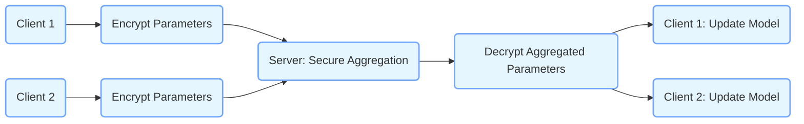

# 联邦学习中的安全聚合算法研究

> 关键词：联邦学习、安全聚合算法、隐私保护、密码学、分布式计算

> 摘要：本文聚焦于联邦学习中的安全聚合算法，旨在深入研究其原理、应用及发展。首先介绍了联邦学习和安全聚合算法的背景，明确研究目的与范围，界定相关术语。接着阐述核心概念及联系，通过文本示意图和 Mermaid 流程图展示原理架构。详细讲解核心算法原理，用 Python 代码阐述具体操作步骤，并给出数学模型和公式进行举例说明。通过项目实战，展示代码实现与解读。分析安全聚合算法在多个实际场景中的应用，推荐学习资源、开发工具框架及相关论文著作。最后总结未来发展趋势与挑战，解答常见问题，提供扩展阅读与参考资料，为深入研究联邦学习中的安全聚合算法提供全面且深入的指导。

## 1. 背景介绍 
### 1.1 目的和范围
随着数据隐私保护意识的不断增强，传统的数据集中式处理模式面临诸多挑战。联邦学习作为一种新兴的分布式机器学习范式，能够在不泄露原始数据的前提下进行模型训练，有效地解决了数据隐私和安全问题。而安全聚合算法是联邦学习中的关键技术之一，它确保在模型参数聚合过程中，各参与方的数据隐私不被泄露。本研究的目的在于全面深入地探讨联邦学习中的安全聚合算法，包括其原理、实现方法、应用场景以及未来发展趋势等方面。研究范围涵盖常见的安全聚合算法，如基于同态加密、秘密共享等技术的算法，并结合实际案例分析其在不同领域的应用。

### 1.2 预期读者
本文预期读者主要包括从事机器学习、数据隐私保护、密码学等领域的研究人员和开发者，以及对联邦学习技术感兴趣的专业人士。对于初学者，本文可以作为入门指南，帮助他们了解联邦学习中安全聚合算法的基本概念和原理；对于有一定经验的专业人员，本文提供了深入的技术分析和实际应用案例，可供他们进一步研究和实践参考。

### 1.3 文档结构概述
本文将按照以下结构展开：首先介绍联邦学习和安全聚合算法的相关背景知识，包括目的、预期读者和文档结构概述，以及对相关术语的定义和解释。接着详细阐述核心概念及其联系，通过文本示意图和 Mermaid 流程图直观展示其原理和架构。然后深入讲解核心算法原理，结合 Python 代码说明具体操作步骤，并给出数学模型和公式进行详细解释和举例。通过项目实战部分，展示如何搭建开发环境、实现源代码并进行解读分析。分析安全聚合算法在实际场景中的应用，推荐学习资源、开发工具框架和相关论文著作。最后总结未来发展趋势与挑战，解答常见问题，并提供扩展阅读和参考资料。

### 1.4 术语表
#### 1.4.1 核心术语定义
- **联邦学习（Federated Learning）**：一种分布式机器学习方法，多个参与方（如客户端）在不共享原始数据的情况下，通过与服务器协作共同训练模型。
- **安全聚合算法（Secure Aggregation Algorithm）**：在联邦学习中，用于安全地聚合各参与方模型参数的算法，确保聚合过程中数据隐私不被泄露。
- **同态加密（Homomorphic Encryption）**：一种特殊的加密技术，允许在密文上进行特定的计算，计算结果解密后与明文上进行相同计算的结果一致。
- **秘密共享（Secret Sharing）**：将一个秘密分割成多个份额，分发给不同的参与方，只有满足一定条件的参与方组合才能恢复出原始秘密。
- **模型参数（Model Parameters）**：机器学习模型中的可学习参数，如神经网络中的权重和偏置。

#### 1.4.2 相关概念解释
- **分布式机器学习（Distributed Machine Learning）**：将机器学习任务分布在多个计算节点上进行处理，以提高计算效率和处理大规模数据的能力。联邦学习是分布式机器学习的一种特殊形式，强调数据隐私保护。
- **数据隐私（Data Privacy）**：指保护个人或组织的数据不被未经授权的访问、使用和披露。在联邦学习中，数据隐私是核心关注点之一，安全聚合算法是保障数据隐私的重要手段。
- **密码学（Cryptography）**：研究信息加密、解密和认证等技术的学科，为安全聚合算法提供了理论基础和技术支持。

#### 1.4.3 缩略词列表
- **FL**：Federated Learning（联邦学习）
- **SA**：Secure Aggregation（安全聚合）
- **HE**：Homomorphic Encryption（同态加密）
- **SS**：Secret Sharing（秘密共享）

## 2. 核心概念与联系 
### 核心概念原理
联邦学习的核心思想是在多个参与方之间进行模型训练，而不直接共享原始数据。在联邦学习过程中，每个参与方（客户端）在本地使用自己的数据训练模型，然后将模型参数上传到服务器进行聚合。安全聚合算法的作用是确保在参数聚合过程中，各参与方的模型参数隐私不被泄露。

常见的安全聚合算法基于密码学技术，如同态加密和秘密共享。同态加密允许在密文上进行特定的计算，服务器可以在不解密的情况下对加密后的模型参数进行聚合，最后将聚合结果发送给参与方进行解密。秘密共享则是将模型参数分割成多个份额，分发给不同的参与方，服务器通过收集这些份额进行聚合，只有满足一定条件的参与方组合才能恢复出原始参数。

### 文本示意图
```plaintext
+-----------------+          +-----------------+
|    Client 1     |          |    Client 2     |
|  (Local Model)  |          |  (Local Model)  |
+-----------------+          +-----------------+
       |                            |
       | (Encrypted Parameters)     | (Encrypted Parameters)
       v                            v
+-----------------+
|    Server       |
| (Secure Aggregation)
+-----------------+
       |
       | (Aggregated Parameters)
       v
+-----------------+
|    Clients      |
| (Update Models) |
+-----------------+
```

### Mermaid 流程图


该流程图展示了联邦学习中安全聚合的基本流程。客户端首先对本地模型参数进行加密，然后将加密后的参数发送到服务器。服务器进行安全聚合操作，最后将聚合后的参数发送回客户端进行解密和模型更新。

## 3. 核心算法原理 & 具体操作步骤 
### 基于同态加密的安全聚合算法原理
同态加密是一种强大的密码学技术，它允许在密文上进行特定的计算。在联邦学习的安全聚合中，我们可以利用同态加密的加法同态性，即对两个密文进行加法运算，解密后得到的结果等于对相应明文进行加法运算的结果。

具体来说，每个客户端使用公钥对本地模型参数进行加密，然后将加密后的参数发送到服务器。服务器在不解密的情况下，对这些加密参数进行加法聚合。最后，服务器将聚合后的密文发送给客户端，客户端使用私钥进行解密，得到聚合后的模型参数。

### Python 代码实现
```python
import phe  # Paillier Homomorphic Encryption library

# 生成公私钥对
public_key, private_key = phe.generate_paillier_keypair()

# 模拟客户端数据
client1_params = [1, 2, 3]
client2_params = [4, 5, 6]

# 客户端加密参数
encrypted_client1 = [public_key.encrypt(param) for param in client1_params]
encrypted_client2 = [public_key.encrypt(param) for param in client2_params]

# 服务器聚合加密参数
aggregated_encrypted = []
for i in range(len(encrypted_client1)):
    aggregated_encrypted.append(encrypted_client1[i] + encrypted_client2[i])

# 客户端解密聚合后的参数
decrypted_aggregated = [private_key.decrypt(param) for param in aggregated_encrypted]

print("Aggregated parameters:", decrypted_aggregated)
```
### 代码解释
1. **生成公私钥对**：使用 `phe.generate_paillier_keypair()` 函数生成 Paillier 同态加密的公私钥对。
2. **模拟客户端数据**：定义两个客户端的模型参数列表 `client1_params` 和 `client2_params`。
3. **客户端加密参数**：每个客户端使用公钥对本地模型参数进行加密，得到加密后的参数列表 `encrypted_client1` 和 `encrypted_client2`。
4. **服务器聚合加密参数**：服务器在不解密的情况下，对加密后的参数进行加法聚合，得到聚合后的加密参数列表 `aggregated_encrypted`。
5. **客户端解密聚合后的参数**：客户端使用私钥对聚合后的加密参数进行解密，得到最终的聚合参数列表 `decrypted_aggregated`。

### 基于秘密共享的安全聚合算法原理
秘密共享是将一个秘密分割成多个份额，分发给不同的参与方。在联邦学习中，每个客户端将本地模型参数进行秘密共享，生成多个份额，并将这些份额分发给其他客户端。服务器收集这些份额进行聚合，只有满足一定条件的参与方组合才能恢复出原始参数。

### Python 代码实现
```python
import random

# 秘密共享参数
n = 5  # 参与方数量
k = 3  # 恢复秘密所需的最少参与方数量

def share_secret(secret, n, k):
    coefficients = [secret] + [random.randint(1, 100) for _ in range(k - 1)]
    shares = []
    for x in range(1, n + 1):
        share = 0
        for i, coef in enumerate(coefficients):
            share += coef * (x ** i)
        shares.append(share)
    return shares

def reconstruct_secret(shares, k):
    from sympy import symbols, solve
    x = symbols('x')
    equations = []
    for i, share in enumerate(shares[:k]):
        equation = 0
        for j in range(k):
            equation += symbols(f'a{j}') * ((i + 1) ** j) - share
        equations.append(equation)
    solution = solve(equations, [symbols(f'a{j}') for j in range(k)])
    return solution[symbols('a0')]

# 模拟客户端数据
client_params = [10, 20, 30]

# 客户端进行秘密共享
all_shares = []
for param in client_params:
    shares = share_secret(param, n, k)
    all_shares.append(shares)

# 服务器收集部分份额进行聚合
selected_shares = []
for share_list in all_shares:
    selected_shares.append(share_list[:k])

# 服务器聚合份额
aggregated_params = []
for shares in selected_shares:
    aggregated_params.append(reconstruct_secret(shares, k))

print("Aggregated parameters:", aggregated_params)
```
### 代码解释
1. **秘密共享参数设置**：设置参与方数量 `n` 和恢复秘密所需的最少参与方数量 `k`。
2. **秘密共享函数 `share_secret`**：将一个秘密分割成 `n` 个份额，每个份额由一个多项式计算得到。
3. **秘密恢复函数 `reconstruct_secret`**：根据 `k` 个份额，使用拉格朗日插值法恢复出原始秘密。
4. **模拟客户端数据**：定义客户端的模型参数列表 `client_params`。
5. **客户端进行秘密共享**：每个客户端对本地模型参数进行秘密共享，生成多个份额。
6. **服务器收集部分份额进行聚合**：服务器收集部分份额，使用秘密恢复函数恢复出聚合后的模型参数。

## 4. 数学模型和公式 & 详细讲解 & 举例说明 
### 同态加密的数学模型和公式
同态加密的加法同态性可以用以下数学公式表示：

设 $E$ 为加密函数，$D$ 为解密函数，$m_1$ 和 $m_2$ 为两个明文消息，$c_1 = E(m_1)$ 和 $c_2 = E(m_2)$ 为对应的密文消息。则有：

$$D(c_1 + c_2) = D(E(m_1) + E(m_2)) = m_1 + m_2$$

以 Paillier 同态加密为例，其加密和解密算法如下：

#### 密钥生成
- 选择两个大素数 $p$ 和 $q$，计算 $n = pq$ 和 $\lambda = lcm(p - 1, q - 1)$。
- 选择随机整数 $g$ 使得 $gcd(L(g^{\lambda} \bmod n^2), n) = 1$，其中 $L(u) = \frac{u - 1}{n}$。
- 公钥为 $(n, g)$，私钥为 $(\lambda)$。

#### 加密
对于明文消息 $m \in \mathbb{Z}_n$，选择随机整数 $r \in \mathbb{Z}_n^*$，计算密文 $c = g^m r^n \bmod n^2$。

#### 解密
对于密文 $c \in \mathbb{Z}_{n^2}$，计算明文 $m = L(c^{\lambda} \bmod n^2) / L(g^{\lambda} \bmod n^2) \bmod n$。

### 举例说明
假设我们有两个明文消息 $m_1 = 3$ 和 $m_2 = 5$，使用 Paillier 同态加密进行加密。

- 密钥生成：选择 $p = 3$，$q = 5$，则 $n = pq = 15$，$\lambda = lcm(p - 1, q - 1) = lcm(2, 4) = 4$。选择 $g = 2$，公钥为 $(n = 15, g = 2)$，私钥为 $(\lambda = 4)$。
- 加密：
  - 对于 $m_1 = 3$，选择 $r_1 = 2$，则 $c_1 = g^{m_1} r_1^n \bmod n^2 = 2^3 \times 2^{15} \bmod 225 = 8 \times 32768 \bmod 225 = 8 \times 173 \bmod 225 = 1384 \bmod 225 = 184$。
  - 对于 $m_2 = 5$，选择 $r_2 = 3$，则 $c_2 = g^{m_2} r_2^n \bmod n^2 = 2^5 \times 3^{15} \bmod 225 = 32 \times 14348907 \bmod 225 = 32 \times 12 \bmod 225 = 384 \bmod 225 = 159$。
- 聚合：$c = c_1 + c_2 = 184 + 159 = 343 \bmod 225 = 118$。
- 解密：$m = L(c^{\lambda} \bmod n^2) / L(g^{\lambda} \bmod n^2) \bmod n = L(118^4 \bmod 225) / L(2^4 \bmod 225) \bmod 15 = L(1) / L(16) \bmod 15 = 0 / 1 \bmod 15 = 8$。

### 秘密共享的数学模型和公式
秘密共享通常基于多项式插值原理。设秘密为 $s$，我们构造一个 $k - 1$ 次多项式 $f(x)$：

$$f(x) = a_0 + a_1x + a_2x^2 + \cdots + a_{k - 1}x^{k - 1}$$

其中 $a_0 = s$，$a_1, a_2, \cdots, a_{k - 1}$ 为随机系数。

我们选择 $n$ 个不同的 $x$ 值 $x_1, x_2, \cdots, x_n$，计算 $y_i = f(x_i)$，则 $(x_i, y_i)$ 为一个份额。

根据拉格朗日插值公式，给定 $k$ 个份额 $(x_1, y_1), (x_2, y_2), \cdots, (x_k, y_k)$，可以恢复出多项式 $f(x)$，进而得到秘密 $s = f(0)$：

$$f(0) = \sum_{i = 1}^{k} y_i \prod_{j \neq i} \frac{-x_j}{x_i - x_j}$$

### 举例说明
假设我们要共享秘密 $s = 10$，$n = 5$，$k = 3$。

- 构造多项式：选择随机系数 $a_1 = 2$，$a_2 = 3$，则 $f(x) = 10 + 2x + 3x^2$。
- 生成份额：
  - 当 $x_1 = 1$ 时，$y_1 = f(1) = 10 + 2 \times 1 + 3 \times 1^2 = 15$。
  - 当 $x_2 = 2$ 时，$y_2 = f(2) = 10 + 2 \times 2 + 3 \times 2^2 = 26$。
  - 当 $x_3 = 3$ 时，$y_3 = f(3) = 10 + 2 \times 3 + 3 \times 3^2 = 43$。
  - 当 $x_4 = 4$ 时，$y_4 = f(4) = 10 + 2 \times 4 + 3 \times 4^2 = 66$。
  - 当 $x_5 = 5$ 时，$y_5 = f(5) = 10 + 2 \times 5 + 3 \times 5^2 = 95$。

- 恢复秘密：假设我们有份额 $(x_1 = 1, y_1 = 15)$，$(x_2 = 2, y_2 = 26)$，$(x_3 = 3, y_3 = 43)$。

根据拉格朗日插值公式：

$$f(0) = 15 \times \frac{-2 \times (-3)}{(1 - 2) \times (1 - 3)} + 26 \times \frac{-1 \times (-3)}{(2 - 1) \times (2 - 3)} + 43 \times \frac{-1 \times (-2)}{(3 - 1) \times (3 - 2)}$$

$$= 15 \times 3 + 26 \times (-3) + 43 \times 1 = 45 - 78 + 43 = 10$$

## 5. 项目实战：代码实际案例和详细解释说明 
### 5.1  开发环境搭建
#### 安装 Python
首先，确保你已经安装了 Python 环境。可以从 Python 官方网站（https://www.python.org/downloads/）下载并安装适合你操作系统的 Python 版本。建议使用 Python 3.6 及以上版本。

#### 安装必要的库
在本项目中，我们需要安装 `phe` 库用于同态加密，以及 `sympy` 库用于符号计算。可以使用以下命令进行安装：
```sh
pip install phe sympy
```

### 5.2  源代码详细实现和代码解读
以下是一个完整的联邦学习安全聚合项目示例，结合了同态加密和秘密共享的思想。

```python
import phe  # Paillier Homomorphic Encryption library
import random
from sympy import symbols, solve

# 生成公私钥对
public_key, private_key = phe.generate_paillier_keypair()

# 秘密共享参数
n = 5  # 参与方数量
k = 3  # 恢复秘密所需的最少参与方数量

def share_secret(secret, n, k):
    coefficients = [secret] + [random.randint(1, 100) for _ in range(k - 1)]
    shares = []
    for x in range(1, n + 1):
        share = 0
        for i, coef in enumerate(coefficients):
            share += coef * (x ** i)
        shares.append(share)
    return shares

def reconstruct_secret(shares, k):
    x = symbols('x')
    equations = []
    for i, share in enumerate(shares[:k]):
        equation = 0
        for j in range(k):
            equation += symbols(f'a{j}') * ((i + 1) ** j) - share
        equations.append(equation)
    solution = solve(equations, [symbols(f'a{j}') for j in range(k)])
    return solution[symbols('a0')]

# 模拟客户端数据
client1_params = [1, 2, 3]
client2_params = [4, 5, 6]

# 客户端加密参数
encrypted_client1 = [public_key.encrypt(param) for param in client1_params]
encrypted_client2 = [public_key.encrypt(param) for param in client2_params]

# 客户端进行秘密共享
all_shares_client1 = []
all_shares_client2 = []
for param in client1_params:
    shares = share_secret(param, n, k)
    all_shares_client1.append(shares)
for param in client2_params:
    shares = share_secret(param, n, k)
    all_shares_client2.append(shares)

# 服务器收集部分份额进行聚合
selected_shares_client1 = []
selected_shares_client2 = []
for share_list in all_shares_client1:
    selected_shares_client1.append(share_list[:k])
for share_list in all_shares_client2:
    selected_shares_client2.append(share_list[:k])

# 服务器聚合份额
aggregated_params_secret_sharing = []
for shares1, shares2 in zip(selected_shares_client1, selected_shares_client2):
    param1 = reconstruct_secret(shares1, k)
    param2 = reconstruct_secret(shares2, k)
    aggregated_params_secret_sharing.append(param1 + param2)

# 服务器聚合加密参数
aggregated_encrypted = []
for i in range(len(encrypted_client1)):
    aggregated_encrypted.append(encrypted_client1[i] + encrypted_client2[i])

# 客户端解密聚合后的参数
decrypted_aggregated = [private_key.decrypt(param) for param in aggregated_encrypted]

print("Aggregated parameters using homomorphic encryption:", decrypted_aggregated)
print("Aggregated parameters using secret sharing:", aggregated_params_secret_sharing)
```

### 代码解读与分析
#### 同态加密部分
1. **生成公私钥对**：使用 `phe.generate_paillier_keypair()` 函数生成 Paillier 同态加密的公私钥对。
2. **模拟客户端数据**：定义两个客户端的模型参数列表 `client1_params` 和 `client2_params`。
3. **客户端加密参数**：每个客户端使用公钥对本地模型参数进行加密，得到加密后的参数列表 `encrypted_client1` 和 `encrypted_client2`。
4. **服务器聚合加密参数**：服务器在不解密的情况下，对加密后的参数进行加法聚合，得到聚合后的加密参数列表 `aggregated_encrypted`。
5. **客户端解密聚合后的参数**：客户端使用私钥对聚合后的加密参数进行解密，得到最终的聚合参数列表 `decrypted_aggregated`。

#### 秘密共享部分
1. **秘密共享参数设置**：设置参与方数量 `n` 和恢复秘密所需的最少参与方数量 `k`。
2. **秘密共享函数 `share_secret`**：将一个秘密分割成 `n` 个份额，每个份额由一个多项式计算得到。
3. **秘密恢复函数 `reconstruct_secret`**：根据 `k` 个份额，使用拉格朗日插值法恢复出原始秘密。
4. **客户端进行秘密共享**：每个客户端对本地模型参数进行秘密共享，生成多个份额。
5. **服务器收集部分份额进行聚合**：服务器收集部分份额，使用秘密恢复函数恢复出聚合后的模型参数。

通过结合同态加密和秘密共享，我们可以进一步增强联邦学习中安全聚合的安全性。

## 6. 实际应用场景 
### 医疗领域
在医疗领域，患者的病历数据包含大量敏感信息，如个人病史、诊断结果等。传统的集中式数据处理方式可能会导致患者隐私泄露的风险。联邦学习中的安全聚合算法可以在不共享患者原始数据的情况下，让多个医疗机构共同训练疾病预测模型。例如，多家医院可以在本地使用自己的患者数据训练模型，然后通过安全聚合算法将模型参数上传到服务器进行聚合，最终得到一个更准确的疾病预测模型。这样既保护了患者的隐私，又提高了模型的性能。

### 金融领域
金融机构拥有大量的客户交易数据，这些数据涉及客户的财务状况和隐私信息。在进行风险评估、欺诈检测等任务时，金融机构可以采用联邦学习和安全聚合算法。不同的银行可以在本地使用自己的客户数据训练模型，然后将加密后的模型参数上传到服务器进行聚合。服务器可以根据聚合后的模型参数进行全局风险评估和欺诈检测，而不会泄露任何一家银行的客户数据。

### 智能交通领域
在智能交通系统中，各个交通节点（如路口的传感器、车辆等）会产生大量的交通数据。这些数据包含了车辆行驶轨迹、交通流量等信息，具有一定的隐私性。通过联邦学习和安全聚合算法，不同的交通节点可以在本地处理自己的数据，然后将模型参数进行安全聚合。这样可以在不泄露交通数据隐私的情况下，共同训练交通流量预测模型、自动驾驶模型等，提高交通系统的效率和安全性。

### 工业物联网领域
在工业物联网中，各个生产设备会产生大量的运行数据，这些数据对于优化生产流程、预测设备故障等具有重要价值。但这些数据也涉及企业的生产机密和隐私。采用联邦学习和安全聚合算法，不同的生产设备可以在本地使用自己的数据训练模型，然后将模型参数进行安全聚合。这样可以在不泄露企业数据隐私的情况下，实现设备的远程监控和智能维护，提高工业生产的效率和可靠性。

## 7. 工具和资源推荐
### 7.1 学习资源推荐
#### 7.1.1 书籍推荐
- 《联邦学习》：全面介绍了联邦学习的基本概念、算法原理和应用场景，是学习联邦学习的经典书籍。
- 《密码学原理与实践》：详细讲解了密码学的基本原理和常用算法，为理解安全聚合算法提供了坚实的理论基础。
- 《机器学习》：涵盖了机器学习的基本概念、算法和模型，对于理解联邦学习中的模型训练和参数聚合有很大帮助。

#### 7.1.2 在线课程
- Coursera 上的 “Federated Learning for Data Privacy and Confidentiality”：由知名专家授课，系统介绍了联邦学习的理论和实践。
- edX 上的 “Cryptography I”：讲解了密码学的基础知识和常见算法，是学习安全聚合算法的重要课程。
- 网易云课堂上的 “机器学习实战”：通过实际案例介绍了机器学习的应用和实现，有助于理解联邦学习中的模型训练过程。

#### 7.1.3 技术博客和网站
- Medium 上的 “Federated Learning” 专栏：汇集了联邦学习领域的最新研究成果和实践经验。
- 谷歌的 TensorFlow Federated 官方文档：提供了 TensorFlow Federated 框架的详细介绍和使用指南。
- 百度的 PaddleFL 官方网站：介绍了 PaddleFL 框架的特点和应用场景，以及相关的技术文章和案例。

### 7.2 开发工具框架推荐
#### 7.2.1 IDE和编辑器
- PyCharm：一款功能强大的 Python 集成开发环境，提供了代码编辑、调试、版本控制等功能，适合开发联邦学习项目。
- Jupyter Notebook：一种交互式的开发环境，支持 Python 代码的实时运行和可视化展示，方便进行算法实验和数据分析。
- Visual Studio Code：一款轻量级的代码编辑器，支持多种编程语言和插件扩展，可用于开发和调试联邦学习项目。

#### 7.2.2 调试和性能分析工具
- PySnooper：一个简单易用的 Python 调试工具，可以自动记录函数的调用过程和变量的值，方便排查代码问题。
- cProfile：Python 内置的性能分析工具，可以统计函数的调用次数、执行时间等信息，帮助优化代码性能。
- TensorBoard：TensorFlow 提供的可视化工具，可以用于监控模型训练过程、可视化模型结构和性能指标。

#### 7.2.3 相关框架和库
- TensorFlow Federated：谷歌开发的联邦学习框架，提供了丰富的 API 和工具，支持多种联邦学习算法和模型。
- PaddleFL：百度开发的联邦学习框架，具有高效、易用、安全等特点，支持多种深度学习模型和算法。
- PySyft：一个用于隐私保护深度学习的 Python 库，提供了同态加密、差分隐私等技术的实现，可用于构建安全的联邦学习系统。

### 7.3 相关论文著作推荐
#### 7.3.1 经典论文
- “Communication-Efficient Learning of Deep Networks from Decentralized Data”：提出了联邦平均算法（Federated Averaging），是联邦学习领域的经典论文。
- “Practical Secure Aggregation for Privacy-Preserving Machine Learning”：介绍了一种实用的安全聚合算法，用于保护机器学习中的数据隐私。
- “Homomorphic Encryption for Machine Learning: A Survey”：对同态加密在机器学习中的应用进行了全面的综述。

#### 7.3.2 最新研究成果
- 每年的 NeurIPS、ICML、CVPR 等顶级机器学习会议上都会有关于联邦学习和安全聚合算法的最新研究成果发表。
- arXiv 预印本平台上也有很多关于联邦学习的最新研究论文，可以及时了解该领域的研究动态。

#### 7.3.3 应用案例分析
- 一些知名企业和研究机构会发布关于联邦学习在实际应用中的案例分析报告，如谷歌、百度、微软等公司的技术博客和研究报告。这些案例分析可以帮助我们了解联邦学习和安全聚合算法在不同领域的应用实践和效果。

## 8. 总结：未来发展趋势与挑战
### 未来发展趋势
#### 算法优化
随着研究的深入，未来的安全聚合算法将更加高效、安全。例如，研究人员将不断改进同态加密和秘密共享算法，提高其计算效率和安全性，减少通信开销和计算复杂度。同时，会探索新的密码学技术和算法，以满足不同场景下的安全聚合需求。

#### 多模态数据融合
在实际应用中，数据往往具有多种模态，如图像、文本、音频等。未来的联邦学习系统将支持多模态数据的安全聚合，能够在不泄露不同模态数据隐私的情况下，共同训练更加复杂和强大的模型。例如，在医疗领域，可以将患者的病历文本、影像数据等多模态信息进行融合，提高疾病诊断的准确性。

#### 与其他技术融合
联邦学习和安全聚合算法将与其他新兴技术如区块链、物联网、人工智能等进行深度融合。例如，结合区块链的去中心化和不可篡改特性，可以构建更加可信的联邦学习网络；与物联网技术结合，可以实现海量设备数据的安全聚合和智能分析。

#### 跨领域应用拓展
随着数据隐私保护意识的不断提高，联邦学习和安全聚合算法将在更多领域得到应用。除了医疗、金融、交通等领域，还将拓展到教育、能源、农业等领域，为各个行业的数据隐私保护和协同发展提供支持。

### 挑战
#### 计算资源限制
安全聚合算法通常需要较高的计算资源，特别是同态加密和秘密共享算法，其计算复杂度较高。在一些资源受限的设备上，如物联网设备、移动终端等，实现安全聚合算法可能会面临计算资源不足的问题。因此，需要研究适用于资源受限设备的轻量级安全聚合算法。

#### 通信开销
在联邦学习中，安全聚合需要进行大量的数据传输，这会带来较大的通信开销。特别是在大规模分布式系统中，通信开销可能会成为系统性能的瓶颈。因此，需要研究高效的通信协议和算法，减少通信开销，提高系统的通信效率。

#### 安全威胁
虽然安全聚合算法可以在一定程度上保护数据隐私，但仍然面临着各种安全威胁。例如，攻击者可能会通过侧信道攻击、恶意参与方攻击等方式获取数据隐私信息。因此，需要不断加强安全聚合算法的安全性分析和防御机制，应对各种安全威胁。

#### 标准和规范缺乏
目前，联邦学习和安全聚合算法的标准和规范还不够完善。不同的实现和应用可能存在差异，这给系统的互操作性和兼容性带来了挑战。因此，需要制定统一的标准和规范，促进联邦学习和安全聚合算法的健康发展。

## 9. 附录：常见问题与解答
### 1. 安全聚合算法是否能完全保证数据隐私？
安全聚合算法可以在很大程度上保护数据隐私，但不能完全保证。虽然同态加密和秘密共享等技术可以防止服务器和其他参与方直接获取原始数据，但仍然存在一些潜在的安全风险，如侧信道攻击、恶意参与方攻击等。因此，在实际应用中，还需要结合其他安全措施，如访问控制、审计跟踪等，来进一步保障数据隐私。

### 2. 安全聚合算法的计算复杂度如何？
安全聚合算法的计算复杂度通常较高，特别是同态加密和秘密共享算法。同态加密需要进行大量的加密和解密运算，其计算复杂度与加密算法的具体实现和数据规模有关。秘密共享算法需要进行多项式插值和系数计算，也会带来一定的计算开销。因此，在实际应用中，需要根据具体场景和需求，选择合适的安全聚合算法，并进行优化和改进。

### 3. 如何选择适合的安全聚合算法？
选择适合的安全聚合算法需要考虑多个因素，如数据隐私要求、计算资源限制、通信开销、系统规模等。如果对数据隐私要求较高，且计算资源和通信带宽充足，可以选择基于同态加密的安全聚合算法；如果计算资源有限，且对通信开销较为敏感，可以选择基于秘密共享的安全聚合算法。同时，还需要考虑算法的安全性、效率和可扩展性等方面。

### 4. 联邦学习和安全聚合算法是否适用于所有场景？
联邦学习和安全聚合算法并不适用于所有场景。它们主要适用于需要保护数据隐私的分布式机器学习场景，如医疗、金融、交通等领域。在一些对数据隐私要求不高，或者数据可以集中处理的场景下，传统的机器学习方法可能更加适用。因此，在实际应用中，需要根据具体场景和需求，选择合适的机器学习方法。

## 10. 扩展阅读 & 参考资料
### 扩展阅读
- 《人工智能时代的数据隐私保护》：深入探讨了人工智能领域的数据隐私问题和保护方法，为理解联邦学习和安全聚合算法的背景和意义提供了更广阔的视角。
- 《区块链与分布式系统》：介绍了区块链的基本原理和应用，以及与分布式系统的结合，有助于理解联邦学习和安全聚合算法与区块链技术的融合。
- 《物联网安全技术》：讲解了物联网领域的安全问题和技术解决方案，对于理解联邦学习和安全聚合算法在物联网中的应用有一定的帮助。

### 参考资料
- 《Federated Learning: Challenges, Methods, and Future Directions》
- 《Practical Homomorphic Encryption for Machine Learning》
- 《Secret Sharing Schemes: A Survey》
- TensorFlow Federated 官方文档（https://www.tensorflow.org/federated）
- PaddleFL 官方网站（https://github.com/PaddlePaddle/PaddleFL）
- PySyft 官方文档（https://github.com/OpenMined/PySyft）

作者：AI天才研究院/AI Genius Institute & 禅与计算机程序设计艺术 /Zen And The Art of Computer Programming